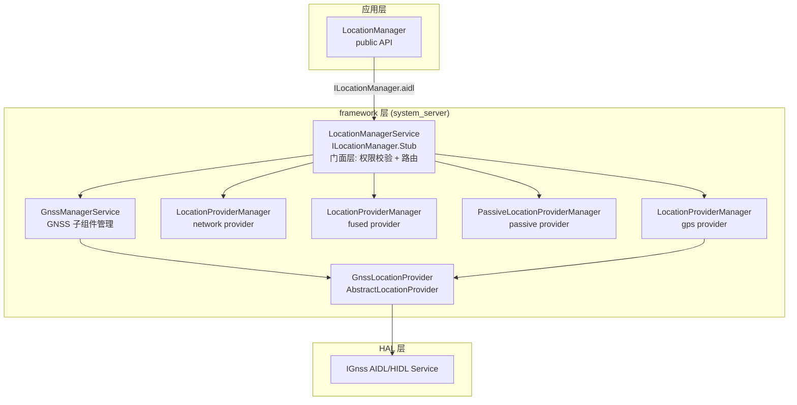

# LocationManagerService 详细设计

> 基于 AOSP 源码分析，文件路径相对于 `frameworks/base/`。

---

## 一、总体架构



### 已读取的关键源文件

| 文件 | 关键类 | 说明 |
|------|--------|------|
| `location/java/android/location/LocationManager.java` | `LocationManager` | 公开 API |
| `services/.../location/LocationManagerService.java` | `LocationManagerService` | 门面层，Binder 入口 |
| `services/.../location/provider/LocationProviderManager.java` | `LocationProviderManager` | 多路复用器，管理单个 Provider |
| `services/.../location/provider/AbstractLocationProvider.java` | `AbstractLocationProvider` | Provider 抽象基类 |
| `services/.../location/provider/MockableLocationProvider.java` | `MockableLocationProvider` | Mock/Real 代理 |
| `services/.../location/gnss/GnssManagerService.java` | `GnssManagerService` | GNSS 组件管理 |
| `services/.../location/gnss/GnssLocationProvider.java` | `GnssLocationProvider` | GPS Provider 实现 |
| `services/.../location/listeners/ListenerMultiplexer.java` | `ListenerMultiplexer` | 通用多路复用器基类 |

---

## 二、分层设计

系统分为四层，从上到下依次为:

```
┌──────────────────────────────────────────────┐
│  LocationManager (公开 API)                    │  ← App 调用入口
├──────────────────────────────────────────────┤
│  LocationManagerService (门面层)               │  ← Binder Stub, 权限 + 路由
├──────────────────────────────────────────────┤
│  LocationProviderManager (多路复用层)          │  ← ListenerMultiplexer 子类
├──────────────────────────────────────────────┤
│  AbstractLocationProvider (Provider 抽象基类)   │  ← Controller/Provider 模式
│    └── GnssLocationProvider (GPS 实现)         │
└──────────────────────────────────────────────┘
```

### 2.1 LocationManager — 公开 API 层

文件: `location/java/android/location/LocationManager.java`

对外暴露的核心 API:

| API | 说明 |
|-----|------|
| `requestLocationUpdates(provider, request, executor, listener)` | 注册位置监听 |
| `removeUpdates(listener)` | 取消监听 |
| `getCurrentLocation(provider, ...)` | 单次位置查询 |
| `setAutomotiveGnssSuspended(boolean)` | AAOS 专用: 挂起/恢复 GNSS |
| `isLocationEnabled()` | 检查位置开关状态 |

每条 API 调用通过 AIDL 跨进程传递到 `LocationManagerService`。`LocationManager` 不包含任何业务逻辑，只是薄代理。

### 2.2 LocationManagerService — 门面层 (Binder 入口)

文件: `services/.../location/LocationManagerService.java`

```
class LocationManagerService extends ILocationManager.Stub
    implements LocationProviderManager.StateChangedListener
```

**职责:**
- Binder 入口: 实现 `ILocationManager.aidl` 定义的所有方法
- 权限校验: `checkLocationPermission()`, `checkCallerIsProvider()`
- Provider 路由: 根据 provider name 找到对应的 `LocationProviderManager`
- 生命周期管理: 通过内部 `Lifecycle extends SystemService` 控制

**核心字段:**

```java
// 所有 Provider Manager 的集合
CopyOnWriteArrayList<LocationProviderManager> mProviderManagers;

// 被动 Provider (接收所有 provider 的位置)
PassiveLocationProviderManager mPassiveManager;

// GNSS 管理器 (管理 GnssLocationProvider 等子组件)
GnssManagerService mGnssManagerService;
```

**`setAutomotiveGnssSuspended()` 调用链：**

```
LocationManager.setAutomotiveGnssSuspended(suspended)
  → ILocationManager.setAutomotiveGnssSuspended(suspended)  // Binder
    → LocationManagerService.setAutomotiveGnssSuspended(suspended)
      → 检查 CONTROL_AUTOMOTIVE_GNSS 权限
      → 检查 FEATURE_AUTOMOTIVE
      → mGnssManagerService.setAutomotiveGnssSuspended(suspended)
        → mGnssLocationProvider.setAutomotiveGnssSuspended(suspended)
```

**`requestLocationUpdates()` 调用链：**

```
LocationManager.requestLocationUpdates(provider, request, executor, listener)
  → 创建 LocationListenerTransport(listener, executor)
  → ILocationManager.registerLocationListener(request, identity, listener)
    → LocationManagerService.registerLocationListener(...)
      → 权限校验 + provider 解析
      → manager.registerLocationRequest(request, identity, permissionLevel, transport)
```

### 2.3 LocationProviderManager — 多路复用层

文件: `services/.../location/provider/LocationProviderManager.java`

```
class LocationProviderManager
    extends ListenerMultiplexer<IBinder, LocationTransport, Registration, ProviderRequest>
    implements AbstractLocationProvider.Listener
```

**泛型参数:**

| 参数 | 具体类型 | 含义 |
|------|---------|------|
| `TKey` | `IBinder` | 用 Binder 对象唯一标识每个 listener |
| `TListener` | `LocationTransport` | 向 client 投递位置数据的接口 |
| `TRegistration` | `Registration` | 单个 client 的注册信息 |
| `TMergedRegistration` | `ProviderRequest` | 合并后发给 Provider 的请求 |

**Registration 子类型：**

| 类型 | 用途 |
|------|------|
| `LocationListenerRegistration` | `ILocationListener` 回调 |
| `LocationPendingIntentRegistration` | PendingIntent 回调 |
| `GetCurrentLocationRegistration` | 单次 `getCurrentLocation()` 请求 |

**核心字段:**

```java
MockableLocationProvider mProvider;  // 真实或 Mock Provider
SparseBooleanArray mEnabled;         // 每个 user 的 enable 状态
SparseArray<Location> mLastLocations; // 每个 user 的最后已知位置
```

**注册流程 (`registerLocationRequest` → `putRegistration`):**

```
registerLocationRequest(request, identity, permissionLevel, listener)
  ↓
registerAndHandleIdentity(key, registration)
  ↓
putRegistration(key, registration)          // 继承自 ListenerMultiplexer
  ↓
  ├── isActive(registration) 检查:         // LocationProviderManager 实现
  │     - 是否有足够权限
  │     - 是否在省电模式下
  │     - 是否为前台/后台
  │     - 屏幕状态
  │
  ├── activeCount: 0→1 → onActive()
  │   activeCount: 1→0 → onInactive()
  │
  └── updateService()
        ↓
      mergeRegistrations(activeRegistrations)  // 合并为单个 ProviderRequest
        ↓
        - minInterval: 所有 active 请求的最小间隔
        - quality: 最严格的精度要求
        - maxUpdateDelay: 最大可接受延迟（用于批量）
        - lowPower: 是否有 low power 请求
        - workSource: 所有 client UID
        ↓
      setProviderRequest(mergedRequest)         // 发给 Provider
        ↓
      mProvider.getController().setRequest(request)  // 进入 AbstractLocationProvider
```

### 2.4 ListenerMultiplexer — 通用多路复用器

文件: `services/.../location/listeners/ListenerMultiplexer.java`

```
abstract class ListenerMultiplexer<TKey, TListener, TRegistration, TMergedRegistration>
```

**设计意图:** 多个 client 的注册请求合并为单个对底层服务的请求。当 client 集合变化时，自动重新计算合并结果并更新底层服务。

**核心算法 (`updateService()`):**

```
updateService():
  1. 遍历所有 registration，收集 isActive() == true 的
  2. 如果没有 active:
       → wasActive → onInactive()
       → 如果之前有注册 → unregisterWithService()
  3. 如果有 active:
       wasInactive → onActive()
       newMerged = mergeRegistrations(activeRegistrations)
       if newMerged != oldMerged:
         if oldMerged == null:
           registerWithService(newMerged)
         else:
           reregisterWithService(oldMerged, newMerged)
```

**子类必须实现的抽象方法:**

| 方法 | 说明 |
|------|------|
| `isActive(TRegistration)` | 判断注册是否应当视为 active |
| `mergeRegistrations(Collection<TRegistration>)` | 合并所有 active 注册为单个请求 |
| `registerWithService(TMergedRegistration)` | 向底层服务注册 |
| `reregisterWithService(old, new)` | 更新已有注册 |
| `unregisterWithService()` | 取消注册 |

**Lifecycle 回调顺序:**

```
onRegister() → registration.onRegister() → onRegistrationAdded()
  → onActive() → registration.onActive()
  ...
  → registration.onInactive() → onInactive()
  → onRegistrationRemoved() → registration.onUnregister() → onUnregister()
```

### 2.5 AbstractLocationProvider — Provider 抽象基类

文件: `services/.../location/provider/AbstractLocationProvider.java`

```
abstract class AbstractLocationProvider
```

#### 2.5.1 Controller / Provider 模式

`AbstractLocationProvider` 使用 Controller/Provider 分离模式:

```java
// 内部 Controller 类 (对外暴露)
private class Controller implements LocationProviderController {
    void start()    { mExecutor.execute(() -> onStart()); }
    void stop()     { mExecutor.execute(() -> onStop()); }
    void setRequest(ProviderRequest request) {
        mExecutor.execute(() -> onSetRequest(request));
    }
    void flush(Runnable listener) {
        mExecutor.execute(() -> onFlush(listener));
    }
}

// 子类实现的抽象方法 (Provider 行为)
protected void onStart() {}                        // Provider 启动
protected void onStop() {}                         // Provider 停止
protected abstract void onSetRequest(ProviderRequest request);  // 收到新请求
protected abstract void onFlush(Runnable listener);             // 刷新批量数据
```

对外部 (LocationProviderManager) 只暴露 `Controller` 接口 (`getController()`):
- `start()` — 启动 provider
- `stop()` — 停止 provider
- `setRequest(ProviderRequest)` — 发送合并后的请求
- `flush(Runnable)` — 刷新

内部 (`Provider`) 实现抽象方法响应控制指令。

#### 2.5.2 不可变状态管理

```java
// 不可变状态对象
static final class State {
    final boolean allowed;                     // 是否允许
    final ProviderProperties properties;       // Provider 属性
    final CallerIdentity identity;             // 身份
    final Set<String> extraAttributionTags;    // 额外属性标签
}

// 线程安全的内部状态 (AtomicReference)
private static class InternalState {
    final Listener listener;
    final State state;
}

// Provider 通过 setState() 上报状态变更
protected void setState(UnaryOperator<State> operator) {
    // 原子更新 state，变化时回调 listener.onStateChanged()
}
```

#### 2.5.3 Listener 接口

```java
interface Listener {
    void onStateChanged(State oldState, State newState);
    void onReportLocation(LocationResult locationResult);
}
```

`LocationProviderManager` 实现此接口，接收 Provider 的状态变化和位置数据上报。

#### 2.5.4 GnssLocationProvider 实现

```
class GnssLocationProvider extends AbstractLocationProvider
    implements GnssNative.BaseCallbacks,
               GnssNative.LocationCallbacks,
               GnssNative.SvStatusCallbacks,
               ...
```

实现了 `GnssNative` 定义的近 10 个回调接口，是 GNSS HAL 到 Framework 的主要桥梁。

**关键状态字段:**

| 字段 | 含义 |
|------|------|
| `mGpsEnabled` | GPS 是否被启用（受 Location Setting + Bypass + AutomotiveSuspend + Shutdown 控制） |
| `mAutomotiveSuspend` | AAOS 挂起标记 |
| `mStarted` | GNSS 引擎是否正在运行（`startNavigating()` 置 true，`stopNavigating()` 置 false） |
| `mFixInterval` | 当前定位间隔 (ms) |
| `mProviderRequest` | 最新的合并 ProviderRequest |
| `mBatchingEnabled` | 是否启用批量定位 |

**`onSetRequest(ProviderRequest)` 实现:**

```java
public void onSetRequest(ProviderRequest request) {
    mProviderRequest = request;
    updateEnabled();      // 第一步：更新 mGpsEnabled
    updateRequirements(); // 第二步：更新定位参数，必要时调用 startNavigating()
}
```

**`updateEnabled()` — GPS 启停决策:**

```
enabled = false
for each visibleUser:
    enabled |= isLocationEnabledForUser(user)
enabled |= (mProviderRequest != null
         && mProviderRequest.isActive()
         && mProviderRequest.isBypass())   // Bypass (如 ELS/ADAS)
enabled &= !mAutomotiveSuspend             // AAOS 电源管理挂起
enabled &= !mShutdown                      // 设备关机

if (enabled == isGpsEnabled()) return;     // 无变化，不操作
if (enabled) handleEnable(); else handleDisable();
```

**`updateRequirements()` — 定位模式决策:**

```
if (mProviderRequest.isActive() && isGpsEnabled()):
    计算 mFixInterval = mProviderRequest.getIntervalMillis()
    if (mBatchingEnabled && batchLength/2 >= batchInterval):
        stopNavigating(); startBatching(batchLength)
    else:
        stopBatching()
        if (mStarted && hasScheduling()):
            setPositionMode(新参数)          // 仅更新参数
        else if (!mStarted):
            startNavigating()               // 启动 GNSS 引擎！
        else:
            startTimeoutAlarm()             // 启动超时闹钟
else:
    stopNavigating(); stopBatching()        // 无 active 请求，停止
```

### 2.6 GnssManagerService — GNSS 子组件管理

文件: `services/.../location/gnss/GnssManagerService.java`

不继承任何特定基类，通过**组合**管理多个 GNSS 子组件:

```
GnssManagerService
  ├── GnssLocationProvider          (GPS 定位引擎)
  ├── GnssStatusProvider            (GNSS 状态)
  ├── GnssNmeaProvider              (NMEA 原始数据)
  ├── GnssMeasurementsProvider      (原始测量值)
  ├── GnssNavigationMessageProvider (导航电文)
  ├── GnssAntennaInfoProvider       (天线信息)
  └── GnssGeofenceProxy             (地理围栏)
```

---

## 三、核心设计模式总结

| 模式 | 应用位置 | 说明 |
|------|---------|------|
| **门面 (Facade)** | `LocationManagerService` | 对外隐藏内部 ProviderManager 复杂度 |
| **多路复用器 (Multiplexer)** | `LocationProviderManager extends ListenerMultiplexer` | 多 client → 单 Provider 请求合并 |
| **Controller/Provider** | `AbstractLocationProvider.Controller` | 分离控制面和数据面 |
| **不可变状态 (Immutable State)** | `AbstractLocationProvider.State` + `AtomicReference` | 无锁线程安全状态管理 |
| **组合 (Composition)** | `GnssManagerService` | 组合多个独立子组件 |
| **代理 (Proxy)** | `MockableLocationProvider` | Mock/Real Provider 切换 |
| **依赖注入 (DI)** | `Injector` 接口 | 解耦系统依赖，便于测试 |

---

## 四、关键数据流

### 4.1 位置数据投递

```
GNSS HAL 产生 fix
  → GnssNative.reportLocation()           // JNI 回调
    → GnssLocationProvider.handleReportLocation()
      → AbstractLocationProvider.reportLocation(LocationResult)
        → Listener.onReportLocation()
          → LocationProviderManager.onReportLocation()
            → ListenerMultiplexer.deliverToListeners()
              → for each active Registration:
                  Registration.getListener().onLocationChanged(location)
```

### 4.2 Provider 请求变更

```
App: requestLocationUpdates(...)
  → LocationManagerService.registerLocationListener(...)
    → LocationProviderManager.registerLocationRequest(...)
      → putRegistration(key, registration)
        → updateService()
          → mergeRegistrations() → ProviderRequest
          → mProvider.getController().setRequest(merged)
            → AbstractLocationProvider.onSetRequest(request)
              → GnssLocationProvider.updateEnabled()
              → GnssLocationProvider.updateRequirements()
```

### 4.3 AAOS GNSS Suspend

```
CarLocationService (PowerPolicy 回调)
  → LocationManager.setAutomotiveGnssSuspended(true/false)
    → ILocationManager.setAutomotiveGnssSuspended()        // Binder
      → LocationManagerService.setAutomotiveGnssSuspended()
        → 权限检查 (CONTROL_AUTOMOTIVE_GNSS + FEATURE_AUTOMOTIVE)
        → mGnssManagerService.setAutomotiveGnssSuspended()
          → mGnssLocationProvider.setAutomotiveGnssSuspended()
            → mAutomotiveSuspend = suspended
            → mHandler.post(this::updateEnabled)
              → updateEnabled() 计算 enabled 状态
              → handleEnable()  / handleDisable()
```

---

## 五、Provider 类型

系统中有五种 Provider Manager，每种管理对应的 Provider:

| Provider Name | Manager 类型 | Provider 实现 | 数据来源 |
|---------------|-------------|--------------|---------|
| `gps` | `LocationProviderManager` | `GnssLocationProvider` | GNSS HAL |
| `network` | `LocationProviderManager` | 代理 (系统 APK) | WiFi/基站 |
| `fused` | `LocationProviderManager` | 代理 (系统 APK) | 多源融合 |
| `passive` | `PassiveLocationProviderManager` | `PassiveLocationProvider` | 其他 Provider 透传 |
| `gps_hardware` | `LocationProviderManager` | `GnssLocationProvider` | GNSS HAL (需 `LOCATION_HARDWARE` 权限) |
