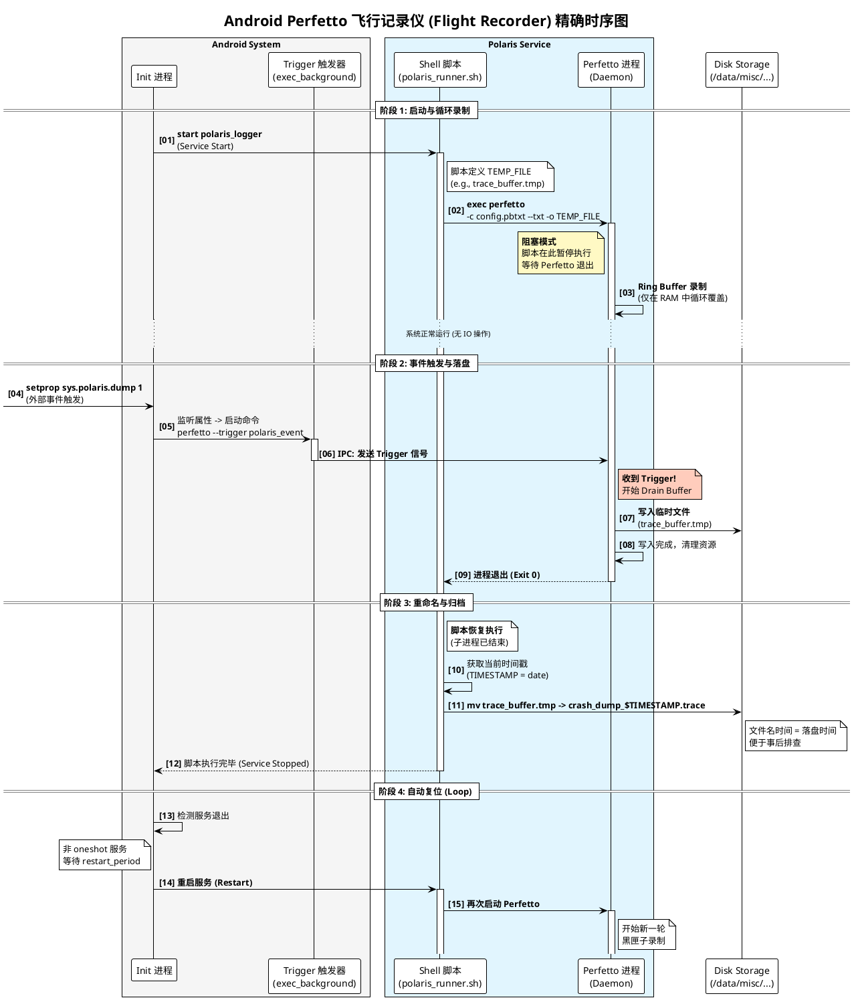

+++
date = '2025-09-29T11:36:11+08:00'
draft = false
title = 'Android Perfetto "飞行记录仪" (Flight Recorder) 实施方案'
+++

## 1. 需求概述

本方案旨在实现一套基于 Android Perfetto 的系统级自动追踪机制，模拟飞机的“黑匣子”功能：

1. **开机自启**：系统启动后，自动启动 Perfetto 追踪服务。
2. **内存循环录制**：采用 Ring Buffer（环形缓冲区）模式在内存中循环录制，始终保留**最近 15 秒**的数据，不占用磁盘 I/O。
3. **事件触发落盘**：当特定事件发生时（通过 Property 信号触发），立即停止录制并将内存中的数据写入磁盘文件。
4. **自动复位**：数据落盘完成后，自动重新开始新一轮的内存循环录制，等待下一次触发。


## 2. 核心架构与流程

本方案利用 Android `init` 进程的服务管理机制来实现“自动复位”，利用 Perfetto 的 `trigger` 机制来实现“按需落盘”。

### 工作流程图



## 3. 详细实施步骤

### 步骤 1：Perfetto 配置文件 (`.pbtxt`)

此配置定义了“怎么录”。核心是使用 `RING_BUFFER` 模式和 `trigger_config`。

* **文件路径示例**：`/data/local/tmp/polaris_ring.pbtxt`
    ```protobuf
    # 1. 缓冲区设置 (核心)
    # size_kb 决定了能回溯多久的时间。
    # 估算公式：Size = 数据吞吐率(MB/s) * 目标时长(s) * 1024
    # 假设吞吐率为 2MB/s，要保留 15s，则需要 30MB。建议预留 40-60MB。
    buffers: {
        size_kb: 40960              # 40MB
        fill_policy: RING_BUFFER    # 环形缓冲，满后覆盖旧数据
    }

    # 2. 数据源 (根据实际调试需求修改)
    data_sources: {
        config {
            name: "linux.ftrace"
            ftrace_config {
                ftrace_events: "sched/sched_switch"
                ftrace_events: "power/cpu_frequency"
                ftrace_events: "power/cpu_idle"
                buffer_size_kb: 2048
                drain_period_ms: 1000
            }
        }
    }

    # 3. 触发器配置 (核心)
    trigger_config {
        trigger_mode: STOP_TRACING  # 触发后停止
        triggers {
            name: "polaris_event"   # 触发器暗号
            stop_delay_ms: 0        # 收到信号后立即停止（0延迟）
                                    # 若设为 1000，则会多录 1秒 "事后" 数据
        }
    }

    # 4. 录制控制
    duration_ms: 0                  # 0 = 无限时长，直到被触发
    write_into_file: true           # 允许写文件
    file_write_period_ms: 604800000 # 设置极大值(7天)，禁止中途自动刷盘
                                    # 确保数据只在内存中，直到 Trigger 发生

    ```

### 步骤 2：启动脚本 (`.sh`)

此脚本负责为每次 Trace 生成独立的文件名，并阻塞执行。

* **文件路径示例**：`/system/bin/polaris_runner.sh` (需 `chmod +x`)
    ```bash
    #!/system/bin/sh

    OUT_DIR="/data/misc/perfetto-traces"
    # 定义一个临时文件路径（内存缓冲的暂存目标）
    TEMP_FILE="${OUT_DIR}/trace_buffer_running.tmp"

    # 确保目录存在
    if [ ! -d "$OUT_DIR" ]; then
        mkdir -p "$OUT_DIR"
    fi

    # 启动 Perfetto (阻塞模式)
    # 【修正点】：加上了 --txt 参数
    /system/bin/perfetto \
    -c /data/local/tmp/polaris_ring.pbtxt \
    --txt \
    -o "$TEMP_FILE"

    # =======================================================
    # 代码执行到这里，说明 Trigger 已经被触发，且文件写入完毕
    # =======================================================

    # 获取 Trigger 发生时的时间戳
    TRIGGER_TIMESTAMP=$(date +%Y%m%d_%H%M%S)
    FINAL_FILE="${OUT_DIR}/crash_dump_${TRIGGER_TIMESTAMP}.perfetto-trace"

    # 重命名文件，固化证据
    if [ -f "$TEMP_FILE" ]; then
        mv "$TEMP_FILE" "$FINAL_FILE"
        # 可选：打印日志到 logcat
        echo "Polaris: Trace saved and renamed to $FINAL_FILE"
    else
        echo "Polaris: Error - Trace file not found."
    fi

    ```

### 步骤 3：Init 服务配置 (`.rc`)

此配置负责服务的生命周期管理和信号监听。

* **文件路径示例**：`/system/etc/init/polaris_monitor.rc`
    ```rc
    # 定义主服务
    service polaris_logger /system/bin/sh /system/bin/polaris_runner.sh
        class core
        user shell
        group shell
        # 关键：如果有 SELinux 限制，需确保 shell 域有权写目标文件
        seclabel u:r:shell:s0
        
        # 【核心逻辑】
        # 不要加 'oneshot'！
        # 当 perfetto 因 trigger 退出导致脚本结束时，init 会自动重启此服务，
        # 从而开始下一次录制。
        
        # 限制重启频率，防止出错时死循环 (5秒内重启不超1次)
        restart_period 5
        
        # 默认不启动，等待 boot_completed
        disabled

    # 开机且 Traced 服务就绪后，启动服务
    on property:sys.boot_completed=1 && property:persist.traced.enable=1
        # 确保输出目录存在且可写
        mkdir /data/misc/perfetto-traces 0777 shell shell
        start polaris_logger

    # 【触发逻辑】
    # 外部设置属性 sys.polaris.dump=1 时触发
    on property:sys.polaris.dump=1
        # 发送 trigger 信号给正在运行的 perfetto 实例
        # 这里的暗号 "polaris_event" 必须与 pbtxt 中的 triggers.name 一致
        exec_background - shell shell -- /system/bin/perfetto --trigger polaris_event
        
        # 立即重置属性，以便下次还能触发
        setprop sys.polaris.dump 0

    ```


## 4. 验证与测试

1. **部署文件**：将上述三个文件推送到设备对应目录，并赋予执行权限。
2. **重启设备**：`adb reboot`。
3. **确认运行**：
    ```bash
    adb shell ps -A | grep perfetto
    # 应该能看到一个 perfetto 进程正在运行

    ```

4. **手动触发**：
    ```bash
    adb shell setprop sys.polaris.dump 1

    ```


5. **验证结果**：
   * 查看 `/data/misc/perfetto-traces/`，应该生成了一个新文件。
   * 再次执行 `ps -A | grep perfetto`，进程号（PID）应该变了（说明旧的退出了，新的自动启动了）。


## 5. 关键注意事项 (Caveats)

### 1. 缓冲区大小 (Size vs Time)

   * **误区**：Perfetto 没有直接配置 "只录 15秒" 的参数。
   * **正解**：`duration_ms` 控制的是**总运行时长**（设为 0 表示无限）。"15秒" 是由 `buffers.size_kb` 决定的物理容量限制。
   * **计算**：你需要实测你的 Trace 配置产生数据的速度。如果每秒产生 2MB 数据，要保留 15 秒，Buffer 至少设为 30MB (30720kb)。如果 Buffer 设小了，可能只能回溯 5 秒；设太大了浪费内存。

### 2. SELinux 权限

   * 在 `userdebug` 版本中，使用 `u:r:shell:s0` 通常可行。
   * 在 `user` 版本（正式版）中，`shell` 域的权限被严格限制，可能无法写入 `/data/misc` 或执行 `perfetto`。
   * **生产环境建议**：如果你是 ROM 开发者，建议定义专门的 `sepolicy` 域（例如 `perfetto_logger`），并授予其 `file_type` 的读写权限。

### 3. 文件写入策略

   * 配置中必须设置 `file_write_period_ms` 为极大值（如 7天）。
   * 如果不设置或设置很短，Perfetto 会定期把 Buffer 里的数据搬运到磁盘文件中。这样不仅失去了“黑匣子”只在出事时记录的意义，还会迅速填满存储空间并损耗 Flash 寿命。

### 4. 触发时的系统负载

   * 当 `Trigger` 发生时，Perfetto 会进行一次密集的磁盘写入操作（例如瞬间写入 50MB）。这可能会对系统性能产生短暂影响。建议在 `stop_delay_ms` 中根据业务场景权衡，或者确保写入路径所在的分区 I/O 性能足够。