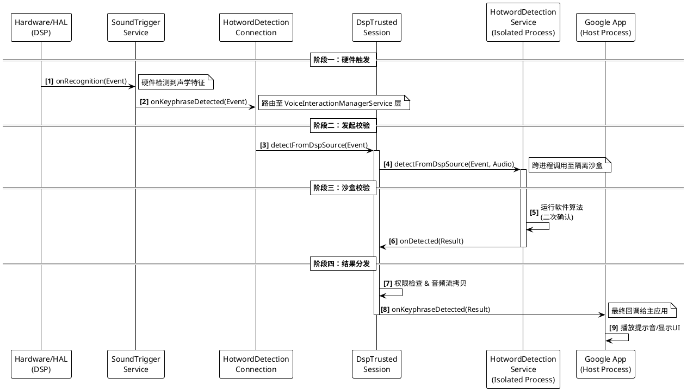
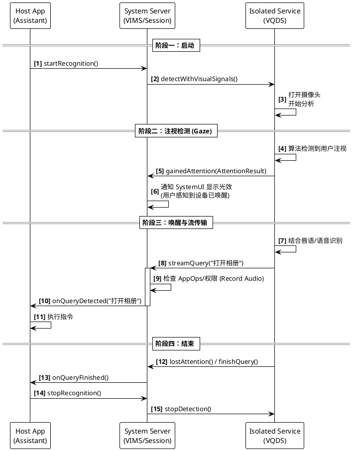

## Hotword Detection的流程
基于提供AOSP的代码，以“Hi Google”为例，语音唤醒（Hotword Detection）的完整流程是一个跨进程、跨层级的复杂协作过程。它主要涉及**底层硬件触发**、**系统服务路由**、**沙盒服务校验**以及**上层应用响应**四个关键阶段。

以下是基于代码分析的时序流程：

### 第一阶段：底层硬件触发与系统层接收 (Hardware Trigger & System Layer)

当用户说出“Hi Google”时，底层 DSP 芯片（SoundTrigger HAL）检测到声学特征，并向系统发送中断信号。

1.  **HAL 层回调**:
    `SoundTriggerHw3Compat`（或其他版本的 Compat 层）收到驱动层的回调。

      * 代码中 `ModelCallbackAdaper.recognitionCallback` 被调用，它将底层的事件封装为 `RecognitionEventSys` 并向上层传递 。

2.  **Middleware 层传递**:
    事件经过 `SoundTriggerMiddlewareImpl` 及一系列装饰器（Validation, Logging, Permission），最终到达 `SoundTriggerService`。

3.  **SoundTriggerService 处理**:
    `SoundTriggerService` 通过其内部的 `SoundTriggerHelper` 处理该事件。

      * `SoundTriggerHelper` 的 `onRecognition` 方法被触发，识别出这是 `KeyphraseRecognitionEvent`（关键短语识别事件）。
      * 紧接着调用 `onKeyphraseRecognitionLocked` 。

4.  **回调 VoiceInteractionManagerService (VIMS)**:
    `SoundTriggerHelper` 调用它持有的 `IRecognitionStatusCallback`。

      * 在 VIMS 的上下文中，这个回调实际上是 `HotwordDetectionConnection` 内部定义的 `SoundTriggerCallback` 。

### 第二阶段：路由至沙盒服务 (Routing to Sandboxed Service)

`VoiceInteractionManagerService` 接收到硬件事件后，不会直接发给 Google App，而是先路由给运行在隔离进程中的 `HotwordDetectionService` 进行校验。

1.  **HotwordDetectionConnection 介入**:
    在 `HotwordDetectionConnection.SoundTriggerCallback.onKeyphraseDetected` 中：

      * 系统检查是否已建立 `HotwordDetectionConnection`（即是否使用了 `HotwordDetectionService`）。
      * 如果是（“Hi Google”通常是这种情况），它会记录 metrics 并调用 `mHotwordDetectionConnection.detectFromDspSource` 。
      * *注意*：如果没使用 HDS，它会走另一条路直接回调给 App，但现在主流流程都包含 HDS 。

2.  **会话分发**:
    `HotwordDetectionConnection` 找到对应的检测器会话（对于 DSP 触发，是 `DspTrustedHotwordDetectorSession`），并调用其 `detectFromDspSourceLocked` 方法 。

3.  **发起 IPC 调用**:
    在 `DspTrustedHotwordDetectorSession.detectFromDspSourceLocked` 中：

      * 系统设置一个超时计时器（默认 3-4秒），防止沙盒服务无响应 。
      * 调用 `service.detectFromDspSource(...)`。这里的 `service` 是 `ISandboxedDetectionService` 的 Binder 代理，指向运行在隔离进程中的 `HotwordDetectionService` 。
      * 系统将硬件识别事件 (`recognitionEvent`) 和音频格式传递给沙盒服务。

### 第三阶段：沙盒服务校验 (Sandboxed Validation)

这一阶段发生在**隔离进程**中（代码逻辑由 Google App 提供，但运行环境受限）。

1.  **算法校验**:
    `HotwordDetectionService`（未在AOSP代码中，属于 App 侧实现）接收到音频数据，运行高精度的软件算法进行二次确认。

2.  **返回结果**:

      * **校验通过**: 沙盒服务调用回调接口的 `onDetected` 方法。
      * **校验失败**: 沙盒服务调用 `onRejected`。

### 第四阶段：结果处理与分发 (Result Processing & Dispatch)

系统服务（System Server）收到沙盒服务的验证结果后，进行安全检查和数据封装，最后发给主应用。

1.  **接收校验结果**:
    `DspTrustedHotwordDetectorSession` 内部的匿名回调类收到 `onDetected` 调用 。

2.  **安全检查**:

      * **超时检查**: 检查是否已超时 。
      * **权限检查**: 调用 `enforcePermissionsForDataDelivery` 确保主应用有录音权限 。
      * **Keyphrase ID 检查**: 调用 `enforceExtraKeyphraseIdNotLeaked` 确保沙盒服务没有伪造硬件未检测到的短语 ID 。

3.  **音频流拷贝**:
    系统使用 `mHotwordAudioStreamCopier.startCopyingAudioStreams(result)`。这会将沙盒服务传递过来的音频流（Pipe）进行处理，以便主应用可以读取音频数据 。

4.  **回调主应用 (Google App)**:
    最后，`DspTrustedHotwordDetectorSession` 调用 `externalCallback.onKeyphraseDetected(recognitionEvent, newResult)` 。

      * 这里的 `externalCallback` 是 Google App 主进程中 `AlwaysOnHotwordDetector` 注册的 Binder 回调。

5.  **UI 展示**:
    Google App 的主进程收到回调后，确认唤醒成功，随即调用 `VoiceInteractionService.showSession()`，请求 VIMS 显示语音助手界面（如底部的彩色条）。

### 时序图总结



通过这个流程，Android 既利用了 DSP 的低功耗特性（第一阶段），又利用了隔离进程的安全性来保护隐私（第三阶段），最后才唤醒主应用进行交互。


## 注视唤醒

"注视唤醒"（Visual Query Detection / Gaze Wake-up）的实现流程是利用 **`VisualQueryDetectionService`** (VQDS) 结合摄像头数据来触发语音交互。
这个过程利用了 Android 的沙盒机制来保护隐私，确保只有在检测到明确的“注视”意图后，数据才会流向主助理应用。
以下是基于代码分析的详细实现流程：

### 核心组件角色

1.  **Host App (Assistant)**: 语音助手主应用（如 Google App），运行 `VisualQueryDetector`。
2.  **System Server (VIMS)**: 系统服务，负责权限管控和路由。具体由 `VoiceInteractionManagerService` 和 `HotwordDetectionConnection` 管理。
3.  **Isolated Process (VQDS)**: 运行 `VisualQueryDetectionService`，负责处理摄像头数据并检测注视行为。

### 详细时序流程

#### 1. 初始化与绑定 (Initialization)

在功能启用时，主应用需要初始化检测器并传递模型数据。

  * **创建检测器**: Host App 调用 `VoiceInteractionService.createVisualQueryDetector()` 。
  * **系统绑定**: `VoiceInteractionManagerService` (VIMS) 接收请求，通过 `HotwordDetectionConnection` 绑定到 App 声明的 `VisualQueryDetectionService`（必须配置为隔离进程） 。
  * **传递配置**: 系统调用 `onUpdateState` 将配置参数 (`PersistableBundle`) 和共享内存 (`SharedMemory`) 传递给隔离服务，用于加载视觉模型 。

#### 2. 启动感知 (Start Perceiving)

当设备屏幕点亮或进入特定状态时，Host App 请求开启检测。

  * **发起请求**: Host App 调用 `VisualQueryDetector.startRecognition()` 。
  * **系统路由**: 该调用通过 Binder 传递给 VIMS 的 `startPerceiving` 方法 。
  * **连接层处理**: VIMS 委托给 `HotwordDetectionConnection`，后者找到 `VisualQueryDetectorSession` 并调用 `startPerceivingLocked` 。
  * **启动沙盒服务**: Session 通过 AIDL 调用隔离服务的 `detectWithVisualSignals(callback)` 方法 。
  * **服务响应**: 在隔离进程中，`VisualQueryDetectionService` 的 `onStartDetection()` 被触发。开发者需在此处开启摄像头流 。

#### 3. 注视检测与注意力捕获 (Attention Detection)

这是“注视唤醒”的核心逻辑，发生在隔离进程中。

  * **视觉处理**: `VisualQueryDetectionService` 分析每一帧图像（使用 App 自带的算法库）。
  * **获得注意 (Attention Gained)**: 当算法判断用户正在注视屏幕并有交互意图时，服务调用 `gainedAttention(VisualQueryAttentionResult)` 。
  * **系统反馈**:
      * 系统服务端的 `VisualQueryDetectorSession` 收到回调。
      * 它会通知系统的 `IVisualQueryDetectionAttentionListener`（通常是 SystemUI），在屏幕上显示“正在聆听”的视觉动效（如角落的光效） 。
      * **关键点**: 这一步并不会将音频或视频发给主 App，仅通知系统“用户在看”。

#### 4. 查询流式传输 (Query Streaming)

在获得注意力后，服务开始将识别到的意图（语音或多模态数据）传回主应用。

  * **流式传输**: 隔离服务调用 `streamQuery(String partialQuery)` 或 `streamQuery(VisualQueryDetectedResult)` 。
  * **权限检查**: 系统服务（System Server）在转发数据前进行严格的权限检查：
      * 如果包含音频查询，检查 `RECORD_AUDIO` 权限 。
      * 如果包含视觉辅助数据，检查 `CAMERA` 权限 。
  * **数据分发**: 检查通过后，`VisualQueryDetectorSession` 调用 `onQueryDetected` 。
  * **Host App 响应**: 主应用中的 `VisualQueryDetector.Callback` 收到查询文本，开始执行搜索或指令 。

#### 5. 结束交互 (Completion)

  * **完成**: 当用户停止说话，服务调用 `finishQuery()` 。
  * **失去注意**: 当用户移开视线，服务调用 `lostAttention()`，系统会取消 UI 动效并停止接收流 。

### 时序图解



### 总结

“注视唤醒”的关键在于 **`VisualQueryDetectionService`**。它允许语音助手在**不泄露摄像头原始数据**的前提下（因为在隔离进程），实时判断用户的注视行为。只有当 `gainedAttention` 被调用后，系统才允许流式传输查询内容，从而实现了隐私与便利性的平衡。

## VoiceInteractionManagerService

`VoiceInteractionManagerService` (VIMS) 是 Android 系统中管理语音交互的核心系统服务。它作为系统服务运行在 `system_server` 进程中，负责协调用户选定的语音助手应用（如 Google Assistant）与系统其他组件（如 ActivityManager, WindowManager, SoundTrigger 等）之间的交互。

以下是基于源代码对 `VoiceInteractionManagerService` 的详细设计讲解：

### 1. 职责 (Responsibilities)

`VoiceInteractionManagerService` 的主要职责可以归纳为以下几点：

1.  **语音助手生命周期管理**:
    * 负责管理当前激活的语音交互服务（`VoiceInteractionService`）。
    * 处理服务的绑定与解绑，特别是在用户切换、设置变更或应用更新时 。
    * 确保同一时间只有一个活跃的语音助手服务 。

2.  **会话 (Session) 管理**:
    * 处理来自语音助手的 `showSession` 请求，协调显示语音交互界面（Session UI）。
    * 管理 Session 的创建、显示、隐藏和销毁。
    * 协助传递上下文数据（Assist Data），如屏幕截图和视图结构，给语音助手 。

3.  **热词检测 (Hotword Detection) 协调**:
    * 作为上层应用与底层 `SoundTrigger` 硬件之间的桥梁。
    * 管理 `AlwaysOnHotwordDetector` 和 `HotwordDetectionService`（在隔离进程中运行的热词检测服务）。
    * 处理 DSP 模型的加载、更新和卸载 。
    * 验证和管理 `HotwordDetectionService` 的身份和权限 。

4.  **视觉查询 (Visual Query) 支持**:
    * 支持 `VisualQueryDetectionService`，允许助手利用摄像头数据进行检测（如注视唤醒）。

5.  **权限与安全性**:
    * 强制执行权限检查，例如 `BIND_VOICE_INTERACTION`，确保只有拥有正确权限的应用才能成为语音助手 。
    * 管理临时权限授予，允许助手访问启动的 Activity 数据 。

6.  **多用户支持**:
    * 维护每个用户的语音助手配置，并在用户切换时重新加载相应的服务实现 。

### 2. 实现 (Implementation)

VIMS 的实现采用了典型的 Android 系统服务模式，分为服务入口、Binder 桩（Stub）和每用户实现（Impl）。

#### 2.1 核心类结构

1.  **`VoiceInteractionManagerService`**:
    * 继承自 `SystemService`，是服务的入口点。
    * 负责发布 Binder 服务和本地服务 (`VoiceInteractionManagerInternal`) 。
    * 监听用户生命周期事件 (`onUserStarting`, `onUserSwitching`) 。

2.  **`VoiceInteractionManagerServiceStub`** (内部类):
    * 继承自 `IVoiceInteractionManagerService.Stub`。
    * 实现了跨进程通信（IPC）接口，供外部应用（如 Settings, SystemUI, 语音助手 App）调用。
    * 主要负责接收请求，进行权限检查，然后转发给当前用户的 `VoiceInteractionManagerServiceImpl` 。

3.  **`VoiceInteractionManagerServiceImpl`**:
    * **核心逻辑所在**。每个 `Impl` 实例对应一个特定的用户和该用户选定的语音助手组件。
    * 维护与 `VoiceInteractionService` 的 `ServiceConnection` 。
    * 持有 `HotwordDetectionConnection` 来管理热词检测 。
    * 持有 `VoiceInteractionSessionConnection` 来管理 UI 会话 。

#### 2.2 启动时序 (Startup Sequence)

VIMS 的启动流程如下：

1.  **`onStart()`**:
    * 由 `SystemServer` 调用。
    * 发布 Binder 服务 `voiceinteraction`。
    * 发布本地服务 `VoiceInteractionManagerInternal`，供系统进程内其他服务调用。
    * 向 `ActivityManagerInternal` 注册监听器，以便在 Activity 销毁时收到通知 。

2.  **`onBootPhase(int phase)`**:
    * **`PHASE_SYSTEM_SERVICES_READY`**: 获取依赖的系统服务，如 `ShortcutServiceInternal` 和 `SoundTriggerInternal` 。
    * **`PHASE_THIRD_PARTY_APPS_CAN_START`**: 调用 `mServiceStub.systemRunning(isSafeMode())`，开始真正的初始化 。

3.  **`systemRunning()` (在 Stub 中)**:
    * 注册 `PackageMonitor` 监听包的变化（如语音助手被卸载或更新）。
    * 注册 `SettingsObserver` 监听 `Settings.Secure.VOICE_INTERACTION_SERVICE` 的变化。
    * 调用 `initForUser()` 初始化当前用户的状态 。
    * 调用 `switchImplementationIfNeeded()` 尝试绑定服务 。

4.  **`initForUser(int userHandle)`**:
    * 从 `Settings.Secure` 读取当前用户的语音交互服务配置。
    * 如果未设置，尝试根据配置或系统默认值找到一个可用的语音助手，并更新设置 。
    * 初始化语音识别器组件信息 。

5.  **`switchImplementationIfNeeded()`**:
    * 这是连接建立的关键点。
    * 它读取当前的设置，解析出组件名 (`ComponentName`)。
    * 创建一个新的 `VoiceInteractionManagerServiceImpl` 实例，传入上下文和组件信息 。
    * 调用 `mImpl.startLocked()` 。

6.  **`VoiceInteractionManagerServiceImpl.startLocked()`**:
    * 创建 `Intent` 指向语音助手组件。
    * 调用 `mContext.bindServiceAsUser()` 绑定服务。这里使用了 `BIND_FOREGROUND_SERVICE` 等标志来确保服务优先级 。

7.  **`onServiceConnected()`** (在 Impl 的 Connection 中):
    * 当服务绑定成功后，获取 `IVoiceInteractionService` 接口。
    * 调用远程服务的 `ready()` 方法，通知语音助手应用系统已准备就绪 。

至此，VIMS 启动完成，并与当前用户的语音助手建立了双向通信通道。当用户触发语音助手时，VIMS 将通过这个通道发送请求；反之，当语音助手需要显示 UI 或访问硬件时，也会通过这个通道回调 VIMS。

## VoiceInteractionManagerServiceImpl

`VoiceInteractionManagerServiceImpl` 是 Android 语音交互框架中负责**具体业务实现**的核心类。每个实例对应**一个特定的用户**和**一个选定的语音交互服务组件**（例如 Google Assistant）。它全权负责管理该语音助手在当前用户下的生命周期、会话连接、硬件绑定以及业务逻辑转发。

以下是该类的详细职责描述：

### 1. 语音助手服务的生命周期管理
该类负责维护与实际语音助手应用（`VoiceInteractionService`）的绑定关系。
* **服务绑定与验证**：在构造函数中，它会解析 `VoiceInteractionServiceInfo` 来验证服务的有效性 。通过 `startLocked` 方法，它使用 `bindServiceAsUser` 绑定到目标服务组件 。
* **连接状态监控**：通过 `ServiceConnection` (`mConnection`) 监听服务的连接状态。
    * **连接成功**：在 `onServiceConnected` 中获取 `IVoiceInteractionService` 接口代理并调用 `ready()` 。
    * **连接断开**：在 `onServiceDisconnected` 中清理引用并重置 Hotword 连接 。
    * **意外死亡**：在 `onBindingDied` 中处理服务意外退出的情况，例如检测是否由用户强制停止 。
* **资源清理**：在 `shutdownLocked` 中负责解绑服务，取消当前会话，并断开 Hotword 检测连接 。

### 2. 会话 (Session) 管理
它管理着语音助手的 UI 界面（即“会话”），是系统与助手 UI 之间的桥梁。
* **会话创建与显示**：`showSessionLocked` 方法负责创建 `VoiceInteractionSessionConnection` 对象（若尚不存在），这代表了助手应用显示的 UI 层 。它还会计算唯一的 `KEY_SHOW_SESSION_ID` 并传递给服务 。
* **可见性控制**：提供 `hideSessionLocked` 方法来隐藏当前会话 ，以及 `finishLocked` 方法来销毁会话 。
* **窗口交互**：处理关闭系统对话框 (`closeSystemDialogsLocked`)  和保持屏幕常亮 (`setKeepAwakeLocked`)  的请求。

### 3. 检测器管理 (Hotword & Visual Query)
它是上层应用与底层检测硬件/隔离服务之间的枢纽，持有一个 `HotwordDetectionConnection` 对象来具体执行这些任务。
* **连接持有**：通过 `mHotwordDetectionConnection` 变量持有对热词检测连接的引用 。
* **初始化检测器**：`initAndVerifyDetectorLocked` 方法负责校验权限、配置隔离进程，并初始化 Hotword 或 Visual Query 检测器 。
* **状态与数据更新**：`updateStateLocked` 负责将配置参数 (`PersistableBundle`) 和模型数据 (`SharedMemory`) 更新到底层检测服务 。
* **麦克风与视觉控制**：提供 `startListeningFromMicLocked` 、`startPerceivingLocked`  等方法来控制音频和视觉信号的捕获。

### 4. 辅助功能与 Activity 交互
它充当了系统 Activity 管理器 (`ActivityTaskManager`) 和语音助手之间的代理，赋予助手操作 App 的能力。
* **启动 Activity**：实现了 `startVoiceActivityLocked`  和 `startAssistantActivityLocked` ，允许语音助手在特定模式（如隐藏模式或不激活模式）下启动 Activity。
* **Direct Actions**：通过 `requestDirectActionsLocked`  和 `performDirectActionLocked` ，允许语音助手查询和执行当前前台 App 的应用内动作（App Slices/Intents）。
* **权限授予**：通过 `grantImplicitAccessLocked` 方法，向语音助手授予对特定 Activity 的隐式访问权限 。

### 5. 系统设置与监听
* **无障碍设置监听**：内部类 `AccessibilitySettingsContentObserver` 负责监听 `VISUAL_QUERY_ACCESSIBILITY_DETECTION_ENABLED` 设置的变化，并通知注册的监听器 。
* **可见性监听**：支持启动和停止监听可见 Activity 的变化 (`startListeningVisibleActivityChangedLocked`)，以便助手能对屏幕内容做出反应 。

### 总结
`VoiceInteractionManagerServiceImpl` 是 Android 语音交互服务的**具体执行者**。它在一个特定用户的上下文中，协调了**服务绑定**、**UI 会话展示**、**底层硬件检测**以及**与其他系统服务（如 ATM/AM）的交互**。


在 `VoiceInteractionManagerServiceImpl` 类中，`mComponent` 是一个关键的成员变量。以下是关于它的详细解释：

### 1. `mComponent` 是什么？

  * **类型**: `ComponentName`
  * **含义**: 它代表了**当前选定的语音交互服务（Voice Interaction Service）的组件名称**。
      * 简单来说，就是用户在系统设置中选择的那个“默认数字助理应用”的具体服务组件（例如 Google Assistant 的 `com.google.android.googlequicksearchbox/com.google.android.voiceinteraction.GsaVoiceInteractionService`）。
  * **作用**: 这个变量用于在系统内部唯一标识当前正在为用户服务的那个语音助手组件。后续的绑定服务（bindService）、启动 Activity 等操作都需要使用这个组件名来指定目标 。

### 2. 它是如何被设置的？

它是通过 **`VoiceInteractionManagerServiceImpl` 的构造函数** 进行初始化的。

  * **代码位置**:
    在 `VoiceInteractionManagerServiceImpl.java` 的构造函数中：
    ```java
    VoiceInteractionManagerServiceImpl(Context context, Handler handler,
            VoiceInteractionManagerService.VoiceInteractionManagerServiceStub stub,
            int userHandle, ComponentName service) { // <--- 这里的 service 参数
        // ...
        mComponent = service; // <--- 在这里赋值
        // ...
    }
    ```

### 3. 谁负责传入这个值？（谁调用了构造函数？）

是由系统服务的主控类 **`VoiceInteractionManagerService`** (VIMS) 负责创建并传入的。

具体流程如下：

1.  **读取设置**:
    在 `VoiceInteractionManagerService.java` 中，方法 `switchImplementationIfNeededNoTracingLocked` 会从系统安全设置中读取当前用户选定的语音服务字符串：

    ```java
    String curService = Settings.Secure.getStringForUser(
            mResolver, Settings.Secure.VOICE_INTERACTION_SERVICE, mCurUser);
    ```

2.  **解析组件名**:
    将读取到的字符串解析为 `ComponentName` 对象（代码中命名为 `serviceComponent`）：

    ```java
    serviceComponent = ComponentName.unflattenFromString(curService);
    ```

3.  **实例化 Impl 并传入**:
    VIMS 实例化 `VoiceInteractionManagerServiceImpl`，并将 `serviceComponent` 作为参数传进去：

    ```java
    setImplLocked(new VoiceInteractionManagerServiceImpl(mContext,
            UiThread.getHandler(), this, mCurUser, serviceComponent)); // <--- 传入 mComponent
    ```

### 总结

  * **是什么**: 当前激活的语音助手服务的组件名（包名+类名）。
  * **谁设置**: 由 **`VoiceInteractionManagerService`** 读取系统设置 (`Settings.Secure.VOICE_INTERACTION_SERVICE`) 后，在创建 `VoiceInteractionManagerServiceImpl` 实例时通过构造函数传入的。

## VoiceInteractionServiceInfo

`VoiceInteractionServiceInfo` 的构造过程主要发生在它的构造函数中。它通过 `PackageManager` 获取服务的 `ServiceInfo`，然后读取该服务在 `AndroidManifest.xml` 中声明的 `<meta-data>` 所指向的 XML 资源文件。

以下是具体的解析步骤：

### 1. 入口与权限检查
构造函数接收 `PackageManager` 和 `ServiceInfo` 作为参数 。
* **权限验证**：首先检查该服务是否声明了 `android.permission.BIND_VOICE_INTERACTION` 权限。如果没有，解析过程会终止并设置错误信息 。

### 2. 加载 XML 元数据
代码调用 `si.loadXmlMetaData` 方法加载元数据 。
* **元数据名称**：它查找的键值是 `VoiceInteractionService.SERVICE_META_DATA` ，即 `"android.voice_interaction"` 。
* 这对应于 AndroidManifest.xml 中服务声明内的 `<meta-data android:name="android.voice_interaction" android:resource="@xml/..." />`。

### 3. 解析 XML 标签
使用 `XmlResourceParser` 解析加载的 XML 资源：
* **根标签验证**：解析器跳过开始文档事件，检查根标签（Root Tag）的名称是否为 `"voice-interaction-service"`。如果不是，则报错返回 。

### 4. 读取属性 (Attributes)
一旦验证了根标签，代码会获取应用程序的资源 (`Resources`)，并使用 `obtainAttributes` 方法读取 XML 中的属性值 。这些属性被映射到 `VoiceInteractionServiceInfo` 的成员变量中：

* **sessionService** (`android:sessionService`): 定义会话服务的组件名 。
* **recognitionService** (`android:recognitionService`): 定义语音识别服务的组件名 。
* **settingsActivity** (`android:settingsActivity`): 定义设置页面的 Activity 。
* **supportsAssist** (`android:supportsAssist`): 布尔值，是否支持辅助功能 。
* **supportsLaunchFromKeyguard** (`android:supportsLaunchVoiceAssistFromKeyguard`): 布尔值，是否支持从锁屏启动 。
* **supportsLocalInteraction** (`android:supportsLocalInteraction`): 布尔值，是否支持本地交互 。
* **hotwordDetectionService** (`android:hotwordDetectionService`): 定义 Hotword 检测服务的组件名 。
* **visualQueryDetectionService** (`android:visualQueryDetectionService`): 定义视觉查询检测服务的组件名 。

### 5. 强制性字段检查
在资源回收 (`array.recycle()`) 后，代码会检查两个必须存在的属性：
* **sessionService** 必须存在，否则报错 。
* **recognitionService** 必须存在，否则报错 。

### 总结
`VoiceInteractionServiceInfo` 的构造本质上是对开发者在 `res/xml/` 目录下定义的配置文件的**反序列化过程**。系统通过这个过程知道了语音助手由哪些组件构成（如会话服务、热词服务、视觉服务等）以及它支持哪些特性。


## VoiceInteractionService
根据 `frameworks/base/core/java/android/service/voice/VoiceInteractionService.java` 文件的定义和注释，`VoiceInteractionService` (VIS) 是当前被选中的语音交互应用的**顶层服务（Top-level service）**。它由 Android 系统保持长期运行，充当语音助手应用的“大脑”或“入口”。

以下是它的主要职责：

### 1. 充当常驻后台的“管家”
* **始终运行**：它是当前用户选定的语音交互器，由系统保持始终运行（Always Running）。
* **轻量级设计**：由于它始终运行，设计原则要求它必须**尽可能轻量** 。它不应处理繁重的 UI 渲染或复杂的业务逻辑，这些应交给独立的 `VoiceInteractionSessionService` 处理 。

### 2. 管理热词与检测器 (Detection Management)
它是创建和管理各种唤醒检测机制的入口：
* **DSP 热词检测**：通过 `createAlwaysOnHotwordDetector` 创建基于硬件 DSP 的低功耗热词检测器（如 "Hey Google"）。
* **软件/麦克风检测**：通过 `createHotwordDetector` 创建基于软件或麦克风输入的检测器 。
* **视觉查询检测**：通过 `createVisualQueryDetector` 创建视觉查询检测器，利用摄像头信号进行唤醒（如“注视唤醒”）。
* **模型管理**：处理声学模型的更新通知 (`onSoundModelsChangedInternal`) 。

### 3. 发起交互会话 (Session Initiation)
虽然它自己不显示 UI，但它负责决定**何时**显示 UI：
* **启动会话**：通过调用 `showSession()` 方法，请求系统启动与用户交互的 `VoiceInteractionSession` 。这通常发生在检测到热词或收到其他触发信号时。
* **传递参数**：它可以通过 `Bundle` 向 Session 传递参数 。

### 4. 处理系统生命周期回调
它接收来自系统的关键状态通知：
* **初始化**：`onReady()` 方法在系统准备好接收交互时被调用，这是服务进行初始化的时机 。
* **销毁**：`onShutdown()` 方法在服务被关闭时调用 。
* **配置变更**：处理支持的语音动作查询 (`onGetSupportedVoiceActions`) 。

### 5. 锁屏交互支持
* **锁屏唤醒**：通过 `onLaunchVoiceAssistFromKeyguard()` 方法，处理用户在锁屏状态下触发语音助手的操作 。这允许助手在锁屏之上显示特定的 UI。

### 6. 设置与上下文控制
* **上下文限制**：通过 `setDisabledShowContext()` 方法，可以控制在启动会话时是否禁用获取屏幕截图或辅助数据（Assist Data）。
* **UI 提示**：通过 `setUiHints()` 向系统 UI 提供提示信息 。

**总结**：
`VoiceInteractionService` 是语音助手应用的**后台指挥官**。它负责监听唤醒词（通过管理 Detector），并在需要时“叫醒”负责显示 UI 和处理复杂交互的 `VoiceInteractionSessionService`（前台执行者）。

## VisualQueryDetectionService

是的，`VisualQueryDetectionService` **也是在语音助理 App（例如 Google App）中实现的**，并且其运行机制与 `HotwordDetectionService` 高度相似。

它虽然是语音助理 APK 的一部分，但受到 Android 系统严格的沙盒限制。

### 1. 代码位置：在助理 App 内
根据源代码注释，`VisualQueryDetectionService` 是“由想要提供视觉查询检测功能的**应用程序实现**的” 。
* 开发者需要在语音助理 App 的工程中继承 `VisualQueryDetectionService` 并实现其抽象方法（如 `onStartDetection`）。

### 2. 配置方式：元数据声明
系统通过读取 `VoiceInteractionService` 的 XML 元数据来找到这个服务。
* 在 `VoiceInteractionServiceInfo.java` 中可以看到，系统会解析 `android:visualQueryDetectionService` 属性 。
* 这意味着开发者必须在 `res/xml/` 下的配置文件中明确指定这个类的路径。

### 3. 运行环境：强制隔离进程
与 `HotwordDetectionService` 一样，`VisualQueryDetectionService` **必须**配置为在隔离进程中运行。
* 在系统绑定该服务之前，`HotwordDetectionConnection` 会进行严格检查：`verifyDetectorForVisualQueryDetectionLocked` 方法会验证该服务是否设置了 `android:isolatedProcess="true"` 。
* 如果没有配置隔离进程，系统会抛出 `IllegalStateException` 并拒绝启动服务。

### 4. 进程共享 (Process Sharing)
值得注意的是，Android 允许 `VisualQueryDetectionService` 和 `HotwordDetectionService` 运行在**同一个**隔离进程中。
* 在 `verifyProcessSharingLocked` 方法中，系统会检查这两个服务是否都配置了 `android:allowSharedIsolatedProcess="true"` 。
* 如果配置允许，它们可以共享同一个沙盒环境，从而更方便地共享内存或状态（例如共享某些底层推理引擎资源），同时依然与主应用进程隔离。

### 总结
`VisualQueryDetectionService` 是语音助理 App 提供的代码，但被 Android 系统强制“关押”在一个独立的、受限的沙盒进程中运行，目的是在处理摄像头数据（视觉信号）时保护用户隐私。

## HotwordDetectionService
`HotwordDetectionService` 虽然代码包含在语音助理 App（如 Google App）的 APK 中，但它能够运行在隔离进程中，完全依赖于 **Android 系统服务（System Server）的特殊绑定机制**。

简单来说：**代码是 App 提供的，但启动方式和运行环境是由 Android 系统强制指定的。**

以下是其运行在隔离进程中的具体技术实现步骤：

### 1. App 侧的强制声明 (Manifest Declaration)

首先，语音助理 App 必须在其 `AndroidManifest.xml` 中声明该服务，并显式设置 `android:isolatedProcess="true"`。
虽然我们无法直接看到 Manifest 文件，但在 `VoiceInteractionManagerServiceImpl.java` 中，系统会严格检查这一属性。

  * **检查逻辑**：在绑定服务前，系统会调用 `isIsolatedProcessLocked` 方法，检查该服务的 `ServiceInfo.flags` 是否包含 `FLAG_ISOLATED_PROCESS`。
  * **强制执行**：如果开发者忘记在 Manifest 中声明这一属性，系统会抛出 `IllegalStateException` 并拒绝启动该服务。

### 2. 系统侧的特殊绑定 (System Binding)

普通的 Service 绑定使用 `bindService`，但对于 `HotwordDetectionService`，系统使用的是 **`bindIsolatedService`**。

在 `HotwordDetectionConnection.java` 的 `ServiceConnection` 内部类中可以看到这一关键调用：

```java
boolean bindResult = mContext.bindIsolatedService(
    mIntent,
    Context.BIND_AUTO_CREATE | Context.BIND_FOREGROUND_SERVICE | mBindingFlags,
    "hotword_detector_" + mInstanceNumber, // 实例名称
    mExecutor,
    serviceConnection);
```

  * **`bindIsolatedService` 的作用**：这个 API 指示 Activity Manager (AMS) 启动一个新的进程。这个进程是**临时的、匿名的**，并且被分配了一个特殊的 **Isolated UID**。
  * **独立的 UID**：这个 Isolated UID 与主 App 的 UID 不同（例如主 App 是 u0_a123，隔离进程可能是 u0_i99）。Linux 内核的权限管理机制会基于 UID 隔离资源，使得这个进程无法访问主 App 的私有数据目录，也没有网络权限。

### 3. 实例区分 (Instance Name)

在调用 `bindIsolatedService` 时，系统还会传入一个 `instanceName`（例如 `"hotword_detector_0"`）。

  * 这允许系统区分同一个服务的不同隔离实例。如果服务崩溃重启，系统可以通过计数器 (`mInstanceNumber`) 创建一个新的、干净的隔离进程实例。

### 4. 共享隔离进程 (Shared Isolated Process)

如果系统属性 `ro.hotword.visual_query_service_enabled` 为真，且应用声明了支持，`HotwordDetectionService` 还可以与 `VisualQueryDetectionService` 共享同一个隔离进程。

  * 代码中会检查 `Context.BIND_SHARED_ISOLATED_PROCESS` 标志。这允许两个相关的服务在同一个沙盒中运行，以便高效共享内存数据，但依然与主 App 隔离。

### 总结

`HotwordDetectionService` 之所以能运行在隔离进程，是因为：

1.  **App 声明**：App 自愿放弃了该 Service 的权限，声明其为 `isolatedProcess`。
2.  **系统执行**：System Server 使用 `bindIsolatedService` API 启动它，操作系统内核为其分配了受限的 UID，从而在此“牢笼”中执行 App 提供的代码。