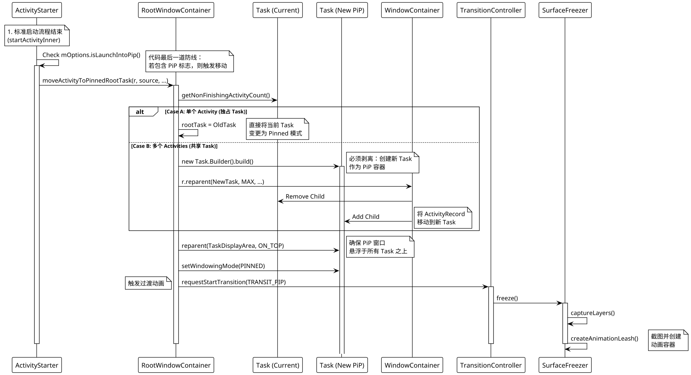

+++
date = '2025-08-27T11:36:11+08:00'
draft = false
title = 'Android Internals: Activity Launch into PiP 流程深度解析'
+++

## 1. 概述 (Overview)

在 Android 系统中，Activity 进入画中画（PiP）并非简单的 UI 缩放，而是一次复杂的**窗口层级重构 (Hierarchy Reparenting)**。

特别是当通过 Intent 标志 (`isLaunchIntoPip`) 触发时，系统实际上执行了一个“欺骗”操作：

1. 先按标准流程启动 Activity（Resume, Add to Task）。
2. 在启动流程收尾阶段，拦截并立即将其移动到 **Pinned Root Task**。
3. 利用 `SurfaceFreezer` 冻结画面，执行无缝的进入动画。

## 2. 核心流程图 (Architecture Flow)

下面的时序图展示了从 `startActivity` 到最终通过 `SurfaceAnimator` 执行动画的完整调用链。



## 3. 关键机制详解 (Implementation Details)

### 3.1 启动拦截 (The Hook)

**文件**: `ActivityStarter.java`

常规的 `startActivity` 流程（解析 Intent -> 寻找 Task -> Resume Activity）完成后，函数并不会立即返回。在 `startActivityInner` 的末尾，存在一个特殊的 Checkpoint：

```java
// ActivityStarter.java L120+
if (mOptions != null && mOptions.isLaunchIntoPip() 
        && sourceRecord.getTask() == mStartActivity.getTask()) {
    // 拦截点：虽然 Activity 已经加到了普通 Task，
    // 但立刻将其移动到 Pinned 栈，用户几乎无感知。
    mRootWindowContainer.moveActivityToPinnedRootTask(...);
}

```

这解释了为什么通过 `Intent` 启动 PiP 时，不会看到 Activity 先全屏再变小的闪烁，因为这一步是在 WindowManager 内部同步完成的。

### 3.2 任务栈分裂 (Task Hierarchy Split)

**文件**: `RootWindowContainer.java`

这是设计最精妙的地方。系统必须处理两种情况：

1. **独享 (Single Activity)**: Activity 本身就占有一个 Task。直接修改该 Task 的 `WindowingMode` 为 `PINNED`。
2. **共享 (Task Stack)**: Activity 是某个 Task 的一部分（例如在“设置”里打开了一个视频详情页）。
* **问题**: 如果直接把 Task 设为 PiP，整个“设置”应用都会变成小窗口。
* **解决**: 代码通过 `new Task.Builder(mService)...build()` 创建一个新的孤儿 Task，然后调用 `r.reparent(rootTask, ...)` 将目标 Activity 从原 Task “过继”到新 Task。


```java
// RootWindowContainer.java
if (singleActivity) {
    rootTask = task; // Case 1
} else {
    // Case 2: 创建新房，把孩子(Activity)接走
    rootTask = new Task.Builder(mService).setOnTop(true)...build();
    r.reparent(rootTask, MAX_VALUE, reason); 
}

```

### 3.3 视觉冻结

**文件**: `SurfaceFreezer.java`

在层级结构剧烈变化（Reparent）和模式切换（Fullscreen -> PiP）期间，为了保证视觉平滑，WM 使用了“快照大法”。

1. **Snapshot**: 调用 `SurfaceControl.captureLayers` 截取当前 Activity 的最后一帧 `HardwareBuffer`。
2. **Leash**: 创建一个临时的 `AnimationLeash` 覆盖在 Activity 之上。
3. **Cover**: 将 Snapshot 设置为 `Integer.MAX_VALUE` 层级，挡住底下正在进行 Resize 的真实 Window。
4. **Animate**: 动画系统（SurfaceAnimator）只对这个 Leash 进行缩放操作。

这避免了 Activity 在进入 PiP 过程中因为 Layout 重绘导致的闪烁或内容拉伸。

## 4. 总结 

Android 的 Launch-into-PiP 流程本质上是一个 **"Start then Move" (先启动后移动)** 的策略。

* **逻辑层**: 依赖 `ActivityStarter` 的后置钩子和 `RootWindowContainer` 的动态 Reparent 能力，确保了 PiP 窗口的独立性（拥有独立的 Task）。
* **表现层**: 依赖 `SurfaceFreezer` 和 `Transition` 系统，通过 Snapshot 掩盖了复杂的窗口重组过程，实现了从全屏到小窗的无缝过渡。

