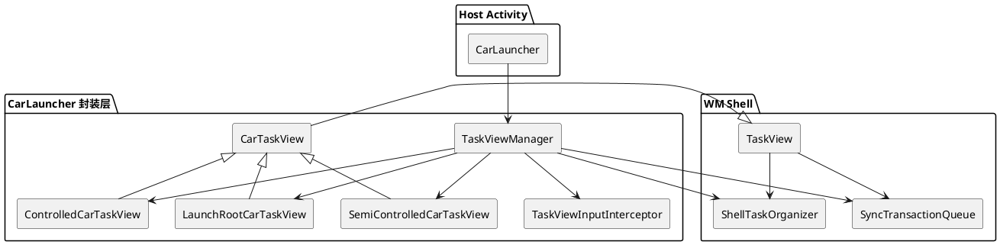
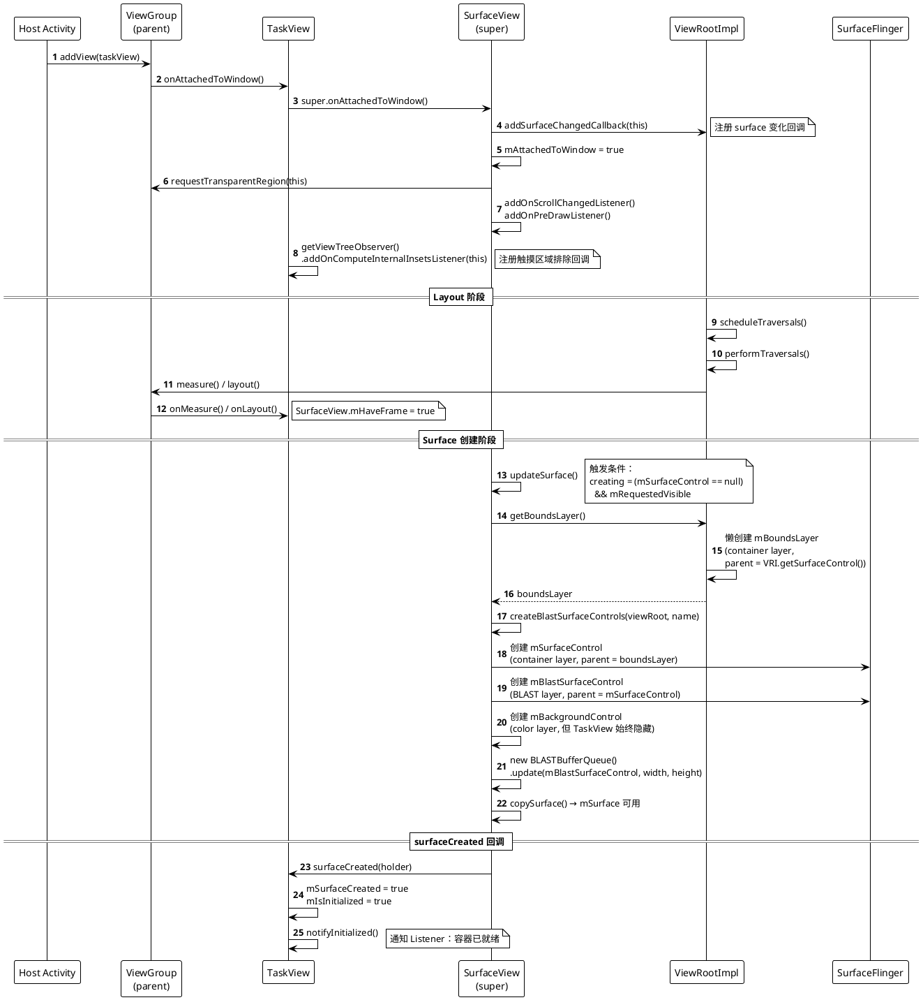
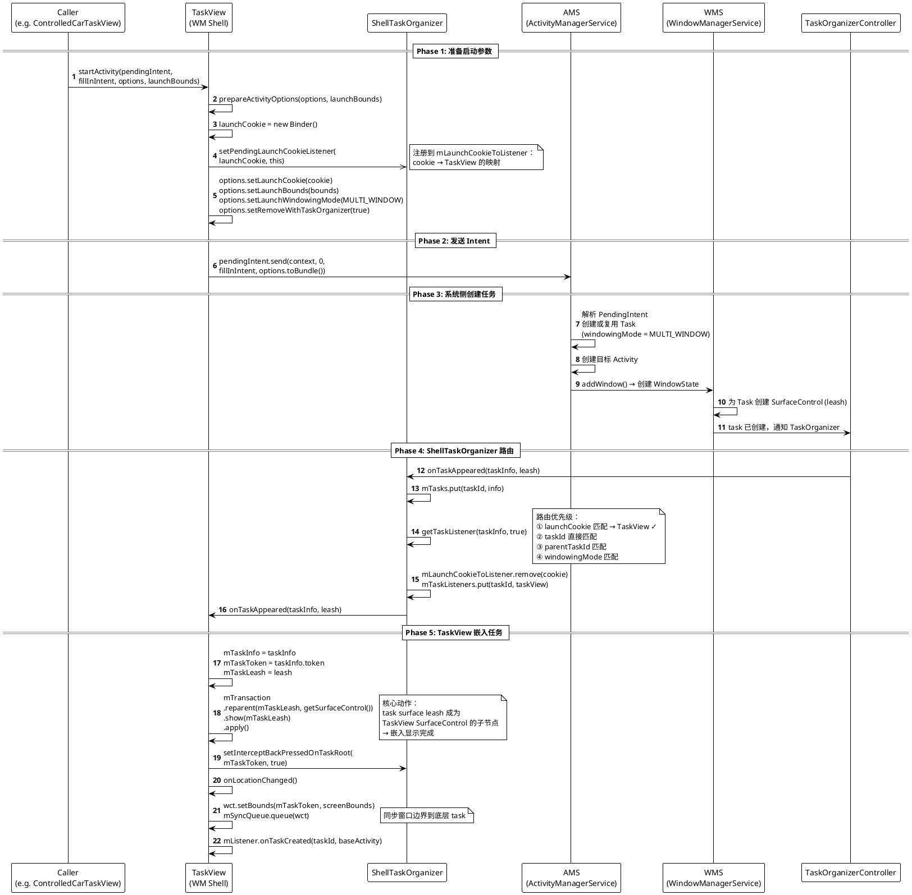
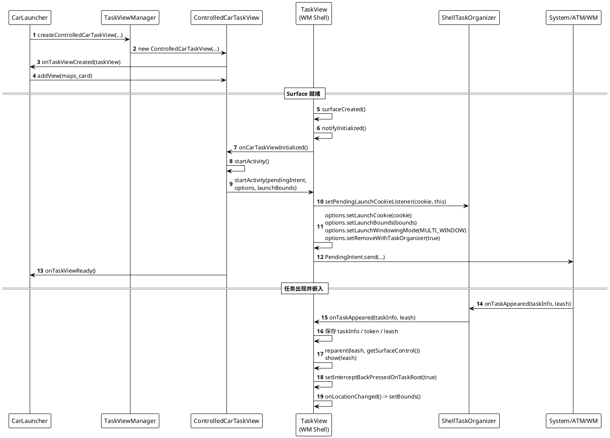
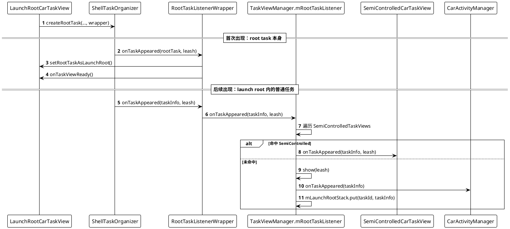

# Android 13 TaskView 实现机制

`TaskView` 是 WM Shell 提供的通用嵌入式任务容器，定义在 `frameworks/base/libs/WindowManager/Shell/src/com/android/wm/shell/TaskView.java`。它继承自 `SurfaceView`，核心能力是把一个独立的 Task（及其内部的 Activity）嵌入到宿主应用的 View 树中显示。

本文从两个维度展开：

1. **框架层**：`TaskView` 本身如何加入 `ViewRootImpl` 的 View 树、如何分配 Surface、Activity 如何被启动并嵌入到 `TaskView` 中
2. **应用层**：以 `CarLauncher`（`packages/apps/Car/Launcher/`）的地图卡片为例，说明上层如何使用 `TaskView`

其中，”CarLauncher 示例”特指 `CarLauncher#setUpTaskView()` 这条地图卡片路径，不包含以下分支：

- `CarLauncherUtils.isCustomDisplayPolicyDefined()` 为 `true` 时，直接启动 `ControlBarActivity` 和地图应用，不走 `TaskView`
- `CarLauncher` 处于 multi-window 或 PiP 时，不创建地图卡片
- headless system user 0 下，不创建地图卡片

## 1. 先给结论

如果只看默认 `CarLauncher` 的地图卡片，实际链路并不复杂：

1. `CarLauncher` 在 `maps_card` 容器里创建一个 `ControlledCarTaskView`
2. `ControlledCarTaskView` 底层继承自 `TaskView`，本质上是一个 `SurfaceView` + `ShellTaskOrganizer.TaskListener`
3. 当 `SurfaceView` 的 surface 创建完成后，`ControlledCarTaskView` 自动调用 `startActivity()`
4. `TaskView.startActivity()` 会把 `launchCookie`、`launchBounds`、`WINDOWING_MODE_MULTI_WINDOW` 注入到启动参数里
5. 目标任务真正创建出来后，`ShellTaskOrganizer` 根据 `launchCookie` 把 `onTaskAppeared()` 回调给这个 `TaskView`
6. `TaskView` 在 `onTaskAppeared()` 里把目标 task 的 `leash` reparent 到自己的 `SurfaceControl`，嵌入显示完成

因此，理解 `TaskView` 的关键不是“CarLauncher 自己管理任务栈”，而是：

- `TaskView` 负责把“任务启动”和“容器 surface”绑定起来
- `ShellTaskOrganizer` 负责把任务生命周期分发回正确的 `TaskView`
- `TaskViewManager` 负责把这套能力包装成适合车机桌面的管理框架

## 2. 先纠正几个常见误解

### 2.1 默认地图卡片不是通过 LaunchRoot 实现的

`CarLauncher#setUpTaskView()` 调用的是 `TaskViewManager#createControlledCarTaskView()`，不是 `createLaunchRootTaskView()`。  
也就是说，默认地图卡片走的是 **ControlledCarTaskView 路径**。

`LaunchRootCarTaskView` 和 `SemiControlledCarTaskView` 当然也在 `CarLauncher` 工程里，但它们属于更通用的嵌入式任务路由框架，不是这条地图卡片主路径的一部分。

### 2.2 `onTaskViewReady()` 不等于地图首帧已经出来

`CarTaskViewCallbacks` 的注释写得很明确：

- `LaunchRootCarTaskView` 的 `onTaskViewReady()`：表示 launch root 已经创建完成
- `ControlledCarTaskView` / `SemiControlledCarTaskView` 的 `onTaskViewReady()`：表示 `surfaceCreated()` 已经发生，容器 ready 了

因此，`onTaskViewReady()` 的语义是“容器可以工作了”，不是“嵌入应用已经绘制完毕”。

### 2.3 `launchCookie` 不是 `ControlledCarTaskView` 自己实现的

文档如果要写 `launchCookie`，必须写到 `TaskView` 这一层。  
真正设置 `launchCookie` 的代码在 `TaskView.prepareActivityOptions()`：

- 创建一个新的 `Binder launchCookie`
- 调用 `ShellTaskOrganizer.setPendingLaunchCookieListener(launchCookie, this)`
- 把 `launchCookie`、`launchBounds`、`WINDOWING_MODE_MULTI_WINDOW` 填进 `ActivityOptions`

也就是说，`ControlledCarTaskView` 只负责“何时启动”，而 `TaskView` 负责“如何把启动出来的 task 绑定回自己”。

## 3. 分层架构

从 `CarLauncher` 源码看，这套实现可以拆成四层：



可以把每一层的职责概括成一句话：

- `CarLauncher`：决定是否展示地图卡片，以及把 `TaskView` 加到页面布局里
- `TaskViewManager`：统一创建、监听、恢复、清理各类 `TaskView`
- `CarTaskView`：在 `TaskView` 之上补齐车机桌面需要的显示与恢复能力
- `TaskView`：把一个 task 嵌入到当前 `SurfaceView`

## 4. 关键类职责

| 类 | 作用 | 关键实现 | 是否用于默认地图卡片 |
| --- | --- | --- | --- |
| `CarLauncher` | 宿主 Activity | 选择地图 intent，创建 `TaskViewManager`，把 view 加到 `maps_card` | 是 |
| `TaskViewManager` | 中央管理器 | 创建各类 `TaskView`，注册 `ShellTaskOrganizer`、`TaskStackListener`、用户生命周期监听、包更新监听 | 是 |
| `CarTaskView` | `TaskView` 的车机封装 | 只发送一次 ready 回调，`showEmbeddedTask()` 会 `setHidden(false)` + `reorder(onTop)`，支持 insets | 是 |
| `ControlledCarTaskView` | 宿主主动拉起并长期托管的容器 | surface ready 后自动 `startActivity()`，支持按策略重启 | 是 |
| `LaunchRootCarTaskView` | 默认任务容器 | 创建 root task，并把它设置成 launch root | 否 |
| `SemiControlledCarTaskView` | 半受控容器 | 把符合规则的任务从 launch root 路由进来 | 否 |
| `TaskView` | WM Shell 提供的通用容器 | `launchCookie` 绑定、`onTaskAppeared()` reparent、bounds 同步、surface 生命周期管理 | 是 |

## 5. TaskView 加入 View 树与 Surface 分配

`TaskView` 继承自 `SurfaceView`，本身就是一个 `View`。当宿主把它 `addView()` 到布局中时，会经历标准的 View 挂载、SurfaceControl 创建、Surface 就绪三个阶段。

### 5.1 类继承关系

```
TaskView
  extends SurfaceView
    extends View
  implements SurfaceHolder.Callback          // surface 生命周期
  implements ShellTaskOrganizer.TaskListener  // task 生命周期
  implements ViewTreeObserver.OnComputeInternalInsetsListener  // 触摸区域排除
```

`TaskView` 的构造函数会把 `disableBackgroundLayer=true` 传给 `SurfaceView`：

```java
super(context, null, 0, 0, true /* disableBackgroundLayer */);
```

这意味着 `SurfaceView` 创建的 `mBackgroundControl`（背景色图层）会始终隐藏，因为 `TaskView` 不需要自己绘制背景——嵌入的 task 会覆盖整个区域。

同时，构造函数注册了 `SurfaceHolder.Callback`：

```java
getHolder().addCallback(this);
```

使得后续 `SurfaceView` 的 surface 生命周期事件能回调到 `TaskView.surfaceCreated()` / `surfaceChanged()` / `surfaceDestroyed()`。

### 5.2 TaskView 加入 ViewRootImpl 的 View 树

当宿主调用 `parent.addView(taskView)` 后，`TaskView` 的挂载过程如下：



这里的关键点：

- `SurfaceView.onAttachedToWindow()` 不会立即创建 Surface，只是注册回调
- Surface 创建发生在 `performTraversals()` → `updateSurface()` 路径上，需要等第一次 layout 完成（`mHaveFrame=true`）
- `surfaceCreated()` 回调标志着 `TaskView` 的 `SurfaceControl` 已经可用，可以接收 task leash 的 reparent

### 5.3 SurfaceControl 的层级结构

`SurfaceView.createBlastSurfaceControls()` 创建了一套三层结构，挂在 `ViewRootImpl` 的 `BoundsLayer` 之下：

```
Window Surface (WMS 分配给窗口的顶层 Surface)
  └── ViewRootImpl.mSurfaceControl
      └── ViewRootImpl.mBoundsLayer (container layer, 裁剪到 surface insets)
          └── SurfaceView.mSurfaceControl (container layer) ← TaskView.getSurfaceControl() 返回此层
              ├── SurfaceView.mBlastSurfaceControl (BLAST buffer queue layer)
              └── [Task 的 Surface Leash 将在 onTaskAppeared() 时 reparent 到这里]
```

- **`ViewRootImpl.mBoundsLayer`**：按需懒创建（第一次被 `SurfaceView` 请求时），其作用是对所有子 Surface 进行 surface insets 裁剪，确保子 Surface 不会绘制到窗口的 inset 区域
- **`SurfaceView.mSurfaceControl`**：容器层，不直接持有 buffer，用于组织子层级。这也是 `TaskView.getSurfaceControl()` 返回的那个 SurfaceControl，后续 task leash 会被 reparent 到它下面
- **`SurfaceView.mBlastSurfaceControl`**：BLAST buffer queue 层，用于 `SurfaceView` 自身绘制。对于 `TaskView` 来说，它自身并不绘制内容，真正显示的是被 reparent 进来的 task surface
- **`mBackgroundControl`**：背景色图层。`TaskView` 在构造函数中传了 `disableBackgroundLayer=true`，所以此层始终隐藏

### 5.4 Surface 生命周期与 Task 嵌入的耦合关系

`TaskView` 的 surface 生命周期和 task 嵌入逻辑是双向耦合的：

| 事件 | surface 已创建 | surface 未创建 |
| --- | --- | --- |
| `onTaskAppeared()` 收到 task | `reparent(leash, getSurfaceControl()).show(leash)` — 立即嵌入 | `updateTaskVisibility()` → `setHidden(true)` — 隐藏 task，等 surface 就绪 |
| `surfaceCreated()` 且已有 task | `reparent(leash, getSurfaceControl()).show(leash)` — 补做嵌入 | — |
| `surfaceDestroyed()` 且已有 task | `reparent(leash, null)` — 解除嵌入，并 `setHidden(true)` | — |

这种设计确保了无论 surface 先就绪还是 task 先出现，最终都能正确完成嵌入。

## 6. Activity 如何启动到 TaskView

从 `TaskView.startActivity()` 到目标 Activity 真正渲染进 `TaskView`，需要经过五个阶段。下面的时序图描述了完整的框架级流程。

### 6.1 完整时序图



### 6.2 Phase 1 解析：启动参数准备

`TaskView.prepareActivityOptions()` 把四个关键参数注入 `ActivityOptions`：

```java
private void prepareActivityOptions(ActivityOptions options, Rect launchBounds) {
    final Binder launchCookie = new Binder();
    mShellExecutor.execute(() -> {
        mTaskOrganizer.setPendingLaunchCookieListener(launchCookie, this);
    });
    options.setLaunchBounds(launchBounds);
    options.setLaunchCookie(launchCookie);
    options.setLaunchWindowingMode(WINDOWING_MODE_MULTI_WINDOW);
    options.setRemoveWithTaskOrganizer(true);
}
```

| 参数 | 作用 |
| --- | --- |
| `launchCookie` | 一个临时 Binder token，用于让 `ShellTaskOrganizer` 在任务出现时找回"是哪个 `TaskView` 发起的启动" |
| `launchBounds` | 初始窗口尺寸和位置（屏幕坐标），对应 `TaskView` 当前的 bounds |
| `WINDOWING_MODE_MULTI_WINDOW` | 让 AMS 把 task 创建为 multi-window 模式，从而触发 TaskOrganizer 协议 |
| `removeWithTaskOrganizer(true)` | 当 TaskOrganizer 注销时自动移除此 task，避免孤儿任务 |

注意 `setPendingLaunchCookieListener()` 是在 `mShellExecutor` 上异步执行的，而 `pendingIntent.send()` 是在调用线程上同步执行的。但这不会导致竞争问题，因为 AMS 创建 task 并回调 `onTaskAppeared()` 也是异步的，最终 `getTaskListener()` 查找 cookie 时，`mLaunchCookieToListener` 早已更新。

### 6.3 Phase 4 解析：ShellTaskOrganizer 的任务路由

`ShellTaskOrganizer.getTaskListener()` 使用四级优先级匹配：

```java
private TaskListener getTaskListener(RunningTaskInfo runningTaskInfo,
        boolean removeLaunchCookieIfNeeded) {
    // 优先级 1: launchCookie 匹配
    for (IBinder cookie : runningTaskInfo.launchCookies) {
        listener = mLaunchCookieToListener.get(cookie);
        if (listener != null) {
            mLaunchCookieToListener.remove(cookie);
            mTaskListeners.put(taskId, listener);
            return listener;
        }
    }
    // 优先级 2: taskId 直接匹配
    listener = mTaskListeners.get(taskId);
    if (listener != null) return listener;
    // 优先级 3: 父任务匹配
    if (runningTaskInfo.hasParentTask()) {
        listener = mTaskListeners.get(runningTaskInfo.parentTaskId);
        if (listener != null) return listener;
    }
    // 优先级 4: windowingMode 匹配
    return mTaskListeners.get(taskInfoToTaskListenerType(runningTaskInfo));
}
```

对于 `TaskView` 启动的 Activity，第一次 `onTaskAppeared()` 时通过 `launchCookie` 命中（优先级 1），同时把 `taskId → TaskView` 的映射转存到 `mTaskListeners`。后续的 `onTaskInfoChanged()` / `onTaskVanished()` 就通过 `taskId` 直接匹配（优先级 2）。

### 6.4 Phase 5 解析：reparent 是嵌入的本质

`TaskView.onTaskAppeared()` 的核心动作是一个 `SurfaceControl.Transaction`：

```java
mTransaction.reparent(mTaskLeash, getSurfaceControl())
        .show(mTaskLeash)
        .apply();
```

执行后，Surface 层级变为：

```
ViewRootImpl.mBoundsLayer
  └── TaskView.mSurfaceControl (container)
      ├── mBlastSurfaceControl (BLAST layer, TaskView 自身不使用)
      └── Task Surface Leash ← 嵌入的 Activity 在此渲染
```

这就是 `TaskView` 嵌入机制的本质：**不是把 Activity 的 View 树合并到宿主的 View 树中，而是在 SurfaceControl 层级上把 task 的 surface 挂到 `TaskView` 的 surface 下面。** 两个 View 树完全独立，只在 Surface 合成层面形成父子关系。

嵌入完成后，`onLocationChanged()` 通过 `WindowContainerTransaction.setBounds()` 把 `TaskView` 在屏幕上的实际位置同步给底层 task，确保 task 的窗口尺寸和位置与 `TaskView` 对齐。后续 `surfaceChanged()` 时会再次调用 `onLocationChanged()`，保持持续同步。

## 7. CarLauncher 的地图卡片是怎么创建的

`CarLauncher#onCreate()` 在正常主屏分支里会调用 `setUpTaskView(mapsCard)`。这条路径有几个关键点。

### 7.1 先决条件

只有满足以下条件，地图卡片才会走 `TaskView`：

- 没有启用 custom display policy
- 当前不在 multi-window / PiP
- 当前用户不是 headless system user 0
- 布局里存在 `R.id.maps_card`

### 7.2 选择地图 Intent

`CarLauncher` 会优先使用 `config_smallCanvasOptimizedMapIntent`；如果没有配置，则回退到 `CarLauncherUtils.getMapsIntent()`。

`getMapsIntent()` 的逻辑是：

1. 先找默认 `CATEGORY_APP_MAPS` 处理者
2. 再用 `config_homeCardPreferredMapActivities` 做同包优先匹配
3. 最终得到要嵌入的地图 Activity

随后，`CarLauncher` 会额外加上：

```java
Intent.FLAG_ACTIVITY_EXCLUDE_FROM_RECENTS
```

这样地图卡片里的 Activity 不会作为独立条目出现在最近任务里。

### 7.3 创建 ControlledCarTaskView

`CarLauncher` 调用：

```java
mTaskViewManager.createControlledCarTaskView(
        getMainExecutor(),
        ControlledCarTaskViewConfig.builder()
                .setActivityIntent(mapIntent)
                .setAutoRestartOnCrash(false)
                .build(),
        callbacks);
```

这里有两个值得注意的点：

- 默认地图卡片明确使用 `ControlledCarTaskView`
- `setAutoRestartOnCrash(false)`，说明当前示例并没有开启“task 一消失就立即重启”的策略

另外，`TaskViewManager#createControlledCarTaskView()` 本身不是同步直接 new，而是通过 `mShellExecutor.execute(...)` 创建。  
这意味着 `TaskView` 相关对象的构建、组织器交互和后续回调都被统一收敛到了同一条执行上下文。

### 7.4 `onTaskViewCreated()` 只是把 View 挂到布局里

`ControlledCarTaskView` 构造完成后，会立即回调 `onTaskViewCreated(this)`。  
`CarLauncher` 在这个回调里只做一件事：

```java
parent.addView(taskView);
```

此时只是把 `TaskView` 作为一个普通 View 加到 `maps_card`，真正启动地图还要等 surface ready。

## 8. TaskView 的实现机制：默认地图卡片完整时序

下面这张时序图只描述源码里真实发生的调用，不把 WMS / SurfaceFlinger 的内部细节伪装成 `CarLauncher` 自己的逻辑。



这条时序里，几个关键实现不能写错。

### 8.1 启动时机：不是宿主手动调用，而是 surface ready 后自动启动

`ControlledCarTaskView` 覆盖了 `onCarTaskViewInitialized()`：

1. 先调用 `startActivity()`
2. 再回调 `mCallbacks.onTaskViewReady()`

所以它的启动触发点是 `TaskView.surfaceCreated()` 之后的 `notifyInitialized()`。  
这也是为什么 `ControlledCarTaskView` 可以做到“加进布局后自动拉起目标 Activity”。

### 8.2 `startActivity()` 前的状态保护

`ControlledCarTaskView.startActivity()` 在真正发起启动前，会做三层检查：

1. 用户是否已解锁：`mUserManager.isUserUnlocked()`
2. `TaskView` 是否已经挂到有效 display：`getDisplay() != null`
3. display 是否点亮：`getDisplay().getState() == Display.STATE_ON`

这些检查的目的很直接：  
避免在 surface 未准备好、屏幕关闭、用户未解锁时误启动嵌入任务。

### 8.3 `TaskView` 才是真正的绑定核心

`TaskView.startActivity()` 不是简单地发一个 `PendingIntent`。  
它会先执行 `prepareActivityOptions()`，把下面几个关键信息塞进 `ActivityOptions`：

- `launchCookie`
- `launchBounds`
- `WINDOWING_MODE_MULTI_WINDOW`
- `removeWithTaskOrganizer(true)`

其中最关键的是 `launchCookie`。  
`TaskView` 先调用：

```java
mTaskOrganizer.setPendingLaunchCookieListener(launchCookie, this)
```

把“这个 cookie 对应哪个 `TaskView`”登记给 `ShellTaskOrganizer`，随后启动目标 Activity。  
后面 task 真正出现时，`ShellTaskOrganizer` 就可以把 `onTaskAppeared()` 分发回这个 `TaskView`。

### 8.4 真正的嵌入动作发生在 `onTaskAppeared()`

`TaskView.onTaskAppeared()` 做了四件关键事情：

1. 保存 `mTaskInfo`、`mTaskToken`、`mTaskLeash`
2. 如果 surface 已创建，执行：

```java
mTransaction.reparent(mTaskLeash, getSurfaceControl())
        .show(mTaskLeash)
        .apply();
```

3. 调用 `mTaskOrganizer.setInterceptBackPressedOnTaskRoot(mTaskToken, true)`
4. 调用 `onLocationChanged()`，把当前 `TaskView` 的屏幕 bounds 同步给底层 task

这就是 `TaskView` 的核心机制：  
**任务不是画进宿主的 View 树里，而是把任务的 surface leash reparent 到 `TaskView` 自己的 surface 下面。**

### 8.5 尺寸同步不是一次性的

`TaskView.surfaceChanged()` 会继续调用 `onLocationChanged()`。  
`onLocationChanged()` 最终通过 `WindowContainerTransaction.setBounds()` 把新的屏幕区域同步到底层 task。

因此，`launchBounds` 只负责初始窗口大小，后续位置和尺寸变化仍然依赖 `onLocationChanged()`。

### 8.6 销毁时会解除嵌入关系

如果 `surfaceDestroyed()` 发生，`TaskView` 会把 task leash 从当前 surface 下 unparent，并更新隐藏状态。  
如果 `onTaskVanished()` 发生，`TaskView` 会：

- 通知 `onTaskRemovalStarted()`
- 取消 root back 拦截
- unparent `mTaskLeash`
- 清空 `mTaskInfo` / `mTaskToken` / `mTaskLeash`

所以，TaskView 的嵌入关系并不是永久性的，而是严格受 surface 生命周期和 task 生命周期共同约束。

## 9. CarLauncher 在 TaskView 之上补了什么

如果只看 `TaskView`，你只能得到一个通用的嵌入容器。  
`CarLauncher` 之所以还能把它用于车机桌面，是因为又补了几层能力。

### 9.1 `CarTaskView`：补显示恢复和一次性 ready 语义

`CarTaskView` 主要做了三件事。

第一，`notifyInitialized()` 只让 `onCarTaskViewInitialized()` 生效一次，避免重复发送 ready。  

第二，增加了 `showEmbeddedTask(WindowContainerTransaction wct)`，内部会：

- `wct.setHidden(mTaskToken, false)`
- `wct.reorder(mTaskToken, true)`

这对应源码注释里的两个问题修复：

- 清掉 hidden，让嵌入任务重新可见
- 把嵌入任务提到顶层，让它恢复 resumed / top focused 状态

第三，支持对嵌入 task 设置和移除 insets。

### 9.2 `TaskViewManager`：把 TaskView 变成可运维的桌面组件

`TaskViewManager` 除了负责创建 `TaskView`，还负责系统级运维动作。

#### 启动时清理悬挂任务

`initTaskOrganizer()` 在 `registerOrganizer()` 后会调用 `cleanUpExistingTaskViewTasks()`，把已经残留的 multi-window task 清掉。  
这一步是为了避免上一次异常退出后留下 dangling task。

#### 宿主重新获得焦点时恢复 ControlledTaskView

`TaskStackListener.onTaskFocusChanged()` 里，如果宿主 task 重新获得焦点，会遍历所有 `ControlledCarTaskView`。  
凡是 `getTaskId() == INVALID_TASK_ID` 的，都会再次 `startActivity()`。

#### 宿主 restart attempt 时统一恢复嵌入任务

`TaskStackListener.onActivityRestartAttempt()` 里会对三类 task view 统一调用 `showEmbeddedTask()`：

- `ControlledCarTaskView`
- `LaunchRootCarTaskView`
- `SemiControlledCarTaskView`

对于 `ControlledCarTaskView`，如果当前没有有效 task，它会直接重新 `startActivity()`；  
如果 task 还在，则通过 `CarTaskView.showEmbeddedTask()` 解除 hidden 并提升顺序。

#### 用户解锁后拉起缺失任务

收到 `USER_LIFECYCLE_EVENT_TYPE_UNLOCKED` 后，`TaskViewManager` 会重新启动所有缺失的 `ControlledCarTaskView`。

#### 用户切换或宿主销毁时完整释放

收到 `USER_LIFECYCLE_EVENT_TYPE_SWITCHING`，或者宿主 Activity 进入 `onActivityDestroyed()`，都会触发 `release()`：

- 释放全部 task view
- 注销 `TaskStackListener`
- 注销包更新广播
- 注销 `CarActivityManager` task monitor
- `unregisterOrganizer()`

### 9.3 包更新驱动的重启是按依赖包匹配的

`TaskViewManager` 监听 `ACTION_PACKAGE_REPLACED`。  
如果宿主当前可见，且某个 `ControlledCarTaskView` 当前没有 task，同时这个包名命中了 `getDependingPackageNames()`，就会重新 `startActivity()`。

这也是 `config_taskViewPackages` 的意义：  
它不是“谁能显示在 TaskView 里”，而是“哪些包更新后，需要把这个嵌入任务重新拉起来”。

### 9.4 默认地图卡片并没有开启立即崩溃重启

虽然 `ControlledCarTaskView.onTaskVanished()` 支持：

```java
if (mConfig.mAutoRestartOnCrash && mTaskViewManager.isHostVisible()) {
    startActivity();
}
```

但 `CarLauncher#setUpTaskView()` 里明确写的是：

```java
.setAutoRestartOnCrash(false)
```

所以在当前示例中，地图卡片并没有启用“task 一消失就立即重启”的策略。  
更准确地说，默认示例依赖的是：

- 宿主重新获得焦点后的恢复
- restart attempt 时的恢复
- 用户解锁后的恢复
- 包更新后的恢复

## 10. LaunchRoot 与 SemiControlled 是另一条更通用的路由链

虽然默认地图卡片不用它们，但 `TaskViewManager` 里确实实现了更完整的嵌入式任务架构。

### 10.1 LaunchRootCarTaskView 的职责

`LaunchRootCarTaskView` 在 `onCarTaskViewInitialized()` 中会调用：

```java
mShellTaskOrganizer.createRootTask(
        DEFAULT_DISPLAY,
        WINDOWING_MODE_MULTI_WINDOW,
        mRootTaskListenerWrapper);
```

随后，`mRootTaskListenerWrapper` 处理两类任务：

- 第一次 `onTaskAppeared()`，且 `!taskInfo.hasParentTask()`：认为这是 launch root 自身
- 后续的 `onTaskAppeared()` / `onTaskInfoChanged()` / `onTaskVanished()`：转发给 `TaskViewManager.mRootTaskListener`

当 launch root 首次出现时，会执行：

```java
wct.setLaunchRoot(taskInfo.token,
        new int[]{WINDOWING_MODE_FULLSCREEN, WINDOWING_MODE_UNDEFINED},
        new int[]{ACTIVITY_TYPE_STANDARD})
   .reorder(taskInfo.token, true);
```

这一步的意义是：  
把这个 root task 注册成默认 launch root，让标准全屏 Activity 能够被导向到这个容器。

### 10.2 SemiControlledCarTaskView 的职责

`SemiControlledCarTaskView` 自己并不主动启动 Activity。  
它依赖 `TaskViewManager.mRootTaskListener` 在 launch root 收到任务事件后，按 `shouldStartInTaskView(taskInfo)` 进行任务分流。

如果命中某个 `SemiControlledCarTaskView`：

- `onTaskAppeared()` 直接转发给它
- `onTaskInfoChanged()` 先调用 `taskView.onLocationChanged()`，再转发 `onTaskInfoChanged()`
- `onTaskVanished()` 转发给它

如果没有命中任何 `SemiControlledCarTaskView`，任务就留在 launch root 里。

### 10.3 LaunchRoot 中的未受控任务如何维护

对没有被 `SemiControlledCarTaskView` 截走的任务，`TaskViewManager.mRootTaskListener` 会：

1. `mSyncQueue.runInSync(t -> t.show(leash))`
2. 调用 `CarActivityManager.onTaskAppeared()/onTaskInfoChanged()/onTaskVanished()`
3. 维护 `mLaunchRootStack`

`mLaunchRootStack` 的用途有两个：

- 记录当前 launch root 里的任务顺序
- 在 `onBackPressedOnTaskRoot()` 时移除顶部任务，但保留最后一个任务，避免 launch root 变空

下面这张图反映的是这条“更通用”的链路：



## 11. 输入拦截是可选能力，不是 TaskView 的主链路

`TaskViewInputInterceptor` 只在 `ControlledCarTaskViewConfig` 开启以下开关时才会启用：

- `setCaptureGestures(true)`
- `setCaptureLongPress(true)`

它的实现方式不是修改 `TaskView` 本身，而是在宿主上加一个 `TYPE_APPLICATION_OVERLAY + INPUT_FEATURE_SPY` 的 spy window：

- 对滑动手势，必要时 `pilferPointers()`，把事件改发给宿主 Activity
- 对长按手势，必要时转发给 `TaskView` 上的 `OnLongClickListener`

默认地图卡片没有开启这两个配置，所以它不是主流程的一部分，但它说明 `TaskViewManager` 的设计目标不只是“显示内容”，而是“把嵌入任务整合进车机主屏交互模型”。

## 12. 如何建立正确的源码心智模型

如果把这套实现压缩成一句话，可以这样记：

> `CarLauncher` 用 `TaskViewManager` 创建 `ControlledCarTaskView`；  
> `ControlledCarTaskView` 在 surface ready 后触发启动；  
> `TaskView` 通过 `launchCookie` 把启动出来的 task 绑定回自己；  
> 当 task 出现时，再通过 reparent task leash 的方式把它嵌进当前 surface。

按这个心智模型回头看源码，建议的阅读顺序是：

1. `CarLauncher#setUpTaskView()`
2. `TaskViewManager#createControlledCarTaskView()`
3. `ControlledCarTaskView#onCarTaskViewInitialized()`
4. `TaskView#startActivity()` / `prepareActivityOptions()`
5. `TaskView#onTaskAppeared()`
6. `CarTaskView#showEmbeddedTask()`
7. `LaunchRootCarTaskView` / `SemiControlledCarTaskView`

## 13. 总结

`TaskView` 的实现机制可以从框架层和应用层两个维度概括：

**框架层（TaskView 本身）**：

- **View 树挂载**：`TaskView` 作为 `SurfaceView` 被 `addView()` 到宿主布局后，经历 `onAttachedToWindow()` → layout → `updateSurface()` → `createBlastSurfaceControls()`，最终在 `ViewRootImpl.BoundsLayer` 下创建自己的 `SurfaceControl`
- **Surface 分配**：`SurfaceView` 创建 container layer + BLAST layer 的两层结构，`TaskView` 的 `getSurfaceControl()` 返回 container layer，作为后续 task leash 的挂载点
- **任务嵌入**：`startActivity()` 通过 `launchCookie` 建立 TaskView→Task 的绑定关系，`ShellTaskOrganizer` 在 `onTaskAppeared()` 时按 cookie 路由回 `TaskView`，`TaskView` 执行 `reparent(leash, getSurfaceControl())` 完成 surface 级嵌入

**应用层（以 CarLauncher 为例）**：

- **容器准备阶段**：`TaskView` 先等 `SurfaceView` ready，`ControlledCarTaskView` 再自动发起启动
- **任务绑定阶段**：`TaskView` 用 `launchCookie + launchBounds + multi-window` 把新任务和当前容器绑定
- **显示恢复阶段**：`TaskViewManager` 和 `CarTaskView` 负责补齐恢复、清理、重排、用户切换和交互集成

`CarLauncher` 代码里同时存在两套能力：

- 面向地图卡片的 `ControlledCarTaskView`
- 面向更通用桌面任务路由的 `LaunchRootCarTaskView + SemiControlledCarTaskView`

把框架层和应用层、两条应用链路分开理解，TaskView 的源码结构就会清晰很多。
