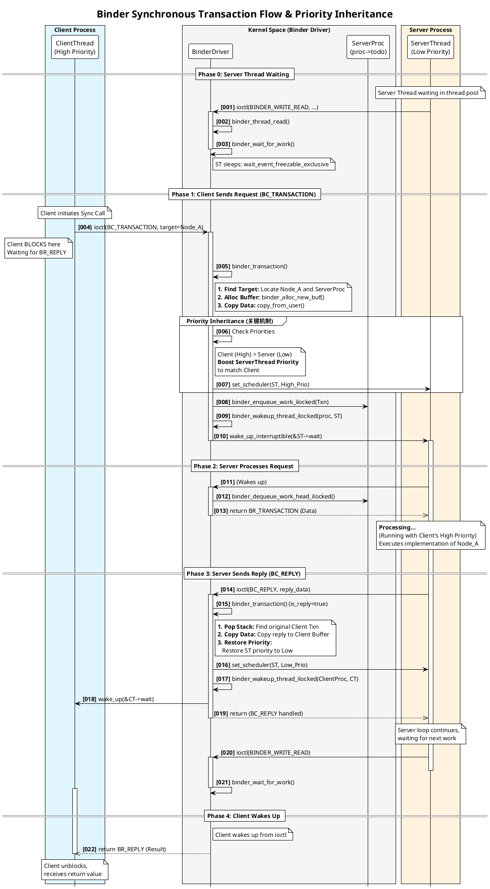

+++
date = '2025-08-28T14:30:02+08:00'
draft = false
title = 'Android Binder 通信模型与内存管理机制详解'
+++

Binder 是 Android 系统中进程间通信（IPC）的基石。不同于 Linux 传统的管道、Socket 或共享内存，Binder 提供了一种基于 C/S 架构、支持对象传输且内存高效的通信机制。

本文档将深入剖析 Binder 的同步/异步通信模型、线程调度策略以及内核层的内存管理机制。

## 1. 通信模型概述

Binder 驱动通过 `ioctl` 系统调用与用户空间交互。根据事务标志位（Flags），通信模式主要分为两类。

### 1.1 同步通信 (Synchronous)

这是 Binder 的默认通信模式。

* **流程**：Client 发起调用后，其线程会被挂起（Blocked），进入等待状态。Binder 驱动唤醒 Server 端线程处理请求。Server 处理完毕并将结果写入驱动后，驱动唤醒 Client 线程，Client 获取返回值继续执行。
* **特性**：
* **强一致性**：Client 确切知道 Server 何时处理完毕。
* **优先级继承**：为防止优先级反转，驱动会将 Client 线程的优先级临时“借”给 Server 线程。
* **资源限制**：受限于调用栈深度和线程池大小，过多的同步链调用可能导致死锁或 watchdog 超时。

#### 同步通信线程调度与优先级继承

在同步通信（Synchronous IPC）中，Client 端发起请求后会进入阻塞状态（Blocked），直到 Server 端返回结果。Binder 驱动在此过程中扮演了“调度员”的角色，不仅负责数据的传递，还负责协调双方线程的执行状态和优先级。

##### 核心机制

1. **阻塞等待**：Client 线程调用 `ioctl` 发送事务后，会在内核中休眠，等待 Server 的回复（Reply）。
2. **优先级继承**：如果 Client 的优先级高于 Server 线程，Binder 驱动会将 Server 线程的优先级临时提升至与 Client 一致，以避免“优先级反转”问题。当 Server 处理完请求后，恢复原优先级。
3. **线程栈管理**：Binder 驱动维护了 `transaction_stack`，用于追踪跨进程调用的嵌套关系（如 A->B->C），确保回复能正确层层返回。

##### 同步通信时序图

下图展示了一个完整的同步调用闭环：Client 发送请求 -> Server 被唤醒处理 -> Server 返回结果 -> Client 被唤醒。

#### 时序图逻辑解析

1. **请求发送 (`BC_TRANSACTION`)**：
* Client 线程调用 `ioctl` 进入内核。Binder 驱动根据 Handle 找到目标 Server 进程。
* 驱动执行 **优先级继承**：检测到 Client 优先级高于 Server，立即提升 Server 目标线程的优先级（在 `binder_transaction_priority` 函数中实现）。
* Client 线程在内核中挂起，等待回复。

2. **服务端处理 (`BR_TRANSACTION`)**：
* Server 线程被唤醒，从内核缓冲区读取参数。
* Server 线程在用户空间执行具体的业务逻辑。此时它持有 Client 的高优先级（如果有提升）。

3. **结果回复 (`BC_REPLY`)**：
* Server 处理完毕，调用 `ioctl` 发送 `BC_REPLY`。
* 驱动根据 `transaction_stack` 找到之前被挂起的 Client 线程。
* 驱动将 Server 线程的优先级**恢复**到原始状态。
* 驱动唤醒 Client 线程。

4. **客户端恢复 (`BR_REPLY`)**：
* Client 线程从 `ioctl` 返回，拿到 Server 的执行结果，继续执行后续代码。

### 1.2 异步通信 (Asynchronous / Oneway)

通过在 AIDL 中使用 `oneway` 关键字或在代码中设置 `TF_ONE_WAY` 标志触发。

* **流程**：Client 将数据写入驱动后立即返回，**不等待** Server 处理，也**不接收**返回值。
* **特性**：
* **高吞吐**：适合发送通知、事件分发（如 Input 事件）等对时效性要求高但不需要回执的场景。
* **串行化保障**：这是异步通信极其关键但常被忽略的特性（详见下文）。
* **无优先级继承**：Server 线程以其自身优先级运行。

---

## 2. 异步线程管理机制 (核心机制)

很多开发者误认为 Binder 的异步消息是完全并发处理的。然而，深入内核源码 (`binder.c`) 可知，Binder 驱动对异步消息有着严格的**串行化（Serialization）**策略。

### 2.1 调度策略

Binder 驱动在内核层维护了两种队列：

1. **全局队列 (`proc->todo`)**：属于进程，用于存放发往该进程不同 Binder 实体的任务。
2. **私有队列 (`node->async_todo`)**：属于 Binder 实体（Node），用于暂存发往该特定实体的异步任务。

**规则如下：**

* **不同实体，并发处理**：如果 Client 分别向 Server 的 `Node_A` (如 Audio) 和 `Node_B` (如 Power) 发送异步消息，这两个任务会进入全局队列，Server 线程池会分配**两个不同的线程**并发处理。
* **同一实体，串行处理**：如果 Client 连续向 Server 的 `Node_A` 发送多条异步消息，Binder 驱动会检查 `Node_A` 是否正如忙碌（`has_async_transaction == 1`）。如果是，后续消息会被强制放入 `node->async_todo` 排队，**不会唤醒新线程**。直到前一条消息处理完毕并释放 Buffer，下一条才会被移动到全局队列等待处理。

### 2.2 场景演示：串行 vs 并发

为了清晰地展示 Binder 驱动的线程选择策略和并发/串行逻辑，我们设计了以下场景：

1. **Client** 向 **Server** 发送 **Txn_1** (目标: Node_A)。 -> **立即执行 (ST1)**
2. **Client** 向 **Server** 发送 **Txn_2** (目标: Node_A)。 -> **串行排队 (Serialization)**
3. **Client** 向 **Server** 发送 **Txn_3** (目标: Node_B)。 -> **并发执行 (ST2)**
4. **ST1** 完成 Txn_1，触发 Txn_2 执行。

这个图展示了 `proc->todo`（全局队列）与 `node->async_todo`（节点私有队列）的交互。

```plantuml
@startuml
!theme plain
autonumber "<b>[000]"
hide footbox

title Binder Async Threading Model: Serialization (Node_A) vs Concurrency (Node_B)

box "Client Process" #E1F5FE
    participant "ClientThread" as CT
end box

box "Kernel Space (Binder Driver)" #F5F5F5
    participant "BinderDriver" as BD
    participant "ServerProc\n(proc->todo)" as P_TODO
    participant "Node_A\n(node->async_todo)" as NA_TODO
    participant "Node_B\n(node->async_todo)" as NB_TODO
end box

box "Server Process" #FFF3E0
    participant "ServerThread_1\n(ST1)" as ST1
    participant "ServerThread_2\n(ST2)" as ST2
end box

== Phase 0: Server Threads Enter Pool (Wait) ==

note over ST1, ST2: ST1 and ST2 enter the thread pool to wait for work

ST1 -> BD: ioctl(BINDER_WRITE_READ, ...)
activate BD
BD -> BD: binder_ioctl_write_read()\n -> binder_thread_read()
BD -> BD: binder_wait_for_work()
note right of BD: ST1 sleeps on\nwait_event_freezable_exclusive(proc->wait)
deactivate BD

ST2 -> BD: ioctl(BINDER_WRITE_READ, ...)
activate BD
BD -> BD: binder_ioctl_write_read()\n -> binder_thread_read()
BD -> BD: binder_wait_for_work()
note right of BD: ST2 sleeps on\nwait_event_freezable_exclusive(proc->wait)
deactivate BD

|||

== Phase 1: Txn_1 to Node_A (Success: Wake ST1) ==

CT -> BD: ioctl(BC_TRANSACTION | TF_ONEWAY, target=Node_A)
activate BD
BD -> BD: binder_transaction()

note right of BD
  <b>Logic Check:</b>
  Node_A->has_async_transaction == 0
end note

BD -> BD: Node_A->has_async_transaction = 1
BD -> BD: binder_alloc_new_buf()

BD -> BD: binder_proc_transaction(target_proc)
note right of BD
  Since !pending_async:
  Enqueue to Process Global TODO
end note
BD -> P_TODO: binder_enqueue_work_ilocked(Txn_1)

BD -> BD: binder_select_thread_ilocked(proc)
note right of BD
  Pops ST1 from 
  proc->waiting_threads
end note

BD -> BD: binder_wakeup_thread_ilocked(proc, ST1)
BD -> ST1: wake_up_interruptible(&ST1->wait)

BD -->> CT: return (Async returns immediately)
deactivate BD

activate ST1
ST1 -> BD: (Wakes up inside binder_thread_read)
activate BD
BD -> P_TODO: binder_dequeue_work_head_ilocked()
note left of P_TODO: Txn_1 moved from proc->todo to ST1
BD -->> ST1: return BR_TRANSACTION (Txn_1 data)
deactivate BD
note over ST1: <b>ST1 Processing Txn_1 (Node_A)</b>
deactivate ST1

|||

== Phase 2: Txn_2 to Node_A (Busy: Queued) ==

note left of CT: ST1 is still busy with Node_A.\nClient sends another to Node_A.

CT -> BD: ioctl(BC_TRANSACTION | TF_ONEWAY, target=Node_A)
activate BD
BD -> BD: binder_transaction()

note right of BD
  <b>Logic Check:</b>
  Node_A->has_async_transaction == 1
  (Because Txn_1 is active)
end note

BD -> BD: pending_async = true

BD -> BD: binder_proc_transaction(target_proc)
note right of BD
  Since pending_async == true:
  Enqueue to Node Private TODO
  <b>NO THREAD WOKEN UP!</b>
end note
BD -> NA_TODO: binder_enqueue_work_ilocked(Txn_2)

BD -->> CT: return
deactivate BD

|||

== Phase 3: Txn_3 to Node_B (Independent: Wake ST2) ==

note left of CT: ST1 busy with A, Txn_2 queued on A.\nClient sends to <b>Node_B</b>.

CT -> BD: ioctl(BC_TRANSACTION | TF_ONEWAY, target=Node_B)
activate BD
BD -> BD: binder_transaction()

note right of BD
  <b>Logic Check:</b>
  Node_B->has_async_transaction == 0
  (Node_B is independent)
end note

BD -> BD: Node_B->has_async_transaction = 1

BD -> BD: binder_proc_transaction(target_proc)
note right of BD
  Enqueue to Process Global TODO
end note
BD -> P_TODO: binder_enqueue_work_ilocked(Txn_3)

BD -> BD: binder_select_thread_ilocked(proc)
note right of BD
  ST1 is not in waiting_threads.
  Pops ST2 from waiting_threads.
end note

BD -> BD: binder_wakeup_thread_ilocked(proc, ST2)
BD -> ST2: wake_up_interruptible(&ST2->wait)

BD -->> CT: return
deactivate BD

activate ST2
ST2 -> BD: (Wakes up)
activate BD
BD -> P_TODO: binder_dequeue_work_head_ilocked()
BD -->> ST2: return BR_TRANSACTION (Txn_3 data)
deactivate BD
note over ST2: <b>ST2 Processing Txn_3 (Node_B)</b>
deactivate ST2

|||

== Phase 4: ST1 Finishes Txn_1 & Triggers Txn_2 ==

note over ST1: ST1 finishes work,\ncalls free buffer

ST1 -> BD: ioctl(BC_FREE_BUFFER, buffer_ptr)
activate BD
BD -> BD: binder_thread_write() -> binder_free_buf()

note right of BD
  <b>Logic Check:</b>
  buffer->async_transaction && buffer->target_node
end note

BD -> NA_TODO: binder_dequeue_work_head_ilocked()
note right of NA_TODO
  Found Txn_2 waiting!
end note

alt Work Found in Async_Todo
    BD -> P_TODO: binder_enqueue_work_ilocked(Txn_2)
    note right of P_TODO
      Move Txn_2 from Node_A private queue
      to Global Process queue
    end note
    
    BD -> BD: binder_wakeup_proc_ilocked(proc)
    note right of BD
      <b>Wake up any available thread.</b>
      ST1 is currently in ioctl, so it will likely
      loop back and pick this up immediately
      in binder_thread_read.
    end note
else No Work Found
    BD -> BD: buf_node->has_async_transaction = false
end

BD -->> ST1: return
deactivate BD

ST1 -> BD: ioctl(BINDER_WRITE_READ, read...)
activate BD
BD -> BD: binder_thread_read()
BD -> P_TODO: binder_dequeue_work_head_ilocked()
note right of P_TODO: Picking up Txn_2
BD -->> ST1: return BR_TRANSACTION (Txn_2 data)
deactivate BD

note over ST1: <b>ST1 Processing Txn_2 (Node_A)</b>

@enduml

```

### 2.3 两级队列机制详解

Binder 驱动之所以在异步通信（oneway）中引入**两级队列机制**（`proc->todo` 和 `node->async_todo`），是为了解决一对核心矛盾：

**多线程并发处理（高吞吐） VS 消息严格顺序性（逻辑正确性）**

如果只用一个全局队列，或者只用私有队列，都会导致严重的问题。下面详细拆解为什么要这么设计。

#### 1. 核心原因：保证“同一个Binder实体”的消息顺序

这是最根本的原因。异步消息（oneway）虽然发送端不等待，但在业务逻辑上通常要求**“发送顺序等于执行顺序”**。

**假设场景**：你写了一个 View，先发送 `Show()`，紧接着发送 `UpdateContent()`。

* **期望**：先显示窗口，再更新内容。
* **如果没有 `node->async_todo`（只有全局队列 `proc->todo`）**：
1. `Show()` 进入全局队列。
2. `UpdateContent()` 进入全局队列。
3. Server 的 **Thread A** 抢到了 `Show()`。
4. Server 的 **Thread B** 抢到了 `UpdateContent()`。
5. 由于线程调度是不确定的，**Thread B 可能比 Thread A 先执行完**。
6. **后果**：系统试图在一个还没显示的窗口上更新内容，导致 crash 或逻辑错误。

**引入 `node->async_todo` 后**：
Binder 驱动强制规定：**对于同一个 Node，同一时刻只能有一个异步任务在全局队列中**。后续任务必须在 `node->async_todo` 中排队，直到前一个任务执行完释放。这就物理上杜绝了乱序执行的可能性。

#### 2. 次要原因：防止“队头阻塞”与资源独占 (公平性)

这是为了系统的稳定性和公平性考虑。

**假设场景**：

* **Client A** 瞬间向 **Service A**（Node A）发送了 1000 个异步消息（例如疯狂打 Log 或刷屏）。
* **Client B** 向 **Service B**（Node B）发送了 1 个重要的异步消息（例如“接听电话”）。

**如果没有 `node->async_todo`（所有消息都进全局 `proc->todo`）**：

1. 全局队列里塞满了 1000 个 Node A 的消息。
2. Node B 的消息排在第 1001 位。
3. Server 的线程池（假设 16 个线程）全部被唤醒去处理 Node A 的消息。
4. **后果**：Node B 的消息被严重延迟处理，导致“接电话”卡顿。这就是典型的**队头阻塞（Head-of-line blocking）**或**邻居噪声（Noisy Neighbor）**问题。

**引入 `node->async_todo` 后**：

1. Node A 的第 1 个消息进入全局队列 `proc->todo`。
2. Node A 的第 2~1000 个消息进入私有队列 `node->async_todo`。
3. Node B 的消息进入全局队列 `proc->todo`。
4. **结果**：全局队列里只有 2 个任务（Node A 的任务1，Node B 的任务1）。
5. Server 线程池会分配两个线程，**并发处理** Node A 和 Node B。
6. **收益**：Node A 的洪水攻击不会淹没 Node B 的正常请求，实现了**进程级别的任务公平调度**。

#### 3. 形象比喻：银行柜台模型

为了方便理解，我们可以把 SystemServer 比作一个**银行**，Binder 线程是**柜员**。

* **`proc->todo` (全局队列)**：银行大厅的**叫号屏幕**。所有柜员看着屏幕，有号就叫。
* **`node->async_todo` (私有队列)**：某个**具体客户（Binder实体）手里的待办单据**。

**工作流程**：

1. **客户 A (SurfaceFlinger)** 拿了一叠单据（10 个 updateInput）进来了。
2. **规则**：银行规定，一个客户一次只能办一张单据，办完这张才能取下一张的号。
3. **Client A** 取了一个号（进入 `proc->todo`），手里捏着剩下 9 张单据（留在 `node->async_todo`）。
4. **Client B (Audio)** 进来，拿了一张单据，也取了一个号（进入 `proc->todo`）。
5. **柜员 1** 叫到了 Client A，开始办业务。
6. **柜员 2** 叫到了 Client B，开始办业务。**（并发执行，互不影响）**
7. **Client A** 的第一张单据办完，柜员 1 问：“还有吗？” A 说：“有”。于是柜员 1 帮 A 重新取个号（把下一张单据从 `async` 移到 `proc`），等待下一个柜员叫号。

#### 4. 总结：两级队列的各自职责

| 队列类型 | `proc->todo` (全局队列) | `node->async_todo` (私有队列) |
| --- | --- | --- |
| **层级** | 进程级 (Process Level) | 对象级 (Binder Node Level) |
| **可见性** | 所有 Binder 线程可见 | 仅内核驱动可见，线程不可直接获取 |
| **核心职责** | **分发任务**：作为线程池的抢占池，实现跨服务的并发。 | **缓冲与排序**：暂存特定服务的后续任务，保证顺序，防止洪水。 |
| **处理逻辑** | FIFO（先进先出），任何空闲线程可取。 | 严格串行，必须等前一个任务 `BC_FREE_BUFFER` 后才释放。 |
| **解决痛点** | 解决“谁来干活”的问题。 | 解决“顺序错乱”和“资源独占”的问题。 |

正是因为这两个队列的配合，Binder 才能做到：**既能让 Audio 和 Input 并行处理（走全局队列），又能保证 Input 的每一帧严格按顺序刷新（走私有队列）。**

### 2.4 结论与风险

Binder 并没有为异步消息分配“专用”线程，所有 Binder 线程都是通用的。但是，**针对同一目标对象的连续异步调用会退化为单线程处理**。

**风险**：如果 Client（如 SurfaceFlinger）向 Server（如 SystemServer）的同一个接口疯狂发送大包，且 Server 端因锁竞争导致处理变慢，内核缓冲区会迅速积压，最终导致 `binder_alloc` 失败（-28 ENOSPC）。

## 3. 内存管理机制

Binder 驱动通过 `mmap` 和页表修改实现了高效的“一次拷贝”内存管理，避免了传统 IPC 的两次拷贝开销。

### 3.1 内存映射流程

1. **建立 VMA (`binder_mmap`)**：
* 进程启动时打开 `/dev/binder`，驱动为其分配一块虚拟地址空间（通常 1MB - 8MB），但**不分配物理内存**。
* 这块区域专门用于接收 Binder 数据。

2. **分配与映射 (`binder_alloc_buf`)**：
* 当事务发生时，驱动从内核通用物理内存池（vmalloc/alloc_page）申请物理页。
* **关键步骤**：驱动修改目标进程的页表，将这块物理内存**直接映射**到目标进程步骤 1 中建立的虚拟地址空间中。
* 目标进程的用户空间线程可以直接读取这块内存。

3. **释放 (`BC_FREE_BUFFER`)**：
* Server 处理完数据后，必须通知驱动释放。驱动解除映射并归还物理页。

### 3.2 内存配额 (Quota)

为了防止异步消息滥用导致内存耗尽（DoS 攻击），Binder 实施了严格的配额管理：

* **异步空间限制 (`free_async_space`)**：
* 每个进程的异步事务总内存被限制为 Binder 总 Buffer 大小的 **50%**。
* **分配检查**：`binder_alloc_buf` 时，如果是 `oneway` 调用，驱动会检查 `current_async_size + new_size <= total_buffer / 2`。
* 如果超过配额，分配失败，客户端收到错误（通常是静默丢弃或报错）。

* **同步事务**：
* 不受 50% 配额限制，只受限于总缓冲区大小。
* 依赖同步调用的阻塞特性形成天然的背压（Back-pressure）。

## 4. 常见问题排查 (Debug)

在系统开发中，Binder 异常通常表现为 Crash 或 Log 报错。

### 4.1 常见错误代码

| 错误类型 | 现象描述 | 可能原因 | 排查方向 |
| --- | --- | --- | --- |
| **DEAD_OBJECT** | `DeadObjectException` | 目标进程（Server）已崩溃或被杀。 | 检查 Logcat 中 Server 进程的死亡日志。 |
| **FAILED_TRANSACTION** | 底层返回 -28 (ENOSPC) | **Binder 缓冲区耗尽**。 | 1. 检查 Server 是否 ANR 或死锁。 2. 检查是否有 Oneway Spam（如 SF 发送大包）。 3. 检查 Server 线程池是否耗尽。 |
| **TRANSACTION_TOO_LARGE** | `TransactionTooLargeException` | 单次传输数据超过限制（约 1MB/2）。 | 检查传输的数据结构（如大 Bitmap、长列表）。 |
| **BR_FAILED_REPLY** | IPC 调用失败 | 目标进程拒绝处理或处理出错。 | 检查 SELinux 权限 (`avc: denied`)。 |

### 4.2 深度案例：缓冲区满但 Server 无响应

**现象**：`binder_alloc` 报错 `pid XXX spamming oneway?`，缓冲区满，但 Server 进程看起来没有崩溃。

**深度分析逻辑**：

1. **线程饥饿 (Starvation)**：Server 的 Binder 线程池可能被其他高频、耗时的任务（如 `checkPermission`、ContentProvider 查询）占满。
2. **锁竞争 (Lock Contention)**：Server 线程虽然拿到了 Binder 任务，但卡在了内部锁（如 `WindowManagerGlobalLock` 或 `InputDispatcher mLock`）上，导致无法完成处理并释放 Buffer。
3. **串行化阻塞**：如本文 2.2 节所述，如果发给同一个对象，即使有空闲线程，驱动也不会调度，导致数据在内核积压。

**解决方案**：

* 优化 Server 端锁的粒度。
* Client 端避免短时间发送大量 Oneway 大包。
* 排查 Server 端是否存在高频调用占用了所有 Binder 线程。