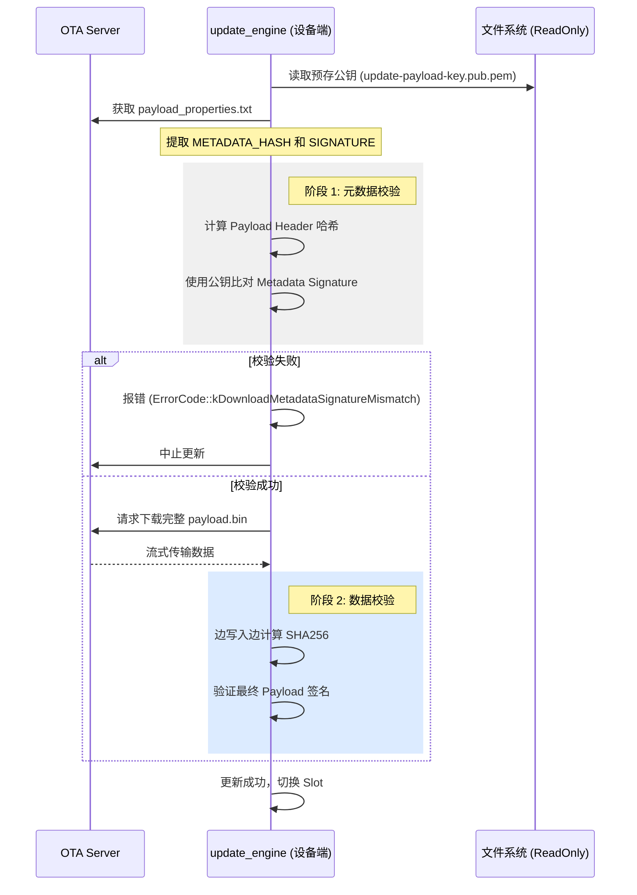
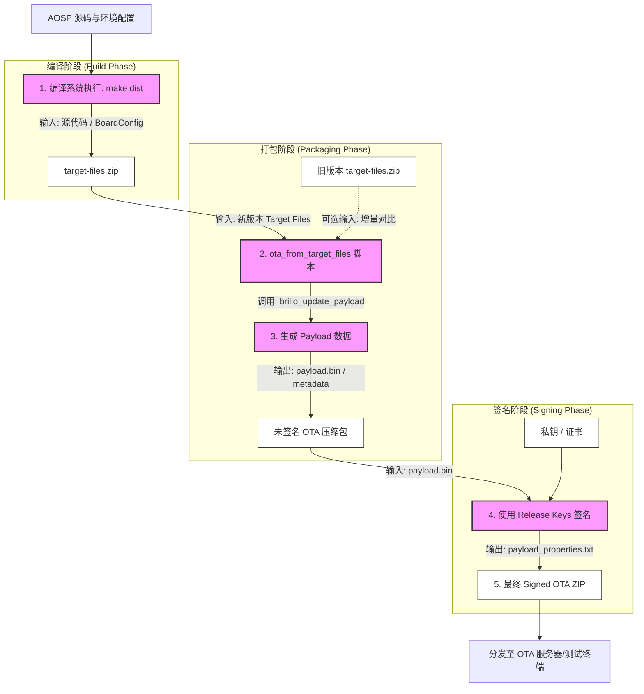

+++
date = '2025-08-27T11:36:11+08:00'
draft = true
title = 'Android OTA打包原理'
+++

## 目录

- [目录](#目录)
- [OTA 更新的核心原理](#ota-更新的核心原理)
  - [核心组件](#核心组件)
- [OTA 打包详细流程](#ota-打包详细流程)
  - [1. 准备 Target Files](#1-准备-target-files)
  - [2. 执行打包脚本](#2-执行打包脚本)
  - [3. 生成 Payload](#3-生成-payload)
  - [4. 签名 (Signing)](#4-签名-signing)
  - [5. 生成元数据与属性文件](#5-生成元数据与属性文件)
  - [6. 签名校验](#6-签名校验)
    - [1. 核心机制：公私钥对](#1-核心机制公私钥对)
    - [2. 验签的两个阶段](#2-验签的两个阶段)
      - [阶段 A：元数据验签 (Metadata Verification)](#阶段-a元数据验签-metadata-verification)
      - [阶段 B：数据验签 (Payload Verification)](#阶段-b数据验签-payload-verification)
    - [3. 详细校验流程图](#3-详细校验流程图)
    - [4. 关键技术点](#4-关键技术点)
    - [5. 调试建议](#5-调试建议)
  - [7. 流程图](#7-流程图)
    - [流程详细说明](#流程详细说明)
- [AOSP 16 的关键变化与优化](#aosp-16-的关键变化与优化)
- [总结：打包流程简表](#总结打包流程简表)

在 AOSP 16（Android 16）中，OTA（Over-the-Air）更新依然延续了以 **Virtual A/B (VAB)** 为核心的架构，并进一步优化了压缩算法（如 Snapshot 压缩）和更新效率。作为座舱软件架构中至关重要的模块，OTA 的打包流程不仅涉及镜像文件的差异对比，还包含复杂的元数据生成与签名校验。

以下是 AOSP 16 OTA 打包的核心原理与详细流程。

---

## OTA 更新的核心原理

AOSP 16 默认采用 **Virtual A/B** 更新机制。与传统的 A/B 分区不同，VAB 不再需要两套完整的物理分区（减少了 50% 的空间占用），而是利用 **快照 (Snapshot)** 技术在 `/data` 分区或指定的 `cow` (Copy-on-Write) 区域动态存储差异数据。

### 核心组件

* **`ota_from_target_files`**: 核心 Python 脚本，用于从编译生成的 `target-files.zip` 提取数据并生成 OTA 包。
* **`payload.bin`**: OTA 包的主体，包含所有分区的二进制数据或差异补丁。
* **`update_engine`**: 客户端守护进程，负责解析 `payload.bin` 并将其写入分区。
* **`delta_generator` / `brillo_update_payload`**: 用于计算两个版本之间差异（Diff）并生成 Payload 的底层工具。

---

## OTA 打包详细流程

OTA 的打包通常在 AOSP 完整编译（`make dist`）之后进行。

### 1. 准备 Target Files

编译系统会先生成一个包含系统所有分区镜像、符号表、恢复脚本和元数据的压缩包，路径通常为：
`out/dist/$(PRODUCT)-target_files-$(BUILD_ID).zip`
这是 OTA 打包的**唯一合法输入**。它不仅包含镜像，还包含 `META/` 文件夹下的关键配置文件（如 `ab_partitions.txt`）。

### 2. 执行打包脚本

使用 AOSP 提供的工具生成 OTA 包。根据更新类型，命令有所不同：

* **全量包 (Full OTA):** 包含完整的分区镜像，适用于任何版本的升级。
* **增量包 (Incremental OTA):** 仅包含两个版本（Source 和 Target）之间的差异，体积更小。

### 3. 生成 Payload

这是最耗时的步骤。打包脚本会调用 `brillo_update_payload` 执以下操作：

* **解析分区**: 提取 `target-files.zip` 中的物理分区镜像（如 `system`, `vendor`, `product` 等）。
* **数据压缩**: AOSP 16 增强了对 `zstd` 或 `lz4` 压缩算法的支持，以平衡压缩率和解压速度。
* **差异对比 (仅限增量)**: 逐块（Block-by-block）对比源和目标的哈希值。对于变动的数据块，生成 `BSDIFF` 或 `SOURCE_COPY` 操作。

### 4. 签名 (Signing)

为了安全性，OTA 包必须经过签名。

* **Payload 签名**: 对 `payload.bin` 进行哈希计算并用私钥签名。
* **Metadata 签名**: 对描述更新内容的元数据进行签名，`update_engine` 会先校验元数据，再决定是否下载大体积的 Payload。
* **ZIP 签名**: 最后对整个 ZIP 包进行签名。

### 5. 生成元数据与属性文件

打包结束后，会生成 `payload_properties.txt`，其中包含：

* **FILE_HASH**: Payload 文件的哈希。
* **FILE_SIZE**: Payload 文件大小。
* **METADATA_HASH**: 元数据哈希。
* **METADATA_SIZE**: 元数据大小。
这些信息是客户端 `update_engine` 启动更新的“准入证”。

---

### 6. 签名校验

在 AOSP 的 OTA 架构中，验签（Signature Verification）是确保系统安全性的最后一道防线。它通过**非对称加密算法**（通常是 RSA 或 ECDSA）来验证 `payload.bin` 的来源真实性和数据完整性。

整个验签过程通常分为两个阶段：**元数据验签**（快速校验）和 **Payload 数据验签**（完整性校验）。

---

#### 1. 核心机制：公私钥对

* **打包端（私钥签名）**：在服务器端，打包脚本提取 `payload.bin` 的哈希值，并使用 **Private Key** 进行签名，将签名数据附加在 Payload 的末尾或元数据中。
* **终端设备（公钥验签）**：Android 设备的出厂镜像（Rootfs）中预存了对应的 **Public Key**。路径通常位于：
`/system/etc/update_engine/update-payload-key.pub.pem`

---

#### 2. 验签的两个阶段

##### 阶段 A：元数据验签 (Metadata Verification)

为了节省资源，`update_engine` 在开始下载巨大的 Payload 数据之前，会先对“元数据”（Metadata）进行验签。

* **输入**：`payload.bin` 的前部（描述分区信息、操作指令的部分）和 `payload_properties.txt`。
* **过程**：
  1. 从 `payload_properties.txt` 获取 `METADATA_HASH`。
  2. `update_engine` 解析 `payload.bin` 的 Header 得到实际的元数据签名。
  3. 使用公钥解密签名，对比哈希值。

* **目的**：防止恶意攻击者通过伪造小的元数据文件诱导系统分配大量的存储空间。

##### 阶段 B：数据验签 (Payload Verification)

这是对实际镜像数据的校验，通常在数据下载并写入分区（或 COW 区域）的过程中或之后进行。

* **过程**：
1. `update_engine` 在流式接收 `payload.bin` 时，实时计算数据的哈希值。
2. 读取 Payload 末尾的 `Signature` 块。
3. 利用公钥校验整个 Payload 的哈希是否匹配。

---

#### 3. 详细校验流程图

以下是 `update_engine` 执行验签的逻辑顺序：

---

#### 4. 关键技术点

* **信任链 (Chain of Trust)**：验签所用的公钥是在系统编译阶段注入到只读分区（`/system`）的。如果攻击者想要绕过验签，必须先破解系统分区（这被 dm-verity 保护），从而形成了完整的信任链。
* **流式处理**：为了避免内存溢出，`update_engine` 并不会等整个几 GB 的包下载完再验签，而是通过分块计算哈希的方式，在写入的同时进行校验。
* **错误处理**：在 AOSP 16 中，如果验签失败，`update_engine` 会抛出特定的错误代码（如 `kPayloadTimestampError` 或 `kDownloadPayloadVerificationError`），并记录在 `delta_generator` 的日志中，方便回溯问题。

---

#### 5. 调试建议

如果遇到验签失败，通常可以排查以下几点：

1. **证书匹配**：检查 `target-files.zip` 签名时使用的私钥，是否与设备 `/etc/update_engine/` 下的公钥成对。
2. **时间戳检查**：AOSP 默认禁止版本回滚，如果 Payload 中的 `security_patch_level` 低于当前系统，即使验签通过也会报错。
3. **对齐与偏移**：确保 `payload.bin` 在传输过程中没有因为断点续传导致字节偏移，否则哈希计算必败。

### 7. 流程图
在 AOSP 16 的 OTA 构建过程中，核心逻辑是围绕 `target-files.zip` 进行数据提取、差异计算和签名。

---

#### 流程详细说明

* **编译阶段 (`make dist`)**
  * **输入**：AOSP 源码、设备驱动 (Vendor)、板级配置 (BoardConfig.mk)。
  * **输出**：`target-files.zip`。它是打包 OTA 的“原材料库”，包含了所有分区的镜像（如 `system.img`, `vendor.img`）、各种符号表、分区表信息以及 `OTA/bin` 工具链。

* **打包脚本执行 (`ota_from_target_files`)**
  * **输入**：当前版本的 `target-files.zip`；若是增量包，则还需提供历史版本的 `target-files.zip`。
  * **输出**：初步的 OTA ZIP 包，内部包含 `payload.bin`（承载实际分区的二进制数据）。

* **生成 Payload 数据**
  * **输入**：从 Target Files 中提取的原始分区镜像。
  * **输出**：`payload.bin`。该步骤会执行 Block-level 的对比，对于 Virtual A/B 架构，会根据配置决定是全量写入还是生成差异补丁。

* **签名阶段 (`Signing`)**
  * **输入**：未签名的 `payload.bin` 以及存储在安全服务器上的 RSA 私钥/证书。
  * **输出**：经过哈希校验并附带签名块的 `payload.bin`。

* **最终生成与属性提取**
  * **输入**：已签名的 Payload 数据。
  * **输出**：最终的 OTA 压缩包。同时生成 `payload_properties.txt`，该文件记录了 `METADATA_HASH` 和 `METADATA_SIZE` 等关键信息，供座舱端的 `update_engine` 在下载前进行快速预校验。

## AOSP 16 的关键变化与优化

* **VBP (Virtual Block Processing)**: AOSP 16 进一步完善了虚拟块处理，减少了在 OTA 过程中对磁盘 IO 的占用，提升了后台更新的隐蔽性。
* **Cow Version 3 (V3)**: 相比之前的版本，V3 格式的 COW 文件在系统回滚和合并（Merge）阶段更加高效，降低了座舱系统在断电重启后的风险。
* **微内核架构适配**: 针对高性能座舱芯片，OTA 打包流程中对 `Microdroid` 或 `pVM`（受保护的虚拟机）的镜像处理更加标准化。

---

## 总结：打包流程简表

| 阶段 | 输入 | 执行工具 | 输出 | 关键点 |
| --- | --- | --- | --- | --- |
| **构建阶段** | 源代码 | `make dist` | `target-files.zip` | 包含所有分区和元数据 |
| **处理阶段** | `target-files.zip` | `ota_from_target_files` | `payload.bin` | 执行 Diff 算法与压缩 |
| **签名阶段** | 原始 OTA 包 | `sign_target_files_apks` | `signed-ota.zip` | 使用 release-keys 确保安全 |

