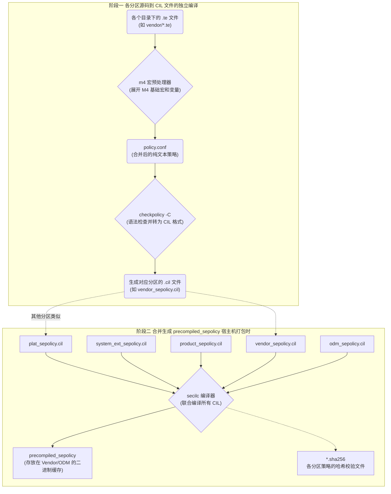
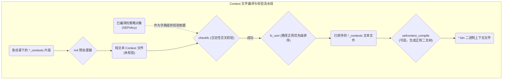
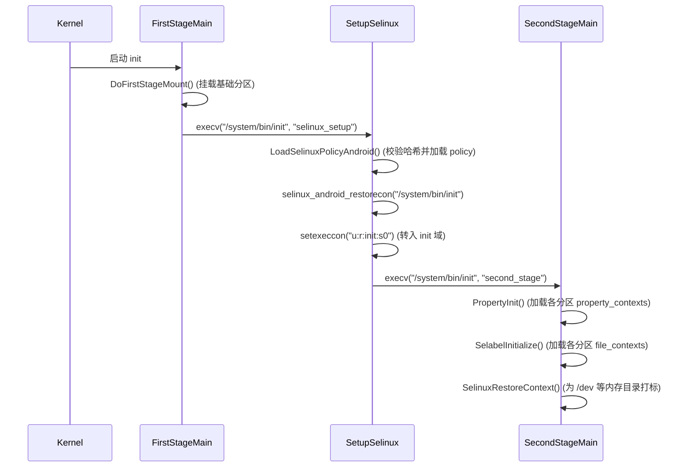
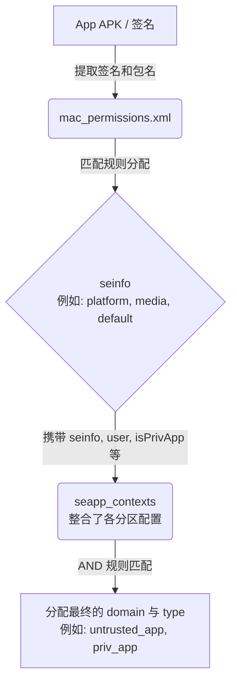
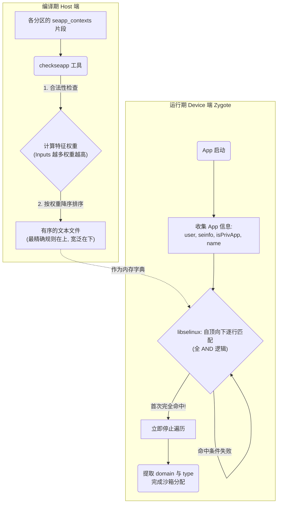

+++
date = '2025-08-27T11:36:11+08:00'
draft = true
title = 'Android SELinux 编译与加载机制解析'
+++

# Android SELinux 编译与加载机制解析（基于 AOSP 16）

本文基于 AOSP 16 源码详细讲解 Android 系统中 SELinux 的文件分类、按分区隔离的构建配置项与编译机制、常用编译与验证命令，以及在系统启动时的动态校验与加载机制。

## 1. SELinux 文件分类

系统中的 SELinux 文件主要可以分为两大类：**Policy 文件** 和 **Context 文件**。

### 1.1 Policy 文件
Policy 文件通常是以 `.te` 结尾的文件。这些文件主要用于定义 Domain（域）、Type（类型）以及各种访问控制策略（Allow, Neverallow 等）。在 Android 中，它们还广泛使用了 M4 宏来精简策略。

### 1.2 Context 文件
Context 文件的主要作用是给一个 Object（如文件、属性、服务、进程等）分配 SELinux Label（标签）。Context 文件主要分为以下几类：

| 文件类型 | 作用描述 | 示例/说明 |
| :--- | :--- | :--- |
| `file_contexts` | 给文件系统中的文件分配 Label。 | `/system/bin/urmservice u:object_r:urmservice_exec:s0` |
| `genfs_contexts` | 给类似 `/proc`, `/sys` 这种不支持扩展属性 (Extended attributes) 的虚拟文件系统分配 Label。因为它们不能持久化保存 Label，挂载时需要重新分配。 | `genfscon proc /net/if_inet6 u:object_r:proc_net:s0` |
| `property_contexts` | 给 Android 的系统属性 (System Properties) 分配 Label。 | `ro.boot.vendor. u:object_r:vendor_default_prop:s0` |
| `service_contexts` | 给 Android Binder Services 分配 Label。 | - |
| `seapp_contexts` | 给 App 进程以及 `/data/data` 目录分配 Label。Zygote 和 Installd 会读取此文件。 | - |
| `mac_permissions.xml` | 根据 App 的签名或包名，给 App 分配 `seinfo`。`seinfo` 作为 Key 在 `seapp_contexts` 中匹配具体的 Domain。 | - |

> **什么是 Extended attributes (xattr)?**
> 扩展属性是永久关联到文件和目录的 name:value 对，常见于 ext4、f2fs 等现代文件系统。

---

## 2. SEPolicy 构建配置项与分层架构（Treble 隔离）

从 Android 8.0 引入 Treble 架构以来，为了支持系统和供应商分区的独立升级（如 GSI 刷机、Mainline 更新），SELinux 策略不再是一个单体文件，而是**被严格地拆分隔离到各个分区中**。到了 AOSP 16，这种隔离体系（System_ext、Product、Vendor、ODM 等）已经极其完善。

### 2.1 AOSP SELinux 构建配置项详解 (BoardConfig 核心宏)

在设备的 `BoardConfig.mk`（或类似构建脚本）中，我们会使用一系列配置宏（Macro）来向编译系统注册各类 SELinux 策略目录。作为一个 SELinux 专家，必须熟练掌握以下配置项的作用及边界：

#### 2.1.1 供应商级（Vendor/ODM）策略配置
- **`BOARD_VENDOR_SEPOLICY_DIRS`**
  - **作用**：指定特定 Vendor（芯片平台厂商或设备制造商）的 SELinux 策略目录。这是平时驱动和底层开发最常用的配置项。
  - **编译产出**：生成到 `/vendor/etc/selinux/` 目录下（如 `vendor_sepolicy.cil`, `vendor_file_contexts`）。
  - **前身**：在较老的版本中被称作 `BOARD_SEPOLICY_DIRS`。
- **`BOARD_ODM_SEPOLICY_DIRS`**
  - **作用**：指定 ODM（原始设计制造商）专属的策略目录。在 AOSP 设计中，同一个 SoC 平台（Vendor）可以适配不同形态的设备（ODM），该宏允许设备级独有的硬件组件（如特定型号的指纹、相机）拥有独立的策略。
  - **编译产出**：生成到 `/odm/etc/selinux/` 目录下。

#### 2.1.2 框架增强级（System_ext/Product）策略配置
随着 AOSP 对系统组件的细分，许多原本属于 `/system` 的组件被剥离到 `system_ext` 和 `product` 分区，并引入了 Public/Private 概念。
- **`SYSTEM_EXT_PUBLIC_SEPOLICY_DIRS`** / **`PRODUCT_PUBLIC_SEPOLICY_DIRS`**
  - **作用**：指定 `/system_ext` 或 `/product` 分区下的**公共**策略目录。定义在这里的 Types 和 Attributes **会被暴露给 Vendor**（即参与 Vendor 层的策略编译和 `Neverallow` 检查）。通常用于系统扩展组件向底层暴露其服务接口。
- **`SYSTEM_EXT_PRIVATE_SEPOLICY_DIRS`** / **`PRODUCT_PRIVATE_SEPOLICY_DIRS`**
  - **作用**：指定对应分区的**私有**策略目录。这些策略仅在该分区内部可见，**Vendor 层的策略不可见也无法引用（引用会报语法错误）**。主要用于分区内部的内部域（如内置私有 App）的安全强化。

#### 2.1.3 核心框架级扩展（极度不推荐）
在极个别情况下，厂商试图去修改 AOSP 核心 Framework 的策略（会破坏 CTS/GSI 兼容性）：
- **`BOARD_PLAT_PUBLIC_SEPOLICY_DIR`** / **`BOARD_PLAT_PRIVATE_SEPOLICY_DIR`**
  - **作用**：允许向 `/system` 分区的基础策略（Public/Private）中注入厂商定义的增强策略。
  - **风险**：AOSP 官方强烈反对使用。注入这里的策略将被打包到 System.img 中，导致设备无法通过标准的 GSI (Generic System Image) 测试。

#### 2.1.4 构建系统控制宏（进阶配置）
- **`BOARD_SEPOLICY_M4DEFS`**：允许向 M4 宏处理器传递特定的变量。例如，可根据硬件配置向策略中注入条件编译：`BOARD_SEPOLICY_M4DEFS += -D build_with_nfc=true`。
- **`BOARD_SEPOLICY_IGNORE`**：定义需要被构建系统忽略的 `.te` 或 Context 文件路径匹配模式。
- **`SEPOLICY_PATH` / `TARGET_SEPOLICY_DIR`**：
  - **注意**：这两个通常**不是** AOSP 原生的标准宏（原生为 `BOARD_VENDOR_SEPOLICY_DIRS` 等），而是高通 (QCOM)、联发科 (MTK) 等 SoC 供应商在自己的基础构建架构中封装的自定义变量。通常，芯片厂商会定义 `TARGET_SEPOLICY_DIR` 并在其内部的 `BoardConfig` 中将其赋值给标准的 `BOARD_VENDOR_SEPOLICY_DIRS`。

### 2.2 阶段一：各分区生成独立的 `.cil` 文件
在编译过程中，构建系统会根据上述 `_SEPOLICY_DIRS` 宏加载策略，分别转换为 CIL (Common Intermediate Language) 格式，并存放在各自的分区中：
- `/system/etc/selinux/plat_sepolicy.cil`
- `/system_ext/etc/selinux/system_ext_sepolicy.cil`
- `/product/etc/selinux/product_sepolicy.cil`
- `/vendor/etc/selinux/vendor_sepolicy.cil`
- `/odm/etc/selinux/odm_sepolicy.cil`

**结论：生成的中间策略产物是严格区分分区的。**

### 2.3 阶段二：生成合并的 `precompiled_sepolicy` 加速启动
虽然策略被拆分到了各分区，但在设备启动时如果每次都动态将这些 `.cil` 文件合并编译成单体策略，会严重拖慢开机速度。
因此，在**编译整包镜像（make all）**时，构建系统会调用一系列工具，不仅完成了 `.te` 到 `.cil` 的转换，还会提前将所有分区的 `.cil` 文件联合编译成一个唯一的二进制产物：**`precompiled_sepolicy`**。

这个文件通常保存在 `/vendor/etc/selinux/`（或 `/odm/etc/selinux/`）目录下，作为当前系统与供应商策略组合的缓存。



与 `precompiled_sepolicy` 存放在一起的还有对应的 `sha256` 文件，记录了参与编译的各分区策略的哈希值，供启动时校验使用。

### 2.4 Context 文件的编译与校验机制 (file_contexts 等)

#### 2.4.1 编译与正则树构建
不仅 Policy 文件（`.te`）会被编译，`file_contexts`、`property_contexts`、`service_contexts` 等 Context 文件在构建阶段也有一套极其严格的验证与转化流程，防止运行时的标签不匹配问题。

整个 Context 文件的编译流程分为以下几个关键步骤：

1. **收集与宏展开 (`m4`)**：与 `.te` 类似，构建系统首先收集指定分区（如 System、Vendor）下所有的 `file_contexts` 片段文件，调用 `m4` 处理可能存在的宏替换和目录路径替换。
2. **强类型一致性校验 (`checkfc`)**：**`checkfc`** 工具会读取合并展开后的 Context 文本文件，并将其中的标签（Label）与已编译的 SEPolicy 策略树进行交叉对比。如果 `file_contexts` 中分配了未在 `.te` 中声明的类型，`checkfc` 会直接阻断编译。
3. **优先级排序 (`fc_sort`)**：SELinux 匹配文件路径使用的是正则表达式。**`fc_sort`** 工具会对 `file_contexts` 里的每一条正则表达式计算权重（字面量数量、通配符数量），并自动排序，确保最精确的路径优先匹配（避免 `/vendor/.*` 覆盖 `/vendor/bin/hw/.*`）。
4. **正则预编译 (`sefcontext_compile`)**：为了加快设备启动阶段的解析匹配速度，通过排序验证的文本文件最终会被传递给 **`sefcontext_compile`** 工具，将其转换为针对 PCRE 引擎优化过的二进制格式文件（如 `plat_file_contexts.bin`）。



#### 2.4.2 生成的 file_contexts 的去向与应用生命周期

经过上述编译流程，各分区专属的 `file_contexts` 会在编译输出目录（Intermediate Out）中生成：
- `out/target/product/<device>/system/etc/selinux/plat_file_contexts`
- `out/target/product/<device>/system_ext/etc/selinux/system_ext_file_contexts`
- `out/target/product/<device>/product/etc/selinux/product_file_contexts`
- `out/target/product/<device>/vendor/etc/selinux/vendor_file_contexts`

针对不同的文件系统和场景，它们的加载模块和生效生命周期有本质的区别：

| 目标分区/文件系统 | 使用模块 / 责任方 | 加载时机 | 生效时机（何时真正打上 Label） |
| :--- | :--- | :--- | :--- |
| **只读分区**<br/>(`/system`, `/vendor`, `/product` 等 ext4/erofs) | **Host 端打包工具**<br/>(`mke2fs`, `make_ext4fs`, `erofs-utils`) | **编译打包期间 (Build Time)** | **系统挂载即生效**。<br/>这些文件无需在开机时通过 `restorecon` 耗时打标。宿主机在打包镜像时，将标签作为 xattr 直接写入到块中。 |
| **动态内存分区**<br/>(`/dev`, `/sys/fs/bpf` 等 tmpfs) | **`init` 进程**<br/>(SecondStage) | `init` 进程在 `SecondStageMain` 阶段通过 `SelabelInitialize()` 遍历读取各分区并生成全局句柄。 | 紧接着执行 `SelinuxRestoreContext()`，依据句柄为 `/dev` 等新生成的基础节点递归执行 `restorecon`。 |
| **热插拔节点**<br/>(U盘、USB外设等) | **`ueventd` 守护进程** | `ueventd` 进程启动时加载句柄。 | 内核产生 uevent 后，动态创建设备节点并在瞬间从句柄查询打标。 |
| **用户数据分区**<br/>(`/data`) | **`init` 进程** 及 **`vold` 守护进程** | `init` 读取 `init.rc`。 | `init` 阶段 `on post-fs-data` 执行 `restorecon --recursive /data`。加密数据区由 `vold` 在解密挂载后执行打标生效。 |

### 2.5 常用 SELinux 编译命令
在 AOSP 开发中，我们通常不需要每次都执行 `make all` 来编译完整的系统镜像。我们可以使用以下命令单独编译 SELinux 相关的模块（需先执行 `source build/envsetup.sh` 和 `lunch`）：

| 编译命令 | 作用说明 |
| :--- | :--- |
| `m selinux_policy` | 编译生成所有的 SELinux 策略文件，包括 `precompiled_sepolicy` 和所有分区的 `.cil` 与 Context 文件。**这是最常用的策略完整编译命令。** |
| `m sepolicy` | 仅编译单体（Monolithic）策略文件。 |
| `m plat_sepolicy.cil` | 单独编译 System 分区的 Policy 策略。 |
| `m vendor_sepolicy.cil` | 单独编译 Vendor 分区的 Policy 策略。 |
| `m file_contexts` | 单独编译文件上下文（`file_contexts`）配置。在修改 Context 文件后使用。 |

> **提示**：编译完成后，生成的文件通常在 `out/target/product/<设备代号>/system/etc/selinux/` 或 `vendor/etc/selinux/` 等目录下。可以通过 `adb push` 将更改推送到设备中并重启。

### 2.6 验证与反编译 Policy 产物
在编写 `.te` 文件并编译出 `precompiled_sepolicy` 或 `.cil` 文件后，我们常常需要验证最终生成的规则是否符合预期（特别是在使用宏展开、Attribute 属性继承时）。AOSP 提供了以下工具用于查询和分析：

#### 1. 使用 `sesearch` 查询策略规则
`sesearch` 是一个非常强大的命令行工具，可以直接在预编译的二进制策略文件（如 `precompiled_sepolicy`）中查询具体的 allow, neverallow 等规则。

**命令示例**：查询 `appdomain` 是否具有对 `app_data_file` 的读取权限：
```bash
sesearch --allow -s appdomain -t app_data_file -c file -p read out/target/product/<设备代号>/vendor/etc/selinux/precompiled_sepolicy
```

#### 2. 使用 `sedispol` 提取与分析策略内容
`sedispol` 工具用于读取二进制策略文件并提取其中的类型、属性等信息。
```bash
sedispol out/target/product/<设备代号>/vendor/etc/selinux/precompiled_sepolicy
```

#### 3. 检查中间产物 `.cil` 文件（推荐）
由于 AOSP 16 采用 Treble 架构，所有的 `.te` 文件首先会被转换为文本格式的 `.cil` 文件。
```bash
cat out/target/product/<设备代号>/obj/ETC/vendor_sepolicy.cil_intermediates/vendor_sepolicy.cil | grep "your_custom_type"
```

---

## 3. SELinux 的加载与 Init 启动流程

SELinux 的初始化与 `init` 进程的启动流程紧密相关。在 AOSP 16 中，`init` 的启动划分为多个严格的阶段：



### 3.1 动态哈希校验与加载策略 (OpenSplitPolicy)
在 `LoadSelinuxPolicyAndroid()` 阶段，系统是如何决定使用 `/vendor` 下的预编译策略还是重新编译的呢？这在底层的 `ReadPolicy()` 与 `OpenSplitPolicy()` 中执行了严格的哈希比对：

1. `init` 会读取当前设备上 `/system`, `/system_ext`, `/product` 等分区的真实策略哈希值（例如 `/system/etc/selinux/plat_sepolicy_and_mapping.sha256`）。
2. 将这些哈希值与 `/vendor` 分区中记录的哈希值（`precompiled_sepolicy.plat_sepolicy_and_mapping.sha256`）进行对比。
   - **校验通过**：说明设备的分区组合就是当初编译时的组合（没有单独 OTA 或刷 GSI），直接加载 `/vendor/etc/selinux/precompiled_sepolicy`，实现快速启动。
   - **校验失败**（例如用户刷入了高版本的 System GSI 镜像）：此时，预编译的策略失效。`init` 会调用设备侧的 `/system/bin/secilc`，在内存中（`/dev/sepolicy.XXXXXX`）动态重新编译合成一份新的策略并加载。

### 3.2 Context 句柄的跨分区聚合
在 `SecondStageMain` 阶段加载各类 Context 文件时，同样体现了分区的概念。
例如 **`SelabelInitialize()`** 会遍历所有分区的 `file_contexts` 文件（`/system/etc/...`, `/vendor/etc/...`, `/product/etc/...`），将其内容聚合，生成一个全局唯一的 `selabel_handle` 句柄，后续查询任何文件的 Label 都是基于这个合并后的数据进行匹配。

---

## 4. /data 分区 Label 过程

`/data` 分区在 `init` 脚本的 `post-fs-data` 触发器中进行 `restorecon`：

```rc
# system/core/rootdir/init.rc
on post-fs-data
    # Set SELinux security contexts on upgrade or policy update.
    restorecon --recursive --skip-ce /data
```

底层通过 `builtins.cpp` 调用 `selinux_android_restorecon` 给 `/data/` 目录递归打标签。但会**跳过**以下目录：
1. **`/data/data`**：App 私有数据目录。需要根据 `seapp_contexts` 由 `installd` 在安装应用时动态分配 Label。
2. **`/data/*_ce`** (Credential Encrypted)：需等到用户解锁后，由 `vold` 解密后再分配 Label。

---

## 5. 其他关键 Context 文件机制

### 5.1 service_contexts 与 hwservice_contexts
用于管控 Binder 服务的注册、查找等权限。
- **`servicemanager`** (管理 System/Framework Binder)：读取 `/system/etc/selinux/plat_service_contexts` 等。
- **`vndservicemanager`** (管理 Vendor Binder)：读取 `/vendor/etc/selinux/vndservice_contexts`。
- **`hwservicemanager`** (管理 HAL 层 HIDL Binder)：读取 `hwservice_contexts`。

### 5.2 mac_permissions.xml 与 seapp_contexts 详解与应用定制

`mac_permissions.xml` 与 `seapp_contexts` 这两者的结合，是决定第三方应用或系统 App 进程（Domain）及其数据目录（Type）被分配到哪个 SELinux 沙箱的唯一依据。



#### 5.2.1 源码中散落的 mac_permissions.xml 及其作用
在 AOSP 源码中搜索 `mac_permissions.xml` 时，你会发现它大量分布于不同的目录下，这是因为 Treble 架构的解耦设计与 API 兼容机制：

1. **`system/sepolicy/private/mac_permissions.xml`**：
   - AOSP 核心系统的权限映射文件。定义了最基础的系统级签名认证，如 `@PLATFORM` (平台签名), `@MEDIA` (多媒体签名), `@NETWORK_STACK` 等。
2. **`system/sepolicy/vendor/mac_permissions.xml`**：
   - **专门留给芯片厂商/OEM（Vendor）扩展使用的入口**。厂商不应去修改 System 下的私有文件，而应在设备的 `sepolicy/vendor` 目录下添加自己的 `mac_permissions.xml`，这里面通常包含定制化的硬件通信服务应用或是 OEM 级内置 App 的签名与包名映射。
3. **`system/sepolicy/prebuilts/api/*/private/mac_permissions.xml`**：
   - `prebuilts/api/` 下保存了历史所有 Android 版本（如 29.0, 34.0 等）的策略快照。这是为了在系统进行 OTA 升级或设备执行 GSI 认证时，保证老版本 Vendor 镜像与新版本 System 镜像组合情况下的兼容性。
4. **`system/sepolicy/microdroid/...` / `reqd_mask/...`**：
   - 特殊场景或安全隔离容器（如 Android 虚拟化框架 pKVM 引入的 Microdroid）专属的极简环境权限映射。

#### 5.2.2 seapp_contexts 匹配规则的底层实现与排序算法
在 `PackageManagerService (PMS)` 扫描安装 APK 时，首先根据 `mac_permissions.xml` 赋予应用一个基础的 **`seinfo`**（如匹配不到则为 "default"）。

随后，当 `Zygote` fork 新进程时，系统去查询 **`seapp_contexts`** 以分配具体的 `domain`。但系统如何保证分配的是“最精确”的那条规则呢？这涉及到编译期排序与运行期匹配的两阶段协同设计：

**1. 编译期：特征权重排序 (`checkseapp` 工具)**
在 Android 源码编译时，宿主机的 `system/sepolicy/tools/check_seapp.c` 工具会对所有的 `seapp_contexts` 规则进行严格的合法性校验，并执行**计算与排序**：
- **计算特征权重 (Specificity)**：一条规则携带的具体输入项越多（如同时指定了 `name`, `seinfo`, `isPrivApp`），它的匹配限制就越严格，系统会为其计算出一个更高的“权重得分”。
- **降序排列**：`checkseapp` 会将所有收集到的规则按照权重得分进行**降序排列**。**这意味着，最具体、最精确的规则永远被放在编译后的文件的最前面，而最宽泛的“兜底”规则（如只写了 `user=_app`）会被压到文件末尾。**

**2. 运行期：自顶向下的首次命中机制 (`libselinux` 库)**
设备开机后，`libselinux/src/android/android_platform.c` 中的 `seapp_context_lookup` 函数负责执行匹配。
- 匹配条件（Inputs）包含：`user`、`seinfo`、`name` (进程或包名)、`isPrivApp` 等。
- **AND 逻辑**：对于单条规则，所有的输入项必须全部满足才算匹配。
- **First-Match 算法**：它在内存中从上到下逐行扫描经过上述排序的规则树。**只要遇到第一条完全匹配的规则，就会立即停止扫描并返回结果。** 由于最精确的规则排在最上面，这种机制完美地保证了 App 永远匹配到最严谨的沙箱策略，且查询效率极高 (O(n) 且带有提前退出)。

**匹配机制可视化图解：**



#### 5.2.3 `seapp_contexts` 匹配实战案例

我们来看一个实际的经过 `checkseapp` 排序后的 `seapp_contexts` 示例片段：

```text
# Rule A: (最精确：带特定包名、priv-app、特定的 seinfo)
user=_app seinfo=platform isPrivApp=true name=com.android.settings domain=settings_app type=settings_app_data_file

# Rule B: (次级精确：只限定 seinfo 为 platform 和 priv-app)
user=_app seinfo=platform isPrivApp=true domain=platform_app type=app_data_file

# Rule C: (最宽泛：普通应用的兜底策略)
user=_app domain=untrusted_app type=app_data_file
```

- **情景 1：用户安装了普通第三方应用（如微信）**
  - 系统收集信息：`user=_app`, `seinfo=default`, `isPrivApp=false`, `name=com.tencent.mm`。
  - 匹配 Rule A：`seinfo` 错误，`isPrivApp` 错误，`name` 错误 -> **跳过**。
  - 匹配 Rule B：`seinfo` 错误，`isPrivApp` 错误 -> **跳过**。
  - 匹配 Rule C：只有 `user=_app` 条件，**命中！** 分配 `untrusted_app`。

- **情景 2：系统“设置”应用启动 (`com.android.settings`)**
  - 系统收集信息：`user=_app`, `seinfo=platform`, `isPrivApp=true`, `name=com.android.settings`。
  - 匹配 Rule A：全部条件完美契合 -> **首次命中！立即停止。** 分配 `settings_app` 域。即使它同时也满足 Rule B 和 Rule C 的条件，但由于首命中止机制，它绝不会被降级到宽泛的域中。

#### 5.2.4 【实战】如何为某个特定的应用分配自定义 Domain？
作为一个安全或系统开发专家，我们经常需要给某一个特定的核心后台应用（比如：车机系统的某个高权诊断 App）赋予极高的系统权限。如果直接使用系统默认的 `platform_app` 域，可能会因为权限过度宽泛导致安全审计不过关。**正确的做法是为其建立独立的 Domain。**

#### 5.2.5 【进阶】编译系统是如何发现自定义的 mac_permissions.xml 的？

在实际开发中，我们不需要（也不应该）去修改核心构建脚本让系统加载自定义规则，AOSP 早已为大家做好了自动发现机制。你只需要遵循以下两点：

1. **确认策略挂载点**：在你的设备配置树（如 `device/<vendor>/<board>/BoardConfig.mk`）中，确保已经声明了 Vendor 的策略目录。例如：
   `BOARD_VENDOR_SEPOLICY_DIRS += device/<vendor>/<board>/sepolicy/vendor`
2. **放置同名文件**：只要你在上述指定的 `sepolicy/vendor` 目录下创建一个名为 `mac_permissions.xml` 的文件，Android 构建系统（底层的 `system/sepolicy/mac_permissions.mk` 或对应的 `.bp` 模块）在编译阶段就会通过通配符遍历所有 `BOARD_VENDOR_SEPOLICY_DIRS` 包含的目录。它会自动发现你新建的 `mac_permissions.xml`，并调用宿主机的 `insertkeys.py` 脚本，将其与原生 System 侧的 `mac_permissions.xml` 进行无缝联合编译与合并。

---

具体的定制实操步骤如下：

**步骤 1：在 `mac_permissions.xml` 中将该 App 的包名映射到一个特有的 `seinfo`**
你可以直接在 vendor 的 `mac_permissions.xml`（例如 `device/<vendor>/<board>/sepolicy/vendor/mac_permissions.xml`）中追加如下配置：
```xml
<?xml version="1.0" encoding="utf-8"?>
<policy>
    <!-- 我们假定该应用使用的是系统平台签名，在此基础上进行包名细化 -->
    <signer signature="@PLATFORM" >
      <package name="com.voyah.diagnostic.service">
        <!-- 分配一个独有的 seinfo 叫做 "voyah_diag" -->
        <seinfo value="voyah_diag" />
      </package>
    </signer>
</policy>
```

**步骤 2：在 `seapp_contexts` 中建立匹配规则**
编辑 `device/<vendor>/<board>/sepolicy/vendor/seapp_contexts`：
```text
# 当匹配到属于普通 app (_app) 且 seinfo 为 voyah_diag 且位于系统 priv-app 时，
# 为其进程分配 voyah_diag_app 域，为其数据目录分配 voyah_diag_app_data_file。
user=_app seinfo=voyah_diag isPrivApp=true domain=voyah_diag_app type=voyah_diag_app_data_file levelFrom=all
```

**步骤 3：在 `.te` 文件中定义该自定义域并赋予权限**
新建一个 `voyah_diag_app.te` 文件：
```te
# 定义 Type，并声明它属于 appdomain 域
type voyah_diag_app, domain;
type voyah_diag_app_data_file, file_type, data_file_type;

# 应用标准的 app 模板（包含基础访问权限）
app_domain(voyah_diag_app)

# --- 下面可以开始为这个特定的应用开放只有它能访问的高权限操作 ---
allow voyah_diag_app vendor_hal_diagnostic_hwservice:hwservice_manager find;
allow voyah_diag_app rootfs:file r_file_perms;
# ... (按需添加其它 allow 规则) ...
```

通过这 3 个步骤，你就完美地利用了 `mac_permissions.xml` 的解耦机制，为特定包名的 App 实现了安全、干净的 SELinux 域级别隔离。
