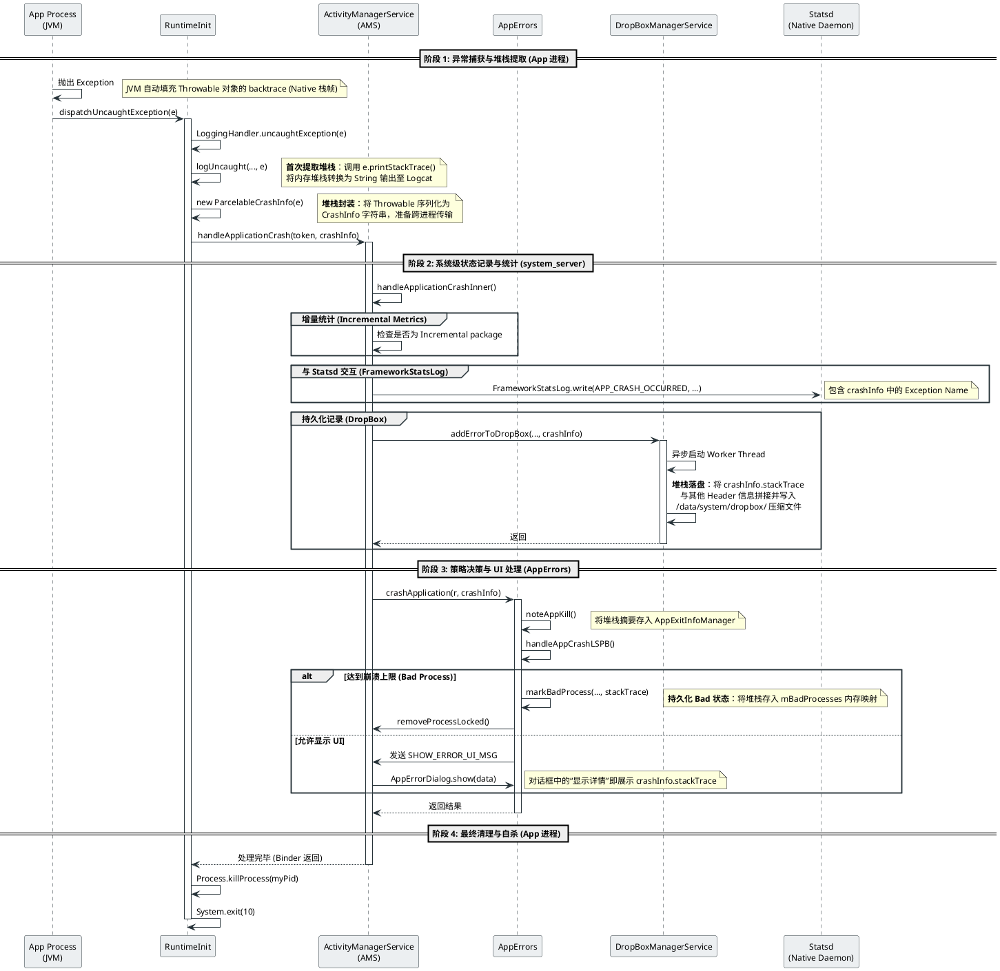

+++
date = '2025-09-29T11:36:11+08:00'
draft = false
title = 'Android App Java Crash 捕捉流程分析'
+++

在 Android 系统中，Java 层的崩溃（Crash）捕捉并不是一个简单的进程内行为，而是一套从 **App 进程** 到 **System Server 进程** 跨进程协作的复杂机制。理解这一流程对于定位稳定性问题至关重要，下面是详细的时序图：

---

## 1. 流程概览

当 Java 异常未被捕获时，虚拟机将控制权交给 `Thread.UncaughtExceptionHandler`。Android 默认通过 `RuntimeInit` 类安装了自定义处理器，启动四个阶段的处理：

1. **异常捕获与提取**：App 进程内格式化堆栈。
2. **系统记录与统计**：AMS 收集崩溃元数据并上报 Statsd。
3. **策略决策与 UI**：AppErrors 判断是否为“Bad Process”并决定是否弹出对话框。
4. **清理与自杀**：App 进程强制退出。

---

## 2. 详细阶段分析

### 2.1 阶段 1：异常捕获与堆栈提取 (App 进程)

当异常发生时，JVM 会自动填充 `Throwable` 对象的 Native 栈帧。

* **堆栈文本化**：`LoggingHandler` 调用 `e.printStackTrace()`。这是堆栈第一次从内存对象转换为可读字符串，并输出到 Logcat。
* **数据序列化**：堆栈被封装进 `ParcelableCrashInfo` 对象中。该对象通过 Binder 驱动跨进程传输到 `system_server` 进程。

### 2.2 阶段 2：系统级记录与统计 (System Server)

AMS (ActivityManagerService) 接收到崩溃调用后，执行以下核心操作：

* **增量监控**：如果是增量包（Incremental package），系统会获取加载进度，分析崩溃是否由于资源未下载完成导致。
* **数据埋点**：通过 `FrameworkStatsLog` 向 `Statsd` 发送 `APP_CRASH_OCCURRED` 事件，用于系统稳定性大数据统计。
* **DropBox 持久化**：调用 `DropBoxManagerService`。
* **异步处理**：为避免阻塞 AMS，系统启动 Worker 线程。
* **落盘**：堆栈连同 PID、UID、包名等 Header 信息被存入 `/data/system/dropbox/`，文件名通常以 `data_app_crash` 开头。

### 2.3 阶段 3：策略决策与 UI 处理 (AppErrors)

`AppErrors` 负责根据崩溃历史决定如何处置该应用：

* **重复崩溃限制 (Bad Process)**：调用 `handleAppCrashLSPB()`。如果应用在短时间内连续崩溃（例如 30s 内 2 次），将被标记为 "Bad Process"，系统会直接杀掉进程并限制其自启动，不再弹出对话框。
* **用户交互**：如果符合显示条件，AMS 会向 `UiHandler` 发送消息，弹出崩溃对话框。对话框中的“显示详情”数据来源正是阶段 1 中传输过来的 `stackTrace`。

### 2.4 阶段 4：最终清理与自杀

当 `system_server` 处理完毕并返回 Binder 调用后：

* **自杀**：App 进程通过 `Process.killProcess(myPid)` 确保彻底退出，避免残留的异常线程导致系统行为异常。

---

## 3. 特殊情况：system_server 崩溃

如果崩溃进程是 `system_server` 本身，流程会有显著不同：

* **同步执行**：为了确保在系统框架彻底崩溃前留下证据，`DropBox` 写入改为**同步执行**（不再启动新线程）。
* **全局重启**：`RuntimeInit` 会设置系统属性 `sys.system_server.crash_java`，随后 `init` 进程会因为检测到关键服务死亡而重启整个 Zygote 树。

---

## 4. 调试与分析建议

* **提取堆栈**：使用 `adb shell dumpsys dropbox --print data_app_crash` 查看历史崩溃堆栈。
* **查看计数**：执行 `getprop sys.system_server.crash_java` 检查系统服务是否发生过崩溃重启。
* **Bad Process 状态**：通过 `adb shell dumpsys activity processes` 检查应用是否被标记为坏进程。

