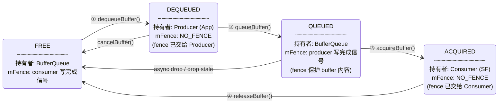
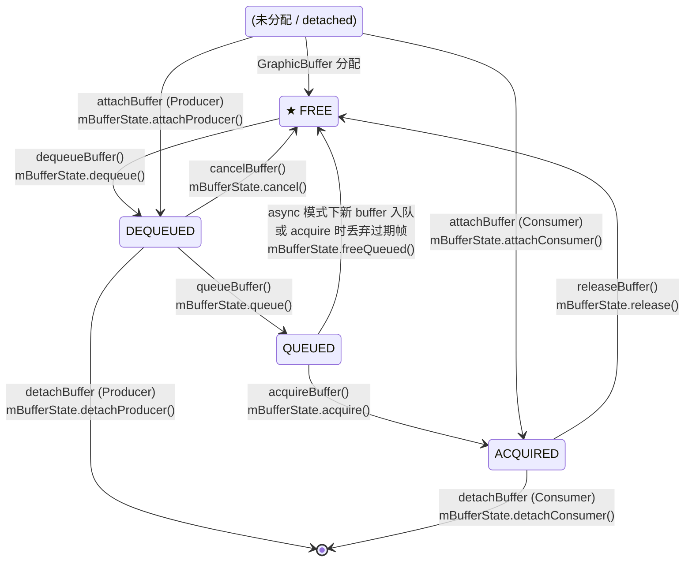

# BufferQueue Buffer 状态机

> 基于 AOSP 源码 `frameworks/native/libs/gui/include/gui/BufferSlot.h`（`BufferState` 结构体）
> 及 `BufferQueueProducer.cpp` / `BufferQueueConsumer.cpp` 中的状态转换逻辑。

---

## 一、状态定义

`BufferSlot.h:50-58` 定义了 buffer slot 的 5 种状态，由计数器三元组 `(mDequeueCount, mQueueCount, mAcquireCount)` 加 `mShared` 标志位编码：

| 状态 | mShared | mDequeueCount | mQueueCount | mAcquireCount | 被谁持有 |
|------|---------|:---:|:---:|:---:|------|
| **FREE** | false | 0 | 0 | 0 | BufferQueue 自身 |
| **DEQUEUED** | false | 1 | 0 | 0 | **Producer**（App 渲染线程） |
| **QUEUED** | false | 0 | 1 | 0 | BufferQueue 自身 |
| **ACQUIRED** | false | 0 | 0 | 1 | **Consumer**（SurfaceFlinger） |
| **SHARED** | true | any | any | any | Producer + Consumer 共享 |

源码中对各状态的注释（`BufferSlot.h:60-87`）：

```
FREE:
    "The slot is owned by BufferQueue. It transitions to DEQUEUED
     when dequeueBuffer is called."

DEQUEUED:
    "The slot is owned by the producer. The producer may modify the
     buffer's contents as soon as the associated release fence is signaled.
     It can transition to QUEUED (via queueBuffer or attachBuffer) or
     back to FREE (via cancelBuffer or detachBuffer)."

QUEUED:
    "The slot is owned by BufferQueue. The contents must not be accessed
     until the associated fence is signaled. It can transition to ACQUIRED
     (via acquireBuffer) or to FREE (if another buffer is queued in
     asynchronous mode)."

ACQUIRED:
    "The slot is owned by the consumer. As with QUEUED, the contents must
     not be accessed by the consumer until the acquire fence is signaled.
     It transitions to FREE when releaseBuffer (or detachBuffer) is called."

SHARED:
    "This buffer is being used in shared buffer mode. It can be in any
     combination of the other states at the same time, except for FREE."
```

---

## 二、状态机图

```mermaid
stateDiagram-v2
    direction LR

    [*] --> FREE : slot 初始化

    state "PRODUCER 持有" as PRODUCER_HOLD {
        DEQUEUED
    }
    state "CONSUMER 持有" as CONSUMER_HOLD {
        ACQUIRED
    }

    FREE --> DEQUEUED : dequeueBuffer()<br/>Producer::dequeue()
    DEQUEUED --> QUEUED : queueBuffer()<br/>Producer::queue()
    QUEUED --> ACQUIRED : acquireBuffer()<br/>Consumer::acquire()
    ACQUIRED --> FREE : releaseBuffer()<br/>Consumer::release()

    DEQUEUED --> FREE : cancelBuffer()<br/>Producer::cancel()
    QUEUED --> FREE : async mode drop<br/>Consumer/Producer::freeQueued()

    DEQUEUED --> [*] : detachBuffer()<br/>Producer::detachProducer()
    ACQUIRED --> [*] : detachBuffer()<br/>Consumer::detachConsumer()
    [*] --> DEQUEUED : attachBuffer()<br/>Producer::attachProducer()
    [*] --> ACQUIRED : attachBuffer()<br/>Consumer::attachConsumer()
```

### 主循环（正常渲染管线）



### 完整状态机（含 detach/attach）



---

## 三、状态转换表

| # | 转换 | 触发 API | 调用方法 | 源码位置 |
|---|------|---------|---------|---------|
| ① | FREE → DEQUEUED | `dequeueBuffer()` | `mBufferState.dequeue()` | `BufferQueueProducer.cpp:577` |
| ② | DEQUEUED → QUEUED | `queueBuffer()` | `mBufferState.queue()` | `BufferQueueProducer.cpp:1060` |
| ③ | QUEUED → ACQUIRED | `acquireBuffer()` | `mBufferState.acquire()` | `BufferQueueConsumer.cpp:288` |
| ④ | ACQUIRED → FREE | `releaseBuffer()` | `mBufferState.release()` | `BufferQueueConsumer.cpp:527` |
| ⑤ | DEQUEUED → FREE | `cancelBuffer()` | `mBufferState.cancel()` | `BufferQueueProducer.cpp:1271` |
| ⑥ | QUEUED → FREE | async drop / drop stale | `mBufferState.freeQueued()` | `BufferQueueProducer.cpp:1119` / `BufferQueueConsumer.cpp:187` |
| ⑦ | DEQUEUED → [*] | `detachBuffer()` (Producer) | `mBufferState.detachProducer()` | `BufferQueueProducer.cpp:805` |
| ⑧ | ACQUIRED → [*] | `detachBuffer()` (Consumer) | `mBufferState.detachConsumer()` | `BufferQueueConsumer.cpp:354` |

---

## 四、各状态下的持有者与 Fence 语义

```
                    Producer (App)          BufferQueue             Consumer (SF)
                    ══════════════          ═══════════             ═════════════

    FREE                                   [持有 slot]
                                           mFence = consumer 的
                                           release fence
                                           (指示 SF 何时读完)

      ↓ dequeueBuffer()
      │  mFence 作为 outFence
      │  返回给 Producer

  DEQUEUED          [持有 slot]             [不持有]
                    mFence = NO_FENCE
                    Producer 等待 outFence
                    信号化后写入 buffer

      ↓ queueBuffer()
      │  Producer 传入 acquireFence

    QUEUED                                  [持有 slot]
                                            mFence = acquireFence
                                            (指示 Producer 何时写完)
                                            等待 SF 来取

      ↓ acquireBuffer()

    ACQUIRED                                                [持有 slot]
                                                            mFence = NO_FENCE
                                                            Consumer 可读取内容

      ↓ releaseBuffer()
      │  Consumer 传入 releaseFence

    FREE                                   [持有 slot]
                                           mFence = releaseFence
                                           (指示 SF 何时读完)
```

**关键点**：

- `FREE` 状态的 slot **立即可被 dequeue**，无论 `mFence` 是否已 signal。fence 会作为 `outFence` 返回给 Producer，由 Producer 侧的 GPU 异步等待。
- `QUEUED` 状态的 buffer 内容受 `mFence`（acquire fence）保护：Consumer 必须在 fence signal 后才能读取。
- `ACQUIRED` → `FREE` 时，Consumer 传入的 `releaseFence` 被写入 slot 的 `mFence`，供下一轮 Producer 等待。

---

## 五、三缓冲模式下稳态运行时 slot 分布

以 60fps 正常管线为例，3 个 slot (S0, S1, S2) 在各 vsync 间的状态：

```
V0->V1:  S0=[ACQUIRED, SF持有]   S1=[FREE]            S2=[FREE]
         ^ SF 正在展示 A

V1前:    App dequeue S1, 渲染 B
V1:      SF release S0 -> S0 FREE
         SF acquire S1(empty) -> 无新帧, 复用旧 latch

V1->V2:  S0=[FREE]               S1=[DEQUEUED, App渲染B] S2=[FREE]
         (B 超时, 仍在渲染...)

V1->V2:  B 完成 -> queueBuffer -> S1 QUEUED
         App dequeue S2, 渲染 C

Pre V2:  S0=[FREE]               S1=[QUEUED]            S2=[DEQUEUED, App渲染C]
                                   ^ B 等待 SF latch

V2:      SF latch B -> S1 ACQUIRED
         SF releaseBuffer 可能还未调用, S0 仍是 FREE

V2->V3:  C 完成 -> queueBuffer -> S2 QUEUED
         App dequeue S0 -> 渲染 D
         S0=[DEQUEUED]           S1=[ACQUIRED, SF持有B]  S2=[QUEUED, C等待]

         ^ 3 个 slot 各在不同状态——这是三缓冲满负荷运行的正常快照
```

在三缓冲下，同时出现 `ACQUIRED × 1 + QUEUED × 1 + DEQUEUED × 1` 是**正常满载状态**。只有当 App 试图在 `FREE` 数量为 0 时 dequeue，才会触发 `tooManyBuffers` → 短暂阻塞。
