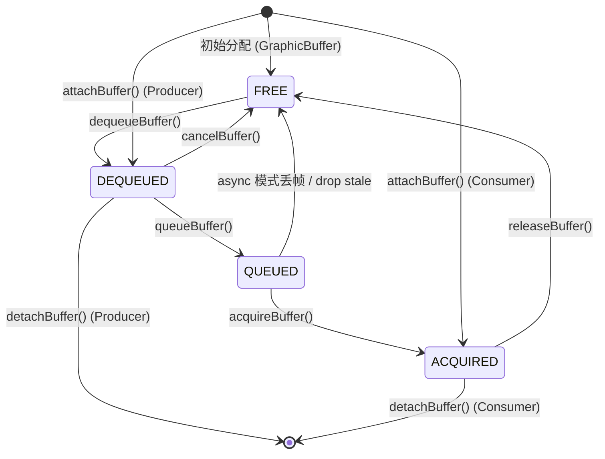
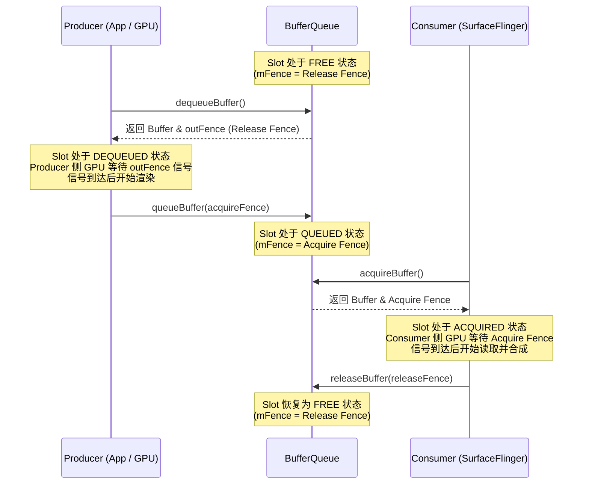

# 深入理解 BufferQueue 状态机

## 一、核心状态定义

在 BufferQueue 中，每个 Buffer Slot 的状态由一个计数器三元组 `(mDequeueCount, mQueueCount, mAcquireCount)` 以及 `mShared` 标志位共同决定。具体分为以下 5 种核心状态：

| 状态 | 标识位 (mShared) | Dequeue 计数 | Queue 计数 | Acquire 计数 | 当前持有者 |
|---|:---:|:---:|:---:|:---:|---|
| **FREE** | false | 0 | 0 | 0 | **BufferQueue** |
| **DEQUEUED** | false | 1 | 0 | 0 | **Producer** (App 渲染线程) |
| **QUEUED** | false | 0 | 1 | 0 | **BufferQueue** |
| **ACQUIRED** | false | 0 | 0 | 1 | **Consumer** (SurfaceFlinger) |
| **SHARED** | true | 任意 | 任意 | 任意 | **Producer & Consumer** (共享模式) |

### 状态详解：
- **FREE (空闲)**：Buffer 完全由 BufferQueue 拥有，随时可以被 Producer 申请（Dequeue）。
- **DEQUEUED (已出队)**：Producer 成功申请了该 Buffer，目前由 Producer 独占。Producer 必须等待相关的 Release Fence 发出信号后，才能安全地向其中写入数据。
- **QUEUED (已入队)**：Producer 完成了绘制并将 Buffer 交还给 BufferQueue 排队。此时 Buffer 内容已就绪，但 Consumer 必须等待 Acquire Fence 发出信号才能读取。
- **ACQUIRED (已获取)**：Consumer (如 SurfaceFlinger) 拿到了该 Buffer 进行合成或显示。当消费完成后，Consumer 会将其释放回 FREE 状态。
- **SHARED (共享)**：特殊模式，允许多个组件同时并发访问该 Buffer（不仅限于单一状态）。

---

## 二、状态流转与核心 API

Buffer 的生命周期本质上是 Producer 和 Consumer 之间的数据传递过程。以下是完整的状态转换图及其对应的核心 API。

### 1. 完整状态机图谱

```mermaid
stateDiagram-v2
    direction TB

    [*] --> FREE : 初始分配 (GraphicBuffer)

    FREE --> DEQUEUED : dequeueBuffer()
    DEQUEUED --> QUEUED : queueBuffer()
    QUEUED --> ACQUIRED : acquireBuffer()
    ACQUIRED --> FREE : releaseBuffer()

    DEQUEUED --> FREE : cancelBuffer()
    QUEUED --> FREE : async 模式丢帧 / drop stale

    DEQUEUED --> [*] : detachBuffer() (Producer)
    ACQUIRED --> [*] : detachBuffer() (Consumer)
    
    [*] --> DEQUEUED : attachBuffer() (Producer)
    [*] --> ACQUIRED : attachBuffer() (Consumer)
```

### 2. API 转换详情表

| 转换路径 | 触发 API | 内部调用方法 | 源码位置 (`frameworks/native/libs/gui/`) |
|---|---|---|---|
| FREE → DEQUEUED | `dequeueBuffer()` | `mBufferState.dequeue()` | `BufferQueueProducer.cpp:577` |
| DEQUEUED → QUEUED | `queueBuffer()` | `mBufferState.queue()` | `BufferQueueProducer.cpp:1060` |
| QUEUED → ACQUIRED | `acquireBuffer()` | `mBufferState.acquire()` | `BufferQueueConsumer.cpp:288` |
| ACQUIRED → FREE | `releaseBuffer()` | `mBufferState.release()` | `BufferQueueConsumer.cpp:527` |
| DEQUEUED → FREE | `cancelBuffer()` | `mBufferState.cancel()` | `BufferQueueProducer.cpp:1271` |
| QUEUED → FREE | 被覆盖 / 丢弃 | `mBufferState.freeQueued()` | `BufferQueueProducer.cpp:1119` & `BufferQueueConsumer.cpp:187` |

---

## 三、Fence 语义与所有权转移

在异步渲染架构中，状态的改变（CPU 侧）并不代表 GPU 侧的工作已经完成。**所有权转移的安全性完全依赖于 Fence 机制**。

```mermaid
sequenceDiagram
    participant P as Producer (App / GPU)
    participant BQ as BufferQueue
    participant C as Consumer (SurfaceFlinger)

    Note over BQ: Slot 处于 FREE 状态<br/>(mFence = Release Fence)
    P->>BQ: dequeueBuffer()
    BQ-->>P: 返回 Buffer & outFence (Release Fence)
    Note over P: Slot 处于 DEQUEUED 状态<br/>Producer 侧 GPU 等待 outFence 信号<br/>信号到达后开始渲染

    P->>BQ: queueBuffer(acquireFence)
    Note over BQ: Slot 处于 QUEUED 状态<br/>(mFence = Acquire Fence)
    
    C->>BQ: acquireBuffer()
    BQ-->>C: 返回 Buffer & Acquire Fence
    Note over C: Slot 处于 ACQUIRED 状态<br/>Consumer 侧 GPU 等待 Acquire Fence<br/>信号到达后开始读取并合成

    C->>BQ: releaseBuffer(releaseFence)
    Note over BQ: Slot 恢复为 FREE 状态<br/>(mFence = Release Fence)
```

**关键点解析**：
1. **即时出队 (Immediate Dequeue)**：`FREE` 状态的 slot 随时可以被 dequeue。BufferQueue 不会阻塞等待 GPU 完成，而是直接将 `mFence` 作为 `outFence` 返回，由 Producer 侧的 GPU 负责异步等待。
2. **内容保护 (Content Protection)**：进入 `QUEUED` 后，Buffer 受 `acquireFence` 保护。虽然状态已变更，但 Consumer 在 fence signal 前绝不能读取像素。
3. **闭环 (Closed Loop)**：`ACQUIRED` 转换回 `FREE` 时，Consumer 生成的 `releaseFence` 被写入 slot，留给下一轮的 Producer 使用，从而形成完整的同步闭环。

---

## 四、实例分析：三缓冲管线满载运行

在 60fps 理想管线下，引入三缓冲机制是为了避免因 SF 正在持有 Buffer 而导致 App 无 Buffer 可用的阻塞问题。
下面通过一个交互式动画，演示 3 个 Slot (S0, S1, S2) 在 VSYNC 周期内的状态流转：

<b>点击查看/隐藏 60fps 状态机动态演示 (交互版)</b>

  

    <h3>BufferQueue 三缓冲状态流转</h3>
    

      <button class="bq-btn" id="bqPrev" disabled>上一步</button>
      <button class="bq-btn" id="bqNext">下一步</button>
      <button class="bq-btn" id="bqReset">重置</button>
    

  

  
  

    
S0: ACQUIRED持有: Consumer (SF)

    
S1: FREE持有: BufferQueue

    
S2: FREE持有: BufferQueue

  

  
  

    
<b>V0 -> V1 期间</b>：SF 正在屏幕上展示前一帧 A，持有 S0。S1 和 S2 处于空闲状态。

    

      <!-- Dots injected via script -->
    

  

> **结论**：在三缓冲下，同时出现 `ACQUIRED × 1 + QUEUED × 1 + DEQUEUED × 1` 是系统吞吐量达到最高的**正常满载状态**。只有当 App 试图在 `FREE` 数量为 0 时调用 `dequeueBuffer()`，才会触发 `tooManyBuffers` 错误并导致短暂阻塞。
