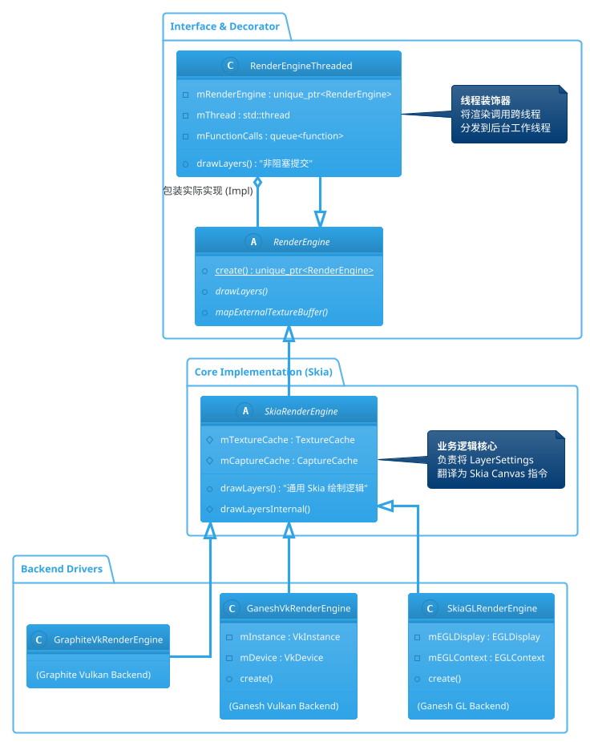
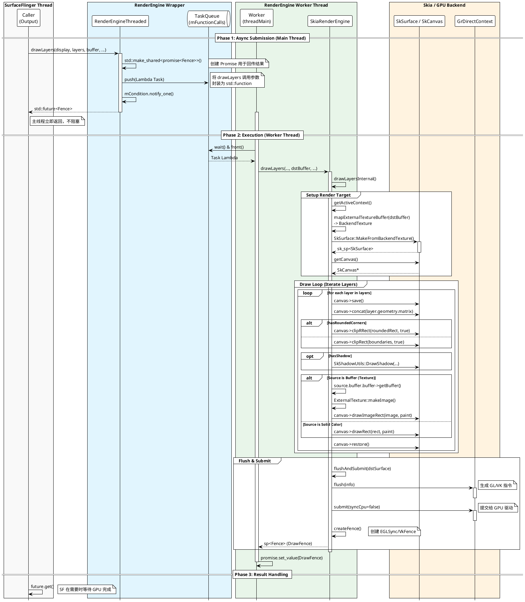
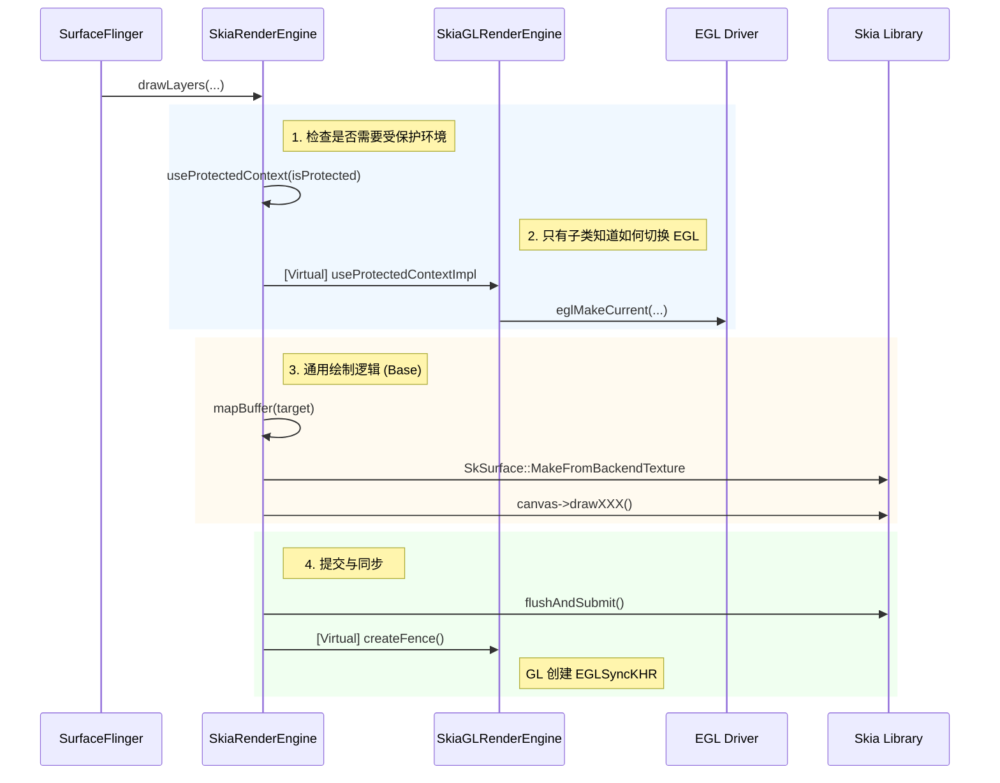

+++
date = '2025-09-29T10:22:54+08:00'
draft = false
title = 'Android SurfaceFlinger RenderEngine 深度详解'
+++

RenderEngine 是 SurfaceFlinger 的渲染后端核心，负责将各个图层（Layer）的内容利用 GPU 合成到一帧缓冲区中。在现代 Android 版本中，它基于 **Skia** 图形库构建，实现了高度的模块化、多后端支持（GLES/Vulkan）以及异步多线程渲染。

## 1. 架构概览 (Architecture Overview)

RenderEngine 采用了 **分层架构** 与 **装饰器模式** 的设计。

### 1.1 核心组件架构图



### 1.2 关键组件工作机制

1. **`RenderEngine` (Interface)**:
   * 定义了 SurfaceFlinger 与渲染器交互的契约。最关键的接口是 `drawLayers`（执行合成）和 `mapExternalTextureBuffer`（缓存纹理）。


2. **`RenderEngineThreaded` (Thread Model)**:
   * **机制**: 这是一个装饰器。它并不执行渲染，而是维护一个命令队列（Command Queue）和一个后台线程。
   * **作用**: 解耦 SurfaceFlinger 主线程（Main Thread）与 GPU 驱动的提交操作。因为 GPU 驱动的 `flush` 或 `submit` 可能会阻塞 CPU，如果不放在独立线程，会导致掉帧。


3. **`SkiaRenderEngine` (Core Logic)**:
   * **机制**: 这是一个与具体 GPU API 无关的类。它接收 SurfaceFlinger 的图层数据结构 (`LayerSettings`)，将其一一翻译成 Google Skia 库的绘制指令（如 `canvas->drawImage`, `canvas->drawRRect`）。
   * **作用**: 屏蔽了底层是 OpenGL 还是 Vulkan 的差异，统一了渲染逻辑（圆角、阴影、模糊等）。


4. **后端实现 (`SkiaGLRenderEngine` / `VkRenderEngine`)**:
   * **机制**: 负责初始化 EGL/Vulkan 上下文，并将原生的 GL Context 封装成 Skia 的 `GrDirectContext`。
   * **作用**: 管理 GPU 资源生命周期和上下文切换。


---

## 2. 核心工作原理：`drawLayers` 深度解析

`drawLayers` 是合成过程的心脏。基于代码分析，其执行流程如下：


### 2.1 阶段一：资源准备与上下文绑定

在 `SkiaRenderEngine::drawLayers` 中：

1. **目标绑定 (Bind Render Target)**:
   * 传入的 `dstBuffer` (GraphicBuffer) 被封装为 `SkiaBackendTexture`。
   * 通过 `SkSurface::MakeFromBackendTexture` 创建一个 **`SkSurface`**。这是 Skia 的画布，所有的绘制都会输出到这块内存中。
   * 获取 `SkCanvas` 指针，准备开始作画。


2. **清理画布**:
   * 如果不需要清除内容，则跳过；否则调用 `canvas->clear()`。


### 2.2 阶段二：图层遍历与指令翻译 (Translation)

代码遍历 `std::vector<LayerSettings>` 列表，对每个图层进行处理：

1. **几何变换 (Geometry)**:
   * **矩阵变换**: 将 Layer 的 `geometry.positionTransform` (矩阵) 转换为 `SkMatrix`，应用到 Canvas 上。这处理了图层的位移、缩放和旋转。
   * **裁剪**: 将 Layer 的裁剪区域 (`geometry.boundaries`) 应用为 `canvas->clipRect()`。如果是圆角裁剪，则使用 `canvas->clipRRect()`。


2. **内容绘制 (Draw Content)**:
   * **图片图层**: 如果 Layer 包含 Buffer，通过 `ExternalTexture` 获取 `SkImage`，调用 `canvas->drawImageRect()`。
   * **纯色图层**: 如果 Layer 是 Dim Layer 或背景色，调用 `canvas->drawRect()`。


3. **特效处理 (Effects via SkPaint)**:
   * **透明度**: 设置 `SkPaint` 的 Alpha 值。
   * **混合模式**: 设置 `SkBlendMode` (如 SRC_OVER, PREMULTIPLY)。
   * **阴影**: 使用 `SkShadowUtils::DrawShadow` 绘制物理阴影。
   * **模糊**: 创建 `SkImageRowFilter::MakeBlur`，将其设置为 Paint 的 `ImageFilter`，Skia 会自动处理高斯模糊 Shader。
   * **色彩滤镜**: 将 `colorTransform` 矩阵转换为 `SkColorFilter`，实现夜间模式或色彩校正。


### 2.3 阶段三：提交与同步 (Flush & Sync)

绘制指令生成后，必须发送给 GPU：

1. **Flush**: 调用 `SkSurface::flushAndSubmit()`。
   * Skia 内部会将累积的 `drawXXX` 指令编译成 GPU 能识别的指令流（GL Draw Calls 或 Vulkan Command Buffers）。
   * 发送给 GPU 驱动程序。


2. **Fence 同步**:
   * RenderEngine 创建一个原生的同步栅栏（Sync Fence，如 `EGLSyncKHR`）。
   * 这个 Fence 被返回给 SurfaceFlinger，最终传递给 HWC。HWC 只有等这个 Fence 触发（即 GPU 画完了），才会去读取 Buffer 内容进行显示。


---

## 3. 线程模型详解 (`RenderEngineThreaded`)

`RenderEngineThreaded` 实现了极其重要的异步机制。

### 3.1 为什么需要线程化？

在 `drawLayers` 的最后一步 `flushAndSubmit` 中，CPU 需要与 GPU 驱动交互。在某些高负载场景下，驱动可能会阻塞 CPU 几毫秒甚至更久。如果这发生在 SurfaceFlinger 的主线程（Main Thread），会导致处理下一个 VSYNC 信号延迟，从而引发卡顿（Jank）。

### 3.2 工作机制

1. **任务封装 (Promise/Future 模式)**:
    当 SurfaceFlinger 调用 `drawLayers` 时，`RenderEngineThreaded` **不会** 立即执行。它将所有参数（图层列表、目标 Buffer）打包成一个 `std::function` 任务。
    ```cpp
    // 伪代码逻辑
    std::promise<sp<Fence>> resultPromise;
    std::future<sp<Fence>> resultFuture = resultPromise.get_future();

    // 将任务推入队列
    {
        std::lock_guard lock(mThreadMutex);
        mFunctionCalls.push([=, &resultPromise]() {
            // 在后台线程调用真正的实现
            auto fence = mRenderEngine->drawLayers(...);
            resultPromise.set_value(fence);
        });
        mCondition.notify_one();
    }

    return resultFuture; // 立即返回 Future，不阻塞

    ```


2. **后台执行**:
内部的 `mThread` 运行一个死循环：
   * 等待 `mCondition` 信号。
   * 从 `mFunctionCalls` 队列取出一个任务。
   * 执行任务（此时才真正进行 Skia 指令生成和 GPU 提交）。


3. **结果获取**:
SurfaceFlinger 在需要 Fence 的时候（通常是稍后阶段），调用 `future.get()` 获取结果。


**RenderEngineThreaded 本身并不支持“并行多线程渲染”，它实现的是“单线程异步渲染”。**

虽然它的名字叫 `Threaded`，但它并不是为了让多个线程同时去画图（Parallel Rendering），而是为了**将渲染任务从 SurfaceFlinger 的主线程剥离到一个独立的后台线程中执行**（Offloading）。

以下是基于代码的详细分析：

### 核心结论：1 个实例 = 1 个后台线程

在 `RenderEngineThreaded.cpp` 的构造函数和成员变量定义中，我们可以清楚地看到：

```cpp
// 成员变量定义
std::thread mThread;  // 注意：这是一个单数形式的 std::thread 对象，不是线程池

// 构造函数
RenderEngineThreaded::RenderEngineThreaded(std::unique_ptr<RenderEngine> renderEngine)
      : mRenderEngine(std::move(renderEngine)) {
    // 创建并启动唯一的一个后台线程
    mThread = std::thread(&RenderEngineThreaded::threadMain, this); 
    ...
}

```

这意味着每个 `RenderEngineThreaded` 实例内部**只有一个**工作线程（Worker Thread）。无论外部有多少个线程调用它，或者有多少图层需要绘制，所有的任务最终都会被塞进同一个队列，由这唯一的线程**串行（Sequentially）** 执行。

### 工作机制：生产者-消费者模型

`RenderEngineThreaded` 实现了一个标准的**命令队列（Command Queue）** 模式。

* **生产者 (Callers)**：通常是 SurfaceFlinger 主线程。当调用 `drawLayers` 时，它**不会**直接执行绘制代码，而是把这次调用封装成一个任务（Task/Lambda），推入队列。
* **消费者 (Worker)**：后台线程 `mThread` 运行在一个死循环中 (`threadMain`)，不断从队列中取出任务并执行。

**代码证据：**

```cpp
// RenderEngineThreaded::drawLayers
// 这是外部调用的接口
std::future<sp<Fence>> RenderEngineThreaded::drawLayers(...) {
    // 1. 创建 Promise/Future 用于获取返回值
    auto resultPromise = std::make_shared<std::promise<sp<Fence>>>();
    std::future<sp<Fence>> resultFuture = resultPromise->get_future();

    {
        // 加锁，保护队列
        std::lock_guard lock(mThreadMutex);
        
        // 2. 将真正的绘制任务封装进 lambda，推入队列
        mFunctionCalls.push([=](renderengine::RenderEngine& instance) {
            // 这里才在后台线程真正调用 Skia/GLES 进行绘制
            auto fence = instance.drawLayers(display, layers, buffer, ...);
            resultPromise->set_value(fence);
        });
    }
    
    // 3. 通知后台线程有活干了
    mCondition.notify_one();
    
    // 4. 立即返回 Future，主线程不阻塞（除非后面立即调用 get()）
    return resultFuture;
}

```

```cpp
// RenderEngineThreaded::threadMain
// 这是后台线程的循环
void RenderEngineThreaded::threadMain() {
    while (mRunning) {
        // ... 等待信号 ...
        
        // 取出任务
        auto task = mFunctionCalls.front();
        mFunctionCalls.pop();
        
        // 执行任务 (串行执行)
        task(*mRenderEngine);
    }
}

```

### 为什么不支持并行多线程渲染？

你可能会问，为什么不弄个线程池，让 4 个线程同时画 4 个 Layer？

这是受限于底层图形 API（OpenGL ES 和 Skia）的特性：

1. **上下文绑定 (Context Binding)**: OpenGL ES 的 Context 是**线程局部 (Thread-Local)** 的。一个 Context 在同一时刻只能被一个线程 `makeCurrent`。如果要在多个线程操作，需要频繁切换 Context 或创建多个共享 Context，这带来的开销（锁、驱动状态切换）往往比收益还大。
2. **指令流顺序**: GPU 驱动通常期望接收有序的指令流。并行提交会导致驱动层需要复杂的同步机制。
3. **Skia 的限制**: 虽然 Skia 支持多线程录制（Recording），但最终的 GPU 提交（Submit/Flush）通常需要在持有 Context 的那个线程进行。

### 总结

`RenderEngineThreaded` 的“Threaded”体现在：

* **线程安全 (Thread-Safe)**: 它内部有 Mutex，允许多个外部线程安全地调用它（虽然任务会被排队）。
* **异步执行 (Asynchronous)**: 它让 SurfaceFlinger 的主循环（处理 VSYNC、输入事件、事务）不会因为 GPU 驱动的耗时操作（如 `glFlush`, `vkQueueSubmit`）而被卡顿。

**它不做并行计算，只做异步分流。**

---

## 4. 渲染时序图与数据流




### 流程深度解析

该流程图将代码中的关键步骤拆解为三个部分：

#### 1. 异步任务封装 (`RenderEngineThreaded.cpp`)

* **代码位置**: `RenderEngineThreaded::drawLayers`。
* **核心逻辑**: 这里没有任何图形 API 调用。它仅仅使用 C++ 的 `std::promise` 和 `std::future` 机制，将参数打包（Capture）进一个 Lambda 表达式，并推入线程安全的队列 `mFunctionCalls`。
* **目的**: 让 SurfaceFlinger 主线程在毫秒级内返回，避免被 GPU 驱动的提交过程阻塞。

#### 2. 渲染环境准备 (`SkiaRenderEngine.cpp`)

* **代码位置**: `SkiaRenderEngine::drawLayersInternal` 开始部分。
* **核心逻辑**:
* **上下文切换**: 确保当前线程绑定了正确的 EGL/Vulkan 上下文 (`getActiveContext`)。
* **目标绑定**: `dstBuffer` 是从 `FramebufferSurface` 传来的 GraphicBuffer。RenderEngine 必须把它转换成 Skia 能识别的 `SkSurface`。这通常涉及 `eglCreateImageKHR` (GLES) 或 `vkCreateImageView` (Vulkan)。


#### 3. 图层绘制循环

这是最复杂的逻辑部分，SkiaRenderEngine 这里充当了“翻译官”的角色。

* **几何 (Geometry)**:
  * SF 的 `geometry.positionTransform` (矩阵) 被直接应用到 Skia Canvas 的 Matrix 上 (`canvas->concat`)。
  * SF 的 `geometry.boundaries` (裁剪框) 被应用为 Canvas 的 Clip (`canvas->clipRect`)。


* **特效 (Effects)**:
  * **圆角**: 通过 `canvas->clipRRect` 实现。这比传统的 Shader 实现更通用，Skia 会自动处理抗锯齿。
  * **阴影**: `SkShadowUtils::DrawShadow` 是 Skia 的高级特性，它会根据光源位置生成物理真实的阴影几何体。
  * **模糊**: 代码中会检查 `backgroundBlurRadius`，如果有，会创建一个 `SkImageRowFilter::MakeBlur` 并设置给 `SkPaint`。


* **内容 (Content)**:
  * 如果是 Buffer 图层，`ExternalTexture` 被转换为 `SkImage`。注意，这里使用了缓存机制，不会每次都重新创建纹理。
  * 如果是纯色图层，直接画矩形。


#### 4. 提交与同步 (Flush & Submit)

* **代码位置**: `SkiaRenderEngine.cpp` 中的 `flushAndSubmit` 函数。
* **核心逻辑**:
  * `GrDirectContext::flush()`: 告诉 Skia 将之前累积的 `drawXXX` 命令编译成底层的 GPU 指令（Draw Calls）。
  * `GrDirectContext::submit()`: 将指令流真正推送到 GPU 驱动的 Command Buffer 中。
  * **Fence**: 创建一个原生同步栅栏（Native Fence）。这个对象非常重要，它代表了 GPU 工作的结束时间点。这个 Fence 会一路返回给 SurfaceFlinger，最终传递给 HWC。

---

## RenderEngine 后端架构：通用逻辑与 GL 实现的协同

在 RenderEngine 的 Skia 架构中，设计遵循了 **“策略与机制分离”** 的原则。渲染的**业务逻辑**（如何画图层）与**底层驱动**（如何管理 GPU 上下文）被严格拆分。

这种设计由两个核心类承载：`SkiaRenderEngine`（通用基类）和 `SkiaGLRenderEngine`（GLES 具体实现）。

### 1. 职责划分 (Roles & Responsibilities)

#### **`SkiaRenderEngine` (The Brain - 业务大脑)**

这是一个与具体图形 API（GL/Vulkan）**无关** 的抽象层。它的核心职责是将 SurfaceFlinger 的合成请求翻译成 Skia 的绘图指令。

* **图层翻译**: 将 `LayerSettings`（Android 定义的图层结构）转换为 `SkCanvas` 指令（`drawImage`, `drawRect` 等）。
* **特效实现**: 利用 Skia 的能力实现圆角（RRect）、阴影（ShadowUtils）、模糊（ImageFilter）等高级特效。
* **资源缓存**: 管理与 API 无关的资源缓存，例如 `ExternalTexture` 的生命周期管理。
* **命令录制**: 负责 `drawLayers` 的主流程控制。

#### **`SkiaGLRenderEngine` (The Driver - 环境管家)**

这是针对 OpenGL ES 后端的具体实现。它的职责是维护 Skia 运行所需的 EGL 环境。

* **EGL 管理**: 负责 `EGLDisplay`、`EGLContext` (主上下文与受保护上下文)、`EGLSurface` (Pbuffer) 的创建与销毁。
* **上下文切换**: 实现 `useProtectedContext`，在“普通上下文”和“受保护上下文（DRM 内容）”之间进行物理切换 (`eglMakeCurrent`)。
* **Skia 桥接**: 调用 `GrDirectContexts::MakeGL`，将原生的 EGL 环境封装成 Skia 可识别的 `GrDirectContext` 对象。

### 2. 协同工作机制 (Collaboration Mechanism)

这两个类通过 **继承** 和 **状态共享** 进行协作。`SkiaRenderEngine` 定义了算法骨架（Template Method），而 `SkiaGLRenderEngine` 填充了环境初始化的细节。

#### 2.1 初始化阶段：自底向上的构建

协作始于构造阶段：

1. **EGL 准备**: 工厂调用 `SkiaGLRenderEngine::create`。它首先初始化 EGL 环境。
2. **Skia 封装**: `SkiaGLRenderEngine` 调用父类的 `init()`，进而触发虚函数 `createContexts`。
3. **注入依赖**: 在 `createContexts` 中，GL 实现创建出 `GrDirectContext`（Skia 的 GPU 上下文句柄）并赋值给父类的成员变量 `mDefaultContext` 和 `mProtectedContext`。
> **关键点**: 从此刻起，父类 `SkiaRenderEngine` 拥有了操作 GPU 的手柄，但它并不知道这个手柄背后是 GL 还是 Vulkan。


#### 2.2 渲染阶段：上下文切换与指令提交

在 `drawLayers` 的执行过程中，两者配合最为紧密：



**详细步骤解析：**

1. **上下文激活 (Context Activation)**:
* `SkiaRenderEngine` 在绘制前检查当前图层是否包含受保护内容（Secure Content）。
* 它调用 `useProtectedContext`。`SkiaGLRenderEngine` 重写了此逻辑，如果状态发生变化，它会调用 `eglMakeCurrent` 切换到对应的 EGL Context。这是两者协作的关键点：**父类决定“何时切”，子类决定“怎么切”**。


2. **目标绑定 (Target Binding)**:
* `SkiaRenderEngine` 需要将目标 GraphicBuffer 包装成 `SkSurface`。
* 它依赖内部持有的 `GrDirectContext`（由子类在初始化时注入）来创建后端纹理对象。


3. **指令生成 (Command Generation)**:
* 这一步完全由 `SkiaRenderEngine` 独立完成。它操作纯粹的 Skia 对象 (`SkCanvas`, `SkPaint`)，不需要子类参与。这是代码复用的核心。


4. **同步栅栏 (Fence Creation)**:
* 绘制完成后，`SkiaRenderEngine` 需要返回一个 Fence。
* 虽然 Skia 提供了 `finish` 机制，但在 Android 上通常需要原生的 `EGLSync` 或 `VkFence`。虽然代码主要在 Skia 内部处理，但底层的等待逻辑（`waitFence`）往往由子类根据具体 API 实现。


### 3. 总结：一种优雅的解耦

* **SkiaRenderEngine** 关注 **"WHAT"**：画什么（图层、圆角、阴影）。
* **SkiaGLRenderEngine** 关注 **"WHERE"**：在哪里画（EGL 上下文、显存管理）。

这种设计使得 Android 图形团队可以轻松地引入 `Vulkan` 支持（即 `SkiaVkRenderEngine`），只需要实现环境初始化和上下文切换，而完全复用复杂的图层合成与特效渲染逻辑。