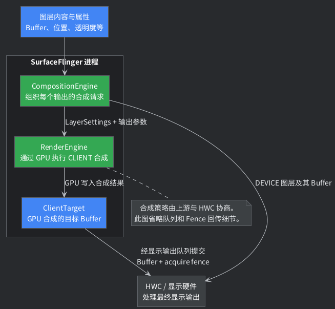
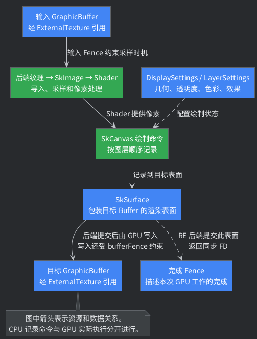
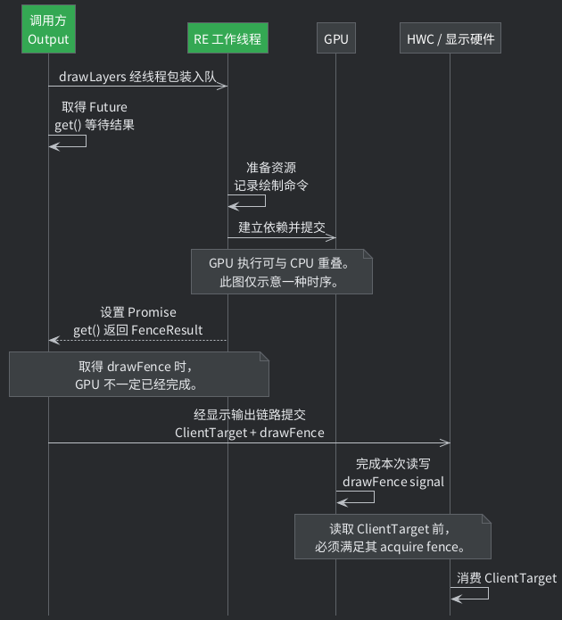

+++
date = '2025-09-29T10:22:54+08:00'
lastmod = '2026-10-09T00:00:00+08:00'
draft = false
title = 'RenderEngine：SurfaceFlinger 的 GPU 合成流程'
description = '沿一次客户端合成请求，说明 RenderEngine 的输入输出、Skia 绘制、线程与 Fence 同步，以及 GLES/Vulkan 后端。'
ShowToc = true
+++

RenderEngine 负责把图层内容和显示参数转换为 GPU 绘制工作，将结果写入调用方提供的目标缓冲区。理解它，需要同时跟踪两件事：像素从哪些 Buffer 读出、向哪个 Buffer 写入，以及这些读写在什么时候可以安全执行。

本文沿着一次客户端合成请求展开，先说明输入输出，再分析绘制、线程与同步，最后介绍实现分层和后端差异。

<!--more-->

> 源码基线：本文的函数名、接口和类关系核对自当前项目 QSSI 树中的 `frameworks/native`，提交为 `2e1246c43c3bb1c54ded8262cb6e7f753e435046`。这是包含厂商扩展的项目版本，不等同于某个原生 AOSP 发布标签；下文以物理显示的客户端合成为主，截图等调用场景的输出去向有所不同。

## 1. RenderEngine 在显示链路中的位置

### 1.1 从应用绘制到显示合成

应用通常先把自己的界面绘制到 Buffer 中。SurfaceFlinger 接收到这些内容后，根据图层的可见区域、位置、透明度等信息组织显示输出。应用提交的是这一帧的 Buffer 和相关状态；生产者是否已写完像素，仍由随附的 acquire fence 确定。RenderEngine 处理这些内容及其合成参数，无须重新执行应用的 View 绘制过程。

在与 Hardware Composer（HWC）协商合成方式后，部分图层可能由显示硬件处理，另一些需要由 SurfaceFlinger 使用 GPU 合成。前者称为 DEVICE 合成，后者称为 CLIENT 合成。CLIENT 中的“客户端”指 HWC 的调用方 SurfaceFlinger。这个职责划分也见于 [AOSP 的 SurfaceFlinger 说明](https://source.android.com/docs/core/graphics/surfaceflinger-windowmanager)。

CompositionEngine 为一次显示输出生成客户端合成请求，RenderEngine 执行请求。GPU 写出的目标缓冲区称为 ClientTarget，随后由显示输出链路交给 HWC，与 DEVICE 图层一起参与最终呈现。

图中绿色表示合成处理与相关组件，蓝色表示 Buffer、参数和同步对象，灰色表示执行域与外部参与者。


```plantuml
@startuml
!theme plain
' 视觉参考：work/architecture_diagrams/android_architecture.html
' 绿：合成处理与相关组件；蓝：数据与同步对象；灰：执行域与外部参与者。
skinparam backgroundColor #282A2D
skinparam defaultFontName "Noto Sans CJK SC"
skinparam defaultFontSize 14
skinparam defaultFontColor #E8EAED
skinparam shadowing false
skinparam roundcorner 0
skinparam defaultTextAlignment center
skinparam packageStyle rectangle
skinparam classAttributeIconSize 0
skinparam nodesep 35
skinparam ranksep 35
skinparam ArrowColor #BDC1C6
skinparam ArrowFontColor #E8EAED
skinparam ArrowThickness 1
skinparam NoteBackgroundColor #3C4043
skinparam NoteBorderColor #5F6368
skinparam NoteFontColor #E8EAED
skinparam RectangleBackgroundColor #34A853
skinparam RectangleBorderColor #5F6368
skinparam RectangleFontColor #FFFFFF
skinparam PackageBackgroundColor #202124
skinparam PackageBorderColor #5F6368
skinparam PackageFontColor #E8EAED
skinparam ClassBackgroundColor #34A853
skinparam ClassBorderColor #5F6368
skinparam ClassFontColor #FFFFFF
skinparam ClassAttributeFontColor #FFFFFF
skinparam ClassStereotypeFontColor #FFFFFF
skinparam ParticipantBackgroundColor #34A853
skinparam ParticipantBorderColor #5F6368
skinparam ParticipantFontColor #FFFFFF
skinparam SequenceArrowColor #BDC1C6
skinparam SequenceArrowFontColor #E8EAED
skinparam SequenceLifeLineBorderColor #5F6368
skinparam SequenceLifeLineBackgroundColor #282A2D
skinparam SequenceGroupBackgroundColor #202124
skinparam SequenceGroupBodyBackgroundColor #282A2D
skinparam SequenceGroupBorderColor #5F6368
skinparam SequenceGroupFontColor #E8EAED
skinparam SequenceDividerBackgroundColor #3C4043
skinparam SequenceDividerBorderColor #5F6368
skinparam SequenceDividerFontColor #E8EAED
top to bottom direction

rectangle "图层内容与属性\nBuffer、位置、透明度等" as Layers #4285F4
package "SurfaceFlinger 进程" {
    rectangle "CompositionEngine\n组织每个输出的合成请求" as CE #34A853
    rectangle "RenderEngine\n通过 GPU 执行 CLIENT 合成" as RE #34A853
    rectangle "ClientTarget\nGPU 合成的目标 Buffer" as Target #4285F4
    CE --> RE : LayerSettings + 输出参数
    RE --> Target : GPU 写入合成结果
}
rectangle "HWC / 显示硬件\n处理最终显示输出" as HWC #3C4043

Layers --> CE
CE --> HWC : DEVICE 图层及其 Buffer
Target --> HWC : 经显示输出队列提交\nBuffer + acquire fence
note bottom of RE
合成策略由上游与 HWC 协商。
此图省略队列和 Fence 回传细节。
end note
@enduml
```

例如，一个应用窗口需要与半透明面板进行 GPU 合成，而视频图层可以由显示硬件处理，那么 RenderEngine 负责前一组内容，视频 Buffer 沿 DEVICE 路径交给 HWC。具体分组受层叠顺序、硬件能力和策略限制，不能任意选择若干图层合成后再拼接。

### 1.2 什么时候会发生绘制

物理显示路径的一个入口是 `compositionengine::impl::Output::composeSurfaces()`。它根据当前输出状态决定是否调用 RenderEngine：没有 CLIENT 合成时直接返回；目标 Buffer 无效时放弃本次客户端合成；若客户端合成请求缓存确认同一个目标 Buffer 中已有可复用结果，则沿用已有结果及其同步依赖。

因此，显示刷新次数、`composeSurfaces()` 调用次数和 GPU 重绘次数不一定相同。RenderEngine 也服务于截图等离屏任务，此时目标 Buffer 不必成为交给物理显示 HWC 的 ClientTarget。

## 2. 一次合成请求包含什么

### 2.1 接口与参数

当前基线中的接口如下，类型名保留源码写法：

```cpp
ftl::Future<FenceResult> drawLayers(
        const DisplaySettings& display,
        const std::vector<LayerSettings>& layers,
        const std::shared_ptr<ExternalTexture>& buffer,
        base::unique_fd&& bufferFence);
```

这里的 `buffer` 是输出目标。输入内容则来自 `layers` 中各个图层的像素源。二者都是 Buffer，但读写方向不同。

| 参数或结果 | 含义 | 需要关注的内容 |
|---|---|---|
| `DisplaySettings` | 本次输出的整体配置 | 输出区域、逻辑裁剪、方向、输出色彩空间、亮度及颜色变换 |
| `LayerSettings` 列表 | 按 Z 序组织的绘制请求 | 几何形状、像素源、纹理变换、透明度、色彩与效果参数 |
| `buffer` | 本次 GPU 将写入的目标 | 由调用方提供，并通过 `ExternalTexture` 引用 |
| `bufferFence` | 目标上一次使用的完成依赖 | 满足后才能覆盖目标内容，与本次完成 Fence 不同 |
| `FenceResult` | 绘制请求的处理结果 | `base::expected<sp<Fence>, status_t>`，成功时给出完成 Fence，失败时给出状态码 |

`LayerSettings` 是供渲染使用的数据描述，不是 SurfaceFlinger 的 `Layer` 对象。RenderEngine 无须遍历完整窗口树；上游已经将需要绘制的状态整理成请求。这个请求列表还可能包含纯色、清除或效果用途的绘制项，不能简单等同于“一项就是一个应用窗口”。

### 2.2 Buffer、纹理与 Skia 对象

`GraphicBuffer` 表示图形缓冲区及其句柄、尺寸、格式和用途等信息。RenderEngine 通过 GPU 后端导入这块内存，使它能够被采样或作为渲染目标使用。

`ExternalTexture` 提供 Buffer 与 RenderEngine 之间的资源接口。其具体实现 `impl::ExternalTexture` 在构造时调用 `mapExternalTextureBuffer()`，析构时调用 `unmapExternalTextureBuffer()`，将 Buffer 的引用与后端资源生命周期关联起来。

实际的 Skia 包装在后端纹理对象中完成。当前实现通过 `AutoBackendTexture::makeImage()` 为输入构造 `SkImage`，通过 `getOrCreateSurface()` 为输出取得 `SkSurface`。`SkImage` 用来描述可采样的图像，`SkSurface` 表示绘制目标，`SkCanvas` 则提供向该目标绘制的接口。


```plantuml
@startuml
!theme plain
' 视觉参考：work/architecture_diagrams/android_architecture.html
' 绿：合成处理与相关组件；蓝：数据与同步对象；灰：执行域与外部参与者。
skinparam backgroundColor #282A2D
skinparam defaultFontName "Noto Sans CJK SC"
skinparam defaultFontSize 14
skinparam defaultFontColor #E8EAED
skinparam shadowing false
skinparam roundcorner 0
skinparam defaultTextAlignment center
skinparam packageStyle rectangle
skinparam classAttributeIconSize 0
skinparam nodesep 35
skinparam ranksep 35
skinparam ArrowColor #BDC1C6
skinparam ArrowFontColor #E8EAED
skinparam ArrowThickness 1
skinparam NoteBackgroundColor #3C4043
skinparam NoteBorderColor #5F6368
skinparam NoteFontColor #E8EAED
skinparam RectangleBackgroundColor #34A853
skinparam RectangleBorderColor #5F6368
skinparam RectangleFontColor #FFFFFF
skinparam PackageBackgroundColor #202124
skinparam PackageBorderColor #5F6368
skinparam PackageFontColor #E8EAED
skinparam ClassBackgroundColor #34A853
skinparam ClassBorderColor #5F6368
skinparam ClassFontColor #FFFFFF
skinparam ClassAttributeFontColor #FFFFFF
skinparam ClassStereotypeFontColor #FFFFFF
skinparam ParticipantBackgroundColor #34A853
skinparam ParticipantBorderColor #5F6368
skinparam ParticipantFontColor #FFFFFF
skinparam SequenceArrowColor #BDC1C6
skinparam SequenceArrowFontColor #E8EAED
skinparam SequenceLifeLineBorderColor #5F6368
skinparam SequenceLifeLineBackgroundColor #282A2D
skinparam SequenceGroupBackgroundColor #202124
skinparam SequenceGroupBodyBackgroundColor #282A2D
skinparam SequenceGroupBorderColor #5F6368
skinparam SequenceGroupFontColor #E8EAED
skinparam SequenceDividerBackgroundColor #3C4043
skinparam SequenceDividerBorderColor #5F6368
skinparam SequenceDividerFontColor #E8EAED
top to bottom direction

rectangle "输入 GraphicBuffer\n经 ExternalTexture 引用" as Input #4285F4
rectangle "后端纹理 → SkImage → Shader\n导入、采样和像素处理" as Texture #34A853
rectangle "DisplaySettings / LayerSettings\n几何、透明度、色彩、效果" as Settings #4285F4
rectangle "SkCanvas 绘制命令\n按图层顺序记录" as Canvas #34A853
rectangle "SkSurface\n包装目标 Buffer 的渲染表面" as Surface #4285F4
rectangle "目标 GraphicBuffer\n经 ExternalTexture 引用" as Output #4285F4
rectangle "完成 Fence\n描述本次 GPU 工作的完成" as Fence #4285F4

Input --> Texture : 输入 Fence 约束采样时机
Texture --> Canvas : Shader 提供像素
Settings ..> Canvas : 配置绘制状态
Canvas --> Surface : 记录到目标表面
Surface --> Output : 后端提交后由 GPU 写入\n写入还受 bufferFence 约束
Output -[hidden]right-> Fence
Surface ..> Fence : RE 后端提交此表面\n返回同步 FD
note bottom of Output
图中箭头表示资源和数据关系。
CPU 记录命令与 GPU 实际执行分开进行。
end note
@enduml
```

普通输入 Buffer 的后端资源可以按 Buffer ID 缓存，避免重复导入。缓存是否命中还取决于映射状态和上下文，受保护内容等路径有额外限制。

导入 Buffer 通常不需要先把整幅图像复制到 CPU 内存。但 GPU 合成本身会读取源像素并写出目标，模糊等效果还可能使用中间表面。是否存在额外复制、格式转换和临时分配，需要沿具体后端和效果路径判断。

## 3. 从图层描述到 GPU 绘制

实际绘制位于 `SkiaRenderEngine::drawLayersInternal()`。在进入它之前，工作线程会检查输入与输出的受保护属性，并按后端能力切换上下文。下面先说明输出准备，再沿每个图层的几何、效果和像素处理展开。

### 3.1 准备目标表面

函数先检查输出 Buffer，取得当前 GPU 上下文，然后为目标获取后端纹理。接着，`waitFence()` 处理 `bufferFence`，建立“目标上一次使用结束后才能写入”的依赖。

随后，后端纹理按照输出 dataspace 创建或复用 `SkSurface`。当前实现经由捕获辅助对象取得画布；没有启用捕获时，绘制仍落到正常表面。若后面的效果需要离屏处理，还会临时使用另一个表面。

在该源码基线中，开始绘制前会将活动画布清为透明黑，避免残留上一帧内容，再由 `initCanvas()` 设置显示裁剪、平移、缩放和方向。这些变换把逻辑显示坐标映射到本次输出区域。

### 3.2 区分几何变换与纹理变换

每个图层使用独立的 Canvas 保存与恢复范围，避免前一个图层的矩阵和裁剪影响后一个图层。这里有两组容易混淆的变换：

| 变换 | 作用对象 | 解决的问题 |
|---|---|---|
| `geometry.positionTransform` | 图层几何 | 图层在输出中放在哪里，如何旋转、缩放 |
| `source.buffer.textureTransform` | 输入像素的采样坐标 | 如何从 Buffer 中取到与图层几何对应的内容 |

例如，移动一个窗口主要改变它的几何位置；输入 Buffer 自带旋转或裁剪关系时，还要相应处理纹理采样。只看其中一组矩阵，无法解释最终图像为何出现在某个位置、呈现某个方向。

图层的 `boundaries`、圆角范围和裁剪范围共同决定可绘制形状。当前基线通过 `getBoundsAndClip()` 等辅助逻辑计算边界，再生成用于绘制和裁剪的路径。

### 3.3 圆角、阴影与背景模糊

圆角限制的是图层可见形状。渲染器会结合边界和圆角裁剪范围生成几何，再通过抗锯齿绘制或裁剪控制边缘覆盖。具体使用矩形、圆角矩形还是路径，取决于源码版本和形状。

本项目基线已经包含平滑圆角路径和边缘描边等定制。它们影响具体绘制结果，属于项目实现；分析原生 Android 或其他分支时，需要重新核对该部分。

背景模糊读取的是**已经绘制的下层合成结果**。例如，绘制一个半透明毛玻璃面板时，RenderEngine 先取得其背后的图像，生成模糊结果，再继续绘制面板自己的内容。这与直接模糊面板的输入 Buffer 是两种操作。

当前实现通过 `BlurFilter::generate()` 和 `drawBlurRegion()` 处理背景模糊。滤镜算法由创建参数选择，可使用 Gaussian、Kawase 等实现；部分路径需要离屏表面或图像快照，以支持过渡混合并避免不安全的同时读写。其中 Gaussian 实现内部使用 `SkImageFilters::Blur`，Kawase 系列则采用相应的多次滤波实现。

阴影会延伸到图层本体之外，因此它在最终的内容裁剪之前绘制，同时仍可能受父级裁剪约束。`drawShadow()` 将光源位置转换到适当坐标系后调用 `SkShadowUtils::DrawShadow()`。

图层是否绘制内容、是否产生背景模糊、是否产生阴影，是分别判断的。`skipContentDraw` 可以跳过图层本体而保留效果；某些被不透明内容完全遮住的模糊则可以省略。

### 3.4 输入像素、透明度与混合

对于含 Buffer 的图层，RenderEngine 先获得输入的后端纹理，并通过 `waitFence()` 处理 `layer.source.buffer.fence`。这个 Fence 表示生产者写入该 Buffer 的完成依赖，GPU 在依赖满足之后才能正确采样。

之后，后端纹理生成 `SkImage`，代码根据纹理变换和过滤选项创建 Shader。Shader 可以继续包裹色彩变换或其他运行时效果，并被设置到 `SkPaint` 上。当前项目基线的常规内容最终通过 `canvas->drawPath(boundsPath, paint)` 绘制。

纯色图层没有输入纹理，由颜色 Shader 提供像素，随后同样经过几何和混合处理。这里不要求每个 Layer 都有 GraphicBuffer。

默认混合采用 `SrcOver`，上层按自身透明度覆盖下层；`disableBlending` 则将混合方式改为 `Src`。`usePremultipliedAlpha` 决定输入像素是否按预乘 Alpha 解释；这是像素的表示方式，而 `SrcOver`、`Src` 决定如何与目标混合。`isOpaque` 要求忽略输入像素的 Alpha，但 `LayerSettings::alpha` 仍然参与图层整体透明度计算。

### 3.5 色彩空间与亮度

输入图层的 `sourceDataspace` 和输出的 `outputDataspace` 决定像素应如何解释与转换。除此之外，图层颜色矩阵、显示颜色矩阵、HDR 色调映射和亮度调节还可能需要在不同阶段执行。

当前实现的 `createRuntimeEffectShader()` 参与图层级色彩及线性空间效果的组织。显示级颜色矩阵则在需要时由 `SkColorFilter` 应用；如果 `deviceHandlesColorTransform` 表明硬件负责该变换，RenderEngine 会遵守对应分工。

这些处理分布在 Shader、颜色滤镜和硬件输出等环节。排查偏色或亮度问题时，应同时检查输入 dataspace、目标格式、输出 dataspace、亮度参数以及硬件承担的处理步骤。

### 3.6 提交 GPU 工作并返回结果

图层处理结束时，当前活动表面已经是目标表面。RenderEngine 调用后端的 `flushAndSubmit(context, dstSurface)`，将记录的绘制工作提交给 GPU，并把返回的同步 FD 包装为 `Fence`，通过 Promise 交还调用方。

这里的 `flushAndSubmit()` 是 RenderEngine 的后端接口。Ganesh 与 Graphite 的记录和提交方式不同，后端负责处理这些差异。

得到结果后，调用方可以继续安排显示提交。此时 GPU 可能仍在执行；后续读取目标 Buffer 的一方依靠完成 Fence 保证顺序。

## 4. 线程与同步

### 4.1 工作线程承担哪些工作

在当前基线中，`RenderEngine::create()` 总是返回 `RenderEngineThreaded` 包装。它持有具体渲染实现、任务队列和一个工作线程。调用方提交的请求进入队列，由工作线程串行取出并执行。

`drawLayers()` 通过共享持有的 Promise 保存结果通道，并将绘制参数捕获到队列任务中。这样，在调用函数返回之后，任务所需的参数和 Promise 仍有有效生命周期。

这个线程执行的是 CPU 侧的资源准备、Skia 绘制组织和 GPU 提交。任务串行不意味着 GPU 内部串行处理像素，也不等于每个图层分配一个线程。接口还对调用方的并发和资源生命周期提出约束，队列锁只负责其自身的任务交接。

### 4.2 Future 就绪与 GPU 完成

当前 `Output::composeSurfaces()` 的调用方式是：

```cpp
auto fenceResult = renderEngine
                           .drawLayers(clientCompositionDisplay,
                                       clientRenderEngineLayers, tex, std::move(fd))
                           .get();
```

**`.get()` 等待绘制请求的处理结果；返回有效 drawFence 时，其 signal 表示对应 GPU 工作完成。** 两者描述不同的完成条件。工作线程需要先处理排队请求、组织绘制并执行后端提交，调用方才能取得结果；返回时 GPU 是否已经完成，则取决于实际执行进度和后端路径。

因此，线程包装提供了调度和执行位置的分离，但当前调用路径仍可能在 `.get()` 处等待。分析调用耗时时，需要把这个等待点计入。


```plantuml
@startuml
!theme plain
' 视觉参考：work/architecture_diagrams/android_architecture.html
' 绿：合成处理与相关组件；蓝：数据与同步对象；灰：执行域与外部参与者。
skinparam backgroundColor #282A2D
skinparam defaultFontName "Noto Sans CJK SC"
skinparam defaultFontSize 14
skinparam defaultFontColor #E8EAED
skinparam shadowing false
skinparam roundcorner 0
skinparam defaultTextAlignment center
skinparam packageStyle rectangle
skinparam classAttributeIconSize 0
skinparam nodesep 35
skinparam ranksep 35
skinparam ArrowColor #BDC1C6
skinparam ArrowFontColor #E8EAED
skinparam ArrowThickness 1
skinparam NoteBackgroundColor #3C4043
skinparam NoteBorderColor #5F6368
skinparam NoteFontColor #E8EAED
skinparam RectangleBackgroundColor #34A853
skinparam RectangleBorderColor #5F6368
skinparam RectangleFontColor #FFFFFF
skinparam PackageBackgroundColor #202124
skinparam PackageBorderColor #5F6368
skinparam PackageFontColor #E8EAED
skinparam ClassBackgroundColor #34A853
skinparam ClassBorderColor #5F6368
skinparam ClassFontColor #FFFFFF
skinparam ClassAttributeFontColor #FFFFFF
skinparam ClassStereotypeFontColor #FFFFFF
skinparam ParticipantBackgroundColor #34A853
skinparam ParticipantBorderColor #5F6368
skinparam ParticipantFontColor #FFFFFF
skinparam SequenceArrowColor #BDC1C6
skinparam SequenceArrowFontColor #E8EAED
skinparam SequenceLifeLineBorderColor #5F6368
skinparam SequenceLifeLineBackgroundColor #282A2D
skinparam SequenceGroupBackgroundColor #202124
skinparam SequenceGroupBodyBackgroundColor #282A2D
skinparam SequenceGroupBorderColor #5F6368
skinparam SequenceGroupFontColor #E8EAED
skinparam SequenceDividerBackgroundColor #3C4043
skinparam SequenceDividerBorderColor #5F6368
skinparam SequenceDividerFontColor #E8EAED
hide footbox

participant "调用方\nOutput" as Caller #34A853
participant "RE 工作线程" as Worker #34A853
participant "GPU" as GPU #3C4043
participant "HWC / 显示硬件" as HWC #3C4043

Caller ->> Worker : drawLayers 经线程包装入队
Caller -> Caller : 取得 Future\nget() 等待结果
Worker -> Worker : 准备资源\n记录绘制命令
Worker ->> GPU : 建立依赖并提交
note over Worker, GPU
GPU 执行可与 CPU 重叠。
此图仅示意一种时序。
end note
Worker --> Caller : 设置 Promise\nget() 返回 FenceResult
note over Caller, Worker
取得 drawFence 时，
GPU 不一定已经完成。
end note
Caller ->> HWC : 经显示输出链路提交\nClientTarget + drawFence
GPU -> GPU : 完成本次读写\ndrawFence signal
note over GPU, HWC
读取 ClientTarget 前，
必须满足其 acquire fence。
end note
HWC -> HWC : 消费 ClientTarget
@enduml
```

### 4.3 三种依赖与后续复用

一次合成至少要区分以下同步对象：

| 同步对象 | 约束谁的操作 | 满足后允许什么 |
|---|---|---|
| 输入图层的 Fence | RenderEngine 对源 Buffer 的读取 | 开始采样生产者提交的内容 |
| `bufferFence` | RenderEngine 对目标 Buffer 的写入 | 覆盖目标上一次使用留下的内容 |
| 返回的 `drawFence` | 下游对本次输出的读取，以及本次源读取的完成依赖 | 在本次 GPU 工作结束后消费输出、推进相应资源释放 |

`waitFence()` 通常会把依赖导入图形 API，使 GPU 按依赖执行，而不是让 CPU 每次都原地等待。具体后端有不同限制和回退路径，例如 GLES 在原生 Fence 等待不可用时可能退回 CPU 等待。Android 使用 Fence 协调异步 Buffer 访问的总体机制，见 [AOSP 同步框架说明](https://source.android.com/docs/core/graphics/sync)。

物理显示的常规客户端合成路径中，`RenderSurface::queueBuffer()` 携带本次绘制完成 Fence 提交目标；`FramebufferSurface::advanceFrame()` 取得 Buffer 和 Fence，再经 `HWComposer::setClientTarget()` 传递给 HWC。该 Fence 在下游就成为读取 ClientTarget 前必须满足的 acquire fence。

`drawFence` signal 只表示 RenderEngine 已结束本次 GPU 读写，**不表示显示硬件已经用完 ClientTarget**。目标 Buffer 后续的释放和再次出队，还要遵守显示侧消费完成的依赖。在该物理显示实现中，`FramebufferSurface::onFrameCommitted()` 将 HWC 返回的 present fence 用于释放前一个 ClientTarget；下次写入目标时，这段依赖会再次进入生产者侧同步流程。

输入图层与输出目标也不能混为一谈：输入被 GPU 读完后，其客户端合成读取已经结束，但同一 Buffer 可能还有其他输出或消费者；输出目标则刚完成生产，接下来还要被 HWC 消费。最终能否复用，需要由各自完整的释放链路决定。

## 5. 实现分层与后端

### 5.1 公共接口、线程包装和 Skia 实现

理解调用过程之后，可以把类关系分成三个部分：公共入口、线程调度，以及具体 GPU 实现。当前源码中的继承关系如下：


```plantuml
@startuml
!theme plain
' 视觉参考：work/architecture_diagrams/android_architecture.html
' 绿：合成处理与相关组件；蓝：数据与同步对象；灰：执行域与外部参与者。
skinparam backgroundColor #282A2D
skinparam defaultFontName "Noto Sans CJK SC"
skinparam defaultFontSize 14
skinparam defaultFontColor #E8EAED
skinparam shadowing false
skinparam roundcorner 0
skinparam defaultTextAlignment center
skinparam packageStyle rectangle
skinparam classAttributeIconSize 0
skinparam nodesep 35
skinparam ranksep 35
skinparam ArrowColor #BDC1C6
skinparam ArrowFontColor #E8EAED
skinparam ArrowThickness 1
skinparam NoteBackgroundColor #3C4043
skinparam NoteBorderColor #5F6368
skinparam NoteFontColor #E8EAED
skinparam RectangleBackgroundColor #34A853
skinparam RectangleBorderColor #5F6368
skinparam RectangleFontColor #FFFFFF
skinparam PackageBackgroundColor #202124
skinparam PackageBorderColor #5F6368
skinparam PackageFontColor #E8EAED
skinparam ClassBackgroundColor #34A853
skinparam ClassBorderColor #5F6368
skinparam ClassFontColor #FFFFFF
skinparam ClassAttributeFontColor #FFFFFF
skinparam ClassStereotypeFontColor #FFFFFF
skinparam ParticipantBackgroundColor #34A853
skinparam ParticipantBorderColor #5F6368
skinparam ParticipantFontColor #FFFFFF
skinparam SequenceArrowColor #BDC1C6
skinparam SequenceArrowFontColor #E8EAED
skinparam SequenceLifeLineBorderColor #5F6368
skinparam SequenceLifeLineBackgroundColor #282A2D
skinparam SequenceGroupBackgroundColor #202124
skinparam SequenceGroupBodyBackgroundColor #282A2D
skinparam SequenceGroupBorderColor #5F6368
skinparam SequenceGroupFontColor #E8EAED
skinparam SequenceDividerBackgroundColor #3C4043
skinparam SequenceDividerBorderColor #5F6368
skinparam SequenceDividerFontColor #E8EAED
hide empty members
hide circle
top to bottom direction

abstract class RenderEngine #34A853 {
    + drawLayers()
    # drawLayersInternal()
}
class RenderEngineThreaded #34A853 {
    - mThread
    - mFunctionCalls
}
abstract class SkiaRenderEngine #34A853 {
    - drawLayersInternal()
    # waitFence()
    # flushAndSubmit()
}
class SkiaGLRenderEngine #34A853
abstract class SkiaVkRenderEngine #34A853
class GaneshVkRenderEngine #34A853
class GraphiteVkRenderEngine #34A853

RenderEngine <|-- RenderEngineThreaded
RenderEngine <|-- SkiaRenderEngine
RenderEngineThreaded o--> RenderEngine : 持有具体实现
SkiaRenderEngine <|-- SkiaGLRenderEngine
SkiaRenderEngine <|-- SkiaVkRenderEngine
SkiaVkRenderEngine <|-- GaneshVkRenderEngine
SkiaVkRenderEngine <|-- GraphiteVkRenderEngine
@enduml
```

`RenderEngine` 定义输入输出契约并提供通用入口实现。当前线程路径由 `RenderEngineThreaded::drawLayers()` 创建结果通道并入队；工作线程先调用具体实例的 `updateProtectedContext()`，再进入其 `drawLayersInternal()`。`SkiaRenderEngine` 负责目标表面、图层几何、像素采样、混合和效果等通用绘制逻辑。

GLES 与 Vulkan 后端负责上下文、原生同步对象以及提交方式。这里还有一个重要区分：GLES/Vulkan 是图形 API，Ganesh/Graphite 是 Skia 的 GPU 架构。当前实现提供 Ganesh GLES、Ganesh Vulkan 和 Graphite Vulkan 三种组合。

### 5.2 后端差异与同步 FD

| 实现 | 上下文与绘制组织 | 输入同步 | 提交与输出同步 |
|---|---|---|---|
| `SkiaGLRenderEngine` | EGL/GLES 环境，Skia Ganesh 上下文 | 导入原生 Fence，使用 EGL 等待；必要时 CPU 回退 | Ganesh flush、GL 提交及原生 Fence FD 导出 |
| `GaneshVkRenderEngine` | Vulkan 环境，Skia Ganesh 上下文 | 将同步 FD 导入 Vulkan semaphore，再交给 Skia 等待 | Ganesh flush/submit，通过可导出 semaphore 取得同步 FD |
| `GraphiteVkRenderEngine` | Vulkan 环境，Graphite Recorder 与 Context | 暂存等待 semaphore，随 Recording 插入 | `snap()`、`insertRecording()`、`submit()`，导出完成依赖 |

上层接收的是 Android 可传递的同步 FD，并将其包装成 `Fence`。Vulkan 路径通过具有 `SYNC_FD` 外部句柄能力的 semaphore 导出同步信息，而非传递 Vulkan 的 `VkFence` 对象。不同后端的失败处理也不同：例如 GLES 在无法取得有效输出 Fence 时会同步提交，两个 Vulkan 后端没有完全相同的通用回退。

当前代码使用 `SkiaGpuContext`、`SkiaBackendTexture` 等兼容接口隔离 Ganesh 与 Graphite。其中 `GrDirectContext` 对应 Ganesh，Graphite 则有自己的 Context 和 Recorder。

后端选择由创建参数决定。本基线的 Builder 初值为 Ganesh + GLES，并启用线程包装；SurfaceFlinger 随后根据 `debug.renderengine.backend`、Graphite/Vulkan 功能开关和 Vulkan 能力检查覆盖这些值。阅读源码时可以从 `SurfaceFlinger.cpp` 中的 `chooseRenderEngineType()` 追到 `RenderEngine::create()`，运行时再结合 dump 确认设备实际使用的组合。

### 5.3 受保护内容与资源生命周期

`RenderEngine::updateProtectedContext()` 检查输入与输出 Buffer 的 protected usage，并向具体实现请求切换。`SkiaRenderEngine` 管理普通与受保护两套上下文，只有后端支持受保护内容时切换才会生效。GLES 通过 `eglMakeCurrent()` 绑定对应 EGL 上下文，Vulkan 使用相应的设备、队列与 Skia 上下文。

窗口的 secure 策略与 Buffer 的 protected usage 不是同一概念；前者还涉及内容是否允许出现在截图或某个输出上。判断实际执行环境时，应检查 Buffer 用途及后端能力。

缓存和资源释放同样需要考虑 GPU 的异步执行。移除一个 CPU 侧引用，并不意味着 GPU 已经不再使用相应资源。当前实现通过后端纹理引用、延迟清理及 `cleanupPostRender()` 等机制管理这些关系；受保护上下文也会限制普通缓存的复用。调查内存占用时，需要区分应用 Buffer、目标 Buffer、后端导入资源、Skia 缓存和效果中间表面。

## 6. 源码导航与分析方法

### 6.1 按调用顺序阅读源码

下表路径均相对于 `frameworks/native/`，应结合文首记录的提交阅读。函数名比固定行号更适合在后续版本中定位。

| 阅读目标 | 路径 | 入口或类型 |
|---|---|---|
| 谁组织客户端合成 | `services/surfaceflinger/CompositionEngine/src/Output.cpp` | `composeSurfaces()`、`generateClientCompositionRequests()` |
| 输入输出契约 | `libs/renderengine/include/renderengine/` | `RenderEngine.h`、`DisplaySettings.h`、`LayerSettings.h` |
| 创建与公共绘制入口 | `libs/renderengine/RenderEngine.cpp` | `create()`、`drawLayers()`、`updateProtectedContext()` |
| 工作线程与任务队列 | `libs/renderengine/threaded/RenderEngineThreaded.cpp` | `drawLayers()`、`threadMain()` |
| 图层绘制与效果组织 | `libs/renderengine/skia/SkiaRenderEngine.cpp` | `drawLayersInternal()`、`initCanvas()`、`createRuntimeEffectShader()` |
| Buffer 与 Skia 包装 | `libs/renderengine/ExternalTexture.cpp`、`libs/renderengine/skia/AutoBackendTexture.cpp` | 映射生命周期、`makeImage()`、`getOrCreateSurface()` |
| 后端同步和提交 | `libs/renderengine/skia/` | `SkiaGLRenderEngine.cpp`、`SkiaVkRenderEngine.cpp`、`GaneshVkRenderEngine.cpp`、`GraphiteVkRenderEngine.cpp` |
| Ganesh/Graphite 兼容层 | `libs/renderengine/skia/compat/` | `SkiaGpuContext`、后端纹理及各自实现 |
| 模糊与其他 Shader | `libs/renderengine/skia/filters/` | `BlurFilter`、`GaussianBlurFilter`、Kawase 系列及 RuntimeEffect |
| ClientTarget 提交与回收 | `services/surfaceflinger/CompositionEngine/src/RenderSurface.cpp`、`services/surfaceflinger/DisplayHardware/FramebufferSurface.cpp` | `queueBuffer()`、`advanceFrame()`、`onFrameCommitted()` |

### 6.2 先区分等待位置，再判断瓶颈

分析一帧耗时时，可以沿调用方等待、RE 工作线程执行、GPU 完成、显示消费这四个位置拆分。只看到 `drawLayers` 调用时间长，无法直接判断是 GPU 算得慢。

| 观察到的现象 | 优先确认的环节 |
|---|---|
| 调用方长时间停在 `.get()` | 任务排队、工作线程调度、CPU 绘制组织、驱动调用或同步回退 |
| Future 已返回，drawFence 迟迟未 signal | 输入/目标 Fence 依赖、GPU 排队和实际执行时间 |
| drawFence 已 signal，画面仍未呈现 | HWC 提交、显示调度及呈现反馈 |
| 坐标、旋转或裁剪不正确 | 显示投影、`positionTransform`、`textureTransform` 与圆角范围 |
| 模糊效果耗时或显存占用增加 | 背景采样范围、算法、多次处理和离屏表面 |
| 颜色或亮度异常 | dataspace、目标格式、色调映射和软硬件颜色处理分工 |

Perfetto 中可以结合该版本的 `drawLayersInternal`、`DrawLayer`、`DrawImage`、`BackgroundBlur` 等 trace 标记与 Fence 时间分析。标记是否出现取决于实际路径和采集配置；CPU trace 片段结束也不自动表示 GPU 工作结束。

阅读其他 Android 分支时，可以先核对接口签名、后端选择和最终绘制调用，再沿上面的路径定位差异。
