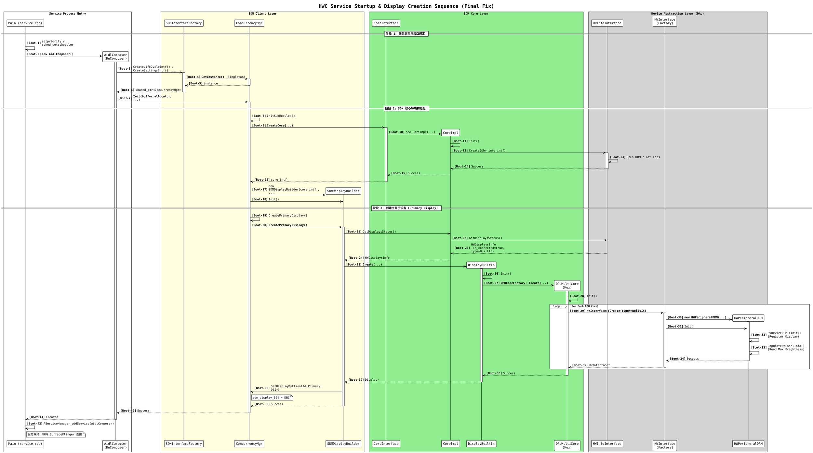

HWC 服务启动到底层 Display 对象创建完成的完整时序,这个过程主要分为三个阶段：

1. **服务启动与依赖注入**：`service.cpp` 启动进程，创建 AIDL 服务实体。
2. **SDM 环境初始化**：`ConcurrencyMgr` 初始化，加载 Core 层和硬件信息。
3. **Display 对象构建**：`DisplayBuilder` 根据硬件信息创建具体的 `DisplayBuiltIn` 和 `HWPeripheralDRM`。

### Qualcomm HWC 启动与 Display 创建全流程

### 关键步骤解析

#### 1. 唯一入口：`service.cpp`

这是 HWC 进程的起点。它并没有直接去操作硬件，而是先创建了 `AidlComposer`。这符合 Android VINTF 架构，将 AIDL 接口作为服务的门面。

#### 2. 隐藏的单例：`ConcurrencyMgr`

`AidlComposer` 在构造时通过 `SDMInterfaceFactory` 获取了一堆接口（`LifeCycle`, `Settings` 等）。
**关键点**：这些接口的实现者全是同一个对象——**`ConcurrencyMgr`**。它是 SDM Client 层的“上帝对象”，如果不初始化它，整个显示系统就不会启动。

#### 3. 硬件扫描：`HWInfoInterface`

在创建任何 Display 对象之前，SDM 必须先知道底层有什么。
`CoreImpl` 初始化时会调用 `HWInfoInterface` 去扫描 DRM 节点（`/dev/dri/card0`），获取连接器列表、面板信息（是否有内屏、是否支持 HDR 等）。

#### 4. 工厂流水线：`DisplayBuilder` -> `DisplayBuiltIn` -> `HWPeripheralDRM`

这是对象创建的核心链条：

* **Builder**: 拿到硬件列表，发现有一个主屏（Primary），于是决定造一个 `DisplayBuiltIn`。
* **Logic (BuiltIn)**: `DisplayBuiltIn` 初始化时，发现可能需要控制多个 DPU 核心（例如左右分屏），于是创建 `DPUMultiCore`。
* **Hardware (DAL)**: `DPUMultiCore` 最终请求创建一个硬件接口。因为类型是 `kBuiltIn`，工厂方法（`hw_interface.cpp`）毫不犹豫地创建了 **`HWPeripheralDRM`**。

#### 5. 最终状态

当 `service.cpp` 执行到 `addService` 时：

* 内存中已经存在了 `HWPeripheralDRM` 实例。
* 该实例已经尝试读取了 `/sys/class/backlight/...`（在 `PopulateHWPanelInfo` 阶段）。
* 如果是在虚拟化环境且没有适配，此时 `brightness_base_path_` 可能已经包含了错误的路径，或者 max brightness 为 0，为后续的 `BadConfig` 埋下了伏笔。