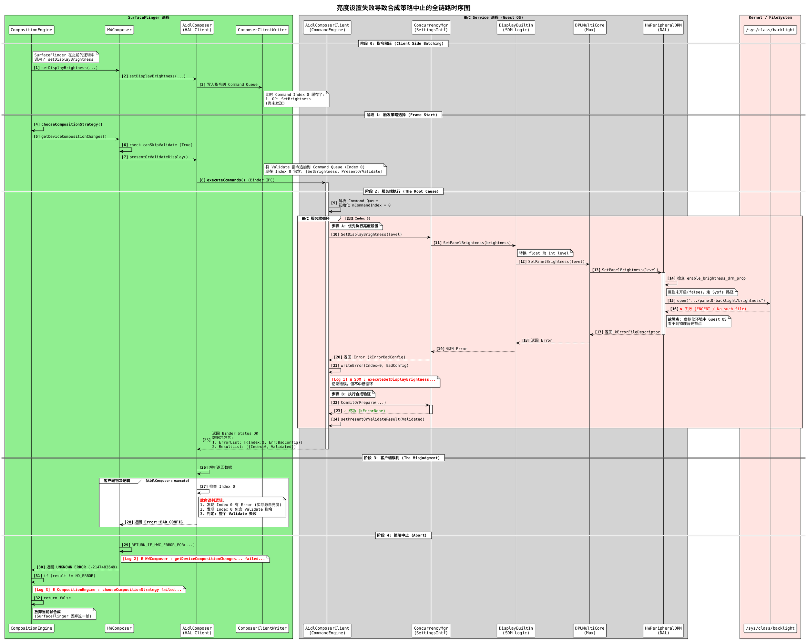

### 亮度调节失败引发SurfaceFlinger合成策略选择失败的时序图



---

### 详细说明：为什么会失败

#### 1. 根本原因 (Root Cause)

故障发生在 **阶段 2** 的底层 `HWPeripheralDRM` 中。

* **背景**：Android 系统运行在 Hypervisor 之上（Guest OS）。
* **冲突**：物理屏幕的背光控制权在 Host OS（Linux/QNX）手中，Guest OS 的内核中没有加载物理 Panel 驱动，因此 `/sys/class/backlight/panel0-backlight` 节点根本不存在。
* **代码缺陷**：`HWPeripheralDRM::SetPanelBrightness` 代码逻辑是为 Native Android 设计的，它尝试打开这个不存在的文件，导致 `open` 失败，返回错误码。

#### 2. 连锁反应

1. **底层报错**：`HWPeripheralDRM` 返回错误。
2. **上层记录**：`AidlComposerClient` (Server) 捕获到亮度设置错误，将其记录在 `CommandResult` 中。
3. **客户端误判**：`AidlComposer` (Client) 收到结果后，发现同一批次指令（Index 0）中有错误。由于 AIDL 协议将多个指令打包在一个 Index 中，Client 无法区分错误是来自“亮度”还是“验证”。出于安全考虑，它认为既然有错，那“验证”结果不可信，于是向 SurfaceFlinger 报告“验证失败”。
4. **合成中止**：SurfaceFlinger 收到验证失败，认为无法继续合成，放弃当前帧。

### Log开关

```bash
adb root
adb shell setprop vendor.display.enable_verbose_log 1
adb shell stop vendor.qti.hardware.display.composer-service
adb shell start vendor.qti.hardware.display.composer-service
```

参考 `ConcurrencyMgr::Init`:

```cpp
  SDMDebugHandler::Get()->GetProperty(ENABLE_VERBOSE_LOG, &value);
  if (true) {
    SDMDebugHandler::DebugAll(value, value);
  }
```