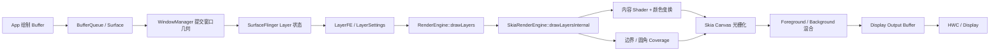

+++
date = '2026-08-01T15:54:21+08:00'
draft = false
title = 'RenderEngine 圆角抗锯齿：Freeform 窗口的描画链路与 Gaussian Coverage 改进'
+++

本文记录一个 Android Freeform 窗口圆角锯齿问题的完整分析过程。现象是：窗口几何形状正确，但四个圆角在高对比背景上仍能看到明显的阶梯状边缘。最终修复不针对某个应用，也不依赖 1:1 变换，而是在 RenderEngine 中重建一条以设备像素为度量的圆角 coverage 路径。

配套代码见同目录的 [renderengine-rounded-corner-antialiasing.patch](renderengine-rounded-corner-antialiasing.patch)。Patch 以 `frameworks/native` 为仓库根目录，包含 RenderEngine 接入、SkSL RuntimeEffect、容错与回归测试。

## 1. 需求与验收标准

需求表面上是“消除 Freeform 窗口圆角锯齿”，但实际上包含几个很强的约束：

- 对任意应用生效，不使用包名白名单。
- 不只支持 1:1 的 layer-to-display 变换；普通缩放、旋转和轻度 shear 也要保持相同的物理边缘宽度。
- 上层是深色或灰度画面、下层是高亮画面时，也不应出现明显阶梯。
- 不能通过改大圆角、移动几何边界或模糊整个内容来“遮住”问题。
- 直线边仍然要清晰，圆弧与直线的切点不能收紧或鼓包。
- 不支持的几何与数值情况必须回到原有描画路径，不影响正常合成。

最终验收标准是：在实际显示尺寸与正常观看距离下，高对比场景中四个圆角的阶梯感肉眼基本不可见；同时圆角的 50% coverage 轮廓不偏移。

## 2. 先理解 Freeform 窗口是怎样被画出来的

要分析圆角，不能只看应用窗口的 Buffer。Freeform 的圆角往往是 SurfaceFlinger 合成 Layer 时附加的几何 coverage，而不是应用已经画进 Buffer 的透明像素。

### 2.1 从应用 Buffer 到屏幕像素



这条链路中，与本问题最直接相关的是 `LayerSettings::geometry`：

- `boundaries`：Layer 内容的局部边界。
- `roundedCornersCrop`：圆角 crop 作用的矩形。
- `roundedCornersRadii`：四个角的 x/y 半径。
- `cornerSmoothness`：非标准圆角路径的平滑参数。
- `positionTransform`：Layer 局部坐标到目标显示坐标的变换。

`SkiaRenderEngine::drawLayersInternal()` 会先将这些信息整理成：

- `bounds`：实际要画的边界，可能是 `SkRect`，也可能是 `SkRRect`。
- `roundRectClip`：需要额外应用的圆角裁剪。
- `boundsPath`：内容的 Skia Path。
- `clipPath`：裁剪的 Skia Path。

因此，同一个可见圆角可能来自两种描画方式：

| 可见形状 | `bounds` | `roundRectClip` | 描画要点 |
|---|---|---|---|
| Layer 边界本身是圆角 | RRect | Empty | coverage 直接描述内容边界 |
| 矩形 Layer 被圆角 crop | Rect | RRect | coverage 作为 clip 乘到内容上 |
| 复杂路径或非统一圆角 | Path | 可能存在 | 保留 Skia 通用 Path AA |

### 2.2 内容和 coverage 是两件事

RenderEngine 会先为 Layer 内容构造 `SkPaint`和内容 Shader，其中包含 Buffer 采样、dataspace 转换、颜色变换、Layer alpha 等。圆角 coverage 是另一层几何掩码，决定当前目标像素有多少比例被上层覆盖。

若忽略颜色空间变换，一个边缘像素的直观混合可写成：

```text
effectiveAlpha = layerAlpha * coverage
Cout = effectiveAlpha * Cforeground
     + (1 - effectiveAlpha) * Cbackground
```

这也解释了为什么“上层是灰度画面，下层是高亮画面”时问题特别明显：眼睛看到的不是 coverage 本身，而是 coverage 将两层高对比颜色混合后的结果。

## 3. 问题的根本原因

### 3.1 几何正确，不等于采样足够平滑

理想圆弧是连续几何，而显示屏是离散像素网格。光栅化阶段必须估计每个像素内有多少面积位于曲线内部，这个比例就是 coverage。

常规 analytic AA 通常将过渡压缩在大约一个目标像素内。对水平或垂直直线，这样能得到非常清晰的边缘；但对于斜率很小的圆弧片段，曲线穿过像素网格的位置变化很慢，多个相邻像素会量化成相同或近似的 coverage。结果就是水平或垂直方向上的长条状阶梯。

```text
理想连续圆弧:       ········
                      ·
                   ·
                ·

量化后的浅角边缘:  ______
                         |____
                              |___
```

所以，问题不是“圆角半径错了”，而是“在高对比条件下，圆弧的边缘重建带宽不足”。

### 3.2 下层高亮内容会放大 coverage 量化

假设上层深灰码值为 20，下层亮色码值为 240：

```text
coverage = 0.25 -> output = 0.25 * 20 + 0.75 * 240 = 185
coverage = 0.50 -> output = 0.50 * 20 + 0.50 * 240 = 130
```

相邻 coverage 只变化 0.25，最终像素已经相差 55 个码值。如果前后景颜色接近，同样的 coverage 误差很难被看见；高亮背景与深色窗口组合则会把它放大为明显的明暗台阶。

这个现象也说明，分析抗锯齿不能只看纯 alpha 图，还必须在真实的前后景混合上验证最终 RGB。

### 3.3 为什么这不是应用问题

当不同应用在同一 Freeform 窗口形态下都出现同样的四角阶梯，而应用内容只改变了边缘内侧的颜色，这个证据已经指向合成阶段的共用圆角 coverage。

使用包名条件只会把同一个系统问题切成多个应用特例，既不能解释新应用为什么也会复现，也会让后续维护变成不断追加白名单。

### 3.4 为什么限制 1:1 变换也不对

1:1 只表示一个 Layer 局部单位恰好映射为一个目标像素，它不能消除圆弧和像素网格之间的相位与斜率问题。即使是单位矩阵，浅角圆弧仍会在离散像素上形成阶梯。

反过来，如果把 feather 宽度定义在 Layer 局部坐标，那么缩放 2 倍后边缘也会变宽 2 倍。正确的约束不是“只允许 1:1”，而是“无论 Layer 怎样参数化，相同的目标几何必须得到相同的设备像素 coverage”。

## 4. 几种看似可行但不充分的方案

| 方案 | 为什么不充分 |
|---|---|
| 按应用包名开启 | 问题位于共用合成路径，新应用仍会复现，条件会无限扩张 |
| 只在 1:1 时开启 | 不能解决单位矩阵下的浅角量化，也放弃了正常 Freeform 缩放 |
| 在边缘再画一条半透明宽描边 | 会修改边缘颜色和总 alpha，容易出现 halo；与新 coverage 叠加时还会双重描画 |
| 改大圆角或改变 crop | 移动了业务几何，没有修复采样问题 |
| 对整层做模糊 | 内容和直线边都会变软，还需要额外中间 Buffer |
| 整屏超采样 | 能提高质量，但显存、带宽和 GPU 代价过高，不应为局部圆角付出整帧成本 |

“增加更宽的 edge feather”的正确含义是：不移动理想轮廓，只修改理想轮廓两侧如何重建 coverage。它本质上是一个采样核设计问题，不是额外画一条带颜色的边。

## 5. 解决方案：设备空间 Gaussian Coverage

### 5.1 设计目标

新路径遵循六个原则：

1. coverage 的宽度以目标设备像素定义。
2. 理想几何边界上 coverage 始终等于 0.5，不移动轮廓。
3. 圆弧使用较宽的平滑重建，直线仍保留约一像素的清晰过渡。
4. 在合理的 affine 变换下，相同设备几何得到近似相同的 coverage。
5. 只处理可以稳定建模的 simple RRect 和 oval，其他形状回退。
6. RuntimeEffect 创建失败时不影响描画服务，直接回到已有路径。

### 5.2 将 RRect 化为归一化圆角问题

设局部矩形中心为 `c`，宽高为 `w/h`，圆角半径为 `rx/ry`，局部点为 `p`。先将坐标归一化：

```text
u = (p - c) / (rx, ry)
stretch = 1 - (w / (2 * rx), h / (2 * ry))
q = max(abs(u) + stretch, 0)
F(q) = dot(q, q) - 1
```

- `F < 0`：点在 RRect 内。
- `F = 0`：点在理想边界上。
- `F > 0`：点在 RRect 外。

`max(..., 0)` 把圆角之间的区域压缩成直线段；到达角部时，问题则转化为单位圆/椭圆的边界计算。四个角通过 `abs()` 共享同一组方程，天然保证对称性。

### 5.3 距离必须在设备坐标中计算

设 Layer 局部坐标到设备坐标的线性部分为：

```text
    [ a  b ]
M = [ c  d ]
```

若只在局部坐标中对 `F` 做 feather，边缘宽度就会被 `M` 一起缩放。新 shader 通过逆矩阵导数把隐式函数的梯度转换到设备空间：

```text
gradientDevice = transpose(inverse(M)) * gradientLocal
normalDevice = normalize(gradientDevice)
```

接着沿设备空间法线向理想椭圆求交，解一个二次方程得到带符号距离 `d`：内部为负，外部为正。

这比直接使用 `F / fwidth(F)` 更符合本需求：`fwidth` 适合构造局部一像素 analytic AA，而本方案需要的是明确以设备像素表示、可调且在 affine 参数化下稳定的距离。

### 5.4 Gaussian CDF 作为圆弧 coverage

对带符号设备距离 `d`，圆弧 coverage 定义为：

```text
coverage(d) = 0.5 * erfc(d / (sqrt(2) * sigma))
```

其关键性质是：

- `d = 0` 时 `coverage = 0.5`，所以不移动理想轮廓。
- `d < 0` 越靠内，coverage 越接近 1。
- `d > 0` 越靠外，coverage 越接近 0。
- `sigma` 直接表示设备像素中的过渡尺度。

默认 `sigma = 1.0 px`。10% 到 90% 的过渡宽度约为 `2.56 * sigma`，即约 2.56 个目标像素。它足以把浅角圆弧分散成多个独立 coverage 等级，又没有将边缘扩张成明显的柔焦。

实现在 `+/- 3 * sigma` 之外截断为全内或全外，并用 erf 近似避免额外查找纹理。

### 5.5 为什么直线不一起变宽

如果对整个 RRect 无条件使用 Gaussian，水平和垂直边也会变成约 2.56 px 的过渡，界面会显得发虚。

新 shader 因此同时实现了 `pixelBoxCoverage()`，它计算局部线性化边界切过一个轴对齐目标像素时的面积 coverage。

- 在圆弧与直线的精确切点，使用一像素 box coverage。
- 沿圆弧离开切点的前 2 个设备像素，用 `smoothstep` 逐步混合到 Gaussian coverage。
- oval 没有直线段，因此整个轮廓都使用 Gaussian，避免在上下左右四个基数点出现“突然变窄”的 pinch。

### 5.6 不改变几何边界

Gaussian 会在理想轮廓外产生一小段非零 coverage。如果仍然只画原 RRect 内部，外侧核会被几何边界截断，50% 轮廓也会被第二次 AA 修改。

对“bounds 本身就是 RRect”的情况，新路径因此：

1. 将 coverage shader 安装为 `clipShader`。
2. 将 draw bounds 向外扩大到容纳完整 `3 * sigma` support。
3. 画一个不带额外 Path AA 的矩形。

这样唯一决定边缘 alpha 的就是 Gaussian coverage，不会再乘上 Skia 的一像素 RRect AA。

对“矩形 bounds + 圆角 crop”的情况，coverage shader 只作为 clip，内容仍按原 `boundsPath` 描画。两条路径最终应产生近似相同的 alpha。

### 5.7 affine 变换的稳定性与回退条件

将圆角半径编入线性变换：

```text
A = M * diag(rx, ry)
```

设 `A` 的最大、最小奇异值为 `smax/smin`，那么：

- `smax / smin` 表示椭圆的条件数。
- `smin` 表示较小的设备空间半轴。

代码不需要完整 SVD，而是从 `A * transpose(A)` 的迹、特征值差和行列式推出两个量。当出现以下情况时返回 `nullopt`，让调用者使用原有路径：

- 透视变换。
- 矩阵非有限、接近奇异或行列式过小。
- `smax / smin > 4`，法线射线不再是足够稳定的距离近似。
- `smin < 3 * sigma`，完整滤波 support 已经达到椭圆中心。
- 复杂的每角独立半径、非标准 smooth corner 或无效尺寸。

回退是算法设计的一部分，而不是异常情况。对于无法保证距离质量的几何，使用成熟的通用 Path AA 比继续输出不可控的 coverage 更可靠。

### 5.8 快速路径与代价

Gaussian 需要 `exp`、`sqrt` 和法线计算，比普通一像素 AA 更贵。Shader 通过 `u_maxSampleRadius` 将 `3 * sigma` support 换算为归一化圆角坐标，并在主函数开头做两个相干性较好的快速分支：

- support 完全在形状内，直接返回 1。
- support 完全在形状外，直接返回 0。
- 只有靠近圆角边界的 fragment 执行完整距离和 Gaussian 计算。

该方案不创建全屏超采样 Buffer，也不需要额外模糊 pass。它的主要成本是合格圆角 Layer 上的 fragment shader ALU，应结合 GPU counter 和真实层数进一步测量。

## 6. RenderEngine 中的接入方式

### 6.1 选择哪些 RRect

`SkiaRenderEngine::drawLayersInternal()` 只在以下两种情况尝试新 shader：

```cpp
if (roundRectClip.isEmpty() && !bounds.isRect()) {
    // Layer bounds 本身是 RRect
} else if (bounds.isRect() && !roundRectClip.isEmpty()) {
    // 矩形 bounds 使用 RRect clip
}
```

同时要求 `cornerSmoothness <= 0`。`RoundedCornerShaderFactory` 还会验证 RRect 是 simple 或 oval、半径有效、变换无透视且数值稳定。

### 6.2 不能双重应用 coverage

新 shader 成功时，它已经完整描述边缘 coverage。如果后面再无条件执行一次 `drawPath(boundsPath, paint)`，或再叠加一条半透明宽描边，都会造成双重描画、边缘颜色偏移或 coverage 变形。

合并代码时应保证：

```cpp
if (roundedCornerShader) {
    // 新 coverage 路径，只画一次
} else {
    // 保留现有 Path AA / 产品回退路径
}
```

如果当前分支已有额外边缘描边，它只能在 `!roundedCornerShader` 的旧路径执行，不能与 Gaussian coverage 叠加。

### 6.3 RuntimeEffect 延迟创建与失败回退

圆角 effect 不加入 `RuntimeEffectManager` 的全局已知 effect 数组，而是在第一个合格圆角出现时由 factory 局部创建：

```cpp
static const sk_sp<SkRuntimeEffect> effect = [] {
    auto [effect, error] = SkRuntimeEffect::MakeForShader(source, options);
    if (!effect) {
        ALOGE("... using existing AA path: %s", error.c_str());
    }
    return effect;
}();
```

C++ 函数局部 static 保证线程安全地只初始化一次。失败结果也会被缓存，既不会重复编译、刷屏日志，也不会中断 RenderEngine；`createShader()` 返回 `nullopt` 后，调用者自然进入现有路径。

### 6.4 调试属性

```text
debug.renderengine.enhanced_rounded_corner_aa
debug.renderengine.rounded_corner_aa_sigma_x100
```

- 增强开关默认为 `true`。
- sigma 默认为 `100`，即 `1.00 px`。
- 调试范围限制为 `75..125`，即 `0.75..1.25 px`。
- 两个属性都在进程中只读取一次，修改后需要让 SurfaceFlinger 重新创建 RenderEngine。

`dumpsys SurfaceFlinger` 会输出当前开关和 sigma，便于确认测试组合：

```text
RenderEngine enhanced rounded-corner AA: enabled
(device-space Gaussian coverage, sigma 1.00 px)
```

## 7. 代码组织

| 文件 | 作用 |
|---|---|
| `libs/renderengine/include/renderengine/RenderEngine.h` | 定义开关和 sigma 调试属性 |
| `libs/renderengine/skia/filters/RoundedCornerShaderFactory.h` | 定义 coverage shader 输出与保守 draw bounds |
| `libs/renderengine/skia/filters/RoundedCornerShaderFactory.cpp` | SkSL、设备距离计算、Gaussian CDF、几何验证与回退 |
| `libs/renderengine/skia/SkiaRenderEngine.h` | 持有 factory |
| `libs/renderengine/skia/SkiaRenderEngine.cpp` | 选择合格 RRect，在 bounds/clip 两条路径中接入 coverage |
| `libs/renderengine/Android.bp` | 将 factory 加入 RenderEngine 源文件 |
| `libs/renderengine/tests/RenderEngineTest.cpp` | coverage、对称、相位、混合、变换不变性和回退测试 |

一个重要的边界是：该 effect 故意不修改 `RuntimeEffects.inl`。它是 factory 局部、延迟创建的 effect，不需要全局 known-effect ID。

## 8. 如何验证算法，而不只是比两张图

### 8.1 自动化测试覆盖

| 测试 | 验证内容 |
|---|---|
| `drawLayers_roundedCornerUsesGaussianArcCoverage` | 圆弧上有多个独立 coverage 区间，直线仍保持约一像素过渡，四角对称 |
| `drawLayers_roundedCornerGaussianPreservesHalfCoverageContour` | 理想圆弧和直线边界上的 coverage 都约为 128/255 |
| `drawLayers_roundedCornerOvalHasNoTangencyPinch` | oval 的基数点仍保持完整 Gaussian 过渡 |
| `drawLayers_roundedCornerGaussianIsStableAcrossSubpixelPhases` | 4x4 个亚像素相位下，实际 alpha 与解析 Gaussian 一致 |
| `drawLayers_roundedCornerGaussianCompositesSmoothlyOverBrightBackground` | 不只检查 alpha，还检查深色前景在亮色背景上的最终 RGB 过渡 |
| `drawLayers_roundedCornerBoundsAndClipCoverageMatch` | bounds RRect 和 rounded clip 两条路径的 coverage 等价 |
| `drawLayers_roundedCornerCoverageIsDeviceSpaceInvariant` | 相同设备几何用 1x 和 2x Layer 参数化时结果一致 |
| `drawLayers_roundedCornerCoverageIsStableUnderAffineReparameterization` | 带 shear 的同一设备 RRect 在不同局部参数化下结果一致 |
| `drawLayers_roundedCornerDebugSwitchUsesExistingPathWhenDisabled` | 开关关闭时进入现有描画路径，不使用 Gaussian 分布 |

亚像素相位测试不只检查一个 50% 点，而是对 16 个 phase 中的 5500 个以上边缘样本与解析 `erfc` 参考比较：

```text
phase max error <= 0.015
phase mean error <= 0.004
global max error <= 0.015
global mean error <= 0.004
```

这类测试能捕获“某个截图看起来不错，但窗口移动 0.25 px 就重新出现阶梯”的问题。

### 8.2 设备 A/B 验证

属性在进程中只读取一次，所以每次修改后都要重新创建 SurfaceFlinger。以下命令只展示通用流程，实际重启方式应遵循设备的调试约定：

```bash
adb -s <serial> shell setprop debug.renderengine.enhanced_rounded_corner_aa false
# 重新创建 SurfaceFlinger

adb -s <serial> shell setprop debug.renderengine.enhanced_rounded_corner_aa true
adb -s <serial> shell setprop debug.renderengine.rounded_corner_aa_sigma_x100 100
# 再次重新创建 SurfaceFlinger

adb -s <serial> shell dumpsys SurfaceFlinger \
    | grep "enhanced rounded-corner AA"
```

多屏设备应显式指定 display ID，避免 `screencap` 在 PNG 前输出警告文本：

```bash
adb -s <serial> shell dumpsys SurfaceFlinger --display-id
adb -s <serial> exec-out screencap -p -d <display-id> > rounded-corner-on.png
```

建议的 A/B 场景：

1. 固定 Freeform 窗口位置和尺寸，避免两张截图的亚像素 phase 不同。
2. 前景使用深灰或暗色，背景使用高亮、细节丰富的画面。
3. 同时检查四个角，不要只选对比最弱的一个角。
4. 以 1x 截图完成肉眼验收，放大图只用于定位 coverage 变化，不能替代实际观感。
5. 拖动和改变窗口大小，观察不同亚像素相位下是否稳定。
6. 检查直线边、圆弧与直线的切点，确认没有变糊、收紧、暗边或外发光。

### 8.3 验收清单

- [ ] 任意应用的 Freeform 圆角都走同一系统路径。
- [ ] 高亮背景 + 深色/灰度前景时，四角肉眼基本看不到阶梯。
- [ ] 窗口移动、缩放后效果稳定，不依赖某个像素对齐位置。
- [ ] 圆弧的 50% coverage 轮廓没有改变可见半径。
- [ ] 直线边依然清晰，切点无 pinch。
- [ ] bounds RRect 与 rounded clip 的可见边缘一致。
- [ ] 无透视的常见 affine 变换下 coverage 宽度保持设备像素不变。
- [ ] 不支持的形状和数值条件正常回退，不出现丢层、黑屏或边界截断。
- [ ] 无明显额外 GPU 帧耗时、shader 编译抖动或显存增长。

## 9. 边界、参数与后续改进

### 9.1 sigma 不是越大越好

- sigma 过小：重新接近一像素 AA，浅角阶梯重新显现。
- sigma 过大：边缘变软，可能被感知为暗边或模糊。
- 因为轮廓中心不变，调 sigma 主要改变的是过渡斜率，但验收仍应同时看 alpha 和最终 RGB。

`1.00 px` 是本案例在“平滑浅角阶梯”和“保持边缘清晰”之间的折中起点，不应脱离具体屏幕、观看距离与内容对比度当成通用常数。

### 9.2 当前明确不处理的情况

- perspective transform。
- 高度偏心或条件数过大的变换椭圆。
- support 比物理半径还大的小圆角。
- 四角半径无法归约为 simple RRect 的复杂几何。
- `cornerSmoothness > 0` 生成的非标准路径。
- 自带独立 clip 的 backdrop、blur 或其他 pre-pass；当前接入点只覆盖最终 Layer content draw。

如果未来要扩展这些情况，应先建立相应的解析或高精度参考，再扩大 shader 适用范围，而不是删除条件数和小半径保护。

### 9.3 关于颜色空间

coverage 是几何量，但人眼看到的是颜色空间中的合成结果。本 patch 不改变 RenderEngine 现有的 dataspace 和混合策略，测试中的高对比 RGB 参考也明确依赖当前管线。如果平台未来切换为不同的线性光混合策略，应更新最终 RGB 参考，但不应改变 coverage 几何测试的 50% 轮廓和设备空间不变性。

## 10. 这个案例带来的描画管线认知

1. **窗口的可见形状不一定在应用 Buffer 里。** 系统合成器可以在 Layer 阶段附加 crop、RRect、alpha 和变换。
2. **抗锯齿是 coverage 重建，不是修改几何。** 理想边界、采样核和最终混合应分开思考。
3. **设备像素是最终质量约束。** 局部坐标中的固定宽度会被 transform 改变，不能用 1:1 特例代替正确的坐标变换。
4. **最终合成图比单层 alpha 更能暴露问题。** 高对比背景会将微小 coverage 台阶放大为可见色差。
5. **不要只测一个像素相位。** 圆弧和像素网格的相位会随窗口拖动改变，需要多 phase 回归。
6. **新 coverage 和旧边缘技巧不能双重叠加。** 任何额外 stroke、Path AA 或 clip AA 都可能再次修改已计算好的 alpha。
7. **回退和数值保护属于算法本身。** 只在能证明质量的几何上启用专用 shader，比强行覆盖所有情况更稳健。

## 11. Patch 使用说明

将同目录 patch 传递给目标源码树后，从 `frameworks/native` 仓库根目录执行：

```bash
git apply --check /path/to/renderengine-rounded-corner-antialiasing.patch
git apply /path/to/renderengine-rounded-corner-antialiasing.patch
```

Patch 包含产品分支中既有边缘路径的集成上下文。如果目标分支描画块不同，应按本文的控制流原则手工合并：新 shader 成功时只生成一次边缘 coverage；否则完整保留目标分支的现有路径。
