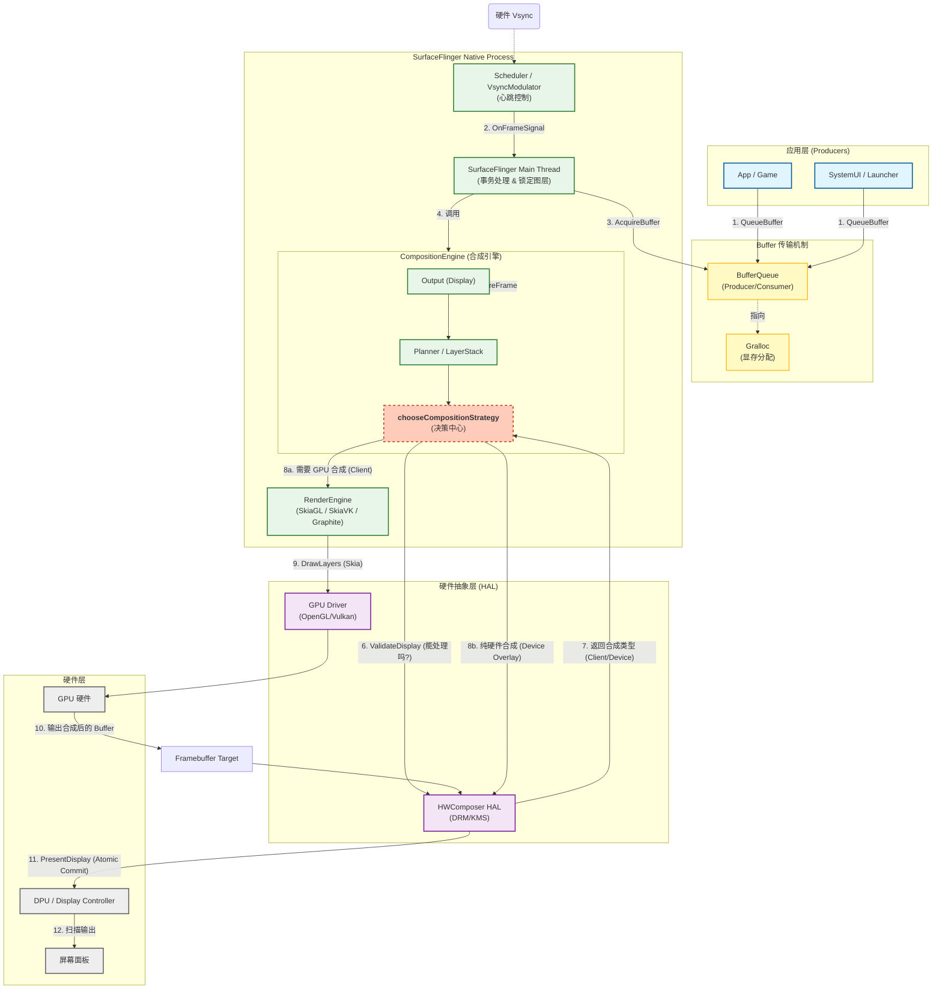

```mermaid
graph TD
    %% --- 定义样式 ---
    classDef appLayer fill:#e1f5fe,stroke:#01579b,stroke-width:2px;
    classDef bufferLayer fill:#fff9c4,stroke:#fbc02d,stroke-width:2px;
    classDef sfLayer fill:#e8f5e9,stroke:#2e7d32,stroke-width:2px;
    classDef halLayer fill:#f3e5f5,stroke:#7b1fa2,stroke-width:2px;
    classDef hwLayer fill:#eeeeee,stroke:#616161,stroke-width:2px;
    classDef decisionNode fill:#ffccbc,stroke:#bf360c,stroke-width:2px,stroke-dasharray: 5 5;

    %% --- 1. 应用层 (Producers) ---
    subgraph AppLayer ["应用层 (Producers)"]
        direction LR
        App["App / Game"]
        SysUI["SystemUI / Launcher"]
    end
    class App,SysUI appLayer;

    %% --- 2. Buffer 传输层 ---
    subgraph BufferLayer ["Buffer 传输机制"]
        BQ["BufferQueue<br/>(Producer/Consumer)"]
        Gralloc["Gralloc<br/>(显存分配)"]
    end
    class BQ,Gralloc bufferLayer;

    %% --- 3. SurfaceFlinger 核心层 ---
    subgraph SF_Core ["SurfaceFlinger Native Process"]
        direction TB
        
        Scheduler["Scheduler / VsyncModulator<br/>(心跳控制)"]
        SF_Main["SurfaceFlinger Main Thread<br/>(事务处理 & 锁定图层)"]
        
        subgraph CE ["CompositionEngine (合成引擎)"]
            Output["Output (Display)"]
            Planner["Planner / LayerStack"]
            Strategy["<b>chooseCompositionStrategy</b><br/>(决策中心)"]
        end
        
        RE["RenderEngine<br/>(SkiaGL / SkiaVK / Graphite)"]
    end
    class Scheduler,SF_Main,Output,Planner,RE sfLayer;
    class Strategy decisionNode;

    %% --- 4. HAL 硬件抽象层 ---
    subgraph HAL ["硬件抽象层 (HAL)"]
        HWC["HWComposer HAL<br/>(DRM/KMS)"]
        GPUDriver["GPU Driver<br/>(OpenGL/Vulkan)"]
    end
    class HWC,GPUDriver halLayer;

    %% --- 5. 硬件层 ---
    subgraph Hardware ["硬件层"]
        GPU_HW["GPU 硬件"]
        DPU_HW["DPU / Display Controller"]
        Panel["屏幕面板"]
    end
    class GPU_HW,DPU_HW,Panel hwLayer;

    %% --- 连接关系 ---
    
    %% 生产阶段
    App -->|"1. QueueBuffer"| BQ
    SysUI -->|"1. QueueBuffer"| BQ
    BQ -.->|"指向"| Gralloc
    
    %% 触发阶段
    Display_Vsync("硬件 Vsync") -.-> Scheduler
    Scheduler -->|"2. OnFrameSignal"| SF_Main
    
    %% 逻辑处理
    SF_Main -->|"3. AcquireBuffer"| BQ
    SF_Main -->|"4. 调用"| CE
    CE -->|"5. prepareFrame"| Output
    Output --> Planner
    Planner --> Strategy
    
    %% 核心决策交互 (谈判)
    Strategy -->|"6. ValidateDisplay (能处理吗?)"| HWC
    HWC -->|"7. 返回合成类型 (Client/Device)"| Strategy
    
    %% 执行路径 A: GPU 合成 (Client Composition)
    Strategy --"8a. 需要 GPU 合成 (Client)"--> RE
    RE -->|"9. DrawLayers (Skia)"| GPUDriver
    GPUDriver --> GPU_HW
    GPU_HW -->|"10. 输出合成后的 Buffer"| BQ_Target["Framebuffer Target"]
    BQ_Target --> HWC
    
    %% 执行路径 B: 硬件合成 (Device Composition)
    Strategy --"8b. 纯硬件合成 (Device Overlay)"--> HWC
    
    %% 最终提交
    HWC -->|"11. PresentDisplay (Atomic Commit)"| DPU_HW
    DPU_HW -->|"12. 扫描输出"| Panel
```