+++
date = '2025-09-29T10:22:54+08:00'
draft = false
title = 'SurfaceFlinger详解'
+++


## Display创建过程

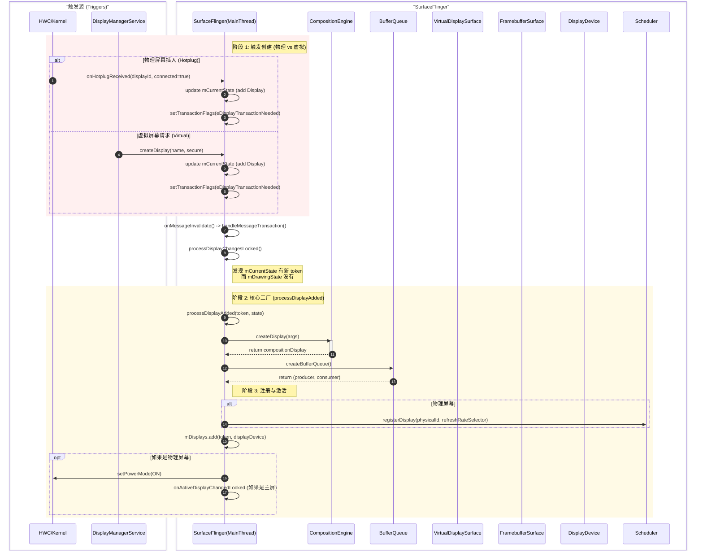

## Layer管理与渲染

### Layer 核心架构类图

这张图展示了 **SurfaceFlinger**（管理状态）、**LayerFE**（数据快照/接口）和 **CompositionEngine**（合成逻辑）之间的静态关系。

**核心设计点：**

* **Layer**: 是 SurfaceFlinger 的核心实体，管理 Buffer队列、DrawingState 等。
* **LayerFE (Front End)**: 是 Layer 暴露给 CompositionEngine 的“代理”。它持有 Layer 的快照 (`mSnapshot`)，实现了**数据隔离**（SF 主线程修改 Layer，CE 线程读取 LayerFE）。
* **OutputLayer**: 是 CompositionEngine 中 Layer 的容器。因为它属于某个具体的 `Output` (Display)，所以它负责计算该 Layer 在该屏幕上的具体属性（如投影、裁剪）。

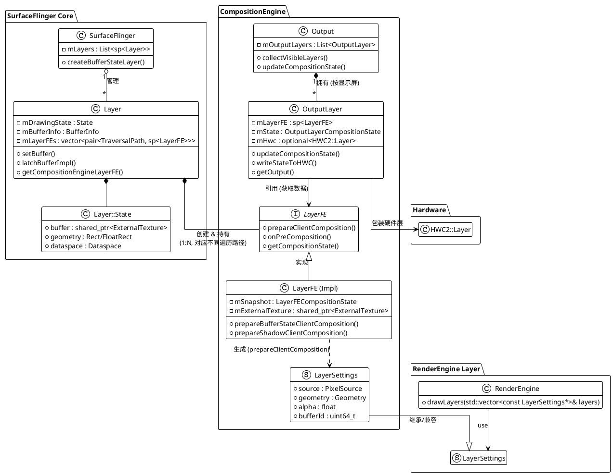


## Display图像合成流程

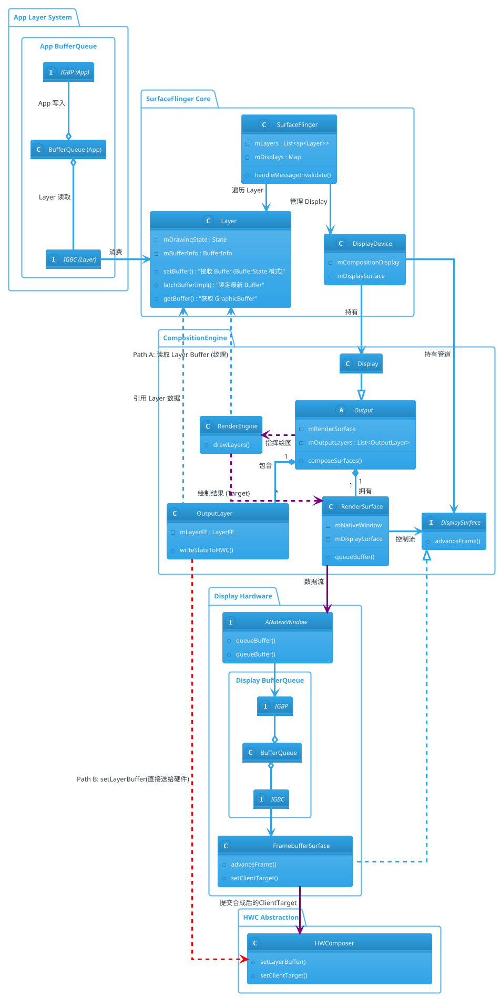

总结数据流向
```txt
[RenderEngine] 
      | (绘制 GPU 合成部分)
      v
[IGraphicBufferProducer] --> [BufferQueue] --> [IGraphicBufferConsumer]
                                                      |
                                                      v
                                             [FramebufferSurface]
                                                      | (setClientTarget)
                                                      v
                                                [HWComposer] --> [物理屏幕]
```


### 数据流与合成架构解析

这张架构图宏观地展示了 Android 图形系统从应用层生产到硬件层显示的完整流水线。核心逻辑可以概括为 **“一个源头，两次决策，殊途同归”**。

#### 1. 生产端：数据的源头 (App Layer System)

一切始于左上角的 **App Layer System**。

* **生产 (Produce)**：应用程序作为生产者，通过 `AppIGBP` 将绘制好的 GraphicBuffer 填充到 **App BufferQueue** 中。
* **消费 (Consume)**：SurfaceFlinger 端的 `Layer` 作为消费者 (`AppIGBC`)，通过 `latchBuffer()` 锁定应用最新提交的 Buffer。此时，SF 拥有了图层的原始数据。

#### 2. 决策层：CompositionEngine 的分流

中间的 **CompositionEngine** 是“大脑”，负责决定每一帧如何合成。`Output`（代表屏幕）管理着多个 `OutputLayer`。在这里，系统面临关键的**路径选择**：

* **路径 A：GPU 合成 (Client Composition)** —— *图中紫色箭头*
  * **场景**：当图层有复杂特效（如圆角、模糊）、不支持的格式或超出 HWC 处理能力时。
  * **流程**：`Output` 指挥 **`RenderEngine`** 工作。`RenderEngine` 将 `Layer` 中的 Buffer 作为**纹理 (Texture)** 读取，利用 GPU 将其绘制到 `RenderSurface` 申请的目标 Buffer 上。
  * **流向**：图层数据被“画”到了新的 Buffer 中，进入下方的 Display BufferQueue。


* **路径 B：HWC 合成 (Device Composition)** —— *图中红色箭头*
  * **场景**：标准图层，硬件直接支持，效率最高。
  * **流程**：`OutputLayer` 直接将 `Layer` 中的原始 Buffer 句柄传递给 **`HWComposer`** (`setLayerBuffer`)。
  * **流向**：数据**透传**。Buffer 不经过 GPU 读写，直接由 Display Controller 读取并显示。


#### 3. 实现层与基础设施 (Display Hardware)

这一层负责管理合成后的结果（主要是 GPU 合成的结果）：

* **RenderSurface 的双重角色**：它是连接逻辑与物理的枢纽。
* **向上**：对接 `RenderEngine`，作为绘图目标。
* **向下**：对接 **Display BufferQueue** (`SFNativeWindow`)，将 GPU 画好的帧推入队列。


* **FramebufferSurface**：它是 Display BufferQueue 的消费者。它从队列中取出 GPU 合成好的 Buffer，通过 `setClientTarget()` 提交给 HWC。

#### 4. 最终汇聚：HWComposer

在图的最底部，**`HWComposer`** 完成最后的汇聚：

1. 接收来自 **路径 B** 的独立图层 Buffer (`setLayerBuffer`)。
2. 接收来自 **路径 A** 的 GPU 合成结果 Buffer (`setClientTarget`)。
3. 硬件将这两部分内容叠加，最终输出到物理屏幕。


---

### 完整的合成过程


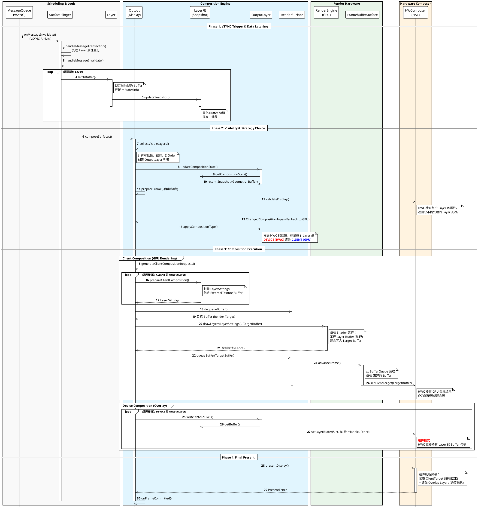


这是为您整理的 **Android SurfaceFlinger 合成流水线技术说明书**。这份文档基于之前的代码分析、架构图和时序图，旨在从系统架构角度详细阐述渲染合成的完整生命周期。

---


SurfaceFlinger 的核心职责是充当系统的“合成器”。在每一次 VSYNC 信号的驱动下，它负责收集来自各个应用程序（App）生产的图形缓冲区（GraphicBuffer），决定合成策略（GPU 绘制或 HWC 叠加），并将最终结果提交给显示硬件。

整个流程是一个 **"调度 (Schedule) -> 锁定 (Latch) -> 决策 (Decide) -> 执行 (Execute) -> 上屏 (Present)"** 的闭环系统。


在深入流程之前，需明确以下关键组件的角色：

* **Layer (图层)**: SurfaceFlinger 端对应 App Surface 的实体，管理 BufferQueue 的消费者接口，维护当前帧的绘制状态 (`mDrawingState`)。
* **LayerFE (Front End)**: Layer 的快照/代理接口。它将 Layer 的数据（如 Buffer 句柄、几何变换）固化，供合成线程安全读取，隔离主线程的修改。
* **Output / Display**: 代表一个物理或虚拟屏幕，负责管理该屏幕上的图层集合 (`OutputLayer`) 和合成策略。
* **RenderEngine (RE)**: 基于 GPU (OpenGL ES/Skia/Vulkan) 的绘图引擎，负责执行“客户端合成”。
* **HWComposer (HWC)**: 硬件合成器抽象层，直接对接显示硬件（Display Controller/DPU），负责执行“设备合成”。
* **RenderSurface & FramebufferSurface**: 连接 GPU 输出与 HWC 输入的管道。


整个合成周期由硬件 VSYNC 信号触发，分为四个核心阶段。

**阶段一：调度与数据锁定 (Scheduling & Latching)**

此阶段的目标是**冻结世界**。SurfaceFlinger 必须确定这一帧要显示什么，并在合成期间保持数据不变。

1. **VSYNC 触发**: `MessageQueue` 收到 VSYNC 信号，调用 `onMessageInvalidate()` 唤醒 SurfaceFlinger 主线程。
2. **处理事务**: 处理 WindowManager 发来的层级变更、属性修改等事务。
3. **锁定 Buffer (Latch Buffer)**:
* SF 遍历所有 Layer。如果 App 已经通过 BufferQueue 提交了新 Buffer，SF 调用 `Layer::latchBuffer()`。
* **关键动作**: Buffer 句柄从 `Layer` 的 `mDrawingState` 转移到 `mBufferInfo`。
* **快照更新**: 调用 `LayerFE::updateSnapshot()`，将最新的 Buffer 引用和几何状态复制到 `LayerFE` 中。后续的合成操作只读取 `LayerFE`，此时 App 即使提交新帧也不会影响正在进行的合成。


**阶段二：策略协商与决策 (Strategy Negotiation)**

此阶段的目标是**性能最优化**。系统倾向于让 HWC 硬件处理尽可能多的图层（功耗低、效率高），只有 HWC 处理不了的才交给 GPU。

1. **可见性计算**: `Output` 遍历图层树，计算每个 `OutputLayer` 在当前屏幕上的可见区域、裁剪（Crop）和 Z-Order。不可见图层被剔除。
2. **验证请求 (Validate Display)**:
* `Output` 先假设所有图层都走 **Device Composition (HWC)**。
* 调用 `HWC::validateDisplay()` 将图层列表提交给硬件驱动。


3. **策略回退**:
* HWC 驱动检查每个图层的属性（格式、缩放比例、混合模式等）。
* 如果硬件不支持某个图层，HWC 会在返回结果中标记该图层为 `CLIENT` (需要客户端合成)。
* SF 根据反馈，更新每个 `OutputLayer` 的合成类型：
* **`DEVICE`**: 硬件直接合成。
* **`CLIENT`**: 回退到 GPU 合成。

**阶段三：执行与分流 (Execution & Dispatch)**

根据协商结果，Buffer 数据流向两条截然不同的路径。**注意：此处传递的均为 Buffer 的句柄 (Handle)，而非像素拷贝。**

路径 A：设备合成 (Device Composition / Overlay)

* **适用对象**: 标记为 `DEVICE` 的图层。
* **数据流转**: `LayerFE` -> `OutputLayer` -> `HWComposer`。
* **动作**: `OutputLayer` 调用 `setLayerBuffer(slot, bufferHandle, fence)`。
* **本质**: **透传 (Pass-through)**。SF 直接将 App 生产的 Buffer 句柄交给 HWC。显示控制器在扫描屏幕时，通过 DMA 直接读取这块内存。

路径 B：客户端合成 (Client Composition / GPU)

* **适用对象**: 标记为 `CLIENT` 的图层。
* **数据流转**: `LayerFE` -> `LayerSettings` -> `RenderEngine` -> `TargetBuffer`。
* **动作**:
1. `Output` 收集所有 CLIENT 图层，调用 `LayerFE::prepareClientComposition()` 生成 `LayerSettings` 列表。
2. `RenderSurface` 申请一块新的 Buffer 作为**渲染目标 (Render Target)**。
3. 调用 `RenderEngine::drawLayers()`。


* **GPU 逻辑**:
* **纹理化**: App 的 Buffer 被绑定为 OpenGL/Vulkan **纹理 (Texture)**。
* **着色器 (Shader)**: GPU 运行 Shader，对纹理进行采样、色彩空间转换、Alpha 混合、圆角裁切等计算。
* **光栅化**: 计算结果写入到“渲染目标” Buffer 中。


* **提交**: 绘制完成后，`RenderSurface` 将渲染目标 Buffer 入队。`FramebufferSurface` 将其取出，作为特殊的 **ClientTarget** 图层提交给 HWC。

**阶段四：最终上屏 (Final Presentation)**

1. **汇聚**: 此时 HWC 拥有了构建完整画面所需的所有原料：
* 若干个独立的 App Buffer (Device Layers)。
* 一个包含所有 GPU 合成结果的 Buffer (ClientTarget)。


2. **上屏**: SF 调用 `HWC::presentDisplay()`。
3. **显示**: 硬件显示控制器从上述所有 Buffer 的物理内存地址中读取数据，按顺序叠加，输出到显示面板。
4. **同步**: HWC 返回 `PresentFence`。SF 根据 Fence 信号通知 App 释放旧 Buffer（`onFrameCommitted`），并准备下一帧。


**核心机制总结**

| 关注点 | 说明 |
| --- | --- |
| **数据本质** | 数据始终静止在共享内存（Shared Memory/DMA Buf）中。跨进程和跨模块传递的仅仅是**文件描述符 (fd/Handle)**。 |
| **GPU 角色** | GPU 仅作为“画师”。它把 App 的 Buffer 当作**颜料（纹理）**，把 FramebufferSurface 的 Buffer 当作**画布**。 |
| **HWC 角色** | HWC 是最终的“装裱师”。它负责将 GPU 画好的画布和那些可以独立展示的 App 图层拼装在一起。 |
| **性能关键** | 这里的核心优化在于**Zero-Copy**。除了 GPU 必须的读写外，CPU 绝不触碰像素数据。 |

此架构确保了 Android 图形系统在处理复杂 UI（如圆角、模糊）时能利用 GPU 的算力，而在处理视频、游戏等全屏应用时能利用 HWC 的高能效，实现性能与功耗的平衡。


## Scheduler

**Scheduler** 是 SurfaceFlinger 的核心组件，充当图形渲染系统的**“指挥家”**和**“节拍器”**。它的主要职责是管理系统的时间基准（Timing）和刷新率策略。

它负责解决两个核心问题：

1. **When to draw (时机)**：生成和分发 VSYNC 信号，驱动 App 渲染和 SF 合成。
2. **How fast to draw (频率)**：根据内容、交互和热状态，动态调整显示屏的刷新率（60Hz, 90Hz, 120Hz 等），以平衡流畅度与功耗。

### 核心架构图 (Architecture)

Scheduler 处于 HWC（硬件层）与 App/SF（逻辑层）的中间，负责协调上下游。

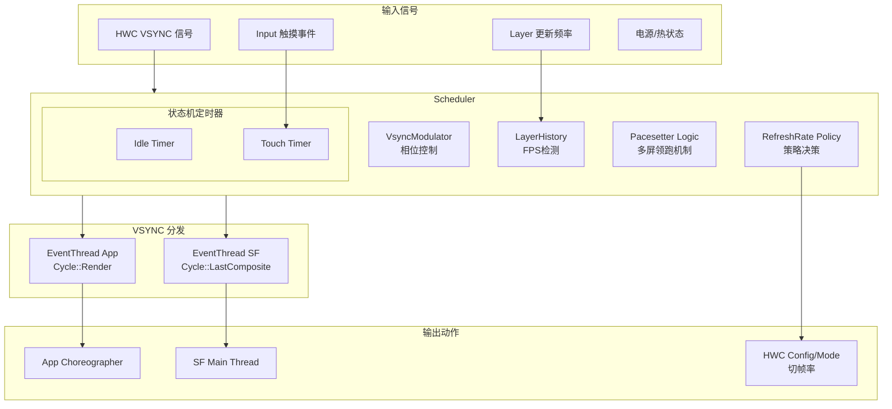


    IGraphicBufferProducer --o BufferQueue : "写入"
    BufferQueue o-- IGraphicBufferConsumer : "读取"
    

    FramebufferSurface <-- IGraphicBufferConsumer : "消费"
    
    class HWComposer {
        + setClientTarget()
    }
    FramebufferSurface ..> HWComposer : "提交"
### 核心机制详解

#### VSYNC 信号分发

Scheduler 并不直接把硬件 VSYNC 发送给所有人，而是通过 **`EventThread`** 进行解耦和分发。

* **硬件同步 (`resyncToHardwareVsync`)**: Scheduler 监听 HWC 的硬件 VSYNC，并利用内部模型计算出精确的“软件 VSYNC”时间点。这允许系统在必要时关闭硬件 VSYNC 以省电（由软件定时器模拟）。
* **双路分发**:
  * **`Cycle::Render` (App VSYNC)**: 发送给 App 的 `Choreographer`。包含一定的**相位偏移 (Phase Offset)**，让 App 在屏幕刷新之前的一段时间开始画图。
  * **`Cycle::LastComposite` (SF VSYNC)**: 发送给 SurfaceFlinger 主线程。通常晚于 App VSYNC，用于收集 App 画好的 Buffer 进行合成。


#### 智能刷新率决策 (Refresh Rate Selection)

Scheduler 维护了一套复杂的策略状态机，决定当前最佳的 Display Mode。

| 触发源 | 机制类 | 行为逻辑 |
| --- | --- | --- |
| **内容侦测** | `LayerHistory` | 记录每个 Layer 的提交时间戳，计算 FPS。<br>例如：检测到视频播放 (24/30fps)，可能调整屏幕为 60Hz 或 120Hz 以匹配倍数；检测到游戏 (High FPS)，推高刷新率。 |
| **用户交互** | `TouchTimer` | 当检测到触摸事件时，**强制 Boost** 到最高刷新率（如 120Hz），保证跟手性。触摸停止一段时间后回落。 |
| **屏幕空闲** | `IdleTimer` | 当屏幕一段时间没有 Layer 更新时，降低刷新率（如 60Hz 或更低）以省电。 |
| **系统限制** | `Thermal/Power` | 当系统过热或开启省电模式时，强制限制最高刷新率。 |

#### 多屏领跑机制 (Pacesetter)

在多屏设备中，为了防止不同刷新率的屏幕导致 VSYNC 混乱，Scheduler 引入了 **Pacesetter (领跑者)** 概念。

* **Pacesetter**: 选定一个主屏幕（通常是获焦的屏幕）。Scheduler 的主 VSYNC 节拍由该屏幕决定。
* **Followers**: 其他屏幕作为跟随者。它们的合成时机是根据 Pacesetter 的时间轴计算出来的偏移量。
* **代码体现**: `promotePacesetterDisplay`, `registerDisplayInternal`.

#### 驱动合成循环 (Frame Orchestration)

Scheduler 不仅负责发信号，还通过回调驱动每一帧的实际工作流程。

**核心函数**: `onFrameSignal(ICompositor& compositor, ...)`

```cpp
void Scheduler::onFrameSignal(...) {
    // 1. 准备阶段：计算预期时间
    beginFrameArgs = ...;
    
    // 2. 通知各 Display 的 Targeter 准备 (Layer 更新)
    pacesetter->targeterPtr->beginFrame(...);
    
    // 3. 提交事务 (Commit)
    // 处理 WindowManager 的事务，Layer 属性变化等
    compositor.commit(...);

    // 4. 执行合成 (Composite)
    // 通知 RenderEngine 进行绘图，或者通知 HWC 准备 Flip
    compositor.composite(...);
    
    // 5. 收尾
    targeter->endFrame(...);
}

```


### 关键类说明 (Glossary)

* **`Scheduler`**: 门面类，统筹全局。
* **`VsyncSchedule`**: 管理特定显示屏的 VSYNC 时间表和分发器 (`Dispatch`)。
* **`VsyncModulator`**: 动态调节 VSYNC 的相位偏移 (Phase Offsets)。例如在 App 频繁掉帧时，可能会调整偏移量给 App 更多的时间。
* **`LayerHistory`**: 历史记录器。它知道哪些 Layer 是“活跃”的，以及它们的平均帧率。
* **`EventThread`**: 一个独立的线程，通过 `BitTube` (Socket) 将 VSYNC 信号发送给跨进程的客户端 (App)。
* **`FrameTargeter`**: 负责计算每一帧的目标渲染时间点。


### 工作流时序 (Sequence Diagrams)

#### 5.1 触摸升频流程 (Touch Boost)

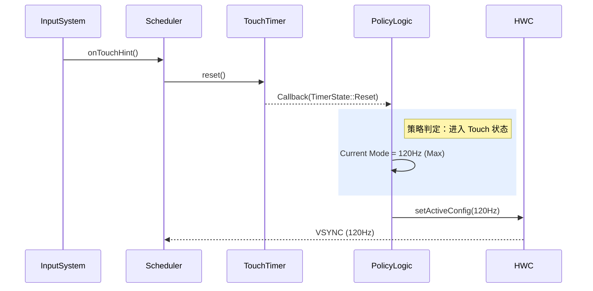

#### 帧率检测与切换 (Content Detection)

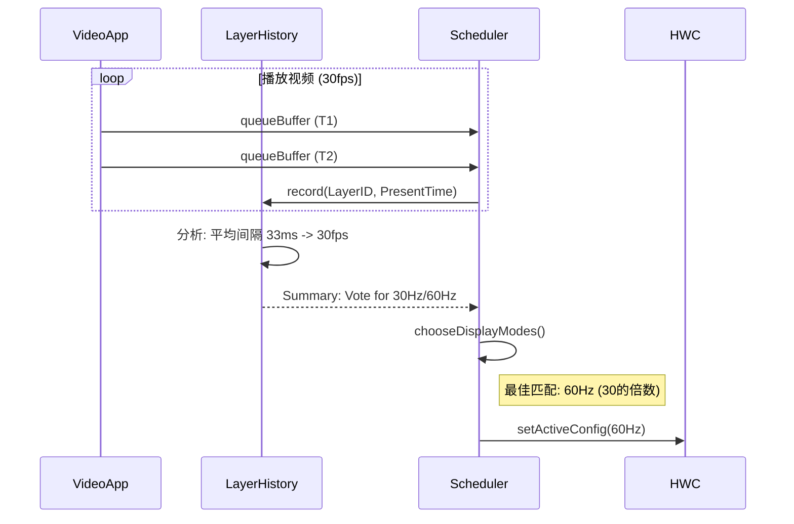

---

### 常见调试命令

在终端中可以使用 dumpsys 查看 Scheduler 的内部状态：

```bash
# 查看 SurfaceFlinger 完整信息 (包含 Scheduler)
adb shell dumpsys SurfaceFlinger

# 仅查看 Scheduler 部分 (依赖实现)
adb shell dumpsys SurfaceFlinger --section Scheduler

# 关键输出解读:
# Pacesetter Display: 当前领跑的屏幕 ID
# LayerHistory: 各个 Layer 的检测帧率
# VsyncSchedule: 当前 Vsync 的周期和偏移量

```

## HWComposer


### 架构解析

1. **HWComposer (顶层)**:
* 这是 SurfaceFlinger 进程中的单例（或主入口）。
* 它通过 `mDisplayData` 维护所有物理屏幕的状态。

2. **DisplayData & HWC2::Display**:
* `DisplayData` 是一个封装结构，持有一个 `HWC2::Display` 的指针。
* `HWC2::Display` 是一个抽象基类，定义了屏幕操作的标准接口。
* `HWC2::impl::Display` 是具体实现，它负责将屏幕操作转发给更底层的 `Composer`。


3. **Hwc2::AidlComposer (AIDL 实现层)**:
* 这是 Android 13/14 引入的基于 AIDL 的 Composer 实现（替代了旧的 HIDL）。
* 它持有一个 `AidlComposerClient`，通过 Binder 通信直接与硬件服务的 `IComposerClient` 对话。


4. **命令批处理 (Writer/Reader)**:
* 这是图中最关键的性能优化部分。
* **`ComposerClientWriter`**: SF 不会每做一个操作（比如设置 Layer 位置）就发一次 Binder 请求。相反，它把这些操作写入 `mCommands` 缓冲区（Command Buffer）。
* **`ComposerClientReader`**: 用于解析硬件返回的结果。
* 当调用 `executeCommands()` 或 `presentOrValidateDisplay()` 时，`AidlComposer` 会把 Writer 中积攒的一大包命令一次性发给硬件。


### AidlComposer 读写机制架构图

这张图重点展示了 `AidlComposer` 如何管理多显示器的 Writer 和 Reader，以及数据结构（Command vs Result）是如何在这些组件之间流转的。

**核心机制说明：**

1. **Buffered Writing (缓冲写入)**：`ComposerClientWriter` 不直接发 Binder 请求，而是将操作（如 `setLayerBuffer`）序列化为 AIDL 定义的结构体 (`DisplayCommand`, `LayerCommand`) 并缓存在内存 (`mCommands`) 中。
2. **Batch Execution (批量执行)**：`AidlComposer` 负责从 Writer 取出积攒的所有命令，通过 Binder 接口 `executeCommands` 一次性发送给HWC HAL。
3. **Result Parsing (结果解析)**：硬件服务返回 `CommandResultPayload` 列表。`AidlComposer` 将其交给 `ComposerClientReader` 进行解析，Reader 将原始数据分类存储到哈希表 (`mReturnData`) 中，供上层按需读取（如获取 Fence）。

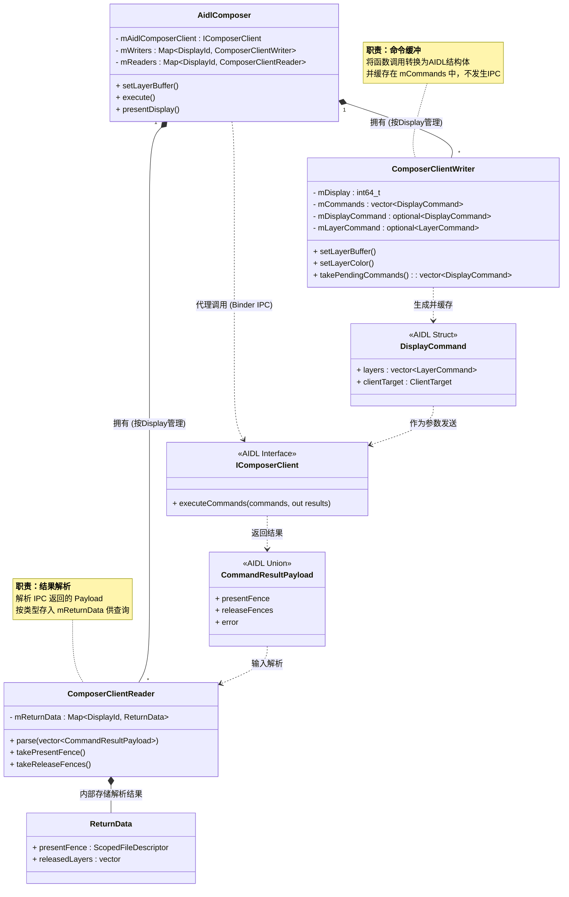

---

### 图二：AidlComposer 命令执行时序图

这张图展示了从 `HWComposer` 调用 `setLayerBuffer` 设置图层属性，到最终调用 `execute` 提交命令并获取返回值的完整流程。

**流程关键点：**

* **Phase 1 (Buffering)**: 调用 `writer->setLayerBuffer` 仅仅是在内存中操作，非常快，无 IPC。
* **Phase 2 (Extraction)**: `takePendingCommands()` 将 Writer 中的命令所有权转移出来，清空 Writer。
* **Phase 3 (IPC)**: `mAidlComposerClient->executeCommands` 是真正的跨进程调用。
* **Phase 4 (Parsing)**: `reader->parse` 将扁平的返回列表转换为结构化数据。
* **Phase 5 (Retrieval)**: `AidlComposer` 从 Reader 中取出特定的结果（如 PresentFence）。

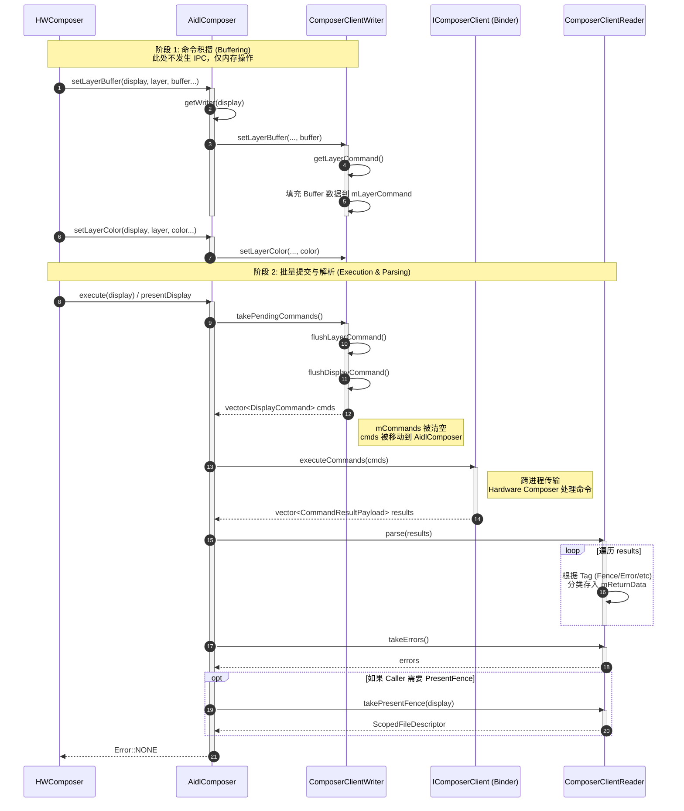
---

## 从 App 绘制到 RenderEngine 合成

### 核心误区：数据真的在“移动”吗？

很多刚接触 Android 图形系统的开发者容易产生一个误区：认为 App 画好一帧图后，系统通过 Binder 把这张巨大的图片（比如 4K 分辨率的位图）“拷贝”给了 SurfaceFlinger。

**这是完全错误的。** 如果每一帧都拷贝几 MB 的数据，手机发热和耗电将无法想象。

#### 物理本质：不动如山的共享内存

Android 图形流转的核心真相是：**数据不动，句柄（Handle）乱飞**。

请看下图，这是数据在物理内存和进程间的真实视图：

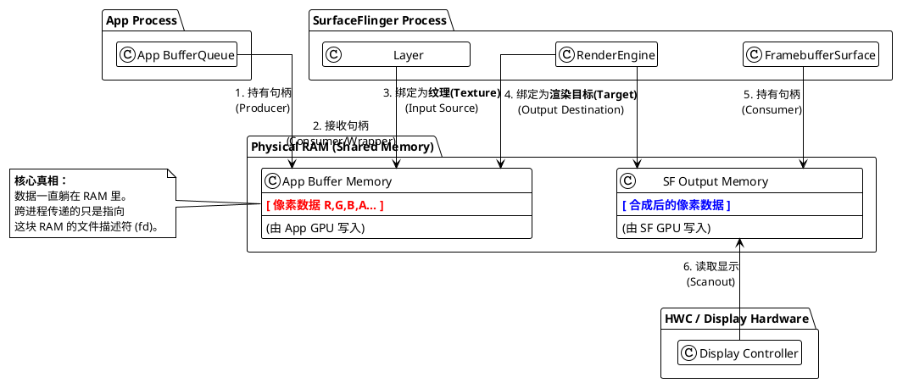

#### 流程解析

1. **App 生产**：App 请求一块 Buffer。系统在内核空间（或特定硬件内存区）分配一块**共享内存**（Shared Memory）。App 通过 OpenGL/Vulkan 将红色像素写入这块内存。
2. **句柄传递**：App 绘制完成后，并不把数据发给 SF，而是把这块内存的**文件描述符（fd）/句柄**通过 Binder 扔给 SurfaceFlinger。这就像银行保险柜，App 只是把**钥匙**给了 SF，钱（像素）还在保险柜里。
3. **SF 接收**：SurfaceFlinger 收到钥匙，在自己的进程空间里映射这块内存。
4. **SF 合成**：SurfaceFlinger 的绘图引擎（RenderEngine）读取这块内存，把它画到另一块**新的共享内存**（SF Output Memory）上。
5. **上屏**：最后，SF 把新内存的钥匙交给硬件控制器（HWC），屏幕亮起。

---

### 逻辑视图：RenderEngine 的合成魔法

对于熟悉 OpenGL ES 的说，SurfaceFlinger 的合成过程其实非常容易理解：**它就是一个标准的纹理绘制过程（Draw Call）。**

在 `RenderEngine` 的视角里，没有“图层（Layer）”的概念，只有 **纹理（Texture）** 和 **帧缓冲区（Framebuffer）**。

#### 术语对齐

| SurfaceFlinger 概念 | OpenGL ES 对应概念 | 说明 |
| --- | --- | --- |
| **Layer Buffer** | `GL_TEXTURE_2D` / `GL_TEXTURE_EXTERNAL_OES` | App 生产的画面，对于 SF 来说就是一张张贴图素材。 |
| **FramebufferSurface** | `GL_FRAMEBUFFER` (FBO) / Render Target | SF 的画板。GPU 最终把画好的像素写到这里。 |
| **drawLayers()** | `glDrawArrays()` / `glDrawElements()` | 执行 Shader 程序，把纹理画到 FBO 上。 |

#### 合成流水线图解

请看下图，这是 GPU 内部发生的事情：

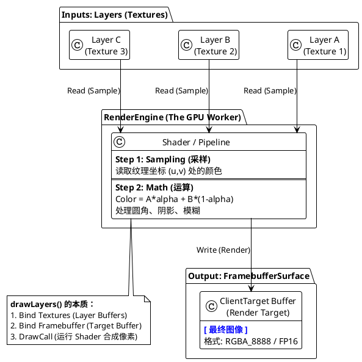

#### 关键步骤详解

1. **绑定输入 (Bind Textures)**：
RenderEngine 拿到 Layer A, B, C 的 Buffer 句柄，调用 EGL API 将其绑定为 OpenGL 纹理。
> *注意：这里不需要 CPU 读取像素，GPU 直接通过 DMA 从共享内存中采样。*


2. **运行 Shader (The Math)**：
SF 并不只是简单的“叠加”。RenderEngine 会生成一个 Shader 程序，处理复杂的数学运算：
* **Alpha 混合**：根据 Layer 的透明度，计算 `SrcColor * Alpha + DstColor * (1 - Alpha)`。
* **几何变换**：如果 Layer 被缩放或旋转了，Vertex Shader 会修改坐标矩阵。
* **特效处理**：圆角（Rounded Corner）、背景模糊（Blur）、阴影（Shadow）本质上都是 Shader 里的数学计算。


3. **输出结果 (Render Target)**：
Fragment Shader 计算出的最终颜色值，被写入到 **FramebufferSurface** 提供的 Buffer 中。
* 这个 Buffer 本质上也是一块 GraphicBuffer（共享内存）。
* 它是 SurfaceFlinger 这一帧工作的**最终产物**。


### 总结

作为 OpenGL ES 的开发者，只需要记住这一句话：

> **SurfaceFlinger 的 GPU 合成（Client Composition），本质上就是把 App 生产的 GraphicBuffer 当作纹理（Texture），在一个巨大的 FBO 上画了一次 Quad（四边形），最终生成的 Texture 交给了屏幕控制器。**

* **数据**：从未离开过共享内存。
* **传递**：传的是文件句柄。
* **合成**：就是跑了一遍 Shader。


