+++
date = '2025-09-29T10:22:54+08:00'
draft = false
title = 'Android SurfaceFlinger 深度解析'
+++

SurfaceFlinger 是 Android 图形栈的核心系统服务，负责全系统的图形合成与显示管理。本文基于 Android 源码，深入剖析其从 Display 创建、Layer 状态管理、合成策略决策到 RenderEngine 渲染执行及 HWC 提交的完整技术链路。

## 1. Display 创建过程

在 SurfaceFlinger 中，`Display` 是物理屏幕（由 HWC 管理）或虚拟屏幕（由系统服务请求创建）的抽象实体。Display 的创建是一个异步且多阶段的过程，涉及内核事件响应、状态机更新及渲染资源的初始化。

### 1.1 核心流程时序解析

下图展示了从触发源（硬件热插拔或服务请求）到 SurfaceFlinger 内部对象初始化的完整调用时序。

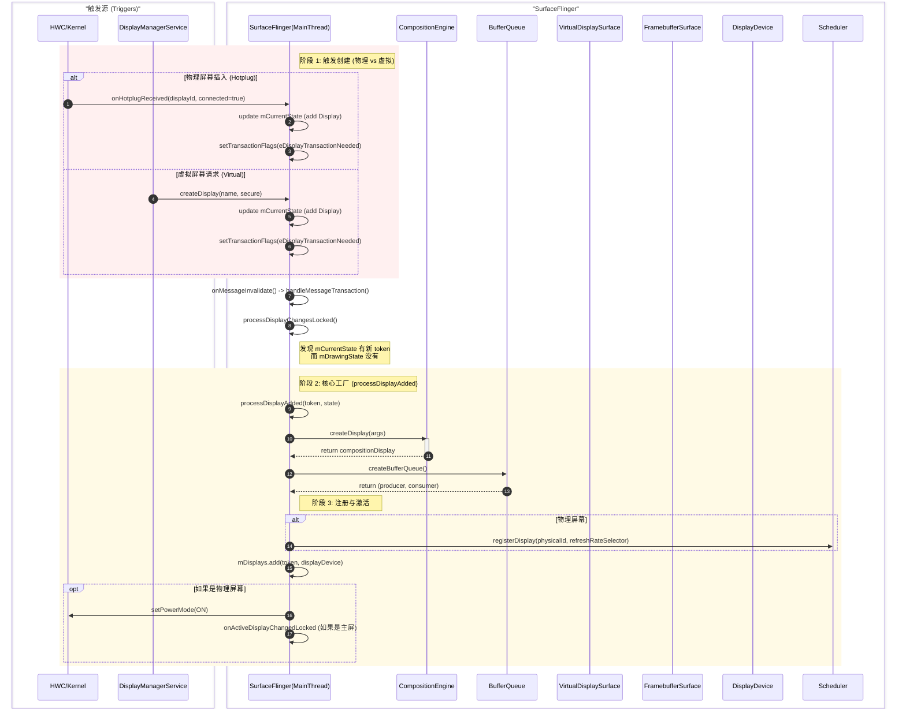

**技术实现细节：**

1. **事件触发与状态标记**：
* **物理屏幕**：`HWComposer` 收到内核的 Hotplug 事件，回调 `onHotplugReceived`。SF 将新的 Display 信息添加到 `mCurrentState.displays` 中，并调用 `setTransactionFlags(eDisplayTransactionNeeded)`，请求在主线程下一次遍历时处理。
* **虚拟屏幕**：`DisplayManagerService` 通过 Binder 调用 `createDisplay`，同样更新 `mCurrentState` 并设置标志位。

2. **状态提交与差异比对**：
* SF 主线程在 `handleMessageTransaction` 中调用 `processDisplayChangesLocked`。
* 逻辑核心在于比对 `mCurrentState`（最新状态）与 `mDrawingState`（上一帧绘制状态）。若发现 `mCurrentState` 中存在新的 Display Token，则判定为新增屏幕，调用 `processDisplayAdded`。

3. **核心对象构建 (`processDisplayAdded`)**：
* **CompositionEngine::Display**：调用 `getCompositionEngine().createDisplay` 创建合成引擎侧的 Display 抽象，用于管理 OutputLayer 和合成状态。
* **BufferQueue**：创建图形缓冲区队列，用于 SF 的 GPU 合成结果输出。
* **DisplayDevice**：根据屏幕类型创建具体的设备抽象。
* **物理屏幕**：创建 `FramebufferSurface` 作为 BufferQueue 的消费者，直接对接 HWC。
* **虚拟屏幕**：创建 `VirtualDisplaySurface`，通常对接媒体编解码器或 WiFi Display。

* **Scheduler 注册**：如果是物理屏幕，将其注册到 Scheduler，以便该屏幕能接收 VSYNC 信号并参与刷新率策略决策。

---

## 2. Layer 管理与渲染架构

Layer 是 SurfaceFlinger 进行图形管理和合成的基本单元。现代 Android 架构中，Layer 的设计强调了状态的隔离与流水线处理。

### 2.1 Layer 核心架构类图

下图展示了 SurfaceFlinger 核心对象、CompositionEngine 以及硬件层之间的静态关系，明确了 Layer 在不同模块中的形态。

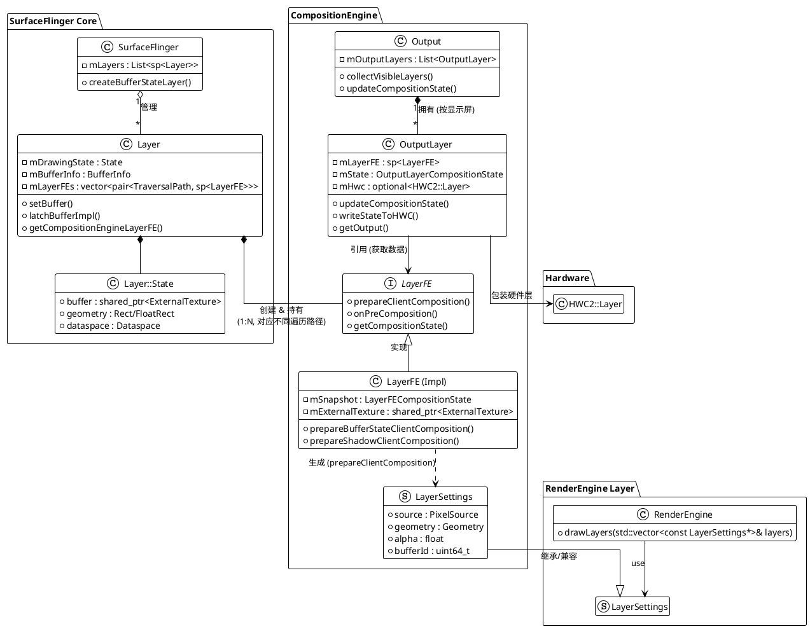

**组件职责与实现：**

1. **`Layer` (SurfaceFlinger)**：
* **BufferState 管理**：实现了 BufferStateLayer 模式。通过 `setBuffer` 接收应用提交的 BufferData，更新 `mDrawingState`。
* **Latch 机制**：在 VSYNC 到达时，`latchBufferImpl` 将 `mDrawingState` 中的 Buffer 和属性移动到 `mBufferInfo`，确立当前帧的显示内容。
* **LayerFE 工厂**：负责创建并持有 `LayerFE` 实例，建立与 CompositionEngine 的连接。

2. **`LayerFE` (Front End)**：
* **快照隔离**：LayerFE 充当 Layer 的快照代理。当 `latchBuffer` 发生时，Layer 的状态被复制到 LayerFE 的 `LayerFECompositionState` (`mSnapshot`) 中。
* **并发安全**：CompositionEngine 在合成过程中只读取 LayerFE 的快照数据，从而允许 SF 主线程在不阻塞合成的情况下处理下一帧的 Layer 属性更新。

3. **`OutputLayer` (CompositionEngine)**：
* **Output 关联**：一个 Layer 可能显示在多个屏幕上（如镜像）。`OutputLayer` 将 `LayerFE` 的数据映射到具体的 `Display` 坐标系中，计算裁剪、投影和 Z-Order。
* **HWC 桥接**：持有 `HWC2::Layer` 指针，负责将图层属性写入硬件合成器。

---

## 3. Display 图像合成流程

图像合成是将所有 OutputLayer 的内容按照 Z-Order 叠加并输出到显示缓冲区的过程。该过程是一个由 VSYNC 驱动的闭环。

### 3.1 数据流与合成路径选择

下图展示了 Buffer 从 App 生产到最终显示的物理流转路径，以及基于 RenderEngine 和 HWC 的分流机制。

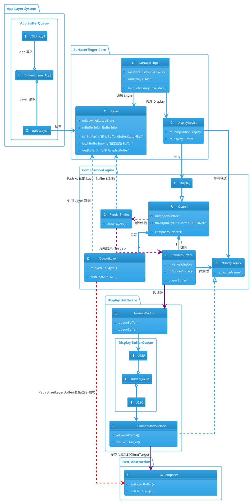

**技术路径详解：**

1. **路径 A：GPU 合成 (Client Composition)**（紫色路径）
* **触发条件**：HWC 无法处理的 Layer（如超出图层数量限制、不支持的混合模式、复杂的圆角/模糊特效）。
* **输入**：`Output` 将这些 Layer 标记为 `Client`，提取其 Buffer 句柄作为**纹理**。
* **处理**：`RenderEngine` 使用 OpenGL/Skia 对纹理进行采样和片段着色。
* **输出**：渲染结果写入 `RenderSurface` 申请的 `GraphicBuffer`。该 Buffer 入队后，由 `FramebufferSurface` 消费，并作为 **ClientTarget** 提交给 HWC。

2. **路径 B：HWC 合成 (Device Composition)**（红色路径）
* **触发条件**：标准的 Overlay 图层，硬件直接支持。
* **处理**：`OutputLayer` 通过 `writeStateToHWC`，将 Layer 的 Buffer 句柄、屏幕坐标、裁切区域直接配置给 `HWComposer`。
* **输出**：无中间 Buffer 生成。显示控制器（Display Controller）在扫描输出时，利用 DMA 直接读取 App 的 Buffer 内存进行叠加。

### 3.2 完整的合成时序

整个合成周期分为调度、锁定、策略决策、执行与上屏四个阶段。

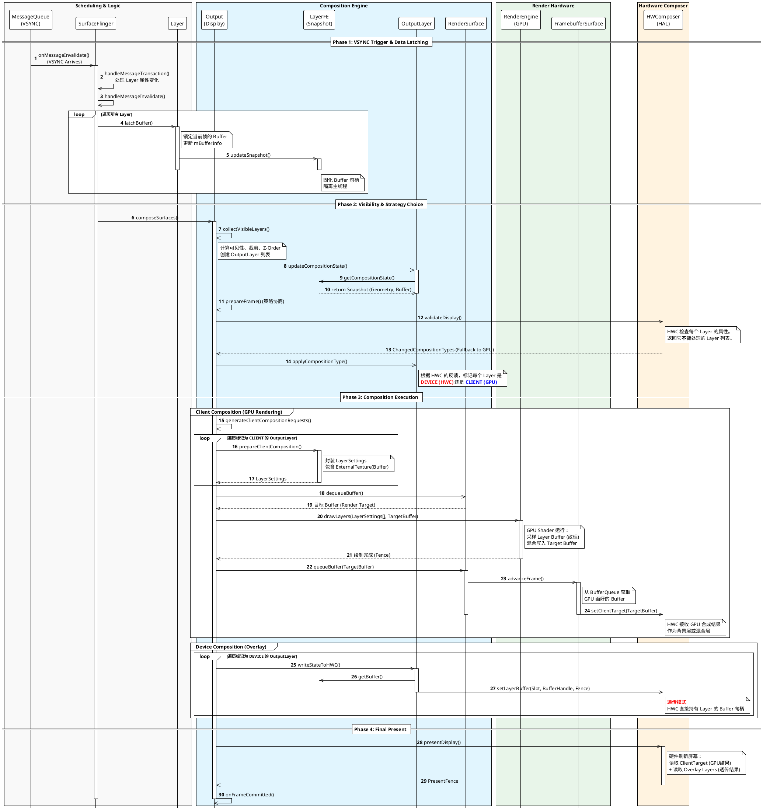

---

## 4. 深入 RenderEngine：GPU 合成详解

RenderEngine 是 SurfaceFlinger 的渲染后端，负责执行所有 Client Composition 任务。它屏蔽了底层 OpenGL ES / Vulkan 的 API 差异，提供面向图层的绘制接口。

### 4.1 RenderEngine 架构概览

RenderEngine 采用了分层与装饰器模式设计，包含接口定义、线程模型、逻辑实现与后端驱动。

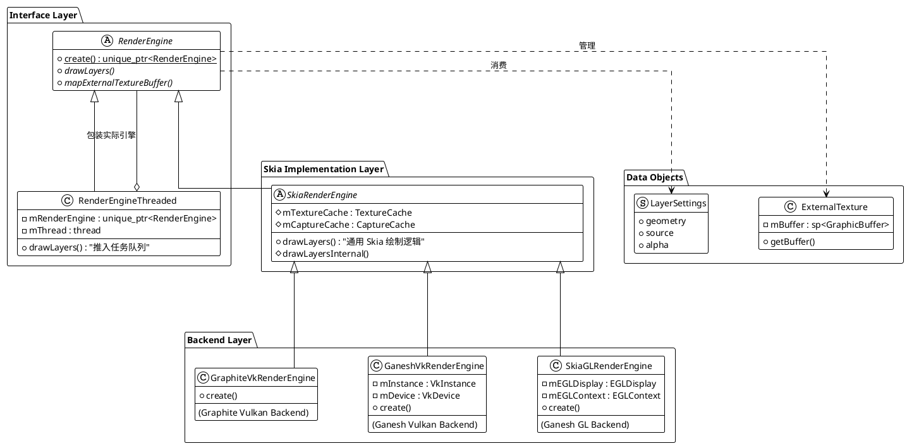

**关键组件实现原理：**

* **RenderEngineThreaded (Threading)**：这是一个装饰器类，用于实现**单线程异步渲染**。它内部维护一个命令队列（`mFunctionCalls`）和一个后台工作线程（`mThread`）。当外部调用 `drawLayers` 时，它将调用参数封装为 Lambda 表达式推入队列，并立即返回 `std::future`。这确保了 SurfaceFlinger 主线程不会被耗时的 GPU 提交（`flush/submit`）操作阻塞。
* **SkiaRenderEngine (Core Logic)**：这是业务逻辑的核心。它负责将 SurfaceFlinger 的 `LayerSettings`（包含几何、特效、Buffer）翻译成 Skia 的 `SkCanvas` 绘图指令。例如，它将 `LayerSettings.geometry.positionTransform` 转换为 `canvas->concat(matrix)`，将圆角参数转换为 `canvas->drawRRect()`。
* **SkiaGLRenderEngine (GL Backend)**：负责管理 EGL 上下文。在初始化时，它创建 EGLDisplay 和 EGLContext，并将原生的 GL 环境封装成 Skia 的 `GrDirectContext`，注入到 `SkiaRenderEngine` 中，使其具备操作 GPU 的能力。

### 4.2 物理数据流与内存视图

在 RenderEngine 的合成过程中，数据并未发生拷贝，而是以句柄（Handle）形式在进程间和模块间流转。

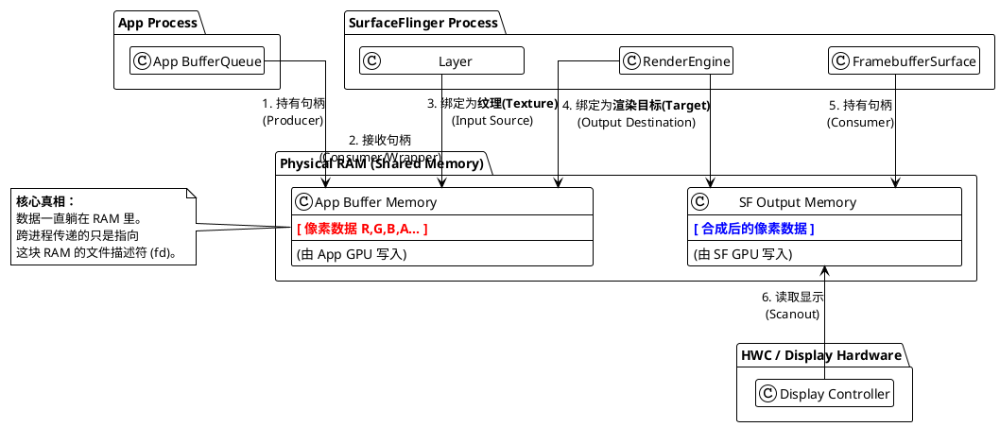

### 4.3 逻辑工作流：Draw Call 视图

RenderEngine 将物理 Buffer 抽象为纹理，将合成过程转化为一次标准的 GPU 渲染流程。

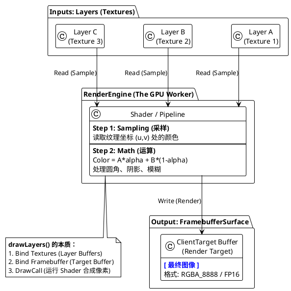

**实现细节：**

1. **绑定输入**：`SkiaRenderEngine::mapExternalTextureBuffer` 将 Layer 的 Buffer 映射为 `SkiaBackendTexture`。
2. **绑定输出**：将 FramebufferSurface 提供的 Buffer 封装为 `SkSurface`，作为渲染画布。
3. **指令生成**：根据 `LayerSettings`，通过 `SkCanvas` 发出 `drawImageRect` 等指令。
4. **Shader 执行**：`flushAndSubmit` 触发 Skia 将高级指令转换为 GL/VK 命令流，GPU 运行 Shader 执行像素混合和特效计算。

### 4.4 RenderEngine 异步调用时序

下图展示了 `RenderEngineThreaded` 如何通过任务队列实现异步渲染。

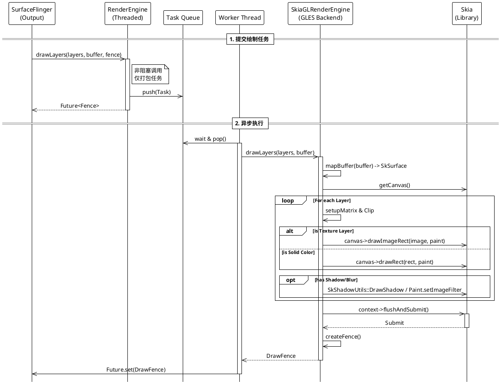

---

## 5. Scheduler 与 VSYNC 调度

Scheduler 是 SurfaceFlinger 的时间基准控制中心，负责生成 VSYNC 信号、分发事件以及根据系统状态动态调整刷新率。

### 5.1 Scheduler 核心架构

Scheduler 位于 HWC 硬件信号与上层逻辑之间，起到解耦和策略控制的作用。

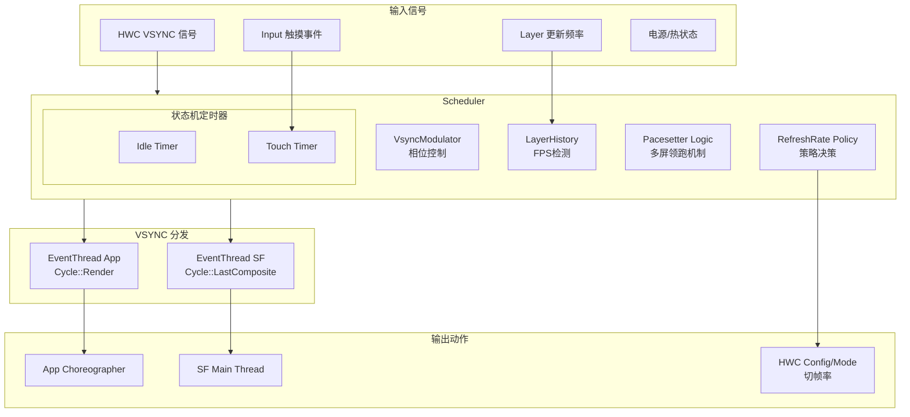

**关键组件机制：**

* **VsyncModulator**：根据系统负载动态调整 App VSYNC 和 SF VSYNC 的相位偏移（Offset）。例如，当系统掉帧时，减小偏移量以给予 CPU/GPU 更多处理时间。
* **LayerHistory**：记录每个 Layer 的提交时间戳，计算其平均帧率。这是内容自适应刷新率（Content Detection）的基础。
* **Pacesetter**：在多屏设备中，选定一个主屏作为时间基准，其他屏幕的 VSYNC 基于主屏时钟进行偏移生成，防止节奏混乱。

### 5.2 智能刷新率决策流程

**场景一：触摸升频 (Touch Boost)**
为了保证交互的跟手性，当 Input 系统检测到触摸时，Scheduler 会强制将屏幕刷新率提升至最高。

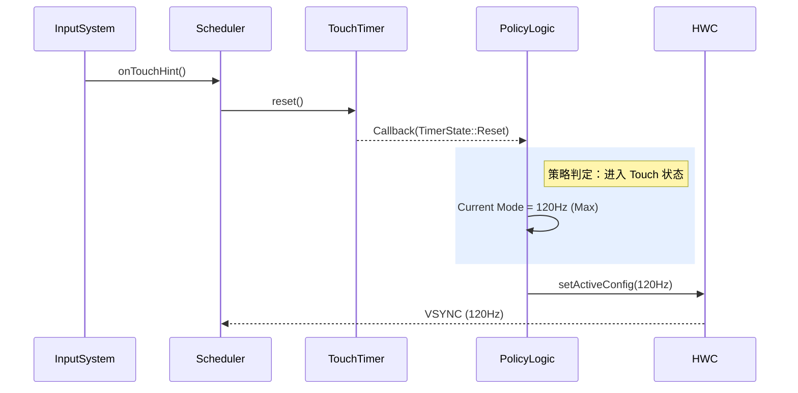

**场景二：内容帧率匹配 (Content Detection)**
当播放 30fps 视频时，`LayerHistory` 检测到 Buffer 提交间隔稳定在 33ms，Scheduler 会选择 60Hz 或 30Hz 的显示模式以避免画面抖动（Judder）。

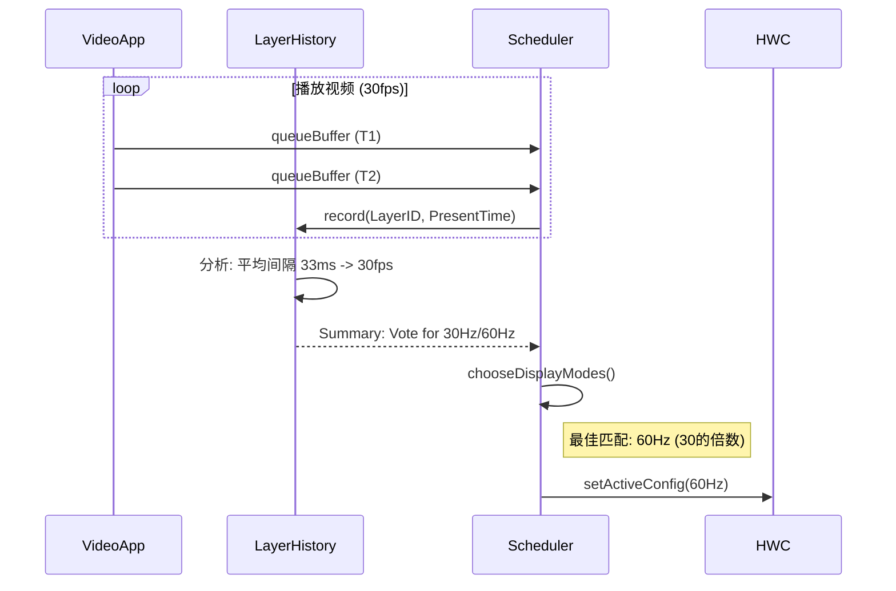

---

## 6. HWComposer 硬件抽象与通信

HWComposer (HWC) 是 SurfaceFlinger 与底层显示驱动交互的 AIDL 接口。为了减少 Binder IPC 通信的开销，HWC 引入了复杂的命令缓冲机制。

### 6.1 HWComposer 架构设计

下图展示了 HWComposer 的层级结构，从顶层的单例管理到底层 AIDL 接口的代理。

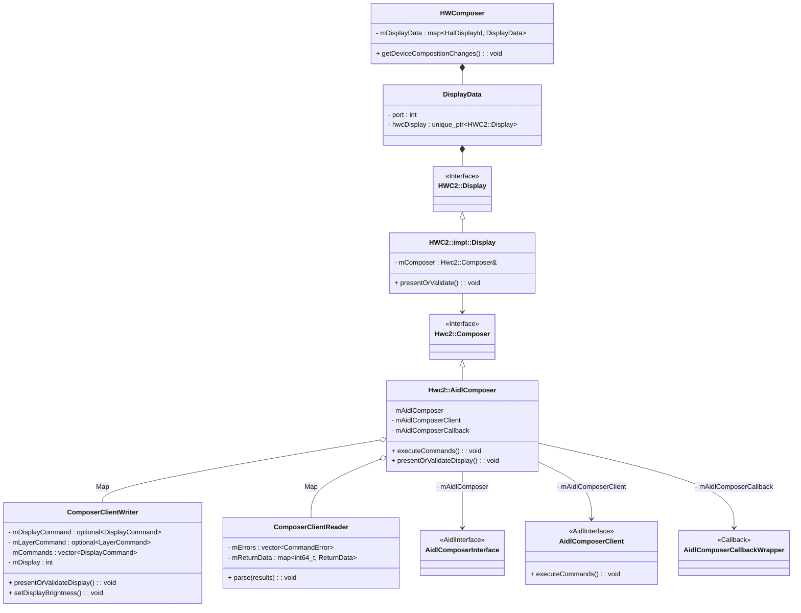

### 6.2 命令批处理机制 (Batching)

`AidlComposer` 并不直接发起 IPC 调用。它维护了每个 Display 对应的 `ComposerClientWriter`。当 SurfaceFlinger 调用 `setLayerBuffer` 或 `setLayerColor` 等接口时，这些操作被序列化为 AIDL 定义的结构体（`DisplayCommand`）并缓存在 `mCommands` 内存缓冲区中。

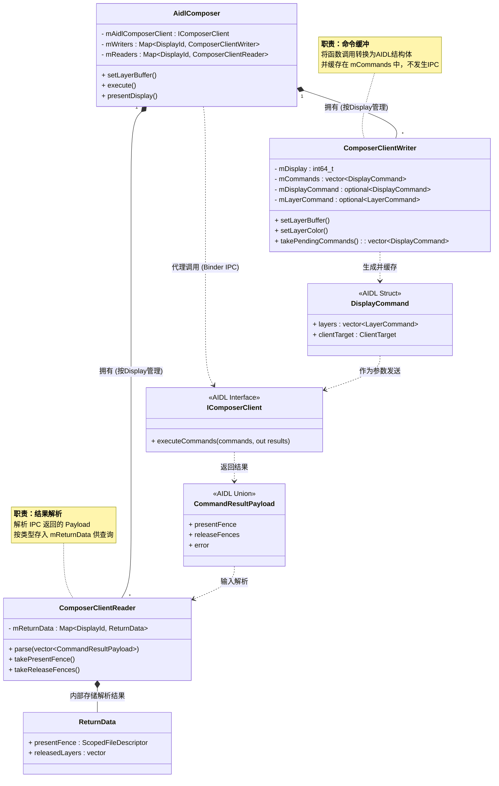

### 6.3 HWC 交互时序

只有当调用 `execute()` 或 `presentOrValidateDisplay()` 时，`AidlComposer` 才会将缓冲区中的所有命令打包，通过 `IComposerClient::executeCommands` 发起一次 Binder 调用，并将返回结果交给 `ComposerClientReader` 解析。

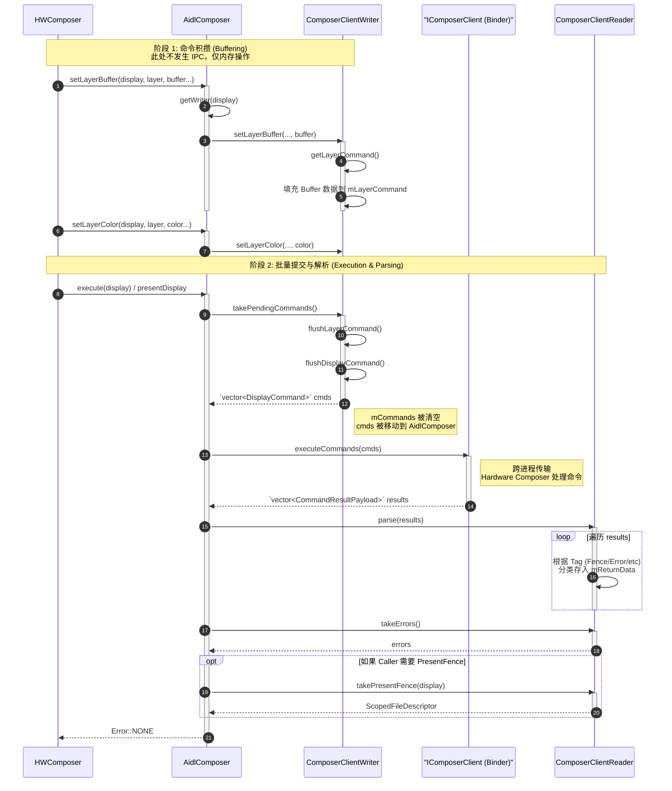