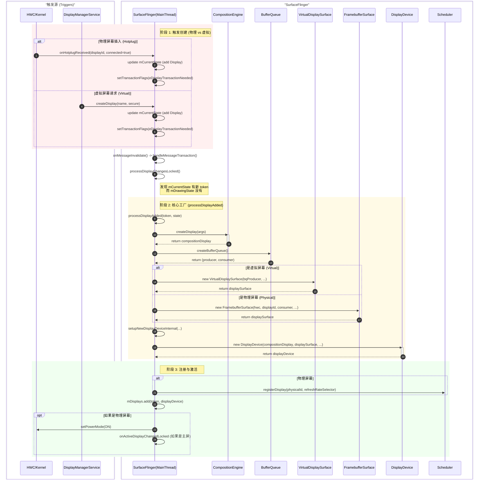
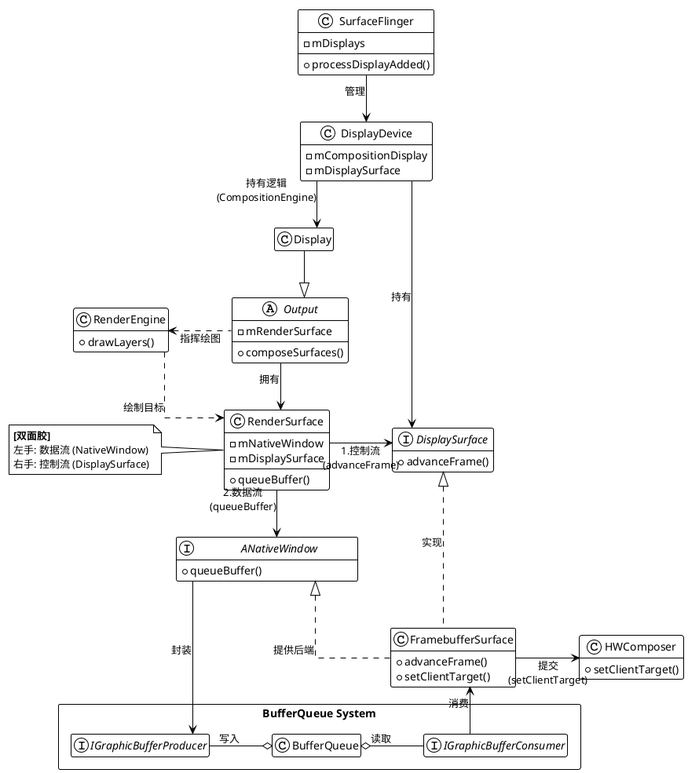
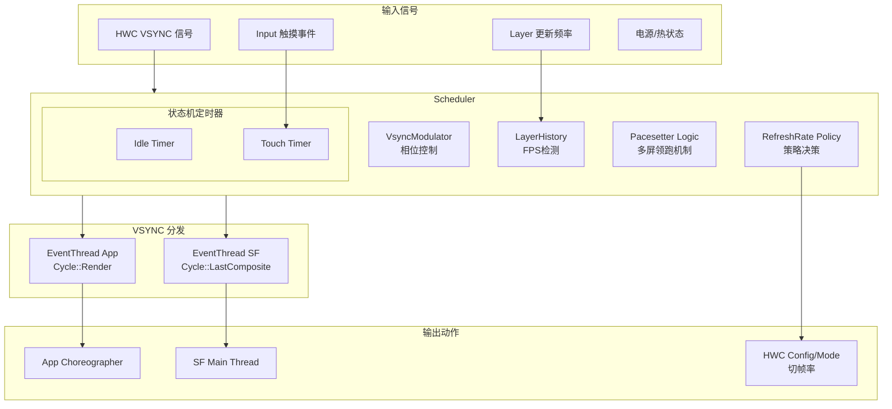
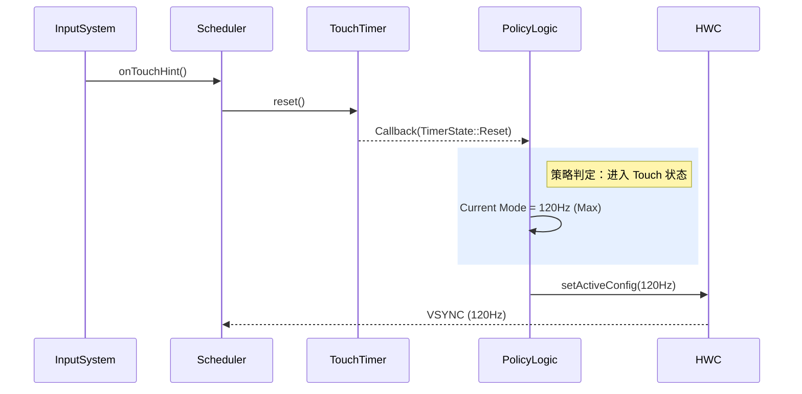
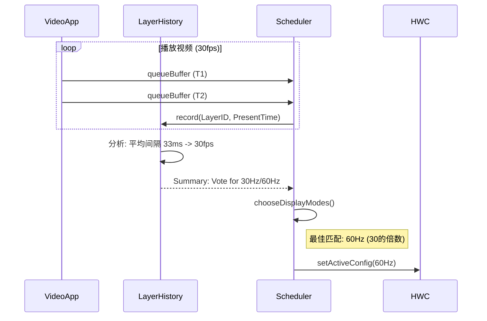

## Display创建过程



## Display的管理



总结数据流向
```txt
[RenderEngine] 
      | (绘制 GPU 合成部分)
      v
[IGraphicBufferProducer] --> [BufferQueue] --> [IGraphicBufferConsumer]
                                                      |
                                                      v
                                             [FramebufferSurface]
                                                      | (setClientTarget)
                                                      v
                                                [HWComposer] --> [物理屏幕]
```

---

## Scheduler

**Scheduler** 是 SurfaceFlinger 的核心组件，充当图形渲染系统的**“指挥家”**和**“节拍器”**。它的主要职责是管理系统的时间基准（Timing）和刷新率策略。

它负责解决两个核心问题：

1. **When to draw (时机)**：生成和分发 VSYNC 信号，驱动 App 渲染和 SF 合成。
2. **How fast to draw (频率)**：根据内容、交互和热状态，动态调整显示屏的刷新率（60Hz, 90Hz, 120Hz 等），以平衡流畅度与功耗。

### 核心架构图 (Architecture)

Scheduler 处于 HWC（硬件层）与 App/SF（逻辑层）的中间，负责协调上下游。




    IGraphicBufferProducer --o BufferQueue : "写入"
    BufferQueue o-- IGraphicBufferConsumer : "读取"
    

    FramebufferSurface <-- IGraphicBufferConsumer : "消费"
    
    class HWComposer {
        + setClientTarget()
    }
    FramebufferSurface ..> HWComposer : "提交"
### 核心机制详解

#### VSYNC 信号分发

Scheduler 并不直接把硬件 VSYNC 发送给所有人，而是通过 **`EventThread`** 进行解耦和分发。

* **硬件同步 (`resyncToHardwareVsync`)**: Scheduler 监听 HWC 的硬件 VSYNC，并利用内部模型计算出精确的“软件 VSYNC”时间点。这允许系统在必要时关闭硬件 VSYNC 以省电（由软件定时器模拟）。
* **双路分发**:
  * **`Cycle::Render` (App VSYNC)**: 发送给 App 的 `Choreographer`。包含一定的**相位偏移 (Phase Offset)**，让 App 在屏幕刷新之前的一段时间开始画图。
  * **`Cycle::LastComposite` (SF VSYNC)**: 发送给 SurfaceFlinger 主线程。通常晚于 App VSYNC，用于收集 App 画好的 Buffer 进行合成。


#### 智能刷新率决策 (Refresh Rate Selection)

Scheduler 维护了一套复杂的策略状态机，决定当前最佳的 Display Mode。

| 触发源 | 机制类 | 行为逻辑 |
| --- | --- | --- |
| **内容侦测** | `LayerHistory` | 记录每个 Layer 的提交时间戳，计算 FPS。<br>例如：检测到视频播放 (24/30fps)，可能调整屏幕为 60Hz 或 120Hz 以匹配倍数；检测到游戏 (High FPS)，推高刷新率。 |
| **用户交互** | `TouchTimer` | 当检测到触摸事件时，**强制 Boost** 到最高刷新率（如 120Hz），保证跟手性。触摸停止一段时间后回落。 |
| **屏幕空闲** | `IdleTimer` | 当屏幕一段时间没有 Layer 更新时，降低刷新率（如 60Hz 或更低）以省电。 |
| **系统限制** | `Thermal/Power` | 当系统过热或开启省电模式时，强制限制最高刷新率。 |

#### 多屏领跑机制 (Pacesetter)

在多屏设备中，为了防止不同刷新率的屏幕导致 VSYNC 混乱，Scheduler 引入了 **Pacesetter (领跑者)** 概念。

* **Pacesetter**: 选定一个主屏幕（通常是获焦的屏幕）。Scheduler 的主 VSYNC 节拍由该屏幕决定。
* **Followers**: 其他屏幕作为跟随者。它们的合成时机是根据 Pacesetter 的时间轴计算出来的偏移量。
* **代码体现**: `promotePacesetterDisplay`, `registerDisplayInternal`.

#### 驱动合成循环 (Frame Orchestration)

Scheduler 不仅负责发信号，还通过回调驱动每一帧的实际工作流程。

**核心函数**: `onFrameSignal(ICompositor& compositor, ...)`

```cpp
void Scheduler::onFrameSignal(...) {
    // 1. 准备阶段：计算预期时间
    beginFrameArgs = ...;
    
    // 2. 通知各 Display 的 Targeter 准备 (Layer 更新)
    pacesetter->targeterPtr->beginFrame(...);
    
    // 3. 提交事务 (Commit)
    // 处理 WindowManager 的事务，Layer 属性变化等
    compositor.commit(...);

    // 4. 执行合成 (Composite)
    // 通知 RenderEngine 进行绘图，或者通知 HWC 准备 Flip
    compositor.composite(...);
    
    // 5. 收尾
    targeter->endFrame(...);
}

```


### 关键类说明 (Glossary)

* **`Scheduler`**: 门面类，统筹全局。
* **`VsyncSchedule`**: 管理特定显示屏的 VSYNC 时间表和分发器 (`Dispatch`)。
* **`VsyncModulator`**: 动态调节 VSYNC 的相位偏移 (Phase Offsets)。例如在 App 频繁掉帧时，可能会调整偏移量给 App 更多的时间。
* **`LayerHistory`**: 历史记录器。它知道哪些 Layer 是“活跃”的，以及它们的平均帧率。
* **`EventThread`**: 一个独立的线程，通过 `BitTube` (Socket) 将 VSYNC 信号发送给跨进程的客户端 (App)。
* **`FrameTargeter`**: 负责计算每一帧的目标渲染时间点。


### 工作流时序 (Sequence Diagrams)

#### 5.1 触摸升频流程 (Touch Boost)



#### 帧率检测与切换 (Content Detection)



---

### 常见调试命令

在终端中可以使用 dumpsys 查看 Scheduler 的内部状态：

```bash
# 查看 SurfaceFlinger 完整信息 (包含 Scheduler)
adb shell dumpsys SurfaceFlinger

# 仅查看 Scheduler 部分 (依赖实现)
adb shell dumpsys SurfaceFlinger --section Scheduler

# 关键输出解读:
# Pacesetter Display: 当前领跑的屏幕 ID
# LayerHistory: 各个 Layer 的检测帧率
# VsyncSchedule: 当前 Vsync 的周期和偏移量

```
