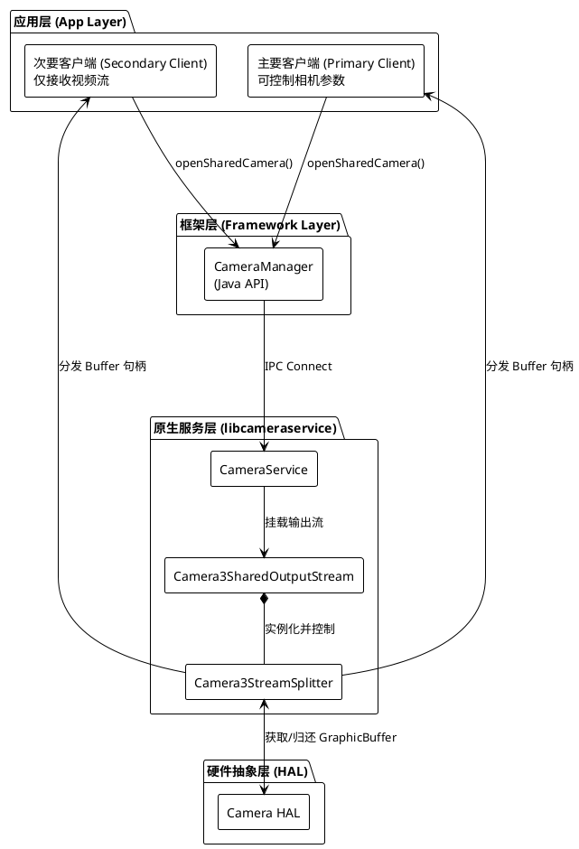
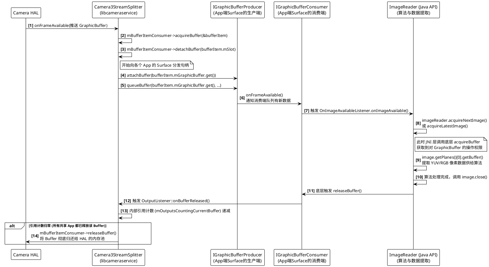

+++
date = '2025-08-08T11:36:11+08:00'
draft = false
title = 'Android Automotive Shared Camera (多客户端摄像头) 机制'
+++

## 1. 需求背景

在现代智能座舱架构中，单颗物理摄像头往往需要并发服务于多个业务场景。例如，舱内摄像头（In-cabin Camera）通常需要将视频流实时提供给后台的 DMS（驾驶员监测系统）算法进程进行疲劳状态追踪，同时可能还需要赋能 OMS（乘员监测系统）进行座舱行为识别；而在特定的座舱交互中，该摄像头还需要将画面投射到中控屏，供用户进行流畅的视频通话，或是捕捉高质量的车内多人合影。

传统的 Android Camera API 采用排他性设计，同一时间仅允许一个应用独占摄像头硬件资源。若通过应用层（如使用 AIDL、Socket 或共享内存）手动转发视频流，会面临以下挑战：

* **高系统开销**：显存拷贝带宽大，增加 CPU 和 GPU 负载。
* **高延迟**：链路过长，无法满足安全监控的实时性要求。
* **并发冲突**：高优先级的系统应用会强制驱逐低优先级的应用，导致后台任务（如算法推理）意外中断。

Shared Camera 机制通过在 Android Camera Service 层引入底层的零拷贝（Zero-copy）流分发代理，解决了上述资源竞争与性能瓶颈。

---

## 2. 软件架构

Shared Camera 机制的核心思想是将“一对一”的硬件绑定，解耦为“一对多”的句柄分发。底层的 `libcameraservice` 充当了数据流的“路由器”。

**关键组件说明：**

* **CameraManager & Java API**：暴露了系统级 API（`openSharedCamera`）。客户端被明确划分为 Primary（主）和 Secondary（从）角色。Primary 拥有硬件参数控制权，Secondary 仅拥有数据流接收权。
* **Camera3SharedOutputStream**：专为多客户端定制的输出流管道。它负责解析静态配置文件，并收集、管理所有接入此摄像头的客户端 Surface。
* **Camera3StreamSplitter**：核心分发引擎。它对 HAL 层伪装成单一消费者，对上层各 App 伪装成生产者，通过句柄共享而非内存拷贝来实现流的分发。

---

## 3. 关键时序

这是一个基于 AOSP 源码，以 `ImageReader`（用于算法处理与数据提取）为例的时序图。

图中详细展示了从底层 `Camera3StreamSplitter` 分发句柄，到 Java 层 `ImageReader` 消费并最终安全释放 GraphicBuffer 的完整代码调用链路。

### 细节解析

* **分发准备阶段 (`acquireBuffer` & `detachBuffer`)**
当 HAL 层通过回调通知有新帧到达时，`Camera3StreamSplitter` 首先作为消费者，从输入队列中获取（`acquire`）这块 Buffer。紧接着调用 `detachBuffer`，将这块物理内存从原有的单一输入队列中“解绑”，以便 Splitter 接管它的绝对生命周期控制权。
* **句柄传递阶段 (`attachBuffer` & `queueBuffer`)**
Splitter 遍历其内部注册的各个客户端 Surface。它调用 App 端 Surface 底层对应的 `IGraphicBufferProducer` 接口。`attachBuffer` 负责将 GraphicBuffer 的句柄（包含文件描述符 FD）注册到 App 的缓冲队列中，而 `queueBuffer` 则正式将该帧推入队列，此时**没有发生任何内存数据的拷贝**。
* **应用层唤醒与数据提取 (`onImageAvailable` & `acquireNextImage`)**
队列收到数据后，底层机制会跨进程唤醒 App，最终在 Java 层触发您在 `ImageReader` 中注册的 `OnImageAvailableListener`。App 调用 `acquireNextImage()` 时，框架层会锁定这块跨进程共享的内存，并将其封装为 `Image` 对象。随后通过 `getPlanes()[0].getBuffer()` 即可获取直接指向物理内存的 `ByteBuffer`，供智能座舱的视觉算法（如 DMS 疲劳检测）读取。
* **安全释放闭环 (`image.close()` & `onBufferReleased`)**
算法读取完数据后，**必须**显式调用 `image.close()`。这个 Java 层的方法调用会深入到 Native 层，对 `IGraphicBufferConsumer` 执行 `releaseBuffer`。由于 Splitter 在分发时注册了 `OutputListener`，它会立刻收到释放信号并将内部的引用计数减一。只有当参与共享的多个客户端（例如既有跑算法的 ImageReader，又有用于预览的 SurfaceView）都执行了释放操作，引用计数才会归零，Splitter 才会将这块昂贵的显存交还给 Camera HAL 进行下一轮曝光采集。

---

## 4. 配置与约束

### 静态配置要求

共享模式高度依赖于预设的系统配置。配置文件位于 `/system_ext/etc/shared_session_config.xml`。
所有参与共享的应用在创建 Capture Session 时，请求的 `Surface` 宽、高和像素格式必须与 XML 文件中的 `OutputConfiguration` 完全匹配，否则连接将被拒绝。

### 核心约束与风险

* **慢客户端效应 (Slow Consumer)**：由于 Splitter 采用严格的引用计数机制，如果某一次要客户端（如发生死锁的后台算法）迟迟不释放 Buffer，会导致 HAL 层的可用 Buffer 耗尽。这会引发级联阻塞，导致主要客户端同样发生画面卡顿。
* **权限管控**：`openSharedCamera` 属于 `@SystemApi`，需要 `android.permission.CAMERA` 权限，通常仅限预置在 `priv-app` 目录下的系统应用调用。
* **高级功能受限**：共享模式下不支持高速录像（High-speed sessions）、多帧连拍（Burst capture）以及离线会话等独占性强的高级相机功能。

---

## 5. 与 EVS 的对比

在车载环境中，Extended View System (EVS) 和 Android Camera Service (ACS) 是两条并行的相机技术栈。了解两者的区别对于架构选型至关重要。

| 维度 | Shared Camera (ACS) | EVS Manager 多客户端 |
| --- | --- | --- |
| 系统层级 | Android Framework 层 (`libcameraservice`) | Automotive 硬件服务层 (`evsmanager`) |
| 启动时机 | 依赖 Android 核心服务，启动较晚 | 独立 Native 进程，支持 Early-car 极速启动 |
| 分发机制 | 基于 `StreamSplitter` 的 GraphicBuffer 句柄转发 | 基于内部 `VirtualCamera` 的帧广播逻辑 |
| 客户端类型 | 主要面向 Java 层的系统级 App | 面向 C++ Native 服务及 Java 核心车载应用 |
| 典型应用场景 | 行车记录仪、舱内多媒体交互、视频通话 | 倒车影像 (RVC)、360环视、电子后视镜 |
| 硬件互斥性 | 若底层硬件被 ACS 占用，EVS 无法打开，反之亦然 | 若底层硬件被 EVS 占用，ACS 无法打开，反之亦然 |
