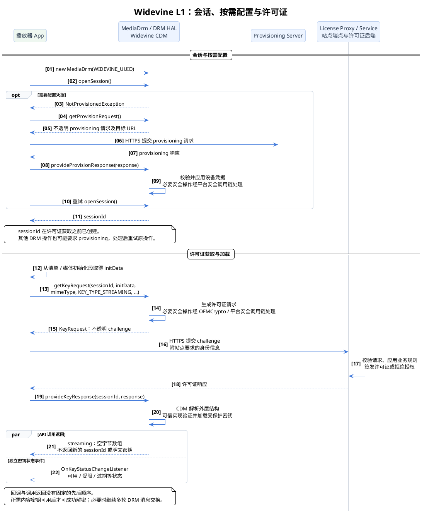
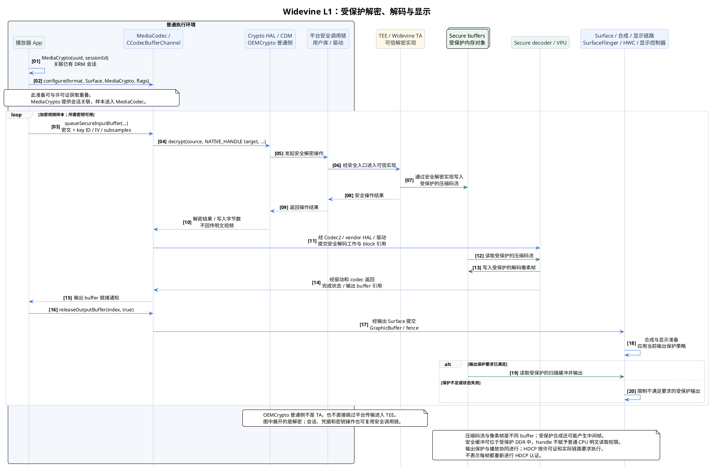

+++
date = '2025-08-08T11:36:11+08:00'
draft = false
title = 'Android DRM 框架'
+++

## Widevine Overview

这张图是 **Widevine DRM（数字版权管理）视频播放流程** 的整体架构图，展示了从内容打包、分发到终端设备解密播放的完整链路。分步骤解读：

---

### 1. **内容准备与分发**

* **Source Media（原始媒体内容）**
  这是未经加密的音视频源文件。
* **Shaka Packager（打包器）**
  将原始媒体文件进行 **加密和分片**，并打包成 **DASH Presentation（自适应流媒体格式）**。
* **DASH Presentation**
  是最终的媒体描述文件（如 MPD），里面包含分片信息、码率信息和加密标记。
* **CDN（内容分发网络）**
  DASH 文件和加密后的媒体分片会被放到 CDN 上，供终端播放器请求。

---

### 2. **授权与密钥服务**

* **License Service（许可证服务）**
  管理内容密钥（KID、CEK），并根据终端请求签发播放许可证（License）。
* **License Proxy**
  充当中间层，接收终端的 License 请求并转发给 License Service，再把结果返回给终端。

---

### 3. **设备安全与密钥保护**

* **OEM（设备制造商）**
  在设备中实现 **OEMCrypto HAL**，并提供硬件安全环境（TEE、Secure OS）。
  设备出厂时会存有 **Lockbox（Keyboxes）**，这是设备的安全身份凭证。
* **Keysith (Provisioning)**
  用于设备首次激活时的 **设备认证与密钥配置**，保证终端能安全接收 DRM 密钥。

---

### 4. **终端播放流程**

* **Media Player**
  播放器解析 DASH MPD，从 CDN 拉取加密的媒体分片。
  播放器检测到内容加密后，会通过 **CDM（Content Decryption Module）** 请求解密。
* **CDM**
  内容解密模块，负责：

  * 与 License Proxy/Service 通信，请求播放许可证（License）。
  * 将密钥请求交给 **OEMCrypto HAL**。
* **OEMCrypto HAL**
  硬件安全层，负责实际的 **密钥解密与内容解密**（在 TEE/Secure OS 内运行）。
  它确保明文内容不会暴露在非安全环境中。
* **Media Output**
  最终的解密音视频流送入播放器渲染输出。
  如果是安全视频（L1 模式），输出会经过 **安全视频路径（SVP）**，防止被截取。

---

### 5. **数据流向说明（图中箭头颜色）**

* **灰色箭头（Provisioning 流程）**
  设备向 Keysmith 请求认证信息，保证设备被授权。
* **红色箭头（打包流程）**
  从 Source Media 到 Shaka Packager 的加密打包。
* **绿色箭头（内容分发）**
  DASH 文件和加密分片从 CDN 到播放器，再到 CDM。
* **蓝色箭头（License 流程）**
  播放器通过 License Proxy 与 License Service 交互，获取解密所需的许可证。
* **黄色箭头（硬件安全路径）**
  OEMCrypto HAL 在硬件安全环境下处理密钥，解密后交给 Media Output。

---

### 6. **整体理解**

这张图展示了 **加密媒体内容如何通过 DRM 保护，从内容提供方到最终设备播放的安全链路**。
关键点：

* 内容在服务端被 **加密**，在客户端通过 **许可证服务**获取密钥。
* 密钥始终在安全硬件环境中处理，避免泄露。
* 播放过程保证了 **端到端的安全性**，符合电影公司/流媒体平台对版权保护的要求。

---

## Android DRM Software Stack

## Widevine L1 DRM 播放流程解读

下面以 **Android 原生播放器的在线流式播放**为例，说明 Widevine L1 的会话、许可证和受保护媒体路径。前提是设备具备相应能力，并成功建立满足内容要求的安全会话；L1 能力本身不等于内容平台已经允许高清播放，也不等于当前显示链路已经满足许可证的输出保护要求。

图中的 `MediaDrm`、DRM HAL 和 CDM 按职责合并展示，不代表同一个进程。网页播放器使用 EME，由 Chromium 等浏览器适配到底层 DRM；网页并不直接调用这些 Android Java API。

### 阶段1：初始化会话与按需 Provisioning

1. App 创建 `MediaDrm(WIDEVINE_UUID)`，再调用 `openSession()`。创建 `MediaDrm` 对象与打开会话是两个操作；`openSession()` 成功后返回 **sessionId**。
2. 如果设备需要配置凭据，`openSession()` 等操作可能抛出 `NotProvisionedException`。App 获取 `getProvisionRequest()` 返回的 **不透明请求数据**，提交到相应的 **Provisioning Server**，再通过 `provideProvisionResponse(response)` 应用响应，并重试原操作。
3. Provisioning 不必在每次播放时执行，也不只可能发生在首次使用时。`getProvisionRequest()` 返回的是请求，不是已经生成的设备证书；不能把这个过程画成“向 License Server 上报公钥，让它登记设备”。

设备凭据如何生成、注入和更新取决于具体 Widevine provisioning 方案。不能统一假定所有设备都在首次播放时由 TEE 现场生成设备密钥对，也不能把受保护密钥的封装存储与明文私钥导出混为一谈。

### 阶段2：许可证请求、验证与内容密钥加载

1. 播放器从清单或媒体初始化数据中取得 DRM 初始化信息，例如 CENC 的 PSSH，然后调用 `getKeyRequest(sessionId, initData, mimeType, KEY_TYPE_STREAMING, …)`。
2. CDM 生成不透明的许可证请求。**App 负责 HTTP 交互**：向站点许可证端点发送请求，并携带站点要求的身份信息。站点代理处理业务规则，后端许可证服务负责签发许可证。
3. App 将许可证响应交给 **`provideKeyResponse(sessionId, response)`**。它与设备配置用的 `provideProvisionResponse()` 是两套不同接口。
4. CDM 可以在普通执行环境解析许可证外层结构；需要保护的密钥验证、派生和加载操作，通过 OEMCrypto 与平台安全调用链交给可信实现。应用不取得明文内容密钥。
5. 对在线流式播放，`provideKeyResponse()` 返回空字节数组，不是新的 `sessionId`。离线许可可能返回用于后续恢复密钥的 `keySetId`，它也不是会话 ID。密钥状态通过独立回调通知，只有所需密钥处于可用状态时，后续样本解密才能成功。

**许可证不是“用设备公钥直接 RSA 加密的 Content Key”。** 在本项目审阅的 OEMCrypto RSA 分支中，设备公钥包装的是 **session key**；可信实现恢复它后，再派生用于内容密钥解包和消息认证的密钥。接口也包含 ECC 分支。因此不能把整个许可证写成 `RSA_Encrypt(ContentKey, DevicePublicKey)`，也不能声称整个许可证只能在 TEE 内解析。这属于 CDM/OEMCrypto 的协议处理，App 应将请求和响应视为不透明消息。

### 阶段3：安全解密、解码与显示

App 创建 `MediaCrypto(WIDEVINE_UUID, sessionId)`，将 DRM 会话关联到 crypto 上下文，再通过 `MediaCodec.configure(format, surface, mediaCrypto, flags)` 配置输出 Surface 与解码器。**MediaCrypto 不是视频样本提交接口**；播放器应使用 `MediaCodec.queueSecureInputBuffer()` 提交加密样本及 `CryptoInfo`，其中包含 key ID、IV、subsamples 等信息。解码器配置可以提前进行，也可以与许可证准备重叠。

以本项目的 CCodec 路径为例，`CCodecBufferChannel` 将密文源与安全解密目标交给 Crypto HAL / Widevine crypto plugin。安全目标使用 **`NATIVE_HANDLE`** 标识，区别于应用可写的密文输入缓冲。解密完成后，codec 接收对应受保护 block 的引用，而不是把明文内容复制回 App。

后续数据形态依次为：

- **密文样本 → 安全解密 → 受保护的压缩视频码流**。
- **受保护压缩码流 → 安全解码器 / VPU → 受保护的像素帧**。
- **受保护像素帧 → Surface / 合成 / 显示链路 → 满足输出保护要求的显示输出**。

下面将通用的用户库、驱动和可信入口合为“平台安全调用链”。在 H56EZ 对应实现中，这一路径展开为 QSEECom 或 Mink/SMCInvoke 分支，经 `qcom_scm / qcom_scm_hab`、HAB、QNX `qcpe_service` 和安全监控入口到达 TA。视频与显示也经过各自的 guest/host 前后端；这些是平台实现，不能当作所有 Android 设备的固定结构。

### 安全边界与核验要点

- **设备凭据与内容密钥不同。** 设备凭据用于设备身份及 DRM 协议处理；内容密钥用于解密媒体样本。应保护明文密钥不泄露给非可信环境，不能把封装后的密钥材料、证书或 handle 当作明文密钥。
- **OEMCrypto 普通侧与可信实现不同。** 普通侧库、Android DRM HAL、平台安全传输和 TEE 内的 TA 有不同职责，不能统称为“全部运行在 TEE 的 OEMCrypto HAL”。
- **安全内存仍然是内存。** 受保护码流、像素和扫描缓冲可以位于系统 DDR；保护依靠访问权限与安全硬件路径，而不是“不进入系统内存”。
- **安全解码不等于显示保护已经完成。** 还要满足实际合成、输出链路和许可证要求。可能使用受保护 GPU 合成；需要 HDCP 时，应检查真实认证与加密状态，不能只看解码器名称或 secure 标志。
- **保护目标不是无条件的绝对保证。** L1 路径旨在阻止非授权环境读取密钥或明文媒体；它本身不能证明整机已取得内容平台认证，也不能单凭示意图断言所有截图、录屏和输出场景均已验证。

接口依据：[MediaDrm](https://developer.android.com/reference/android/media/MediaDrm)、[MediaCrypto](https://developer.android.com/reference/android/media/MediaCrypto)、[MediaCodec](https://developer.android.com/reference/android/media/MediaCodec)、[Widevine Overview](https://developers.google.com/widevine/drm/overview)。项目实现依据为 `OEMCryptoCENC.h`、CDM 的 `license.cpp` 及 `CCodecBufferChannel.cpp`；其中的具体平台路径不替代设备运行时核验。

---

## Widevine L1 生产预置流程

### 概述

Widevine L1 的生产预置流程是设备从出厂到获得正式身份认证的一系列安全操作，用于保证 **设备私钥不泄露**，并让设备能够获得 **Google 签名的合法证书**，参与 Widevine DRM 的内容解密。整个流程由 OEM 工厂和 Google 云端签名服务共同完成，但 OEM 不持有 Google 的根私钥。

---

### 阶段 1：密钥对生成（Key Pair Generation）

1. **OEM 启动预置流程**：生产线上的工厂 PC 启动预置程序，准备对新出厂设备进行 Widevine L1 初始化。
2. **运行预置工具**：工厂 PC 调用专用预置工具（FactoryTool），与设备芯片内部的 TEE 交互。
3. **TEE 生成设备密钥对**：芯片内部的可信执行环境（TEE）生成唯一的 Device Key Pair，其中 **私钥永远不会导出**，公钥将用于后续申请证书。
4. **安全存储私钥**：Device Private Key 被写入 TEE 的安全存储区域（如 Fuse / Keybox / RPMB），确保不可被外部访问。
5. **导出公钥**：TEE 将 Device Public Key 提供给预置工具，用于生成证书签名请求（CSR）。

**安全亮点**：私钥永不离开 TEE，保证设备身份的安全基础。

---

### 阶段 2：证书签名请求（CSR）

6. **生成 CSR**：FactoryTool 将设备公钥与唯一的 Device ID 组合成证书签名请求（CSR）。

   * CSR 遵循标准 PKI 规范，用于申请数字签名证书。
7. **发送 CSR 至 Google 云端签名服务**：CSR 通过加密通道（如专线、VPN 或 HTTPS）上传到 Google 的 Widevine CA 系统。

   * Google 会先验证 CSR 请求来源是否来自授权 OEM 或工厂。

**安全亮点**：CSR 通过安全通道传输，保证在传输过程中不被篡改或窃取。

---

### 阶段 3：签名与证书返回

8. **Google 签名 CSR**：Google 的证书签名服务使用 Root Private Key 对 CSR 进行数字签名，生成 **设备证书（Device Certificate）**。
9. **返回签名证书**：签名后的设备证书通过加密通道返回给工厂的预置工具。

**安全亮点**：OEM 不持有 Google 根私钥，签名操作完全在 Google 云端完成，保证了证书的权威性和不可伪造性。

---

### 阶段 4：证书注入与激活

10. **注入设备证书**：FactoryTool 将签名证书写入 DeviceTEE 内部，通过 TEE 提供的安全接口完成注入。
11. **TEE 验证签名**：设备启动时或注入时，TEE 使用 Google Root Public Key 验证证书签名是否合法。
12. **永久存储证书**：签名验证通过后，设备证书被存储在 TEE 的安全存储区域，与私钥共同形成完整身份体系。
13. **返回成功状态**：TEE 向 FactoryTool 返回注入成功的状态，表示设备已成为 Widevine L1 合法设备。
14. **签名验证失败**（异常情况）：若验证失败，TEE 返回错误状态，流程中止，防止非法设备获得证书。
15. **记录流程结果**：FactoryPC 对整个流程进行记录和日志保存，以便追踪和质量管理。

**安全亮点**：

* 设备证书和私钥都存储在 TEE 内，外部软件无法访问。
* 只有经过 Google 签名的设备证书才能被设备接受并激活 Widevine L1。
* 整个流程保证了生产阶段的设备身份和密钥管理安全。

---

### 总结

1. **设备私钥永不外露**，保证了 DRM 内容密钥解密的安全根基。
2. **CSR 安全传输 + Google 云端签名**，保证了设备公钥和身份的可信性。
3. **TEE 验证与安全存储**，确保只有合法设备才能获得 Widevine L1 认证。
4. OEM 仅扮演代理角色，负责安全地生成密钥和传递 CSR，签名权威仍在 Google。

---

## Widevine 远程密钥预置 (RKP) 流程

### **1. RKP 简介**

远程密钥预置（Remote Key Provisioning, RKP）是 Widevine L1 认证设备的一种现代密钥安装方法。与传统的**工厂预置（Factory Provisioning）模式不同，RKP 允许设备在离开生产线后，于首次使用**时，通过安全的网络连接动态地从 Google 服务器获取其唯一的设备密钥。

这种模式的优势在于：

  * **简化生产线流程**：无需在工厂进行耗时且复杂的密钥烧录操作。
  * **更高的安全性**：密钥仅在需要时才生成和安装，减少了生产和运输过程中的安全风险。
  * **设备可更新性**：密钥管理和证书可以在设备生命周期内进行远程更新和管理。

### **2. 关键组件**

  * **设备制造商 (OEM)**：负责设备的硬件生产和软件集成。
  * **Google RKP 服务**：一个安全的云端服务，负责为设备生成和签名密钥。
  * **高通/SoC 厂商**：提供支持 RKP 的 TEE（可信执行环境）和相关的库（如 `liboemcrypto.so`）。
  * **终端设备**：待预置的设备，包含 TEE 硬件。
  * **RKP 专用工具**：Google 提供给 OEM 的工具，用于在工厂或开发阶段与设备通信，并协助密钥注册。

### **3. RKP 工作流程**

整个 RKP 流程可以分为两个主要阶段：**工厂注册**和**远程激活**。

#### **阶段一：工厂端注册（一次性操作）**

这个阶段通常在 OEM 的工厂或开发环境中完成，目的是将设备的基本信息和公钥安全地注册到谷歌的云端服务。

1.  **设备准备**：设备出厂时，其 TEE 内已预置了支持 RKP 的基础固件，但**没有**设备密钥。
2.  **证书签名请求 (CSR) 提取**：OEM 使用 Google 提供的专用工具（如 `rkp_factory_extraction_tool`），通过 USB 或其他安全连接与设备通信。该工具指示设备的 TEE 生成一个临时的密钥对，并用其私钥对一个 CSR 进行签名。
3.  **CSR 上传**：工具将该 CSR 上传到 Google 的 RKP 服务。
4.  **Google 签名**：RKP 服务验证 CSR 的合法性，并用其**根私钥**对 CSR 进行签名，生成一个**临时的设备证书**。这个证书将用于后续远程激活时验证设备的身份。

#### **阶段二：远程密钥获取与激活（首次使用）**

这个阶段在设备首次连接到互联网时自动触发，通常在 App 尝试播放受保护内容时由 `MediaDrm` 框架启动。

1.  **设备密钥生成**：设备的 TEE 安全地生成一个**永久的**、唯一的设备密钥对。
2.  **密钥请求**：设备将这个永久密钥对的**公钥**，以及在工厂端获得的临时证书，一起发送给 Google RKP 服务。
3.  **密钥签名**：RKP 服务验证请求，并用其**根私钥**对设备的永久公钥进行签名，生成最终的、不可更改的**设备证书**。
4.  **设备激活**：设备下载并验证这个签名的设备证书。一旦验证通过，设备密钥即被激活，并可以用于后续的许可证请求。

-----

#### **4. RKP 流程 PlantUML 时序图**

传统的工厂预置私钥方式（Factory-Provisioned Keys）
在Android早期版本（如Android 11及之前）的密钥认证（Key Attestation）机制中，采用的是工厂预置私钥的方式。具体过程如下：

* 密钥生成与预置：OEM（原始设备制造商）或ODM（原始设计制造商）在工厂环境中生成密钥对（公钥和私钥）。私钥直接注入（provisioned）到设备的TEE（Trusted Execution Environment，可信执行环境）中。
* 风险与问题：这要求在工厂处理敏感的私钥秘密，增加了供应链泄露的风险（如工厂员工或供应链环节的潜在泄露）。一旦私钥泄露，整个批次的设备可能受影响，且难以恢复。同时，密钥是静态的，不易轮换，隐私保护较弱（例如，多个应用可能共享同一密钥，导致追踪风险）。
*  使用流程：设备出厂后，应用请求认证时，直接使用预置的私钥生成凭证链，无需在线请求新证书。但证书链较短，且根信任基于RSA。

这种方式确实在“第一步”（工厂阶段）就预置了私钥，这也是其主要安全隐患所在。

**RKP（远程密钥预置）与传统的区别**
RKP是Google从Android 12开始引入的可选机制，并在Android 13中强制要求（针对新设备），旨在取代传统的工厂预置私钥方式，提高安全性和隐私。RKP的核心是不预置私钥，而是由设备自行生成并保护私钥，只在工厂提取公钥。

* 密钥生成：密钥对（公钥和私钥）由设备TEE自行生成。私钥从生成起就永不离开TEE的安全环境，确保零暴露。
* 工厂流程（第一步）：OEM在工厂启动设备公钥提取。设备TEE生成唯一的硬件绑定密钥对。只提取公钥（DK_PUB），上传到Google服务器存储。私钥不导出、不预置。
* 远程配置流程（设备端）：设备开箱联网后，应用触发请求，TEE生成CSR（凭证签名请求），用私钥签名后发送到Google服务器。服务器验证公钥匹配后，签名并返回短期证书链（有效期最长两个月）。证书定期轮换。
安全/隐私优势：
* 供应链安全：消除工厂处理私钥的风险，减少泄露可能。
* 隐私提升：每个应用获得不同的认证密钥，证书短期有效，服务器分段设计（验证公钥的服务器不接触认证密钥），防止设备追踪。
* 可恢复性：如果设备软件被入侵，Google可停止向其提供新证书，而不影响整个生态。
* 技术改进：证书链更长，根信任从RSA转向ECDSA，支持更安全的密钥轮换。

总之，传统的工厂预置确实在第一步预置私钥，但RKP避免了这一点，转而使用设备生成+公钥提取的方式。这大大降低了风险，并已成为Android生态的标准。

##### 流程对比：Widevine L1 预置 vs. RKP 认证

这两种流程服务于不同的核心目标，并且在工作流程、安全性及 OEM 责任方面存在根本差异。

| 特性比较 | **传统 Widevine L1 生产预置 (Keybox)** | **远程密钥预置 (RKP for Attestation)** |
| :--- | :--- | :--- |
| **核心目标** | DRM 内容保护，确保加密的影音内容只能在授权设备上播放。 |  设备完整性认证 (Attestation)，向 App (如银行、支付) 证明设备处于安全、未被篡改的状态 。 |
| **密钥配置地点** |  **工厂生产线** 。密钥在设备出厂前已完全烧录。 |  **用户端 (In-the-field)** 。设备在首次连接网络时，通过 OTA 远程获取密钥凭证 。 |
| **工厂流程** |  **注入私钥**  。将包含完整密钥对 (公钥+私钥) 的 `keybox.xml` 文件安全地烧录到每台设备中。 |  **提取公钥** 。仅从每台设备中提取其唯一的、非敏感的公钥 (DK\_PUB)。 |
| **关键交付物** | 一台包含**永久性** Widevine 设备密钥的、已完全配置的设备。 |  一台「已准备好」进行远程配置的设备，其公钥已在 Google 云端注册 。 |
| **密钥/凭证类型** |  **永久性、长生命周期的设备密钥**。一旦泄漏，影响是永久的 。 |  **短期、可再生的认证凭证** (例如，有效期仅两个月)。 |
| **安全性** |  **较高风险**。OEM 必须处理并保护高度敏感的私钥材料，存在工厂或供应链泄漏的风险 。 |  **极高安全性**。OEM 在工厂完全不接触任何私钥，私钥从未离开过设备的 TEE 。 |
| **灵活性与可恢复性** |  **低**。密钥一旦泄漏或被撤销，设备将永久失去信任 ，通常需要硬件召回 (RMA) 。 |  **高**。如果出现漏洞，Google 只需停止为有问题的设备签发新的短期凭证，即可有效控制风险，无需撤销永久密钥 。 |
| **OEM 责任** |  **责任重大**。需要建立和维护昂贵且复杂的安全生产环境，以保护私钥材料的安全 。 |  **责任较轻**。只需负责提取和上传非敏感的公钥 ，大大降低了安全管理的复杂度和成本。 |
