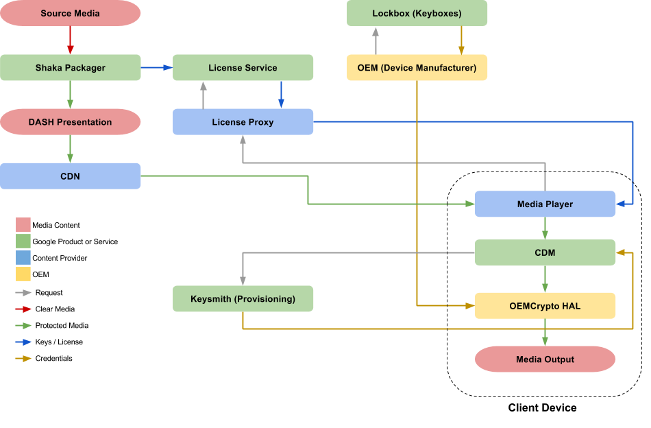
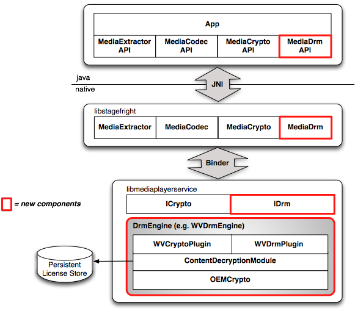
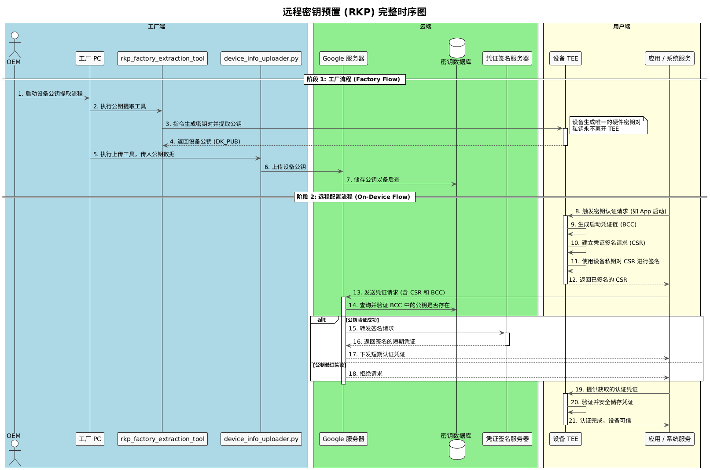
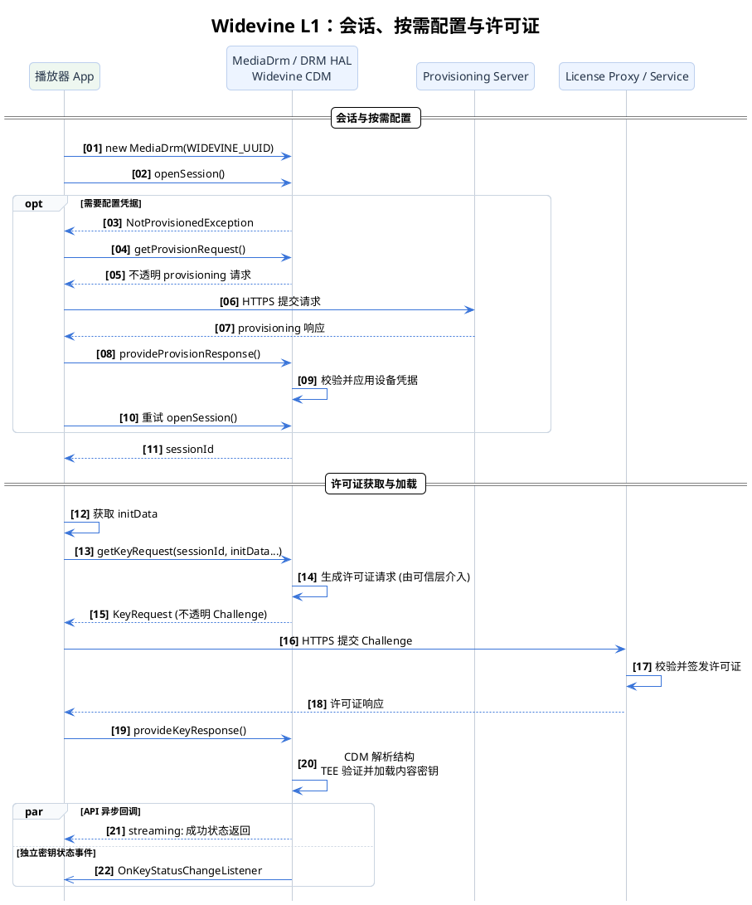
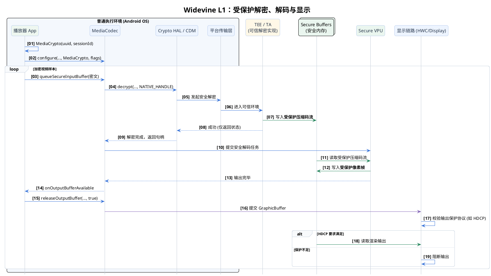

+++
date = '2025-08-08T11:36:11+08:00'
draft = false
title = 'Android Widevine DRM 核心架构与核心流程解析'
+++

## 1. 架构总览 (Architecture Overview)

### 1.1 端到端媒体流转

Widevine DRM（数字版权管理）实现了一套从内容打包、分发到终端设备解密播放的完整安全链路。整个流程涉及以下核心环节：

* **内容准备与分发 (Content Preparation & Distribution)**
  * **Source Media**：未经加密的原始音视频源文件。
  * **Shaka Packager**：核心打包器，将原始文件加密、分片，并打包为自适应流媒体格式（如 DASH Presentation）。
  * **CDN**：分发加密后的媒体分片及 MPD（Media Presentation Description）文件供终端拉取。
* **授权与密钥服务 (License Service)**
  * **License Service / Proxy**：云端后端服务，负责管理内容密钥（CEK/KID），并根据终端请求动态签发播放许可证（License）。
* **设备安全环境 (Device Security)**
  * **Keysmith / Provisioning**：针对设备的身份认证与密钥配置服务，确保只有合法的授权设备能接入网络。
  * **OEMCrypto HAL & TEE**：设备制造商（OEM）提供的硬件级安全运行环境，确保所有加密和解密操作对操作系统其余部分不可见。
* **终端播放流程 (Client Playback)**
  * **Media Player**：解析 MPD 并从 CDN 获取加密内容。
  * **CDM (Content Decryption Module)**：向外负责与 License Service 通信获取许可证，向内负责将密钥请求下发给 OEMCrypto HAL。
  * **Media Output**：经过硬件解密的音视频流将经由安全视频路径（SVP）送入显示链路。

### 1.2 Android 软件栈 (Software Stack)

在 Android 系统中，DRM 架构呈现出典型的垂直分层：
1. **应用层 (App/Browser)**：通过 Android `MediaDrm` Java API 或浏览器 EME (Encrypted Media Extensions) 接口发起加密会话。
2. **框架层 (Framework)**：Android 媒体框架向下通过 HIDL/AIDL 接口与底层的 DRM HAL 进行通信。
3. **硬件抽象层 (HAL)**：Widevine 提供的核心 CDM 插件运行于此，负责实现具体的加解密逻辑协议。
4. **可信执行环境 (TEE)**：最底层的 OEMCrypto 模块部署在 TrustZone 等隔离环境中，直接操作物理加密引擎。

---

## 2. 设备安全凭证预置 (Device Provisioning)

设备要具备解密 Widevine 视频的能力，其前提是必须在出厂或激活时注入合法的安全身份（凭证）。

### 2.1 传统工厂预置 (Factory Provisioning / Keybox)
传统模式下，设备的安全身份（包含私钥和证书的 Keybox）在工厂生产线上完成烧录。

1. **密钥对生成**：工厂工具调用设备芯片内的 TEE，生成唯一的 Device Key Pair。私钥被安全写入 Fuse、RPMB 等不可见区域。
2. **证书签名请求 (CSR)**：工厂工具提取出公钥，附带 Device ID 生成 CSR，通过加密通道上传至 Google Widevine CA。
3. **Google 云端签名**：Google 验证工厂合法性后，使用 Root Private Key 对 CSR 签名，颁发 Device Certificate。
4. **注入与激活**：工厂工具将下发的证书写入设备 TEE 中。TEE 校验签名合法后，设备即获得 Widevine L1 资格。
> [!NOTE]
> 在此模式下，设备私钥永不离开 TEE，OEM 也不持有 Google 的根私钥。但由于工厂环境仍需处理极少量的中间认证过程，存在一定的供应链管理成本。

### 2.2 远程密钥预置 (RKP)

从 Android 12 开始，Google 引入了 RKP (Remote Key Provisioning) 机制。RKP 彻底改变了凭证下发方式：**私钥无需在工厂进行任何形式的预置**。

1. **工厂端提取 (一次性操作)**：设备 TEE 生成基于硬件绑定的唯一密钥对。工厂**仅提取公钥** (DK_PUB) 上传至 Google 服务器，私钥不导出、不预置。
2. **远程激活 (首次使用)**：设备开箱联网后，App 触发请求，TEE 生成 CSR（凭证签名请求），使用自身私钥签名并发送给 Google 服务器。服务器验证公钥匹配后，动态颁发短期证书链。

**预置模式对比：**
| 特性比较 | 传统 Widevine L1 (Keybox) | 远程密钥预置 (RKP) |
| :--- | :--- | :--- |
| **密钥配置地点** | 工厂生产线 | 用户端 (首次联网 OTA) |
| **关键交付物** | 包含永久性设备密钥的已烧录设备 | 已准备好进行远程配置的公钥注册设备 |
| **凭证类型** | 永久性、长生命周期密钥 | 短期、可再生的动态认证凭证 |
| **安全性与可恢复性**| 密钥泄露风险高，一旦泄露设备将永久失去信任 | 安全性极高，若出现漏洞，Google 停止签发新证书即可控制影响 |

---

## 3. Widevine L1 运行时播放流程 (Runtime Playback Flow)

在设备具备合法凭证后，Android 播放器即可启动基于 L1 硬件安全的在线流式播放。

### 3.1 阶段 1：初始化会话与按需配置
1. App 实例化 `MediaDrm(WIDEVINE_UUID)`，调用 `openSession()`。若成功，返回 **sessionId**。
2. 若设备尚未完成证书配置（如 RKP 未激活），`openSession()` 将抛出 `NotProvisionedException`。
3. App 捕获异常后，调用 `getProvisionRequest()` 获取**不透明的请求数据**，提交至 Provisioning Server。随后通过 `provideProvisionResponse()` 将响应回传底层，并重试 `openSession()`。

> [!TIP]
> 凭证配置 (Provisioning) 并非必须在设备首次启动时立刻发生。它由实际的 DRM 操作触发，`getProvisionRequest()` 的本质是请求过程，而非“向服务器暴露私钥”。

### 3.2 阶段 2：许可证请求、验证与密钥加载
1. 播放器从清单文件 (如 MPD) 或码流 PSSH 中获取初始化数据，调用 `getKeyRequest()`。
2. CDM 生成加密的 Challenge。App 负责作为纯粹的网络管道，将 Challenge 通过 HTTP(S) 透传给站点 License Server。
3. License Server 验证业务规则后，返回许可证响应。App 调用 **`provideKeyResponse()`** 喂给底层。
4. CDM 解析许可证外层协议。受保护的内容密钥 (Content Key) 通过 OEMCrypto 传递到 TEE 中。

> [!IMPORTANT]
> **许可证并不是简单地用设备公钥直接 RSA 加密内容密钥**。通常，设备公钥包装的是 Session Key；TEE 恢复 Session Key 后，再派生出用于内容密钥解包和防篡改校验的派生密钥。整个许可证应被 App 视为不透明结构。

### 3.3 阶段 3：安全解密、解码与显示
当内容密钥就绪，播放器开始构建解码管道。

1. App 创建 `MediaCrypto` 实例，将先前的 `sessionId` 绑定至加解密上下文，并调用 `MediaCodec.configure()`。
2. 播放器通过 `queueSecureInputBuffer()` 提交加密的媒体 Sample 以及元数据（Key ID, IV 等）。**注意：MediaCrypto 本身不是数据提交接口。**
3. 在底层，Crypto HAL / CDM 将密文通过安全通道送入 TEE。
4. TEE 完成解密后，将**受保护的压缩码流**写入安全缓冲区 (Secure Buffers)，返回给宿主侧的仅是 Buffer 的 `NATIVE_HANDLE` 句柄，普通环境（包括 Android OS）无法访问明文内容。
5. `MediaCodec` 将引用句柄交给安全解码器 (VPU)，硬件解码输出**受保护的像素帧**，最终由 SurfaceFlinger 和 HWC 直接投递至显示硬件层。

---

## 4. 安全边界与工程核验要点 (Security Boundaries)

在工程实践和技术调试中，明确 DRM 各组件的安全边界至关重要：

* **设备凭据 ≠ 内容密钥**：设备凭据用于确认设备的合法身份并完成 DRM 握手协议；内容密钥才是用来解密视频样本的数据。严禁将两者混淆，更不能错误认为“应用层可以接触明文密钥”。
* **OEMCrypto 普通侧 ≠ 可信实现**：OEMCrypto 包含运行在 Android 侧的调用库以及运行在 TEE 内的 Trusted Application (TA)。不能笼统地说“OEMCrypto 完全运行在 TEE 内”。
* **安全内存仍然是系统内存**：所谓的 Secure Buffers 通常仍然分配在系统的 DDR 物理内存中，其安全性依赖于 TrustZone 硬件级别的访问权限隔离，而非“数据不经过内存”。普通 CPU 持有的仅仅是 Handle 句柄，强制读取会导致系统异常。
* **解码完成 ≠ 输出保护 (HDCP) 已完成**：视频被安全解码进入 Surface 队列后，显示控制器 (HWC) 还会强行校验当前的物理链路是否满足许可证要求（如 HDMI HDCP 认证级别），若不满足依然会引发黑屏。
* **架构保障与整机认证**：L1 路径确保了系统层面的绝对隔离，但这不代表流媒体平台（如 Netflix）会自动放开 4K 画质。流媒体平台还需基于 Google 下发的设备白名单进行双向校验。
