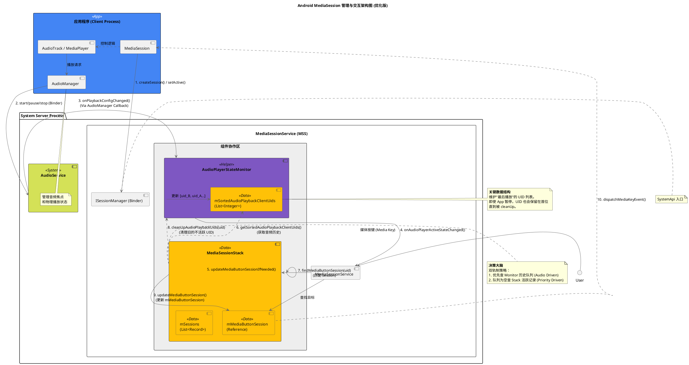

+++
date = '2025-08-08T11:36:11+08:00'
draft = false
title = 'Android DRM 框架'
+++

### 优化的主要改动解释：

1.  **AudioService 的加入**：

      * **原图**：App 直接调 `AudioManager`，然后直接连到 Monitor，掩盖了跨进程通信细节。
      * **新图**：App -\> `AudioManager` (Client) -\> `AudioService` (System)。`AudioService` 才是所有音频状态的源头，它通过回调通知 `Monitor`。

2.  **Monitor 内部的 `HistoryQueue`**：

      * 代码中 `mSortedAudioPlaybackClientUids` 是核心。我在图中将其显式画出。这解释了为什么 App B 暂停后，Stack 依然能从 Monitor 拿到 `[uid_B]` 而不是空列表。

3.  **Step 8: `cleanUpAudioPlaybackUids`**：

      * 这是一个非常关键的**回环调用**。Stack 决定了谁是 MediaButtonSession 后，反过来命令 Monitor 清理掉排在这个 Session 之后的“垃圾”UID。这在原图中是缺失的。

4.  **组件归属调整**：

      * 将 `AudioPlayerStateMonitor` 和 `MediaSessionStack` 放入 `MediaSessionService` 的矩形框内，并用“组件协作区”包裹，强调它们是在同一服务内部紧密协作的对象。

这个新图更准确地反映了代码逻辑：**AudioService 驱动状态变化 -\> Monitor 记录历史 -\> Stack 基于历史做决策 -\> Stack 反向清理 Monitor 历史 -\> 确立 MediaButtonSession。**