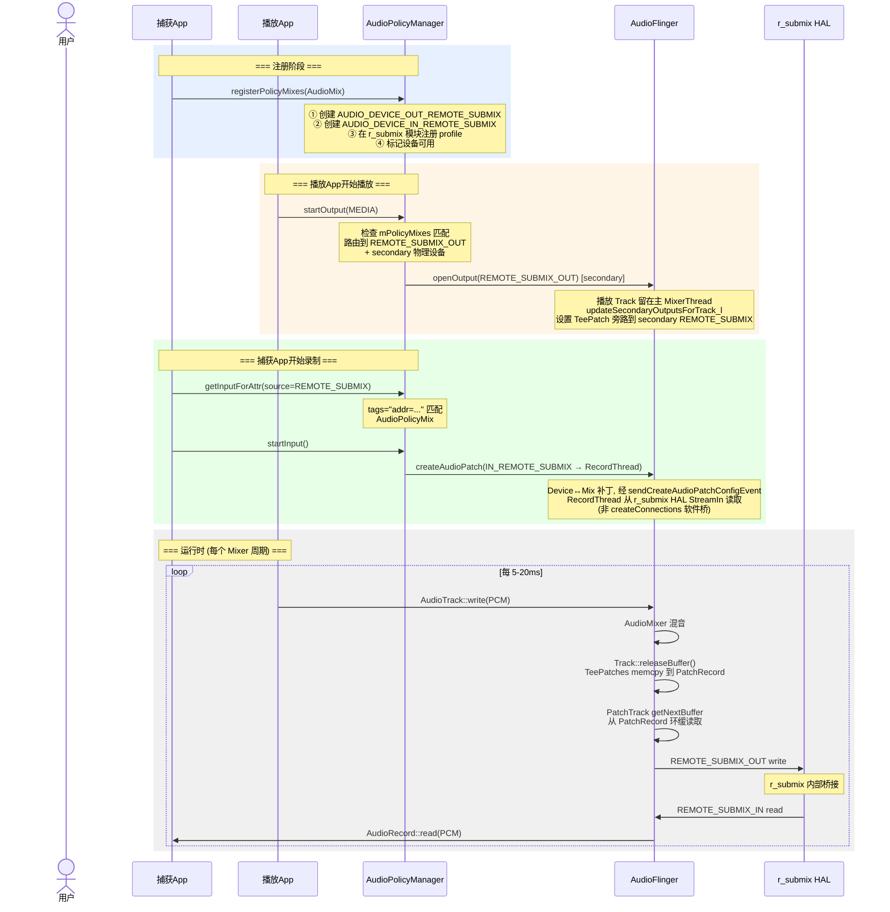

+++
date = '2026-06-07T10:22:54+08:00'
draft = false
title = 'Android 13 AudioPlaybackCapture 技术原理与实现
+++

## 1. 概述

**AudioPlaybackCapture** 是 Android 10 (API 29) 引入的 API,允许 App 捕获其他 App 正在播放的音频。典型场景包括:

- 屏幕录制时同时录制内部音频 (SystemUI 的 ScreenRecord)
- 音乐律动可视化 (将播放的音频送入分析算法)
- 游戏直播时捕获游戏音效

**技术方案核心思路**: 通过 **Remote Submix 虚拟音频设备** + **AudioPolicy 动态策略路由** + **AudioFlinger 软件音频补丁** 三层协作,将播放音频流环回 (loopback) 到录制端,中间通过共享环形缓冲区实现高效的零拷贝传递。

```
捕获App                       播放App
  │                            │
  │ AudioRecord                │ AudioTrack
  │ source=REMOTE_SUBMIX       │ usage=MEDIA
  │                            │
  ▼                            ▼
┌──────────────────────────────────────────────────────┐
│                 AudioPolicyManager                    │
│                                                      │
│  registerPolicyMixes()  ←── AudioMix                 │
│  startOutput()          →  路由到 REMOTE_SUBMIX_OUT  │
│  startInput()           →  从 REMOTE_SUBMIX_IN 录制   │
└──────────────────────────┬───────────────────────────┘
                           │
                           ▼
┌──────────────────────────────────────────────────────┐
│                   AudioFlinger                       │
│                                                      │
│  主 MixerThread (播放 Track 所在, 非 Duplicating)     │
│    └─ Track::releaseBuffer() → interceptBuffer()     │
│         └─ TeePatches: memcpy → PatchRecord 环缓 ────┐│
│                                                      ││
│  REMOTE_SUBMIX MixerThread                           ││
│    └─ PatchTrack ←── 共享环缓 ───────────────────────┘│
│         └─ Mixer → HAL StreamOut                     │
│                                                      │
│  RecordThread ← HAL StreamIn                         │
│    └─ AudioRecord::read() → 捕获App                  │
└──────────────────────┬───────────────────────────────┘
                       │
                       ▼
┌──────────────────────────────────────────────────────┐
│    r_submix HAL (虚拟软件模块, 非真实硬件)             │
│    StreamOut ──→ StreamIn (进程内软件 pipe)           │
└──────────────────────────────────────────────────────┘
```

---

## 2. 技术原理 — 源码逐层分析

### 2.1 Java API 层: 从 Builder 到 AudioRecord

#### 2.1.1 入口: `AudioRecord.Builder.build()`

**源码** `frameworks/base/media/java/android/media/AudioRecord.java:907`:

```java
public AudioRecord build() throws UnsupportedOperationException {
    if (mAudioPlaybackCaptureConfiguration != null) {
        return buildAudioPlaybackCaptureRecord();  // 走捕获路径
    }
    // ... 普通录音路径
}
```

当 Builder 上设置了 `AudioPlaybackCaptureConfiguration` 时,走的是 `buildAudioPlaybackCaptureRecord()` 分支,而非普通录音路径。

#### 2.1.2 核心: `buildAudioPlaybackCaptureRecord()`

**源码** `frameworks/base/media/java/android/media/AudioRecord.java:769`:

```java
private @NonNull AudioRecord buildAudioPlaybackCaptureRecord() {
    // =====================================================
    // Step 1: 将匹配规则 + 格式封装成 AudioMix
    // =====================================================
    AudioMix audioMix = mAudioPlaybackCaptureConfiguration.createAudioMix(mFormat);

    // =====================================================
    // Step 2: 创建 AudioPolicy 并注册到系统
    // =====================================================
    MediaProjection projection = mAudioPlaybackCaptureConfiguration.getMediaProjection();
    AudioPolicy audioPolicy = new AudioPolicy.Builder(/*context=*/ null)
            .setMediaProjection(projection)   // 绑定用户授权
            .addMix(audioMix)                // 添加混音规则
            .build();

    int error = AudioManager.registerAudioPolicyStatic(audioPolicy);
    //   ↓ Binder 调用
    //   IAudioService.registerAudioPolicy()
    //   → AudioPolicyService
    //   → AudioPolicyManager.registerPolicyMixes()

    // =====================================================
    // Step 3: 从已注册的 AudioPolicy 创建 AudioRecord
    // =====================================================
    AudioRecord record = audioPolicy.createAudioRecordSink(audioMix);

    // =====================================================
    // Step 4: 绑定生命周期 — AudioRecord 释放时自动注销
    // =====================================================
    record.unregisterAudioPolicyOnRelease(audioPolicy);
    return record;
}
```

#### 2.1.3 AudioMix 的创建和标志位

**源码** `frameworks/base/media/java/android/media/AudioPlaybackCaptureConfiguration.java:131`:

```java
@NonNull AudioMix createAudioMix(@NonNull AudioFormat audioFormat) {
    return new AudioMix.Builder(mAudioMixingRule)
            .setFormat(audioFormat)
            .setRouteFlags(AudioMix.ROUTE_FLAG_LOOP_BACK | AudioMix.ROUTE_FLAG_RENDER)
            .build();
}
```

两个关键标志位:

| 标志 | 值 | 含义 |
|------|----|------|
| `ROUTE_FLAG_RENDER` | 0x1 | 同时继续渲染到物理设备(扬声器) |
| `ROUTE_FLAG_LOOP_BACK` | 0x2 (`0x1 << 1`) | 音频环回到录制输入端 |

如果只设置 `LOOP_BACK` 不设置 `RENDER`,用户将听不到正在播放的音频(静默捕获)。

#### 2.1.4 `createAudioRecordSink()` — 创建与 AudioMix 关联的 AudioRecord

**源码** `frameworks/base/media/java/android/media/audiopolicy/AudioPolicy.java:776`:

```java
public AudioRecord createAudioRecordSink(AudioMix mix) {
    // ★ 关键: AudioAttributes.source = REMOTE_SUBMIX (8)
    //         tags = "addr=<mixAddress>" 用于匹配 AudioPolicyMix
    AudioAttributes.Builder ab = new AudioAttributes.Builder()
            .setInternalCapturePreset(MediaRecorder.AudioSource.REMOTE_SUBMIX)  // source = 8
            .addTag(addressForTag(mix))           // tags = "addr=..."
            .addTag(AudioRecord.SUBMIX_FIXED_VOLUME);

    AudioFormat mixFormat = new AudioFormat.Builder(mix.getFormat())
            .setChannelMask(AudioFormat.inChannelMaskFromOutChannelMask(
                    mix.getFormat().getChannelMask()))
            .build();

    AudioRecord ar = new AudioRecord(ab.build(), mixFormat, bufferSize, sessionId);
    return ar;
}
```

**设计巧妙之处**: `AudioAttributes.source = REMOTE_SUBMIX` + `tags = "addr=..."` 构成了一个"身份标识",使得 `AudioPolicyManager.getInputForAttr()` 在 Native 层能够将此录音请求与之前注册的 `AudioPolicyMix` 精确匹配。

#### 2.1.5 AudioPolicy 注册到系统

**源码** `frameworks/base/media/java/android/media/AudioManager.java:5127`:

```java
static int registerAudioPolicyStatic(@NonNull AudioPolicy policy) {
    IAudioService service = getService();
    String regId = service.registerAudioPolicy(policy.getConfig(), policy.cb(),
            policy.hasFocusListener(), policy.isFocusPolicy(), policy.isTestFocusPolicy(),
            policy.isVolumeController(),
            projection == null ? null : projection.getProjection());
    // → Binder → AudioPolicyService → AudioPolicyManager.registerPolicyMixes()
}
```

### 2.2 AudioPolicyManager 层: 策略路由与设备管理

#### 2.2.1 `registerPolicyMixes()` — 创建虚拟 REMOTE_SUBMIX 设备

**源码** `frameworks/av/services/audiopolicy/managerdefault/AudioPolicyManager.cpp:3651`:

```cpp
status_t AudioPolicyManager::registerPolicyMixes(const Vector<AudioMix>& mixes) {
    for (size_t i = 0; i < mixes.size(); i++) {
        AudioMix mix = mixes[i];

        // 安全检查: 只允许 MIX_TYPE_PLAYERS 使用 LOOP_BACK
        if (is_mix_loopback_render(mix.mRouteFlags) && mix.mMixType != MIX_TYPE_PLAYERS) {
            return INVALID_OPERATION;
        }

        if ((mix.mRouteFlags & MIX_ROUTE_FLAG_LOOP_BACK) == MIX_ROUTE_FLAG_LOOP_BACK) {
            // ① 获取 r_submix HAL 模块
            sp<HwModule> rSubmixModule = mHwModules.getModuleFromName(
                    AUDIO_HARDWARE_MODULE_ID_REMOTE_SUBMIX);  // "r_submix"

            // ② 根据 mix 类型决定设备方向
            if (mix.mMixType == MIX_TYPE_PLAYERS) {
                mix.mDeviceType = AUDIO_DEVICE_OUT_REMOTE_SUBMIX;        // 0x8000
                deviceTypeToMakeAvailable = AUDIO_DEVICE_IN_REMOTE_SUBMIX; // 0x80000100
            } else {
                mix.mDeviceType = AUDIO_DEVICE_IN_REMOTE_SUBMIX;
                deviceTypeToMakeAvailable = AUDIO_DEVICE_OUT_REMOTE_SUBMIX;
            }

            // ③ 在 r_submix 模块上注册输入/输出 profile
            //    告诉 AudioFlinger: 这个模块支持此格式的流
            audio_config_t outputConfig = mix.mFormat;
            outputConfig.channel_mask = AUDIO_CHANNEL_OUT_STEREO; // AF mixer 不支持 mono
            rSubmixModule->addOutputProfile(address, &outputConfig,
                    AUDIO_DEVICE_OUT_REMOTE_SUBMIX, address);
            rSubmixModule->addInputProfile(address, &inputConfig,
                    AUDIO_DEVICE_IN_REMOTE_SUBMIX, address);

            // ④ 标记设备为可用状态
            setDeviceConnectionStateInt(deviceTypeToMakeAvailable,
                    AUDIO_POLICY_DEVICE_STATE_AVAILABLE,
                    address, "remote-submix", AUDIO_FORMAT_DEFAULT);

            // ⑤ 注册到 mPolicyMixes 集合
            mPolicyMixes.registerMix(mix, 0 /*output desc*/);
        }
    }
}
```

> 注: 上述 ①–⑤ 为逻辑示意;源码中 `mPolicyMixes.registerMix()` 实际在 `addOutputProfile / setDeviceConnectionStateInt` **之前**调用(`AudioPolicyManager.cpp:3694`)。

**注册后的系统状态**:
```
mAvailableOutputDevices: [..., AUDIO_DEVICE_OUT_REMOTE_SUBMIX (addr="<mixAddr>")]
mAvailableInputDevices:  [..., AUDIO_DEVICE_IN_REMOTE_SUBMIX  (addr="<mixAddr>")]
mPolicyMixes:            [AudioMix{routeFlags=LOOP_BACK|RENDER,
                                    deviceType=REMOTE_SUBMIX_OUT,
                                    mMixType=PLAYERS, criteria=[...]}]
```

#### 2.2.2 `startOutput()` — 播放流路由到 REMOTE_SUBMIX

**源码** `frameworks/av/services/audiopolicy/managerdefault/AudioPolicyManager.cpp:2289`:

```cpp
// 当被匹配到的 App 开始播放时:
sp<AudioPolicyMix> policyMix = outputDesc->mPolicyMix.promote();
if (policyMix != nullptr) {
    if ((policyMix->mRouteFlags & MIX_ROUTE_FLAG_LOOP_BACK) == MIX_ROUTE_FLAG_LOOP_BACK) {
        // ★ 输出目标变为 REMOTE_SUBMIX, 而非物理设备
        newDeviceType = AUDIO_DEVICE_OUT_REMOTE_SUBMIX;
    }
    sp<DeviceDescriptor> device = mAvailableOutputDevices.getDevice(
            newDeviceType, String8(address), AUDIO_FORMAT_DEFAULT);
    devices.add(device);
}
```

由于 AudioMix 设置了 `ROUTE_FLAG_LOOP_BACK | ROUTE_FLAG_RENDER`,该 mix 属于 **loopback render** 类型。源码 `AudioPolicyMix.cpp:176` 中 `primaryOutputMix = !is_mix_loopback_render(...)`,因此 loopback render mix **不是** primary,而是被加入 secondary。`AudioPolicyManager.getOutputForAttr()` 返回:
- **primary output**: 物理扬声器设备 (USAGE_MEDIA 正常路由,用户继续听到声音)
- **secondary output**: `AUDIO_DEVICE_OUT_REMOTE_SUBMIX` (loopback 目标,经 TeePatch 旁路)

AudioFlinger 随后通过 `updateSecondaryOutputsForTrack_l()` 为播放 Track 设置 **TeePatch**,将音频旁路复制到 secondary 的 REMOTE_SUBMIX 线程;播放 Track 本身仍留在其主 `MixerThread` 上(**不是** `DuplicatingThread`,二者是互斥的两套机制)。

#### 2.2.3 `getInputForAttr()` — 录制请求与 AudioPolicyMix 匹配

**源码** `frameworks/av/services/audiopolicy/managerdefault/AudioPolicyManager.cpp:2644`:

```cpp
status_t AudioPolicyManager::getInputForAttr(...) {

    // ★ 通过 source + tags 精确匹配到之前注册的 AudioPolicyMix
    if (attributes.source == AUDIO_SOURCE_REMOTE_SUBMIX &&
            strncmp(attributes.tags, "addr=", strlen("addr=")) == 0) {

        // 从 mPolicyMixes 中查找匹配的 AudioMix (通过 address)
        status = mPolicyMixes.getInputMixForAttr(attributes, &policyMix);

        // 获取对应的 RemoteSubmix 输入设备
        device = mAvailableInputDevices.getDevice(
                AUDIO_DEVICE_IN_REMOTE_SUBMIX,
                String8(attr->tags + strlen("addr=")),  // 提取 address
                AUDIO_FORMAT_DEFAULT);

        if (is_mix_loopback_render(policyMix->mRouteFlags)) {
            *inputType = API_INPUT_MIX_PUBLIC_CAPTURE_PLAYBACK;
        }
    }

    // 打开输入流: 找到 r_submix 模块上的输入 profile,调用 AudioFlinger.openInput()
    *input = getInputForDevice(device, session, attributes, config, flags, policyMix);
}
```

#### 2.2.4 `startInput()` — 启动录制,创建音频补丁

**源码** `frameworks/av/services/audiopolicy/managerdefault/AudioPolicyManager.cpp:3007`:

```cpp
status_t AudioPolicyManager::startInput(audio_port_handle_t portId) {
    sp<DeviceDescriptor> device = getNewInputDevice(inputDesc); // = REMOTE_SUBMIX_IN

    // ★ 创建音频补丁: 将 REMOTE_SUBMIX_IN 设备连接到 RecordThread
    status = setInputDevice(input, device, true /*force*/, &newpatchHandle);
    // → installPatch() → mpClientInterface->createAudioPatch()
    // → AudioFlinger::createAudioPatch() → PatchPanel

    // RemoteSubmix 特殊处理: 自动启用对应的输出端
    if (audio_is_remote_submix_device(inputDesc->getDeviceType())) {
        if (policyMix->mMixType == MIX_TYPE_PLAYERS) {
            setDeviceConnectionStateInt(AUDIO_DEVICE_OUT_REMOTE_SUBMIX,
                    AUDIO_POLICY_DEVICE_STATE_AVAILABLE,
                    address, "remote-submix", AUDIO_FORMAT_DEFAULT);
        }
    }
}
```

### 2.3 AudioFlinger 层: 软件音频补丁与零拷贝数据传输

> **重要范围说明**: 下面 2.3.1 / 2.3.2 描述的 `PatchPanel::createAudioPatch() → createConnections`(`openOutput_l`/`openInput_l` + PatchTrack↔PatchRecord 软件桥)是 AudioFlinger **通用**的软件补丁机制,仅在 **device→device 跨 HW 模块** 或 **num_sources==2** 时触发(`PatchPanel.cpp:234`)。**AudioPlaybackCapture 的实际数据通路并不走 `createConnections`**:REMOTE_SUBMIX 捕获产生的是 Device↔Mix 补丁(经 `sendCreateAudioPatchConfigEvent`,`PatchPanel.cpp:347`),其两段数据传递是 **TeePatch(见 2.3.3)+ r_submix HAL 内部 pipe(见 2.4)**。故 2.3.1 / 2.3.2 仅作机制背景,真正的捕获链路以 **2.4 节** 为准。

#### 2.3.1 `PatchPanel::createAudioPatch()` — 创建软件桥接

**源码** `frameworks/av/services/audioflinger/PatchPanel.cpp:135`:

当 source 和 sink 设备跨越不同 HW 模块,或 HAL 不支持硬件补丁时,AudioFlinger 创建软件桥接:

```cpp
status_t PatchPanel::createAudioPatch(const struct audio_patch *patch, ...) {
    // 判断是否需要软件补丁:
    // - num_sources == 2 (复用已有输出混音)
    // - src & sink 跨 HW 模块
    // - HAL 不支持音频补丁创建

    if (需要软件补丁) {
        // ① 打开 PlaybackThread → AUDIO_DEVICE_OUT_REMOTE_SUBMIX
        sp<ThreadBase> thread = mAudioFlinger.openOutput_l(
                module, &output, &config, &mixerConfig,
                outputDevice, outputDeviceAddress, flags);
        newPatch.mPlayback.setThread(reinterpret_cast<PlaybackThread*>(thread.get()));

        // ② 打开 RecordThread ← AUDIO_DEVICE_IN_REMOTE_SUBMIX
        sp<ThreadBase> recThread = mAudioFlinger.openInput_l(
                srcModule, &input, &config,
                device, address, source, flags,
                outputDevice, outputDeviceAddress);
        newPatch.mRecord.setThread(reinterpret_cast<RecordThread*>(recThread.get()));

        // ③ 创建 PatchTrack ↔ PatchRecord 连接
        status = newPatch.createConnections(this);
    }
}
```

#### 2.3.2 `createConnections()` — 核心: PatchTrack 与 PatchRecord 配对

**源码** `frameworks/av/services/audioflinger/PatchPanel.cpp:469`:

```cpp
status_t Patch::createConnections(PatchPanel *panel) {

    // ==============================================
    // Step 1: 创建 PatchRecord (录音端,生产者)
    // ==============================================
    // buffer=nullptr, bufferSize=0
    // → 构造函数内部自己分配 ClientProxy 环形缓冲区
    sp<RecordThread::PatchRecord> tempRecordTrack = new PatchRecord(
            mRecord.thread().get(),
            sampleRate, inChannelMask, format,
            frameCount,
            nullptr,     // ★ 自己分配
            0,           // ★ 自己分配
            inputFlags, {}, source);

    // ==============================================
    // Step 2: 创建 PatchTrack (播放端,消费者)
    //         ★★★ 关键: 使用 PatchRecord 的 buffer! ★★★
    // ==============================================
    sp<PlaybackThread::PatchTrack> tempPatchTrack = new PatchTrack(
            mPlayback.thread().get(),
            streamType, sampleRate, outChannelMask, format,
            frameCount,
            tempRecordTrack->buffer(),       // ★ 指向同一块共享内存
            tempRecordTrack->bufferSize(),   // ★ 同一大小
            outputFlags, {}, frameCountToBeReady);

    // ==============================================
    // Step 3: 双向绑定 Peer Proxy 关系
    // ==============================================
    // PatchRecord.mPeerProxy → PatchTrack
    // PatchTrack.mPeerProxy  → PatchRecord
    mRecord.setTrackAndPeer(tempRecordTrack, tempPatchTrack,
                            !usePassthruPatchRecord);
    mPlayback.setTrackAndPeer(tempPatchTrack, tempRecordTrack,
                              true /*holdReference*/);

    // ==============================================
    // Step 4: 启动两端
    // ==============================================
    mRecord.track()->start(AudioSystem::SYNC_EVENT_NONE, AUDIO_SESSION_NONE);
    mPlayback.track()->start();
}
```

#### 2.3.3 TeePatches 机制 — 音频分流

当 `ROUTE_FLAG_LOOP_BACK | ROUTE_FLAG_RENDER` 时,播放 App 的 Track 仍创建在其**主 `MixerThread`(PlaybackThread)** 上(并非 `DuplicatingThread`)。AudioFlinger 通过 `updateSecondaryOutputsForTrack_l()` 为每个 Track 设置 TeePatches,把音频旁路到 secondary 的 REMOTE_SUBMIX 线程:

**源码** `frameworks/av/services/audioflinger/AudioFlinger.cpp:3710`:

```cpp
void AudioFlinger::updateSecondaryOutputsForTrack_l(
        PlaybackThread::Track* track,
        PlaybackThread* thread,
        const std::vector<audio_io_handle_t> &secondaryOutputs) const {

    for (audio_io_handle_t secondaryOutput : secondaryOutputs) {
        // secondaryOutput = REMOTE_SUBMIX 输出的 MixerThread

        // 创建 PatchRecord (独立的环形缓冲区)
        sp patchRecord = new PatchRecord(nullptr /*不绑定特定线程*/,
                track->sampleRate(), inChannelMask, track->format(),
                frameCount, nullptr, 0, AUDIO_INPUT_FLAG_DIRECT, 0ns);

        // 创建 PatchTrack (在 REMOTE_SUBMIX 的 MixerThread 中)
        // ★ 复用 PatchRecord 的 buffer
        sp patchTrack = new PatchTrack(secondaryThread,
                track->streamType(), track->sampleRate(),
                track->channelMask(), track->format(),
                frameCount,
                patchRecord->buffer(),      // ★ 共享内存
                patchRecord->bufferSize(),  // ★ 共享大小
                outputFlags, 0ns, frameCountToBeReady);

        // 绑定 peer
        patchTrack->setPeerProxy(patchRecord, true);
        patchRecord->setPeerProxy(patchTrack, false);

        teePatches.push_back({patchRecord, patchTrack});
    }
    track->setTeePatches(std::move(teePatches));
}
```

**运行时**,每个 Mixer 周期,Track 在 `releaseBuffer()` 时通过 TeePatches 将数据写入 PatchRecord:

**源码** `frameworks/av/services/audioflinger/Tracks.cpp:1005`:

```cpp
// Track::releaseBuffer() → TeePatches 分流:
for (auto& teePatch : mTeePatches) {
    RecordThread::PatchRecord* patchRecord = teePatch.patchRecord.get();
    // 将混音后的 PCM 数据 memcpy 到 PatchRecord 的环形缓冲区
    const size_t framesWritten = patchRecord->writeFrames(
            sourceBuffer.i8, frameCount, mFrameSize);
}
```

#### 2.3.4 PatchRecord::writeFrames() — 写入共享环形缓冲区

**源码** `frameworks/av/services/audioflinger/Tracks.cpp:2885`:

```cpp
size_t PatchRecord::writeFrames(
        AudioBufferProvider* dest, const void* src,
        size_t frameCount, size_t frameSize) {
    // ① 从 ClientProxy 获取可写区域
    AudioBufferProvider::Buffer patchBuffer;
    patchBuffer.frameCount = frameCount;
    dest->getNextBuffer(&patchBuffer);

    // ② memcpy 音频数据到共享环形缓冲区
    memcpy(patchBuffer.raw, src, patchBuffer.frameCount * frameSize);

    // ③ 释放 buffer,推进写指针 (mRear)
    dest->releaseBuffer(&patchBuffer);
    return framesWritten;
}
```

> 注: 上面 ①②③ 的实际实现位于静态辅助函数 `writeFramesHelper()`(`Tracks.cpp:2866`);`PatchRecord::writeFrames()`(2885)只是调用它(必要时调用两次,以处理环形缓冲区 wrap-around 的尾部数据)。

#### 2.3.5 PatchTrack::getNextBuffer() — 从共享环形缓冲区读取

**源码** `frameworks/av/services/audioflinger/Tracks.cpp:2284`:

```cpp
status_t PatchTrack::getNextBuffer(AudioBufferProvider::Buffer* buffer) {
    Proxy::Buffer buf;
    buf.mFrameCount = buffer->frameCount;

    // ★ 从 peer (PatchRecord) 的环缓获取有数据的帧
    status_t status = mPeerProxy->obtainBuffer(&buf, &mPeerTimeout);

    buffer->frameCount = buf.mFrameCount;
    if (buf.mFrameCount == 0) {
        return WOULD_BLOCK;  // PatchRecord 还没写入数据
    }
    // 获取 PatchTrack 自己的物理 buffer
    status = Track::getNextBuffer(buffer);
    return status;
}
```

### 2.4 运行时完整数据流

> **关键纠正**: `PatchRecord` 在 TeePatches 路径中 `thread = nullptr`（源码 `AudioFlinger.cpp:3758`），它**不属于任何 RecordThread**。PatchRecord 只是一个独立的环形缓冲区，充当主 `MixerThread`(播放 Track 所在,**非** `DuplicatingThread`)和 REMOTE_SUBMIX MixerThread 之间的数据中转站。

数据经过**两段**传递到达录制 App:

```
时间轴 → (每个 Mixer 周期, ~5-20ms)

┌──────────────────────────────────────────────────────────────┐
│ 主 MixerThread (PlaybackThread, 所有播放 Track 所在)          │
│                                                              │
│  ① AudioMixer::process() — 混音所有 Track                    │
│  ② 混音结果写入 primary HAL 输出 (物理扬声器)                 │
│                                                              │
│  ③ Track::releaseBuffer() → interceptBuffer()                │
│      [源码 Tracks.cpp:1002]                                  │
│      for (auto& teePatch : mTeePatches) {                    │
│          // 将同一份混音好的 PCM 直接 memcpy 到               │
│          // PatchRecord 的环形缓冲区 (ClientProxy)             │
│          patchRecord->writeFrames(src, frames, frameSize);    │
│        }                                                     │
└─────────────────────┬────────────────────────────────────────┘
                      │
          ┌───────────┘
          │  ★ 第一段: AudioFlinger 内部共享内存传递 (无 HAL 参与)
          │    PatchRecord (thread=nullptr, 独立环形缓冲区)
          │      └─ 与 PatchTrack 共享同一个 ClientProxy
          ▼
┌──────────────────────────────────────────────────────────────┐
│ REMOTE_SUBMIX MixerThread (secondary output)                 │
│                                                              │
│  ④ AudioMixer::process():                                    │
│      PatchTrack::getNextBuffer(buffer)                       │
│        → mPeerProxy->obtainBuffer()                          │
│          → PatchRecord::obtainBuffer()                        │
│            → ClientProxy::obtainBuffer() ← 从共享环缓读       │
│      ... PatchTrack 作为 Mixer 的一个输入源混音 ...           │
│                                                              │
│  ⑤ 混音结果写入 HAL StreamOut → AUDIO_DEVICE_OUT_REMOTE_SUBMIX│
└─────────────────────┬────────────────────────────────────────┘
                      │
          ┌───────────┘
          │  ★ 第二段: r_submix HAL 内部桥接 (虚拟软件模块, 非真实硬件)
          │    HAL StreamOut ──→ HAL StreamIn
          │    本质是 r_submix 模块内部的软件 pipe
          ▼
┌──────────────────────────────────────────────────────────────┐
│ RecordThread (REMOTE_SUBMIX 输入)                            │
│                                                              │
│  ⑥ HAL StreamIn::read() — 从 r_submix 获取数据                │
│  ⑦ 写入 RecordTrack 的 ClientProxy 环形缓冲区                 │
│  ⑧ 通知客户端: 数据可读                                      │
└─────────────────────┬────────────────────────────────────────┘
                      │
                      ▼
              App AudioRecord::read()
              → 获得 PCM 数据, 送入音乐律动算法
```

**两段数据传递总结**:

| 段 | 路径 | 机制 | HAL 参与? |
|----|------|------|-----------|
| 第一段 | 主 MixerThread → REMOTE_SUBMIX MixerThread | PatchRecord/PatchTrack 共享 `ClientProxy` 环形缓冲区, `memcpy` | **否** — 纯 AudioFlinger 进程内共享内存 |
| 第二段 | REMOTE_SUBMIX MixerThread → RecordThread | r_submix HAL StreamOut→StreamIn, 软件模块内部转发 | **是** — 但 r_submix 是纯软件的虚拟 HAL, 非硬件 |

**为什么需要第二段经 HAL?** 因为录制 App 通过 `AudioRecord` 读取数据时,数据必须来自 `RecordThread`,而 `RecordThread` 只能从 HAL StreamIn 获得数据。所以即使 r_submix 是虚拟的,它作为标准 HAL 模块提供了 Output→Input 的桥接,使得 RecordThread 可以"看到"播放端的数据。

### 2.5 安全控制机制

#### 2.5.1 MediaProjection 授权

```java
// App 需要用户显式授权
MediaProjectionManager mgr = (MediaProjectionManager)
        getSystemService(MEDIA_PROJECTION_SERVICE);
startActivityForResult(mgr.createScreenCaptureIntent(), REQUEST_CODE);
```

#### 2.5.2 被录制方声明

```xml
<!-- 被录制 App 的 AndroidManifest.xml -->
<application android:allowAudioPlaybackCapture="true">
```

#### 2.5.3 敏感音频自动排除

**源码** `frameworks/av/services/audiopolicy/common/managerdefinitions/src/AudioPolicyMix.cpp:228`:

```cpp
// 以下音频不会被捕获:
// 1. 非媒体/游戏用途: 闹钟、通知、系统音等
if (!(usage == AUDIO_USAGE_UNKNOWN || usage == AUDIO_USAGE_MEDIA ||
      usage == AUDIO_USAGE_GAME || usage == AUDIO_USAGE_VOICE_COMMUNICATION))
    return NO_MATCH;

// 2. 带 NO_SYSTEM_CAPTURE 标志的
if (hasFlag(attributes.flags, AUDIO_FLAG_NO_SYSTEM_CAPTURE))
    return NO_MATCH;

// 3. 语音通话 (默认排除)
if (attributes.usage == AUDIO_USAGE_VOICE_COMMUNICATION) {
    if (!mix->mVoiceCommunicationCaptureAllowed)
        return NO_MATCH;
}
```

#### 2.5.4 权限检查

**源码** `frameworks/av/media/utils/ServiceUtilities.cpp:414`:

```cpp
// 检查捕获方是否有权限
auto status = mPackageManager->isAudioPlaybackCaptureAllowed(packageNames, &isAllowed);
```

---

## 3. 完整时序图



---

## 4. 最简单的 App 实现

### 4.1 被录制的播放端 App

只需在 `AndroidManifest.xml` 中声明允许捕获:

```xml
<!-- AndroidManifest.xml (播放端 App) -->
<application
    android:allowAudioPlaybackCapture="true"
    ...>
</application>
```

播放代码无特殊要求,普通的 `AudioTrack` 或 `MediaPlayer` 即可:

```java
// 任意播放代码,例如:
MediaPlayer player = MediaPlayer.create(this, R.raw.music);
player.start();
```

### 4.2 录制端 App — 完整代码

#### AndroidManifest.xml

```xml
<manifest xmlns:android="http://schemas.android.com/apk/res/android"
    package="com.example.audiocapture">

    <!-- 录音权限 -->
    <uses-permission android:name="android.permission.RECORD_AUDIO" />
    <!-- 前台服务 (Android 10+ 录制需要) -->
    <uses-permission android:name="android.permission.FOREGROUND_SERVICE" />

    <application>
        <!-- 声明前台服务类型 -->
        <service
            android:name=".CaptureService"
            android:foregroundServiceType="mediaProjection" />

        <activity
            android:name=".MainActivity"
            android:exported="true">
            <intent-filter>
                <action android:name="android.intent.action.MAIN" />
                <category android:name="android.intent.category.LAUNCHER" />
            </intent-filter>
        </activity>
    </application>
</manifest>
```

#### MainActivity.java

```java
package com.example.audiocapture;

import android.app.Activity;
import android.content.Context;
import android.content.Intent;
import android.media.AudioAttributes;
import android.media.AudioFormat;
import android.media.AudioPlaybackCaptureConfiguration;
import android.media.AudioRecord;
import android.media.projection.MediaProjection;
import android.media.projection.MediaProjectionManager;
import android.os.Bundle;
import android.util.Log;
import androidx.annotation.Nullable;

public class MainActivity extends Activity {

    private static final String TAG = "AudioCapture";
    private static final int REQUEST_MEDIA_PROJECTION = 1;

    private MediaProjectionManager mProjectionManager;

    @Override
    protected void onCreate(@Nullable Bundle savedInstanceState) {
        super.onCreate(savedInstanceState);

        // 启动 MediaProjection 授权流程
        mProjectionManager = (MediaProjectionManager)
                getSystemService(Context.MEDIA_PROJECTION_SERVICE);
        startActivityForResult(
                mProjectionManager.createScreenCaptureIntent(),
                REQUEST_MEDIA_PROJECTION);
    }

    @Override
    protected void onActivityResult(int requestCode, int resultCode, @Nullable Intent data) {
        super.onActivityResult(requestCode, resultCode, data);

        if (requestCode == REQUEST_MEDIA_PROJECTION && resultCode == RESULT_OK) {
            MediaProjection projection = mProjectionManager.getMediaProjection(resultCode, data);
            startCapture(projection);
        }
    }

    private void startCapture(MediaProjection projection) {

        // ================================================================
        // Step 1: 构建 AudioPlaybackCaptureConfiguration
        // ================================================================
        AudioPlaybackCaptureConfiguration config =
                new AudioPlaybackCaptureConfiguration.Builder(projection)
                        .addMatchingUsage(AudioAttributes.USAGE_MEDIA)    // 捕获媒体播放
                        .addMatchingUsage(AudioAttributes.USAGE_GAME)     // 捕获游戏音效
                        .addMatchingUsage(AudioAttributes.USAGE_UNKNOWN)  // 捕获未知用途
                        .build();

        // ================================================================
        // Step 2: 构建 AudioFormat
        // ================================================================
        AudioFormat audioFormat = new AudioFormat.Builder()
                .setEncoding(AudioFormat.ENCODING_PCM_16BIT)
                .setSampleRate(48000)       // 48kHz
                .setChannelMask(AudioFormat.CHANNEL_IN_STEREO)
                .build();

        // ================================================================
        // Step 3: 构建 AudioRecord
        // ================================================================
        int minBufferSize = AudioRecord.getMinBufferSize(
                audioFormat.getSampleRate(),
                audioFormat.getChannelMask(),
                audioFormat.getEncoding());

        AudioRecord audioRecord = new AudioRecord.Builder()
                .setAudioPlaybackCaptureConfig(config)  // ★ 设置捕获配置
                .setAudioFormat(audioFormat)
                .setBufferSizeInBytes(minBufferSize * 2)
                .build();

        // ================================================================
        // Step 4: 启动录制并读取数据
        // ================================================================
        audioRecord.startRecording();

        // 在新线程中循环读取
        new Thread(() -> {
            short[] buffer = new short[minBufferSize / 2]; // minBufferSize 为字节数, 16-bit = 2 bytes/采样
            while (!Thread.currentThread().isInterrupted()) {
                // 注意: read(short[], ...) 返回的是读取到的 short(采样点)数, 不是帧数
                //       帧数 = 采样点数 / 声道数
                int samplesRead = audioRecord.read(
                        buffer, 0, buffer.length,
                        AudioRecord.READ_BLOCKING);

                if (samplesRead > 0) {
                    // ★ buffer 中就是捕获到的音频 PCM 数据
                    // 送入音乐律动算法处理:
                    // myRhythmAnalyzer.processAudio(buffer, samplesRead);
                    Log.d(TAG, "Captured " + samplesRead + " samples");
                }
            }
        }).start();
    }
}
```

#### 前台服务 (Android 10+ 必需)

```java
package com.example.audiocapture;

import android.app.Notification;
import android.app.NotificationChannel;
import android.app.NotificationManager;
import android.app.Service;
import android.content.Intent;
import android.os.IBinder;

public class CaptureService extends Service {
    @Override
    public int onStartCommand(Intent intent, int flags, int startId) {
        // 必须显示一个持续性通知
        NotificationChannel channel = new NotificationChannel(
                "capture", "Audio Capture",
                NotificationManager.IMPORTANCE_LOW);
        getSystemService(NotificationManager.class).createNotificationChannel(channel);

        Notification notification = new Notification.Builder(this, "capture")
                .setContentTitle("正在捕获音频")
                .setSmallIcon(android.R.drawable.ic_media_play)
                .build();

        startForeground(1, notification);
        return START_STICKY;
    }

    @Override
    public IBinder onBind(Intent intent) { return null; }
}
```

### 4.3 注意事项

| 事项 | 说明 |
|------|------|
| **MediaProjection 用户授权** | 必须通过 `createScreenCaptureIntent()` 弹窗让用户确认,无法静默获取 |
| **被录制 App 声明** | 目标 App 必须在 `AndroidManifest.xml` 中 `android:allowAudioPlaybackCapture="true"`,否则静音 |
| **前台服务** | Android 10+ 录制需要前台服务,否则会抛出 `SecurityException` |
| **自动排除的音频** | 闹钟、通知、铃声、系统音、语音通话(默认)不会被捕获 |
| **最低 API Level** | API 29 (Android 10) |
| **系统权限** | 部分 OEM 可能需要 `MODIFY_AUDIO_ROUTING` 或系统签名 |

---

## 5. 关键源码索引

| 层级 | 文件 | 行号 | 内容 |
|------|------|------|------|
| Java API | `AudioRecord.java` | 769-787 | `buildAudioPlaybackCaptureRecord()` — 主流程入口 |
| Java API | `AudioRecord.java` | 907-909 | `build()` — 分支判断 |
| Java API | `AudioPlaybackCaptureConfiguration.java` | 131-135 | `createAudioMix()` — ROUTE_FLAG 设置 |
| Java API | `AudioPolicy.java` | 776-811 | `createAudioRecordSink()` — source=REMOTE_SUBMIX |
| Java API | `AudioManager.java` | 5127-5148 | `registerAudioPolicyStatic()` — Binder 调用 |
| Native Policy | `AudioPolicyManager.cpp` | 3651-3788 | `registerPolicyMixes()` — 创建虚拟设备 |
| Native Policy | `AudioPolicyManager.cpp` | 2289-2304 | `startOutput()` — 路由到 REMOTE_SUBMIX |
| Native Policy | `AudioPolicyManager.cpp` | 2644-2819 | `getInputForAttr()` — 匹配 AudioPolicyMix |
| Native Policy | `AudioPolicyManager.cpp` | 3007-3092 | `startInput()` — 启动录制 |
| Native AF | `PatchPanel.cpp` | 135-378 | `createAudioPatch()` — 软件补丁创建 |
| Native AF | `PatchPanel.cpp` | 469-631 | `createConnections()` — PatchTrack/PatchRecord 配对 |
| Native AF | `AudioFlinger.cpp` | 3710-3801 | `updateSecondaryOutputsForTrack_l()` — TeePatches |
| Native AF | `Tracks.cpp` | 1005-1025 | TeePatches `writeFrames()` — 分流写入 |
| Native AF | `Tracks.cpp` | 2284-2308 | `PatchTrack::getNextBuffer()` — 从 peer 读取 |
| Native AF | `Tracks.cpp` | 2885-2897 | `PatchRecord::writeFrames()` — memcpy 到环缓 |
| Native Policy | `AudioPolicyMix.cpp` | 228-250 | 匹配规则 — 排除敏感音频 |
| Native Utils | `ServiceUtilities.cpp` | 414-438 | `isAudioPlaybackCaptureAllowed()` |

---

## 6. 总结

AudioPlaybackCapture 通过以下三层协作实现"录制其他 App 的播放音频":

1. **AudioPolicyManager** 层负责**策略路由**: "谁可以被录制"由 `AudioMix` 的匹配规则决定,"录制到哪"由 `REMOTE_SUBMIX` 虚拟设备承载
2. **AudioFlinger PatchPanel** 层负责**数据搬运**: 通过 `PatchTrack` + `PatchRecord` + 共享 `ClientProxy` 环形缓冲区实现零拷贝的数据传递
3. **r_submix HAL** 层负责**设备抽象**: 提供标准的音频 HAL 接口,使播放端和录制端可以有不同的采样率/格式/缓冲区大小

对音乐律动场景,AudioPlaybackCapture 是标准方案:无需修改系统源码,通过公开 API 即可获取系统内其他 App 播放的音频 PCM 数据,直接送入律动分析算法。

---

## 附录: ROM 定制 — 绕过 MediaProjection 授权

### 目标

作为 ROM 开发者，希望定制 Android 系统，让持有特定权限的系统 App **无需 MediaProjection 用户授权弹窗**即可使用 AudioPlaybackCapture 录制系统音频。

### 强制执行链分析

MediaProjection 授权检查**仅在 Java 层实施**，Native 层不验证投影令牌:

- `AudioPolicyInterfaceImpl.cpp:631-633` 将 `AUDIO_SOURCE_REMOTE_SUBMIX` 显式列入白名单，跳过 `recordingAllowed()` 检查；line 803-806 同样在 `startInput()` 中放行 REMOTE_SUBMIX。注释明确写道授权交给上层 AudioService。
- `AudioPolicyManager.cpp:registerPolicyMixes()` 完全没有权限检查，只做结构验证。

因此只改 Java 层即可。

```
App 调用 API
    │
    ▼
┌──────────────────────────────────────────────────────────────┐
│ 闸门① AudioService.java::isPolicyRegisterAllowed()           │
│   (line 11762)                                               │
│                                                              │
│   关键逻辑 (line 11809):                                      │
│     if (mix.getRouteFlags() == LOOP_BACK_RENDER               │
│         && projection != null) {                              │
│         requireValidProjection |= true;                       │
│     }                                                        │
│                                                              │
│   ★ projection == null 时, requireValidProjection 不触发      │
│   ★ LOOP_BACK_RENDER 不是 voice_communication,不触发          │
│     requireModifyRouting                                     │
│   ★ 结论: 此函数对"无投影的 LOOP_BACK_RENDER mix"本就返回 true │
│     (除非同时设置了 focus/volume/privileged/voice 等其他标志)  │
└───────────────────────────┬──────────────────────────────────┘
                            │ 通过
                            ▼
┌──────────────────────────────────────────────────────────────┐
│ 闸门② AudioPolicy.java::policyReadyToUse()  ★真正卡点★       │
│   (line 576)                                                 │
│                                                              │
│   三条允许路径 (line 604):                                    │
│     A. isLoopbackRenderPolicy() && canProjectAudio           │
│     B. isCallRedirectionPolicy() && canInterceptCallAudio    │
│     C. canModifyAudioRouting                                 │
│                                                              │
│   ★ 无投影且无 MODIFY_AUDIO_ROUTING → 返回 false              │
│   ★ 这是实际阻止无投影捕获的唯一闸门                           │
└──────────────────────────────────────────────────────────────┘
```

### 方案对比

```
┌────────────────────────┬──────────────────────┬───────────────────────────┐
│                        │ 方案A: 零改动         │ 方案B: 修改 framework     │
│                        │ (授予 MODIFY_         │ (在 policyReadyToUse     │
│                        │  AUDIO_ROUTING)       │  增加新权限分支)          │
├────────────────────────┼──────────────────────┼───────────────────────────┤
│ 改 framework 源码      │ 否                   │ 是 (1 文件, ~5 行)        │
├────────────────────────┼──────────────────────┼───────────────────────────┤
│ 每次大版本合并冲突风险 │ 无                   │ 持续存在                  │
├────────────────────────┼──────────────────────┼───────────────────────────┤
│ 可审计性               │ AOSP 既有语义,无歧义 │ 自定义逻辑,需 review      │
├────────────────────────┼──────────────────────┼───────────────────────────┤
│ 提权范围               │ 明确 (修改路由权限   │ 可精确控制 (仅 loopback)   │
│                        │  本就涵盖此能力)     │                           │
├────────────────────────┼──────────────────────┼───────────────────────────┤
│ 权限级別               │ signature|privileged │ signature|privileged|role │
│                        │          |role       │                           │
└────────────────────────┴──────────────────────┴───────────────────────────┘
```

### 方案A (首选): 零改动 — 授予 MODIFY_AUDIO_ROUTING

AOSP 已为此场景预留了完整路径——`MODIFY_AUDIO_ROUTING` 权限可同时通过两道闸门:

- 闸门①: `isPolicyRegisterAllowed()` 对无投影的 LOOP_BACK_RENDER mix 本就返回 true
- 闸门②: `policyReadyToUse()` 中 `canModifyAudioRouting` 单独成立即放行 (路径C)
- Native: REMOTE_SUBMIX 白名单放行

只需在 ROM 的 `etc/permissions/privapp-permissions-*.xml` 中给目标系统 App 授权:

```xml
<privapp-permissions package="com.example.yourapp">
    <permission name="android.permission.MODIFY_AUDIO_ROUTING"/>
</privapp-permissions>
```

**App 端完整实现**:

```java
package com.example.audiocapture;

import android.content.Context;
import android.media.AudioAttributes;
import android.media.AudioFormat;
import android.media.AudioManager;
import android.media.AudioRecord;
import android.media.MediaRecorder;
import android.media.audiopolicy.AudioMix;
import android.media.audiopolicy.AudioMixingRule;
import android.media.audiopolicy.AudioPolicy;
import android.util.Log;

public class PlaybackCaptureHelper {

    private static final String TAG = "PlaybackCapture";

    private AudioPolicy mAudioPolicy;
    private AudioRecord mAudioRecord;
    private Thread mCaptureThread;
    private volatile boolean mCapturing;

    /**
     * ★ 关键: 不使用 MediaProjection,直接构建 AudioPolicy
     * 需要 MODIFY_AUDIO_ROUTING 权限 (privapp-permissions 授予)
     */
    public void startCaptureWithoutMediaProjection(Context context) {

        // ============================================================
        // Step 1: 构建 AudioMixingRule — 指定要捕获哪些播放音频
        // ============================================================
        AudioMixingRule mixingRule = new AudioMixingRule.Builder()
                .addMatchingUsage(AudioAttributes.USAGE_MEDIA)    // 媒体播放
                .addMatchingUsage(AudioAttributes.USAGE_GAME)     // 游戏音效
                .addMatchingUsage(AudioAttributes.USAGE_UNKNOWN)  // 未知用途
                .build();

        // ============================================================
        // Step 2: 构建 AudioMix — LOOP_BACK + RENDER 标志
        // ============================================================
        AudioFormat audioFormat = new AudioFormat.Builder()
                .setEncoding(AudioFormat.ENCODING_PCM_16BIT)
                .setSampleRate(48000)
                .setChannelMask(AudioFormat.CHANNEL_OUT_STEREO)
                .build();

        AudioMix audioMix = new AudioMix.Builder(mixingRule)
                .setFormat(audioFormat)
                .setRouteFlags(AudioMix.ROUTE_FLAG_LOOP_BACK
                             | AudioMix.ROUTE_FLAG_RENDER)
                .build();

        // ============================================================
        // Step 3: 构建 AudioPolicy — ★ 注意: 不调 setMediaProjection()
        //         闸门② 的 canModifyAudioRouting 分支直接放行
        // ============================================================
        mAudioPolicy = new AudioPolicy.Builder(context)
                .addMix(audioMix)
                // .setMediaProjection(...)  ← 不需要!
                .build();

        // ============================================================
        // Step 4: 注册到系统
        // ============================================================
        int error = AudioManager.registerAudioPolicyStatic(mAudioPolicy);
        if (error != 0) {
            throw new RuntimeException("Failed to register audio policy: " + error);
        }

        // ============================================================
        // Step 5: 从已注册的 AudioPolicy 创建 AudioRecord
        //         createAudioRecordSink() 内部设置 source=REMOTE_SUBMIX
        //         + tags="addr=<mixAddress>"
        // ============================================================
        mAudioRecord = mAudioPolicy.createAudioRecordSink(audioMix);
        if (mAudioRecord == null) {
            throw new RuntimeException("Failed to create AudioRecord sink");
        }

        // ============================================================
        // Step 6: 启动录制, 循环读取 PCM 数据
        // ============================================================
        mAudioRecord.startRecording();

        mCapturing = true;
        int bufferSize = AudioRecord.getMinBufferSize(
                48000, AudioFormat.CHANNEL_IN_STEREO,
                AudioFormat.ENCODING_PCM_16BIT);
        short[] buffer = new short[bufferSize / 2]; // 16-bit = 2 bytes/sample

        mCaptureThread = new Thread(() -> {
            while (mCapturing) {
                int samplesRead = mAudioRecord.read(
                        buffer, 0, buffer.length,
                        AudioRecord.READ_BLOCKING);
                if (samplesRead > 0) {
                    // ★ buffer 中就是捕获到的音频 PCM 数据
                    processAudio(buffer, samplesRead);
                }
            }
        });
        mCaptureThread.start();
    }

    private void processAudio(short[] buffer, int samplesRead) {
        // 送入音乐律动分析 / 编码 / 文件写入等
        Log.d(TAG, "Captured " + samplesRead + " samples");
    }

    public void stopCapture() {
        mCapturing = false;
        if (mCaptureThread != null) {
            mCaptureThread.interrupt();
        }
        if (mAudioRecord != null) {
            mAudioRecord.stop();
            mAudioRecord.release();
        }
        // AudioPolicy 随 AudioRecord 的 unregisterAudioPolicyOnRelease 自动注销
    }
}
```

AndroidManifest.xml:

```xml
<manifest xmlns:android="http://schemas.android.com/apk/res/android"
    package="com.example.audiocapture">

    <uses-permission android:name="android.permission.RECORD_AUDIO" />
    <uses-permission android:name="android.permission.MODIFY_AUDIO_ROUTING" />
    <uses-permission android:name="android.permission.FOREGROUND_SERVICE" />

    <application>
        <service
            android:name=".CaptureService"
            android:foregroundServiceType="mediaProjection" />
    </application>
</manifest>
```

ROM 侧 `etc/permissions/privapp-permissions-com.example.audiocapture.xml`:

```xml
<privapp-permissions package="com.example.audiocapture">
    <permission name="android.permission.MODIFY_AUDIO_ROUTING"/>
    <permission name="android.permission.RECORD_AUDIO"/>
</privapp-permissions>
```

**调用链**: App 不传 `MediaProjection` → 闸门① 对 `LOOP_BACK_RENDER` + 无投影直接放行 → 闸门② 命中 `canModifyAudioRouting` 路径放行 → `createAudioRecordSink()` 成功创建 `source=REMOTE_SUBMIX` 的 `AudioRecord` → `startRecording()` 后 Native 层 REMOTE_SUBMIX 白名单放行。

**优势**: 不改任何框架源码，ROM 升级/合并时零冲突，AOSP 既有语义，安全边界清晰。

**权衡**: `MODIFY_AUDIO_ROUTING` 能力比"录其他 App 音频"更宽（还可做路由改写等），但两者都是 `signature|privileged|role` 同级权限，对预置系统 App 的实际风险相同。

### 方案B (备选): 修改 framework — 新增 CAPTURE_AUDIO_OUTPUT 路径

如果团队坚持要一个语义更精确的入口（权限名直接对应"捕获音频输出"），只改一个文件:

#### 修改: `AudioPolicy.java`

文件: `frameworks/base/media/java/android/media/audiopolicy/AudioPolicy.java`

在 `policyReadyToUse()` 的 loopback 分支中增加 `CAPTURE_AUDIO_OUTPUT`:

```java
// ★ ROM 定制: CAPTURE_AUDIO_OUTPUT 在 loopback 场景等价于 MediaProjection
boolean canCaptureAudioOutput = PackageManager.PERMISSION_GRANTED
        == checkCallingOrSelfPermission(
                android.Manifest.permission.CAPTURE_AUDIO_OUTPUT);

if (!((isLoopbackRenderPolicy() && (canProjectAudio || canCaptureAudioOutput))
        //      只在 loopback 分支内扩展,不新增顶层路径 ──────┘
        || (isCallRedirectionPolicy() && canInterceptCallAudio)
        || canModifyAudioRouting)) {
    Slog.w(TAG, "Cannot use AudioPolicy for pid " + Binder.getCallingPid()
            + " / uid " + Binder.getCallingUid()
            + ", needs MODIFY_AUDIO_ROUTING or MediaProjection that can project audio.");
    return false;
}
```

**注意**: `canCaptureAudioOutput` **只能加在 loopback 分支内**，不可作为顶层 `|| canCaptureAudioOutput` 独立项，否则会使 `CAPTURE_AUDIO_OUTPUT` 等价于 `MODIFY_AUDIO_ROUTING`（可注册任意 AudioPolicy，包括纯 RENDER 路由改写、call-redirection、focus/duck 策略等），超出"捕获音频输出"的语义。

#### 不需要改 `AudioService.java`

闸门① 的 `requireValidProjection` 仅在 `projection != null` (line 11809) 时才被置 true——无投影时这个分支永不进入，函数直接走向返回 true（前提是不触发其他 require* 条件）。因此**不需要修改**。

**App 端完整实现**:

```java
package com.example.audiocapture;

import android.content.Context;
import android.media.AudioAttributes;
import android.media.AudioFormat;
import android.media.AudioManager;
import android.media.AudioRecord;
import android.media.audiopolicy.AudioMix;
import android.media.audiopolicy.AudioMixingRule;
import android.media.audiopolicy.AudioPolicy;
import android.util.Log;

public class PlaybackCaptureHelper {

    private static final String TAG = "PlaybackCapture";
    private static final int SAMPLE_RATE = 48000;

    private AudioPolicy mAudioPolicy;
    private AudioRecord mAudioRecord;
    private Thread mCaptureThread;
    private volatile boolean mCapturing;

    /**
     * ★ 方案B: 使用 CAPTURE_AUDIO_OUTPUT 权限替代 MediaProjection
     * 前提: ROM 已修改 AudioPolicy.java 的 policyReadyToUse()
     *       (loopback 分支增加 canCaptureAudioOutput)
     */
    public void startCaptureWithoutMediaProjection(Context context) {

        // ============================================================
        // Step 1: 构建 AudioMixingRule
        // ============================================================
        AudioMixingRule mixingRule = new AudioMixingRule.Builder()
                .addMatchingUsage(AudioAttributes.USAGE_MEDIA)
                .addMatchingUsage(AudioAttributes.USAGE_GAME)
                .addMatchingUsage(AudioAttributes.USAGE_UNKNOWN)
                .build();

        // ============================================================
        // Step 2: 构建 AudioMix — LOOP_BACK + RENDER
        // ============================================================
        AudioFormat audioFormat = new AudioFormat.Builder()
                .setEncoding(AudioFormat.ENCODING_PCM_16BIT)
                .setSampleRate(SAMPLE_RATE)
                .setChannelMask(AudioFormat.CHANNEL_OUT_STEREO)
                .build();

        AudioMix audioMix = new AudioMix.Builder(mixingRule)
                .setFormat(audioFormat)
                .setRouteFlags(AudioMix.ROUTE_FLAG_LOOP_BACK
                             | AudioMix.ROUTE_FLAG_RENDER)
                .build();

        // ============================================================
        // Step 3: 构建 AudioPolicy — ★ 不传 MediaProjection
        //         闸门② 修改后:
        //           isLoopbackRenderPolicy() && canCaptureAudioOutput → true
        //         直接放行
        // ============================================================
        mAudioPolicy = new AudioPolicy.Builder(context)
                .addMix(audioMix)
                // .setMediaProjection(...)  ← 不需要!
                .build();

        // ============================================================
        // Step 4: 注册到系统
        //         闸门①: LOOP_BACK_RENDER + projection==null → 直接放行
        // ============================================================
        int error = AudioManager.registerAudioPolicyStatic(mAudioPolicy);
        if (error != 0) {
            throw new RuntimeException("Failed to register audio policy: " + error);
        }

        // ============================================================
        // Step 5: 创建 AudioRecord (source=REMOTE_SUBMIX)
        //         policyReadyToUse() → loopback 分支 + CAPTURE_AUDIO_OUTPUT → 放行
        // ============================================================
        mAudioRecord = mAudioPolicy.createAudioRecordSink(audioMix);
        if (mAudioRecord == null) {
            throw new RuntimeException("Failed to create AudioRecord sink");
        }

        // ============================================================
        // Step 6: 录制循环
        // ============================================================
        mAudioRecord.startRecording();

        mCapturing = true;
        int bufferSize = AudioRecord.getMinBufferSize(
                SAMPLE_RATE, AudioFormat.CHANNEL_IN_STEREO,
                AudioFormat.ENCODING_PCM_16BIT);
        short[] buffer = new short[bufferSize / 2];

        mCaptureThread = new Thread(() -> {
            while (mCapturing) {
                int samplesRead = mAudioRecord.read(
                        buffer, 0, buffer.length,
                        AudioRecord.READ_BLOCKING);
                if (samplesRead > 0) {
                    processAudio(buffer, samplesRead);
                }
            }
        });
        mCaptureThread.start();
    }

    private void processAudio(short[] buffer, int samplesRead) {
        Log.d(TAG, "Captured " + samplesRead + " samples");
    }

    public void stopCapture() {
        mCapturing = false;
        if (mCaptureThread != null) {
            mCaptureThread.interrupt();
        }
        if (mAudioRecord != null) {
            mAudioRecord.stop();
            mAudioRecord.release();
        }
    }
}
```

AndroidManifest.xml:

```xml
<manifest xmlns:android="http://schemas.android.com/apk/res/android"
    package="com.example.audiocapture">

    <uses-permission android:name="android.permission.RECORD_AUDIO" />
    <uses-permission android:name="android.permission.CAPTURE_AUDIO_OUTPUT" />
    <uses-permission android:name="android.permission.FOREGROUND_SERVICE" />

    <application>
        <service
            android:name=".CaptureService"
            android:foregroundServiceType="mediaProjection" />
    </application>
</manifest>
```

ROM 侧 `etc/permissions/privapp-permissions-com.example.audiocapture.xml`:

```xml
<privapp-permissions package="com.example.audiocapture">
    <permission name="android.permission.CAPTURE_AUDIO_OUTPUT"/>
    <permission name="android.permission.RECORD_AUDIO"/>
</privapp-permissions>
```

**方案A/B App 端差异**: 代码结构一致，唯一区别是 AndroidManifest 中声明的权限不同（`MODIFY_AUDIO_ROUTING` vs `CAPTURE_AUDIO_OUTPUT`），以及方案B 需要 ROM 修改 `AudioPolicy.java` 的 `policyReadyToUse()`。方案B 的调用链: 闸门① LOOP_BACK_RENDER 无投影直接放行 → 闸门② 修改后 loopback 分支命中 `canCaptureAudioOutput` → `createAudioRecordSink()` 成功 → Native 层 REMOTE_SUBMIX 白名单放行。

---

### 正交方案: 捕获未声明 `allowAudioPlaybackCapture="true"` 的 App

上述两种方案解决了"绕过投影授权"，但没有解决目标 App **未声明 `android:allowAudioPlaybackCapture="true"`** 的情况。这是与"绕过投影"**正交**的独立问题，需要走特权捕获 (privileged capture) 路径。

#### 源码机制

被录制 App 未声明 `allowAudioPlaybackCapture="true"` 时，系统在 `getOutputForAttr()` 中自动打上 `AUDIO_FLAG_NO_MEDIA_PROJECTION` 标记:

```cpp
// AudioPolicyInterfaceImpl.cpp:358-361
if (!mPackageManager.allowPlaybackCapture(uid)) {
    attr.flags = static_cast<audio_flags_mask_t>(
        attr.flags | AUDIO_FLAG_NO_MEDIA_PROJECTION);
}
```

随后在 `AudioPolicyMix.cpp:416-419` 的匹配阶段:

```cpp
} else if (!mix->mAllowPrivilegedMediaPlaybackCapture &&
    hasFlag(attributes.flags, AUDIO_FLAG_NO_MEDIA_PROJECTION)) {
    return MixMatchStatus::NO_MATCH;  // 普通 mix 拒绝匹配
}
```

当 mix 设置了 `mAllowPrivilegedMediaPlaybackCapture = true` 时，此检查被跳过。

#### 使用方法

Java 侧通过 `AudioMixingRule.Builder.allowPrivilegedPlaybackCapture(true)` 启用:

```java
AudioMixingRule matchingRule = new AudioMixingRule.Builder()
        .addMatchingUsage(AudioAttributes.USAGE_MEDIA)
        .allowPrivilegedPlaybackCapture(true)  // ★ 关键
        .build();

AudioMix audioMix = new AudioMix.Builder(matchingRule)
        .setFormat(audioFormat)
        .setRouteFlags(AudioMix.ROUTE_FLAG_LOOP_BACK
                       | AudioMix.ROUTE_FLAG_RENDER)
        .build();
```

#### 安全限制

| 条件 | 要求 |
|------|------|
| App 权限 | `CAPTURE_MEDIA_OUTPUT` 或 `CAPTURE_AUDIO_OUTPUT` (signature\|privileged\|role) |
| 采样率 | ≤ 16000 Hz (16kHz) |
| 声道数 | 1 (单声道) |
| 编码格式 | 16-bit PCM |
| 前台服务 | 仍然需要 (Android 10+) |

格式限制在 `AudioMix.java:221-241` (`canBeUsedForPrivilegedMediaCapture`) 中校验，注册时 `AudioService.java:11784-11789` 调用此方法，不合格直接拒绝。

#### 与"绕过投影"的关系

两个问题是**正交的**:

```
                        │ 有 MediaProjection │ 无 MediaProjection
────────────────────────┼───────────────────┼────────────────────────
allowPlaybackCapture    │ 标准 API 路径      │ 方案A (MODIFY_AUDIO_
  ="true"               │ (公开 API,无需权限)│   ROUTING) 或 方案B
────────────────────────┼───────────────────┼────────────────────────
allowPlaybackCapture    │ 不可达             │ 方案A/B + 正交方案
  ="false" / 未声明     │ (投影也绕不过       │   (allowPrivileged
                        │  manifest 限制)    │   PlaybackCapture)
```

组合使用: 先通过方案A/B绕过投影授权，再通过 `allowPrivilegedPlaybackCapture(true)` + `CAPTURE_AUDIO_OUTPUT` 绕过被录制方的 manifest 限制（需接受低质量格式）。

### 关键源码索引(附录补充)

| 层级 | 文件 | 行号 | 内容 |
|------|------|------|------|
| Java Service | `AudioService.java` | 11762-11858 | `isPolicyRegisterAllowed()` — 闸门① |
| Java Service | `AudioService.java` | 11809 | `requireValidProjection` 置 true 的条件 |
| Java API | `AudioPolicy.java` | 576-619 | `policyReadyToUse()` — 闸门② (真正的卡点) |
| Java API | `AudioPolicy.java` | 604 | 三条允许路径的判断 |
| Java API | `AudioMix.java` | 221-241 | `canBeUsedForPrivilegedMediaCapture()` — 特权捕获格式限制 |
| Java API | `AudioMixingRule.java` | ~499 | `allowPrivilegedPlaybackCapture()` — 启用特权捕获 |
| Native Impl | `AudioPolicyInterfaceImpl.cpp` | 358-361 | `allowPlaybackCapture` 检查 → 设置 `NO_MEDIA_PROJECTION` flag |
| Native Impl | `AudioPolicyInterfaceImpl.cpp` | 630-633 | REMOTE_SUBMIX 跳过 `recordingAllowed()` 检查 |
| Native Impl | `AudioPolicyInterfaceImpl.cpp` | 803-806 | REMOTE_SUBMIX 跳过 `startRecording()` 检查 |
| Native Mix | `AudioPolicyMix.cpp` | 416-419 | `mAllowPrivilegedMediaPlaybackCapture` 跳过 `NO_MEDIA_PROJECTION` 检查 |
| Native Mix | `AudioPolicyMix.cpp` | 239-241 | `NO_SYSTEM_CAPTURE` flag 始终拒绝 (特权捕获也无法绕过) |
| Native Utils | `ServiceUtilities.cpp` | 181-193 | `captureAudioOutputAllowed()` — AID_AUDIOSERVER/ROOT 绕过 |
| Native Utils | `ServiceUtilities.cpp` | 391-438 | `MediaPackageManager::doIsAllowed()` — 查询包管理器 |

---

## 附录二: ROM 定制方案二 — Native System Service 直注册 (推荐, 零框架改动)

> 与"附录"的 Java/权限路线并列的另一条路线。核心区别: **不经过任何 Java 类, 直接用 native binder API 完成全链路**, 因此两道 Java 闸门完全不参与。对 ROM 开发者而言, 这是改动面最小、可维护性最好的方案。

### 方案二 · 原理: 为什么 native 直连能绕过两道 Java 闸门

AudioPlaybackCapture 的**授权全部实现在 Java SDK 层** (`AudioService.isPolicyRegisterAllowed`、`AudioPolicy.policyReadyToUse`)。Native binder 入口对"loopback‑render mix 注册 + REMOTE_SUBMIX 录制"这条链路**本身不设防**——它假定调用方已经过 Java 校验。一个 native 守护进程直接调 `AudioSystem::registerPolicyMixes()` + `new AudioRecord(AUDIO_SOURCE_REMOTE_SUBMIX,…)`, **根本不经过那两个 Java 类**, 于是两道闸门形同虚设。

逐个放行点, 均有源码为证:

| # | 放行点 | 源码 | 对 loopback‑render + REMOTE_SUBMIX 的行为 |
|---|--------|------|-------------------------------------------|
| 1 | native `registerPolicyMixes` 权限门 | `AudioPolicyInterfaceImpl.cpp:1708-1713` | `needModifyAudioRouting = any(!is_mix_loopback_render)` → loopback‑render 时为 **false** → `modifyAudioRoutingAllowed()` **整条跳过**; 注释明写 *"loopback\|render only need a MediaProjection (checked in caller AudioService.java)"* |
| 2 | 输入匹配与类型判定 | `AudioPolicyManager.cpp:2731-2752` | `source==REMOTE_SUBMIX && tags 以 "addr=" 开头` → 按地址匹配已注册 mix → `is_mix_loopback_render` → `inputType = API_INPUT_MIX_PUBLIC_CAPTURE_PLAYBACK` |
| 3 | 录制权限 (getInputForAttr) | `AudioPolicyInterfaceImpl.cpp:630-633` | `inputSource == AUDIO_SOURCE_REMOTE_SUBMIX` 在 `\|\|` 白名单中 → **跳过 `recordingAllowed()`** (连 RECORD_AUDIO 都不需要) |
| 4 | 输入类型权限分发 | `AudioPolicyInterfaceImpl.cpp:697-700` | `case API_INPUT_MIX_PUBLIC_CAPTURE_PLAYBACK:` 直接 `break`, 注释 *"validated in audio service … doesn't rely on regular permissions"* → **不查任何权限** |
| 5 | 启动录制 (startInput) | `AudioPolicyInterfaceImpl.cpp:801-806` | `source == AUDIO_SOURCE_REMOTE_SUBMIX` 在 `\|\|` 白名单中 → **跳过 `startRecording()`** |

> 注意: 以上放行**与调用方 UID 无关**。`audioserver`/`root` UID 对 `modifyAudioRoutingAllowed()` (`ServiceUtilities.cpp:271`) 和 `captureAudioOutputAllowed()` (`:183`) 的短路, 在这条链路上根本不会被触发。因此**变体① (见下) 不需要 audioserver UID**。真正的门是 SELinux。

### 方案二 · 注册时系统内部发生了什么 (设备拓扑)

`AudioPolicyManager::registerPolicyMixes()` (`AudioPolicyManager.cpp:3651`) 对一个 `MIX_TYPE_PLAYERS` 的 loopback mix:

- `mix.mDeviceType = AUDIO_DEVICE_OUT_REMOTE_SUBMIX`, 并令 `AUDIO_DEVICE_IN_REMOTE_SUBMIX` 可用 (`:3688-3691`);
- 先 `mPolicyMixes.registerMix(mix, …)` (`:3694`), 再在 `r_submix` 模块上 `addOutputProfile`/`addInputProfile` (`:3707-3710`)、`setDeviceConnectionStateInt(…AVAILABLE)`;
- **强制立体声**: `outputConfig.channel_mask = AUDIO_CHANNEL_OUT_STEREO; inputConfig.channel_mask = AUDIO_CHANNEL_IN_STEREO;` (`:3703-3704`, 注释 *"audio flinger mixer does not support mono output"*) → **mix 的输出格式必须是 STEREO**。

注册成功后, 运行时数据通路与正文 §2.3 / §2.4 完全一致: 播放 Track 留在主 `MixerThread`, 经 `updateSecondaryOutputsForTrack_l` 的 **TeePatch** 把 PCM 复制到 PatchRecord 共享环缓 → REMOTE_SUBMIX `MixerThread` 的 PatchTrack 混音 → `r_submix` HAL `StreamOut→StreamIn` → `RecordThread` → 你的 `AudioRecord::read()`。

### 方案二 · 两个变体: 捕获范围 / 音质 / UID 要求 (决定性)

匹配侧 `AudioPolicyMix.cpp` 的 loopback 规则决定能捕获谁:

- 非 媒体/游戏/通话 用途 → `NO_MATCH` (`:231-236`);
- `AUDIO_FLAG_NO_SYSTEM_CAPTURE` → `NO_MATCH` (`:238-240`, **红线, 任何方式都捕不到**);
- 关键分叉 (`:247-249`):

```cpp
} else if (!mix->mAllowPrivilegedMediaPlaybackCapture &&
        hasFlag(attributes.flags, AUDIO_FLAG_NO_MEDIA_PROJECTION)) {
    return MixMatchStatus::NO_MATCH;   // 未 opt-in 的 App
}
```

| 变体 | `mAllowPrivilegedMediaPlaybackCapture` | 能捕获 | UID 要求 (源码依据) | 音质 |
|------|----------------------------------------|--------|---------------------|------|
| **① 仅 opt‑in App** | `false` | 声明 `allowAudioPlaybackCapture="true"` 的 App | **任意 UID 均可** (全程无 UID 依赖) | 48kHz 立体声 |
| **② 含未 opt‑in App** | `true` | 默认可被系统捕获的 App | `registerPolicyMixes` 触发 `needCaptureMediaOutput → captureMediaOutputAllowed()` (`AudioPolicyInterfaceImpl.cpp:1721-1729`)。该检查走 `PermissionCache` (按**包名**授权, `ServiceUtilities.cpp:200`), **无 APK 的 native 守护进程无法被授予该权限**, 只能靠 `isAudioServerOrRootUid` 短路 (`:198`) → **必须以 `audioserver` (或 root) UID 运行** | **48kHz 立体声** |

> **变体②的独有优势**: 16kHz/单声道/16‑bit 的特权捕获格式上限只在 **Java 层** `AudioMix.Builder.build()` 强制 (`AudioMix.java:471` 调 `canBeUsedForPrivilegedMediaCapture`); **native 的 `AudioMix` 构造函数不做此检查**, 匹配侧 `:247` 也只看 bool 标志。所以走 native 可在捕获"全系统音频"的同时保持 **48kHz 立体声**——这是改框架/纯 Java 方案做不到的。

### 方案二 · 完整实现

#### 放置位置与域选择 (重要, 有据)

二进制放 **`/system/bin/`** 并作为 **coredomain**, **不要放 `/vendor`**。理由 (Treble): vendor 域默认走 `vndbinder` 且被限制调用 core 系统服务, 而 `media.audio_policy` 标签是 `audioserver_service` (`system/sepolicy/private/service_contexts:229`), 属 core。可作样板的真实例子是 `bootanimation`: 它是 coredomain 且被允许 `binder_call(bootanim, audioserver)` (`system/sepolicy/public/bootanim.te:11`)。

UID: 变体① 用 `system` (最简单的 coredomain UID, 足够); 变体② 必须用 `audioserver` (见上)。

#### init.rc — `/system/etc/init/audio_capture_service.rc`

```rc
service audio_capture /system/bin/audio_capture_service
    class main
    user system            # ★ 变体①; 变体② 改为: user audioserver
    group audio
    oneshot
    disabled               # 由属性触发启动, 便于受控开关
on property:persist.sys.audio_capture.enable=1
    start audio_capture
on property:persist.sys.audio_capture.enable=0
    stop audio_capture
```

#### Android.bp

```python
cc_binary {
    name: "audio_capture_service",
    srcs: ["audio_capture_service.cpp"],
    shared_libs: [
        "libaudioclient",                 // AudioRecord / AudioSystem / AudioPolicy
        "libaudioclient_aidl_conversion", // legacy2aidl_* / VALUE_OR_FATAL
        "libaudiofoundation",
        "libbinder",
        "libutils",
        "libcutils",
        "liblog",
        "libbase",
        "librhythm_analyzer",             // 你的音律算法 SO
    ],
    header_libs: ["libaudioclient_headers"],
    init_rc: ["audio_capture_service.rc"],
    cflags: ["-Wall", "-Werror"],
}
```

#### SELinux —— 真正的门 (样板取自 `bootanim.te`, 逐行有据)

`system/sepolicy/private/file_contexts`:

```
/system/bin/audio_capture_service   u:object_r:audio_capture_service_exec:s0
```

`system/sepolicy/private/audio_capture_service.te`:

```
type audio_capture_service, domain, coredomain;
type audio_capture_service_exec, exec_type, file_type, system_file_type;

# 由 init 启动并完成域转换 (等价 bootanim 的 init_daemon_domain)
init_daemon_domain(audio_capture_service)

# 调用 audioserver (audio_policy / audio_flinger 都在 audioserver 进程内)
# 依据: bootanim.te:11  binder_call(bootanim, audioserver)
binder_call(audio_capture_service, audioserver)

# 查找服务: media.audio_policy / media.audio_flinger 标签为 audioserver_service
# 依据: service_contexts:228-229 ; bootanim.te:26
allow audio_capture_service audioserver_service:service_manager find;

# 录制共享内存 / fd (依据: bootanim.te:23-24 audio_device 访问; 按实际 denial 收敛)
allow audio_capture_service audioserver:fd use;
allow audio_capture_service audio_device:dir r_dir_perms;
allow audio_capture_service audio_device:chr_file rw_file_perms;
```

> 上面是最小骨架; 首次启动用 `dmesg`/`logcat -b events`/`audit2allow` 抓 `avc: denied` 逐条补齐 (典型还会涉及 ashmem/`tmpfs`、`servicemanager` find、`appops_service` 等)。**这部分才是方案主要工作量**——它替代了你"绕过"的那些 Java 权限检查。注意 AOSP 对 audioserver 域有 `neverallow`, 故用**独立域**而非把进程塞进 `audioserver` 域; 只复用其 UID (变体②) 不复用其域。

#### audio_capture_service.cpp

```cpp
#define LOG_TAG "AudioCaptureService"

#include <media/AudioRecord.h>
#include <media/AudioSystem.h>
#include <media/AudioPolicy.h>
#include <media/AidlConversion.h>                     // legacy2aidl_* / VALUE_OR_FATAL
#include <android/content/AttributionSourceState.h>
#include <binder/Binder.h>
#include <binder/ProcessState.h>
#include <binder/IPCThreadState.h>
#include <system/audio.h>
#include <utils/Log.h>
#include <pthread.h>
#include <signal.h>
#include <unistd.h>

#include "rhythm_analyzer.h"                          // 你的音律算法接口 (示意)

using namespace android;
using android::content::AttributionSourceState;

// ===================== 配置 =====================
static constexpr uint32_t              kSampleRate = 48000;
static constexpr audio_format_t        kFormat     = AUDIO_FORMAT_PCM_16_BIT;
static constexpr audio_channel_mask_t  kInMask     = AUDIO_CHANNEL_IN_STEREO;
static constexpr audio_channel_mask_t  kOutMask    = AUDIO_CHANNEL_OUT_STEREO; // 必须 STEREO (见上)
static constexpr int                   kReadMs     = 20;
static constexpr bool                  kCapturePrivileged = false;             // 变体②=true (需 audioserver UID)
static constexpr const char*           kMixAddress = "audio_capture_service_mix";

static volatile sig_atomic_t gRunning = 1;
static sp<AudioRecord>       gRecord;

// ---------- Step 1: 注册 / 注销 AudioMix (LOOP_BACK | RENDER) ----------
static AudioMix buildMix() {
    Vector<AudioMixMatchCriterion> criteria;
    // AudioMixMatchCriterion(audio_usage_t, audio_source_t, uint32_t rule)  —— AudioPolicy.h:73
    criteria.push_back(AudioMixMatchCriterion(AUDIO_USAGE_MEDIA,   AUDIO_SOURCE_DEFAULT, RULE_MATCH_ATTRIBUTE_USAGE));
    criteria.push_back(AudioMixMatchCriterion(AUDIO_USAGE_GAME,    AUDIO_SOURCE_DEFAULT, RULE_MATCH_ATTRIBUTE_USAGE));
    criteria.push_back(AudioMixMatchCriterion(AUDIO_USAGE_UNKNOWN, AUDIO_SOURCE_DEFAULT, RULE_MATCH_ATTRIBUTE_USAGE));

    audio_config_t fmt = AUDIO_CONFIG_INITIALIZER;
    fmt.sample_rate  = kSampleRate;
    fmt.format       = kFormat;
    fmt.channel_mask = kOutMask;

    // AudioMix(criteria, mixType, format, routeFlags, registrationId, flags) —— AudioPolicy.h:94
    AudioMix mix(criteria, MIX_TYPE_PLAYERS, fmt,
                 MIX_ROUTE_FLAG_LOOP_BACK_AND_RENDER,   // is_mix_loopback_render()==true → 免权限 (放行点 #1)
                 String8(kMixAddress), 0 /*cbFlags*/);
    mix.mAllowPrivilegedMediaPlaybackCapture = kCapturePrivileged;  // 变体② 才置 true (AudioPolicy.h 公有成员)
    return mix;
}

static status_t registerMix(bool reg) {
    Vector<AudioMix> mixes; mixes.push_back(buildMix());
    return AudioSystem::registerPolicyMixes(mixes, reg);  // AudioSystem.h:407
}

// ---------- Step 2: 创建 AudioRecord (source=REMOTE_SUBMIX, tags="addr=...") ----------
static sp<AudioRecord> createRecord() {
    audio_attributes_t attr = AUDIO_ATTRIBUTES_INITIALIZER;
    attr.source = AUDIO_SOURCE_REMOTE_SUBMIX;                              // 触发放行点 #2/#3/#5 白名单
    snprintf(attr.tags, sizeof(attr.tags), "addr=%s", kMixAddress);       // 放行点 #2 的 "addr=" 匹配

    // 真实 native 构造范式见 AudioStreamRecord.cpp:135-140
    AttributionSourceState as;
    as.uid   = VALUE_OR_FATAL(legacy2aidl_uid_t_int32_t(getuid()));
    as.pid   = VALUE_OR_FATAL(legacy2aidl_pid_t_int32_t(getpid()));
    as.packageName    = std::string("audio_capture_service");
    as.attributionTag = std::string();
    as.token = sp<BBinder>::make();

    // AudioRecord 全参构造 (AudioRecord.h:210), 回调显式转型避免与 legacy 重载二义
    sp<AudioRecord> rec = new AudioRecord(
            AUDIO_SOURCE_REMOTE_SUBMIX, kSampleRate, kFormat, kInMask, as,
            0 /*frameCount, 系统决定*/,
            (const wp<IAudioRecordCallback>&)nullptr,
            0 /*notificationFrames*/, AUDIO_SESSION_ALLOCATE,
            AudioRecord::TRANSFER_SYNC, AUDIO_INPUT_FLAG_NONE, &attr);

    if (rec->initCheck() != NO_ERROR) {
        ALOGE("AudioRecord initCheck failed: %d", rec->initCheck());
        return nullptr;
    }
    ALOGI("AudioRecord ok: rate=%u ch=%u frameSize=%zu",
          rec->getSampleRate(), rec->channelCount(), rec->frameSize());
    return rec;
}

// ---------- Step 3: 录制线程 ----------
static void* captureLoop(void*) {
    const size_t frameSize = gRecord->frameSize();
    const size_t frames    = (size_t)kSampleRate * kReadMs / 1000;
    const size_t bufBytes  = frames * frameSize;
    void* buf = malloc(bufBytes);

    RhythmAnalyzerHandle az = rhythm_analyzer_init(kSampleRate, gRecord->channelCount());

    if (gRecord->start() != NO_ERROR) { ALOGE("start failed"); free(buf); return nullptr; }

    while (gRunning) {
        ssize_t n = gRecord->read(buf, bufBytes, true /*blocking*/);  // AudioRecord.h:623
        if (n == WOULD_BLOCK) continue;
        if (n <= 0) { ALOGE("read err %zd", n); break; }
        rhythm_analyzer_process(az, (int16_t*)buf, n / frameSize);    // ★ 送入音律算法
    }

    gRecord->stop();
    rhythm_analyzer_destroy(az);
    free(buf);
    return nullptr;
}

static void onSignal(int) { gRunning = 0; }

// ---------- main ----------
int main(int, char**) {
    signal(SIGTERM, onSignal);
    signal(SIGINT,  onSignal);
    ProcessState::self()->startThreadPool();
    ALOGI("starting uid=%d pid=%d privileged=%d", getuid(), getpid(), kCapturePrivileged);

    // audioserver 可能尚未就绪: 重试注册 (避免 class main 竞争)
    status_t st = NO_INIT;
    for (int i = 0; i < 50 && gRunning; ++i) {
        st = registerMix(true);
        if (st == NO_ERROR) break;
        ALOGW("registerPolicyMixes retry %d: %d", i, st);
        usleep(200 * 1000);
    }
    if (st != NO_ERROR) { ALOGE("registerPolicyMixes failed: %d", st); return 1; }

    gRecord = createRecord();
    if (gRecord == nullptr) { registerMix(false); return 1; }

    pthread_t th;
    pthread_create(&th, nullptr, captureLoop, nullptr);
    pthread_join(th, nullptr);

    // 清理: 注销 mix (否则 r_submix 路由泄漏), 释放 record
    registerMix(false);
    gRecord.clear();
    ALOGI("exited");
    return 0;
}
```

### 方案二 · 调用链与权限校验对照

```
audio_capture_service  (/system/bin, coredomain, uid=system｜变体②=audioserver)
  │
  ├─ AudioSystem::registerPolicyMixes(LOOP_BACK_AND_RENDER, addr=…)
  │     └─ AudioPolicyInterfaceImpl.cpp:1709  needModifyAudioRouting=false → 免权限   [放行点 #1]
  │        (变体② needCaptureMediaOutput → captureMediaOutputAllowed, 靠 audioserver UID 短路)
  │     └─ AudioPolicyManager.cpp:3651        建 OUT/IN_REMOTE_SUBMIX, 强制 STEREO
  │
  ├─ new AudioRecord(REMOTE_SUBMIX, tags="addr=…")
  │     └─ AudioPolicyManager.cpp:2731        addr 匹配 mix → PUBLIC_CAPTURE_PLAYBACK [放行点 #2]
  │     └─ AudioPolicyInterfaceImpl.cpp:632   REMOTE_SUBMIX 跳过 recordingAllowed()   [放行点 #3]
  │     └─ AudioPolicyInterfaceImpl.cpp:698   PUBLIC_CAPTURE_PLAYBACK → 不查权限       [放行点 #4]
  │
  ├─ record->start()
  │     └─ AudioPolicyInterfaceImpl.cpp:805   REMOTE_SUBMIX 跳过 startRecording()      [放行点 #5]
  │
  └─ record->read(blocking)  →  TeePatch 共享环缓 → r_submix HAL → RecordThread → rhythm_analyzer
```

### 方案二 · 运维与边界

- **退出清理**: 必须 `registerPolicyMixes(false)` 注销, 否则 `r_submix` 模块路由泄漏; 信号处理已覆盖正常停止。
- **RENDER 副作用**: `LOOP_BACK | RENDER` 表示被匹配的播放**同时继续出扬声器** (车机可视化正需如此); 若要静默捕获只设 `LOOP_BACK`, 但那样 `is_mix_loopback_render()==false`, `registerPolicyMixes` 会要求 `MODIFY_AUDIO_ROUTING` (`AudioPolicyInterfaceImpl.cpp:1711`), 失去"零权限"优势。
- **格式**: 输出侧被强制 STEREO (`AudioPolicyManager.cpp:3703`), 勿用 mono。
- **红线不变**: `AUDIO_FLAG_NO_SYSTEM_CAPTURE` (`ALLOW_CAPTURE_BY_NONE`) 的 App 与非 媒体/游戏/通话 用途, 任何变体都捕不到 (`AudioPolicyMix.cpp:231-240`)。
- **UID 选择**: 变体① 用 `system` 即可; 只有变体② (捕获未 opt‑in 的 App) 才需 `audioserver` UID, 且这是 packageless 守护进程通过 `captureMediaOutputAllowed` 的唯一途径 (`ServiceUtilities.cpp:198`)。

### 方案二 · 关键源码索引

| 层级 | 文件 | 行号 | 内容 |
|------|------|------|------|
| Native Impl | `AudioPolicyInterfaceImpl.cpp` | 1708-1713 | `registerPolicyMixes()` — loopback‑render 跳过 `modifyAudioRoutingAllowed()` |
| Native Impl | `AudioPolicyInterfaceImpl.cpp` | 1721-1729 | `needCaptureMediaOutput` → `captureMediaOutputAllowed()` (变体②) |
| Native Impl | `AudioPolicyInterfaceImpl.cpp` | 630-633 | REMOTE_SUBMIX 跳过 `recordingAllowed()` |
| Native Impl | `AudioPolicyInterfaceImpl.cpp` | 697-700 | `API_INPUT_MIX_PUBLIC_CAPTURE_PLAYBACK` → 不查权限 |
| Native Impl | `AudioPolicyInterfaceImpl.cpp` | 801-806 | REMOTE_SUBMIX 跳过 `startRecording()` |
| Native Policy | `AudioPolicyManager.cpp` | 2731-2752 | `getInputForAttr()` — addr 匹配 → `PUBLIC_CAPTURE_PLAYBACK` |
| Native Policy | `AudioPolicyManager.cpp` | 3651-3712 | `registerPolicyMixes()` — 建 REMOTE_SUBMIX 设备, 强制 STEREO (`:3703`) |
| Native Mix | `AudioPolicyMix.cpp` | 247-249 | `mAllowPrivilegedMediaPlaybackCapture` 跳过 `NO_MEDIA_PROJECTION` |
| Native Utils | `ServiceUtilities.cpp` | 195-201 | `captureMediaOutputAllowed()` — `isAudioServerOrRootUid` 短路 |
| Native Header | `AudioPolicy.h` | 70-124 | `AudioMixMatchCriterion` / `AudioMix` 构造函数 |
| Native Header | `AudioSystem.h` | 407 | `registerPolicyMixes(mixes, registration)` |
| Native Header | `AudioRecord.h` | 210, 623 | `AudioRecord` 全参构造 / `read()` |
| Java (对比) | `AudioMix.java` | 471 | 16kHz/mono 限制仅 Java 层强制, native 不受限 |
| 参考 | `AudioStreamRecord.cpp` | 135-140 | 真实 native `AttributionSourceState` 构造范式 |
| SELinux | `bootanim.te` | 11, 26 | coredomain 调 audioserver 的样板 (`binder_call` + `service_manager find`) |
| SELinux | `service_contexts` | 228-229 | `media.audio_policy` → `audioserver_service` 标签 |
