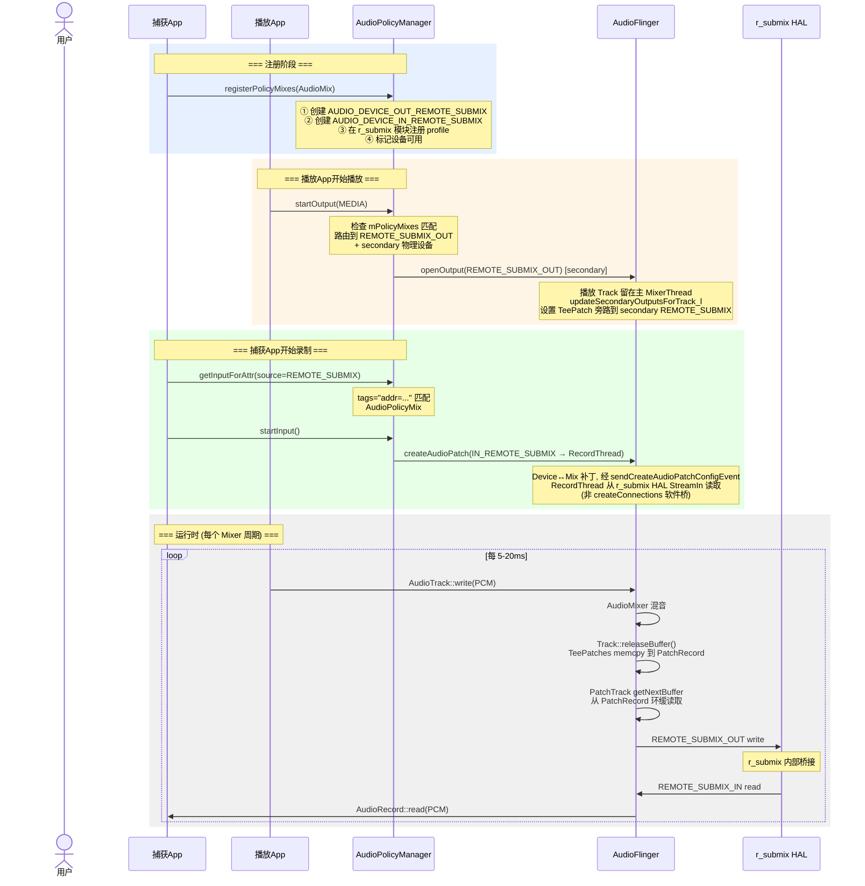

+++
date = '2026-06-07T10:22:54+08:00'
draft = false
title = 'Android 13 AudioPlaybackCapture 技术原理与实现
+++


## 1. 概述

**AudioPlaybackCapture** 是 Android 10 (API 29) 引入的 API,允许 App 捕获其他 App 正在播放的音频。典型场景包括:

- 屏幕录制时同时录制内部音频 (SystemUI 的 ScreenRecord)
- 音乐律动可视化 (将播放的音频送入分析算法)
- 游戏直播时捕获游戏音效

**技术方案核心思路**: 通过 **Remote Submix 虚拟音频设备** + **AudioPolicy 动态策略路由** + **AudioFlinger 软件音频补丁** 三层协作,将播放音频流环回 (loopback) 到录制端,中间通过共享环形缓冲区实现高效的零拷贝传递。

```
捕获App                       播放App
  │                            │
  │ AudioRecord                │ AudioTrack
  │ source=REMOTE_SUBMIX       │ usage=MEDIA
  │                            │
  ▼                            ▼
┌──────────────────────────────────────────────────────┐
│                 AudioPolicyManager                    │
│                                                      │
│  registerPolicyMixes()  ←── AudioMix                 │
│  startOutput()          →  路由到 REMOTE_SUBMIX_OUT  │
│  startInput()           →  从 REMOTE_SUBMIX_IN 录制   │
└──────────────────────────┬───────────────────────────┘
                           │
                           ▼
┌──────────────────────────────────────────────────────┐
│                   AudioFlinger                       │
│                                                      │
│  主 MixerThread (播放 Track 所在, 非 Duplicating)     │
│    └─ Track::releaseBuffer() → interceptBuffer()     │
│         └─ TeePatches: memcpy → PatchRecord 环缓 ────┐│
│                                                      ││
│  REMOTE_SUBMIX MixerThread                           ││
│    └─ PatchTrack ←── 共享环缓 ───────────────────────┘│
│         └─ Mixer → HAL StreamOut                     │
│                                                      │
│  RecordThread ← HAL StreamIn                         │
│    └─ AudioRecord::read() → 捕获App                  │
└──────────────────────┬───────────────────────────────┘
                       │
                       ▼
┌──────────────────────────────────────────────────────┐
│    r_submix HAL (虚拟软件模块, 非真实硬件)             │
│    StreamOut ──→ StreamIn (进程内软件 pipe)           │
└──────────────────────────────────────────────────────┘
```

---

## 2. 技术原理 — 源码逐层分析

### 2.1 Java API 层: 从 Builder 到 AudioRecord

#### 2.1.1 入口: `AudioRecord.Builder.build()`

**源码** `frameworks/base/media/java/android/media/AudioRecord.java:907`:

```java
public AudioRecord build() throws UnsupportedOperationException {
    if (mAudioPlaybackCaptureConfiguration != null) {
        return buildAudioPlaybackCaptureRecord();  // 走捕获路径
    }
    // ... 普通录音路径
}
```

当 Builder 上设置了 `AudioPlaybackCaptureConfiguration` 时,走的是 `buildAudioPlaybackCaptureRecord()` 分支,而非普通录音路径。

#### 2.1.2 核心: `buildAudioPlaybackCaptureRecord()`

**源码** `frameworks/base/media/java/android/media/AudioRecord.java:769`:

```java
private @NonNull AudioRecord buildAudioPlaybackCaptureRecord() {
    // =====================================================
    // Step 1: 将匹配规则 + 格式封装成 AudioMix
    // =====================================================
    AudioMix audioMix = mAudioPlaybackCaptureConfiguration.createAudioMix(mFormat);

    // =====================================================
    // Step 2: 创建 AudioPolicy 并注册到系统
    // =====================================================
    MediaProjection projection = mAudioPlaybackCaptureConfiguration.getMediaProjection();
    AudioPolicy audioPolicy = new AudioPolicy.Builder(/*context=*/ null)
            .setMediaProjection(projection)   // 绑定用户授权
            .addMix(audioMix)                // 添加混音规则
            .build();

    int error = AudioManager.registerAudioPolicyStatic(audioPolicy);
    //   ↓ Binder 调用
    //   IAudioService.registerAudioPolicy()
    //   → AudioPolicyService
    //   → AudioPolicyManager.registerPolicyMixes()

    // =====================================================
    // Step 3: 从已注册的 AudioPolicy 创建 AudioRecord
    // =====================================================
    AudioRecord record = audioPolicy.createAudioRecordSink(audioMix);

    // =====================================================
    // Step 4: 绑定生命周期 — AudioRecord 释放时自动注销
    // =====================================================
    record.unregisterAudioPolicyOnRelease(audioPolicy);
    return record;
}
```

#### 2.1.3 AudioMix 的创建和标志位

**源码** `frameworks/base/media/java/android/media/AudioPlaybackCaptureConfiguration.java:131`:

```java
@NonNull AudioMix createAudioMix(@NonNull AudioFormat audioFormat) {
    return new AudioMix.Builder(mAudioMixingRule)
            .setFormat(audioFormat)
            .setRouteFlags(AudioMix.ROUTE_FLAG_LOOP_BACK | AudioMix.ROUTE_FLAG_RENDER)
            .build();
}
```

两个关键标志位:

| 标志 | 值 | 含义 |
|------|----|------|
| `ROUTE_FLAG_RENDER` | 0x1 | 同时继续渲染到物理设备(扬声器) |
| `ROUTE_FLAG_LOOP_BACK` | 0x2 (`0x1 << 1`) | 音频环回到录制输入端 |

如果只设置 `LOOP_BACK` 不设置 `RENDER`,用户将听不到正在播放的音频(静默捕获)。

#### 2.1.4 `createAudioRecordSink()` — 创建与 AudioMix 关联的 AudioRecord

**源码** `frameworks/base/media/java/android/media/audiopolicy/AudioPolicy.java:776`:

```java
public AudioRecord createAudioRecordSink(AudioMix mix) {
    // ★ 关键: AudioAttributes.source = REMOTE_SUBMIX (8)
    //         tags = "addr=<mixAddress>" 用于匹配 AudioPolicyMix
    AudioAttributes.Builder ab = new AudioAttributes.Builder()
            .setInternalCapturePreset(MediaRecorder.AudioSource.REMOTE_SUBMIX)  // source = 8
            .addTag(addressForTag(mix))           // tags = "addr=..."
            .addTag(AudioRecord.SUBMIX_FIXED_VOLUME);

    AudioFormat mixFormat = new AudioFormat.Builder(mix.getFormat())
            .setChannelMask(AudioFormat.inChannelMaskFromOutChannelMask(
                    mix.getFormat().getChannelMask()))
            .build();

    AudioRecord ar = new AudioRecord(ab.build(), mixFormat, bufferSize, sessionId);
    return ar;
}
```

**设计巧妙之处**: `AudioAttributes.source = REMOTE_SUBMIX` + `tags = "addr=..."` 构成了一个"身份标识",使得 `AudioPolicyManager.getInputForAttr()` 在 Native 层能够将此录音请求与之前注册的 `AudioPolicyMix` 精确匹配。

#### 2.1.5 AudioPolicy 注册到系统

**源码** `frameworks/base/media/java/android/media/AudioManager.java:5127`:

```java
static int registerAudioPolicyStatic(@NonNull AudioPolicy policy) {
    IAudioService service = getService();
    String regId = service.registerAudioPolicy(policy.getConfig(), policy.cb(),
            policy.hasFocusListener(), policy.isFocusPolicy(), policy.isTestFocusPolicy(),
            policy.isVolumeController(),
            projection == null ? null : projection.getProjection());
    // → Binder → AudioPolicyService → AudioPolicyManager.registerPolicyMixes()
}
```

### 2.2 AudioPolicyManager 层: 策略路由与设备管理

#### 2.2.1 `registerPolicyMixes()` — 创建虚拟 REMOTE_SUBMIX 设备

**源码** `frameworks/av/services/audiopolicy/managerdefault/AudioPolicyManager.cpp:3651`:

```cpp
status_t AudioPolicyManager::registerPolicyMixes(const Vector<AudioMix>& mixes) {
    for (size_t i = 0; i < mixes.size(); i++) {
        AudioMix mix = mixes[i];

        // 安全检查: 只允许 MIX_TYPE_PLAYERS 使用 LOOP_BACK
        if (is_mix_loopback_render(mix.mRouteFlags) && mix.mMixType != MIX_TYPE_PLAYERS) {
            return INVALID_OPERATION;
        }

        if ((mix.mRouteFlags & MIX_ROUTE_FLAG_LOOP_BACK) == MIX_ROUTE_FLAG_LOOP_BACK) {
            // ① 获取 r_submix HAL 模块
            sp<HwModule> rSubmixModule = mHwModules.getModuleFromName(
                    AUDIO_HARDWARE_MODULE_ID_REMOTE_SUBMIX);  // "r_submix"

            // ② 根据 mix 类型决定设备方向
            if (mix.mMixType == MIX_TYPE_PLAYERS) {
                mix.mDeviceType = AUDIO_DEVICE_OUT_REMOTE_SUBMIX;        // 0x8000
                deviceTypeToMakeAvailable = AUDIO_DEVICE_IN_REMOTE_SUBMIX; // 0x80000100
            } else {
                mix.mDeviceType = AUDIO_DEVICE_IN_REMOTE_SUBMIX;
                deviceTypeToMakeAvailable = AUDIO_DEVICE_OUT_REMOTE_SUBMIX;
            }

            // ③ 在 r_submix 模块上注册输入/输出 profile
            //    告诉 AudioFlinger: 这个模块支持此格式的流
            audio_config_t outputConfig = mix.mFormat;
            outputConfig.channel_mask = AUDIO_CHANNEL_OUT_STEREO; // AF mixer 不支持 mono
            rSubmixModule->addOutputProfile(address, &outputConfig,
                    AUDIO_DEVICE_OUT_REMOTE_SUBMIX, address);
            rSubmixModule->addInputProfile(address, &inputConfig,
                    AUDIO_DEVICE_IN_REMOTE_SUBMIX, address);

            // ④ 标记设备为可用状态
            setDeviceConnectionStateInt(deviceTypeToMakeAvailable,
                    AUDIO_POLICY_DEVICE_STATE_AVAILABLE,
                    address, "remote-submix", AUDIO_FORMAT_DEFAULT);

            // ⑤ 注册到 mPolicyMixes 集合
            mPolicyMixes.registerMix(mix, 0 /*output desc*/);
        }
    }
}
```

> 注: 上述 ①–⑤ 为逻辑示意;源码中 `mPolicyMixes.registerMix()` 实际在 `addOutputProfile / setDeviceConnectionStateInt` **之前**调用(`AudioPolicyManager.cpp:3694`)。

**注册后的系统状态**:
```
mAvailableOutputDevices: [..., AUDIO_DEVICE_OUT_REMOTE_SUBMIX (addr="<mixAddr>")]
mAvailableInputDevices:  [..., AUDIO_DEVICE_IN_REMOTE_SUBMIX  (addr="<mixAddr>")]
mPolicyMixes:            [AudioMix{routeFlags=LOOP_BACK|RENDER,
                                    deviceType=REMOTE_SUBMIX_OUT,
                                    mMixType=PLAYERS, criteria=[...]}]
```

#### 2.2.2 `startOutput()` — 播放流路由到 REMOTE_SUBMIX

**源码** `frameworks/av/services/audiopolicy/managerdefault/AudioPolicyManager.cpp:2289`:

```cpp
// 当被匹配到的 App 开始播放时:
sp<AudioPolicyMix> policyMix = outputDesc->mPolicyMix.promote();
if (policyMix != nullptr) {
    if ((policyMix->mRouteFlags & MIX_ROUTE_FLAG_LOOP_BACK) == MIX_ROUTE_FLAG_LOOP_BACK) {
        // ★ 输出目标变为 REMOTE_SUBMIX, 而非物理设备
        newDeviceType = AUDIO_DEVICE_OUT_REMOTE_SUBMIX;
    }
    sp<DeviceDescriptor> device = mAvailableOutputDevices.getDevice(
            newDeviceType, String8(address), AUDIO_FORMAT_DEFAULT);
    devices.add(device);
}
```

由于 AudioMix 设置了 `ROUTE_FLAG_LOOP_BACK | ROUTE_FLAG_RENDER`,该 mix 属于 **loopback render** 类型。源码 `AudioPolicyMix.cpp:176` 中 `primaryOutputMix = !is_mix_loopback_render(...)`,因此 loopback render mix **不是** primary,而是被加入 secondary。`AudioPolicyManager.getOutputForAttr()` 返回:
- **primary output**: 物理扬声器设备 (USAGE_MEDIA 正常路由,用户继续听到声音)
- **secondary output**: `AUDIO_DEVICE_OUT_REMOTE_SUBMIX` (loopback 目标,经 TeePatch 旁路)

AudioFlinger 随后通过 `updateSecondaryOutputsForTrack_l()` 为播放 Track 设置 **TeePatch**,将音频旁路复制到 secondary 的 REMOTE_SUBMIX 线程;播放 Track 本身仍留在其主 `MixerThread` 上(**不是** `DuplicatingThread`,二者是互斥的两套机制)。

#### 2.2.3 `getInputForAttr()` — 录制请求与 AudioPolicyMix 匹配

**源码** `frameworks/av/services/audiopolicy/managerdefault/AudioPolicyManager.cpp:2644`:

```cpp
status_t AudioPolicyManager::getInputForAttr(...) {

    // ★ 通过 source + tags 精确匹配到之前注册的 AudioPolicyMix
    if (attributes.source == AUDIO_SOURCE_REMOTE_SUBMIX &&
            strncmp(attributes.tags, "addr=", strlen("addr=")) == 0) {

        // 从 mPolicyMixes 中查找匹配的 AudioMix (通过 address)
        status = mPolicyMixes.getInputMixForAttr(attributes, &policyMix);

        // 获取对应的 RemoteSubmix 输入设备
        device = mAvailableInputDevices.getDevice(
                AUDIO_DEVICE_IN_REMOTE_SUBMIX,
                String8(attr->tags + strlen("addr=")),  // 提取 address
                AUDIO_FORMAT_DEFAULT);

        if (is_mix_loopback_render(policyMix->mRouteFlags)) {
            *inputType = API_INPUT_MIX_PUBLIC_CAPTURE_PLAYBACK;
        }
    }

    // 打开输入流: 找到 r_submix 模块上的输入 profile,调用 AudioFlinger.openInput()
    *input = getInputForDevice(device, session, attributes, config, flags, policyMix);
}
```

#### 2.2.4 `startInput()` — 启动录制,创建音频补丁

**源码** `frameworks/av/services/audiopolicy/managerdefault/AudioPolicyManager.cpp:3007`:

```cpp
status_t AudioPolicyManager::startInput(audio_port_handle_t portId) {
    sp<DeviceDescriptor> device = getNewInputDevice(inputDesc); // = REMOTE_SUBMIX_IN

    // ★ 创建音频补丁: 将 REMOTE_SUBMIX_IN 设备连接到 RecordThread
    status = setInputDevice(input, device, true /*force*/, &newpatchHandle);
    // → installPatch() → mpClientInterface->createAudioPatch()
    // → AudioFlinger::createAudioPatch() → PatchPanel

    // RemoteSubmix 特殊处理: 自动启用对应的输出端
    if (audio_is_remote_submix_device(inputDesc->getDeviceType())) {
        if (policyMix->mMixType == MIX_TYPE_PLAYERS) {
            setDeviceConnectionStateInt(AUDIO_DEVICE_OUT_REMOTE_SUBMIX,
                    AUDIO_POLICY_DEVICE_STATE_AVAILABLE,
                    address, "remote-submix", AUDIO_FORMAT_DEFAULT);
        }
    }
}
```

### 2.3 AudioFlinger 层: 软件音频补丁与零拷贝数据传输

> **重要范围说明**: 下面 2.3.1 / 2.3.2 描述的 `PatchPanel::createAudioPatch() → createConnections`(`openOutput_l`/`openInput_l` + PatchTrack↔PatchRecord 软件桥)是 AudioFlinger **通用**的软件补丁机制,仅在 **device→device 跨 HW 模块** 或 **num_sources==2** 时触发(`PatchPanel.cpp:234`)。**AudioPlaybackCapture 的实际数据通路并不走 `createConnections`**:REMOTE_SUBMIX 捕获产生的是 Device↔Mix 补丁(经 `sendCreateAudioPatchConfigEvent`,`PatchPanel.cpp:347`),其两段数据传递是 **TeePatch(见 2.3.3)+ r_submix HAL 内部 pipe(见 2.4)**。故 2.3.1 / 2.3.2 仅作机制背景,真正的捕获链路以 **2.4 节** 为准。

#### 2.3.1 `PatchPanel::createAudioPatch()` — 创建软件桥接

**源码** `frameworks/av/services/audioflinger/PatchPanel.cpp:135`:

当 source 和 sink 设备跨越不同 HW 模块,或 HAL 不支持硬件补丁时,AudioFlinger 创建软件桥接:

```cpp
status_t PatchPanel::createAudioPatch(const struct audio_patch *patch, ...) {
    // 判断是否需要软件补丁:
    // - num_sources == 2 (复用已有输出混音)
    // - src & sink 跨 HW 模块
    // - HAL 不支持音频补丁创建

    if (需要软件补丁) {
        // ① 打开 PlaybackThread → AUDIO_DEVICE_OUT_REMOTE_SUBMIX
        sp<ThreadBase> thread = mAudioFlinger.openOutput_l(
                module, &output, &config, &mixerConfig,
                outputDevice, outputDeviceAddress, flags);
        newPatch.mPlayback.setThread(reinterpret_cast<PlaybackThread*>(thread.get()));

        // ② 打开 RecordThread ← AUDIO_DEVICE_IN_REMOTE_SUBMIX
        sp<ThreadBase> recThread = mAudioFlinger.openInput_l(
                srcModule, &input, &config,
                device, address, source, flags,
                outputDevice, outputDeviceAddress);
        newPatch.mRecord.setThread(reinterpret_cast<RecordThread*>(recThread.get()));

        // ③ 创建 PatchTrack ↔ PatchRecord 连接
        status = newPatch.createConnections(this);
    }
}
```

#### 2.3.2 `createConnections()` — 核心: PatchTrack 与 PatchRecord 配对

**源码** `frameworks/av/services/audioflinger/PatchPanel.cpp:469`:

```cpp
status_t Patch::createConnections(PatchPanel *panel) {

    // ==============================================
    // Step 1: 创建 PatchRecord (录音端,生产者)
    // ==============================================
    // buffer=nullptr, bufferSize=0
    // → 构造函数内部自己分配 ClientProxy 环形缓冲区
    sp<RecordThread::PatchRecord> tempRecordTrack = new PatchRecord(
            mRecord.thread().get(),
            sampleRate, inChannelMask, format,
            frameCount,
            nullptr,     // ★ 自己分配
            0,           // ★ 自己分配
            inputFlags, {}, source);

    // ==============================================
    // Step 2: 创建 PatchTrack (播放端,消费者)
    //         ★★★ 关键: 使用 PatchRecord 的 buffer! ★★★
    // ==============================================
    sp<PlaybackThread::PatchTrack> tempPatchTrack = new PatchTrack(
            mPlayback.thread().get(),
            streamType, sampleRate, outChannelMask, format,
            frameCount,
            tempRecordTrack->buffer(),       // ★ 指向同一块共享内存
            tempRecordTrack->bufferSize(),   // ★ 同一大小
            outputFlags, {}, frameCountToBeReady);

    // ==============================================
    // Step 3: 双向绑定 Peer Proxy 关系
    // ==============================================
    // PatchRecord.mPeerProxy → PatchTrack
    // PatchTrack.mPeerProxy  → PatchRecord
    mRecord.setTrackAndPeer(tempRecordTrack, tempPatchTrack,
                            !usePassthruPatchRecord);
    mPlayback.setTrackAndPeer(tempPatchTrack, tempRecordTrack,
                              true /*holdReference*/);

    // ==============================================
    // Step 4: 启动两端
    // ==============================================
    mRecord.track()->start(AudioSystem::SYNC_EVENT_NONE, AUDIO_SESSION_NONE);
    mPlayback.track()->start();
}
```

#### 2.3.3 TeePatches 机制 — 音频分流

当 `ROUTE_FLAG_LOOP_BACK | ROUTE_FLAG_RENDER` 时,播放 App 的 Track 仍创建在其**主 `MixerThread`(PlaybackThread)** 上(并非 `DuplicatingThread`)。AudioFlinger 通过 `updateSecondaryOutputsForTrack_l()` 为每个 Track 设置 TeePatches,把音频旁路到 secondary 的 REMOTE_SUBMIX 线程:

**源码** `frameworks/av/services/audioflinger/AudioFlinger.cpp:3710`:

```cpp
void AudioFlinger::updateSecondaryOutputsForTrack_l(
        PlaybackThread::Track* track,
        PlaybackThread* thread,
        const std::vector<audio_io_handle_t> &secondaryOutputs) const {

    for (audio_io_handle_t secondaryOutput : secondaryOutputs) {
        // secondaryOutput = REMOTE_SUBMIX 输出的 MixerThread

        // 创建 PatchRecord (独立的环形缓冲区)
        sp patchRecord = new PatchRecord(nullptr /*不绑定特定线程*/,
                track->sampleRate(), inChannelMask, track->format(),
                frameCount, nullptr, 0, AUDIO_INPUT_FLAG_DIRECT, 0ns);

        // 创建 PatchTrack (在 REMOTE_SUBMIX 的 MixerThread 中)
        // ★ 复用 PatchRecord 的 buffer
        sp patchTrack = new PatchTrack(secondaryThread,
                track->streamType(), track->sampleRate(),
                track->channelMask(), track->format(),
                frameCount,
                patchRecord->buffer(),      // ★ 共享内存
                patchRecord->bufferSize(),  // ★ 共享大小
                outputFlags, 0ns, frameCountToBeReady);

        // 绑定 peer
        patchTrack->setPeerProxy(patchRecord, true);
        patchRecord->setPeerProxy(patchTrack, false);

        teePatches.push_back({patchRecord, patchTrack});
    }
    track->setTeePatches(std::move(teePatches));
}
```

**运行时**,每个 Mixer 周期,Track 在 `releaseBuffer()` 时通过 TeePatches 将数据写入 PatchRecord:

**源码** `frameworks/av/services/audioflinger/Tracks.cpp:1005`:

```cpp
// Track::releaseBuffer() → TeePatches 分流:
for (auto& teePatch : mTeePatches) {
    RecordThread::PatchRecord* patchRecord = teePatch.patchRecord.get();
    // 将混音后的 PCM 数据 memcpy 到 PatchRecord 的环形缓冲区
    const size_t framesWritten = patchRecord->writeFrames(
            sourceBuffer.i8, frameCount, mFrameSize);
}
```

#### 2.3.4 PatchRecord::writeFrames() — 写入共享环形缓冲区

**源码** `frameworks/av/services/audioflinger/Tracks.cpp:2885`:

```cpp
size_t PatchRecord::writeFrames(
        AudioBufferProvider* dest, const void* src,
        size_t frameCount, size_t frameSize) {
    // ① 从 ClientProxy 获取可写区域
    AudioBufferProvider::Buffer patchBuffer;
    patchBuffer.frameCount = frameCount;
    dest->getNextBuffer(&patchBuffer);

    // ② memcpy 音频数据到共享环形缓冲区
    memcpy(patchBuffer.raw, src, patchBuffer.frameCount * frameSize);

    // ③ 释放 buffer,推进写指针 (mRear)
    dest->releaseBuffer(&patchBuffer);
    return framesWritten;
}
```

> 注: 上面 ①②③ 的实际实现位于静态辅助函数 `writeFramesHelper()`(`Tracks.cpp:2866`);`PatchRecord::writeFrames()`(2885)只是调用它(必要时调用两次,以处理环形缓冲区 wrap-around 的尾部数据)。

#### 2.3.5 PatchTrack::getNextBuffer() — 从共享环形缓冲区读取

**源码** `frameworks/av/services/audioflinger/Tracks.cpp:2284`:

```cpp
status_t PatchTrack::getNextBuffer(AudioBufferProvider::Buffer* buffer) {
    Proxy::Buffer buf;
    buf.mFrameCount = buffer->frameCount;

    // ★ 从 peer (PatchRecord) 的环缓获取有数据的帧
    status_t status = mPeerProxy->obtainBuffer(&buf, &mPeerTimeout);

    buffer->frameCount = buf.mFrameCount;
    if (buf.mFrameCount == 0) {
        return WOULD_BLOCK;  // PatchRecord 还没写入数据
    }
    // 获取 PatchTrack 自己的物理 buffer
    status = Track::getNextBuffer(buffer);
    return status;
}
```

### 2.4 运行时完整数据流

> **关键纠正**: `PatchRecord` 在 TeePatches 路径中 `thread = nullptr`（源码 `AudioFlinger.cpp:3758`），它**不属于任何 RecordThread**。PatchRecord 只是一个独立的环形缓冲区，充当主 `MixerThread`(播放 Track 所在,**非** `DuplicatingThread`)和 REMOTE_SUBMIX MixerThread 之间的数据中转站。

数据经过**两段**传递到达录制 App:

```
时间轴 → (每个 Mixer 周期, ~5-20ms)

┌──────────────────────────────────────────────────────────────┐
│ 主 MixerThread (PlaybackThread, 所有播放 Track 所在)          │
│                                                              │
│  ① AudioMixer::process() — 混音所有 Track                    │
│  ② 混音结果写入 primary HAL 输出 (物理扬声器)                 │
│                                                              │
│  ③ Track::releaseBuffer() → interceptBuffer()                │
│      [源码 Tracks.cpp:1002]                                  │
│      for (auto& teePatch : mTeePatches) {                    │
│          // 将同一份混音好的 PCM 直接 memcpy 到               │
│          // PatchRecord 的环形缓冲区 (ClientProxy)             │
│          patchRecord->writeFrames(src, frames, frameSize);    │
│        }                                                     │
└─────────────────────┬────────────────────────────────────────┘
                      │
          ┌───────────┘
          │  ★ 第一段: AudioFlinger 内部共享内存传递 (无 HAL 参与)
          │    PatchRecord (thread=nullptr, 独立环形缓冲区)
          │      └─ 与 PatchTrack 共享同一个 ClientProxy
          ▼
┌──────────────────────────────────────────────────────────────┐
│ REMOTE_SUBMIX MixerThread (secondary output)                 │
│                                                              │
│  ④ AudioMixer::process():                                    │
│      PatchTrack::getNextBuffer(buffer)                       │
│        → mPeerProxy->obtainBuffer()                          │
│          → PatchRecord::obtainBuffer()                        │
│            → ClientProxy::obtainBuffer() ← 从共享环缓读       │
│      ... PatchTrack 作为 Mixer 的一个输入源混音 ...           │
│                                                              │
│  ⑤ 混音结果写入 HAL StreamOut → AUDIO_DEVICE_OUT_REMOTE_SUBMIX│
└─────────────────────┬────────────────────────────────────────┘
                      │
          ┌───────────┘
          │  ★ 第二段: r_submix HAL 内部桥接 (虚拟软件模块, 非真实硬件)
          │    HAL StreamOut ──→ HAL StreamIn
          │    本质是 r_submix 模块内部的软件 pipe
          ▼
┌──────────────────────────────────────────────────────────────┐
│ RecordThread (REMOTE_SUBMIX 输入)                            │
│                                                              │
│  ⑥ HAL StreamIn::read() — 从 r_submix 获取数据                │
│  ⑦ 写入 RecordTrack 的 ClientProxy 环形缓冲区                 │
│  ⑧ 通知客户端: 数据可读                                      │
└─────────────────────┬────────────────────────────────────────┘
                      │
                      ▼
              App AudioRecord::read()
              → 获得 PCM 数据, 送入音乐律动算法
```

**两段数据传递总结**:

| 段 | 路径 | 机制 | HAL 参与? |
|----|------|------|-----------|
| 第一段 | 主 MixerThread → REMOTE_SUBMIX MixerThread | PatchRecord/PatchTrack 共享 `ClientProxy` 环形缓冲区, `memcpy` | **否** — 纯 AudioFlinger 进程内共享内存 |
| 第二段 | REMOTE_SUBMIX MixerThread → RecordThread | r_submix HAL StreamOut→StreamIn, 软件模块内部转发 | **是** — 但 r_submix 是纯软件的虚拟 HAL, 非硬件 |

**为什么需要第二段经 HAL?** 因为录制 App 通过 `AudioRecord` 读取数据时,数据必须来自 `RecordThread`,而 `RecordThread` 只能从 HAL StreamIn 获得数据。所以即使 r_submix 是虚拟的,它作为标准 HAL 模块提供了 Output→Input 的桥接,使得 RecordThread 可以"看到"播放端的数据。

### 2.5 安全控制机制

#### 2.5.1 MediaProjection 授权

```java
// App 需要用户显式授权
MediaProjectionManager mgr = (MediaProjectionManager)
        getSystemService(MEDIA_PROJECTION_SERVICE);
startActivityForResult(mgr.createScreenCaptureIntent(), REQUEST_CODE);
```

#### 2.5.2 被录制方声明

```xml
<!-- 被录制 App 的 AndroidManifest.xml -->
<application android:allowAudioPlaybackCapture="true">
```

#### 2.5.3 敏感音频自动排除

**源码** `frameworks/av/services/audiopolicy/common/managerdefinitions/src/AudioPolicyMix.cpp:228`:

```cpp
// 以下音频不会被捕获:
// 1. 非媒体/游戏用途: 闹钟、通知、系统音等
if (!(usage == AUDIO_USAGE_UNKNOWN || usage == AUDIO_USAGE_MEDIA ||
      usage == AUDIO_USAGE_GAME || usage == AUDIO_USAGE_VOICE_COMMUNICATION))
    return NO_MATCH;

// 2. 带 NO_SYSTEM_CAPTURE 标志的
if (hasFlag(attributes.flags, AUDIO_FLAG_NO_SYSTEM_CAPTURE))
    return NO_MATCH;

// 3. 语音通话 (默认排除)
if (attributes.usage == AUDIO_USAGE_VOICE_COMMUNICATION) {
    if (!mix->mVoiceCommunicationCaptureAllowed)
        return NO_MATCH;
}
```

#### 2.5.4 权限检查

**源码** `frameworks/av/media/utils/ServiceUtilities.cpp:414`:

```cpp
// 检查捕获方是否有权限
auto status = mPackageManager->isAudioPlaybackCaptureAllowed(packageNames, &isAllowed);
```

---

## 3. 完整时序图



---

## 4. 最简单的 App 实现

### 4.1 被录制的播放端 App

只需在 `AndroidManifest.xml` 中声明允许捕获:

```xml
<!-- AndroidManifest.xml (播放端 App) -->
<application
    android:allowAudioPlaybackCapture="true"
    ...>
</application>
```

播放代码无特殊要求,普通的 `AudioTrack` 或 `MediaPlayer` 即可:

```java
// 任意播放代码,例如:
MediaPlayer player = MediaPlayer.create(this, R.raw.music);
player.start();
```

### 4.2 录制端 App — 完整代码

#### AndroidManifest.xml

```xml
<manifest xmlns:android="http://schemas.android.com/apk/res/android"
    package="com.example.audiocapture">

    <!-- 录音权限 -->
    <uses-permission android:name="android.permission.RECORD_AUDIO" />
    <!-- 前台服务 (Android 10+ 录制需要) -->
    <uses-permission android:name="android.permission.FOREGROUND_SERVICE" />

    <application>
        <!-- 声明前台服务类型 -->
        <service
            android:name=".CaptureService"
            android:foregroundServiceType="mediaProjection" />

        <activity
            android:name=".MainActivity"
            android:exported="true">
            <intent-filter>
                <action android:name="android.intent.action.MAIN" />
                <category android:name="android.intent.category.LAUNCHER" />
            </intent-filter>
        </activity>
    </application>
</manifest>
```

#### MainActivity.java

```java
package com.example.audiocapture;

import android.app.Activity;
import android.content.Context;
import android.content.Intent;
import android.media.AudioAttributes;
import android.media.AudioFormat;
import android.media.AudioPlaybackCaptureConfiguration;
import android.media.AudioRecord;
import android.media.projection.MediaProjection;
import android.media.projection.MediaProjectionManager;
import android.os.Bundle;
import android.util.Log;
import androidx.annotation.Nullable;

public class MainActivity extends Activity {

    private static final String TAG = "AudioCapture";
    private static final int REQUEST_MEDIA_PROJECTION = 1;

    private MediaProjectionManager mProjectionManager;

    @Override
    protected void onCreate(@Nullable Bundle savedInstanceState) {
        super.onCreate(savedInstanceState);

        // 启动 MediaProjection 授权流程
        mProjectionManager = (MediaProjectionManager)
                getSystemService(Context.MEDIA_PROJECTION_SERVICE);
        startActivityForResult(
                mProjectionManager.createScreenCaptureIntent(),
                REQUEST_MEDIA_PROJECTION);
    }

    @Override
    protected void onActivityResult(int requestCode, int resultCode, @Nullable Intent data) {
        super.onActivityResult(requestCode, resultCode, data);

        if (requestCode == REQUEST_MEDIA_PROJECTION && resultCode == RESULT_OK) {
            MediaProjection projection = mProjectionManager.getMediaProjection(resultCode, data);
            startCapture(projection);
        }
    }

    private void startCapture(MediaProjection projection) {

        // ================================================================
        // Step 1: 构建 AudioPlaybackCaptureConfiguration
        // ================================================================
        AudioPlaybackCaptureConfiguration config =
                new AudioPlaybackCaptureConfiguration.Builder(projection)
                        .addMatchingUsage(AudioAttributes.USAGE_MEDIA)    // 捕获媒体播放
                        .addMatchingUsage(AudioAttributes.USAGE_GAME)     // 捕获游戏音效
                        .addMatchingUsage(AudioAttributes.USAGE_UNKNOWN)  // 捕获未知用途
                        .build();

        // ================================================================
        // Step 2: 构建 AudioFormat
        // ================================================================
        AudioFormat audioFormat = new AudioFormat.Builder()
                .setEncoding(AudioFormat.ENCODING_PCM_16BIT)
                .setSampleRate(48000)       // 48kHz
                .setChannelMask(AudioFormat.CHANNEL_IN_STEREO)
                .build();

        // ================================================================
        // Step 3: 构建 AudioRecord
        // ================================================================
        int minBufferSize = AudioRecord.getMinBufferSize(
                audioFormat.getSampleRate(),
                audioFormat.getChannelMask(),
                audioFormat.getEncoding());

        AudioRecord audioRecord = new AudioRecord.Builder()
                .setAudioPlaybackCaptureConfig(config)  // ★ 设置捕获配置
                .setAudioFormat(audioFormat)
                .setBufferSizeInBytes(minBufferSize * 2)
                .build();

        // ================================================================
        // Step 4: 启动录制并读取数据
        // ================================================================
        audioRecord.startRecording();

        // 在新线程中循环读取
        new Thread(() -> {
            short[] buffer = new short[minBufferSize / 2]; // minBufferSize 为字节数, 16-bit = 2 bytes/采样
            while (!Thread.currentThread().isInterrupted()) {
                // 注意: read(short[], ...) 返回的是读取到的 short(采样点)数, 不是帧数
                //       帧数 = 采样点数 / 声道数
                int samplesRead = audioRecord.read(
                        buffer, 0, buffer.length,
                        AudioRecord.READ_BLOCKING);

                if (samplesRead > 0) {
                    // ★ buffer 中就是捕获到的音频 PCM 数据
                    // 送入音乐律动算法处理:
                    // myRhythmAnalyzer.processAudio(buffer, samplesRead);
                    Log.d(TAG, "Captured " + samplesRead + " samples");
                }
            }
        }).start();
    }
}
```

#### 前台服务 (Android 10+ 必需)

```java
package com.example.audiocapture;

import android.app.Notification;
import android.app.NotificationChannel;
import android.app.NotificationManager;
import android.app.Service;
import android.content.Intent;
import android.os.IBinder;

public class CaptureService extends Service {
    @Override
    public int onStartCommand(Intent intent, int flags, int startId) {
        // 必须显示一个持续性通知
        NotificationChannel channel = new NotificationChannel(
                "capture", "Audio Capture",
                NotificationManager.IMPORTANCE_LOW);
        getSystemService(NotificationManager.class).createNotificationChannel(channel);

        Notification notification = new Notification.Builder(this, "capture")
                .setContentTitle("正在捕获音频")
                .setSmallIcon(android.R.drawable.ic_media_play)
                .build();

        startForeground(1, notification);
        return START_STICKY;
    }

    @Override
    public IBinder onBind(Intent intent) { return null; }
}
```

### 4.3 注意事项

| 事项 | 说明 |
|------|------|
| **MediaProjection 用户授权** | 必须通过 `createScreenCaptureIntent()` 弹窗让用户确认,无法静默获取 |
| **被录制 App 声明** | 目标 App 必须在 `AndroidManifest.xml` 中 `android:allowAudioPlaybackCapture="true"`,否则静音 |
| **前台服务** | Android 10+ 录制需要前台服务,否则会抛出 `SecurityException` |
| **自动排除的音频** | 闹钟、通知、铃声、系统音、语音通话(默认)不会被捕获 |
| **最低 API Level** | API 29 (Android 10) |
| **系统权限** | 部分 OEM 可能需要 `MODIFY_AUDIO_ROUTING` 或系统签名 |

---

## 5. 关键源码索引

| 层级 | 文件 | 行号 | 内容 |
|------|------|------|------|
| Java API | `AudioRecord.java` | 769-787 | `buildAudioPlaybackCaptureRecord()` — 主流程入口 |
| Java API | `AudioRecord.java` | 907-909 | `build()` — 分支判断 |
| Java API | `AudioPlaybackCaptureConfiguration.java` | 131-135 | `createAudioMix()` — ROUTE_FLAG 设置 |
| Java API | `AudioPolicy.java` | 776-811 | `createAudioRecordSink()` — source=REMOTE_SUBMIX |
| Java API | `AudioManager.java` | 5127-5148 | `registerAudioPolicyStatic()` — Binder 调用 |
| Native Policy | `AudioPolicyManager.cpp` | 3651-3788 | `registerPolicyMixes()` — 创建虚拟设备 |
| Native Policy | `AudioPolicyManager.cpp` | 2289-2304 | `startOutput()` — 路由到 REMOTE_SUBMIX |
| Native Policy | `AudioPolicyManager.cpp` | 2644-2819 | `getInputForAttr()` — 匹配 AudioPolicyMix |
| Native Policy | `AudioPolicyManager.cpp` | 3007-3092 | `startInput()` — 启动录制 |
| Native AF | `PatchPanel.cpp` | 135-378 | `createAudioPatch()` — 软件补丁创建 |
| Native AF | `PatchPanel.cpp` | 469-631 | `createConnections()` — PatchTrack/PatchRecord 配对 |
| Native AF | `AudioFlinger.cpp` | 3710-3801 | `updateSecondaryOutputsForTrack_l()` — TeePatches |
| Native AF | `Tracks.cpp` | 1005-1025 | TeePatches `writeFrames()` — 分流写入 |
| Native AF | `Tracks.cpp` | 2284-2308 | `PatchTrack::getNextBuffer()` — 从 peer 读取 |
| Native AF | `Tracks.cpp` | 2885-2897 | `PatchRecord::writeFrames()` — memcpy 到环缓 |
| Native Policy | `AudioPolicyMix.cpp` | 228-250 | 匹配规则 — 排除敏感音频 |
| Native Utils | `ServiceUtilities.cpp` | 414-438 | `isAudioPlaybackCaptureAllowed()` |

---

## 6. 总结

AudioPlaybackCapture 通过以下三层协作实现"录制其他 App 的播放音频":

1. **AudioPolicyManager** 层负责**策略路由**: "谁可以被录制"由 `AudioMix` 的匹配规则决定,"录制到哪"由 `REMOTE_SUBMIX` 虚拟设备承载
2. **AudioFlinger PatchPanel** 层负责**数据搬运**: 通过 `PatchTrack` + `PatchRecord` + 共享 `ClientProxy` 环形缓冲区实现零拷贝的数据传递
3. **r_submix HAL** 层负责**设备抽象**: 提供标准的音频 HAL 接口,使播放端和录制端可以有不同的采样率/格式/缓冲区大小

对音乐律动场景,AudioPlaybackCapture 是标准方案:无需修改系统源码,通过公开 API 即可获取系统内其他 App 播放的音频 PCM 数据,直接送入律动分析算法。
