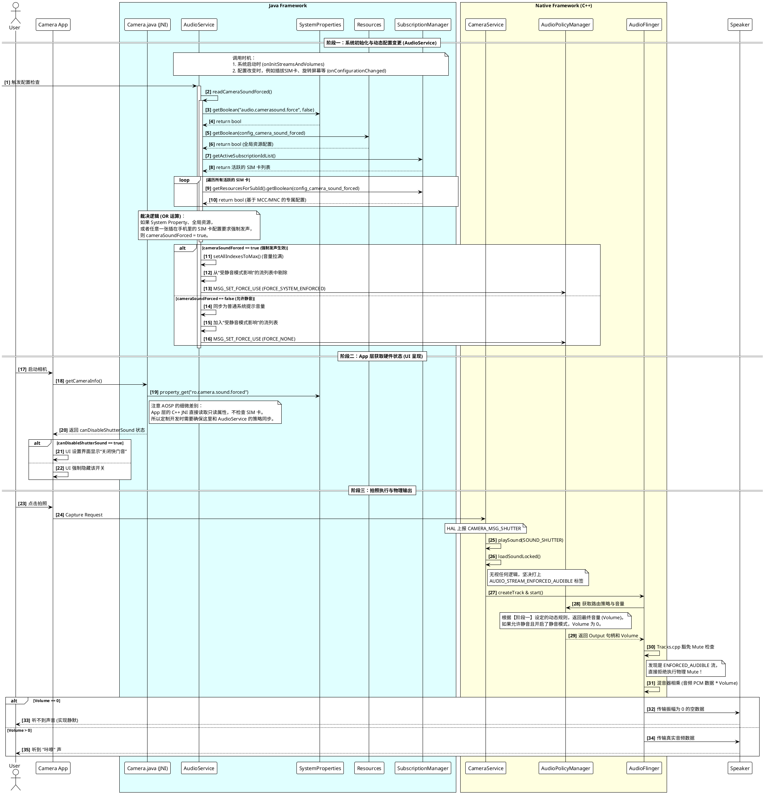

+++
date = '2025-08-08T11:36:11+08:00'
draft = false
title = 'AOSP Camera Click 音播放控制原理'
+++

# AOSP Camera Click 音播放控制原理 (Android 16)

**摘要**：在 Android (AOSP) 系统中，相机快门音（Camera Click / Shutter Sound）的播放机制并不像普通的媒体音频那样简单。为了满足部分国家或地区（如日韩）关于防止偷拍的法律法规，AOSP 设计了一套跨越 App 层、Java 音频服务层、Native 相机服务层以及底层音频引擎的**动态合规防静音机制**。

本 Wiki 详细剖析了 Android 16 下快门音的资源加载、UI 呈现、合规裁决以及底层硬件输出的完整生命周期。

---

## 核心设计哲学：关注点分离

整个快门音的控制逻辑遵循极度解耦的“关注点分离”原则：

* **CameraService (Native)**：只负责“无脑”发声。只要触发快门，必定按照最高优先级的强制流（`ENFORCED_AUDIBLE`）请求播放。
* **AudioService (Java)**：系统的“最高裁决者”。根据系统属性、配置文件、甚至插入的 SIM 卡（MCC/MNC）动态决定当前是否必须强制发声，并通过调整音量系数（Volume Index）和路由策略来控制最终物理扬声器的状态。
* **AudioFlinger (Native)**：忠诚的“执行者”。识别到强制音频流时，绝对拒绝上层应用下发的静音（Mute）指令，仅根据 AudioService 传下来的音量系数进行混音计算。

---

## 模块原理详解

### 1. 资源加载与防侵入替换机制

相机的提示音文件并不由 App 层传递，而是硬编码在 Native 层的 `CameraService.cpp` 中。

**加载逻辑 (`CameraService::loadSoundLocked`)**
当相机服务启动或准备播放声音时，会执行防御性的按需加载（Lazy Loading）。AOSP 在这里设计了优雅的**双分区回退（Fallback）机制**：

* 优先尝试读取：`/product/media/audio/ui/camera_click.ogg`
* 若不存在，回退读取：`/system/media/audio/ui/camera_click.ogg`

**如何无感替换资源？**
由于上述回退机制的存在，定制开发时**不需要**修改系统框架源码。只需在产品的 `device.mk` 中配置编译拷贝规则，将自定义的 OGG 文件输出到 `product` 分区即可实现拦截覆盖：

```makefile
PRODUCT_COPY_FILES += \
    device/vendor_name/media/audio/camera_click.ogg:$(TARGET_COPY_OUT_PRODUCT)/media/audio/ui/camera_click.ogg

```

### 2. UI 界面开关的呈现逻辑

在原生的 Settings.apk 中，并没有全局的快门音控制开关。该开关由各个 Camera App 自行决定是否渲染。

App 层通过调用 `Camera.getCameraInfo()`，底层会进入 JNI (`android_hardware_Camera_getCameraInfo`)。JNI 代码会探测系统的底层底线属性：

```cpp
property_get("ro.camera.sound.forced", value, "0");
jboolean canDisableShutterSound = (strncmp(value, "0", 2) == 0);

```

* `true`：允许静音，App 会在设置界面展示“关闭快门音”的 Toggle 开关。
* `false`：强制发声，App 强制隐藏开关。

### 3. Java 层的动态合规裁决 (AudioService)

这是整个快门音控制的核心枢纽。`AudioService.java` 会在系统启动、配置改变（如插拔 SIM 卡）时，调用 `readCameraSoundForced()` 动态评估当前的强制发声状态。

**评估条件（满足其一即视为强制发声）：**

* 系统属性 `audio.camerasound.force` 为 `true`。
* 全局框架资源 `config_camera_sound_forced` 为 `true`。
* **动态 SIM 卡策略**：遍历当前活跃的 SIM 卡，如果任意一张卡的 MCC/MNC 匹配的专属资源 `config_camera_sound_forced` 为 `true`。

**偷梁换柱的音量控制 (`onConfigurationChanged`)**：

* **如果判定为强制发声**：`AudioService` 会将 `STREAM_SYSTEM_ENFORCED` 流的音量拉满，将其移出“受静音模式影响的流列表”，并通知 `AudioPolicyManager` 强行路由至外放扬声器。
* **如果判定为允许静音**：将其保留在静音模式管控列表中。当用户将手机设为静音或震动时，`AudioService` 会将该流的**音量系数（Volume）直接设为 0**。

### 4. Native 层的硬核播放与防拦截 (CameraService & AudioFlinger)

当 HAL 层上报 `CAMERA_MSG_SHUTTER` 事件后：

* **强打标签**：`CameraService` 调用 `playSound`，为加载的音频强制设置 `AUDIO_STREAM_ENFORCED_AUDIBLE` 流类型。
* **豁免 Mute**：请求到达底层音频混音器 `AudioFlinger`（`Tracks.cpp`）时，系统如果识别到该流类型，会**拒绝执行物理 Mute 操作**。
* **物理输出**：既然不能 Mute，声音怎么消失的？答案是混音计算。如果当前处于允许静音的环境且用户开启了静音，`AudioService` 下发的音量系数为 0。音频 PCM 数据乘以 0，最终物理扬声器接收到的就是毫无波动的静默数据。

---

## 完整全链路时序图

以下时序图完整覆盖了从开机配置、App 启动到最终硬件输出的全过程交互。



---
