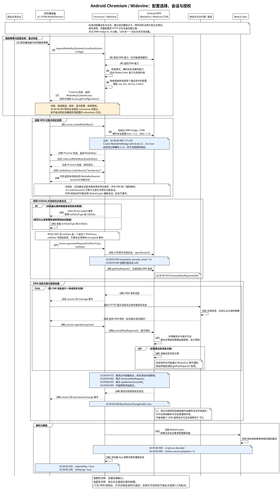

+++
date = '2025-08-25T11:36:11+08:00'
lastmod = '2026-09-29'
draft = false
title = 'Chromium + Android Widevine：L1/L3 选择与视频播放流程'
+++

在 Android 浏览器中播放 Widevine 加密视频，需要先由**网页播放器提出候选配置、Chromium 检查并选择配置**，再创建 DRM 对象和内容会话、申请许可证、配置解码器。设备支持 L1，并不意味着每个网页或每次播放都会使用 L1。

本文以 Android Chromium / WebView 为范围，配置映射和原生调用时机参照 **Chromium 149.0.7794.0 上游源码**，并结合 2026-09-29 的亚马逊 Prime Video 播放日志。车机定制实现是否改变这些规则，还需要实际源码或运行时记录确认。

## 参与者与职责

| 参与者 | 职责 |
|---|---|
| 网站业务后台 | 提供播放器代码、内容信息及播放策略；具体接口由网站实现。 |
| 网页播放器 | 通过 EME API 请求 DRM 能力、创建和绑定对象、处理 DRM 消息、向网站许可证代理或服务发送网络请求。 |
| Chromium / WebView | 实现网页 API，综合 DRM、编码格式和安全解码能力选择配置，并桥接 Android 媒体接口。 |
| MediaDrm / Widevine CDM | 管理原生 DRM 会话、生成和处理 DRM 消息、加载密钥并执行相关使用限制。 |
| MediaCrypto / MediaCodec | 将解码过程关联到 DRM 会话，并按内容格式及安全要求配置解密、解码路径。 |
| 网站许可证代理 / 服务 | 处理 DRM 请求，应用身份、授权和内容保护策略，返回响应或拒绝请求。 |

Chromium 是运行网页的浏览器内核，网页是其中执行的 JavaScript/HTML 内容；两者不是同一个参与者。TEE 是硬件安全实现的一部分，也不能与整个 Android DRM 框架或 CDM 等同。

## 带编号的时序图



[查看可缩放的 SVG 图](/ethenslab/images/chromium-drm.svg) · [查看完整 PlantUML 源码](/ethenslab/images/plantuml/chromium-drm.puml)

图中编号用于定位交互，不表示每次固定依次执行 33 个步骤：**15、16 是分支，20–28 可以重复多轮**。图采用一种常见的成功播放顺序，省略部分实现细节。

浅橙色注释表示关键证据缺口；浅蓝色注释表示本次日志记录的结果。未标日志的网页调用和 HTTP 往返属于标准流程示意。现有日志没有把多次 DRM bridge、网页对象与内容会话 `sid6` 建立完整的一一对应关系。

## 步骤 1–7：播放策略与 L1/L3 配置协商

网站通过播放器代码或配置决定提出什么要求；网页调用 `navigator.requestMediaKeySystemAccess(keySystem, configs)`，提交编码格式、`robustness`、会话类型等候选条件。Chromium 按网页给出的候选顺序检查，选择首个满足条件的配置；全部不满足时拒绝请求。返回的 `MediaKeySystemAccess` 可通过 `getConfiguration()` 读取实际接受的配置。

**浏览器不会仅因为设备支持 L1，就自动选择最高安全等级。** 配置选择还包括编码、安全解码和其他约束；查询结果也可能来自缓存，不一定每次都产生新的底层调用。[EME 配置选择规则](https://www.w3.org/TR/2017/REC-encrypted-media-20170918/#dom-navigator-requestmediakeysystemaccess)

在这里核对的 Android Chromium 149 路径中，选择结果通过 `use_hw_secure_codecs` 影响 Widevine 等级：

```text
网页候选配置 + 浏览器/系统能力约束
                    ↓
       是否要求硬件安全解码
                    ↓
    use_hw_secure_codecs = true  → L1
    use_hw_secure_codecs = false → L3
```

该字段初始值为 `false`，但实际结果由配置选择逻辑设置，不能只用初始值解释一次具体播放。[字段定义](https://github.com/chromium/chromium/blob/149.0.7794.0/media/base/cdm_config.h#L30)、[选择结果赋值](https://github.com/chromium/chromium/blob/149.0.7794.0/third_party/blink/renderer/platform/media/key_system_config_selector.cc#L1110)、[L1/L3 映射](https://github.com/chromium/chromium/blob/149.0.7794.0/media/base/android/media_drm_bridge_factory.cc#L45)

| 候选要求 | 在上述 Android 实现中的含义 |
|---|---|
| 空 `robustness` 或 `SW_SECURE_CRYPTO` | 本身不要求硬件安全解码；没有其他硬件安全约束时，可以使用 L3。 |
| `SW_SECURE_DECODE` 及以上，包括 `HW_SECURE_ALL` | 该 Android 实现要求硬件安全解码；整份候选配置可被支持时使用 L1，否则拒绝该候选。不能仅根据字符串中的 `SW` 判断为 L3。 |
| 首选硬件安全候选，另有较低要求的备用候选 | 首选不满足条件时，可能选用后面的备用候选；若较低要求候选排在前面且可满足，也可能先被选中。 |

以上对应 [Android Widevine robustness 规则](https://github.com/chromium/chromium/blob/149.0.7794.0/components/cdm/renderer/widevine_key_system_info.cc#L194)，不应直接推广为所有操作系统或所有版本的实现。

## 步骤 8–14：创建 DRM 对象、绑定视频与创建 JS 会话

这几个 API 的作用不同：

| 步骤 | API / 操作 | 含义 |
|---|---|---|
| 8–10 | `access.createMediaKeys()` | 异步创建 `MediaKeys`，并涉及底层 CDM 初始化。在对应 Chromium 路径中，创建 DRM bridge 时已经传入选定的安全等级。 |
| 11–12 | `video.setMediaKeys(mediaKeys)` | 将对象绑定到 `HTMLMediaElement`，供该视频元素使用。 |
| 13–14 | `mediaKeys.createSession("temporary")` | 同步返回尚未初始化的 `MediaKeySession`，其 `sessionId` 初始为空；不等于此时已打开原生内容会话。 |

图中采用“先绑定视频、再创建 JS 会话”的顺序，但这不是 EME 的统一强制顺序。规范仅说明部分实现需要先绑定媒体元素才能执行会话操作。[EME createSession 算法](https://www.w3.org/TR/2017/REC-encrypted-media-20170918/#dom-mediakeys-createsession)

DRM 初始化期间也可能提前创建供 `MediaCrypto` 使用的辅助会话，不应将它与后续申请内容密钥的会话混为一谈。

## 步骤 15–19：取得 initData，初始化原生内容会话

`generateRequest()` 的完整调用是：

```javascript
session.generateRequest(initDataType, initData);
```

初始化数据可以通过两条路径取得：

- 浏览器解析媒体数据时发现初始化数据，向视频元素派发 `encrypted` 事件，网页读取 `event.initDataType` 和 `event.initData`。
- 网页从清单或其他业务来源提前取得初始化数据，直接用于生成请求，不必等待 `encrypted` 事件。

对于 MP4/CENC，`initData` 是一个或多个拼接的 **PSSH box**，不是 `sidx` 索引，也不能笼统等同于整个 `moov`。初始化数据和 `encrypted` 事件可以早于图中位置出现。[MP4 初始化数据提取规范](https://www.w3.org/TR/eme-stream-mp4/#initialization-data-extraction)、[EME 初始化数据定义](https://www.w3.org/TR/2017/REC-encrypted-media-20170918/#initialization-data)

对于这里的新建内容会话，Chromium 149 的调用关系是：

```text
JS createSession()：创建未初始化的对象
    ↓
JS generateRequest(initDataType, initData)
    ↓
Chromium CreateSessionAndGenerateRequest
    ↓
Android MediaDrm.openSession()
    ↓
Android MediaDrm.getKeyRequest()
```

因此，原生内容会话的创建应画在 `generateRequest()` 之后。[Chromium MediaDrmBridge 实现](https://github.com/chromium/chromium/blob/149.0.7794.0/media/base/android/java/src/org/chromium/media/MediaDrmBridge.java#L833)

## 步骤 20–30：DRM 消息交换与内容密钥加载

CDM 生成的请求通过 `MediaKeySession` 的 `message` 事件交给网页。网页负责通过 HTTPS 将消息提交给网站指定的许可证代理或服务，再通过 `session.update(response)` 把响应交回浏览器和 CDM。不能将这一过程表述为 Chromium 自动直接联系某个固定的 Widevine 服务器。

交换可能有多轮，响应也不一定一开始就是内容许可证。例如本次日志先加载服务证书，再次生成请求后才加载内容密钥。`update()` 成功不应被一概解释成“已取得内容密钥”；应结合 CDM 记录和密钥状态判断。网页也可以通过 `MediaKeys.setServerCertificate()` 提前提供服务证书，但本次日志没有完整记录网页侧调用。[EME 消息交互](https://www.w3.org/TR/2017/REC-encrypted-media-20170918/#messages-and-communication)、[setServerCertificate](https://www.w3.org/TR/2017/REC-encrypted-media-20170918/#dom-mediakeys-setservercertificate)

在符合 L1 要求的实现中，明文内容密钥和相关敏感操作受硬件安全环境保护，普通 Android 执行环境和 Chromium 无法直接读取明文内容密钥。许可证响应、加密密钥数据、密钥 ID 等仍可经过普通软件层；许可证结构解析也可以涉及普通软件层。

不应写成“整个许可证都由 TEE 直接解析”，也不应在没有协议依据时断言“设备公钥直接加密内容密钥、设备私钥直接解密整个许可证”。MediaDrm 是框架接口，实际安全操作经过 DRM 插件及厂商实现，具体资源分配和安全边界应以实现为准。[Android DRM 架构](https://source.android.com/docs/core/media/drm)

## 步骤 31–33：解码与播放

`MediaDrm` 管理 DRM 会话和授权；`MediaCrypto` 将解码过程与 DRM 会话关联；播放器向 `MediaCodec` 提交加密媒体样本，并按格式及安全要求配置解码器。**MediaDrm 不负责把加密视频流传给 MediaCodec。**[Android MediaDrm API](https://developer.android.com/reference/android/media/MediaDrm)

L1 的安全播放还涉及安全解码器、受保护内存和显示输出路径。不能将所有解密、解码、显示操作都画成由 TEE 内的一段代码完成；也不能将“受保护内容对普通软件不可读”改写成“任何数据绝不进入物理主内存”。[Android 安全视频路径](https://source.android.com/docs/core/graphics/arch-st#secure_texture_video_playback)

本次创建的是普通 AVC 解码器，`feature-secure-playback = 0`，与已经选定的 L3 路径一致。它是后续执行结果，不能单独用来解释此前为什么选择 L3。

## 2026-09-29 亚马逊播放日志对照

日志文件为本地采集的 `android/logcat.log.001_2026_09_29_16_39_45`。下表行号对应解压后的原始文件；网页完整调用和 HTTP 请求没有被该日志完整记录。

| 图中步骤 | 时间 | 行号 | 日志及可确认的事实 |
|---|---|---|---|
| 3–6 的能力检查背景 | 16:38:49.030 | 88433 | `OEMCrypto_Initialize Level 1 success`：底层 L1 初始化成功，不等于浏览器的全部 L1 候选条件满足。 |
| 2、6、7 的线索 | 16:38:56.882 | 92542 | 提示未指定 `robustness`；不能据此确认实际播放所用配置的 `robustness` 为空。 |
| 9 | 16:38:56.898 / 57.130 | 92560、92701 | `Create MediaDrmBridge with level L3 ... for User`：创建 DRM 对象时已经指定 L3。 |
| 18 | 16:38:59.445 / 59.449 | 93938、93942 | `requested_security_level = L3`，随后创建内容会话 `sid6`。 |
| 19 | 16:38:59.454 | 93950 | 为 `sid6` 执行 `GenerateKeyRequest`。 |
| 25–28，第一轮 | 16:38:59.467 / 59.472 | 93960、93968 | `updateSession(sid6)` 后记录 `Service certificate loaded, no key added`，仅加载服务证书。 |
| 28，后续请求 | 16:38:59.482 | 93977 | 再次为 `sid6` 生成 Streaming 请求。 |
| 25–27，后续响应 | 16:39:00.043 / 00.085 | 94347、94378 | 再次 `updateSession(sid6)`，随后内容密钥添加成功。 |
| 29–30 | 16:39:00.088 | 94386 | 原生桥接层报告 `KeysStatusChange(sid6): true`；网页事件是图中的标准流程映射。 |
| 31–32 | 16:39:00.446 / 00.489 | 94660、95081 | 创建 `c2.qti.avc.decoder`，`feature-secure-playback = 0`。 |
| 33 | 16:39:05.835 / 06.180 | 98766、99410 | 浏览器 App 报告 `videoIsPlay = true`、`isPlaying = true`。 |

这些记录表明：**本次亚马逊视频沿 L3 路径完成了授权并进入播放。L3 在创建 DRM 对象、打开内容会话时就已指定，早于后面的内容许可证响应。** 没有证据表明本次先创建 L1 失败再回退，也不能归因于这次许可证响应把已经创建的 L1 会话降成 L3。

创建日志中的 `for GetVersion` 属于版本查询用途，不能直接当成播放对象证据。第一轮服务证书响应附近即使出现通用的“Key successfully added”记录，也应结合 CDM 明确的 `no key added` 判断，不能提前认定内容密钥已经加载。

## 应优先排查哪些步骤

| 步骤 | 待排查内容 | 需要补充的证据 |
|---|---|---|
| 1 | 网站是否按浏览器环境生成较低安全要求或备用策略。 | 网页代码、播放配置及相关业务响应。不能直接断言 UA 或认证状态就是原因。 |
| 2 | 网页是否请求了硬件安全，候选数组的顺序如何。 | `requestMediaKeySystemAccess()` 的完整参数，以及请求成功或失败结果。 |
| 3–7，尤其是 6 | 硬件安全候选是否被过滤，或者较低要求候选先被接受。 | `getConfiguration()`；必要时增加 Chromium 候选判定、拒绝原因与 `use_hw_secure_codecs` 日志。 |
| 8、11 | 网页是否测试了多个配置，最终用了哪个对象播放。 | 将 access、`createMediaKeys()` 的结果、`setMediaKeys()` 绑定的视频及播放事件关联起来。 |
| 6 → 9 | 如果实际采用的配置明确要求硬件安全，为什么创建时仍是 L3。 | 关联同一对象的选中配置、内部字段和原生创建日志，核对车机定制实现；当前尚不能认定是 Chromium 实现错误。 |

捕获网页调用时，应在页面脚本执行前注入采集逻辑，并覆盖实际播放器所在的 frame。除 `requestMediaKeySystemAccess()` 外，还应关注 `navigator.mediaCapabilities.decodingInfo()`：它也可能返回供网页使用的 `MediaKeySystemAccess`。只看到某次能力探测成功，不足以确认最终播放配置。

最终需要补齐的是这组对象关联，而不是仅增加一条“设备支持 L1”的记录：

```text
步骤 2：网页候选配置
    ↓
步骤 6、7：浏览器选择与 getConfiguration()
    ↓
步骤 8、9：实际采用的 access、MediaKeys 与原生 DRM 对象
    ↓
步骤 11：实际绑定的视频元素
    ↓
步骤 18：内容会话使用的安全等级
```

补充依据：[Media Capabilities 的加密媒体能力查询](https://www.w3.org/TR/media-capabilities/#dom-mediacapabilities-decodinginfo)、[WebView 页面启动脚本注入](https://developer.android.com/reference/androidx/webkit/WebViewCompat#addDocumentStartJavaScript(android.webkit.WebView,java.lang.String,java.util.Set%3Cjava.lang.String%3E))。
