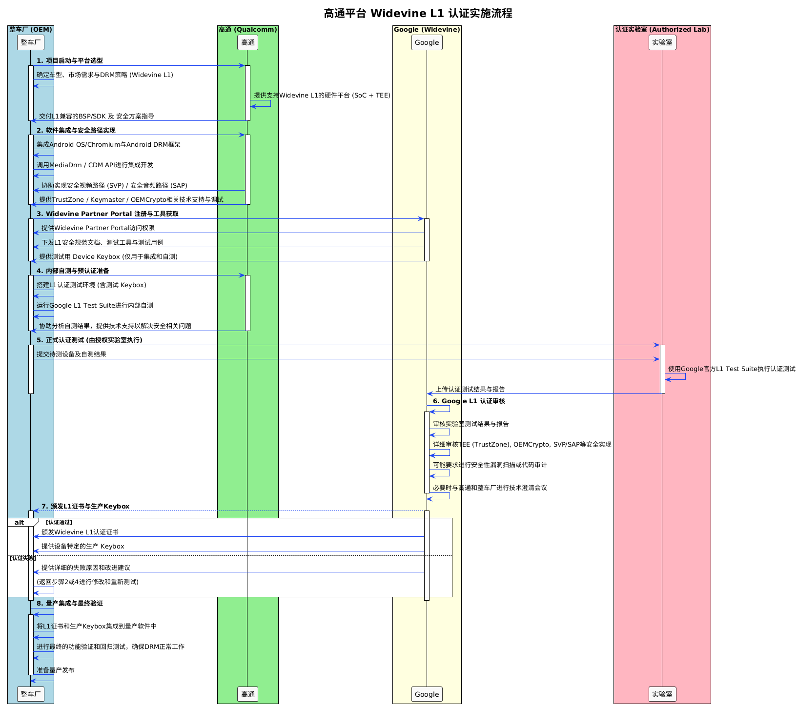

+++
date = '2025-08-27T11:36:11+08:00'
draft = false
title = '高通平台 Widevine L1 认证实施流程'
+++

## 整体流程

1. **项目启动与平台选型**
   * OEM（整车厂）或主导系统的 Tier1 根据车型、市场需求和 DRM 策略，决定采用 Widevine L1。
   * 高通提供支持 L1 的硬件平台（SoC + TEE），并交付 BSP/SDK 及安全方案指导。

2. **软件集成与安全路径实现**
   * 集成 Android OS、Chromium 和 Android DRM 框架。
   * 通过调用 MediaDrm/CDM API 实现播放功能。
   * 高通协助完成安全视频路径 (SVP) 与安全音频路径 (SAP)，并提供 TrustZone、Keymaster、OEMCrypto 的技术支持。

3. **资质准入与工具获取**
   * 认证实施方必须与 Google 签署 CWIP（Certified Widevine Implementation Partner）协议或相关 MLA 协议。
   * 获取 Widevine Partner Portal 访问权限。
   * Google 提供 L1 安全规范文档、测试工具及测试用例，并下发测试用 Device Keybox（仅限开发与自测）。

4. **内部自测与预认证准备**
   * 搭建 L1 测试环境并运行 Google L1 Test Suite，进行自测验证。
   * 高通协助分析结果并解决安全相关问题，为正式认证做准备。

5. **正式认证测试（由授权实验室执行）**
   * 将待测设备及自测结果提交至 Google 授权的第三方安全实验室（3PL）。
   * 实验室使用 Google 官方 L1 Test Suite 执行测试，并将测试结果与安全评估报告上传至 Google。

6. **Google L1 认证审核**
   * Google 审核实验室提交的结果和报告。
   * 重点审核 TEE（TrustZone）、OEMCrypto、SVP/SAP 等安全实现。
   * 视情况要求进行安全漏洞扫描或代码审计，并在必要时与 OEM/Tier1 和高通进行技术澄清。

7. **颁发 L1 证书与 Keybox 产线部署**
   * 若认证通过：Google 颁发 Widevine L1 证书。
   * 生产环境的 Keybox 并不会直接作为文件下发，而是需要通过 Widevine Provisioning Server (WPS) 或授权的工厂安全烧录流程（Factory Provisioning）在产线注入到设备的 TEE 中。
   * 若认证失败：Google 提供失败原因和改进建议，需回到开发或自测阶段进行修正后重新提交。

8. **量产集成与最终验证**
   * 在量产软件中集成 Widevine L1 证书，并跑通产线 Keybox 烧录流程。
   * 执行最终的功能验证和回归测试，确保 DRM 功能正常工作，完成量产准备。

## 角色与分工

### **1. OEM（整车厂 / 汽车厂商）**
* **角色定位**：需求的提出方，部分商业模式下也是最终认证主体。
* **职责**：
  * 决定是否上马 Widevine L1 项目。
  * 在部分项目中，作为最终产品方参与认证申请签署。
  * 确保整车系统满足内容方安全要求。
* **典型互动**：
  * 向 Tier1 厂商提出 L1 需求，对最终结果进行验收。

### **2. Tier1（一级供应商 / 车机厂）**
* **角色定位**：为 OEM 提供 IVI 硬件/软件解决方案，很多时候是 CWIP 的实际签署方和认证推进者。
* **职责**：
  * 基于 Qualcomm 平台开发 IVI 系统。
  * 负责集成 Widevine DRM 相关组件（CDM, HAL, Secure OS）。
  * 主导或协助完成整个认证测试流程。
* **典型互动**：
  * 与 Qualcomm 合作调通 DRM stack，对接 3PL 实验室解决测试问题。

### **3. Qualcomm（芯片厂 / 平台厂商）**
* **角色定位**：提供底层 SoC 平台和安全执行环境 (TEE, TrustZone)。
* **职责**：
  * 提供 Widevine L1 的参考实现（CDM 安全库、Secure Processor 固件）。
  * 保证硬件层安全特性（HDCP, Secure Video Path, Key ladder）。
  * 提供 BSP 和 DRM 驱动。
* **典型互动**：
  * 向 OEM/Tier1 提供 L1-capable 平台，并在出现底层漏洞或集成问题时提供技术 Debug 支持。

### **4. Lab（第三方授权实验室 / 3PL）**
* **角色定位**：Google 授权的独立实验室，负责执行正式认证测试与审计。
* **职责**：
  * 按照 Google 提供的 Test Plan 执行测试。
  * 审计 TEE 与安全路径实现。
  * 出具测试报告并提交给 Google。
* **典型互动**：
  * 与 Tier1/OEM 沟通测试流程、接收样机。发现问题时要求整改并复测。

### **5. Google（Widevine Owner）**
* **角色定位**：标准制定者与认证的最终裁决者。
* **职责**：
  * 定义 Widevine L1 技术要求和安全模型，授权 3PL 实验室。
  * 审核报告并决定是否颁发认证。
* **典型互动**：
  * 签署 CWIP 协议，主要与实验室保持正式沟通，基于报告结论颁发资质。

## 认证实验室与合作伙伴

根据 Google 官方规范，Widevine 3PL (Third-Party Labs) 计划允许经授权的第三方合作伙伴协助执行设备集成、安全审计和认证流程。

目前业界知名的 3PL 及安全合作伙伴包括：
* **castLabs**：不仅是认证测试实验室，也提供广泛的技术支持与加速认证服务。
* **Irdeto**：知名的数字安全厂商，参与第三方测试与安全集成支持。
* **Riscure** / **Cartesian** (Farncombe)：在 TEE 审计和内容安全领域享有盛誉的安全测试实验室。
* **AltiMedia** / **Smartlabs.tv**：执行测试并提交结果，支持硬件厂商的集成。

这些实验室具备授权，可执行以下关键事项：
* 独立运行 Widevine Test Suite 并将报告直通 Google。
* 针对车载设备独有的架构（如 Hypervisor 跨域传输）进行定制化的安全评估。
* 协助申请测试及生产用密钥资料。

## 第三方实验室 (3PL) 的作用与必要性

对于 OEM 与 Tier1 来说，为什么在 IVI 设备上获得 Widevine 认证时必须通过 3PL？

### 1. 认证机制的本质
Widevine L1 认证是 Google 管控的安全合规流程，其核心是确认设备的软硬件环境（SoC、TEE、OEMCrypto、Secure Path 等）能抵御各种攻击，确保高价值版权视频数据不被窃取。**最终的认证权威是 Google**，而非设备制造商自证。

### 2. 3PL 的“公证人”角色
Google 本身并不直接测试海量的生态设备，而是委托授权的 3PL 来执行认证。
* 实验室会使用官方工具链在真实设备上执行独立测试。
* 实验室在流程中扮演独立第三方审计人的角色，保证测试环境、测试用例执行和结果评估的绝对客观。

### 3. 不可绕过的强制流程
* OEM 或 Tier1 可以在内部进行预测试（Self-Test），但这**不能直接作为正式认证依据**。
* Google 强制要求高等级保护（L1）的正式认证必须通过 3PL 提交，以确保标准不打折扣。只有通过 3PL 审核后的设备，才能最终获得 L1 证书与进入产线 Provisioning 环节的资格。

[1]: https://www.widevine.com/solutions/widevine-3pl "Widevine Third Party Labs (3PL)"
[2]: https://castlabs.com/widevine-certification/ "Widevine CDM Device & App Certification - castLabs"