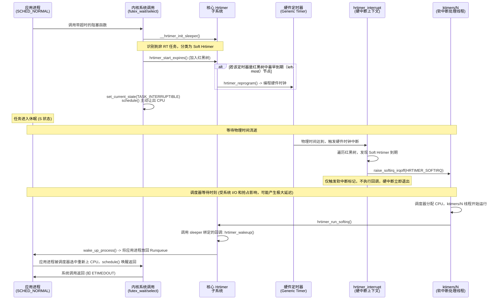

+++
date = '2026-03-15T22:30:00+08:00'
draft = false
title = 'Linux 内核 Hrtimer 机制解析：Hard 与 Soft 定时器的差异与应用层调度'
+++

在 Linux 内核中，高精度定时器（High-Resolution Timer, Hrtimer）是提供微秒/纳秒级时间精度的核心子系统。在引入实时内核补丁（PREEMPT_RT）后，为了解决硬中断执行时间过长破坏系统实时性的问题，内核对 Hrtimer 进行了严格的区分：**Hard Hrtimer**（硬高精度定时器）与 **Soft Hrtimer**（软高精度定时器）。

本文将严格基于 Linux 内核源码，解析这两者的实现机制、关键时序，以及上层应用定时器是如何被调度和唤醒的。

## 1. Hrtimer 核心机制区分

Hrtimer 的底层依赖于每 CPU 的红黑树（Red-Black Tree）来组织定时器节点。所有的 Hrtimer 在物理时间上都是通过对硬件定时器（如 ARM Generic Timer，x86 APIC Timer）进行编程，使其在红黑树中最左侧（最近到期）的时间点触发硬件中断。

区别在于 **硬件中断触发后，回调函数的执行上下文**。

### 1.1 Hard Hrtimer（硬高精度定时器）
- **执行上下文**：直接在**硬中断处理函数**（`hrtimer_interrupt`）中执行。
- **精度**：极高（微秒/纳秒级），因为一旦硬件时钟中断触发，无论当前 CPU 在执行什么任务，都会立刻被打断，当场执行定时器回调。
- **适用场景**：内核关键实时操作，或调度类为实时调度类（`SCHED_FIFO` / `SCHED_RR`）的任务。
- **限制**：回调函数内部绝对不能包含任何可能导致睡眠或长耗时的操作。

### 1.2 Soft Hrtimer（软高精度定时器）
- **执行上下文**：被下放（Deferred）到**软中断上下文**。在 PREEMPT_RT 内核下，软中断由特定优先级的内核线程（如 `ktimers/N` 或 `ksoftirqd/N`，默认优先级 98）专门处理。
- **精度**：受限于系统调度。虽然硬件中断准时触发，但回调的实际执行需要等待 `ktimers/N` 线程被调度上 CPU。在 I/O 密集或高优先级任务抢占的情况下，可能出现毫秒乃至秒级的延迟。
- **适用场景**：普通调度类（`SCHED_NORMAL` / `SCHED_OTHER`）任务的阻塞超时控制，如应用层的 `select`、`futex`、`epoll_wait` 超时。

## 2. 内核源码实现剖析

### 2.1 软硬定时器的分类决策
当任务调用可能超时的系统调用时，内核会通过 `__hrtimer_init_sleeper()` 初始化一个休眠定时器。在 `kernel/time/hrtimer.c` 中，内核明确定义了分类逻辑：

```c
static void __hrtimer_init_sleeper(struct hrtimer_sleeper *sl,
                   clockid_t clock_id, enum hrtimer_mode mode)
{
    /* 在 PREEMPT_RT 内核下，普通任务的 hrtimer 会被移入软中断上下文。
     * 只有实时的用户态任务，才会被显式标记为硬中断到期模式。 */
    if (IS_ENABLED(CONFIG_PREEMPT_RT)) {
        if (task_is_realtime(current) && !(mode & HRTIMER_MODE_SOFT))
            mode |= HRTIMER_MODE_HARD;  // 实时任务：赋予 HARD 属性
    }

    __hrtimer_init(&sl->timer, clock_id, mode);
    sl->timer.function = hrtimer_wakeup; // 所有 sleeper 的默认唤醒回调
    sl->task = current;
}
```

### 2.2 硬件中断处理与 Soft Hrtimer 的“延迟”
当硬件时钟到达，触发硬中断，内核进入 `hrtimer_interrupt()` (位于 `kernel/time/hrtimer.c`)：

```c
void hrtimer_interrupt(struct clock_event_device *dev)
{
    struct hrtimer_cpu_base *cpu_base = this_cpu_ptr(&hrtimer_bases);
    ktime_t now = hrtimer_update_base(cpu_base);

    // 1. 检查是否有 Soft Hrtimer 到期
    if (!ktime_before(now, cpu_base->softirq_expires_next)) {
        cpu_base->softirq_activated = 1;
        // 核心：不执行回调，而是触发软中断信号
        raise_softirq_irqoff(HRTIMER_SOFTIRQ);
    }

    // 2. 立即在硬中断上下文中处理所有到期的 Hard Hrtimer
    __hrtimer_run_queues(cpu_base, now, flags, HRTIMER_ACTIVE_HARD);
    
    // 3. 找到下一个最早到期的定时器，重新编程硬件
    expires_next = hrtimer_update_next_event(cpu_base);
    tick_program_event(expires_next, 0);
}
```
从源码可见，Soft Hrtimer 在硬件中断中仅仅是调用了 `raise_softirq_irqoff()` 举起了一块“软中断待处理”的牌子，随后硬中断就退出了。真正的回调被交接给了随后的软中断内核线程（`ktimers/N`）执行（执行路径为 `run_timersd` -> `handle_softirqs` -> `hrtimer_run_softirq` -> `__hrtimer_run_queues(..., HRTIMER_ACTIVE_SOFT)`）。

## 3. 上层应用的定时器唤醒完整时序

应用层的带超时的阻塞调用都会殊途同归，走到内核的 `schedule_hrtimeout_range()` 或其变体。

**具体而言，常见的带超时阻塞系统调用及 C 库函数包括：**
- **同步原语等待**：`pthread_cond_timedwait()`, `pthread_mutex_timedlock()`, `sem_timedwait()`, `pthread_rwlock_timedrdlock()` 等（底层均映射为带超时参数的 `futex` 系统调用，如 `FUTEX_WAIT_BITSET`）。
- **I/O 多路复用**：`select()`, `pselect()`, `poll()`, `ppoll()`, `epoll_wait()`, `epoll_pwait()`。
- **显式休眠**：`nanosleep()`, `clock_nanosleep()`, `usleep()`。
- **进程间通信 (IPC)**：POSIX 消息队列的 `mq_timedreceive()`, `mq_timedsend()`。

### 3.1 睡眠与唤醒机制

1. **初始化休眠器**：应用系统调用进入内核，最终调用 `hrtimer_init_sleeper_on_stack()`，在当前任务的内核栈上分配一个 `hrtimer_sleeper` 结构。
2. **启动定时器并挂起任务**：调用 `hrtimer_start_expires()` 将定时器加入每 CPU 的红黑树。此时，Hrtimer 子系统会判断该节点是否为红黑树中最左侧（最早到期）的节点。如果是，Hrtimer 会调用 `hrtimer_reprogram()` 重新编程硬件时钟。随后，系统调用将当前任务状态设置为休眠态（如 `TASK_INTERRUPTIBLE`），并调用 `schedule()` 主动让出 CPU。
3. **时钟到期**：硬件定时器触发中断进入 `hrtimer_interrupt()`。
4. **回调执行**：Hard 定时器走硬中断直接执行，Soft 定时器被交接至 `ktimers/N` 软中断线程执行。二者执行的回调函数均为 `hrtimer_wakeup()`。
5. **唤醒任务**：`hrtimer_wakeup()` 内部调用调度器的核心唤醒函数 `wake_up_process(sl->task)`，将原本睡眠的应用任务重新放入对应 CPU 的调度器运行队列（Runqueue），状态恢复为 `TASK_RUNNING`，等待调度器将其调度上 CPU 继续执行。

### 3.2 完整时序图

以下时序图展示了一个普通 `SCHED_NORMAL` 任务（如默认的 Android 应用线程）调用休眠函数时的完整执行流。



## 4. 总结

- **Hard Hrtimer** 提供绝对的硬中断级别准时执行，专为内核底层高优任务或 `SCHED_FIFO/RR` 实时进程服务。
- **Soft Hrtimer** 是普通应用进程超时控制的基石，它保证了长耗时的进程唤醒等逻辑不占用宝贵的硬中断资源。
- 在 PREEMPT_RT 实时内核下，由于强制的隔离机制，Soft Hrtimer 高度依赖 `ktimers/N` 的线程调度。在遭遇密集块设备 I/O 或更高优先级中断风暴时，它是导致上层应用“诡异超时”的阿喀琉斯之踵。如果上层应用对绝对时序要求极严，唯一的正确解法是通过 `pthread_setschedparam()` 提升对应线程的调度类至实时级别。