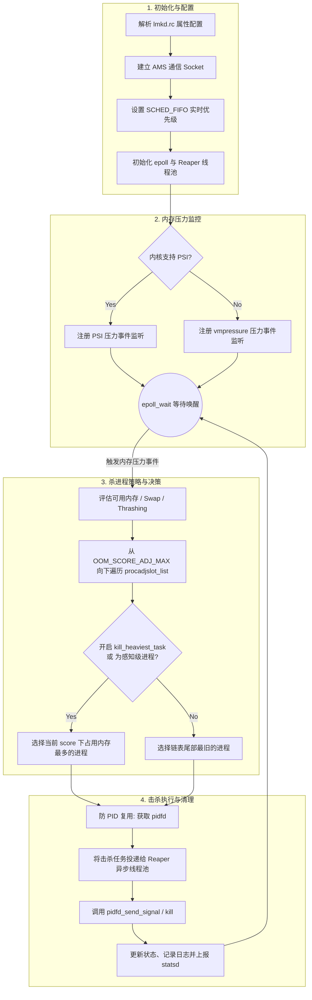

# Android Low Memory Killer Daemon (LMKD) 源码机制与策略分析

## 简介
Android 系统的 Low Memory Killer Daemon (lmkd) 是一个运行在用户空间的守护进程，主要负责监控 Android 系统的内存状态。当系统内存压力较高时，lmkd 会根据一定的策略杀死最不重要的进程，以保证系统能够维持在可接受的性能水平。

在 Linux Kernel 4.12 之前，该工作通常由内核态的 `lowmemorykiller` 驱动完成。随着内核的发展，该内核驱动被移除，相关的逻辑被完全迁移到了用户空间的 `lmkd` 守护进程中。

AOSP 源码路径：`system/memory/lmkd`

---

## 核心机制与架构

lmkd 的工作流程可以分为以下几个核心环节：**初始化与配置解析**、**内存压力监控**、**受害者选择策略**以及**进程击杀执行**。



### 1. 初始化与配置 (Initialization)

- **启动方式**: lmkd 通过 `lmkd.rc` 配置文件被 `init` 进程启动，具有较高的权限（例如 `CAP_KILL`、`CAP_IPC_LOCK`、`CAP_SYS_NICE`），并设置为了 `critical` 服务。
- **调度优先级**: 为了保证即使在系统极度卡顿、资源耗尽时也能优先响应并进行杀进程释放内存，lmkd 在 `main()` 函数中会将自身调度策略设为 `SCHED_FIFO` 实时优先级。
- **通信套接字**: 初始化期间通过 `android_get_control_socket("lmkd")` 获取到 `ActivityManagerService` (AMS) 用来与其通信的 Unix Domain Socket (`/dev/socket/lmkd`)。AMS 会通过此套接字更新各个进程的 `oom_score_adj`。

### 2. 内存压力监控 (Memory Pressure Monitoring)

lmkd 使用 `epoll` 来监听内存压力事件。当前 lmkd 支持两种主要的内存压力监测方式：

#### 2.1 PSI (Pressure Stall Information) - 推荐 & 默认
在支持 PSI 的较新内核上，lmkd 优先使用 PSI 进行监控。在 `init_monitors()` 函数中，如果系统属性允许且内核支持，会调用 `init_psi_monitors()`。
- PSI 通过 `/proc/pressure/memory` 暴露系统因为内存不足而导致进程停顿（Stall）的时间比例。
- lmkd 针对不同压力级别配置了不同的阈值（partial stall 与 complete stall 的时长），利用 PSI 的 epoll 触发机制来实时唤醒 lmkd。
- PSI 相比于旧的机制更加精准，能够直接反映出“内存不足对 CPU 执行造成的延迟影响”。

**关于 `/proc/pressure/memory` 的输出字段含义：**
PSI 节点输出的数据通常如下所示：
```text
some avg10=0.00 avg60=0.00 avg300=0.00 total=0
full avg10=0.00 avg60=0.00 avg300=0.00 total=0
```
- **`some` (部分阻塞)**: 表示系统中**至少有一个**非空闲进程因为等待内存资源而被阻塞。即使有其他进程还在运行，这也反映了系统由于内存不足而产生的总体延迟成本。
- **`full` (完全阻塞)**: 表示系统中**所有**非空闲进程都在同一时刻因为等待内存资源而被阻塞。这是一种严重状态，此时 CPU 完全闲置，等待内存操作完成，这是对用户体验产生直接卡顿影响的核心指标。
- **`avg10`, `avg60`, `avg300`**: 分别表示在过去 10 秒、60 秒、300 秒内，系统处于对应阻塞状态的时间百分比（范围 0-100）。例如 `avg10=5.00` 意味着过去 10 秒中有 5% 的时间处于阻塞状态。
- **`total`**: 记录了系统自启动以来，处于该阻塞状态的累计总时间（单位：微秒）。
*注：LMKD 通过向该接口写入特定的阈值配置（如 `ro.lmk.psi_partial_stall_ms`），并通过 `epoll` 等待内核的自动唤醒通知，从而避免了不断轮询带来的额外 CPU 开销。*

#### 2.2 vmpressure (基于 Cgroup V1 的回退机制)
当不支持 PSI 时，lmkd 会回退使用旧的 `vmpressure` 机制。
- 依赖于 cgroup v1 的 `memory.pressure_level` 接口。
- 分为 `LOW`, `MEDIUM`, `CRITICAL` 三个级别。

### 3. 杀进程策略与决策 (Kill Strategy & Decision Making)

当 lmkd 接收到内存压力事件后，会评估当前系统的可用内存、Swap 使用情况、Thrashing（抖动）状态，然后决定是否需要杀进程以及杀死哪个进程。

核心寻找受害者的逻辑在 `find_and_kill_process()` 函数中：
1. **遍历 `oom_score_adj`**: lmkd 内部维护了一个按 `oom_score_adj` 分类的双向链表 `procadjslot_list`。当需要杀进程时，循环会从 `OOM_SCORE_ADJ_MAX` (通常是 1000，即优先级最低的后台缓存进程) 开始向下遍历，直到当前的 `min_score_adj` 阈值。
2. **挑选受害者 (`choose_heaviest_task`)**: 
    - 如果配置了 `ro.lmk.kill_heaviest_task=true`，lmkd 会在当前 score 级别下挑选占用内存最多（heaviest）的进程 `proc_get_heaviest(i)`，从而用最小的击杀代价释放最多的内存。
    - 否则，通常选择链表尾部的进程（驻留时间最长、最旧的进程）。
    - *优化*: 即便 `kill_heaviest_task` 未开启，当遍历到用户可感知级别的进程（`i <= PERCEPTIBLE_APP_ADJ`）时，lmkd 也会强制切换为挑选 heaviest task，因为误杀可见进程代价很大，尽可能一次释放足够多的内存以减少总体受害者数量。

### 4. 击杀执行与 Reaper (Execution & Reaper)

挑选到受害者后，流程进入 `kill_one_process()` 函数执行真正的击杀：

1. **防止 PID 复用 (PID Reuse)**: lmkd 引入了 `pidfd` (如果内核支持)。传统的 `kill(pid, SIGKILL)` 存在竞态条件（在发出信号前，原进程可能已经退出，PID 被一个重要系统进程复用）。通过 `pidfd_open` 和 `pidfd_send_signal`，lmkd 能够保证 100% 安全地杀死目标。
2. **异步清理 (Reaper Thread Pool)**: 实际的击杀系统调用通过 `reaper.kill()` 封装。
    - lmkd 拥有一个 Reaper 线程池（通过 `init_reaper()` 初始化）。
    - 杀进程和等待进程彻底死亡并释放内存可能耗时，为了不阻塞 lmkd 主线程继续响应其他内存压力，击杀请求 (target_proc) 会被投递到 Reaper 线程池进行异步处理 (`async_kill`)。
3. **状态日志与上报**: 杀死进程后，lmkd 会记录内核的剩余内存等信息，打印出类似 `Kill 'app_name' (pid), uid, oom_score_adj...` 的日志，并通过 socket 更新内部状态，并且会上报 statsd 用于系统稳定性分析。

---

## 5. 车机实际运行状态调研 (实车验证)

通过对车机实车环境的在线排查，我们验证了 `lmkd` 在实际生产环境中的工作机制与配置属性：

### 5.1 内存压力监控机制：PSI 验证
通过 `adb shell` 连接车机，并提取 `lmkd` 进程（PID: 581）打开的文件描述符，我们发现它持有 `/proc/pressure/memory` 的文件句柄：
```bash
l-wx------ 1 lmkd lmkd 64 2026-04-17 14:24 5 -> /proc/pressure/memory
l-wx------ 1 lmkd lmkd 64 2026-04-17 14:24 6 -> /proc/pressure/memory
```
**结论**：车机当前处于激活支持 PSI (Pressure Stall Information) 监控机制的状态，这是 LMKD 首选和推荐的精准压力监控方式，而非旧版的 `vmpressure`。

同时，我们还能在 `lmkd` 的打开句柄中看到大量如下条目：
```bash
lrwx------ 1 lmkd lmkd 64 2026-04-17 14:42 100 -> anon_inode:[pidfd]
```
这也证实了上文源码分析中的观点：`lmkd` 在生产环境中广泛运用了 `pidfd` 的特性，从而避免 PID 复用导致的误杀。

### 5.2 车机中与 LMKD 相关的核心属性配置
车机配置了诸多影响 lmkd 策略的 `ro.lmk.*` 属性，以下是车机内抓取到的相关属性及其技术含义解析：

| 属性名 (Property) | 设定值 | 含义解析 |
| --- | --- | --- |
| **`ro.lmk.kill_heaviest_task`** | `true` | **核心策略配置**。设为 true 意味着 LMKD 会优先杀掉同一个 oom_score_adj 级别下占用内存最大的进程（Best Decision），而不是杀掉列表中第一个匹配的进程（Fast Decision）。通过牺牲微小的查询时间，换取以最少击杀次数释放最大的内存量。 |
| **`ro.lmk.kill_timeout_ms`** | `15` | **防止连杀抖动**。在执行一次击杀动作后，lmkd 暂停继续击杀的超时时间（毫秒）。车机配置为 15ms，说明允许较高频率的连杀操作。AOSP 默认通常为 100ms。 |
| **`sys.lmk.minfree_levels`** | `18432:0, 23040:100, 27648:200, 32256:250, 55296:900, 80640:950` | 定义了内存阈值（以 Page 为单位，通常 1 Page = 4KB）与对应的 OOM_ADJ 分数级别的映射。当系统内存下降到特定阈值时，只有对应及更高 OOM_ADJ 分数的应用会被击杀。 |
| **`ro.lmk.enable_adaptive_lmk`** | `true` | **厂商自研特性**。开启自适应的 LMK 策略（如 QCOM/特定厂商优化特性）。让 LMKD 的阈值与策略具有根据运行负载自动调整的能力。 |
| **`ro.lmk.enhance_batch_kill`** | `true` | **厂商自研特性**。开启增强批量击杀能力。当内存压力发生激增时，允许在一个流程周期内批量清除多个进程，快速释放内存池，防止产生阻塞或黑屏。 |
| **`ro.lmk.vmpressure_file_min`** | `80640` | 基于 vmpressure 触发时的 File Cache 最低页面阈值限制。通常作为回退或辅助阈值机制工作。 |
| **`sys.lmk.reportkills`** | `1` | 允许 LMKD 向客户端及 `statsd` 广播与上报进程被杀死的事件日志。 |

## 总结

从 AOSP 的 `system/memory/lmkd` 源码中可以看出，现代的 Android Low Memory Killer 已经进化为了一个高度复杂的用户态守护进程。结合针对车机的实车调研，我们不仅证实了其对最新 `PSI` 特性及 `pidfd` 防误杀功能的应用，还解析了当前系统调优策略的核心思路：通过 `kill_heaviest_task` 精准打击以及通过厂商增强的批量清理特性，以应对高负载下车机环境严苛的内存稳定要求。

> **参考文件**:
> - `system/memory/lmkd/lmkd.cpp`: 主控制循环与逻辑判断
> - `system/memory/lmkd/reaper.cpp`: 异步击杀执行器
> - `system/memory/lmkd/README.md`: 属性配置参考
> - `system/memory/lmkd/lmkd.rc`: 启动配置文件