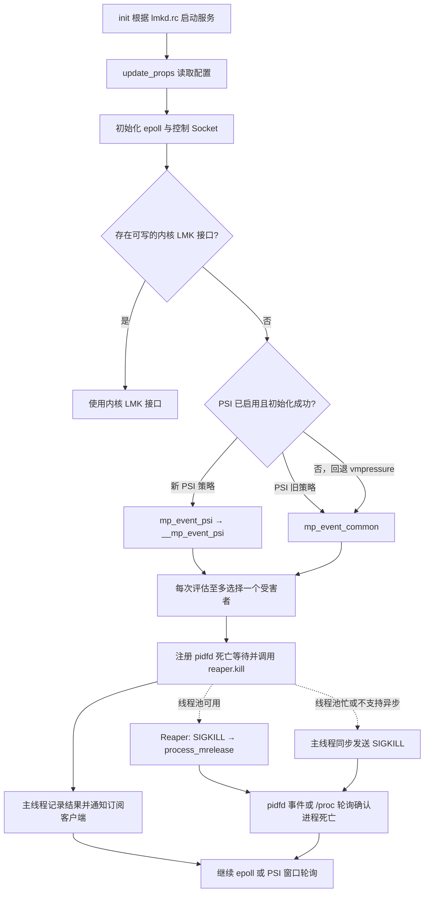

+++
date = '2026-06-07T22:30:00+08:00'
draft = false
title = 'Android Low Memory Killer Daemon (LMKD) 源码机制与策略分析'
+++


## 简介

Android 系统的 Low Memory Killer Daemon（lmkd）是一个用户空间守护进程。它接收内核内存压力信号，结合 zone watermark、Swap、page-cache refault、reclaim 状态和进程 `oom_score_adj`，在系统进入不可接受的内存回收延迟前终止相对不重要的进程。

在 Linux Kernel 4.12 之前，该工作通常由内核态的 `lowmemorykiller` 驱动完成。随着内核的发展，该内核驱动被移除，相关的逻辑被完全迁移到了用户空间的 `lmkd` 守护进程中。

AOSP 源码路径：`system/memory/lmkd`。本文的实现细节以 8397 QSSI 中该仓库的 `6591d1e` 版本为基准；其他 Android 分支可能在属性、memevent 或厂商 hook 上存在差异。

---

## 核心机制与架构

lmkd 的工作流程可以分为四个环节：初始化、压力监控、决策与受害者选择、进程终止与回收。现代内核上的主路径是 PSI 驱动的新策略；vmpressure 和 minfree 属于兼容路径，不能与新策略混为一谈。


```mermaid
flowchart TD
    A[init 根据 lmkd.rc 启动服务] --> B[update_props 读取配置]
    B --> C[初始化 epoll 与控制 Socket]
    C --> D{存在可写的内核 LMK 接口?}
    D -- 是 --> E[使用内核 LMK 接口]
    D -- 否 --> F{PSI 已启用且初始化成功?}
    F -- 新 PSI 策略 --> G[mp_event_psi → __mp_event_psi]
    F -- PSI 旧策略 --> H[mp_event_common]
    F -- 否，回退 vmpressure --> H
    G --> I[每次评估至多选择一个受害者]
    H --> I
    I --> J[注册 pidfd 死亡等待并调用 reaper.kill]
    J --> K[主线程记录结果并通知订阅客户端]
    J -. 线程池可用 .-> L[Reaper: SIGKILL → process_mrelease]
    J -. 线程池忙或不支持异步 .-> M[主线程同步发送 SIGKILL]
    L --> N[pidfd 事件或 /proc 轮询确认进程死亡]
    M --> N
    K --> O[继续 epoll 或 PSI 窗口轮询]
    N --> O
```

### 1. 初始化与配置 (Initialization)

- **服务启动**：`init` 解析 `lmkd.rc` 并启动 lmkd；lmkd 本身不解析 rc 文件。服务属于 `class core`，被标记为 `critical`，并获得 `DAC_OVERRIDE KILL IPC_LOCK SYS_NICE SYS_RESOURCE` capabilities。
- **属性读取**：`update_props()` 读取 `ro.lmk.<name>`。若存在 `persist.device_config.lmkd_native.<name>`，后者优先，用于运行时实验和重新初始化监控器。
- **控制通道**：`init` 预先创建 `/dev/socket/lmkd`。lmkd 通过 `android_get_control_socket("lmkd")` 取得监听 socket，AMS 等客户端连接后发送 `LMK_TARGET`、`LMK_PROCPRIO`、订阅和属性更新命令。
- **内核接口探测**：`use_inkernel_interface` 虽然在静态初始化时为 `true`，但运行时会根据内核 lowmemorykiller 的 `minfree` 节点是否可写重新赋值。因此它不是现代设备的实际默认工作模式。
- **调度与锁页**：未使用内核 LMK 接口时，主线程调用 `mlockall(MCL_CURRENT | MCL_FUTURE | MCL_ONFAULT)`，并设置为 `SCHED_FIFO`、实时优先级 1，以降低严重内存压力下的调度延迟。Reaper 工作线程随后被显式设置为 `SCHED_OTHER`。
- **事件循环**：控制 socket、压力监控 FD、pidfd、Reaper 通信管道和 memevent ring buffer 都注册到同一个 epoll 实例。Reaper、watchdog 初始化完成后，主线程进入 `mainloop()`。

### 2. 内存压力监控 (Memory Pressure Monitoring)

lmkd 使用 `epoll` 监听压力事件。PSI 和 vmpressure 是两种互斥的主压力触发器，BPF memevent 则补充 reclaim 状态、厂商事件和 watermark 更新通知。

#### 2.1 PSI（Pressure Stall Information）

`init_monitors()` 默认优先初始化 PSI。新策略关闭 LOW 级别触发器，注册两个 `/proc/pressure/memory` 触发器：

- MEDIUM：`PSI_SOME`，默认在 1000 ms 窗口内累计 stall 70 ms；低 RAM 设备默认 200 ms。
- CRITICAL：`PSI_FULL`，默认在 1000 ms 窗口内累计 stall 700 ms。

对应属性为 `ro.lmk.psi_partial_stall_ms`、`ro.lmk.psi_complete_stall_ms` 和 `ro.lmk.psi_window_size_ms`。lmkd 将换算后的触发表达式写入 PSI FD，而不是把属性名直接写入 `/proc/pressure/memory`。

**关于 `/proc/pressure/memory` 的输出字段含义：**
PSI 节点输出的数据通常如下所示：
```text
some avg10=0.00 avg60=0.00 avg300=0.00 total=0
full avg10=0.00 avg60=0.00 avg300=0.00 total=0
```
- **`some`（部分阻塞）**：测量范围内至少有一个非空闲任务因内存压力而停顿，其他任务仍可能继续执行。
- **`full`（完全阻塞）**：测量范围内所有非空闲任务同时因内存压力而停顿。它表示该工作负载没有任务能够向前推进，但不等价于所有 CPU 硬件完全空闲；内核回收线程、中断或范围外任务仍可能运行。
- **`avg10`, `avg60`, `avg300`**: 分别表示在过去 10 秒、60 秒、300 秒内，系统处于对应阻塞状态的时间百分比（范围 0-100）。例如 `avg10=5.00` 意味着过去 10 秒中有 5% 的时间处于阻塞状态。
- **`total`**: 记录了系统自启动以来，处于该阻塞状态的累计总时间（单位：微秒）。

PSI 触发事件在一个窗口内会被限频。收到事件后，lmkd 会启动主动轮询：通常每 100 ms 一次；成功发起击杀后，或 `swap_is_low` 为真（估算可用 Swap 低）时缩短为 10 ms。轮询通常在 `psi_window_size_ms` 后停止，但新的 PSI 事件、一次成功发起的击杀或持续 direct reclaim 可以重新开始或延长该阶段。因此 PSI 避免了常驻高频轮询，但一次 PSI 事件仍可能派生多次评估。

#### 2.2 vmpressure（Cgroup v1 回退机制）

当 `ro.lmk.use_psi=false` 或 PSI 初始化失败时，lmkd 尝试注册 cgroup v1 的 `memory.pressure_level`，级别分为 LOW、MEDIUM、CRITICAL。vmpressure 以及 PSI 的旧策略都进入 `mp_event_common()`；它们不会进入 `__mp_event_psi()`。该兼容路径依赖 memcg v1，在纯 cgroup v2 系统上不可用。

#### 2.3 BPF memevent 与 vmstat 回退

启动完成后，lmkd 尝试使用 `MemEventListener` 订阅以下 BPF memevent：

- `DIRECT_RECLAIM_BEGIN/END`：精确维护 direct reclaim 状态和开始时间；
- `KSWAPD_WAKE/SLEEP`：维护 kswapd reclaim 状态；
- `VENDOR_LMK_KILL`：接收厂商定义的击杀请求；
- `UPDATE_ZONEINFO`：在内核参数变化后刷新缓存的聚合 zone watermark 阈值。

若 memevent 不可用，lmkd 通过 `/proc/vmstat` 中 `pgscan_direct`、`pgscan_kswapd` 和 `pgrefill` 的变化推断 reclaim 活动。该回退只能判断活动状态，不能可靠计算 direct reclaim 的起止时长；因此源码会把 `direct_reclaim_threshold_ms` 置 0，禁用 `DIRECT_RECL_STUCK`。

### 3. 杀进程策略与决策 (Kill Strategy & Decision Making)

用户空间 lmkd 存在两套决策路径：

- **新 PSI 策略**：`mp_event_psi()` 调用 `__mp_event_psi()`，依据 `wmark`（聚合 zone watermark 状态）、估算可用 Swap、page-cache thrashing 和 reclaim 状态决策。`use_new_strategy` 的默认值为 `low_ram_device || !use_minfree_levels`。
- **兼容策略**：`mp_event_common()` 处理 vmpressure，或处理显式启用的 PSI 旧策略。它可以使用 minfree 阈值，也可以按 vmpressure level 的 `oom_score_adj` 阈值击杀。

后续 §3.1～§3.4 主要描述新 PSI 策略；兼容策略单独在 §3.5 说明。

#### 3.1 前置条件检查

每次进入 `__mp_event_psi()` 后，lmkd 按以下顺序准备决策：

- **等待前一个受害者退出**：只有前一次击杀仍处于 pending 状态，并且 `kill_timeout_ms=0`（无限等待）或尚未超过超时时间时，才跳过本次评估。若 pidfd 已通知进程死亡，可在超时前继续评估；若进程到达超时仍未退出，lmkd 停止等待并允许选择下一个受害者。
- **采集当前计数**：读取 `/proc/vmstat` 和 `/proc/meminfo`，选定兼容内核版本的 refault 计数器，派生估算可用 Swap，并在首次评估或上一次成功发起击杀后重置 thrashing 基线。
- **判定 reclaim 并执行早退**：reclaim 状态优先由 memevent 给出，memevent 不可用时才根据 vmstat 累计计数的变化推断。仅对 PSI 事件源，若既未检测到 direct reclaim/kswapd reclaim，refault 计数相对上一次评估也未变化，本轮在计算 thrashing、`wmark` 和 `full.avg10` 之前提前结束。
- **派生决策状态**：未早退时才计算 thrashing；需要时刷新缓存的聚合 zone watermark 阈值并得到 `wmark`；随后读取 PSI `full.avg10`，进入 §3.3 的 kill-reason 判断。

#### 3.2 核心指标的采集、派生与使用

本节只描述新 PSI 策略 `__mp_event_psi()`。该策略不会直接用某一个 `/proc` 字段决定是否击杀，而是先把内存容量计数统一为 page，再派生出 watermark 状态、Swap 状态、thrashing 和 reclaim 状态，最后按 §3.3 的顺序组合这些状态。

##### 3.2.1 数据来源与单位

源码启动时计算 `pagesize = getpagesize()`、`page_k = pagesize / 1024`，其中 `page_k` 表示一页包含多少 KiB。不同接口的原始单位不同：

- `/proc/meminfo` 的值以 KiB 表示，`meminfo_parse()` 除以 `page_k` 后保存为 page。例如源码字段 `mi.field.nr_free_pages` 实际来自 `MemFree:`，`mi.field.cma_free` 来自 `CmaFree:`。
- `/proc/vmstat` 和 `/proc/zoneinfo` 中本文涉及的计数已经以 page 表示，源码不再换算。
- `/proc/pressure/memory` 的 `avg10` 是百分比，PSI trigger 的阈值和 direct reclaim 时长则以 ms 配置。

因此，下文所有带 `_pages` 后缀的派生量都以 page 为单位。在本节涉及的决策条件中，只有与 `filecache_min_kb` 比较时才乘以 `page_k` 转为 KiB。尤其要注意，watermark 比较使用的是 `/proc/meminfo` 的 `MemFree`，不是 `MemAvailable`，也不是本轮 `/proc/vmstat` 中的 `nr_free_pages`。

##### 3.2.2 从 zone watermark 得到 `wmark`

`/proc/zoneinfo` 为每个 NUMA node 下的每个 zone 提供 `min`、`low`、`high` 和 `protection[]`。lmkd 的解析结果以 `present != 0` 表示该 zone 有效，并对每个有效 zone 取：

```text
zone_max_protection_pages[z] = max(zone[z].protection[])
```

再把所有有效 zone 聚合成系统级阈值：

```text
min_wmark_pages  = Σz (zone[z].min  + zone_max_protection_pages[z])
low_wmark_pages  = Σz (zone[z].low  + zone_max_protection_pages[z])
high_wmark_pages = Σz (zone[z].high + zone_max_protection_pages[z])
```

`protection[]` 对应内核为低端内存保护计算的保留量。这里描述的是 lmkd 自身的全局近似：它取数组最大值 `max_protection`，再把它加入该 zone 的各级 watermark。该算法用一个全局空闲页数比较聚合阈值，不等价于内核分配器针对具体 zone、分配 order 和分配标志执行的 `zone_watermark_ok()`。

用于比较的空闲页统一称为**非 CMA 空闲页**：

```text
free_pages               = MemFree / page_k
cma_free_pages           = CmaFree / page_k
free_pages_excluding_cma = free_pages - cma_free_pages
```

`free_pages_excluding_cma` 是本文为统一概念定义的名称；源码没有名为 `effective_free` 的指标，`get_lowest_watermark()` 内部仍把该局部变量命名为 `nr_free_pages`。之所以扣除 `CmaFree`，是因为 CMA 空闲页受连续内存分配用途约束，lmkd 不把它们计入这次全局 watermark 比较。

随后，`get_lowest_watermark()` 把数值比较结果编码为枚举 `wmark`：

| `wmark` | `free_pages_excluding_cma` 的范围 | 状态含义 |
|---------|-----------------------------------------|----------|
| `WMARK_MIN`（0） | `< min_wmark_pages` | min、low、high 均已突破，压力最严重 |
| `WMARK_LOW`（1） | `[min_wmark_pages, low_wmark_pages)` | low、high 已突破 |
| `WMARK_HIGH`（2） | `[low_wmark_pages, high_wmark_pages)` | 仅 high 已突破 |
| `WMARK_NONE`（3） | `>= high_wmark_pages` | 未突破任何 watermark |

因此，`wmark` 是**内存水位状态**，不是空闲内存数值，也不是某一个 watermark 阈值。源码利用枚举顺序进行比较：

- `wmark < WMARK_LOW` 等价于 `free_pages_excluding_cma < min_wmark_pages`。
- `wmark < WMARK_HIGH` 等价于 `free_pages_excluding_cma < low_wmark_pages`。
- `wmark > WMARK_MIN` 等价于 `free_pages_excluding_cma >= min_wmark_pages`。

新策略不会仅因 `free_pages_excluding_cma < high_wmark_pages` 就走低内存分支。`PRESSURE_AFTER_KILL` 要求低于聚合 min；`LOW_MEM_AND_SWAP`、`LOW_MEM_AND_SWAP_UTIL`、`LOW_MEM_AND_THRASHING` 和兜底 `LOW_MEM` 都要求低于聚合 low。跌破 min 还会使部分分支不再保护 `oom_score_adj <= 200` 的可感知进程。

聚合 watermark 会被缓存：未初始化时读取一次；支持 `MEM_EVENT_UPDATE_ZONEINFO` 时由该事件立即刷新；不支持该事件时，仅在后续评估发生且距离上次刷新严格超过 60 秒时刷新，因此实际刷新间隔可能长于 60 秒。第一次产生 kill reason、准备首次尝试选择受害者前，源码还会强制重新计算一次，降低初始缓存过期的风险；即使随后没有找到合格受害者，该首次重算也已经完成。

##### 3.2.3 估算可用 Swap 与 Swap 利用率

对于 zram，`SwapFree` 只表示尚未占用的逻辑 Swap 空间；要实际写入这些空间，还需要 RAM 保存压缩后的数据。因此 `get_free_swap()` 同时约束逻辑空闲空间和可支撑 zram 的内存，本文统一称其结果为**估算可用 Swap** `estimated_free_swap_pages`。

默认情况下：

```text
easy_available_pages = free_pages + inactive_file_pages
```

当 `relaxed_available_memory=true` 且 `swap_compression_ratio != 0` 时：

```text
anon_pages = active_anon_pages + inactive_anon_pages

easy_available_pages = free_pages
                     + active_file_pages
                     + inactive_file_pages
                     - dirty_pages
                     + (ratio - div) × anon_pages / ratio
```

最终计算为：

```text
estimated_free_swap_pages =
    ratio != 0
        ? min(SwapFree / page_k, easy_available_pages × ratio / div)
        : SwapFree / page_k
```

这里的 `free_pages` 是完整 `MemFree`，没有扣除 `CmaFree`；`easy_available_pages` 只服务于 zram 可用量估算，不能与 `free_pages_excluding_cma` 混用。

源码按以下方式计算 Swap 低状态：

```text
if swap_free_low_percentage != 0:
    swap_low_threshold_pages = SwapTotal / page_k × swap_free_low_percentage / 100
    swap_is_low = estimated_free_swap_pages < swap_low_threshold_pages
else:
    swap_low_threshold_pages = 0
    swap_is_low = false
```

比较使用严格小于关系，相等不算低。`swap_is_low` 参与 `LOW_SWAP_AND_THRASHING` 和 `LOW_MEM_AND_SWAP`，并把 PSI 轮询周期从 100 ms 缩短为 10 ms；`swap_free_low_percentage=0` 会直接禁用该状态。

Swap 利用率 `swap_util` 是另一项派生指标。只有决策链中更高优先级的 reason 均未命中，并且非 CMA 空闲页低于聚合 low、`swap_util_max < 100` 时才按需计算：

```text
swap_used_for_util_pages = SwapTotal / page_k - estimated_free_swap_pages
total_swappable_pages    = active_anon_pages + inactive_anon_pages
                         + shmem_pages + swap_used_for_util_pages
swap_util                = swap_used_for_util_pages × 100 / total_swappable_pages
```

分母小于或等于 0 时返回 0，否则使用整数运算得到百分比。当 `estimated_free_swap_pages` 被 `easy_available_pages` 截断时，`swap_used_for_util_pages` 还包含“逻辑上空闲、但估计缺少 RAM 支撑而不可利用”的 Swap 容量，因此它不是实际已换出页数；整个公式也不等于通常所说的 `(SwapTotal - SwapFree) / SwapTotal`。它表达的是 lmkd 对可换出工作集及可用 Swap 容量压力的估计。只有严格满足 `swap_util > swap_util_max` 才触发 `LOW_MEM_AND_SWAP_UTIL`。

##### 3.2.4 File LRU 与 thrashing

新策略从 `/proc/vmstat` 计算 file LRU：

```text
file_lru_pages = nr_active_file + nr_inactive_file
file_lru_kb    = file_lru_pages × page_k
```

refault 计数按源码表达式 `workingset_refault != 0 ? workingset_refault : workingset_refault_file` 选择：旧字段为非零值时优先使用旧字段，否则使用新字段。初始化、跨越重置窗口，或成功选择受害者并发起击杀后的下一次有效评估中，源码保存 `base_file_lru_pages` 和 `base_refault_file`。在窗口内：

```text
refault_file_delta = current_refault_file - base_refault_file
thrashing = refault_file_delta × 100 / (base_file_lru_pages + 1)
           + prev_thrash_growth
```

`thrashing` 表示窗口内 refault 事件数相对于窗口起点 file LRU 页数的比率；同一页可以多次 refault，因此结果可以超过 100%。分母加 1 用于避免 file LRU 为 0 时除零。它不是唯一文件页占比、Cached 百分比或内存占用率。

重置间隔常量是 1000 ms，源码在经过时间严格大于 1000 ms 时进入跨窗口逻辑。旧增长量通常按经过的窗口数右移衰减；若只跨一个窗口且上一窗口达到或超过动态阈值，源码暂时保留该值，以便没有候选进程时继续重试。因 `LOW_MEM_AND_THRASHING` 或 `DIRECT_RECL_AND_THRASHING` 成功击杀后：

```text
thrashing_limit = thrashing_limit × (100 - thrashing_limit_decay_pct) / 100
```

这会让同一轮持续 thrashing 更容易再次触发；进入新的重置窗口时恢复为基础 `thrashing_limit_pct`。

系统按以下方式使用该指标：

- `swap_is_low && thrashing > thrashing_limit_pct` 可直接触发 `LOW_SWAP_AND_THRASHING`，不要求先跌破 watermark。
- 非 CMA 空闲页低于聚合 low，或系统处于 direct reclaim 时，`thrashing > thrashing_limit` 分别触发 `LOW_MEM_AND_THRASHING` 或 `DIRECT_RECL_AND_THRASHING`。
- 对 `LOW_SWAP_AND_THRASHING` 和 `LOW_MEM_AND_SWAP`，仅当 `wmark > WMARK_MIN && thrashing < thrashing_critical_pct` 时把最低候选 adj 提高到 201；一旦非 CMA 空闲页已经低于聚合 min，或 thrashing 达到 critical 阈值，就保持默认的 0。
- 对 `LOW_MEM_AND_THRASHING` 和 `DIRECT_RECL_AND_THRASHING`，`thrashing < thrashing_critical_pct` 时把最低候选 adj 提高到 201，否则保持 0。
- thrashing 分支会设置 `check_filecache`。后续评估若 `file_lru_pages × page_k < filecache_min_kb`，触发 `LOW_FILECACHE_AFTER_THRASHING`；默认 `filecache_min_kb=0`，该检查不会命中。

##### 3.2.5 Reclaim 与 PSI 状态

reclaim 状态优先由 BPF memevent 的 BEGIN/END、WAKE/SLEEP 事件维护；memevent 不可用时，源码根据 `pgscan_direct`、`pgscan_kswapd` 和 `pgrefill` 相对已保存基线是否变化，派生 `DIRECT_RECLAIM`、`KSWAPD_RECLAIM` 或 `NO_RECLAIM`。vmstat 回退只表示自上次更新基线后检测到活动，不具备 BEGIN/END 所表达的持续状态语义。

- 对 PSI 事件源，若状态为 `NO_RECLAIM` 且 refault 计数相对上一次评估也未变化，本次评估提前结束。也就是说，PSI 负责唤醒 lmkd，reclaim/refault 负责确认内存回收仍在产生实际活动。
- `DIRECT_RECLAIM` 可以与 thrashing 组合触发击杀，也会延长 PSI 轮询。只有 memevent 能提供可靠的 direct reclaim 起始时刻；持续时间严格大于非零 `direct_reclaim_threshold_ms` 时才触发 `DIRECT_RECL_STUCK`。
- `KSWAPD_RECLAIM` 可以阻止上述“无活动”提前退出，但它本身不是 kill reason，也不会单独延长轮询窗口。

PSI 在决策中有两个不同用途，不能混为一个指标：

1. 注册在 `/proc/pressure/memory` 上的 `some`/`full` trigger 负责产生评估事件。真实 CRITICAL 事件满足 `level == CRITICAL && events != 0` 时，对应 `NOT_RESPONDING` 分支；由定时轮询进入的 `events == 0` 不会命中该分支，且决策链中更靠前的 reason 仍有更高优先级。
2. 每次决策还读取 `full.avg10`。仅当已经存在某个 kill reason，且严格满足 `full.avg10 > stall_limit_critical` 时，源码才把该 reason 得出的 `min_score_adj` 覆盖为 0；`full.avg10` 本身不会创建 kill reason。默认阈值为 100，而 PSI 百分比正常最大值为 100，因此默认配置下该覆盖实际禁用。

#### 3.3 杀进程决策树 (Kill Reason Decision Tree)

在 `__mp_event_psi()` 中，以下条件按优先级从高到低依次检查，**命中任意条件即决定杀进程**：

| 优先级 | Kill Reason | 触发条件 | 含义 |
|--------|-------------|----------|------|
| 1 | **VENDOR** | 收到 `MEM_EVENT_VENDOR_LMK_KILL` | 使用厂商事件携带的 reason 和 `min_oom_score_adj` |
| 2 | **PRESSURE_AFTER_KILL** | `cycle_after_kill && wmark < WMARK_LOW` | 上一轮已选中受害者并成功发起击杀后的下一评估中，非 CMA 空闲页仍低于聚合 **min** watermark，说明释放速度或释放量不足 |
| 3 | **NOT_RESPONDING** | 收到真实的 PSI CRITICAL 事件，即 `level == CRITICAL && events != 0` | `PSI_FULL` 在监控窗口内超过 complete-stall 触发阈值；轮询调用不会命中该分支 |
| 4 | **LOW_SWAP_AND_THRASHING** | `swap_is_low && thrashing > thrashing_limit_pct` | 估算可用 Swap 低且文件页 refault 超过基础阈值 |
| 5 | **LOW_MEM_AND_SWAP** | `swap_is_low && wmark < WMARK_HIGH` | 非 CMA 空闲页低于聚合 **low** watermark，同时估算可用 Swap 低 |
| 6 | **LOW_MEM_AND_SWAP_UTIL** | `wmark < WMARK_HIGH && swap_util_max < 100 && swap_util > swap_util_max` | 非 CMA 空闲页低于聚合 low，lmkd 估算的 Swap 利用率过高；默认 `swap_util_max=100`，该分支禁用 |
| 7 | **LOW_MEM_AND_THRASHING** | `wmark < WMARK_HIGH && thrashing > thrashing_limit` | 非 CMA 空闲页低于聚合 low，且 refault 超过当前动态阈值 |
| 8 | **DIRECT_RECL_AND_THRASHING** | `reclaim == DIRECT_RECLAIM && thrashing > thrashing_limit` | 分配者在 direct reclaim 中，同时文件页持续 refault |
| 9 | **DIRECT_RECL_STUCK** | direct reclaim 持续时间超过非零阈值 | memevent 显示 direct reclaim 长时间未结束；默认禁用 |
| 10 | **LOW_FILECACHE_AFTER_THRASHING** | `check_filecache && file_lru_pages × page_k < filecache_min_kb` | thrashing 分支置位后，在后续评估中确认当前 file LRU 仍低；默认 `filecache_min_kb=0`，该分支禁用 |
| 11 | **LOW_MEM** | 其他分支均未命中，且 `wmark < WMARK_HIGH` | 非 CMA 空闲页低于聚合 low 的兜底分支，使用 `lowmem_min_oom_score`；将其配置为 1001 可禁用 |

`min_score_adj` 是受害者搜索的最低 `oom_score_adj`。各分支的取值并不相同：

| Kill Reason | `min_score_adj` |
|-------------|-----------------|
| VENDOR | 事件携带的 `min_oom_score_adj` |
| PRESSURE_AFTER_KILL | `pressure_after_kill_min_score`，默认 0 |
| NOT_RESPONDING | 0 |
| LOW_SWAP_AND_THRASHING / LOW_MEM_AND_SWAP | `wmark > WMARK_MIN && thrashing < thrashing_critical_pct` 时为 201，否则为 0 |
| LOW_MEM_AND_SWAP_UTIL | 0 |
| LOW_MEM_AND_THRASHING / DIRECT_RECL_AND_THRASHING | `thrashing < thrashing_critical_pct` 时为 201，否则为 0 |
| DIRECT_RECL_STUCK | 0 |
| LOW_FILECACHE_AFTER_THRASHING | 201 |
| LOW_MEM | `lowmem_min_oom_score`，默认 701，最小允许值被限制为 201 |

完成 kill reason 判定后，如果 `critical_stall` 为真，lmkd 会把上述结果统一覆盖为 0。该覆盖包括 VENDOR 分支，但如前所述，默认 `stall_limit_critical=100` 时实际上不会触发。

#### 3.4 受害者选择 (Victim Selection)

确定需要杀进程后，进入 `find_and_kill_process()` 函数选择具体受害者：

1. **遍历 `oom_score_adj`**: lmkd 内部维护了 `procadjslot_list`——一个长度为 2001 的双向链表**数组**（通过宏 `ADJTOSLOT(adj) = adj + 1000` 将 oom_score_adj（范围 -1000 ~ 1000）映射到数组下标）。每个 oom_score_adj 值对应一个独立的链表槽位，存储着该 adj 级别的所有进程。循环从 `OOM_SCORE_ADJ_MAX` (1000，即优先级最低的后台缓存进程) 开始**向下**遍历各个槽位，直到 `min_score_adj` 阈值（由上述决策树确定）。
2. **挑选受害者 (`choose_heaviest_task`)**: 
    - 如果配置了 `ro.lmk.kill_heaviest_task=true`，lmkd 会在当前 score 级别下调用 `proc_get_heaviest(i)`。该函数遍历槽位链表，读取 `/proc/<pid>/statm` 的 RSS 页数，选择估算 RSS 最大的进程。RSS 包含共享页，因此“heaviest”不保证实际净释放量一定最大。
    - 否则，`proc_adj_tail(i)` 返回链表尾部，即最早插入或最后一次移动到当前 adj 槽位的进程。进程的 adj 更新会将其重新插入链表头部，所以链表尾部不等同于系统中创建时间最早的进程。
    - *优化*: 即便 `kill_heaviest_task` 未开启，当遍历到用户可感知级别的进程（`i <= PERCEPTIBLE_APP_ADJ`，即 oom_score_adj ≤ 200）时，lmkd 也会强制切换为挑选 heaviest task，因为误杀可见进程代价很大，尽可能一次释放足够多的内存以减少总体受害者数量。
3. 每次调用 `find_and_kill_process()` 至多成功击杀一个进程。一次 PSI 触发会启动窗口轮询，窗口内可以多次调用该函数，因此“一次 PSI 事件”可能产生多个受害者；每次选择之间仍会重新读取内存状态，并受 pidfd 等待和 `kill_timeout_ms` 约束。

#### 3.5 兼容策略与 minfree

`mp_event_common()` 用于 vmpressure 或 PSI 旧策略。启用 `ro.lmk.use_minfree_levels=true` 时，它按以下方式模拟历史内核 lowmemorykiller：

```text
free_pages        = MemFree / page_k
nr_file_pages     = Cached / page_k + SwapCached / page_k + Buffers / page_k
totalreserve_pages = Σz (zone[z].high + zone[z].max_protection)

other_free = free_pages - totalreserve_pages
other_file = max(0, nr_file_pages - shmem - unevictable - swap_cached)
```

这里的 `Σz` 遍历 `zoneinfo_parse()` 收录的各 zone；上述 `shmem`、`unevictable` 和 `swap_cached` 也已经由 KiB 转为 page。兼容路径的 `other_free` 从完整 `MemFree` 中扣除 `totalreserve_pages`，但不单独扣除 `CmaFree`；它与新策略的 `free_pages_excluding_cma` 是两项独立派生量，不能互换。`other_file` 基于 `/proc/meminfo` 口径的 `nr_file_pages`，也不同于新策略从 `/proc/vmstat` 读取的 `file_lru_pages`。

随后从 AMS 下发的 `lowmem_minfree[]` / `lowmem_adj[]` 中找到第一个同时满足 `other_free < minfree` 和 `other_file < minfree` 的档位，并以对应 adj 作为 `min_score_adj`。

`LMK_TARGET` 无论当前是否使用 minfree 策略，都会保存这两组数组并发布 `sys.lmk.minfree_levels`。所以该属性只能证明 AMS 已下发阈值，不能单独证明当前决策正在使用它。只有兼容路径启用 `use_minfree_levels`，或使用内核 LMK 接口时，这些阈值才直接参与击杀条件。属性中的 minfree 单位是 page，换算时必须使用设备实际页大小，不能固定假设为 4 KiB。

### 4. 击杀执行与 Reaper (Execution & Reaper)

挑选到受害者后，流程进入 `kill_one_process()` 函数执行真正的击杀：

#### 4.1 pidfd 的生命周期

内核支持 `pidfd_open()` 时，lmkd 在客户端第一次发送 `LMK_PROCPRIO`、创建 `struct proc` 记录时就取得 pidfd，而不是等到准备击杀时才获取。后续 `pidfd_send_signal()` 作用于该文件描述符代表的进程对象，避免“目标退出、PID 被复用后信号误发给新进程”的竞态。若内核不支持 pidfd，记录中的 `pidfd=-1`，lmkd 回退到传统 `kill(pid, SIGKILL)` 和 `/proc/<pid>` 轮询。

在发信号前，`kill_one_process()` 还会读取 `/proc/<pid>/status`，检查 `Tgid == pid`，并取得进程名称、RSS 和 Swap。该检查可以发现部分 PID 复用或记录失效情形，但 pidfd 才是后续信号目标稳定性的核心保证。

#### 4.2 异步与同步击杀路径

`start_wait_for_proc_kill()` 先保存目标 PID 或 pidfd；有 pidfd 时还会把它注册到 epoll，等待退出通知。随后调用 `reaper.kill()`：

1. **异步路径**：仅当目标有 pidfd、Reaper 已初始化且活动请求数小于线程数时使用。`async_kill()` 复制 pidfd 并把请求放入队列，然后立即返回主线程。
2. **Reaper 工作线程**：`THREAD_POOL_SIZE=2`，初始化最多创建两个线程；若某次 `pthread_create()` 失败，实际线程数可以少于两个。工作线程调用 `pidfd_send_signal(SIGKILL)`，调整目标进程组的 task profile 和优先级，随后调用 `process_mrelease(pidfd, 0)`，尝试尽早回收正在退出进程的地址空间。
3. **同步回退**：线程池已满、Reaper 不可用或调用方要求同步时，主线程直接调用 `pidfd_send_signal()`；该路径不会调用 `process_mrelease()`。没有 pidfd 时则使用传统 `kill()`。

`process_mrelease()` 是对正在退出进程进行主动内存回收的尝试，不是主线程等待进程死亡的机制。目标可能已完成退出，因此该调用允许失败。真正的死亡状态由主线程通过 pidfd epoll 事件或 `/proc` 轮询维护。

#### 4.3 主线程与 Reaper 的并发时序

异步请求成功入队后，`reaper.kill()` 假定后续信号能够成功并立即返回 0。主线程随即更新时间、kill counter，写入 killinfo，构造统计包并通知订阅客户端；这些操作与 Reaper 的 SIGKILL、`process_mrelease()` 并行，不存在“先完成 mrelease，再记录日志”的串行保证。若工作线程随后发送信号失败，它会通过 Reaper 通信管道异步通知主线程。

`kill_timeout_ms` 只限制“等待上一受害者退出”的时间：

- 进程提前退出时，pidfd 通知会立即解除等待；
- 超时后即使目标仍未退出，lmkd 也会停止等待并允许下一次选择；
- 配置为 0 表示只要目标仍 pending 就无限等待，而不是禁用等待。

`sys.lmk.reportkills=1` 是 lmkd 发布的能力标志，表示实现支持 kill/stat 异步通知；它不是控制是否写日志或是否上报 statsd 的开关。客户端必须先通过 `LMK_SUBSCRIBE` 订阅相应事件，统计包再由 AMS 等客户端转发。

---

## 5. 属性语义与配置边界

### 5.1 属性优先级和主要默认值

除 `ro.config.*` 等少数属性外，源码通过 `GET_LMK_PROPERTY()` 读取配置：

```text
persist.device_config.lmkd_native.<name>
        优先于
ro.lmk.<name>
        优先于
源码默认值
```

主要属性如下：

| 属性 | 默认值 | 作用 |
|------|--------|------|
| `ro.config.low_ram` | `false` | 选择低 RAM 设备默认参数 |
| `ro.lmk.use_psi` | `true` | 优先启用 PSI 监控 |
| `ro.lmk.use_new_strategy` | `low_ram || !use_minfree_levels` | 选择 `__mp_event_psi()` 新策略 |
| `ro.lmk.use_minfree_levels` | `false` | 在兼容路径中使用 free/file-cache 阈值 |
| `ro.lmk.kill_heaviest_task` | `false` | 在同一 adj 槽位选择最大 RSS，而不是链表尾部 |
| `ro.lmk.kill_timeout_ms` | `100` | 上一个受害者仍 pending 时的最长等待时间；0 表示无限等待 |
| `ro.lmk.swap_free_low_percentage` | `10` | 估算可用 Swap 的低阈值，占 `SwapTotal` 的百分比 |
| `ro.lmk.swap_compression_ratio` | `1` | 估算 zram 可用容量时使用的压缩比；0 表示跳过 RAM 容量约束，直接使用 `SwapFree` |
| `ro.lmk.swap_compression_ratio_div` | `1` | 压缩比的除数，参与 `easy_available_pages × ratio / div` |
| `ro.lmk.relaxed_available_memory` | `false` | 扩大 `easy_available_pages` 的口径，纳入 active file 和匿名页压缩收益，并扣除 dirty |
| `ro.lmk.thrashing_limit` | 高性能设备 100，低 RAM 设备 30 | page-cache refault 基础阈值 |
| `ro.lmk.thrashing_limit_decay` | 高性能设备 10，低 RAM 设备 50 | `LOW_MEM_AND_THRASHING` 或 `DIRECT_RECL_AND_THRASHING` 成功发起击杀后，动态阈值的降低百分比 |
| `ro.lmk.thrashing_limit_critical` | `thrashing_limit × 3` | 允许突破感知进程保护的 critical thrashing 阈值 |
| `ro.lmk.swap_util_max` | `100` | Swap 利用率阈值；100 表示禁用对应分支 |
| `ro.lmk.filecache_min_kb` | `0` | thrashing 后的 file LRU 下限；0 表示禁用 |
| `ro.lmk.direct_reclaim_threshold_ms` | `0` | direct reclaim 卡住阈值；0 表示禁用 |
| `ro.lmk.lowmem_min_oom_score` | `701` | `LOW_MEM` 分支的最低 adj；最小限制为 201，1001 可禁用 |
| `ro.lmk.pressure_after_kill_min_score` | `0` | `PRESSURE_AFTER_KILL` 分支的最低 adj |
| `ro.lmk.stall_limit_critical` | `100` | `full.avg10` 覆盖阈值；因使用严格大于比较，默认实际禁用 |

`swap_compression_ratio_div` 直接作为除数使用，源码没有把它钳制到合法范围；配置必须保证在 `swap_compression_ratio != 0` 时该值非零。

对于 `lmkd.rc` 明确列出的 `persist.device_config.lmkd_native.*` 实验属性，属性变化会触发 `lmkd.reinit`；辅助进程连接正在运行的 lmkd 并发送 `LMK_UPDATE_PROPS`，使其重新读取属性，必要时重建压力监控器。未在 rc 中列出的属性不会自动触发这一流程。不是所有 `ro.lmk.*` 名称都自动生效；只有源码或已启用 hook 明确读取的属性才有作用。

### 5.2 lmkd 发布的系统属性

- **`sys.lmk.minfree_levels`**：`LMK_TARGET` 最近一次下发的 `minfree:oom_adj_score` 列表，主要用于能力观察和兼容路径。它不是新 PSI 策略的 watermark 配置。
- **`sys.lmk.reportkills`**：表示 lmkd 支持向订阅客户端发送进程击杀和统计事件，不是日志或 statsd 的启停开关。

### 5.3 8397 产品配置的实现边界

8397 产品配置设置了：

```text
ro.lmk.kill_heaviest_task=true
ro.lmk.kill_timeout_ms=15
ro.lmk.enhance_batch_kill=true
ro.lmk.enable_adaptive_lmk=true
ro.lmk.vmpressure_file_min=80640
```

当前 `system/memory/lmkd` 明确读取前两个属性，因此它们分别改变同 adj 受害者选择方式和 pending 进程等待上限。

当前给定的 qssi 源码中没有找到后三个属性的读取点，也没有找到为本产品启用 `liblmkdhooks` 的配置。它们可能是遗留配置或供其他实现使用；仅凭属性存在不能认定 batch kill、adaptive LMK 或 `vmpressure_file_min` 已在当前 lmkd 中生效。

产品配置没有显式设置 `use_minfree_levels`，所以在没有 DeviceConfig 覆盖时使用默认值 `false`，新 PSI 策略不会直接使用 `sys.lmk.minfree_levels` 决策。

## 6. 内存指标之间的关系

### 6.1 非 CMA 空闲页、Cached 与 file LRU

下面几项都可能被口语化地称为“可用内存”或“文件缓存”，但在 lmkd 中是不同的派生量：

| 统一术语 | 来源与计算 | 使用路径 |
|----------|------------|----------|
| `free_pages` | `/proc/meminfo`：`MemFree / page_k` | 计算非 CMA 空闲页、`easy_available_pages` 和兼容路径 `other_free` 的原料 |
| `free_pages_excluding_cma`（非 CMA 空闲页） | `free_pages - CmaFree / page_k` | 仅用于新策略的聚合 watermark 比较 |
| `easy_available_pages` | `/proc/meminfo`；默认 `free_pages + Inactive(file) / page_k`，完整公式见 §3.2.3 | 仅用于约束估算可用 Swap；它不是 `MemAvailable` |
| `file_lru_pages` | `/proc/vmstat`：`nr_active_file + nr_inactive_file` | 初始化或重置时保存为 thrashing 分母 `base_file_lru_pages`；当前值用于 `filecache_min_kb` 检查 |
| `nr_file_pages` | `/proc/meminfo`：`Cached / page_k + SwapCached / page_k + Buffers / page_k` | 计算 minfree 兼容路径的 `other_file` |
| `other_free` / `other_file` | 公式见 §3.5 | 只用于 minfree 兼容路径，不参与新 PSI 策略 |
| `MemAvailable` | `/proc/meminfo` 对用户空间可用内存的内核估计 | 当前实现不解析它，也不直接用于 kill 条件 |

新策略不会把 Cached 加到非 CMA 空闲页中，而是另行观察 PSI stall、reclaim 状态和 workingset refault，以判断回收是否已影响系统前进速度；它不会预先假定 Cached 都能立即、无代价地回收。

`Cached` 是 `/proc/meminfo` 的页缓存统计，`Active(file)`、`Inactive(file)` 则按文件 LRU 活跃程度划分页。它们描述的是大量重叠的内存，不是彼此独立的三份内存，因此不能执行：

```text
Cached + Active(file) + Inactive(file)
```

来计算文件内存总量。它们不完全相等还可能来自 shmem/swap-backed 页、unevictable 页、buffer accounting 以及读取时刻的计数差异。

- Swap 估算中的 `Active(file)` / `Inactive(file)` 来自本轮 `/proc/meminfo` 快照。
- thrashing 的分母使用初始化、跨窗口或击杀后重置时保存的 `base_file_lru_pages`，窗口内不会按本轮值重算；`filecache_min_kb` 检查才使用本轮 `/proc/vmstat` 的当前 `file_lru_pages`。meminfo 与 vmstat 两组计数反映相同 LRU 类别，但由两个文件独立采样，不能假定读取时刻完全一致。
- minfree 兼容策略从 `nr_file_pages` 中扣除 `shmem`、`unevictable` 和 `swap_cached`，得到 `other_file`；它不是新策略的 `file_lru_pages`。
- `Inactive(file)` 表示更可能成为回收候选，不代表其中每一页都能无代价、立即释放；脏页、正在使用的映射和并发访问都会影响实际回收速度。

### 6.2 RSS 与实际释放量

`proc_get_heaviest()` 使用 `/proc/<pid>/statm` 的 RSS 选择受害者，`kill_one_process()` 使用 `/proc/<pid>/status` 的 RSS/Swap 记录统计。这些值包含共享页，是受害者规模估计，不等于进程退出后系统 free 的净增量。实际释放还受共享映射、页缓存、内核对象、异步退出速度和同期分配影响。

## 总结

现代 lmkd 的核心不是一组固定的 minfree 档位，而是“压力触发 + 状态复核 + 优先级选择”的闭环：PSI 负责暴露回收造成的停顿，新策略比较非 CMA 空闲页与聚合 zone watermark，再结合估算可用 Swap、file refault 和 reclaim 状态确定 kill reason 与 `min_score_adj`。受害者按 `oom_score_adj` 从 1000 向下搜索，每次评估最多击杀一个，但 PSI 窗口轮询可以产生连续评估。

pidfd 将进程身份、死亡通知和信号发送绑定到稳定的内核对象；Reaper 线程池负责异步 SIGKILL 与 `process_mrelease()`，主线程则保持 epoll 响应并并行完成记录和客户端通知。理解新 PSI 策略、minfree 兼容路径及 Reaper 并发时序的边界，是正确分析 lmkd 行为的关键。

> **参考文件**：
> - `system/memory/lmkd/lmkd.cpp`：主事件循环、策略判断与受害者选择
> - `system/memory/lmkd/reaper.cpp`：异步信号发送与 `process_mrelease()`
> - `system/memory/lmkd/statslog.h`：kill reason 枚举和统计结构
> - `system/memory/lmkd/event.logtags`：killinfo 字段定义
> - `system/memory/lmkd/README.md`：AOSP 属性说明
> - `system/memory/lmkd/lmkd.rc`：服务和属性重初始化触发器
