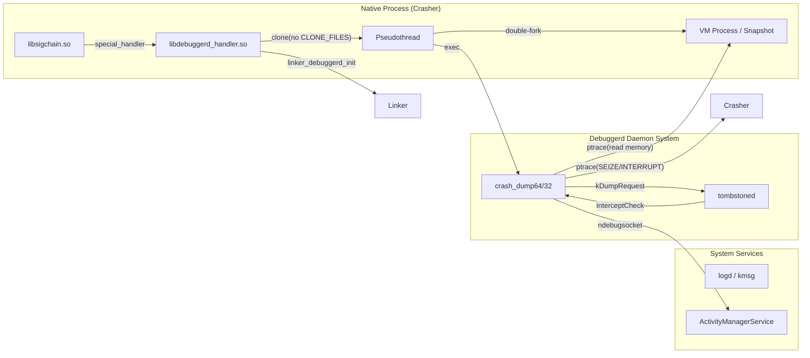
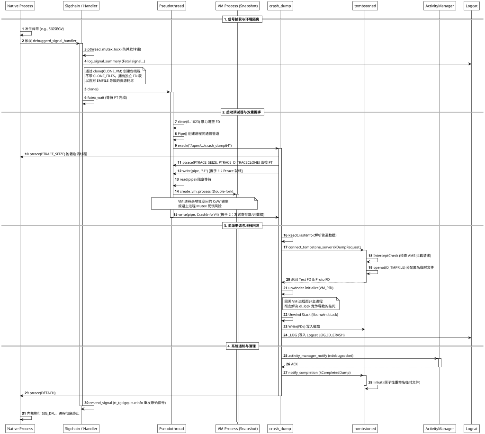

在 Android 系统中，Native Crash 的处理是一个高度解耦且极其鲁棒的多进程协作闭环。其核心哲学是：**在损坏的现场外（Out-of-Process）进行安全重建**。

## 1. 系统组件架构 (Architectural Overview)

下图展示了参与 Crash 处理的关键组件及其静态拓扑关系：

---

## 2. 详细交互流程 (Sequence Diagram)

基于 `system/core/debuggerd` 源码深度还原的交互细节，涵盖了信号劫持、双重握手及内存镜像逻辑：

---

## 3. 关键技术实现深度解析

### 3.1 信号劫持层 (Sigchain & Handler)
*   **代码位置**：`art/sigchainlib/sigchain.cc`
*   **机制**：`libsigchain` 劫持了 `sigaction`。ART 注册其处理程序以处理虚函数表修复等逻辑，而 `debuggerd_signal_handler` 被注册为 **Special Handler**。
*   **自愈模式**：Android 14+ 引入 `android_handle_signal`。对于可恢复的 MTE 或 GWP-ASan 故障，调试器生成报告后会修改线程上下文（如禁用 MTE），使信号处理程序返回并恢复应用执行。

### 3.2 伪线程 (Pseudothread) 的设计精髓
*   **资源回收**：崩溃现场可能已耗尽 FD（`EMFILE`）。伪线程通过 `clone` 且不共享 FD 表，进入后执行 `syscall(__NR_close, i)` 暴力腾出空间，确保调试所需的管道和 Socket 能成功创建。
*   **死锁规避**：不使用 `pthread_create` 是为了避免触发 `atfork` 钩子，因为主进程的 `Loader` 锁或堆锁此时可能已被破坏或死锁。

### 3.3 VM Process：无锁镜像技术
*   **实现**：通过 `double-fork` 产生的孤儿进程充当“物理内存快照”。
*   **价值**：`unwindstack` 在回溯损坏的栈帧时需要频繁读取内存。在 VM 进程中读取可以完全规避主进程中因 `dl_lock` 或 `malloc` 锁竞争导致的调试器挂死问题。

### 3.4 运行时元数据注入 (CrashInfo V4)
*   **注入点**：Linker 在启动时通过 `linker_debuggerd_init` 将 `__libc_shared_globals()` 地址传递给 Handler。
*   **内容**：V4 协议不仅传输 `ucontext`，还包含了 **Scudo 分配器状态**、**GWP-ASan 详情**以及 **fdsan 表地址**。这使得 `crash_dump` 能够精准定位 Use-After-Free 或 FD Double Close 等深层内存安全问题。

### 3.5 信号重发与状态还原
*   **rt_tgsigqueueinfo**：调试结束后，Handler 使用此系统调用重发导致崩溃的信号。
*   **意义**：这确保了父进程（Init 或 Zygote）能捕获到真实的退出原因（Exit Status），触发正确的系统重启逻辑。
