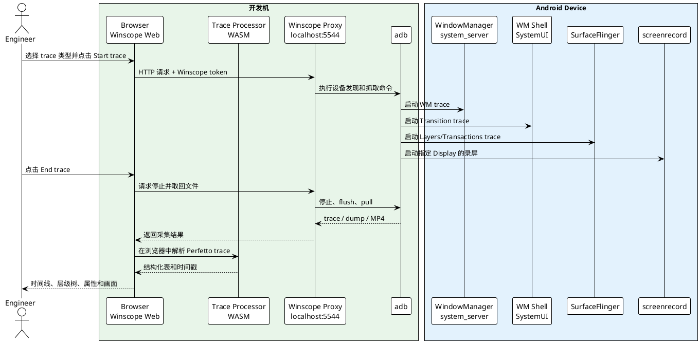

+++
date = '2026-07-13T09:00:00+08:00'
draft = false
title = 'Android Winscope：工作原理、编译、运行与部署'
+++

Winscope 是 Android 平台用于分析窗口、SurfaceFlinger Layer、窗口动画、输入法和系统界面状态的可视化工具。它尤其适合排查闪屏、黑屏、花屏、窗口层级错误、启动动画异常、画中画和多窗口切换异常等问题。

Winscope 不是单一的 trace recorder。更准确地说，它由以下几部分组成：

1. 运行在浏览器中的 Winscope Web 前端。
2. 运行在开发机上的 Winscope Proxy。
3. Android 设备上的 WindowManager、SurfaceFlinger、WM Shell、`screenrecord` 等数据生产者。
4. 运行于浏览器中的 Perfetto Trace Processor WASM。

本文介绍 Winscope 的工作原理、主要用途，以及如何从 AOSP 源码编译、运行和部署一套可离线分发的 Winscope。

## 1. Winscope 能解决什么问题

普通 logcat 更擅长回答“某个时间点打印了什么日志”，但窗口和显示问题往往需要回答一组空间与时序问题：

- 哪个 Window 或 Layer 在异常帧突然出现？
- Layer 的位置、大小、裁剪区域、透明度和 Z-order 是否发生变化？
- App 是否已经提交新 Buffer？
- SurfaceFlinger 选择了 Client Composition 还是 Device Composition？
- 黑色区域来自 Android Layer，还是出现在 HWC/显示驱动之后？
- WindowManager、SurfaceFlinger 和录屏中的异常是否发生在同一时刻？

Winscope 把 WindowManager、SurfaceFlinger、Transition、录屏等数据放到统一的时间线上，并提供层级树、属性面板和二维/三维可视化，从而把“屏幕闪了一下”转换为可以逐帧验证的系统状态变化。

典型适用场景包括：

| 场景 | 重点数据 |
|---|---|
| 局部黑块、闪屏、花屏 | Screen recording、SF Layers、SF Transactions、HWC |
| 窗口突然消失或覆盖错误 | WindowManager、SF Layers、Transitions |
| Activity 启动/退出动画异常 | WindowManager、WM Shell Transitions、SF Transactions |
| 多显示屏或虚拟显示异常 | Screen recording、SF Virtual displays、Display 信息 |
| 输入法窗口位置或可见性异常 | WindowManager、IME traces、SF Layers |
| 物理屏异常但 Android 录屏正常 | 外部摄像机、HWC、显示驱动和供应商显示日志 |

## 2. 总体架构



### 2.1 Web 前端

Winscope 前端是 Angular/TypeScript 应用，主要负责：

- 选择设备和采集项目；
- 启停 trace；
- 导入本地 trace、dump 和录屏；
- 显示时间线、窗口树和 Layer 树；
- 展示某一帧的 Window/Layer 属性；
- 将多个数据源按时间戳关联起来。

生产构建是纯静态文件，可以由 Python HTTP Server、Nginx、Apache 等普通 Web Server 提供服务。

### 2.2 Winscope Proxy

浏览器不能直接执行开发机上的 `adb`，因此 Winscope 使用本地 Python Proxy 作为桥梁。当前源码中的默认地址是：

```text
http://localhost:5544
```

Proxy 的职责包括：

- 通过 `adb devices` 枚举设备；
- 在选定设备上执行 Winscope 抓取命令；
- 启停 WindowManager、SurfaceFlinger 和录屏；
- 从设备取回采集结果；
- 通过 HTTP 将数据返回给浏览器。

Proxy 启动时会生成安全 token，并保存到：

```text
~/.config/winscope/.token
```

浏览器连接 Proxy 时需要携带该 token。前端和 Proxy 还会校验版本，因此必须成套分发，不能把新版前端与旧版 `winscope_proxy.py` 混用。

### 2.3 Android 设备上的数据生产者

Android 新版本逐步把 Winscope 数据接入 Perfetto。常见 datasource 包括：

```text
android.windowmanager
com.android.wm.shell.transition
android.surfaceflinger.layers
android.surfaceflinger.transactions
```

部分设备或旧版本仍使用 legacy Winscope trace。设备是否支持某个 Perfetto datasource，应以实际查询结果为准：

```bash
adb shell perfetto --query |
  grep -E 'android.windowmanager|com.android.wm.shell.transition|android.surfaceflinger'
```

Perfetto 配置中写入一个 datasource 名称，并不代表设备一定注册了相应 producer。比如 Android 16 的 WindowManager Perfetto tracing 还可能受平台 feature flag 控制；未注册时配置可以启动，但不会产生 WM 数据。

### 2.4 Trace Processor WASM

生产目录中的文件：

```text
engine_bundle.js
trace_processor.wasm
trace_processor_memory64.wasm
```

用于在浏览器中解析 Perfetto trace。解析主要在本机浏览器内完成，不需要单独部署 Perfetto 服务。WASM、前端 parser 和 proto 定义之间存在版本配套关系，因此分析新平台 trace 时应优先使用同版本或更新版本的 Winscope。

## 3. Winscope 录屏与 Layer trace 的区别

Winscope 可以同时录制一个或多个 Display，这是官方采集流程的一部分，但需要区分“录屏”和“Layer trace”：

- **Screen recording** 记录所选 Display 的最终画面；
- **WindowManager trace** 记录窗口层级、可见性、焦点、Bounds、配置和动画状态；
- **SurfaceFlinger Layers trace** 记录 Layer 层级、位置、裁剪、透明度、Z-order、Buffer 元数据和合成信息；
- **SurfaceFlinger Transactions trace** 记录 Layer 属性和 Buffer transaction 的变化过程；
- `TRACE_FLAG_BUFFERS` 记录 Buffer 变化及元数据，不保存每个 Layer 的真实像素内容。

因此，Winscope 能在录屏中看到异常画面，并在相同时间附近检查每个 Layer 的状态，但不能从 WindowManager/SF trace 中单独还原每个 Layer 的图像 Buffer。

对于显示问题，可以使用如下判断方法：

| 现象 | 初步判断 |
|---|---|
| Winscope 录屏和外部摄像机都看到黑块 | 问题大概率发生在 Android 合成链路或更上游 |
| SF Layer 中存在覆盖区域的异常黑色/Color Layer | 重点检查 Layer 创建者、Z-order、alpha 和 transaction |
| 外部摄像机看到异常，但 Screen recording 正常 | 重点检查 HWC、PVM、Display driver、链路和物理屏 |
| Screen recording 有异常，但 WM/SF 层级没有结构变化 | 重点检查 App Buffer 内容、视频解码或 Buffer 生产者 |

Android 2024 年 9 月之后、`adb screenrecord` 1.4 及以上版本支持在 Winscope 中选择多个 Display；旧版本通常只能录制单个 Display。

## 4. SurfaceFlinger 抓取选项

Winscope 页面中的 SurfaceFlinger 选项与 Perfetto trace flags 基本对应：

| Winscope 选项 | Perfetto flag | 作用 |
|---|---|---|
| Input | `TRACE_FLAG_INPUT` | 记录 Layer 关联的输入窗口信息 |
| Composition | `TRACE_FLAG_COMPOSITION` | 记录合成类型、可见区域等合成状态 |
| Metadata | `TRACE_FLAG_EXTRA` | 记录额外 metadata 和 offscreen layers |
| HWC | `TRACE_FLAG_HWC` | 记录额外的 Hardware Composer 文本信息 |
| Trace buffers | `TRACE_FLAG_BUFFERS` | Buffer 变化时也生成状态快照 |
| Virtual displays | `TRACE_FLAG_VIRTUAL_DISPLAYS` | 包含虚拟显示对应的 Layer |

`HWC`、`Metadata` 和 `Trace buffers` 都可能显著增大 trace。特别是 `MODE_ACTIVE + TRACE_FLAG_BUFFERS` 会在 Buffer latch 时频繁生成 Layer snapshot，若同时启用 HWC，每个 snapshot 还可能带有较大的 HWC dump。

采集多个高流量 datasource 时，建议为 WM、SF Layers、SF Transactions 和 Transition 分配独立 Perfetto buffer。省略 `target_buffer` 时，它们默认竞争 buffer 0，SF 的高频数据可能覆盖低频 WM snapshot。

## 5. 源码目录与依赖

在 Android 源码树中，`ANDROID_BUILD_TOP` 表示源码根目录。Winscope 位于：

```text
$ANDROID_BUILD_TOP/development/tools/winscope
```

主要目录和文件如下：

```text
development/tools/winscope/
├── package.json
├── webpack.config.common.js
├── webpack.config.dev.js
├── webpack.config.prod.js
├── protos/                         # Winscope 使用的 proto 定义
├── src/
│   ├── adb/winscope_proxy.py       # 本地 ADB Proxy
│   ├── parsers/                    # legacy/Perfetto 数据解析
│   ├── trace_collection/           # 抓取控制和设备连接
│   ├── trace_processor/            # Trace Processor 接入
│   └── viewers/                    # WM/SF/IME 等 Viewer
├── deps_build/trace_processor/     # Trace Processor 构建产物
└── dist/prod/                      # 可部署的生产版本
```

构建环境通常需要：

- Android 源码树；
- Node.js 和 npm；
- Python 3.10+；
- ADB；
- 构建 Trace Processor 所需的 Clang/LLVM、WASM toolchain 等依赖。

没有 AOSP 环境的使用者不需要这些构建依赖，只需要最终的 `dist/prod`。

## 6. 安装前端依赖

进入 Winscope 目录：

```bash
cd $ANDROID_BUILD_TOP/development/tools/winscope
```

安装依赖：

```bash
npm install
```

如果项目使用 pnpm 管理依赖，则应遵循源码树中 lockfile 和团队约定，不要在同一工作区反复混用 npm/pnpm，以免 lockfile 和 `node_modules` 状态不一致。

网络不稳定时，`ECONNRESET` 或 `ERR_PNPM_BROKEN_METADATA_JSON` 通常是 registry 下载中断，并不代表 Winscope 源码有问题。应先确认代理、registry 和缓存，再重新安装。

## 7. 构建方式

### 7.1 完整生产构建

```bash
npm run build:prod
```

这条命令依次执行：

1. `build:trace_processor`：构建 Perfetto Trace Processor JavaScript/WASM；
2. `build:protos`：重新生成 Winscope proto 代码；
3. `build:app`：构建 Web 前端并复制运行资源。

最终产物位于：

```text
dist/prod/
```

### 7.2 分步构建

重新构建 Trace Processor：

```bash
npm run build:trace_processor
```

重新生成 proto：

```bash
npm run build:protos
```

只重新构建 Web 应用：

```bash
npm run build:app
```

如果以下文件已经存在：

```text
deps_build/trace_processor/to_be_served/engine_bundle.js
deps_build/trace_processor/to_be_served/trace_processor.wasm
deps_build/trace_processor/to_be_served/trace_processor_memory64.wasm
```

通常可以直接执行 `npm run build:app`，不必每次重建 Perfetto。这也能绕开部分源码树中 WASM toolchain 与 libc++ ABI 不匹配导致的 `wasm-ld undefined symbol: std::__2::...` 问题。

但应确保这些 WASM 文件来自与当前 Winscope 版本兼容的 Perfetto 构建，不能长期混用来源不明的旧文件。

## 8. 开发模式运行

启动 Webpack development server：

```bash
cd $ANDROID_BUILD_TOP/development/tools/winscope
npm run start
```

默认行为包括：

- 监听 `8080` 端口；
- 自动打开浏览器；
- 启用 hot reload；
- 使用 `webpack.config.dev.js`；
- 从 `deps_build/trace_processor/to_be_served` 复制 WASM 和 engine bundle。

开发页面通常为：

```text
http://localhost:8080/
```

如果需要直接从设备抓取数据，还要启动 Proxy：

```bash
python3 src/adb/winscope_proxy.py
```

输出示例：

```text
Winscope ADB Connect proxy version: 6.0.1
Winscope token: <随机 token>
```

然后在 Winscope 中选择 `Winscope Proxy`，输入 token 并连接设备。

## 9. 生产模式本机运行

生产目录是自包含的静态站点，但不能依赖双击 `index.html` 的 `file://` 方式运行。WASM 和 JavaScript 资源通过浏览器 Fetch API 加载，应使用 HTTP Server。

进入生产目录：

```bash
cd $ANDROID_BUILD_TOP/development/tools/winscope/dist/prod
```

启动静态服务器：

```bash
python3 -m http.server 8080 --bind 127.0.0.1
```

浏览器打开：

```text
http://127.0.0.1:8080/
```

如果只导入已有 trace，不需要运行 Proxy。如果需要连接 Android 设备，在另一个终端执行：

```bash
cd $ANDROID_BUILD_TOP/development/tools/winscope/dist/prod
python3 winscope_proxy.py
```

## 10. 分发给没有 AOSP 环境的同事

生产目录已经包含 Web 前端、WASM 和配套 Proxy，可以直接打包：

```bash
cd $ANDROID_BUILD_TOP/development/tools/winscope

tar -C dist/prod \
  -czf winscope-standalone-6.0.1.tar.gz \
  .
```

同事只需要：

- Python 3.10+；
- Chrome/Chromium；
- 如需抓取设备，安装 Android platform-tools 并把 `adb` 加入 `PATH`。

解压并运行：

```bash
mkdir winscope-standalone
tar -xzf winscope-standalone-6.0.1.tar.gz -C winscope-standalone
cd winscope-standalone

python3 -m http.server 8080 --bind 127.0.0.1
```

另开终端启动 Proxy：

```bash
cd winscope-standalone
python3 winscope_proxy.py
```

验证设备：

```bash
adb devices -l
```

浏览器访问 `http://127.0.0.1:8080/`，输入 Proxy 输出的 token 即可。

## 11. 部署到团队内部 Web Server

也可以把 `dist/prod` 部署到公司内部 Nginx，让同事通过统一 URL 打开 Winscope。官方文档同样支持把生产构建托管到标准 Web Server。

复制文件：

```bash
sudo mkdir -p /srv/winscope
sudo cp -a dist/prod/. /srv/winscope/
```

一个简单的 Nginx 配置如下：

```nginx
server {
    listen 8080;
    server_name _;

    root /srv/winscope;
    index index.html;

    location / {
        try_files $uri $uri/ /index.html;
    }

    types {
        text/html html;
        text/css css;
        application/javascript js;
        application/wasm wasm;
        image/svg+xml svg;
    }

    add_header Cache-Control "no-cache";
}
```

检查并重载：

```bash
sudo nginx -t
sudo systemctl reload nginx
```

集中部署的只是 Web 前端。每个需要连接设备的同事，仍然应在自己的电脑上运行同版本 `winscope_proxy.py`：

```bash
python3 winscope_proxy.py
```

浏览器中的前端会访问用户自己电脑上的 `http://localhost:5544`，因此不应该在服务器上集中运行一个共享 ADB Proxy。

## 12. 安全注意事项

Winscope Proxy 提供了执行 ADB 命令、启动 trace 和读取设备文件的能力，应遵守以下原则：

1. Proxy 只监听 `localhost`，不要改成 `0.0.0.0` 暴露到局域网。
2. 不要把 `~/.config/winscope/.token` 发送给其他人。
3. Web 前端和 Proxy 必须使用匹配版本。
4. 抓取文件可能包含窗口标题、应用信息、画面和用户数据，应按内部敏感数据处理。
5. 公共服务器只部署静态前端，不要部署可访问真实设备的共享 Proxy。

当前 Proxy 默认绑定：

```python
HTTPServer(("localhost", 5544), ADBWinscopeProxy)
```

保持 loopback 绑定可以避免其他主机直接调用本机 ADB。

## 13. 常见问题

### 13.1 页面能打开，但无法加载 trace

检查浏览器开发者工具中的 Network 和 Console：

- 是否通过 `http://` 打开，而不是 `file://`；
- `trace_processor.wasm` 是否返回 HTTP 200；
- WASM MIME type 是否为 `application/wasm`；
- `engine_bundle.js` 是否与 WASM 配套；
- trace 是否完整，尾部是否被截断。

### 13.2 Proxy 显示版本不匹配

生产前端和 `winscope_proxy.py` 中都定义了 Proxy version。解决办法是使用同一个 `dist/prod` 中自带的 Proxy，不要从其他 AOSP 分支或旧工具目录复制。

### 13.3 Winscope 没有发现设备

先脱离 Winscope 检查 ADB：

```bash
adb kill-server
adb start-server
adb devices -l
```

如果设备状态为 `unauthorized`，需要在设备端确认 USB 调试授权。

### 13.4 配置了 WindowManager，但 trace 中没有 WM 数据

检查 datasource 是否注册：

```bash
adb shell perfetto --query | grep android.windowmanager
```

同时检查：

- 系统是否启用了 WindowManager Perfetto tracing；
- 当前 build 是否为 debuggable；
- 是否存在 legacy WM tracing 与 Perfetto tracing 的版本差异；
- WM 是否与高流量 SF datasource 共用一个过小的 Ring Buffer；
- 停止 trace 时是否完成 flush；
- trace 文件是否在 pull 前被截断。

### 13.5 SurfaceFlinger trace 很快达到上百 MB

常见原因是同时启用了：

```text
MODE_ACTIVE
TRACE_FLAG_BUFFERS
TRACE_FLAG_HWC
TRACE_FLAG_EXTRA
```

可以缩短采集时间、为不同 datasource 分配独立 buffer，或按问题需要关闭 Input、Metadata、HWC 等非必要选项。

### 13.6 Screen recording 没看到摄像机拍到的闪屏

这是非常有价值的证据。Android `screenrecord` 的捕获位置不等同于物理屏最终输出。如果外部摄像机看到黑块，而 Winscope 录屏正常，应优先排查：

- Hardware Composer；
- PVM/共享显示链路；
- Display driver；
- DPU/DSI/SerDes；
- 面板或物理链路。

## 14. 闪屏问题的推荐抓取组合

对于一闪而过的局部黑块或花屏，建议在 Winscope 中同时选择：

- **Screen recording**：选择发生问题的 Display；
- **WindowManager**：Transaction + Verbose；
- **SurfaceFlinger Layers**：Composition、Trace buffers、HWC、Virtual displays；
- **SurfaceFlinger Transactions**；
- **WM Shell Transitions**；
- **外部摄像机**：记录物理屏最终输出。

分析顺序建议如下：

1. 从录屏或外部视频确定异常帧的时间。
2. 在 SF Layers 中查找覆盖异常区域的 Layer。
3. 检查该 Layer 的 bounds、crop、alpha、Z-order、visible region 和 Buffer frame number。
4. 在 SF Transactions 中定位属性或 Buffer 更新来源。
5. 对照 WindowManager 判断是否有 Window/Task/Transition 状态变化。
6. 对照 HWC 和供应商日志判断异常是否发生在 Android 合成之后。

## 15. 参考资料

- [Run Winscope](https://source.android.com/docs/core/graphics/winscope/run)
- [Capture traces with Winscope](https://source.android.com/docs/core/graphics/winscope/capture/winscope)
- [Winscope overview](https://source.android.com/docs/core/graphics/winscope)
- [Perfetto documentation](https://perfetto.dev/docs/)

