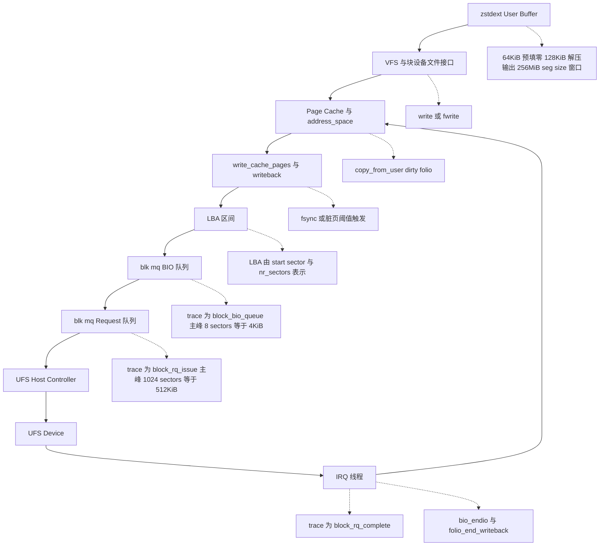
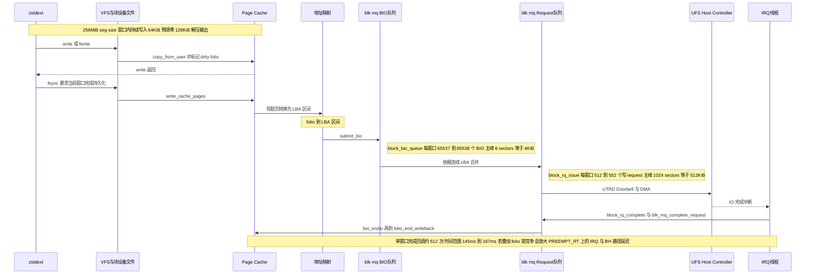

+++
date = '2026-03-15T22:30:00+08:00'
draft = false
title = 'Linux 存储栈全景解析：从用户空间到 UFS 的数据路径'
+++

在 Android 与嵌入式 Linux 系统中，应用对块设备的写入通常不会直接到达存储介质，而是先进入内核 Page Cache，再由回写路径异步下沉到块层和 UFS。理解这一数据路径，是分析 OTA 刷写性能与稳定性问题的前提。

本文结合 `zstdext` OTA 刷写案例与 kernel trace 数据，分析 `--seg-size=256`（即 256MB）配置下单个写回窗口在 VFS、Page Cache、blk-mq 与 UFS 路径上的行为。当前工程已将 `seg-size` 下调为 `64MB`，其工程目的在于降低单次 `fsync()` 所驱动的写回批量；本文重点说明 `256MB` 配置为何更容易形成高密度的块层写回与完成回调。

## 1. 架构总览：从用户缓冲到完成回调

`zstdext` 对目标块设备执行的是典型的 Buffered I/O 路径。应用写入首先进入 VFS 和 Page Cache，随后由回写机制将脏页转换为块层 I/O，再由 UFS 控制器完成 DMA 传输，最终通过中断完成路径清理写回状态。

图中的三个关键 trace 观测点分别位于块层提交、驱动下发和完成回调阶段：

* `block_bio_queue`：`struct bio` 进入块层队列。
* `block_rq_issue`：合并后的 `request` 被下发到低层驱动。
* `block_rq_complete`：`request` 完成并返回块层。

---

## 2. zstdext 的工作原理与 seg-size 行为解析

### 2.1 差分合并的宏观模型

OTA 升级本质上执行的是：`基础镜像（/dev/zero 或旧分区） + 差分文件 (.patch) = 新版本镜像（目标块设备）`。

* 输入：体积差异较大的 `.patch` 压缩包。
* 输出：一个可能达到数 GB 的完整目标分区镜像。

### 2.2 `seg-size` 的控制对象

`--seg-size=256` 并不是输入 patch 文件的大小，而是 `zstdext` 在输出解压数据时采用的目标空间写入窗口。对于目标块设备上的每个窗口，`zstdext` 都会重复执行同一组操作：

1. 确定当前输出区间，例如 `0MB ~ 256MB`。
2. 对该区间执行一轮 `64KiB x 4096 次` 的 Buffered 预填零，使该窗口对应的地址空间首先积累大量脏页。
3. 将真实解压数据覆盖写入同一窗口。
4. 在窗口边界调用 `fsync()`，要求当前窗口内已提交到 Page Cache 的数据完成持久化。
5. 窗口滑动到下一段区间，例如 `256MB ~ 512MB`，重复上述流程。

这一行为与输入 patch 文件的体积没有直接关系，而与目标输出空间的推进粒度直接相关。对于 `256MB` 配置，`zstdext` 每推进 `256MB` 的物理地址跨度，就会触发一次固定规模的写回窗口；将 `seg-size` 下调到 `64MB`，其工程含义是将单次 `fsync()` 前累积的地址空间跨度和脏页批量压缩为原来的四分之一。

---

## 3. 写入生命周期拆解

### 3.1 缓存写入阶段（Buffered I/O）

`Page Cache` 是内核针对文件与块设备地址空间维护的一层页级缓存。对于 Buffered I/O，应用提交的数据不会立即以设备请求的形式下发到存储介质，而是先写入 `Page Cache` 中对应的缓存页，并以 `dirty` 状态留在内存里，等待后续回写。

引入 `Page Cache` 的目的主要有四点。其一，解耦应用写入延迟与设备写入延迟，使 `write()` 可以在内存复制完成后尽快返回。其二，将多个细粒度写入先吸收在内存中，再由内核按页、按地址区间进行整理和批量回写，以减少随机、离散的小 I/O 对底层设备的直接冲击。其三，统一管理脏页、回写、失效与重读路径，使文件系统和块层能够在同一套缓存语义下协同工作。其四，为读路径复用同一份缓存页，避免热点数据被反复从设备读取。

当 `zstdext` 持续调用 `write()` 或 `fwrite()` 时，数据首先沿着 VFS 与块设备地址空间路径进入内核缓存：

1. VFS 接收写请求，并将其路由到目标块设备对应的文件接口与 `address_space`。
2. 内核在 Page Cache 中分配或定位对应的 `folio`。`folio` 是当前内核用于管理页缓存的一类内存页集合对象。
3. `copy_from_user()` 将用户态缓冲区的数据复制到 Page Cache。
4. 对应 `folio` 被标记为 `dirty`，表示内存内容已经新于设备内容。
5. `write()` 返回成功。此时完成的是“用户态到 Page Cache”的复制与状态标记，数据尚未进入块层提交队列。

### 3.2 回写触发与同步边界

Page Cache 中的脏页不会永久停留在内存中。回写机制通常由以下条件触发：

* 脏页比例超过 `dirty_background_ratio` 等阈值。
* 脏页驻留时间超过 `dirty_expire_centisecs` 等上限。
* 应用显式调用 `fsync()` 或 `fdatasync()`。

这里需要区分两个常见但含义不同的 VM 参数。

* `dirty_background_ratio`：后台回写启动阈值，表示系统内存中允许处于 `dirty` 状态的页占比达到某个比例后，内核后台回写线程需要开始异步回写。它控制的是“何时开始在后台清理脏页”，并不直接要求当前写线程阻塞。
* `dirty_expire_centisecs`：脏页老化时间阈值，单位为百分之一秒。某个脏页如果在内存中停留时间超过该阈值，就会被视为“已经足够旧”，在后续周期性回写中优先进入回写候选集。它控制的是“脏页最多可以在内存中保留多久”。

在 `zstdext` 场景中，最关键的边界是 `fsync()`。每个 `256MB` 写入窗口结束时，`zstdext` 会显式发起一次 `fsync()`；其语义不是“继续写下一段”，而是“要求当前窗口内已写入 Page Cache 的内容完成持久化”。因此，`write_cache_pages()` 会在窗口边界上集中遍历并下发当前窗口内的大量脏页。

### 3.3 LBA 映射与块层排队

块层分析需要先明确几个术语。

| 术语 | 定义 | 在 trace 中的表示 |
| --- | --- | --- |
| `LBA` | Logical Block Address，块设备逻辑地址。trace 以 sector 为单位记录。 | `223963224 + 8` |
| `LBA 区间` | 由起始 sector 与长度共同表示的地址范围。sector 大小通常为 512B。 | `[223963224, 223963232)` |
| `BIO` | `struct bio`，块层最初接收的 I/O 描述符。 | `block_bio_queue` |
| `Request` | blk-mq 调度与合并后的下发单元。 | `block_rq_issue` / `block_rq_complete` |

`BIO` 可以理解为“块层中的一次 I/O 描述对象”。它负责描述这次 I/O 访问哪个块设备、覆盖哪个 LBA 区间、方向是读还是写、数据页位于哪些内存片段中。`BIO` 面向的是“数据与地址映射”这一层语义，而 `request` 面向的是“调度、合并和驱动下发”这一层语义。

引入 `BIO` 的原因在于，文件系统、回写路径与块设备驱动之间需要一个统一的中间表示。上层首先把脏页转换为若干 `BIO`，块层随后再根据相邻地址区间、队列策略和驱动能力对这些 `BIO` 进行合并、拆分或重映射，最终形成可下发的 `request`。这种分层使“页缓存到块地址的转换”与“调度下发到设备”的职责解耦，也使 scatter-gather 内存布局、分段 I/O 和多队列调度能够在同一框架内工作。

当 trace 记录一行 `block_bio_queue: 8,0 WS 223963224 + 8 [zstdext]` 时，可将其理解为：对块设备 `8,0` 的一次写 BIO，覆盖的 LBA 区间为 `[223963224, 223963232)`，总长度为 `8 sectors = 4096B`。对应地，一行 `block_rq_issue: ... 224487512 + 1024` 表示一个已经合并后的写 request，被下发到低层驱动，其覆盖的 LBA 区间为 `[224487512, 224488536)`，总长度为 `1024 sectors = 512KiB`。

对于普通文件写入，文件系统需要先完成逻辑偏移到物理块的映射；对于 `zstdext` 这类面向目标块设备节点的写入，映射关系更直接，但最终统一表现为“脏页被转换为一组按 sector 编址的 LBA 区间”，并进入 blk-mq。

### 3.4 Trace 量化结果：256MiB 写回窗口的块层形态

对 `trace_result.dat` 中前 `10` 个完整 `256MiB` 写回窗口进行统计，并以 LBA 区间重叠关系关联 `block_bio_queue`、`block_rq_issue` 与 `block_rq_complete` 后，可得到如下结果：

| 指标 | 观测结果 |
| --- | --- |
| 单窗口持续时间 | `145.6ms ~ 166.7ms`，中位数约 `155.3ms` |
| `block_bio_queue` 数量 | `65537 ~ 65538` 个 |
| BIO 主峰大小 | `8 sectors = 4KiB` |
| 写 `block_rq_issue` 数量 | `512 ~ 552` 个，中位数 `513` |
| Request 主峰大小 | `1024 sectors = 512KiB` |
| `BIO -> Request` 合并比例 | `118.73:1 ~ 128:1`，中位数 `127.75:1` |
| `rq_issue -> rq_complete` 延迟 | `p50 = 198us`，`p90 = 5.43ms`，`p99 = 6.10ms`，`max = 7.68ms` |

这些数字给出了块层形态的两个关键结论。

第一，`256MiB` 写回窗口在 BIO 层几乎等价于约 `65536` 个 `4KiB` 写 BIO。这个数量与 `256MiB / 4KiB` 的理论值严格对齐，说明窗口边界处确实形成了大规模细粒度 BIO 提交。

第二，blk-mq 对这些 BIO 做了明显合并。下发到低层驱动的写 request 主峰并不是 `4KiB`，而是 `512KiB`。因此，对该路径的准确描述应当是“单个 `256MiB` `fsync()` 窗口会在约 `150ms` 的时间尺度内集中产生约 `6.55 万` 个 `4KiB BIO`，并进一步形成约 `512` 个 `512KiB` 写 request 及其完成回调突发”，而不是“所有底层写请求都被切成 `4KiB`”。

这一点同时划定了分析边界：当前 trace 能够证明块层的提交、合并与完成密度，但不能据此反推出 UFS 设备内部 FTL 的实际编程粒度。

### 3.5 UFS 提交与 DMA

Request 进入 UFS 路径后，主机控制器与设备完成以下工作：

1. 驱动将块层 request 翻译为控制器可识别的传输描述符 `UTRD`（UFS Transfer Request Descriptor）。
2. 驱动更新命令队列并敲击 Doorbell 寄存器，通知控制器有新的 request 待处理。
3. UFS 控制器通过 DMA 从主存中读取对应数据，并与设备侧完成协议交互与数据落盘。

从块层视角看，`block_rq_issue` 表示 request 已经向下游提交；从设备视角看，真正的闪存编程、缓存管理与 FTL 细节仍位于控制器和设备内部，不直接暴露在当前 trace 中。

### 3.6 完成回调与 PREEMPT_RT 放大路径

当 UFS 控制器完成 I/O 后，会触发完成中断。在 PREEMPT_RT 内核中，绝大多数中断处理被线程化；因此，I/O 完成回调通常运行在专用的 `irq/...` 内核线程中，而不是长时间停留在硬中断上下文内。

这一阶段涉及两个需要明确的内核概念：

* `IRQ 线程`：PREEMPT_RT 下承载中断主要处理逻辑的内核线程。
* `BH`（Bottom Half）：用于承载 softirq 等下半部处理的执行域。`local_bh_disable()` 与 `local_bh_enable()` 用于控制该执行域的本地 CPU 进入与退出。

完成路径大致如下：

1. UFS 控制器报告 I/O 完成，唤醒对应的 IRQ 线程。
2. IRQ 线程进入 UFS 完成回调，例如 `ufshcd_compl_one_cqe()`。
3. 完成通知沿 `scsi_done -> blk_mq_complete_request -> bio_endio -> __folio_end_writeback()` 向上返回。
4. `__folio_end_writeback()` 清除 Page Cache 中相应 `folio` 的写回状态，并唤醒等待该写回完成的路径。

结合前述量化结果可以看到，单个 `256MiB` 写回窗口会在 `145ms ~ 167ms` 内集中产生约 `512` 个写 request 完成事件。若完成回调路径同时遭遇 `folio` 锁竞争或其他同步点，这种完成回调突发会在 PREEMPT_RT 上放大 IRQ 线程与 BH 相关路径的延迟。这正是将 `seg-size` 从 `256MB` 下调到 `64MB` 的重要工程依据之一：问题的核心不是单个 request 的平均带宽，而是单次 `fsync()` 所驱动的提交与完成密度。

---

## 4. 全局核心时序图

下图给出了 `256MiB seg-size` 写回窗口在 VFS、Page Cache、blk-mq 与 UFS 路径上的完整时序关系，并将 `block_bio_queue`、`block_rq_issue`、`block_rq_complete` 与 LBA 概念放入同一上下文中。

