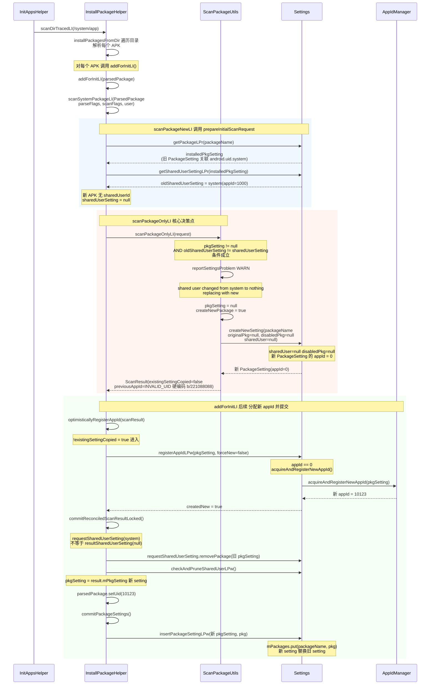
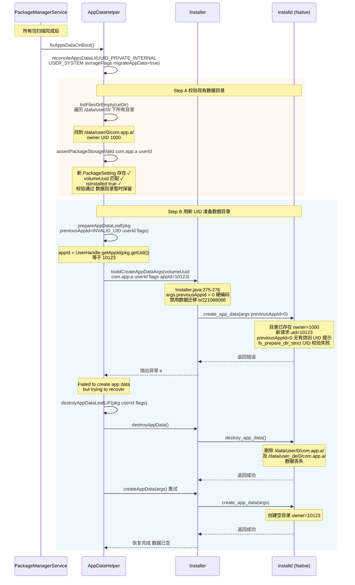
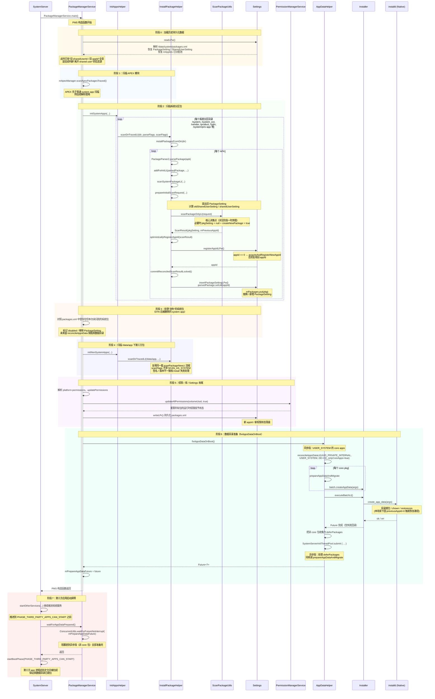

+++
date = '2025-09-28T11:36:11+08:00'
draft = false
title = 'OTA 后系统应用 sharedUserId 变更，/data 数据是否保留？'
+++

## 背景

在 Android 系统 OTA 升级场景中，存在这样一种情况：

- **OTA 前**：应用 A 是系统应用，在 `AndroidManifest.xml` 中声明了 `android:sharedUserId="android.uid.system"`，因此运行在 system UID（1000）下。
- **OTA 后**：开发人员移除了应用 A 的 `sharedUserId` 声明（或将其改为普通 UID），使其变为一个普通 appId 的应用。

**核心问题**：OTA 完成后首次开机，应用 A 在 `/data/user/0/<packageName>/` 下的私有数据还存在吗？

本文基于 AOSP Android 13（T）架构下 `frameworks/base` 的实际源码进行分析，并通过实际测试验证结论。

> **重要结论（先说答案）**：**数据目录实际会丢失**。虽然 PMS 在扫描阶段会保留新的 PackageSetting（包名仍然注册），但由于 Google 通过 `ScanResult.java:75` 与 `Installer.java:275` 硬编码 `previousAppId = INVALID_UID / 0`（见 bug `b/221088088`），`installd` 无法得知"旧 UID"，无法对已有目录执行 chown，最终触发 `prepareAppDataLeaf` 的错误恢复分支：**先 destroy 旧数据，再建空目录**。

> **另一常见误区**：网络上的说法（也常由 LLM 生成）称 PMS 会抛 `INSTALL_FAILED_UID_CHANGED` 异常，在 catch 中 `removePackageLPw` → `destroyAppDataLIF` → 二次扫描。**这与源码不符**。实际逻辑是"静默替换"，见 `ScanPackageUtils.java:168-177`。

## 实测证据（先验证再分析）

写了一个测试 APK `com.voyah.polaris.test`：
- 第一版：无 `sharedUserId`（普通 UID），安装并写入数据。
- 第二版：加上 `android:sharedUserId="android.uid.system"`。
- OTA / 开机后观察数据目录。

关键日志：

```
PackageManager: Package com.voyah.polaris.test shared user changed from <nothing>
                to android.uid.system; replacing with new
PackageManager: Adding duplicate shared id: 1000 name=com.voyah.polaris.test
```

同时观察到 `/data/user/0/com.voyah.polaris.test/` 中原先写入的数据**不存在了**。

- 第一条 WARN 正是下文 `ScanPackageUtils.java:168-177` 的输出。
- 第二条 WARN 来自 `AppIdSettingMap.registerExistingAppId()`（`AppIdSettingMap.java:80`）：PMS 尝试把 com.voyah.polaris.test 以 appId 1000 再次登记为 system 条目时，发现该 appId 已被 SharedUserSetting("android.uid.system") 占用，因此拒绝注册。
- 方向上虽与"OTA"场景相反（普通 → system），但核心路径一致（下文"对称性"一节）。结论：**任一方向上 sharedUserId 变更，数据目录都不保留。**

## 代码执行流程

### 1. 开机扫描入口

```
PMS 构造函数
  → InitAppsHelper.initSystemApps()
    → scanDirTracedLI()                                    [InitAppsHelper.java]
      → InstallPackageHelper.installPackagesFromDir()      [InstallPackageHelper.java:3460]
        → addForInitLI(parsedPackage, ...)                 [InstallPackageHelper.java:3522]
          → scanSystemPackageLI(ParsedPackage, ...)        [InstallPackageHelper.java:3851]
            → scanPackageNewLI(...)                        [InstallPackageHelper.java:4040]
              → ScanPackageUtils.scanPackageOnlyLI(...)    [ScanPackageUtils.java:117]
```

`InitAppsHelper` 遍历 `/system/app`、`/system/priv-app` 等分区目录，对每个 APK 调用 `installPackagesFromDir`，该方法解析 APK 后调用 `addForInitLI`，进入系统包扫描流程。

### 2. 读取旧配置与新 APK 的 sharedUserId

`scanPackageNewLI()` 内部调用 `prepareInitialScanRequest()` 准备扫描请求：

```java
// InstallPackageHelper.java:3746 - prepareInitialScanRequest()

// 从 packages.xml 获取旧的 PackageSetting（含旧 sharedUserId 关联）
installedPkgSetting = mPm.mSettings.getPackageLPr(parsedPackage.getPackageName());

// 获取旧的 SharedUserSetting
if (installedPkgSetting != null) {
    oldSharedUserSetting = mPm.mSettings.getSharedUserSettingLPr(installedPkgSetting);
}
// → oldSharedUserSetting = android.uid.system 对应的 SharedUserSetting

// 判断新 APK 的 sharedUserId
boolean ignoreSharedUserId = false;
if (installedPkgSetting == null || !installedPkgSetting.hasSharedUser()) {
    ignoreSharedUserId = parsedPackage.isLeavingSharedUid();
}
// → installedPkgSetting 存在且 hasSharedUser，ignoreSharedUserId = false

if (!ignoreSharedUserId && parsedPackage.getSharedUserId() != null) {
    sharedUserSetting = mPm.mSettings.getSharedUserLPw(...);
} else {
    sharedUserSetting = null;
    // → 新 APK 已移除 sharedUserId，走这里
}
```

此时状态：
- `oldSharedUserSetting` = system 共享用户 Setting（appId = 1000）
- `sharedUserSetting` = null（新 APK 无 sharedUserId）

### 3. 核心决策：scanPackageOnlyLI 中的静默处理

进入 `ScanPackageUtils.scanPackageOnlyLI()`，真正的关键判断：

```java
// ScanPackageUtils.java:168-177

if (pkgSetting != null && oldSharedUserSetting != sharedUserSetting) {
    PackageManagerService.reportSettingsProblem(Log.WARN,
            "Package " + parsedPackage.getPackageName() + " shared user changed from "
                    + (oldSharedUserSetting != null ? oldSharedUserSetting.name : "<nothing>")
                    + " to "
                    + (sharedUserSetting != null ? sharedUserSetting.name : "<nothing>")
                    + "; replacing with new");
    pkgSetting = null;  // ← 直接置空！当作全新包处理，不抛异常
}
```

**关键行为**：不抛 `INSTALL_FAILED_UID_CHANGED`，只输出一条 WARN 日志，然后将 `pkgSetting` 设为 `null`，后续走 `createNewPackage = true` 分支。

```java
// ScanPackageUtils.java:196-218
final boolean createNewPackage = (pkgSetting == null);  // true
if (createNewPackage) {
    pkgSetting = Settings.createNewSetting(parsedPackage.getPackageName(),
            originalPkgSetting,   // null
            disabledPkgSetting,   // null（假设从未有 /data 更新）
            realPkgName,
            sharedUserSetting,    // null（新包无 sharedUserId）
            destCodeFile, ...);
}
```

### 4. 分配全新 appId

`Settings.createNewSetting()` 中，由于 `sharedUser`、`originalPkg`、`disabledPkg` 均为 null，新 PackageSetting 的 appId 为 0（未分配）：

```java
// Settings.java:1109-1135
if (sharedUser != null) {
    pkgSetting.setAppId(sharedUser.mAppId);
} else {
    if (disabledPkg != null) {
        pkgSetting.setAppId(disabledPkg.getAppId());
    }
    // 两者都为 null → appId 保持 0
}
```

返回 `ScanResult` 时，`mPreviousAppId` 被**硬编码为 `INVALID_UID`**：

```java
// ScanResult.java:73-75
// Hardcode mPreviousAppId to INVALID_UID (http://b/221088088)
// This will disable all migration code paths in PMS and PermMS
mPreviousAppId = Process.INVALID_UID;
```

因此 `ScanResult.needsNewAppId()` 永远返回 false。进入 `optimisticallyRegisterAppId()`：

```java
// InstallPackageHelper.java:3707-3717
if (!result.mExistingSettingCopied || result.needsNewAppId()) {
    // !false || false = true
    return mPm.mSettings.registerAppIdLPw(result.mPkgSetting, result.needsNewAppId());
}
```

```java
// Settings.java:1302-1318
if (p.getAppId() == 0 || forceNew) {  // appId == 0 → true
    p.setAppId(mAppIds.acquireAndRegisterNewAppId(p));  // 分配新 appId，如 10123
    createdNew = true;
}
```

**应用 A 获得全新 appId（如 10123），不再是 system UID（1000）。**

### 5. 提交扫描结果

`commitReconciledScanResultLocked()` 完成提交：

```java
// InstallPackageHelper.java:274-292
// 清理旧的 SharedUser 关联
if (requestSharedUserSetting != null
        && requestSharedUserSetting != resultSharedUserSetting) {
    requestSharedUserSetting.removePackage(request.mPkgSetting);   // 从 system 共享用户移除
    mPm.mSettings.checkAndPruneSharedUserLPw(requestSharedUserSetting, false);
}

// 使用新 PackageSetting（因为 mExistingSettingCopied = false）
pkgSetting = result.mPkgSetting;

// 将新 appId 写入 AndroidPackage
parsedPackage.setUid(pkgSetting.getAppId());   // 如 10123

// commitPackageSettings() → 替换到全局表
mPm.mSettings.insertPackageSettingLPw(pkgSetting, pkg);
mPm.mPackages.put(pkg.getPackageName(), pkg);
```

**扫描阶段结束，全程未触及磁盘数据。**

### 6. 数据目录的命运：reconcileAppsData

```java
// PackageManagerService.java:2142
mPrepareAppDataFuture = mAppDataHelper.fixAppsDataOnBoot();
```

`fixAppsDataOnBoot()` 调用 `reconcileAppsDataLI()`，分两步处理。

**步骤 A：校验现有数据目录**

```java
// AppDataHelper.java:400-414
for (File file : files) {
    final String packageName = file.getName();
    try {
        assertPackageStorageValid(snapshot, volumeUuid, packageName, userId);
    } catch (PackageManagerException e) {
        logCriticalInfo(Log.WARN, "Destroying " + file + " due to: " + e);
        mInstaller.destroyAppData(volumeUuid, packageName, userId,
                StorageManager.FLAG_STORAGE_CE, 0);
    }
}
```

`assertPackageStorageValid()` 只校验包名注册、volumeUuid、isInstalled。**应用 A 的 PackageSetting 已替换为新的（包名未变），校验全部通过。所以数据目录此时不会被删。**

**步骤 B：用新 UID 准备数据目录 —— 真正决定数据存亡的地方**

```java
// AppDataHelper.java:196-237
final int appId = UserHandle.getAppId(pkg.getUid());        // 新 appId（如 10123）
final CreateAppDataArgs args = Installer.buildCreateAppDataArgs(
        volumeUuid, packageName, userId, flags, appId, seInfo, targetSdkVersion, usesSdk);
args.previousAppId = previousAppId;   // 传入值来自 ScanResult.mPreviousAppId = INVALID_UID
                                      // 但……见下文 Installer.java
```

随后 `Installer.createAppData()` 会做一次**关键的再硬编码**：

```java
// Installer.java:275-276
public CreateAppDataResult createAppData(CreateAppDataArgs args) throws InstallerException {
    // Hardcode previousAppId to 0 to disable any data migration (http://b/221088088)
    args.previousAppId = 0;
    ...
}
```

**即便上游传入了合理的旧 appId，这里也会被强制清零。**`installd` 收到 `create_app_data(args)` 后：

1. 发现 `/data/user/0/<packageName>/` 已存在，owner 是 UID 1000（system）
2. 新请求的 UID 是 10123，但 `args.previousAppId == 0`（INVALID）
3. `installd` 里的 `fs_prepare_dir_strict` 对 UID 做严格校验：既不匹配新 UID，也没有有效的"旧 UID 提示"可参考用来迁移 → **失败**
4. 错误返回到 `prepareAppDataLeaf` 的 `whenComplete` 回调：

```java
// AppDataHelper.java:225-238
return batch.createAppData(args).whenComplete((ceDataInode, e) -> {
    if (e != null) {
        logCriticalInfo(Log.WARN, "Failed to create app data for " + packageName
                + ", but trying to recover: " + e);
        destroyAppDataLeafLIF(pkg, userId, flags);              // ← 删除旧数据
        ceDataInode = mInstaller.createAppData(args).ceDataInode; // 重建空目录
    }
});
```

→ 数据被销毁并以新 appId 重建一个空目录。

这就是为什么实测中 `com.voyah.polaris.test` 的数据"没有迁移"。Google 在 `b/221088088` 中主动关闭了 chown 式迁移路径，**sharedUserId 变更场景的数据保留只能靠应用自己做备份。**

### 旁注：`prepareAppDataLeaf` 返回的 `CompletableFuture` 到底什么时候执行？

读上面这段代码很容易产生疑问：`batch.createAppData(args).whenComplete((ceDataInode, e) -> {...})` —— 这个 `whenComplete` 里的回调究竟在什么线程、什么时机被触发？同样地，`prepareAppDataAndMigrate` 里那个 `prepareAppData(...).thenRun(() -> {...})` 又是何时执行的？理解清楚 **`Installer.Batch` 的攒批 + 延迟兑现** 模型后，这条链路才不会让人困惑。

**关键事实 1：`batch.createAppData(args)` 不调 installd，只发一张"取货单"**

`Installer.Batch.createAppData(args)` 内部仅做三件事：

```java
// Installer.java:368-376
public synchronized CompletableFuture<Long> createAppData(CreateAppDataArgs args) {
    if (mExecuted) throw new IllegalStateException();
    final CompletableFuture<Long> future = new CompletableFuture<>();
    mArgs.add(args);            // 攒到批的参数列表
    mFutures.add(future);       // 攒到批的 future 列表
    return future;              // 立即返回这张"取货单"
}
```

调用瞬间立即返回。此时这个 `CompletableFuture` 处于 **未完成（incomplete）** 状态，挂在它上面的 `whenComplete` / `thenRun` **完全不会执行**，只是把回调登记到 future 内部的回调链表里。

**关键事实 2：`Installer.Batch.execute(installer)` 才真正调 installd 并兑现 future**

在 `reconcileAppsDataLI` / `fixAppsDataOnBoot` 把所有包都调用过 `prepareAppDataAndMigrate`、攒齐一整批之后，外层会执行 `executeBatchLI(batch)`，进而调用 `Batch.execute`：

```java
// Installer.java:385-408
public synchronized void execute(Installer installer) throws InstallerException {
    if (mExecuted) throw new IllegalStateException();
    mExecuted = true;
    final int size = mArgs.size();
    for (int i = 0; i < size; i += CREATE_APP_DATA_BATCH_SIZE) {  // 256 一组
        final CreateAppDataArgs[] args = ...;                      // 切片
        final CreateAppDataResult[] results = installer.createAppDataBatched(args);  // ← 同步 binder 到 installd
        for (int j = 0; j < args.length; j++) {
            final CreateAppDataResult result = results[j];
            final CompletableFuture<Long> future = mFutures.get(i + j);
            if (result.exceptionCode == 0) {
                future.complete(result.ceDataInode);               // ← 兑现成功
            } else {
                future.completeExceptionally(
                        new InstallerException(result.exceptionMessage));   // ← 兑现失败
            }
        }
    }
}
```

`installer.createAppDataBatched` 是**同步阻塞**的 binder 调用，installd 处理完一整片返回。然后**这一片所有 future 在 `execute` 调用线程上、按顺序、同步地** `complete(...)` 或 `completeExceptionally(...)`。

**关键事实 3：`whenComplete` / `thenRun` 不切线程**

`CompletableFuture` 的 stage 方法名带 `Async` 后缀的（如 `whenCompleteAsync`、`thenRunAsync`）才会切线程到 ForkJoinPool 或指定 Executor；不带 `Async` 后缀的版本，**回调直接在触发 `complete()` 的线程上同步执行**。

代码里用的是 `whenComplete(BiConsumer)` 和 `thenRun(Runnable)` —— 都没带 Async。所以：

```
executeBatchLI 调用线程
  └─ batch.execute(installer)
        └─ installer.createAppDataBatched(...)         ← 同步等 installd 返回
        └─ for each future:
              future.complete(ceDataInode)
                 ├─ 触发 prepareAppDataLeaf 注册的 whenComplete 回调
                 │     ├─ 写 ceDataInode 回 PackageSetting
                 │     ├─ prepareAppProfiles
                 │     ├─ prepareAppDataContentsLeafLIF
                 │     └─ 失败时：destroyAppDataLeafLIF + 同步重试 mInstaller.createAppData
                 └─ whenComplete 完成后，触发 prepareAppDataAndMigrate 注册的 thenRun 回调
                       └─ 若 maybeMigrateAppDataLIF 成功，再开新 batch 跑一遍 prepareAppData
```

**所以整条链的实际执行时序是这样的**（以 `fixAppsDataOnBoot` 为例）：

```
T1  for (PackageStateInternal ps : packages) {
T2      prepareAppDataAndMigrate(batch, ps.getPkg(), userId, flags, migrate);
        // ↑ 内部只是给 batch 攒 args + 在返回的 future 上挂 whenComplete 和 thenRun
        // ↑ 此时未触达 installd，回调全部待命
T3  }
T4  executeBatchLI(batch);
        // ↑ batch.execute 同步调 installd
        // ↑ installd 返回后，逐个 future.complete(...)
        // ↑ 在 executeBatchLI 这同一个调用线程上，串行触发：
        //     - 每个 future 的 whenComplete（写 inode、prepareAppProfiles、symlink）
        //     - 然后每个 future 的 thenRun（CE↔DE 搬迁，仅非 FBE 系统包）
T5  // executeBatchLI 返回时，所有 whenComplete/thenRun 都已经跑完
```

**为什么这样设计？**

PMS 启动期需要给上千个系统包都建数据目录，如果每个包都同步 binder 调一次 installd，开销巨大。`Installer.Batch` 把它们 **攒成 256 一片打包发**，再用 `CompletableFuture` 把"成功后该做什么"（写 inode、做 SELinux、搬 CE↔DE）以**回调**的方式延迟挂在每个包对应的 future 上，等批量结果回来后逐个触发。

> **小结**：`prepareAppDataLeaf` 返回的 `CompletableFuture` 在 `prepareAppDataAndMigrate` 调用时**根本还没执行**，它只是一张延迟兑现的取货单；`whenComplete` 和 `thenRun` 里的回调全部排队等 `executeBatchLI(batch)` 触发后，**在同一个线程上同步、按 future 顺序** 跑完。整段代码看似异步风格，实际是**同步批处理 + 同步回调**——并没有真的发生跨线程异步。理解了这一点，第 4 步里"恢复路径"为什么能直接 `mInstaller.createAppData(args)` 同步重试、并把 `ceDataInode` 写回闭包外的局部变量，也就顺理成章了。

## 两处 b/221088088 硬编码汇总

| 位置 | 关键代码 | 作用 |
|---|---|---|
| `ScanResult.java:73-75` | `mPreviousAppId = Process.INVALID_UID;` | 禁用 PMS / PermMS 内的 UID 迁移代码路径 |
| `Installer.java:275-276` | `args.previousAppId = 0;` | 禁用 `installd` 的数据迁移；`create_app_data` 因此不会尝试旧 UID → 新 UID 的 chown |

两处注释都引用同一个 bug 号 `b/221088088`——这是 Google 有意为之，统一关闭了 UID 迁移能力。

## installd 端的迁移实现：`chown_app_dir`

上一节讲的是 PMS Java 层把 `previousAppId` 强制清零，**禁用了**对 installd 迁移路径的调用。但很多读者会自然产生一个反向疑问：**如果不关，installd 端真要做迁移时，它具体怎么干？为什么 Google 还要从上层再加一道锁？**

答案藏在 `frameworks/native/cmds/installd` 里的这段 C++ 代码：

```cpp
static bool chown_app_dir(const std::string& path,
                          uid_t uid,            // 新 uid，例如 10123
                          uid_t previousUid,    // 旧 uid，例如 1000 (system)
                          gid_t cacheGid) {     // cache 子树要落到的 gid
    FTS* fts;
    char *argv[] = { (char*) path.c_str(), nullptr };
    if (!(fts = fts_open(argv, FTS_PHYSICAL | FTS_NOCHDIR | FTS_XDEV, nullptr))) {
        return false;
    }
    for (FTSENT* p; (p = fts_read(fts)) != nullptr;) {
        // 给 cache / code_cache 子树打标记
        if (p->fts_info == FTS_D && p->fts_level == 1
            && (strcmp(p->fts_name, "cache") == 0
                || strcmp(p->fts_name, "code_cache") == 0)) {
            p->fts_number = 1;
        } else {
            p->fts_number = p->fts_parent->fts_number;
        }

        switch (p->fts_info) {
        case FTS_D:
        case FTS_F:
        case FTS_SL:
        case FTS_SLNONE:
            if (p->fts_statp->st_uid == previousUid) {
                if (lchown(p->fts_path, uid,
                           p->fts_number ? cacheGid : uid) != 0) {
                    PLOG(WARNING) << "Failed to lchown " << p->fts_path;
                }
            } else {
                LOG(WARNING) << "Ignoring " << p->fts_path << " with unexpected UID "
                        << p->fts_statp->st_uid << " instead of " << previousUid;
            }
            break;
        }
    }
    fts_close(fts);
    return true;
}
```

它就是 installd 处理 `create_app_data(... previousAppId > 0 ...)` 时调用的迁移函数 —— 对某 app 的数据目录做一次"递归 chown 旧 UID → 新 UID"。

### 关键设计点

#### 1. `fts_open` 的"防身三件套"

```cpp
fts_open(argv, FTS_PHYSICAL | FTS_NOCHDIR | FTS_XDEV, nullptr);
```

这三个 flag 是 `b/221088088` 加固的核心，缺一不可：

| flag | 作用 | 防什么 |
|---|---|---|
| `FTS_PHYSICAL` | 用 `lstat` 而非 `stat` 取节点信息——看到 symlink **本身**而不是 target | 防"跟着 symlink 走出目录树"，配合下面的 `lchown` 形成完整闭环 |
| `FTS_NOCHDIR` | 遍历过程不 `chdir` 进子目录，所有路径用绝对路径解析 | 防"目录被竞态改名劫持 cwd" 的 TOCTOU |
| `FTS_XDEV` | 不跨越文件系统边界 | 防 mount point 被引到别的卷上 |

#### 2. `fts_number` 给 cache 子树打标记

```cpp
if (p->fts_info == FTS_D && p->fts_level == 1
    && (strcmp(p->fts_name, "cache") == 0
        || strcmp(p->fts_name, "code_cache") == 0)) {
    p->fts_number = 1;
} else {
    p->fts_number = p->fts_parent->fts_number;
}
```

`fts_number` 是 FTS 留给调用方使用的"自定义标签"字段。算法很简单：第 1 层下面叫 `cache` / `code_cache` 的目录自身打 1，其它节点继承父节点的标记。效果是**遍历到的每个节点都知道自己是不是处在 `cache/` 或 `code_cache/` 子树之中**——后面 chown 时 cache 子树下的文件 gid 用 `cacheGid`（`AID_CACHE`），其它子树文件 gid 用 uid 自己。Android 用独立的 cache gid 是为了让系统在存储紧张时按 gid 批量清理缓存，迁移时必须把这个语义一起保住。

#### 3. owner 严格校验 + `lchown`：双重防御 symlink 攻击

```cpp
if (p->fts_statp->st_uid == previousUid) {
    if (lchown(p->fts_path, uid, p->fts_number ? cacheGid : uid) != 0) {
        PLOG(WARNING) << "Failed to lchown " << p->fts_path;
    }
} else {
    LOG(WARNING) << "Ignoring " << p->fts_path << " with unexpected UID "
            << p->fts_statp->st_uid << " instead of " << previousUid;
}
```

- **owner 校验**：只有 owner 真的是 `previousUid`（如 1000）的条目才会被 chown；别的 UID 持有的文件被显式跳过并 WARN。这一条堵死了"恶意创建一个属于其他 UID 的文件，骗 installd 把它 chown 给攻击者"的攻击路径。
- **`lchown` 而不是 `chown`**：
  - `chown` 跟随 symlink → 修改 link 指向**目标**的 owner（target 可能在目录树外，比如 `/data/system/packages.xml`）；
  - `lchown` 修改 **symlink 本身**的 owner → 即便目录里有恶意 symlink 指向系统敏感文件，也只是把 link 自身的 owner 改了，不会动到目标。
  - 配合上面的 `FTS_PHYSICAL`（取 lstat 信息、不跟随 symlink 进入子树），形成完整的"不跟随"闭环。

#### 4. 失败处理：单文件失败不中断

`lchown` 失败只 `PLOG(WARNING)`，**不中断遍历也不让函数返回 false**——单个文件 chown 失败不让整次迁移失败，避免一个坏文件把整个 app 数据目录卡住。

### 那为什么 Google 还要从上层再加一道锁？

`chown_app_dir` 已经有 FTS 三件套 + owner 校验 + `lchown` 这四道防线，看起来防护不薄。Google 仍然在 PMS Java 层 hardcode `previousAppId=0`，是出于**纵深防御**：

- C 代码的 `fts_open` flags 是配置项，将来某次重构、某次 vendor patch 不小心把 `FTS_PHYSICAL` 漏掉一次，就会出现可被利用的洞；
- "owner 校验" 假设 `lstat` 拿到的 UID 是可信的，而历史上有过 racy lookup 配合目录改名能绕过这种检查的案例；
- 上层 hardcode 是**额外一层**——只要 Java 层永远把 0 传下来，下层不管有什么 bug，迁移分支根本不会被触发，攻击面整体消失。

这种"下层有防护、上层仍然禁用"的设计正是 `b/221088088` 加固的精髓：**两层防线都失守才会出事**。

### 回到本文场景：迁移成功的执行链

如果（假设性地）有一天 Google 解除了 PMS Java 层的 hardcode，本场景下迁移会这样发生：

```
PMS Java 层：
  ScanPackageUtils → previousAppId = 1000
  AppDataHelper   → args.previousAppId = 1000
  Installer        → 不再清零（假设）
              ↓ binder
installd::createAppData：
  detect previousAppId != 0 → 走迁移分支
  chown_app_dir("/data/data/com.mega.map",
                /*uid=*/10123,
                /*previousUid=*/1000,
                /*cacheGid=*/AID_CACHE)
              ↓
  fts 递归遍历 com.mega.map 数据目录：
    - 是 1000 持有的文件 → lchown 到 10123（cache 子树用 AID_CACHE）
    - 不是 1000 持有的 → 跳过 + WARN
              ↓
  返回 success → batch future.complete(ceDataInode)
              ↓
  AppDataHelper 不进 destroy 恢复路径
              ↓
  数据保留 ✓
```

但**当下源码上**，`Installer.java:275-276` 那行 `args.previousAppId = 0;` 把 `previousAppId` 在送达 installd 之前就清零了，installd 看到的永远是 0，永远不会进迁移分支，永远不会调到 `chown_app_dir`。所以这个看起来很完整的实现，**目前其实是死代码**——本文实测中迁移失败、数据被毁，根因正在于此。

### 一句话总结

`chown_app_dir` 是 installd 端"递归把旧 UID 持有的文件 chown 到新 UID"的实现，靠 **FTS_PHYSICAL + FTS_XDEV + FTS_NOCHDIR + lchown + owner 校验** 这五道防线抵御 symlink 攻击；它本身能力完备，但被 PMS Java 层的 `previousAppId = 0` 硬编码完全绕开，作为 `b/221088088` 纵深防御的下层兜底而存在。

## 方向对称性（regular ↔ system 都一样）

`ScanPackageUtils.java:168-177` 的条件是 `oldSharedUserSetting != sharedUserSetting`，对两侧完全对称：

- **OTA：system → regular**  
  `oldSharedUserSetting = system(1000)`, `sharedUserSetting = null` → 条件成立。
- **OTA：regular → system**（实测方向）  
  `oldSharedUserSetting = null`, `sharedUserSetting = system(1000)` → 条件成立。

两侧都会走相同的 `pkgSetting = null` + `createNewPackage = true` + `previousAppId=0` 硬编码路径，**数据都不会迁移**。

### "Adding duplicate shared id: 1000" 的成因

实测日志中除了"shared user changed"之外，还看到：

```
PackageManager: Adding duplicate shared id: 1000 name=com.voyah.polaris.test
```

这来自 `AppIdSettingMap.registerExistingAppId()`：

```java
// AppIdSettingMap.java:78-83
if (mSystemSettings.get(appId) != null) {
    PackageManagerService.reportSettingsProblem(Log.WARN,
            "Adding duplicate shared id: " + appId + " name=" + name);
    return false;
}
```

**触发路径**：regular → system 场景下，PMS 走 `createNewPackage = true` 分支，`sharedUserSetting = system(appId=1000)`，新 PackageSetting 想以 appId=1000 登记；但 appId=1000 这格早就被 SharedUserSetting("android.uid.system") 占着，因此登记失败并打印 WARN。登记失败并不阻塞流程——`sharedUser.addPackage(pkgSetting)` 的关联仍会建立，但它不改变数据迁移被硬编码关闭的事实。

## 结论

1. **sharedUserId 变更场景下，/data 数据默认不保留。** 原因不是扫描阶段的逻辑（扫描阶段只是替换 PackageSetting、保留数据目录），而是 `Installer.createAppData` 里硬编码 `args.previousAppId = 0` 导致 `installd` 迁移失败，进而触发 `prepareAppDataLeaf` 的恢复路径 destroy → recreate。
2. **方向对称**：system → regular、regular → system 走的是同一段代码，数据都丢。
3. **网络/LLM 常见说法（抛 `INSTALL_FAILED_UID_CHANGED` → catch → destroyAppDataLIF → 二次扫描）与实际代码不符**。真实实现是"静默替换"，见 `ScanPackageUtils.scanPackageOnlyLI` line 168-177。
4. **缓解策略**：应用若对数据持久化有要求，应避免变更 `sharedUserId`；必须变更时，需在应用层实现导出 / 导入，或改用 `android:sharedUserMaxSdkVersion` 机制（但这主要用于"从老版本脱离 sharedUser"，且受同一套 b/221088088 硬编码影响）。

### 流程对比：网络常见说法 vs 实际代码

| 项 | 网络常见说法 | 实际代码（本仓库） |
|---|---|---|
| 触发机制 | 抛 `INSTALL_FAILED_UID_CHANGED` 异常 | `pkgSetting = null`，静默处理（`ScanPackageUtils.java:176`） |
| 旧配置清理 | `Settings.removePackageLPw()` 显式移除 | `insertPackageSettingLPw()` 直接替换（`InstallPackageHelper.java:476`） |
| 数据清理时机 | `destroyAppDataLIF()` 在扫描阶段主动清除 | 扫描阶段不清除；由 `reconcileAppsData` → `prepareAppData` → installd 失败 → 恢复路径间接销毁 |
| 数据能否保留 | 描述为"数据被清除" | 实测为"数据被清除"，但路径不同；根因是 `Installer.java:275` 的 `previousAppId=0` 硬编码 |
| 二次扫描 | catch 块中再次 `scanPackageNewLI` | 无二次扫描 |
| 关键代码位置 | `scanSystemPackageLI` 的 catch 块 | `ScanPackageUtils.scanPackageOnlyLI()` line 168-177 + `Installer.java` line 275-276 |

### 时序图

#### 阶段一：开机扫描（扫描阶段不触及磁盘数据）



#### 阶段二：数据目录处理（reconcileAppsData）—— 真正决定数据存亡



## 附：PMS 扫描完整时序图（开机阶段全景）

前面两张时序图分别聚焦"sharedUserId 变更分支"与"数据目录处理"，下图把 PMS 从 `SystemServer.startBootstrapServices` 起、到放开 `PHASE_THIRD_PARTY_APPS_CAN_START` 为止的完整扫描+准备链路按阶段串起来，便于理解前文重点环节在整体启动流程中的位置。



### 阶段速览

| 阶段 | 关键动作 | 与本文 sharedUserId 变更场景的关系 |
|---|---|---|
| 0 加载持久化 | 读 `packages.xml`，恢复旧 `PackageSetting` / `SharedUserSetting` / `mAppIds` | 提供"旧 sharedUserId / 旧 appId"判定依据 |
| 1 APEX | 扫描 APEX 模块 | 与本场景无直接关联 |
| 2 系统包扫描 | `addForInitLI` → `scanPackageOnlyLI` → `registerAppIdLPw` → `commit` | **核心决策点**：静默 `pkgSetting = null` + 分配新 appId（详见阶段一时序图） |
| 3 消失系统包处理 | 标记/移除 OTA 后被删除的 system app | 决定其数据是否将在 reconcile 中被销毁 |
| 4 /data/app 扫描 | 第三方包走相同 scan 流程 | 与本场景无直接关联 |
| 5 权限/Settings 收尾 | `updateAllPermissions` + `writeLPr` | 新 appId 的权限重算并落盘 |
| 6 数据准备 | `fixAppsDataOnBoot` 同步 core + 异步 deferred | **数据存亡裁决发生地**（`previousAppId=0` 硬编码导致 destroy；详见阶段二时序图） |
| 7 启动屏障 | `waitForAppDataPrepared` + `PHASE_THIRD_PARTY_APPS_CAN_START` | 保证应用进程不在数据未就位时被拉起 |

