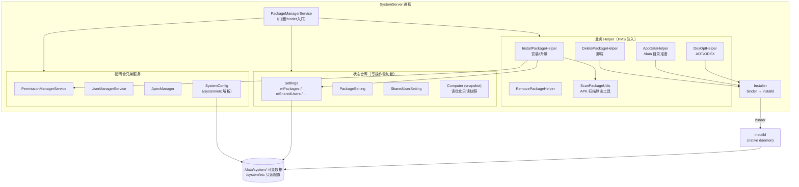
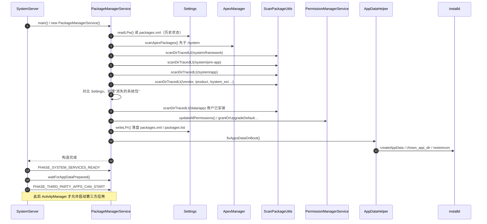
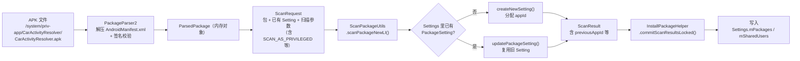
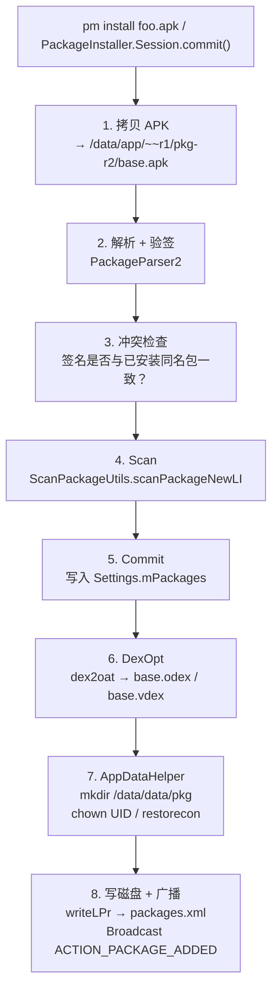
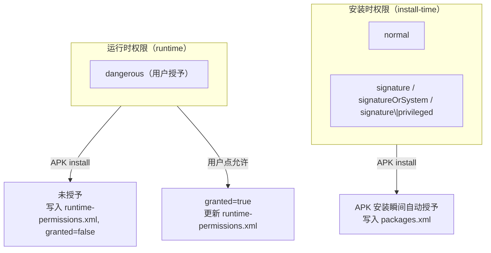
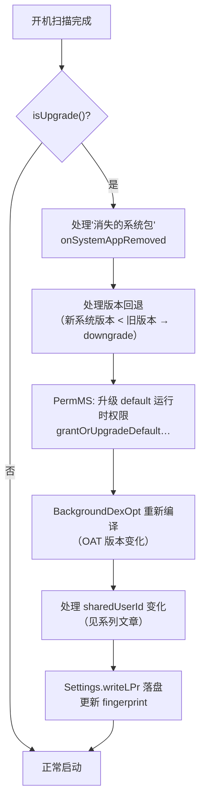
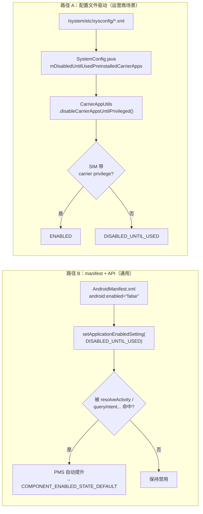

+++
date = '2025-09-28T11:36:11+08:00'
draft = false
title = 'PackageManagerService 快速上手：从源码结构到客制化调试'
+++

# PackageManagerService 快速上手

> 面向懂 Java、熟悉 AOSP 大致结构、但还没深入 PMS 的开发者。
> 读完本文，你应当能：
>
> 1. 在脑子里画出 PMS 的核心组件图；
> 2. 知道 PMS 在开机时序里发生了什么、什么时候发生；
> 3. 知道哪些文件是只读配置、哪些是运行时可变数据、谁在读谁在写；
> 4. 知道扫描 APK 之后的信息落到了哪里；
> 5. 能看懂一个应用的权限来自哪个文件、何时被授予；
> 6. 遇到 OTA 升级后异常时，能沿着升级处理流程逐段排查；
> 7. 具备最小可行的客制化与调试手段。

> 代码路径以 AOSP 主线为准，文件位于 `frameworks/base/services/core/java/com/android/server/pm/`，权限相关位于 `.../pm/permission/`。

---

## 一、核心组件图

PackageManagerService（下文简称 **PMS**）本身是个「门面 + 协调者」：它把"解析 APK / 管理元数据 / 分配 appId / 写磁盘 / 调 installd / 管权限 / 管用户"这一堆事拆成多个协作者。



记住三条主线，后续代码导航会快很多：

| 主线 | 入口 Helper | 最终落点 |
|---|---|---|
| **APK → 元数据** | `ScanPackageUtils` + `InstallPackageHelper` | `Settings.mPackages`（内存） |
| **元数据 → 磁盘** | `Settings#writeLPr` | `/data/system/packages.xml` + `packages.list` |
| **元数据 → /data 目录 & UID** | `AppDataHelper` → `Installer` | installd 做 `chown` / `mkdir` / `restorecon` |

---

## 二、启动时序

PMS 的启动横跨 `SystemServer.startBootstrapServices()` 到 `PHASE_THIRD_PARTY_APPS_CAN_START`，是系统启动最关键也最耗时的一段。



开机阶段的 7 个子阶段可对照本系列另一篇《OTA sharedUserId 变更：数据存活的代价》中 "PMS 扫描完整时序图" 一节，这里不再展开。

调试提示：

- 抓 `logcat -b all -d | grep -E "PackageManager|PackageParser"` 可以看到每一阶段的耗时。
- 开机慢、卡 boot animation，十有八九卡在 `scanDirTracedLI(/system/app)`（包太多或 DexOpt 触发），或卡在 `fixAppsDataOnBoot()`（installd 慢）。

---

## 三、配置文件

把配置分成两类记忆：**只读的（系统预置）** vs **可变的（运行时数据）**。

### 3.1 只读配置（由 SystemConfig 解析）

| 路径 | 作用 |
|---|---|
| `/system/etc/permissions/platform.xml` | 定义系统 GID 与权限的映射、`<assign-permission>`、`<library>` 等 |
| `/system/etc/permissions/privapp-permissions-*.xml` | **privileged app 的签名权限白名单**。AOSP 强制开启；特权应用若申请 signature\|privileged 权限却不在白名单，会被拒 |
| `/system/etc/permissions/*.xml`（通用） | OEM/厂商自带的 feature 声明（`<feature name="xxx"/>`）、`<library>` |
| `/system/etc/sysconfig/*.xml` | `<allow-in-power-save>` / `<allow-unthrottled-location>` / `<hidden-api-whitelisted-app>` 等系统级名单 |
| `/vendor/etc/permissions/`, `/product/etc/permissions/`, `/system_ext/etc/permissions/` | 同上，分区扩展 |

解析入口：`frameworks/base/core/java/com/android/server/SystemConfig.java`。PMS 构造时通过 `SystemConfig.getInstance()` 一次性读入内存。

### 3.2 可变数据（PMS / PermMS 写入）

全部位于 `/data/system/` 下：

| 路径 | 写入者 | 内容 |
|---|---|---|
| `/data/system/packages.xml` | `Settings.writeLPr()` | 所有 PackageSetting、SharedUserSetting、install 权限 |
| `/data/system/packages.list` | `Settings.writePackageListLPr()` | `<pkg> <uid> <debugFlag> <dataDir> <seinfo> <gids>...` installd 读 |
| `/data/system/packages-stopped.xml` | `PackageManagerService` | 被 force-stop 过的包列表 |
| `/data/system/packages-compat.xml` | `CompatibilityInfo` | 屏幕适配历史 |
| `/data/system/users/<id>/package-restrictions.xml` | 按用户 | 禁用 / 隐藏 / 挂起状态 |
| `/data/system/users/<id>/runtime-permissions.xml` | `PermissionManagerService` | **运行时权限授权状态** |

> **packages.xml vs packages.list 的区别，经常被问：**
> - `packages.xml` 是给 framework 自己读的（XML，结构化，带权限/flag/签名等）；
> - `packages.list` 是给 installd、zygote、SELinux 工具读的（纯文本 + 空格分隔，快速 grep），只保留"跑应用最小必需"信息。
> - 两个文件都由 PMS 写，但存储格式和消费者不同。

---

## 四、扫描与文件保存

在讲 PMS 的扫描之前，必须先讲清楚两个前置概念：**APK 到底是什么**、**/system/app 和 /system/priv-app 到底有什么区别**。否则"扫描"和"安装"这两个词都是悬空的。

### 4.0 前置一：APK 的结构

APK 本质上就是一个 zip 文件，改后缀解开就能看。它既不是"二进制可执行文件"，也不是"安装包"——它是一个**带签名的、约定了内部布局的 zip 包**。Android 的"安装"其实就是把这个 zip 放到指定位置 + 注册到 PMS 的元数据里。

以 AOSP 构建产物里的 `CarActivityResolver` 为例（真实数据取自 `out/target/product/qssi_au_64/system/priv-app/CarActivityResolver/`）：

```sh
$ aapt list CarActivityResolver.apk | awk -F/ '{print $1}' | sort -u
AndroidManifest.xml
classes.dex
kotlin
META-INF
res
resources.arsc
```

```sh
$ aapt list -v CarActivityResolver.apk | grep -E "(classes\.dex|resources\.arsc|AndroidManifest\.xml)$"
 9886412  Stored      9886412   0%    classes.dex
  395164  Stored       395164   0%    resources.arsc
    7620  Deflate        2056  73%    AndroidManifest.xml
```

一张表带走 APK 顶层结构：

| 条目 | 作用 | PMS 会读吗？ |
|---|---|---|
| `AndroidManifest.xml` | **二进制 XML**（不是明文）。应用的"身份证"：包名、版本、权限、四大组件、intent-filter、sharedUserId... | 核心输入 |
| `classes.dex`（可有 `classes2.dex` `classes3.dex` ...） | DEX 字节码，运行时由 ART 执行。预装 APK 会在旁边生成 `.odex` + `.vdex` | 不读内容，只看存在与否、用来 DexOpt |
| `resources.arsc` | 资源索引表。把 `@string/foo` 映射到实际值；多语言、多密度的"大总表" | 解析 manifest 时会查引用（如 `android:label=@string/...`） |
| `res/` | 非压缩资源。`layout/`、`drawable-*dpi/`、`anim/`、`color/`... 每个值在 `resources.arsc` 里都有索引 | 不直接读，运行时由 AssetManager 读 |
| `assets/` | 开发者塞的原始文件，运行时用 `AssetManager.open()` 读 | 不读 |
| `lib/<ABI>/*.so` | 原生库。`<ABI>` 是 `arm64-v8a` / `armeabi-v7a` / `x86_64` 等；本例 APK **没有** `lib/`，纯 Java/Kotlin | PMS 读其存在性决定 `primaryCpuAbi` |
| `kotlin/` | Kotlin 元数据（`.kotlin_module` 等），给反射用 | 不读 |
| `META-INF/MANIFEST.MF` + `CERT.SF` + `CERT.RSA` | **V1 签名**（JAR 签名，逐文件哈希） | **必读**，用于签名校验 |
| （zip 尾部，肉眼看不到） | **V2/V3/V4 签名块**（整文件哈希，直接写在 ZIP 结构之外），Android 7.0+ 新签名方案 | **必读**，优先级高于 V1 |

`aapt dump badging` 可以把 AndroidManifest.xml 里的主要属性翻译成人读的格式。CarActivityResolver 的输出前几行：

```sh
$ aapt dump badging CarActivityResolver.apk | head -10
package: name='com.android.car.activityresolver' versionCode='36' versionName='16'
    platformBuildVersionName='16' platformBuildVersionCode='36'
    compileSdkVersion='36' compileSdkVersionCodename='16'
sdkVersion:'36'
targetSdkVersion:'36'
uses-permission: name='android.permission.BIND_RESOLVER_RANKER_SERVICE'
uses-permission: name='android.permission.INTERACT_ACROSS_USERS_FULL'
uses-permission: name='android.permission.MANAGE_USERS'
uses-permission: name='android.permission.QUERY_ALL_PACKAGES'
uses-permission: name='android.permission.SET_PREFERRED_APPLICATIONS'
...
```

要看没被翻译、但仍然结构化的 manifest，用 `aapt dump xmltree`：

```sh
$ aapt dump xmltree CarActivityResolver.apk AndroidManifest.xml
N: android=http://schemas.android.com/apk/res/android
  E: manifest (line=17)
    A: android:versionCode=0x24  (= 36)
    A: package="com.android.car.activityresolver"
    E: uses-permission
      A: android:name="android.permission.BIND_RESOLVER_RANKER_SERVICE"
    E: application (line=66)
      E: activity (line=72)
        A: android:name="com.android.car.activityresolver.CarResolverActivity"
        ...
```

这就是 PMS 扫描时真正要读的那份文件。

> **实用小贴士：**
> - 改了 `AndroidManifest.xml` 之后，只看 `aapt dump badging` 验证是否编对是最快的；
> - 查一个可疑 APK 的包名签名：`aapt dump badging xx.apk` + `keytool -printcert -jarfile xx.apk`；
> - 想看资源表里具体定义了什么字符串：`aapt dump resources xx.apk | grep -A2 string/app_name`。

### 4.1 前置二：/system/app vs /system/priv-app vs /data/app

APK 存在哪里，直接决定它**能要到什么权限**、**开机时怎么被 PMS 处理**。记下面这张表即可：

| 路径 | 角色 | 能拿 signature\|privileged 权限吗 | 白名单约束 | 可卸载 | 可禁用 | 例子 |
|---|---|---|---|---|---|---|
| `/system/priv-app/` | **特权应用**（framework 认可的"半内置"身份） | ✅ 可以 | ✅ **必须**在 `privapp-permissions-*.xml` | ❌ | 受限（部分不允许） | SystemUI、Settings、Phone、CarActivityResolver |
| `/system/app/` | 普通系统应用 | ❌ 不行，只能拿 `normal` + `signature` | ❌ | ❌ | ✅ | Calendar、Calculator、壁纸等 |
| `/vendor/{app,priv-app}/` | 同名，位于 vendor 分区 | 同上 | 同上 | ❌ | 同上 | 厂商硬件驱动 UI |
| `/product/{app,priv-app}/` | 同名，位于 product 分区 | 同上 | 同上 | ❌ | 同上 | 运营商 / 市场版 APK |
| `/system_ext/{app,priv-app}/` | 同名，位于 system_ext 分区 | 同上 | 同上 | ❌ | 同上 | 不污染 /system 的扩展 |
| `/data/app/` | 用户 install 的普通应用 | ❌ | - | ✅ | ✅ | Play Store 下载的所有东西 |

`/system/priv-app` 的 **privileged** 身份是 PMS 在扫描时通过**路径**打上 `FLAG_PRIVILEGED` 标的：

```java
// PackageManagerService 扫描目录时设置 scanFlags
if (path.startsWith("/system/priv-app/")) scanFlags |= SCAN_AS_PRIVILEGED;
```

这意味着：**把一个 APK 从 `/system/app/` 移到 `/system/priv-app/`**，仅路径变化就能让它具备申请 `signature|privileged` 权限的资格（但还要签名匹配 + 白名单命中，缺一不可）。

**安装目录的实际 layout**（以 CarActivityResolver 为例）：

```
/system/priv-app/CarActivityResolver/
├── CarActivityResolver.apk              # 10 MB，本体
└── oat/
    └── arm64/
        ├── CarActivityResolver.odex     # 65 KB，AOT 编译产物
        └── CarActivityResolver.vdex     # 133 KB，DEX 的验证快照
```

相比之下，`/data/app/` 的同名 APK 会长成这样：

```
/data/app/~~<rand1>/com.xxx-<rand2>/
├── base.apk                  # 拷进来的 APK
├── split_config.arm64_v8a.apk  # split APK (AAB 安装才有)
├── lib/arm64/*.so            # 解压出的 .so（取决于 extractNativeLibs）
└── oat/arm64/
    ├── base.odex
    └── base.vdex
```

- `~~<rand1>` 和 `<rand2>` 是防路径预测的两层随机目录（安全考量）。
- PMS 内部以 `codePath` 字段记录这个根目录，卸载时整棵 `rm -rf`。

### 4.2 PMS 究竟在"扫描"什么

现在可以正式讲了：**所谓"扫描 APK"，不是解压文件，而是读 APK 里的 `AndroidManifest.xml` + 验签 + 算出一个叫 `ParsedPackage` 的内存对象。**

扫描的输入输出：



**"扫描"到底从 AndroidManifest 里抽了什么出来？** 对照 CarActivityResolver 的 manifest，一一列出：

| manifest 节点 | 抽到 `ParsedPackage` 的字段 | PMS 下游用途 |
|---|---|---|
| `<manifest package="..." versionCode versionName>` | `packageName`, `versionCode`, `versionName` | 身份、升级判定 |
| `<manifest sharedUserId="...">` | `sharedUserId` | 是否加入共享 UID（本例没有） |
| `<uses-sdk minSdkVersion targetSdkVersion>` | 同名字段 | 兼容模式、权限默认值 |
| `<uses-permission>` × 7 | `requestedPermissions` | PermMS 授权、GID 映射 |
| `<permission name=... protectionLevel=...>` | `permissions` | 向系统**注册**新权限（本例注册了自家的 `DYNAMIC_RECEIVER_NOT_EXPORTED_PERMISSION`） |
| `<uses-library name=... required=...>` | `usesLibraries` / `usesOptionalLibraries` | 运行时 ClassLoader 注入（本例 `androidx.window.extensions` / `sidecar`） |
| `<queries>` | `queries` | Android 11+ 包可见性过滤 |
| `<application ...>` 属性 | `application` 扁平属性 | 启动 App 时照着建 Application |
| `<activity> <service> <receiver> <provider>` | `activities` / `services` / `receivers` / `providers` 四个列表 | PackageInfo 查询、IntentResolver 索引 |
| 每个组件里的 `<intent-filter>` | `intents` 列表 | `resolveActivity` / `queryIntentServices` 的数据源 |
| `<meta-data>` | `metaData` Bundle | 应用间约定（如 CarActivityResolver 的 `distractionOptimized`） |
| APK 的 ZIP v2/v3 签名块 | `signatures[]` | 同包名应用签名一致性校验 |

扫描结果 **不会立刻写到 `Settings.mPackages`**，而是先生成一个 `ScanResult`，等到 `InstallPackageHelper.commitScanResultsLocked()` 这一步再集中提交。两阶段设计是为了——**一批包整体校验通过后才整体提交**，防止部分落盘部分失败。

关键类速查：

- `PackageParser2` / `ParsingPackageUtils`（`core/java/android/content/pm/parsing/`）——单纯解析 manifest 到 `ParsedPackage`。
- `ScanPackageUtils.scanPackageNewLI()`（`services/core/java/com/android/server/pm/`）——**不写任何东西**，只计算 ScanResult。
- `InstallPackageHelper.commitScanResultsLocked()`——**真正写入** `Settings.mPackages` / `mSharedUsers`。

### 4.3 PMS 究竟在"安装"什么

"安装"在 Android 语境里有两层含义，它们走的代码路径**完全不同**：

#### 4.3.1 系统预置（preinstalled）

`/system/priv-app/CarActivityResolver/` 这种是**编译时就被 make 进 system 镜像**的。对于这种包：

- **不存在"安装"这个动作**。APK 在出厂那一刻就已经在磁盘上。
- 开机时 PMS `scanDirTracedLI(/system/priv-app)` 扫到它，**把它从 APK 文件 → 注册到 `Settings.mPackages` 这一步，就是它的"安装"**。
- 不拷贝文件、不做 dexopt（dexopt 产物编译时就在 `oat/arm64/` 里了）。
- 在 `packages.xml` 里会有一行 `<package ... codePath="/system/priv-app/CarActivityResolver" ... />`。

换句话说：**"被 PMS 扫描且注册"就等同于"被安装"**，一次开机就是完整的"安装"。

#### 4.3.2 用户态安装（`pm install` / `adb install` / Play 下载）

这一路走 `InstallPackageHelper.installPackageLI()`，有完整的 8 步：



对比两者：

| 维度 | 系统预置 | 用户态 install |
|---|---|---|
| APK 拷贝 | ❌ 不拷贝 | ✅ 拷贝到 `/data/app/` |
| DexOpt | ❌ 编译期已做 | ✅ install 过程中做 |
| 目录创建 | ✅ 开机 `fixAppsDataOnBoot` 统一建 | ✅ install 过程中建 |
| 触发 scan + commit | ✅ 开机扫描 | ✅ install 中 |
| 广播 `PACKAGE_ADDED` | ❌（首次开机不发） | ✅ |
| 可卸载 | ❌ | ✅（`pm uninstall`） |
| 卸载后残留 | - | 默认清空，`-k` 保留 `/data/data` |

#### 4.3.3 卸载并不是"反向安装"

- 用户态包：`pm uninstall` 会删 `/data/app/...`、删 `/data/data/...`、从 `Settings.mPackages` 移除、写回 `packages.xml`、发 `PACKAGE_REMOVED`。
- 系统预置包：`pm uninstall com.xxx` 实际是 `pm uninstall --user 0`，**只对当前用户隐藏**，APK 仍在 `/system/priv-app/`。`pm install-existing` 又能恢复。
- 真正删除系统预置包的唯一方法是改 ROM（删文件 + 重编）。

### 4.4 保存流程（Persist）

扫描 + 提交完成后，数据在 `Settings.mPackages` 内存里。什么时候落到磁盘？

- 触发点：`Settings.writeLPr()`（完整写）或 `scheduleWriteSettings()`（节流写）。
- 执行线程：`BackgroundHandler`（PMS 构造时创建），避免阻塞 binder 线程。
- 原子性：先写 `packages.xml.tmp`，再 `rename` 到 `packages.xml`，防止掉电损坏。
- 批处理：相近时间内多次 `scheduleWriteSettings()` 会合并成一次写。

> **想改 `packages.xml` 里的某一项？** 不要直接改文件，PMS 随时可能覆盖。正确做法是改 `Settings` 的内存态，然后调 `writeLPr()`；或者在代码里加逻辑，让 PMS 在扫描/升级阶段生成你要的状态。

---

## 五、权限配置

Android 权限分两类，PMS 和 PermMS 协作处理：



### 5.1 Manifest 层

应用在自己的 `AndroidManifest.xml` 里：

```xml
<uses-permission android:name="android.permission.READ_CONTACTS"/>
<uses-permission android:name="android.permission.BLUETOOTH_CONNECT"/>
<uses-permission android:name="android.permission.REBOOT"/>   <!-- signature -->
<application android:sharedUserId="android.uid.system"> ...    <!-- 共享 UID -->
```

### 5.2 白名单：特权应用能拿哪些 signature\|privileged 权限

路径：`/system/etc/permissions/privapp-permissions-<pkg>.xml`

```xml
<permissions>
  <privapp-permissions package="com.example.app">
    <permission name="android.permission.REBOOT"/>
    <permission name="android.permission.MANAGE_USERS"/>
  </privapp-permissions>
</permissions>
```

**不在白名单里就拿不到**（`ro.control_privapp_permissions=enforce`）。dumpsys 会在开机日志里打印缺失项：
```
PackageManager: Signature|privileged permissions not in privapp-permissions whitelist: {com.example.app: android.permission.REBOOT}
```

### 5.3 GID 映射

`platform.xml`：

```xml
<permission name="android.permission.INTERNET">
  <group gid="inet"/>
</permission>
```

拿到 `INTERNET` 权限的应用会被加入 `inet` GID（`/etc/group`），这样底层 socket 才能 bind。`packages.list` 中每行末尾那串 GID 就是这么来的。

### 5.4 运行时权限

- 文件：`/data/system/users/<userId>/runtime-permissions.xml`
- 写入者：`PermissionManagerServiceImpl`
- 关键入口：
  - `grantRuntimePermission()`（用户点允许 / adb grant）
  - `revokeRuntimePermission()`
  - `grantOrUpgradeDefaultRuntimePermissionsIfNeededLocked()`（系统升级时）

### 5.5 sharedUserId 的坑

声明 `android:sharedUserId="android.uid.system"` 的应用会共享 UID 1000 + **所有 system 用户的权限并集**。一旦签名错配（没有 platform 签名）安装就会失败，一旦想要从 sharedUserId 中迁出就会涉及 appId 变更（见系列文章另一篇《OTA sharedUserId 变更》）。

Android 10+ 起 Google 明确不再推荐新应用使用 sharedUserId。

---

## 六、升级后的处理流程

所谓"升级"有两层含义：

1. **单个 APK 升级**：`pm install -r`，走 `InstallPackageHelper.installPackageLI()`。
2. **系统升级 / OTA**：整个系统分区变化，PMS 开机时识别到 fingerprint 变化，触发一整套升级处理。

这一节讲的是第二种——**系统升级后 PMS 要做的事**。

### 6.1 如何判定"升级了"

```java
// Settings.java (简化)
mInternal.fingerprint  // 上次开机时的系统 fingerprint
vs.
Build.FINGERPRINT      // 这次开机的 fingerprint
```

不一致 → `isUpgrade() = true`，触发升级路径。

文件来源：`/data/system/packages.xml` 根节点 `<last-platform-version internal="..."/>` 属性。

### 6.2 升级路径上的关键动作



按模块看：

| 场景 | 入口 | 关键点 |
|---|---|---|
| 系统包被删（ROM 不再预装某 APK） | `PackageManagerService#scanDirTracedLI` 后对比 | 删除 `PackageSetting`、清 `/data/data/<pkg>`（看 flags） |
| 系统包降级（预装 APK 版本比 /data 覆盖的旧） | `PackageManagerServiceUtils.canJoinSharedUserId` + install 流程 | 大多数情况下优先保留 /data 版本，除非 `PackageInfoFlags` 要求 |
| sharedUserId 变化 | `ScanPackageUtils` 检测 `leavingSharedUserId`，`previousAppId` 传递到 installd | **此路径被 Google b/221088088 封锁**，本系列另一篇详细讲 |
| 新增 signature 权限 | `grantOrUpgradeDefaultRuntimePermissionsIfNeededLocked` | 升级时自动加到已安装应用 |
| DexOpt | `BackgroundDexOptService` | OAT 指纹变 → 后台重新编译 |
| 清理 /data 中残留 | `reconcileAppsDataLI` | 扫完包后比对磁盘目录，多余的删 |

### 6.3 常见升级异常与排查

| 症状 | 怀疑点 | 排查手段 |
|---|---|---|
| 升级后某 App 权限丢失 | 运行时权限 XML 合并失败；或 privapp 白名单缺项 | `dumpsys package <pkg>` 看 permissions 段；看开机日志 "Signature\|privileged permissions not in privapp-permissions whitelist" |
| 升级后某 App 开机启动慢 | DexOpt 在后台跑 | `dumpsys package dexopt`；logcat `BackgroundDexOpt` |
| 升级后 App 的 `/data/data` 丢了 | sharedUserId 变更 / appId 变更 | `packages.xml` 对比新旧 `userId`；`/data/data/<pkg>` stat 看 owner |
| 升级后开机概率性起不来 | `fixAppsDataOnBoot` 失败 | logcat `Installer` / `installd` 段 |
| 升级后某些 signature 权限失效 | 签名变化 | `dumpsys package <pkg>` 看 signatures |

### 6.4 可以改哪里来干预升级

- **禁用 DexOpt 升级**：`pm bg-dexopt-job` + `ro.dexopt.priv-apps-oob` 调整策略。
- **自定义"升级后回调"**：可在 `PackageManagerService#isUpgrade()` 之后、`writeLPr` 之前插入私有逻辑，厂商通常这么干。
- **保留 /data/data**：小心 `scanFlags` 中 `SCAN_FIRST_BOOT_OR_UPGRADE`；被判为"清理"的场景会通过 installd `clearAppData` 走掉。

---

## 七、默认禁用、按需启用：`COMPONENT_ENABLED_STATE_DISABLED_UNTIL_USED`

"APK 预置进镜像、PMS 也照常扫描，但开机默认处于 **disabled** 状态，等到某个条件满足再 enable" 是车机 / 运营商项目里非常常见的诉求。AOSP 对它的标准答案是 `COMPONENT_ENABLED_STATE_DISABLED_UNTIL_USED`（int 值 `4`）。

### 7.1 两条路径一张图



### 7.2 路径 A：配置文件 + 运营商触发

声明位置：`/system/etc/sysconfig/*.xml`（也可放在 `/product`、`/vendor` 的对应目录）。

```xml
<config>
  <!-- 主运营商 APK：插入匹配的 SIM 才启用 -->
  <disabled-until-used-preinstalled-carrier-app
      package="com.carrier.foo"/>

  <!-- 关联应用：随主运营商 APK 一起被启用 -->
  <disabled-until-used-preinstalled-carrier-associated-app
      package="com.carrier.foo.plugin"
      carrierAppPackage="com.carrier.foo"
      addedInSdk="34"/>
</config>
```

解析端在 `frameworks/base/core/java/com/android/server/SystemConfig.java`（AOSP 主线约 1178 / 1220 行），落到两个成员：

- `mDisabledUntilUsedPreinstalledCarrierApps` — `Set<String>`
- `mDisabledUntilUsedPreinstalledCarrierAssociatedApps` — `Map<主APK, List<CarrierAssociatedAppEntry>>`

生效端在 `frameworks/base/telephony/common/com/android/internal/telephony/CarrierAppUtils.java`。`CarrierAppUtils.disableCarrierAppsUntilPrivileged()` 在开机、SIM 状态变化时被调用：

1. 首次看到 APK：`setApplicationEnabledSetting(..., COMPONENT_ENABLED_STATE_DISABLED_UNTIL_USED, ...)`；
2. 检测到当前 SIM 对该 APK 有 UICC carrier privilege → 提升到 `COMPONENT_ENABLED_STATE_ENABLED`；
3. 权限还没到位 → 保持 `DISABLED_UNTIL_USED`。

> `addedInSdk` 是 Google 加的护栏：OTA 把一个新的 carrier-associated APK 刷进老设备时，避免它在更低 SDK 上被无条件启用。填"这个包第一次随哪个 SDK 进入系统"。

### 7.3 路径 B：manifest 声明 + "首次使用" 自动提升

完全不依赖 sysconfig，APK 自己就可以：

```xml
<!-- AndroidManifest.xml -->
<application android:enabled="false" ...>
```

配合任何有 `CHANGE_COMPONENT_ENABLED_STATE` 权限的系统组件调：

```java
pm.setApplicationEnabledSetting(
    pkg, PackageManager.COMPONENT_ENABLED_STATE_DISABLED_UNTIL_USED, 0);
```

PMS 的特殊语义：**一旦该包被 `resolveActivity` / `queryIntentActivities` / `queryIntentServices` 等 "使用型" 入口命中，`DISABLED_UNTIL_USED` 会自动被翻成 `COMPONENT_ENABLED_STATE_DEFAULT`**。

这条路径适合 **"预装但几乎没人用的包，第一次被需要时再激活"** —— 例如只在扫码 / NFC 刷卡场景才上线的功能 APK。

### 7.4 车机项目的第三条路

厂商更常走自定义触发：把包先置成 `DISABLED_UNTIL_USED`，然后由一个常驻 `SystemService` 或 `BroadcastReceiver` 监听业务条件（车型配置变化、区域切换、付费功能开关），在条件满足时主动调 `setApplicationEnabledSetting(..., ENABLED, ...)`。这种方式**不依赖 sysconfig**，逻辑完全掌握在自己的代码里，适合"配置项分散 / 动态下发"的业务。

示例骨架：

```java
// 在某个 SystemService 里
void onFeatureFlagChanged(String flag, boolean on) {
    if ("feature.paid.navigation".equals(flag) && on) {
        mPackageManager.setApplicationEnabledSetting(
            "com.oem.navigation.plus",
            PackageManager.COMPONENT_ENABLED_STATE_ENABLED,
            PackageManager.DONT_KILL_APP);
    }
}
```

### 7.5 落盘位置

不管哪条路径，最终都落到 `/data/system/users/<userId>/package-restrictions.xml`：

```xml
<pkg name="com.carrier.foo" enabled="4" .../>   <!-- 4 = DISABLED_UNTIL_USED -->
<pkg name="com.oem.navigation.plus" enabled="1" .../>  <!-- 1 = ENABLED -->
```

`enabled` 取值对照：

| 值 | 常量 | 语义 |
|---|---|---|
| 0 | `COMPONENT_ENABLED_STATE_DEFAULT` | 跟随 manifest `android:enabled` |
| 1 | `COMPONENT_ENABLED_STATE_ENABLED` | 强制启用 |
| 2 | `COMPONENT_ENABLED_STATE_DISABLED` | 用户/系统禁用 |
| 3 | `COMPONENT_ENABLED_STATE_DISABLED_USER` | 用户手动禁用 |
| 4 | `COMPONENT_ENABLED_STATE_DISABLED_UNTIL_USED` | 本节主角 |

### 7.6 调试

```sh
# 看某包当前 enabled 状态
adb shell dumpsys package com.carrier.foo | grep -E "enabled="

# 列出全部被禁用的包
adb shell pm list packages -d

# 手动打回 DISABLED_UNTIL_USED（方便复现）
adb shell pm disable-until-used com.carrier.foo

# 手动提升到 ENABLED
adb shell pm enable com.carrier.foo

# 看 CarrierAppUtils 的判定日志
adb logcat -s CarrierAppUtils:V
```

### 7.7 选哪条路？

| 场景 | 用哪条 |
|---|---|
| 运营商预装，随 SIM 激活 | 路径 A（sysconfig + CarrierAppUtils） |
| 小众功能包，谁用到谁激活 | 路径 B（manifest + DISABLED_UNTIL_USED） |
| 按车型/区域/OTA 开关动态启用 | 路径 C（自定义 SystemService 监听触发） |

---

## 八、客制化常见场景

### 8.1 预置一个 APK

| 分区 | 路径 | 特点 |
|---|---|---|
| `/system/app/` | 普通系统应用 | 用户可禁用，不能卸载 |
| `/system/priv-app/` | 特权应用 | 能拿 signature\|privileged 权限（需白名单） |
| `/vendor/app/`, `/product/app/` | 硬件/产品定制 | 可被 treble 拆分 |
| `/system_ext/app/` | 系统扩展 | 方便不污染 `/system` |

选分区基本原则：**越靠近"通用系统"的分区越应避免放厂商 APK**，把厂商特化应用放到 `/product` 或 `/system_ext`。

配套的：

- `Android.bp` 声明预装：
  ```
  android_app {
      name: "MyPrebuilt",
      certificate: "platform",  // 或 "PRESIGNED"
      privileged: true,         // /system/priv-app
      product_specific: true,   // → /product/priv-app
  }
  ```
- 若需要 signature\|privileged 权限：在 `device/<oem>/<product>/permissions/` 下写 `privapp-permissions-com.example.app.xml`，并在 product makefile 里 `PRODUCT_COPY_FILES` 到 `/system/etc/permissions/`（或对应分区）。

### 8.2 禁用 privapp 白名单（不建议）

设备上设置：
```
PRODUCT_PROPERTY_OVERRIDES += ro.control_privapp_permissions=log
```
开发期可以先用 `log` 观察缺失，正式发布切 `enforce`。**切成 `disable` 会直接绕过白名单检查，通常不允许过 CTS。**

### 8.3 为某类应用开白（比如 hidden API）

`/system/etc/sysconfig/<your>.xml`：
```xml
<config>
  <hidden-api-whitelisted-app package="com.example.privileged"/>
  <allow-in-power-save package="com.example.daemon"/>
</config>
```

---

## 九、调试手段

### 9.1 dumpsys / pm / cmd package

```sh
# 某个包的完整状态（最常用）
adb shell dumpsys package com.example.app

# 全部包名
adb shell pm list packages

# 只看第三方 / 只看系统
adb shell pm list packages -3
adb shell pm list packages -s

# 看权限
adb shell dumpsys package permissions
adb shell dumpsys package <pkg> | sed -n '/requested permissions:/,/install permissions:/p'

# 看共享 UID 的所有成员
adb shell dumpsys package s  # shared-users

# 看 feature
adb shell pm list features

# 看安装路径 / APK 签名
adb shell pm path com.example.app
adb shell dumpsys package com.example.app | grep signatures

# 动态授 / 撤运行时权限
adb shell pm grant   com.example.app android.permission.CAMERA
adb shell pm revoke  com.example.app android.permission.CAMERA

# 卸载 & 保留数据
adb shell pm uninstall -k com.example.app

# 强制扫描（开发期调试新预装 APK）
adb shell cmd package reconcile
```

### 9.2 日志

```sh
# 最基本：看 PMS 自己的日志
adb logcat -s PackageManager:V PackageManagerService:V PackageParser:V

# 看 installd（/data 目录创建、chown）
adb logcat -s installd:V

# 看权限
adb logcat -s PermissionManager:V PermissionController:V

# 看 DexOpt
adb logcat -s BackgroundDexOpt:V dex2oat:V
```

开机问题最有用的组合：

```sh
adb logcat -b all -d | grep -E "PackageManager|installd|SystemServer.*ready"
```

### 9.3 源码断点与 tracing

- Atrace：`adb shell atrace -c -t 10 pm`，可看 `scanDir`, `scanPackage`, `prepareAppData` 的耗时分段。
- Systrace / Perfetto：开机 profile，能看到 PMS 占用 SystemServer 的哪几秒。
- 在 `frameworks/base` 里临时加 `Slog.d(TAG, "XXX " + ...)`，重编 `services.jar`，push 到设备：
  ```sh
  m services
  adb remount && adb push $OUT/system/framework/services.jar /system/framework/
  adb reboot
  ```
  （有 A/B 分区的设备走 `adb sync system` 或 `fastboot flash system`）。

### 9.4 常用"下钻"入口

遇到问题不知道从哪看？按症状对照：

| 症状 | 从哪看起 |
|---|---|
| 安装失败 | `InstallPackageHelper.installPackageLI()` 的 return code |
| 解析失败 | `PackageParser2` + `ParsingPackageUtils` |
| 权限拿不到 | `PermissionManagerServiceImpl.restorePermissionState()` |
| /data/data 没建好 | `AppDataHelper.prepareAppDataAndMigrate()` → `Installer.createAppData()` |
| 开机时某包丢了 | `PackageManagerService` 构造函数中 "disappeared" 段 |
| 签名冲突 | `PackageManagerServiceUtils.verifySignatures()` |

---

## 十、最小阅读路径（建议顺序）

如果时间有限，按这个顺序看源码，能在一周内建立完整心智模型：

1. `SystemServer.startBootstrapServices()` → 找到 `PackageManagerService.main()`。
2. `PackageManagerService` 构造函数整个看一遍（长，可以分段）。
3. `Settings.java` 的 `readLPw()` / `writeLPr()` —— 明白持久化格式。
4. `ScanPackageUtils.scanPackageNewLI()` —— 明白扫描在做什么。
5. `InstallPackageHelper.commitScanResultsLocked()` —— 明白提交在做什么。
6. `AppDataHelper.prepareAppDataAndMigrate()` —— 明白 /data 目录怎么建的。
7. `PermissionManagerServiceImpl.restorePermissionState()` —— 明白权限怎么恢复的。
8. `PackageManagerService#isUpgrade` 附近 —— 明白升级路径。

走完这 8 步，任何具体 bug 都能找到对应模块去看。

---

## 附：一张图带走

```
           +-------------------------- PackageManagerService --------------------------+
           |                                                                            |
 /system/* |  Scan  → ParsedPackage → ScanRequest → ScanResult → commitScanResultsLocked|  Settings.mPackages
 /data/app |                                                                            | -------------------- packages.xml (写)
           |                          ↓                                                  |                      packages.list (写)
           |                     Settings  ---- Permissions ---- UserManager             |
           |                          ↓                                                  |
           |                     AppDataHelper  →  Installer (binder)                    |
           |                                                    ↓                        |
           +---------------------------------------------------|------------------------+
                                                               ↓
                                                           installd
                                                               ↓
                                                  /data/data/<pkg>/  /data/user_de/<id>/<pkg>/
```

这张图往后遇到任何 PMS 问题，都可以先定位到图里某个箭头上，再沿箭头追代码。

---

