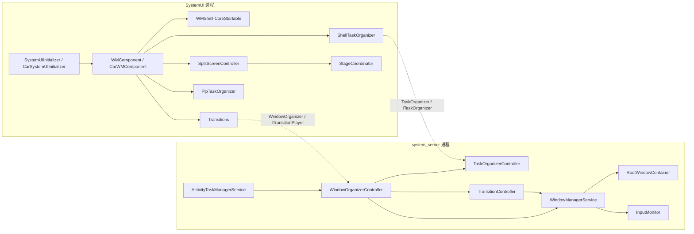
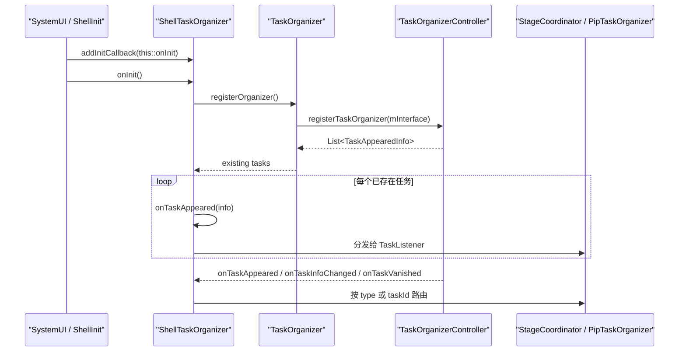
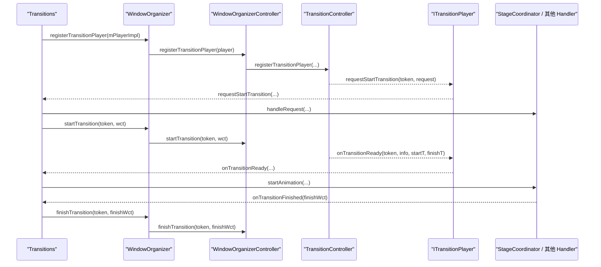

# WMShell 宏观定位与设计初衷

本文档基于当前 AOSP/QSSI 源码树，说明 WMShell 的职责边界、跨进程通信方式，以及它在车载产品形态中的落点与扩展方向。

## Android 窗口架构演进：为什么需要 WMShell

在 WMShell 成形之前，大量多窗口策略、交互控制和动画逻辑都更紧密地堆在 `system_server` 一侧。随着分屏、画中画、recent tasks、desktop mode 等复杂场景增加，这种做法很容易带来三个问题：

* **稳定性风险更高**：交互状态机和动画逻辑一旦在 `system_server` 侧出错，影响面会直接扩大到系统核心进程。
* **定制与升级成本更高**：OEM 若要改分屏或转场，往往要侵入 `frameworks/base/services/core/` 一侧，版本升级冲突会很重。
* **交互演进受限**：布局计算、手势反馈、动画编排如果都绑在核心服务里，功能迭代会更慢，调试成本也更高。

**WMShell 的核心思想是“机制与策略分离”**。

* `system_server` 保留窗口容器树、生命周期推进、安全边界、输入与 surface placement 等机制
* `SystemUI` 进程中的 WMShell 承接多窗口策略、交互控制、具体功能模块的动画和对外能力导出

这种分层把“谁负责状态一致性”和“谁负责交互与动画”区分开来：前者留在 `system_server`，后者主要由 WMShell 承接。

## 进程边界划分：system_server vs SystemUI

WMShell 的跨进程结构可以从三个层面来理解：

* **进程归属**：WMShell 运行在 `SystemUI` 进程
* **服务端入口**：organizer / transition 的 Binder 服务端挂在 `system_server` 的 `ActivityTaskManagerService` 一侧
* **核心状态维护**：`WindowManagerService`、`RootWindowContainer`、`InputMonitor` 仍掌握全局窗口状态、焦点、输入窗口和 surface placement

### 图 1：进程归属与组件分层

图 1 展示组件所在的进程和主要从属关系：

* `ShellTaskOrganizer`、`Transitions`、`SplitScreenController`、`PipTaskOrganizer` 都是 WMShell 侧组件，由 `WMComponent` 提供
* `SplitScreenController` 是分屏门面；真正同时实现 `TaskListener` 和 `TransitionHandler` 的是 `StageCoordinator`
* `WindowOrganizerController`、`TaskOrganizerController`、`TransitionController` 都在 `system_server`，并且当前实现挂在 `ActivityTaskManagerService` 一侧
* `WindowManagerService` 负责全局窗口状态、焦点、输入窗口和 surface placement

### 图 2：TaskOrganizer 通信链路

图 2 描述了 `TaskOrganizer` 在 Shell 与 system_server 之间的注册和回调路径：

* `ShellTaskOrganizer` 是 `TaskOrganizer` 在 Shell 侧的统一实现与路由总线
* 它先向服务端 `TaskOrganizerController` 注册 organizer，再接收任务回调
* `StageCoordinator`、`PipTaskOrganizer` 这类具体功能模块只是 `ShellTaskOrganizer` 路由出去的具体 listener

### 图 3：Transition 通信链路

图 3 展示了 transition 协议链中的两个核心事实：

* WMShell 掌握动画 handler 的认领和播放权
* transition 的 request、ready、finish 经过 `WindowOrganizer` / `WindowOrganizerController` / `TransitionController` 这一条系统协议链

因此，WMShell 承接的是具体功能模块的动画和交互编排，而系统状态一致性仍由 `system_server` 把关。

### 核心组件与通信载体职责

| 组件名称 | 所属进程 | 核心功能与职责描述 |
| :--- | :--- | :--- |
| **WindowContainerTransaction (WCT)** | 跨进程数据结构 | **窗口事务描述对象**。它是 `Parcelable` 命令集，用于收集对 Task、DisplayArea、WindowContainer 的层级、Bounds、WindowingMode、可见性等修改。WCT 会先交给 organizer controller 在 `system_server` 内应用，再推进后续窗口状态与 surface 变化。 |
| **ActivityTaskManagerService (ATMS)** | system_server | **organizer / transition 服务端宿主**。当前 `WindowOrganizerController`、`TaskOrganizerController`、`TaskFragmentOrganizerController` 都挂在这一侧。 |
| **WindowManagerService (WMS)** | system_server | **全局窗口状态维护者**。负责窗口树、焦点、输入窗口、surface placement 等核心状态，并与 organizer / transition 执行链协作。 |
| **RootWindowContainer** | system_server | **全局窗口树拓扑维护者**。维护 `DisplayContent -> TaskDisplayArea -> Task -> ActivityRecord` 这一层级，并参与 top focused display、resume / pause 等状态推进。 |
| **WindowOrganizerController** | system_server | **WindowOrganizer 的服务端入口**。接收 `applyTransaction()`、`startTransition()`、`finishTransition()` 等请求，并持有 `TaskOrganizerController`、`TransitionController`。 |
| **TaskOrganizerController** | system_server | **Task 事件派发器**。向已注册的 `TaskOrganizer` 回调 `TaskAppeared`、`TaskVanished`、`TaskInfoChanged` 等事件。 |
| **TransitionController** | system_server | **Transition 状态机中枢**。负责收集 transition、向 player 发起 `requestStartTransition()`、在 ready 后回调 `onTransitionReady()`，并在 finish 时完成系统侧收尾。 |
| **ShellTaskOrganizer** | SystemUI (WMShell) | **Task 事件路由总线**。它继承 `TaskOrganizer`，注册后接收系统侧 task 回调，再把事件按类型或 taskId 路由给具体功能模块。 |
| **Transitions** | SystemUI (WMShell) | **转场调度中心**。它向系统注册 `ITransitionPlayer`，在 `requestStartTransition()` 阶段分发 `handleRequest()`，在 `onTransitionReady()` 阶段分发 `startAnimation()`。 |
| **SplitScreenController** | SystemUI (WMShell) | **分屏门面**。负责注册 `ISplitScreen`、dump、shell command，并创建 `StageCoordinator`。 |
| **StageCoordinator** | SystemUI (WMShell) | **分屏核心协调者**。同时实现 `ShellTaskOrganizer.TaskListener` 和 `Transitions.TransitionHandler`，负责分屏容器组织、divider 交互和 split transition。 |
| **PipTaskOrganizer** | SystemUI (WMShell) | **画中画业务执行者**。负责 PiP 容器组织、bounds 计算以及进入/退出 PiP 的相关事务。 |

### system_server 一侧的职责

从当前实现看，`system_server` 一侧主要承担三类职责：

* **容器拓扑与窗口状态维护**：由 `WindowManagerService`、`RootWindowContainer` 等维护全局窗口树、焦点、输入窗口和 surface placement
* **生命周期推进**：由 `ActivityTaskManagerService`、`RootWindowContainer`、`Task`、`TaskFragment`、`ActivityRecord` 等协同推进 resume / pause
* **organizer 与 transition 服务端能力**：由 `WindowOrganizerController`、`TaskOrganizerController`、`TransitionController` 提供跨进程入口和回调分发

### WMShell 一侧的职责

WMShell 主要承担交互控制、策略运算和具体功能模块的动画编排：

* **接收系统侧组织回调**：`ShellTaskOrganizer` 负责接收 `ITaskOrganizer` 的跨进程回调，再分发给具体功能模块
* **承接交互与策略运算**：分屏、PiP、recent tasks、desktop mode 等具体功能模块在 Shell 内计算布局、bounds、窗口模式切换策略
* **播放动画并接入系统协议**：`Transitions` 掌握转场 handler 的认领和播放权，transition 的 request、ready、finish 仍通过 `WindowOrganizer` / `WindowOrganizerController` 协议链推进
* **在纯交互期做局部 surface 更新**：例如 divider 拖动过程中，Shell 可以直接修改本地 `SurfaceControl.Transaction`

## WMShell 在车载 OS 中的位置

智能座舱存在多屏互动和车载特定的多任务逻辑，因此其 WMShell 接入方式通常会和 Phone 产品形态不同。这里将“现有 AOSP 抽象”和“项目定制方向”分开介绍。

### 初始化链路的差异与现有的 AOSP 抽象

* **标准 Phone UI**：
    初始化入口在 `SystemUIInitializer.java`。`WMComponent` 建好以后，把 Shell、SplitScreen、Transitions、RecentTasks 等能力注入给 `SystemUI`，随后由 `WMShell` 这个 `CoreStartable` 接上 SysUI 侧事件。
* **车载 OS (CarSystemUI)**：
    在 AOSP 车载产品形态里，初始化入口可切换为 `CarSystemUIInitializer.java`，并把 WM 相关 Dagger 子图扩展为 `CarWMComponent`。当前 AOSP 车载树中可见的额外能力包括 `RootTaskDisplayAreaOrganizer`、`DisplaySystemBarsController`、`RemoteCarTaskViewTransitions`、`DaViewTransitions` 等。

### 座舱定制场景下的常见扩展方向

车载场景中的常见扩展方向包括：

* **多屏 TaskDisplayArea 感知与路由**：
    在复杂座舱里，副驾屏、中控、后排屏的任务可能落在不同 `DisplayId` 和 `TaskDisplayArea` 上。项目通常需要基于 `RootTaskDisplayAreaOrganizer` 或 display area 相关能力维护自己的路由信息。
* **固定窗口（Always-On UI）的避让**：
    HVAC、Dock、导航常驻区会改变可用布局范围。项目往往需要结合 Insets、display area policy 或车载专用布局管理，约束分屏、freeform、taskview 的 bounds。
* **跨屏流转动画**：
    当产品支持跨屏拖拽或任务迁移时，底层往往涉及跨 Display 的 task reparent 或 display area 切换。此时通常需要在 CarSystemUI / WMShell 扩展里增加额外的 transition handler 或过渡逻辑。

基于这套边界，再去看分屏、PiP、recent tasks、desktop mode 或车载多屏定制时，可以更清楚地判断：

* 哪些代码应该放在 Shell 侧做具体功能模块的编排和动画
* 哪些代码必须留在 `system_server` 保证状态一致性
