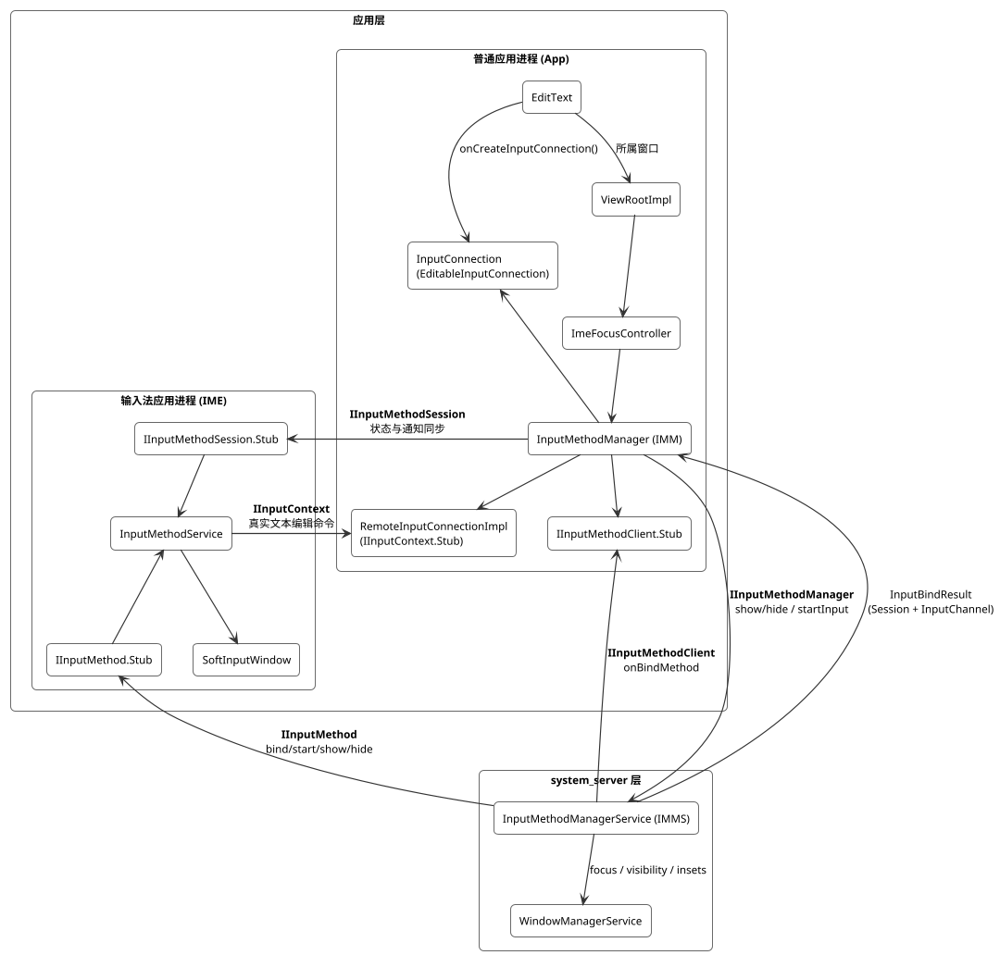
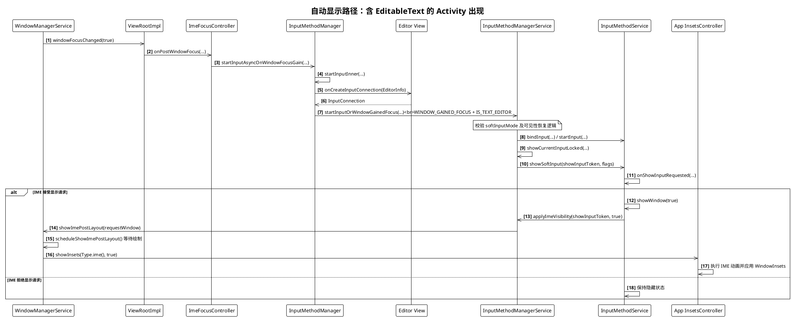
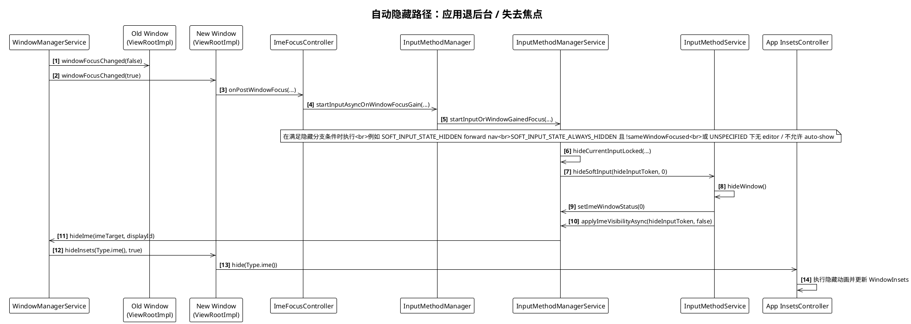
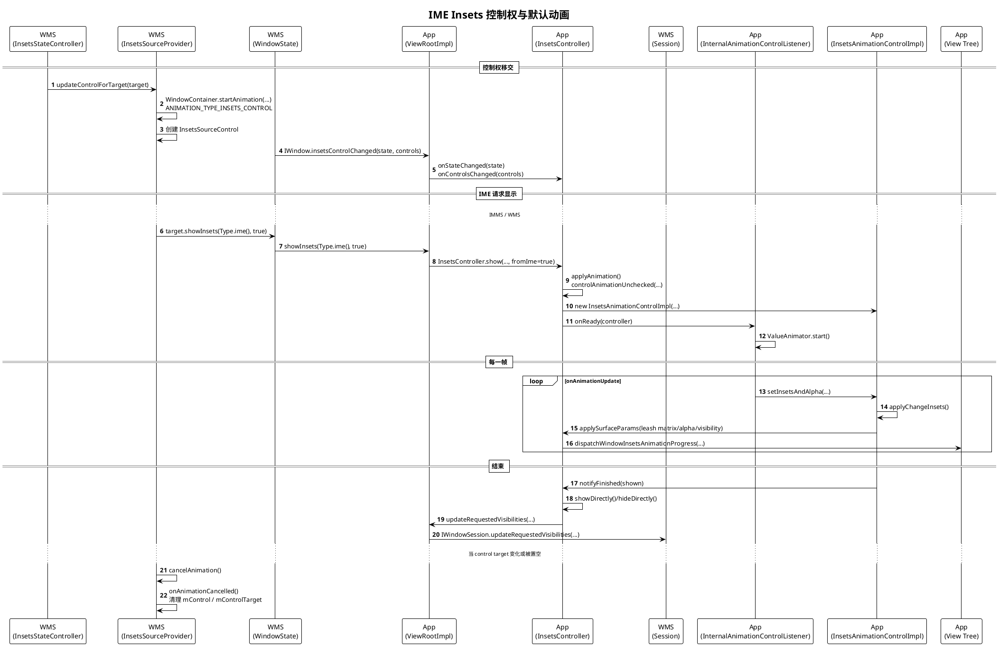
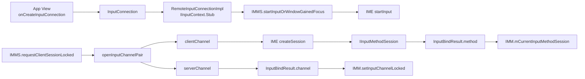
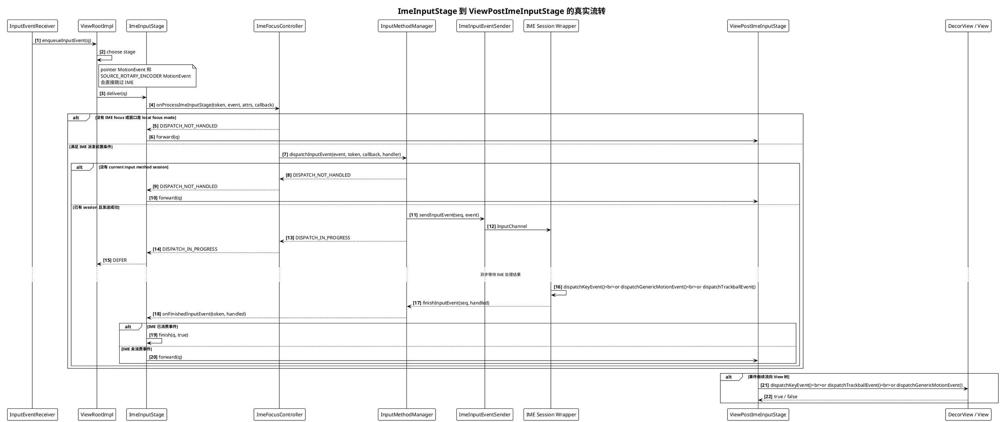
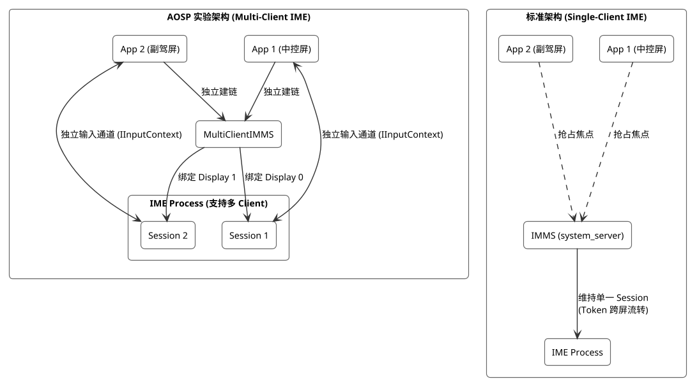

# InputMethodManagerService 技术文档大纲

## 架构概述与系统定位

IME（Input Method Editor，输入法编辑器）是 Android 中负责文本输入的独立应用，典型例子是系统键盘。它运行在自己的进程中，通过软键盘界面接收用户输入，再将文本提交给当前获得焦点的应用。

`InputMethodManagerService` (IMMS) 是运行在 `system_server` 中的系统输入法中枢。它本身不负责编辑文本，也不负责绘制键盘界面；它的主要职责是：

- 判定当前哪个窗口、哪个客户端可以拥有输入法焦点
- 在 App 进程与 IME 进程之间建立输入会话
- 管理 IME 的绑定、切换、显示/隐藏，以及相关权限校验
- 与 WindowManager 协同处理输入法窗口、Insets 和可见性

从代码实现看，输入法系统是一个典型的三端架构：

- **App 进程**（普通应用）负责产生 `InputConnection`，并通过 `InputMethodManager` 参与输入会话
- **`system_server`** 中的 IMMS 负责会话编排和 Binder 建链
- **IME 进程**（输入法应用）通过 `InputMethodService` 提供输入 UI，并通过远程接口回调 App 执行真实文本编辑

### 组件关系



这张图里最关键的两点是：

- `InputConnection` 不会直接跨进程传给 IME，而是由 App 侧包装成 `IInputContext.Stub`
- `IInputMethodSession` 主要承载会话状态同步，不是原始按键事件的主传输通道

### 核心进程与组件职责

#### App 进程

- `ViewRootImpl`
  是窗口级输入链路的起点，内部持有 `ImeFocusController`。
- `ImeFocusController`
  负责 IME 焦点状态、served view 切换，以及在窗口获得焦点时触发 `startInput` 流程。
- `InputMethodManager` (IMM)
  是 App 侧与 IMMS 交互的主入口。它负责：
  - 调用 `startInputOrWindowGainedFocus`
  - 调用 `showSoftInput` / `hideSoftInputFromWindow`
  - 包装并维护当前 `InputConnection`
  - 接收 IMMS 回调回来的 `InputBindResult`
- `InputConnection`
  是编辑控件暴露给 IME 的本地编辑接口，通常由 `View.onCreateInputConnection(EditorInfo)` 创建。标准文本控件常见实现是 `EditableInputConnection`。
- `RemoteInputConnectionImpl`
  是 App 侧对 `InputConnection` 的远程包装，继承自 `IInputContext.Stub`。IME 进程真正跨进程调用的是它，而不是 `InputConnection` 本体。

#### system_server

- `InputMethodManagerService`
  是全局调度器，负责：
  - 维护已注册 client、当前 IME 和当前会话状态
  - 校验调用方是否真的拥有 IME focus
  - 调用 IME 的 `bindInput`、`startInput`、`createSession`
  - 把 `IInputMethodSession` 和 `InputChannel` 通过 `InputBindResult` 回传给 App
- `WindowManagerInternal` / `WindowManagerService`
  负责窗口焦点、IME target、窗口层级、Insets 和显隐协同。IMMS 需要借助它来判断输入法是否应当附着到当前窗口。

#### IME 进程

- `InputMethodService`
  是 IME 的服务基类，负责输入法生命周期和输入视图管理。是否使用 `KeyboardView` 只是具体 IME 的实现选择，不是系统架构要求。
- `IInputMethod.Stub`
  是 IMMS 控制 IME 的总入口，用来执行 `bindInput`、`unbindInput`、`startInput`、`createSession`、`showSoftInput`、`hideSoftInput` 等操作。
- `IInputMethodSession.Stub`
  是与当前 client 关联的会话对象，用来接收选区变化、提取文本更新、`finishInput`、`invalidateInput` 等会话级通知。

### 核心跨进程接口与真实分工

#### `IInputMethodManager`

方向：App -> IMMS

这是 App 调用系统输入法服务的总入口，核心接口包括：

- `addClient`
- `startInputOrWindowGainedFocus`
- `showSoftInput`
- `hideSoftInput`

它解决的是“谁要开始输入、谁请求显示或隐藏 IME”的问题。

#### `IInputMethodClient`

方向：IMMS -> App

这是 IMMS 回调 App 的接口，实际由 `InputMethodManager` 内部的 `IInputMethodClient.Stub` 实现。典型回调包括：

- `onBindMethod`
- `onUnbindMethod`
- `setActive`

也就是说，IMMS 并不是直接回调某个编辑控件，而是先回调 App 侧的 IMM client binder。

#### `IInputMethod`

方向：IMMS -> IME

这是系统控制 IME 的主通道，负责 IME 生命周期和输入会话初始化，例如：

- `bindInput`
- `unbindInput`
- `startInput`
- `createSession`
- `showSoftInput`
- `hideSoftInput`

IMMS 通过它把当前输入目标对应的上下文和会话要求交给 IME。

#### `IInputMethodSession`

方向：App -> IME

这是当前输入会话的“安全接口”，但它的职责要和 `IInputContext` 分开理解：

- 它主要承载编辑状态同步，如 `updateSelection`、`updateExtractedText`、`viewClicked`、`updateCursorAnchorInfo`
- 它也承载 `finishInput`、`invalidateInput` 等会话通知
- 它不是 `InputConnection` 的替代品
- 它也不是 App 到 IME 的原始按键总线

当前实现里，当 App 通过 `InputMethodManager.dispatchInputEvent()` 转发原始输入事件时，事件会通过 `InputChannel` 从 App 侧送往 IME；随后 IME 侧的 `IInputMethodSessionWrapper.ImeInputEventReceiver` 再按事件类型分发给 `InputMethodSession.dispatchKeyEvent()`、`dispatchGenericMotionEvent()` 或 `dispatchTrackballEvent()`。

#### `IInputContext`

方向：IME -> App

这是 IME 操作编辑器的真实文本编辑通道。IME 调用这里的方法后，最终会落到 App 侧的 `InputConnection` 实现，例如：

- `commitText`
- `setComposingText`
- `deleteSurroundingText`
- `getTextBeforeCursor`
- `getSelectedText`

因此，真正的文本编辑链路是：

```text
IME -> IInputContext -> RemoteInputConnectionImpl -> InputConnection
```

而不是：

```text
IME -> IMMS -> App text edit
```

IMMS 负责建链和调度，不负责逐条转发文本编辑命令。

### 线程模型与一个常见误区

`InputConnection` 的方法最终会回到 App 进程内执行：

- 系统优先使用 `InputConnection.getHandler()` 对应的 `Looper`
- 如果没有提供专用 `Handler`，再回退到默认线程模型
- 对标准文本控件来说，这通常表现为主线程

所以，架构层面应该理解为：

```text
IME 的编辑请求最终在 InputConnection 绑定的目标 Looper 上执行，常见情况下是 UI 线程，但并非强制只能是主线程。
```

### 系统定位总结

可以把 IMMS 的系统定位概括成一句话：

```text
IMMS 是 Android 输入法体系里的会话编排器和权限闸门，负责在 App、IME、WindowManager 之间建立正确的输入会话，但不直接承担文本编辑逻辑本身。
```

## 显隐控制与窗口层级流转

### IME 窗口的建立

在讨论显隐流程之前，需要理解 IME 窗口是如何建立的。IME 的窗口载体是 `SoftInputWindow`（继承自 `Dialog`），在 `InputMethodService.onCreate()` 中创建。

> `InputMethodService.onCreate()` 的调用时机：IMMS 选定当前 IME 后，通过 `InputMethodBindingController.bindCurrentMethod()` 调用 `Context.bindServiceAsUser()` 绑定 IME 服务。如果 IME 进程尚未启动，系统会先创建进程，然后回调 `InputMethodService.onCreate()`。典型触发场景包括系统启动后首次加载默认 IME、用户在设置中切换 IME、以及 IME 进程被杀后的重新绑定。

```java
// InputMethodService.java — onCreate
mWindow = new SoftInputWindow(this, mTheme, mDispatcherState);
final WindowManager.LayoutParams lp = window.getAttributes();
lp.setTitle("InputMethod");
lp.type = WindowManager.LayoutParams.TYPE_INPUT_METHOD;
lp.width = WindowManager.LayoutParams.MATCH_PARENT;
lp.height = WindowManager.LayoutParams.WRAP_CONTENT;
lp.gravity = Gravity.BOTTOM;
```

窗口类型为 `TYPE_INPUT_METHOD`，布局固定在屏幕底部。

IME 窗口需要一个由系统签发的 token 才能被 WMS 接受。token 的流转过程如下：

1. IMMS 绑定 IME 服务时，`InputMethodBindingController.addFreshWindowToken()` 创建 token 并注册到 WMS：
   ```java
   // InputMethodBindingController.java
   mCurToken = new Binder();
   mIWindowManager.addWindowToken(mCurToken, TYPE_INPUT_METHOD, displayIdToShowIme, null);
   ```

2. IMMS 通过 `IInputMethod.initializeInternal()` 将 token 传给 IME 进程

3. IME 侧 `InputMethodService` 收到 token 后调用 `SoftInputWindow.setToken(token)`，将 token 写入窗口属性，并以 `INVISIBLE` 状态执行 `show()`——此时窗口已添加到 WMS，但对用户不可见

`SoftInputWindow` 内部通过状态机管理窗口生命周期：`TOKEN_PENDING` → `TOKEN_SET` → `SHOWN_AT_LEAST_ONCE`（或 `REJECTED_AT_LEAST_ONCE`）→ `DESTROYED`。

### 显示链路（showSoftInput）

#### 调用链概览

`IInputMethod` 是 `oneway` AIDL 接口，所有调用都是异步的。IMMS 向 IME 发出 `showSoftInput` 后不会等待 IME 响应，而是立即记录状态并返回。IME 侧在异步处理时还可能拒绝显示。因此，"请求发出"不等于"IME 已显示"。

```
App: InputMethodManager.showSoftInput(view, flags)
  → [同步 Binder] IInputMethodManager.showSoftInput(client, windowToken, flags, ...)
    → IMMS: showCurrentInputLocked()
        ├─ [oneway Binder] IInputMethod.showSoftInput(showInputToken, flags, resultReceiver)
        ├─ onShowHideSoftInputRequested()  ← 异步调用发出后立即执行，不等待 IME 响应
        │    → WindowManagerInternal.onToggleImeRequested()
        └─ mInputShown = true              ← IMMS 乐观地标记为已显示

  ── 以下在 IME 进程异步执行 ──

  IME: InputMethodService.InputMethodImpl.showSoftInput(flags, resultReceiver)
    → dispatchOnShowInputRequested(flags, false)
        ├─ 返回 true  → showWindow(true) → SoftInputWindow.show()
        │                                → setImeWindowStatus(IME_ACTIVE | IME_VISIBLE)
        └─ 返回 false → 不调用 showWindow()，IME 拒绝显示
                        → setImeWindowStatus() 仍会被调用，但不含 IME_VISIBLE
    → ResultReceiver 回传实际结果（RESULT_SHOWN / RESULT_UNCHANGED_HIDDEN）
```

`dispatchOnShowInputRequested` 调用 `onShowInputRequested()`，后者在以下条件下会返回 `false` 拒绝显示：
- `onEvaluateInputViewShown()` 返回 `false`（如当前配置不适合显示）
- 请求是隐式的（非 `SHOW_EXPLICIT`）且 IME 处于全屏模式
- 有物理键盘且用户未配置"随物理键盘显示软键盘"

#### 时序图 1：含 `EditableText` 的 Activity 出现并触发 IME 显示

下图描述的是最常见的自动显示路径：新页面进入前台，目标窗口包含可编辑文本控件，并且 `softInputMode` 或 IME 可见性恢复逻辑允许显示键盘。



#### App 侧

`InputMethodManager.showSoftInput(View, int)` 是应用请求显示软键盘的标准入口。核心校验逻辑：

- 通过 `hasServedByInputMethodLocked(view)` 确认目标 View 所在窗口确实由当前 IMM 服务
- 向 `ImeInsetsSourceConsumer` 发送 `MSG_ON_SHOW_REQUESTED` 通知（用于 Insets 协同）
- 通过 Binder 调用 `mService.showSoftInput(mClient, view.getWindowToken(), flags, resultReceiver, reason)`

#### IMMS 侧

`showSoftInput` 是 `IInputMethodManager` 的 Binder 入口。校验通过后委托给 `showCurrentInputLocked`：

```java
// InputMethodManagerService.java
boolean showCurrentInputLocked(IBinder windowToken, int flags,
        ResultReceiver resultReceiver, @SoftInputShowHideReason int reason) {
    mShowRequested = true;
    if (mAccessibilityRequestingNoSoftKeyboard || mImeHiddenByDisplayPolicy) {
        return false;
    }

    // 根据 flags 设置显示模式
    if ((flags & InputMethodManager.SHOW_FORCED) != 0) {
        mShowExplicitlyRequested = true;
        mShowForced = true;
    } else if ((flags & InputMethodManager.SHOW_IMPLICIT) == 0) {
        mShowExplicitlyRequested = true;
    }

    if (!mSystemReady) return false;

    mBindingController.setCurrentMethodVisible();
    final IInputMethodInvoker curMethod = getCurMethodLocked();
    if (curMethod != null) {
        // 创建占位 token，防止 IME 向客户端 App 注入窗口
        Binder showInputToken = new Binder();
        mShowRequestWindowMap.put(showInputToken, windowToken);
        curMethod.showSoftInput(showInputToken, getImeShowFlagsLocked(), resultReceiver);
        onShowHideSoftInputRequested(true, windowToken, reason);
        mInputShown = true;
        return true;
    }
    return false;
}
```

关键的安全设计：IMMS 不会把真实的 `windowToken` 传给 IME，而是创建一个占位的 `showInputToken`，并在 `mShowRequestWindowMap` 中维护映射。这防止了 IME 进程利用 App 的 window token 进行窗口注入。

`onShowHideSoftInputRequested` 会调用 `mWindowManagerInternal.onToggleImeRequested()`，通知 WMS 更新 IME 控制状态和目标信息。

IMMS 用三个布尔字段追踪显示请求的语义：

| 字段 | 含义 |
|------|------|
| `mShowRequested` | 有客户端请求显示（不区分显式/隐式） |
| `mShowExplicitlyRequested` | 显示请求是显式的（非 `SHOW_IMPLICIT`） |
| `mShowForced` | 显示请求是强制的（`SHOW_FORCED`） |

这三个字段直接影响后续 `hideSoftInput` 时的 flag 判定逻辑（见隐藏链路）。

#### IME 侧

`IInputMethod.showSoftInput` 最终到达 `InputMethodService.InputMethodImpl.showSoftInput`：

```java
// InputMethodService.java — InputMethodImpl
public void showSoftInput(int flags, ResultReceiver resultReceiver) {
    // Android R+ 禁止 IME 自己调用 showSoftInput（应使用 requestShowSelf）
    if (getApplicationInfo().targetSdkVersion >= Build.VERSION_CODES.R
            && !mSystemCallingShowSoftInput) {
        return;
    }

    final boolean wasVisible = isInputViewShown();
    if (dispatchOnShowInputRequested(flags, false)) {
        showWindow(true);
    }
    setImeWindowStatus(mapToImeWindowStatus(), mBackDisposition);

    // 通过 ResultReceiver 回传结果
    resultReceiver.send(visibilityChanged
            ? InputMethodManager.RESULT_SHOWN
            : (wasVisible ? RESULT_UNCHANGED_SHOWN : RESULT_UNCHANGED_HIDDEN), null);
}
```

`showWindow(true)` 是实际显示窗口的核心方法：

1. `prepareWindow(showInput)` —— 标记 `mDecorViewVisible = true`，初始化视图层级，调用 `updateFullscreenMode()` 和 `updateInputViewShown()`
2. `startViews()` —— 调用 `onStartInputView()` / `onStartCandidatesView()` 等 IME 开发者的回调
3. `setImeWindowStatus()` —— 向 IMMS 上报 `IME_ACTIVE | IME_VISIBLE` 状态位
4. `mWindow.show()` —— `SoftInputWindow.show()` 调用 `Dialog.show()`，最终让 DecorView 可见
5. `applyVisibilityInInsetsConsumerIfNecessary(true)` —— 触发 Insets 系统的显示流程（详见后文）

#### 可见状态位

`InputMethodService` 通过 `setImeWindowStatus(vis, backDisposition)` 向 IMMS 上报可见状态。`vis` 是以下标志位的组合：

| 标志位 | 值 | 含义 |
|--------|-----|------|
| `IME_ACTIVE` | 0x1 | IME 已激活，准备好接受输入 |
| `IME_VISIBLE` | 0x2 | IME 窗口对用户可见 |
| `IME_INVISIBLE` | 0x4 | IME 已激活但窗口不可见（与 `IME_VISIBLE` 互斥） |

IMMS 收到后存入 `mImeWindowVis`，并通过 `updateSystemUiLocked()` 通知 SystemUI 更新状态栏。

### 隐藏链路（hideSoftInput）

#### 调用链概览

与显示链路相同，`IInputMethod.hideSoftInput` 也是 oneway 异步调用。IMMS 发出隐藏指令后立即重置本地状态，不等待 IME 实际完成隐藏。

```
App: InputMethodManager.hideSoftInputFromWindow(windowToken, flags)
  → [同步 Binder] IInputMethodManager.hideSoftInput(client, windowToken, flags, ...)
    → IMMS: hideCurrentInputLocked()
        ├─ [oneway Binder] IInputMethod.hideSoftInput(hideInputToken, 0, resultReceiver)
        ├─ onShowHideSoftInputRequested(false, ...)  ← 立即执行
        └─ 立即重置：mInputShown=false, mShowExplicitlyRequested=false, mShowForced=false

  ── 以下在 IME 进程异步执行 ──

  IME: InputMethodService.InputMethodImpl.hideSoftInput(flags, resultReceiver)
    → hideWindow()
        → setImeWindowStatus(0, backDisposition)   // 清除 IME_ACTIVE/IME_VISIBLE
        → applyVisibilityInInsetsConsumerIfNecessary(false)
        → DecorView 设为 GONE
    → ResultReceiver 回传实际结果（RESULT_HIDDEN / RESULT_UNCHANGED_HIDDEN）
```

#### 时序图 2：应用退到后台后 IME 如何隐藏

下图描述的是最常见的一条后台自动隐藏路径：原前台应用失去焦点后，新焦点窗口进入 `startInputOrWindowGainedFocus(...)`；随后 IMMS 在 `softInputMode` 分支判定需要隐藏 IME 时，调用 `hideCurrentInputLocked()` 收起键盘。这里不是“旧窗口退后台”本身直接调用隐藏，而是“新焦点窗口的输入启动路径”作出隐藏决策。


#### IMMS 侧校验

`hideSoftInput` 和 `showSoftInput` 的 Binder 入口走不同的校验路径，但强度相当：

- `showSoftInput` 通过 `canInteractWithImeLocked(uid, client, "showSoftInput")` 校验，内部逻辑是：如果调用方不是 `mCurClient`，则查询 WMS 确认其是否持有 IME 焦点
- `hideSoftInput` 内联了相同模式的校验：检查调用方是否为 `mCurClient`，如果不是，通过 `isImeClientFocused(windowToken, cs)` 查询 WMS

两者的共同要求是：调用方必须是当前 IME client，或者其窗口持有 IME 焦点。

**WMS 判定 IME 焦点的逻辑**

IMMS 调用 `mWindowManagerInternal.hasInputMethodClientFocus(windowToken, uid, pid, displayId)` 查询 WMS，WMS 的判定分为两轮：

```java
// WindowManagerService.java — hasInputMethodClientFocus
InputTarget target = getInputTargetFromWindowTokenLocked(windowToken);
// ... displayId 校验、display access 校验 ...

// 第一轮：检查调用方窗口是否就是 IME 输入目标
if (target.isInputMethodClientFocus(uid, pid)) {
    return HAS_IME_FOCUS;
}

// 第二轮：兜底——检查当前焦点窗口是否属于同一进程
final WindowState currentFocus = displayContent.mCurrentFocus;
if (currentFocus != null && currentFocus.mSession.mUid == uid
        && currentFocus.mSession.mPid == pid) {
    return currentFocus.canBeImeTarget() ? HAS_IME_FOCUS : NOT_IME_TARGET_WINDOW;
}
return NOT_IME_TARGET_WINDOW;
```

第一轮中，`WindowState.isInputMethodClientFocus()` 委托给 `DisplayContent.isInputMethodClientFocus(uid, pid)`，后者调用 `computeImeTarget(false)` 计算出当前 IME 目标窗口，再比对该窗口所属的 uid/pid 是否与请求方一致。

第二轮是兜底逻辑（源码注释："it seems in some cases we may not have moved the IM target window, such as when it was in a pop-up window"）——如果第一轮没命中，再看当前焦点窗口是否属于请求方进程，如果是，还需通过 `canBeImeTarget()` 确认该窗口有资格作为 IME 目标。

`canBeImeTarget()` 排除以下窗口：
- IME 窗口自身（`mIsImWindow`）
- 画中画模式窗口
- 截屏窗口（`TYPE_SCREENSHOT`）
- 所属 Activity 不可聚焦（`windowsAreFocusable() == false`）
- 所属 Task 不可聚焦（如分屏模式下被最小化的一侧）
- 正在执行 transient launch 的 Activity
- 窗口 flags 不满足 IME 交互条件：`FLAG_NOT_FOCUSABLE` 和 `FLAG_ALT_FOCUSABLE_IM` 必须同时设置或同时不设置，否则不能成为 IME 目标
- 窗口不可见且未处于添加中

最终返回四种结果之一：`HAS_IME_FOCUS`、`NOT_IME_TARGET_WINDOW`、`DISPLAY_ID_MISMATCH`、`INVALID_DISPLAY_ID`。

#### IMMS 核心隐藏逻辑

`hideCurrentInputLocked` 包含关键的 flag 判定：

```java
// InputMethodManagerService.java
boolean hideCurrentInputLocked(IBinder windowToken, int flags,
        ResultReceiver resultReceiver, @SoftInputShowHideReason int reason) {
    mShowRequested = false;

    // HIDE_IMPLICIT_ONLY：如果上次 show 是显式请求或强制的，则拒绝隐藏
    if ((flags & InputMethodManager.HIDE_IMPLICIT_ONLY) != 0
            && (mShowExplicitlyRequested || mShowForced)) {
        return false;
    }

    // HIDE_NOT_ALWAYS：如果上次 show 是 SHOW_FORCED，则拒绝隐藏
    if (mShowForced && (flags & InputMethodManager.HIDE_NOT_ALWAYS) != 0) {
        return false;
    }

    // 判断是否需要真正通知 IME 隐藏
    final boolean shouldHideSoftInput = (curMethod != null)
            && (mInputShown || (mImeWindowVis & InputMethodService.IME_ACTIVE) != 0);

    if (shouldHideSoftInput) {
        final Binder hideInputToken = new Binder();
        mHideRequestWindowMap.put(hideInputToken, windowToken);
        curMethod.hideSoftInput(hideInputToken, 0, resultReceiver);
        onShowHideSoftInputRequested(false, windowToken, reason);
    }

    // 无论是否真正发送了隐藏指令，都重置状态
    mBindingController.setCurrentMethodNotVisible();
    mInputShown = false;
    mShowExplicitlyRequested = false;
    mShowForced = false;
    return shouldHideSoftInput;
}
```

show 和 hide 的 flag 配合关系：

| show flags | 设置的状态 | 能被哪些 hide flags 取消 |
|------------|-----------|------------------------|
| `SHOW_IMPLICIT` | `mShowRequested = true` | 任何 hide 都可以 |
| 无 flag（显式） | `mShowExplicitlyRequested = true` | `HIDE_NOT_ALWAYS` 可以，`HIDE_IMPLICIT_ONLY` 不行 |
| `SHOW_FORCED` | `mShowForced = true` | 只有无 flag 的 hide 才能取消 |

#### IME 侧

`InputMethodImpl.hideSoftInput` 调用 `hideWindow()` 完成实际隐藏：

```java
// InputMethodService.java
public void hideWindow() {
    setImeWindowStatus(0, mBackDisposition);              // 上报 vis=0，清除 IME_ACTIVE/IME_VISIBLE
    applyVisibilityInInsetsConsumerIfNecessary(false);     // 通知 Insets 系统
    mWindowVisible = false;
    finishViews(false);                                   // 调用 onFinishInputView/onFinishCandidatesView
    if (mDecorViewVisible) {
        if (mInputView != null) {
            mInputView.dispatchWindowVisibilityChanged(View.GONE);
        }
        mDecorViewVisible = false;
        onWindowHidden();
    }
}
```

### 其他触发路径

除了 App 显式调用 show/hide，系统还有多条自动触发路径：

#### 窗口焦点切换时的 softInputMode 处理

当窗口获得焦点时，`startInputOrWindowGainedFocusInternalLocked` 根据窗口的 `softInputMode` 自动决定 IME 显隐。但每种模式都有前置条件，不是简单的"总是显示/隐藏"：

| softInputMode | 前置条件 | 行为 |
|----------------|---------|------|
| `STATE_UNSPECIFIED` | 非文本编辑窗口 | 自动隐藏（`HIDE_NOT_ALWAYS`） |
| `STATE_UNSPECIFIED` | 文本编辑窗口 + 前进导航 + `doAutoShow` | 可能自动显示 |
| `STATE_HIDDEN` | `IS_FORWARD_NAVIGATION` | 隐藏 |
| `STATE_ALWAYS_HIDDEN` | `!sameWindowFocused`（焦点来自不同窗口） | 隐藏；同一窗口重新获得焦点时不触发 |
| `STATE_VISIBLE` | `IS_FORWARD_NAVIGATION` 且 `isSoftInputModeStateVisibleAllowed()` 返回 `true` | 自动显示；如果焦点 View 的 `onCheckIsTextEditor()` 返回 `false`，则被拒绝并打印 error log |
| `STATE_ALWAYS_VISIBLE` | `!sameWindowFocused` 且 `isSoftInputModeStateVisibleAllowed()` 返回 `true` | 自动显示；同一窗口重新获得焦点时不触发；同样受 `onCheckIsTextEditor()` 约束 |

`isSoftInputModeStateVisibleAllowed()` 检查当前窗口是否有焦点 View 且该 View 声明自己是文本编辑器（`View.onCheckIsTextEditor() == true`）。这意味着即使窗口声明了 `STATE_VISIBLE` 或 `STATE_ALWAYS_VISIBLE`，如果焦点 View 不是文本编辑器，IME 也不会自动弹出。

此外，如果窗口设置了 `FLAG_ALT_FOCUSABLE_IM`，则会改变该窗口与 IME 的焦点交互行为。

#### IME 自行请求显隐

从 Android R 开始，IME 不应直接调用 `showSoftInput` / `hideSoftInput`，而是使用：

- `requestShowSelf(int flags)` → IMMS.`showMySoftInput(token, flags)`
- `requestHideSelf(int flags)` → IMMS.`hideMySoftInput(token, flags, reason)`

这两个方法使用的 window token 是 `mLastImeTargetWindow`（IMMS 记录的最后一个 IME 目标窗口），而非 App 传入的 token。

#### 客户端解绑 / IME 切换

当 IME client 被移除或 IME 切换时，IMMS 会调用 `hideCurrentInputLocked` 确保键盘收起。

### 与 WMS 的协同：Insets 机制

这一节只按当前代码实现说明 IME 与 Insets 的协同，不把几个不同阶段混成一条链。先分清两件事：

1. **控制权移交**：WMS 把某个 Insets 源的 `InsetsSourceControl` 交给目标窗口，让对方可以操纵 leash。
2. **显隐请求**：IME 或系统要求目标窗口执行 `showInsets()` / `hideInsets()`，目标窗口再决定是否启动默认动画。

这两件事有关联，但不是同一个 Binder 回调。

#### 先分清两条跨进程链路

**控制权链路**

```text
InsetsStateController.onControlChanged()
  → InsetsSourceProvider.updateControlForTarget()
    → WindowContainer.startAnimation(..., ANIMATION_TYPE_INSETS_CONTROL)
      → SurfaceAnimator.createAnimationLeash(...)
  → WindowState.notifyInsetsControlChanged()
    → IWindow.insetsControlChanged(InsetsState, InsetsSourceControl[])
      → ViewRootImpl.dispatchInsetsControlChanged()
        → InsetsController.onStateChanged() + onControlsChanged()
```

**显隐链路**

```text
InputMethodService.applyVisibilityInInsetsConsumerIfNecessary(true/false)
  → IMMS.applyImeVisibility(...)
    → WMS.showImePostLayout(...) / hideIme(...)
      → target.showInsets(Type.ime(), true) / hideInsets(Type.ime(), true)
        → ViewRootImpl.showInsets() / hideInsets()
          → InsetsController.show(..., fromIme=true) / hide(..., fromIme=true)
```

`showImePostLayout()` / `hideIme()` 负责告诉目标窗口“该显示/隐藏 IME Insets 了”；  
`insetsControlChanged()` 负责把“你现在能控制哪几个 source、对应 leash 是什么”交给客户端。

#### 控制权是怎样交给 App 的

Server 侧从 `InsetsStateController.onControlChanged()` 开始：

```java
// InsetsStateController.java
provider.updateControlForTarget(target, false /* force */);
```

`InsetsSourceProvider.updateControlForTarget()` 并不是自己直接 `new SurfaceControl`，而是：

```java
// InsetsSourceProvider.java
mAdapter = new ControlAdapter(surfacePosition);
mWindowContainer.startAnimation(t, mAdapter, !mClientVisible /* hidden */,
        ANIMATION_TYPE_INSETS_CONTROL);
mControl = new InsetsSourceControl(mSource.getType(), leash, mClientVisible,
        surfacePosition, mInsetsHint);
```

这里真正创建 animation leash 的是 `SurfaceAnimator.createAnimationLeash(...)`。`InsetsSourceProvider` 只是借助 `WindowContainer.startAnimation(..., ANIMATION_TYPE_INSETS_CONTROL)` 把 source window 重新挂到一条 animation leash 下，再把这条 leash 包成 `InsetsSourceControl`。

一个容易忽略的细节是：leash 刚创建出来时，Server 不会立刻把它发给客户端。`InsetsSourceProvider.getControl()` 会在事务尚未提交时返回一份 **`leash = null`** 的 `InsetsSourceControl`，避免客户端过早操作导致状态被 Server 事务覆盖。只有 `mIsLeashReadyForDispatching` 变为 `true` 后，客户端才会拿到真正的 leash。

控制权回调走的不是 `IWindowSession`，而是窗口自己的 `IWindow`：

```java
// WindowState.java
mClient.insetsControlChanged(getCompatInsetsState(),
        stateController.getControlsForDispatch(this));
```

App 侧入口是：

```java
// ViewRootImpl.java
public void insetsControlChanged(InsetsState insetsState,
        InsetsSourceControl[] activeControls) {
    viewAncestor.dispatchInsetsControlChanged(insetsState, activeControls);
}
```

随后 `ViewRootImpl` 把消息投到主线程，按固定顺序先 `onStateChanged()`、再 `onControlsChanged()`。这个顺序是刻意保证的：客户端在“拿到 control”时，可以先看到最新的 `InsetsState`，再决定要不要启动动画。

#### IME 的 show 和 hide 如何接到 Insets

**显示**

IME 调用 `applyVisibilityInInsetsConsumerIfNecessary(true)` 后，最终走到 IMMS：

```java
// InputMethodManagerService.java
if (setVisible) {
    mWindowManagerInternal.showImePostLayout(mShowRequestWindowMap.get(windowToken));
}
```

WMS 不会立刻让目标窗口 `showInsets(ime)`，而是通过 `ImeInsetsSourceProvider.scheduleShowImePostLayout()` 延迟到布局完成之后，再在 `isReadyToShowIme()` 成立时执行：

```java
final InsetsControlTarget target = mDisplayContent.getImeTarget(IME_TARGET_CONTROL);
setImeShowing(true);
target.showInsets(WindowInsets.Type.ime(), true /* fromIme */);
```

**隐藏**

隐藏路径更直接：

```java
// InputMethodManagerService.java
if (!setVisible) {
    mWindowManagerInternal.hideIme(
            mHideRequestWindowMap.get(windowToken), mCurClient.selfReportedDisplayId);
}
```

WMS 的 `hideIme()` 最终调用当前 control target：

```java
dc.getImeTarget(IME_TARGET_CONTROL).hideInsets(
        WindowInsets.Type.ime(), true /* fromIme */);
```

这说明：`showImePostLayout()` / `hideIme()` 并不直接改 App 布局，它们只是把 `showInsets()` / `hideInsets()` 这个请求发给当前 IME control target。

#### Client 侧默认动画到底是谁在驱动

当目标窗口收到 `showInsets(Type.ime(), true)` 或 `hideInsets(Type.ime(), true)` 后，最终走到 `InsetsController.show(..., fromIme=true)` / `hide(..., fromIme=true)`。

接下来 `InsetsController` 会：

1. 根据当前 `InsetsSourceConsumer` 的 requested visibility 和 animation type 计算 `typesReady`
2. 调用 `applyAnimation(...)`
3. 在 `controlAnimationUnchecked(...)` 中为这些 type 收集 `InsetsSourceControl`
4. 创建真正的控制器对象

默认 show/hide 动画有两种运行方式：

- 如果窗口**有** `WindowInsetsAnimation.Callback`，走 `InsetsAnimationControlImpl`
- 如果窗口**没有**动画 callback，走 `InsetsAnimationThreadControlRunner`

创建点在这里：

```java
final InsetsAnimationControlRunner runner = useInsetsAnimationThread
        ? new InsetsAnimationThreadControlRunner(...)
        : new InsetsAnimationControlImpl(...);
```

因此，严格说：

- **`InsetsAnimationControlImpl` 不是“内部自带一个 ValueAnimator 的动画器”**
- 默认 `ValueAnimator` 在 `InsetsController.InternalAnimationControlListener.onReady()` 里创建
- `InsetsAnimationControlImpl` 更像是“持有 controls、记录当前 insets/alpha、负责把每一帧落到 leash 和 `InsetsState` 上的控制对象”

默认 `ValueAnimator` 的位置：

```java
// InsetsController.java
mAnimator = ValueAnimator.ofFloat(0f, 1f);
mAnimator.addUpdateListener(animation -> {
    controller.setInsetsAndAlpha(...);
});
```

也就是说，真正的默认帧驱动者是：

```text
InternalAnimationControlListener
  → ValueAnimator.onAnimationUpdate(...)
    → InsetsAnimationControlImpl.setInsetsAndAlpha(...)
```

#### 每一帧到底动画了什么

这里需要区分两个同步更新的结果，但不要把它们理解成“两个完全独立的动画引擎”。

`InsetsAnimationControlImpl.setInsetsAndAlpha(...)` 会先记录本帧的：

- `pendingInsets`
- `pendingAlpha`
- `pendingFraction`

然后通过 `scheduleApplyChangeInsets(this)` 请求应用这一帧。

真正落帧时，`InsetsAnimationControlImpl.applyChangeInsets(...)` 会做两件事：

1. 为每个受控 source 计算新的 `SurfaceParams`
2. 用这些 `SurfaceParams` 更新一份临时 `InsetsState`

关键代码：

```java
// InsetsAnimationControlImpl.java
updateLeashesForSide(..., params, outState, mPendingAlpha);
mController.applySurfaceParams(params.toArray(...));
```

`updateLeashesForSide()` 并不是简单做一个 `setPosition(currentY)`，而是构造：

- `matrix`
- `alpha`
- `visibility`

然后封装成 `SurfaceParams`。App 侧 host 再用 `SyncRtSurfaceTransactionApplier` 或直接 `SurfaceControl.Transaction.apply()` 把它们提交出去。

因此，这里的“对 IME 做动画”更准确地说是：

- 客户端在每一帧更新 **leash 的矩阵/透明度/可见性**
- 同时用同一帧计算结果更新一份新的 `InsetsState`

随后，`InsetsController` 的 `mAnimCallback` 会基于这份新 `InsetsState` 重新计算 `WindowInsets`，再调用：

```java
mHost.dispatchWindowInsetsAnimationProgress(insets, runningAnimations);
```

如果应用注册了 `WindowInsetsAnimation.Callback`，这一步才会进入 `onProgress()`，应用才能在这里根据当前 `WindowInsets.Type.ime()` 的值调整自己的 `padding`、`translationY` 等布局参数。

所以，严格按代码说：

- **source leash 的动画** 和 **`WindowInsetsAnimation.Callback.onProgress()` 的回调** 是同一轮控制器帧更新里的两个结果
- 但 **App 自己的 View 树位移** 不是系统强制做的；只有应用实现了 callback，并在其中主动调整 UI，才会出现“输入框随键盘一起上移”的效果

#### 动画结束后发生了什么

单次 show/hide 动画结束时，客户端先走的是：

```java
// InsetsAnimationControlImpl.java
finish(shown)
  → mController.notifyFinished(this, shown)
```

`InsetsController.notifyFinished()` 做的事情是：

```java
if (shown) {
    showDirectly(runner.getTypes(), true /* fromIme */);
} else {
    hideDirectly(runner.getTypes(), true /* animationFinished */, ...);
}
```

随后 `InsetsController` 会通过 `updateRequestedVisibilities(...)` 把 requested visibility 同步回 Server。

这里有一个容易误解的点：

- **单次动画结束，并不等于 control 被撤销**
- 动画结束后，客户端通常仍然持有这份 `InsetsSourceControl`

真正的 control 回收发生在 control target 变化或 target 被置空时。对应的 Server 侧代码是：

```java
// InsetsSourceProvider.java
if (target == null) {
    mWindowContainer.cancelAnimation();
    setClientVisible(InsetsState.getDefaultVisibility(mSource.getType()));
    return;
}
```

`cancelAnimation()` 最终会回到 `ControlAdapter.onAnimationCancelled()`：

```java
mStateController.notifyControlRevoked(mControlTarget, InsetsSourceProvider.this);
mControl = null;
mControlTarget = null;
mAdapter = null;
```

而 animation leash 的销毁与原 Surface 的挂回，则是 `SurfaceAnimator.reset()` / `removeLeash()` 完成的：

```java
// SurfaceAnimator.java
reset(..., true /* destroyLeash */)
  → removeLeash(...)
    → t.reparent(surface, parent)
    → t.remove(leash)
```

所以“动画结束交还控制权”这句话不准确。更准确的说法是：

- **单次 show/hide 动画结束**：客户端更新 requested visibility，动画控制器结束
- **control target 改变或被撤销**：Server 取消 `ANIMATION_TYPE_INSETS_CONTROL`，回收 `InsetsSourceControl`
- **leash 生命周期结束**：`SurfaceAnimator` 把原 Surface reparent 回去并移除 animation leash

#### 协同时序

下面这张图只描述“App 持有 IME control、并走默认 show 动画”的路径，不涵盖 `InsetsPolicy` 的 server 侧动画分支。



## 数据通信通道 (InputConnection)

这一章只讨论“真正承载输入数据”的链路，不再重复 `showSoftInput` / `hideSoftInput` 这种控制命令。

从当前代码实现看，IME 相关的数据并不是走一条通道，而是拆成了 3 条职责不同的通道：

1. 文本编辑通道：`IME -> IInputContext -> App InputConnection`
2. 会话状态同步通道：`App -> IInputMethodSession -> IME`
3. 原始输入事件通道：`App -> InputChannel -> IME InputMethodSession`

这 3 条通道的建立都依赖同一轮 `startInput` 建链，但它们承载的载荷完全不同。

### 建链：三条通道是如何被建立的

`InputMethodManager.startInputInner()` 是 App 侧建链入口。当前实现里，它先做两件事：

1. 调用 `View.onCreateInputConnection(EditorInfo)` 拿到本地 `InputConnection`
2. 把这个本地对象包装成 `RemoteInputConnectionImpl`，后者继承自 `IInputContext.Stub`

关键代码在 `InputMethodManager.startInputInner()`：

- `view.onCreateInputConnection(tba)` 创建本地 `InputConnection`
- `new RemoteInputConnectionImpl(...)` 包装成远程可调用对象
- `mService.startInputOrWindowGainedFocus(...)` 把 `EditorInfo` 和 `servedInputConnection` 交给 IMMS

与此同时，IME 会话对象和原始事件通道不是在 App 侧创建的，而是由 IMMS 创建后回传：

1. `InputMethodManagerService.requestClientSessionLocked()` 调用 `InputChannel.openInputChannelPair(...)`
2. `clientChannel` 传给 IME 的 `createSession(...)`
3. IME 创建出 `IInputMethodSession`
4. IMMS 在 `onSessionCreated(...)` 中把 `session` 和 `serverChannel` 记录到 `SessionState`
5. `attachNewInputLocked()` 通过 `InputBindResult` 把 `session.session` 和 `session.channel.dup()` 回传给 App



这一步完成后，App 侧手里有两样东西：

- `mServedInputConnection`：对应 `IInputContext`
- `mCurrentInputMethodSession` + `mCurChannel`：分别对应 `IInputMethodSession` 和 `InputChannel`

### 通道 1：文本编辑通道 `IInputContext`

#### 方向与职责

这条通道的方向是：

```text
IME -> IInputContext -> RemoteInputConnectionImpl -> InputConnection
```

它负责的是真正的“编辑命令”，例如：

- `commitText`
- `setComposingText`
- `deleteSurroundingText`
- `getTextBeforeCursor`
- `getExtractedText`

也就是说，IME 要提交文本，不会经过 IMMS 一条条转发，而是直接调用 App 侧的 `IInputContext`。

#### App 侧对象到底是谁

IME 拿到的不是 `InputConnection` 本体，而是 `RemoteInputConnectionImpl`。

当前实现中：

- `RemoteInputConnectionImpl` 继承自 `IInputContext.Stub`
- 它内部持有真实的 `InputConnection`
- 它还持有一个目标 `Looper` 和对应的 `Handler`

因此，IME 的远程调用先落到 `RemoteInputConnectionImpl`，再由它转发到本地 `InputConnection`。

#### 一个具体例子：`commitText`

`RemoteInputConnectionImpl.commitText(...)` 的实现流程很直接：

1. 先检查 `header.mSessionId` 是否仍然等于当前会话 ID
2. 再检查 `InputConnection` 是否存在且仍然 `isActive()`
3. 最后调用本地 `ic.commitText(text, newCursorPosition)`

这说明文本命令在 App 侧还有两道保护：

- stale session 直接丢弃
- 已失活的 `InputConnection` 不再执行

#### 线程模型

`RemoteInputConnectionImpl` 不会直接在 Binder 线程里改文本。

它的 `dispatch(...)` 逻辑是：

1. 如果当前线程已经是目标 `Looper`，直接执行
2. 否则 `mH.post(runnable)` 切回目标线程

而这个目标 `Looper` 在 App 建链时由 `InputMethodManager.startInputInner()` 决定：

- 优先使用 `InputConnection.getHandler()` 的 Looper
- 如果拿不到，就回退到 View 所在线程的 Looper

所以，按当前实现，文本编辑的真正执行点是“`InputConnection` 绑定的 Looper”，而不是“IME Binder 回调线程”。

### 通道 2：会话状态同步通道 `IInputMethodSession`

#### 方向与职责

这条通道的方向是：

```text
App -> IInputMethodSession -> IInputMethodSessionWrapper -> InputMethodSession
```

它不负责提交文本，而是负责把“编辑器状态变化”同步给 IME。

当前 `IInputMethodSession.aidl` 中的核心方法包括：

- `updateExtractedText(...)`
- `updateSelection(...)`
- `viewClicked(...)`
- `updateCursor(...)`
- `displayCompletions(...)`
- `updateCursorAnchorInfo(...)`
- `finishInput()`
- `invalidateInput(...)`

这里最关键的一点是：`IInputMethodSession` 传的是“状态”和“通知”，不是 `commitText()` 这种编辑命令。

#### 一个具体例子：`updateSelection`

App 侧 `InputMethodManager.updateSelection(...)` 在以下条件满足时才会发通知：

1. 当前 `view` 仍然是 served view
2. `mCurrentTextBoxAttribute` 不为空
3. `mCurrentInputMethodSession` 已存在
4. 当前没有 pending invalidation

通过这些校验后，IMM 才会调用：

```text
mCurrentInputMethodSession.updateSelection(...)
```

然后 IME 侧 `IInputMethodSessionWrapper` 再把这个调用通过 `HandlerCaller` 切到自身线程，最终执行：

```text
mInputMethodSession.updateSelection(...)
```

因此，这条链路的语义是“App 把自己的光标、选区、候选区变化告诉 IME”。

#### `invalidateInput` 的特殊之处

`invalidateInput(...)` 是这条通道里最特殊的方法。

它虽然走的是 `IInputMethodSession`，但载荷里还会带上新的：

- `EditorInfo`
- `IInputContext`
- `sessionId`

也就是说，当 App 认为当前编辑上下文已经过期时，它会通过会话通道告诉 IME：“旧上下文不能用了，请以后按这个新的 `IInputContext` 和 `EditorInfo` 理解我”。

这也是为什么 `IInputMethodSession` 和 `IInputContext` 不能混为一谈：

- `IInputContext` 负责执行编辑命令
- `IInputMethodSession` 负责同步会话状态，并在必要时切换到新的编辑上下文

### 通道 3：原始输入事件通道 `InputChannel`

#### 方向与职责

这条通道的方向是：

```text
App -> InputChannel -> ImeInputEventReceiver -> InputMethodSession.dispatchKeyEvent / dispatchGenericMotionEvent / dispatchTrackballEvent
```

它负责的是原始输入事件，例如：

- `KeyEvent`
- 部分 `MotionEvent`
- `TrackballEvent`

它不是文本编辑通道，也不承载 `commitText()`。

这里有一个容易误解的点：按当前实现，并不是所有 `MotionEvent` 都会先发给 IME。

- 常规触摸事件会在 `QueuedInputEvent.shouldSkipIme()` 中直接跳过 IME
- `SOURCE_ROTARY_ENCODER` 的 `MotionEvent` 也会直接跳过 IME
- 只有 `KeyEvent`，以及部分非 pointer / 非 rotary 的 `MotionEvent`，才会走这条通道

#### 通道两端分别在谁手里

`InputMethodManagerService.requestClientSessionLocked()` 创建 `InputChannel` 对：

- `clientChannel`
- `serverChannel`

随后：

1. `clientChannel` 传给 IME 的 `createSession(...)`
2. IME 侧 `IInputMethodSessionWrapper` 用它创建 `ImeInputEventReceiver`
3. `serverChannel` 保存在 `SessionState`
4. `attachNewInputLocked()` 把 `session.channel.dup()` 放进 `InputBindResult.channel`
5. App 侧 `InputMethodManager.setInputChannelLocked(res.channel)` 保存到 `mCurChannel`

这说明原始事件通道的两端分别由：

- App 侧 `ImeInputEventSender`
- IME 侧 `ImeInputEventReceiver`

持有。

#### 一个具体例子：App 把原始事件发给 IME

App 侧 `InputMethodManager.dispatchInputEvent(...)` 在 `mCurrentInputMethodSession != null` 时，会创建 `PendingEvent` 并调用 `sendInputEventOnMainLooperLocked(...)`。

如果当前已有 `mCurChannel`：

1. IMM 创建或复用 `ImeInputEventSender`
2. 调用 `mCurSender.sendInputEvent(seq, event)`
3. 把 `PendingEvent` 放进 `mPendingEvents`
4. 等待 IME 侧回调处理结果

IME 侧 `IInputMethodSessionWrapper.ImeInputEventReceiver.onInputEvent(...)` 收到事件后，按如下优先级分发：

- `KeyEvent` → `mInputMethodSession.dispatchKeyEvent(...)`
- `SOURCE_CLASS_TRACKBALL` 的 `MotionEvent` → `dispatchTrackballEvent(...)`
- 其他 `MotionEvent` → `dispatchGenericMotionEvent(...)`

注意：`SOURCE_CLASS_POINTER` 和 `SOURCE_ROTARY_ENCODER` 的 `MotionEvent` 不会到达这里——它们在 App 侧 `QueuedInputEvent.shouldSkipIme()` 中已被跳过。

因此，`InputChannel` 承载的是“原始事件流”，它解决的是“IME 是否要先消费这个按键/运动事件”的问题。

#### `ImeInputStage` 到 `ViewPostImeInputStage` 的真实流转

先给结论：这条链路的作用不是“把所有输入都先交给 IME”，而是让当前有 IME focus 的窗口，先把 **`KeyEvent` 和部分非 pointer / 非 rotary 的 `MotionEvent`** 异步交给 IME；IME 若未处理，事件再回到 App 侧继续流向 `ViewPostImeInputStage`。



重点只需要抓住 4 点：

1. **不是所有事件都会进 `ImeInputStage`。**
   `QueuedInputEvent.shouldSkipIme()` 会让常规触摸事件和 `SOURCE_ROTARY_ENCODER` 的 `MotionEvent` 直接从 `mFirstPostImeInputStage` 开始，因此这两类事件不会先走 IME。

2. **`ImeInputStage` 的前置条件是 `ImeFocusController`，不是旧版本里常见的 `mLastWasImTarget`。**
   当前实现检查的是窗口是否有 `mHasImeFocus`，以及是否处于 `FLAG_LOCAL_FOCUS_MODE`。

3. **这里的异步回调接口是 `InputMethodManager.FinishedInputEventCallback`。**
   `ImeInputStage` 自己实现了这个接口；当前代码里并不存在这里再套一层 `InputMethodCallback extends IInputMethodCallback.Stub` 的写法。

4. **IME 能抢在 View 树之前消费的，是这条链路允许进入 IME 的事件。**
   对物理键盘字母键、D-pad 这类 `KeyEvent`，这种“先给 IME 再决定是否继续传给 View”的模型是成立的；但它不适用于常规触摸事件。

### 为什么这三条通道要分开

按当前实现，这种拆分不是文档层面的抽象，而是代码里的真实边界：

1. `IInputContext`
   - IME 持有
   - 用来执行编辑命令
   - App 侧真实承载者是 `RemoteInputConnectionImpl`

2. `IInputMethodSession`
   - App 持有
   - 用来同步选区、提取文本、`finishInput`、`invalidateInput`
   - IME 侧真实承载者是 `IInputMethodSessionWrapper`

3. `InputChannel`
   - App 和 IME 双方都持有各自一端
   - 用来传原始 `InputEvent`
   - 双方对应对象分别是 `ImeInputEventSender` 和 `ImeInputEventReceiver`

如果把这三者混成一条“输入法数据通道”，后续在分析问题时会很容易判断错方向：

- 文本没上屏，要查 `IInputContext`
- 光标状态不同步，要查 `IInputMethodSession`
- 物理按键是否被 IME 消费，要查 `InputChannel`

### 小结

可以把当前实现压缩成下面这张表：

| 通道 | 方向 | 主要载荷 | App 侧对象 | IME 侧对象 |
|------|------|----------|------------|------------|
| 文本编辑通道 | IME -> App | `commitText`、`deleteSurroundingText`、查询上下文 | `RemoteInputConnectionImpl` / `InputConnection` | `RemoteInputConnection` |
| 会话状态同步通道 | App -> IME | `updateSelection`、`updateExtractedText`、`finishInput`、`invalidateInput` | `InputMethodManager` | `IInputMethodSessionWrapper` / `InputMethodSession` |
| 原始事件通道 | App -> IME | `KeyEvent`、部分非 pointer / 非 rotary 的 `MotionEvent` | `ImeInputEventSender` | `ImeInputEventReceiver` |

所以，这一节最重要的结论只有一句：

```text
当前 Android 输入法实现里，InputConnection 只负责“编辑命令”这一条数据链；会话状态同步和原始输入事件分别有独立的跨进程通道。
```

## 进阶：多屏与座舱场景输入法管理

在智能座舱（Smart Cockpit）环境中，多屏异构（仪表、中控、副驾、后排）和多模态输入（触屏、方控、旋钮、语音）是标准配置。传统的 Android 单屏单焦点输入法架构在此场景下会面临焦点抢占、状态同步混乱和物理按键拦截等问题。

### 多屏幕输入法支持（Per-Display IME）的焦点隔离机制

Android 原生 IMMS 默认是**单例状态机**（Single-Client），即全局无论有多少块屏幕，同一时刻只能有一个活跃的 `IInputMethodSession`。

在引入多屏支持后，WMS 和 IMMS 的协同机制发生了变化，核心逻辑是**焦点隔离与 Token 动态迁移**：

1. **WMS 侧的焦点隔离**
   WMS 为每个屏幕维护独立的 `DisplayContent`。每个 `DisplayContent` 拥有自己的 `mCurrentFocus`（焦点窗口）。这意味着中控屏和副驾屏可以各自拥有一个处于 Focused 状态的 Activity 和 EditText。
2. **IMMS 侧的 Token 追踪**
   IMMS 引入了 `mCurTokenDisplayId` 来追踪当前 IME 窗口附着的屏幕 ID。当 WMS 报告焦点变化时，IMMS 会对比新焦点窗口所在屏幕与 `mCurTokenDisplayId`。
3. **IME 窗口的跨屏迁移（Token 移除 + 重建）**
   当副驾屏的 EditText 获得输入焦点时（`cs.selfReportedDisplayId != mCurTokenDisplayId`），IMMS 不会启动一个新的 IME 进程，但会执行一次**完整的 unbind/rebind 循环**：
   - `InputMethodBindingController.unbindCurrentMethod()`：解除与 IME 服务的绑定（`unbindService`），并调用 `removeCurrentToken()` 从旧屏幕移除 IME 窗口 Token（`removeWindowToken(mCurToken, curTokenDisplayId)`）。
   - 随后重新绑定时，`bindCurrentMethod()` 调用 `addFreshWindowToken()`：在新屏幕上创建全新 Token（`addWindowToken(mCurToken, TYPE_INPUT_METHOD, displayIdToShowIme)`），并重新 `bindServiceAsUser()` 绑定 IME 服务。
   - IME 服务重新连接后，走完整的 `initializeInternal` → `createSession` → `attachNewInputLocked` 流程。

   注意：`DisplayContent` 中的 `reparent(mImeWindowsContainer.mSurfaceControl, newParent)` 是**同一屏幕内**根据 target app 调整 IME 的父层级，不是跨屏迁移机制。

**架构局限性**：这种 Per-Display IME 机制本质上是“分时复用”。如果主驾和副驾同时点击输入框，IMMS 会发生焦点剧烈抖动（Focus Thrashing），键盘会在两块屏幕间来回跳跃，无法实现真正的并发输入。

### 焦点抢占与物理按键拦截（在车机等异构输入环境下的处理逻辑）

座舱环境包含大量的硬件输入设备（方向盘按键、中控旋钮、空调硬按键）。这些输入流进入系统后，必须在到达 `ImeInputStage` 之前进行严格的路由与拦截。

#### 物理按键（Hard Keys）的全局拦截
方向盘上的语音唤醒、媒体控制等按键，不能被当前获得 IME 焦点的应用或输入法截获。
- **拦截层**：`InputManagerService` 在分发事件前，会通过 `PhoneWindowManager.interceptKeyBeforeDispatching()`（或车机定制的 Policy）进行同步拦截。
- **机制**：如果 Policy 消费了该 `KeyEvent`（例如识别为音量调节或唤醒语音助手），事件将直接丢弃，永远不会进入 `ViewRootImpl` 的 Input Pipeline，IME 彻底无感。

#### 旋钮（Rotary Encoder）与触控板的绕过机制
如前文所述，座舱常见的物理旋钮（`SOURCE_ROTARY_ENCODER`）事件，在 App 侧的 `QueuedInputEvent.shouldSkipIme()` 中会被强制标记为跳过 IME。
- **原因**：旋钮通常用于 UI 焦点的空间导航（上下左右移动 Focus），而 IME 的 `InputChannel` 主要处理文本录入相关的 `KeyEvent`。如果旋钮事件进入 IME，会导致输入法内部的光标逻辑与 App 视图树的焦点逻辑产生冲突。
- **处理路径**：旋钮事件直接进入 `ViewPostImeInputStage`，由 App 的 `ViewRootImpl` 转换为 D-pad 模拟按键或直接驱动 View 树的 focus 移动。

#### 仪表盘（Cluster）的防抢占策略
仪表盘通常是一个独立的 Display，显示车速、导航等关键信息。为了防止仪表盘上的弹窗（如低电量警告）意外抢走中控屏的输入法焦点，系统层通过 **Display IME Policy** 进行屏幕级屏蔽：

- WMS 为每个 Display 维护 IME 策略（`mDisplayImePolicyCache`），IMMS 在 `startInput` 时通过 `getDisplayImePolicy(displayId)` 查询：
  - `DISPLAY_IME_POLICY_LOCAL`：IME 显示在该屏幕上。
  - `DISPLAY_IME_POLICY_HIDE`：禁止 IME，IMMS 直接返回 `InputBindResult.NO_IME`，并设置 `mImeHiddenByDisplayPolicy = true`。
  - `DISPLAY_IME_POLICY_FALLBACK_DISPLAY`：IME 回落到默认屏幕显示。
- 仪表盘的 Display 应配置为 `DISPLAY_IME_POLICY_HIDE`，这样 IMMS 在绑定阶段就会拒绝，确保 `mCurClient` 永远不会指向仪表盘进程。

注意：`canBeImeTarget()`（WindowState:2675）是**窗口级**判断（检查 FLAG、PiP、focusability 等），不包含 Display ID 级别的过滤。Display 级别的屏蔽由上述 Policy 机制在 IMMS 侧完成。

### Multi-Client IME 架构（AOSP 历史方案）

> **注意**：以下描述基于 AOSP Android 10-11 时期在 `frameworks/opt/car/services/` 中的实验性实现。该方案后来从 AOSP 主线中移除，相关类（`MultiClientInputMethodManagerService`、`MultiClientInputMethodServiceDelegateImpl`）在当前代码库中**不存在**。本节仅作为历史参考，帮助理解多屏并发输入的设计思路。

为了解决座舱多屏并发输入的痛点，AOSP 曾引入 Multi-Client IME 架构，目标是允许**多个应用在不同的屏幕上同时与输入法建立活跃的 Session**。



#### 设计思路（已从 AOSP 主线移除）

1. **服务替换**
   通过系统属性启用后，系统启动 `MultiClientInputMethodManagerService` 替代标准 IMMS。
2. **去中心化的 Session 管理**
   Multi-Client IMMS 不再维护全局唯一的 `mCurMethod` 和 `mCurClient`，而是按 Display 分别管理 Session。
3. **IME 进程的责任放大**
   输入法应用需实现 `MultiClientInputMethodServiceDelegateImpl`，内部维护 `DisplayId -> Session` 映射。每个 Display 拥有独立的 `SoftInputWindow`、`InputChannel` 和 `IInputContext`。
4. **Insets 协同的解耦**
   WMS 将特定 Display 的 IME Insets 控制权直接下发给该屏幕上拥有焦点的 App，中控屏的键盘弹起不影响副驾屏的 View 树布局。

#### 当前实际方案

在当前项目中，多屏并发输入通过独立的 IME 应用包（`com.voyah.multiclientinputmethod/.MultiClientInputMethod`）实现，而非框架层的 Multi-Client 架构。具体实现细节不在 AOSP 框架范畴内。

## 调试、排错与日志分析
- 命令行工具：`dumpsys input_method` 输出状态字段详解（重点查看 `mCurMethodId`, `mCurFocusedWindow`, `mImeWindowVis`）。
- `ime` 命令行工具的使用（切换、启用、禁用输入法）。
- 典型缺陷排查：
  - 软键盘弹不出（焦点丢失、Window Flags 异常）。
  - 键盘收不起（Token 校验失败、Insets 状态机混乱）。
  - 输入法卡死与 ANR 分析。
