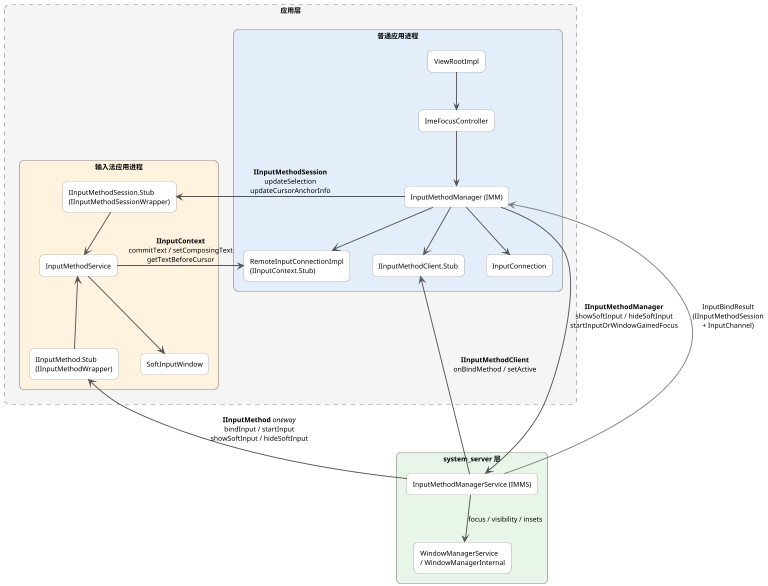
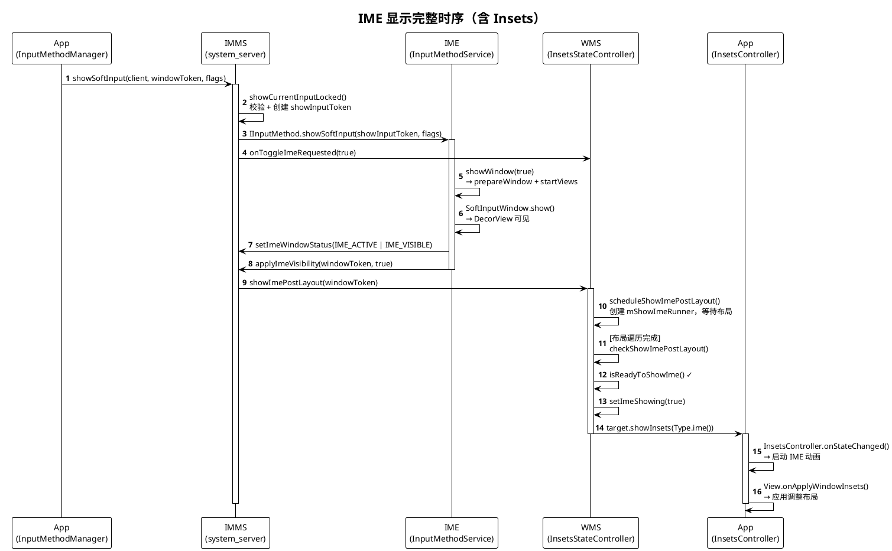

# InputMethodManagerService 技术文档大纲

## 架构概述与系统定位

IME（Input Method Editor，输入法编辑器）是 Android 中负责文本输入的独立应用，典型例子是系统键盘。它运行在自己的进程中，通过软键盘界面接收用户输入，再将文本提交给当前获得焦点的应用。

`InputMethodManagerService` (IMMS) 是运行在 `system_server` 中的系统输入法中枢。它本身不负责编辑文本，也不负责绘制键盘界面；它的主要职责是：

- 判定当前哪个窗口、哪个客户端可以拥有输入法焦点
- 在 App 进程与 IME 进程之间建立输入会话
- 管理 IME 的绑定、切换、显示/隐藏，以及相关权限校验
- 与 WindowManager 协同处理输入法窗口、Insets 和可见性

从代码实现看，输入法系统是一个典型的三端架构：

- **App 进程**（普通应用）负责产生 `InputConnection`，并通过 `InputMethodManager` 参与输入会话
- **`system_server`** 中的 IMMS 负责会话编排和 Binder 建链
- **IME 进程**（输入法应用）通过 `InputMethodService` 提供输入 UI，并通过远程接口回调 App 执行真实文本编辑

### 组件关系



这张图里最关键的两点是：

- `InputConnection` 不会直接跨进程传给 IME，而是由 App 侧包装成 `IInputContext.Stub`
- `IInputMethodSession` 主要承载会话状态同步，不是原始按键事件的主传输通道

### 核心进程与组件职责

#### App 进程

- `ViewRootImpl`
  是窗口级输入链路的起点，内部持有 `ImeFocusController`。
- `ImeFocusController`
  负责 IME 焦点状态、served view 切换，以及在窗口获得焦点时触发 `startInput` 流程。
- `InputMethodManager` (IMM)
  是 App 侧与 IMMS 交互的主入口。它负责：
  - 调用 `startInputOrWindowGainedFocus`
  - 调用 `showSoftInput` / `hideSoftInputFromWindow`
  - 包装并维护当前 `InputConnection`
  - 接收 IMMS 回调回来的 `InputBindResult`
- `InputConnection`
  是编辑控件暴露给 IME 的本地编辑接口，通常由 `View.onCreateInputConnection(EditorInfo)` 创建。标准文本控件常见实现是 `EditableInputConnection`。
- `RemoteInputConnectionImpl`
  是 App 侧对 `InputConnection` 的远程包装，继承自 `IInputContext.Stub`。IME 进程真正跨进程调用的是它，而不是 `InputConnection` 本体。

#### system_server

- `InputMethodManagerService`
  是全局调度器，负责：
  - 维护已注册 client、当前 IME 和当前会话状态
  - 校验调用方是否真的拥有 IME focus
  - 调用 IME 的 `bindInput`、`startInput`、`createSession`
  - 把 `IInputMethodSession` 和 `InputChannel` 通过 `InputBindResult` 回传给 App
- `WindowManagerInternal` / `WindowManagerService`
  负责窗口焦点、IME target、窗口层级、Insets 和显隐协同。IMMS 需要借助它来判断输入法是否应当附着到当前窗口。

#### IME 进程

- `InputMethodService`
  是 IME 的服务基类，负责输入法生命周期和输入视图管理。是否使用 `KeyboardView` 只是具体 IME 的实现选择，不是系统架构要求。
- `IInputMethod.Stub`
  是 IMMS 控制 IME 的总入口，用来执行 `bindInput`、`unbindInput`、`startInput`、`createSession`、`showSoftInput`、`hideSoftInput` 等操作。
- `IInputMethodSession.Stub`
  是与当前 client 关联的会话对象，用来接收选区变化、提取文本更新、`finishInput`、`invalidateInput` 等会话级通知。

### 核心跨进程接口与真实分工

#### `IInputMethodManager`

方向：App -> IMMS

这是 App 调用系统输入法服务的总入口，核心接口包括：

- `addClient`
- `startInputOrWindowGainedFocus`
- `showSoftInput`
- `hideSoftInput`

它解决的是“谁要开始输入、谁请求显示或隐藏 IME”的问题。

#### `IInputMethodClient`

方向：IMMS -> App

这是 IMMS 回调 App 的接口，实际由 `InputMethodManager` 内部的 `IInputMethodClient.Stub` 实现。典型回调包括：

- `onBindMethod`
- `onUnbindMethod`
- `setActive`

也就是说，IMMS 并不是直接回调某个编辑控件，而是先回调 App 侧的 IMM client binder。

#### `IInputMethod`

方向：IMMS -> IME

这是系统控制 IME 的主通道，负责 IME 生命周期和输入会话初始化，例如：

- `bindInput`
- `unbindInput`
- `startInput`
- `createSession`
- `showSoftInput`
- `hideSoftInput`

IMMS 通过它把当前输入目标对应的上下文和会话要求交给 IME。

#### `IInputMethodSession`

方向：App -> IME

这是当前输入会话的“安全接口”，但它的职责要和 `IInputContext` 分开理解：

- 它主要承载编辑状态同步，如 `updateSelection`、`updateExtractedText`、`viewClicked`、`updateCursorAnchorInfo`
- 它也承载 `finishInput`、`invalidateInput` 等会话通知
- 它不是 `InputConnection` 的替代品
- 它也不是 App 到 IME 的原始按键总线

当前实现里，原始 `KeyEvent` / `MotionEvent` 主要通过 `InputChannel` 从 App 侧送往 IME，再由 IME 侧的 `IInputMethodSessionWrapper` 转交给 `InputMethodSession.dispatchKeyEvent()` 等回调处理。

#### `IInputContext`

方向：IME -> App

这是 IME 操作编辑器的真实文本编辑通道。IME 调用这里的方法后，最终会落到 App 侧的 `InputConnection` 实现，例如：

- `commitText`
- `setComposingText`
- `deleteSurroundingText`
- `getTextBeforeCursor`
- `getSelectedText`

因此，真正的文本编辑链路是：

```text
IME -> IInputContext -> RemoteInputConnectionImpl -> InputConnection
```

而不是：

```text
IME -> IMMS -> App text edit
```

IMMS 负责建链和调度，不负责逐条转发文本编辑命令。

### 线程模型与一个常见误区

`InputConnection` 的方法最终会回到 App 进程内执行，但不应简单写成“总是在主线程执行”。

更准确的说法是：

- 系统优先使用 `InputConnection.getHandler()` 对应的 `Looper`
- 如果没有提供专用 `Handler`，再回退到默认线程模型
- 对标准文本控件来说，这通常表现为主线程

所以，架构层面应该理解为：

```text
IME 的编辑请求最终在 InputConnection 绑定的目标 Looper 上执行，常见情况下是 UI 线程，但并非强制只能是主线程。
```

### 系统定位总结

可以把 IMMS 的系统定位概括成一句话：

```text
IMMS 是 Android 输入法体系里的会话编排器和权限闸门，负责在 App、IME、WindowManager 之间建立正确的输入会话，但不直接承担文本编辑逻辑本身。
```

## 显隐控制与窗口层级流转

### IME 窗口的建立

在讨论显隐流程之前，需要理解 IME 窗口是如何建立的。IME 的窗口载体是 `SoftInputWindow`（继承自 `Dialog`），在 `InputMethodService.onCreate()` 中创建。

> `InputMethodService.onCreate()` 的调用时机：IMMS 选定当前 IME 后，通过 `InputMethodBindingController.bindCurrentMethod()` 调用 `Context.bindServiceAsUser()` 绑定 IME 服务。如果 IME 进程尚未启动，系统会先创建进程，然后回调 `InputMethodService.onCreate()`。典型触发场景包括系统启动后首次加载默认 IME、用户在设置中切换 IME、以及 IME 进程被杀后的重新绑定。

```java
// InputMethodService.java — onCreate
mWindow = new SoftInputWindow(this, mTheme, mDispatcherState);
final WindowManager.LayoutParams lp = window.getAttributes();
lp.setTitle("InputMethod");
lp.type = WindowManager.LayoutParams.TYPE_INPUT_METHOD;
lp.width = WindowManager.LayoutParams.MATCH_PARENT;
lp.height = WindowManager.LayoutParams.WRAP_CONTENT;
lp.gravity = Gravity.BOTTOM;
```

窗口类型为 `TYPE_INPUT_METHOD`，布局固定在屏幕底部。

IME 窗口需要一个由系统签发的 token 才能被 WMS 接受。token 的流转过程如下：

1. IMMS 绑定 IME 服务时，`InputMethodBindingController.addFreshWindowToken()` 创建 token 并注册到 WMS：
   ```java
   // InputMethodBindingController.java
   mCurToken = new Binder();
   mIWindowManager.addWindowToken(mCurToken, TYPE_INPUT_METHOD, displayIdToShowIme, null);
   ```

2. IMMS 通过 `IInputMethod.initializeInternal()` 将 token 传给 IME 进程

3. IME 侧 `InputMethodService` 收到 token 后调用 `SoftInputWindow.setToken(token)`，将 token 写入窗口属性，并以 `INVISIBLE` 状态执行 `show()`——此时窗口已添加到 WMS，但对用户不可见

`SoftInputWindow` 内部通过状态机管理窗口生命周期：`TOKEN_PENDING` → `TOKEN_SET` → `SHOWN_AT_LEAST_ONCE`（或 `REJECTED_AT_LEAST_ONCE`）→ `DESTROYED`。

### 显示链路（showSoftInput）

#### 调用链概览

`IInputMethod` 是 `oneway` AIDL 接口，所有调用都是异步的。IMMS 向 IME 发出 `showSoftInput` 后不会等待 IME 响应，而是立即记录状态并返回。IME 侧在异步处理时还可能拒绝显示。因此，"请求发出"不等于"IME 已显示"。

```
App: InputMethodManager.showSoftInput(view, flags)
  → [同步 Binder] IInputMethodManager.showSoftInput(client, windowToken, flags, ...)
    → IMMS: showCurrentInputLocked()
        ├─ [oneway Binder] IInputMethod.showSoftInput(showInputToken, flags, resultReceiver)
        ├─ onShowHideSoftInputRequested()  ← 异步调用发出后立即执行，不等待 IME 响应
        │    → WindowManagerInternal.onToggleImeRequested()
        └─ mInputShown = true              ← IMMS 乐观地标记为已显示

  ── 以下在 IME 进程异步执行 ──

  IME: InputMethodService.InputMethodImpl.showSoftInput(flags, resultReceiver)
    → dispatchOnShowInputRequested(flags, false)
        ├─ 返回 true  → showWindow(true) → SoftInputWindow.show()
        │                                → setImeWindowStatus(IME_ACTIVE | IME_VISIBLE)
        └─ 返回 false → 不调用 showWindow()，IME 拒绝显示
                        → setImeWindowStatus() 仍会被调用，但不含 IME_VISIBLE
    → ResultReceiver 回传实际结果（RESULT_SHOWN / RESULT_UNCHANGED_HIDDEN）
```

`dispatchOnShowInputRequested` 调用 `onShowInputRequested()`，后者在以下条件下会返回 `false` 拒绝显示：
- `onEvaluateInputViewShown()` 返回 `false`（如当前配置不适合显示）
- 请求是隐式的（非 `SHOW_EXPLICIT`）且 IME 处于全屏模式
- 有物理键盘且用户未配置"随物理键盘显示软键盘"

#### App 侧

`InputMethodManager.showSoftInput(View, int)` 是应用请求显示软键盘的标准入口。核心校验逻辑：

- 通过 `hasServedByInputMethodLocked(view)` 确认目标 View 所在窗口确实由当前 IMM 服务
- 向 `ImeInsetsSourceConsumer` 发送 `MSG_ON_SHOW_REQUESTED` 通知（用于 Insets 协同）
- 通过 Binder 调用 `mService.showSoftInput(mClient, view.getWindowToken(), flags, resultReceiver, reason)`

#### IMMS 侧

`showSoftInput` 是 `IInputMethodManager` 的 Binder 入口。校验通过后委托给 `showCurrentInputLocked`：

```java
// InputMethodManagerService.java
boolean showCurrentInputLocked(IBinder windowToken, int flags,
        ResultReceiver resultReceiver, @SoftInputShowHideReason int reason) {
    mShowRequested = true;
    if (mAccessibilityRequestingNoSoftKeyboard || mImeHiddenByDisplayPolicy) {
        return false;
    }

    // 根据 flags 设置显示模式
    if ((flags & InputMethodManager.SHOW_FORCED) != 0) {
        mShowExplicitlyRequested = true;
        mShowForced = true;
    } else if ((flags & InputMethodManager.SHOW_IMPLICIT) == 0) {
        mShowExplicitlyRequested = true;
    }

    if (!mSystemReady) return false;

    mBindingController.setCurrentMethodVisible();
    final IInputMethodInvoker curMethod = getCurMethodLocked();
    if (curMethod != null) {
        // 创建占位 token，防止 IME 向客户端 App 注入窗口
        Binder showInputToken = new Binder();
        mShowRequestWindowMap.put(showInputToken, windowToken);
        curMethod.showSoftInput(showInputToken, getImeShowFlagsLocked(), resultReceiver);
        onShowHideSoftInputRequested(true, windowToken, reason);
        mInputShown = true;
        return true;
    }
    return false;
}
```

关键的安全设计：IMMS 不会把真实的 `windowToken` 传给 IME，而是创建一个占位的 `showInputToken`，并在 `mShowRequestWindowMap` 中维护映射。这防止了 IME 进程利用 App 的 window token 进行窗口注入。

`onShowHideSoftInputRequested` 会调用 `mWindowManagerInternal.onToggleImeRequested()`，通知 WMS 更新 IME 控制状态和目标信息。

IMMS 用三个布尔字段追踪显示请求的语义：

| 字段 | 含义 |
|------|------|
| `mShowRequested` | 有客户端请求显示（不区分显式/隐式） |
| `mShowExplicitlyRequested` | 显示请求是显式的（非 `SHOW_IMPLICIT`） |
| `mShowForced` | 显示请求是强制的（`SHOW_FORCED`） |

这三个字段直接影响后续 `hideSoftInput` 时的 flag 判定逻辑（见隐藏链路）。

#### IME 侧

`IInputMethod.showSoftInput` 最终到达 `InputMethodService.InputMethodImpl.showSoftInput`：

```java
// InputMethodService.java — InputMethodImpl
public void showSoftInput(int flags, ResultReceiver resultReceiver) {
    // Android R+ 禁止 IME 自己调用 showSoftInput（应使用 requestShowSelf）
    if (getApplicationInfo().targetSdkVersion >= Build.VERSION_CODES.R
            && !mSystemCallingShowSoftInput) {
        return;
    }

    final boolean wasVisible = isInputViewShown();
    if (dispatchOnShowInputRequested(flags, false)) {
        showWindow(true);
    }
    setImeWindowStatus(mapToImeWindowStatus(), mBackDisposition);

    // 通过 ResultReceiver 回传结果
    resultReceiver.send(visibilityChanged
            ? InputMethodManager.RESULT_SHOWN
            : (wasVisible ? RESULT_UNCHANGED_SHOWN : RESULT_UNCHANGED_HIDDEN), null);
}
```

`showWindow(true)` 是实际显示窗口的核心方法：

1. `prepareWindow(showInput)` —— 标记 `mDecorViewVisible = true`，初始化视图层级，调用 `updateFullscreenMode()` 和 `updateInputViewShown()`
2. `startViews()` —— 调用 `onStartInputView()` / `onStartCandidatesView()` 等 IME 开发者的回调
3. `setImeWindowStatus()` —— 向 IMMS 上报 `IME_ACTIVE | IME_VISIBLE` 状态位
4. `mWindow.show()` —— `SoftInputWindow.show()` 调用 `Dialog.show()`，最终让 DecorView 可见
5. `applyVisibilityInInsetsConsumerIfNecessary(true)` —— 触发 Insets 系统的显示流程（详见后文）

#### 可见状态位

`InputMethodService` 通过 `setImeWindowStatus(vis, backDisposition)` 向 IMMS 上报可见状态。`vis` 是以下标志位的组合：

| 标志位 | 值 | 含义 |
|--------|-----|------|
| `IME_ACTIVE` | 0x1 | IME 已激活，准备好接受输入 |
| `IME_VISIBLE` | 0x2 | IME 窗口对用户可见 |
| `IME_INVISIBLE` | 0x4 | IME 已激活但窗口不可见（与 `IME_VISIBLE` 互斥） |

IMMS 收到后存入 `mImeWindowVis`，并通过 `updateSystemUiLocked()` 通知 SystemUI 更新状态栏。

### 隐藏链路（hideSoftInput）

#### 调用链概览

与显示链路相同，`IInputMethod.hideSoftInput` 也是 oneway 异步调用。IMMS 发出隐藏指令后立即重置本地状态，不等待 IME 实际完成隐藏。

```
App: InputMethodManager.hideSoftInputFromWindow(windowToken, flags)
  → [同步 Binder] IInputMethodManager.hideSoftInput(client, windowToken, flags, ...)
    → IMMS: hideCurrentInputLocked()
        ├─ [oneway Binder] IInputMethod.hideSoftInput(hideInputToken, 0, resultReceiver)
        ├─ onShowHideSoftInputRequested(false, ...)  ← 立即执行
        └─ 立即重置：mInputShown=false, mShowExplicitlyRequested=false, mShowForced=false

  ── 以下在 IME 进程异步执行 ──

  IME: InputMethodService.InputMethodImpl.hideSoftInput(flags, resultReceiver)
    → hideWindow()
        → setImeWindowStatus(0, backDisposition)   // 清除 IME_ACTIVE/IME_VISIBLE
        → applyVisibilityInInsetsConsumerIfNecessary(false)
        → DecorView 设为 GONE
    → ResultReceiver 回传实际结果（RESULT_HIDDEN / RESULT_UNCHANGED_HIDDEN）
```

#### IMMS 侧校验

`hideSoftInput` 和 `showSoftInput` 的 Binder 入口走不同的校验路径，但强度相当：

- `showSoftInput` 通过 `canInteractWithImeLocked(uid, client, "showSoftInput")` 校验，内部逻辑是：如果调用方不是 `mCurClient`，则查询 WMS 确认其是否持有 IME 焦点
- `hideSoftInput` 内联了相同模式的校验：检查调用方是否为 `mCurClient`，如果不是，通过 `isImeClientFocused(windowToken, cs)` 查询 WMS

两者的共同要求是：调用方必须是当前 IME client，或者其窗口持有 IME 焦点。

#### IMMS 核心隐藏逻辑

`hideCurrentInputLocked` 包含关键的 flag 判定：

```java
// InputMethodManagerService.java
boolean hideCurrentInputLocked(IBinder windowToken, int flags,
        ResultReceiver resultReceiver, @SoftInputShowHideReason int reason) {
    mShowRequested = false;

    // HIDE_IMPLICIT_ONLY：如果上次 show 是显式请求或强制的，则拒绝隐藏
    if ((flags & InputMethodManager.HIDE_IMPLICIT_ONLY) != 0
            && (mShowExplicitlyRequested || mShowForced)) {
        return false;
    }

    // HIDE_NOT_ALWAYS：如果上次 show 是 SHOW_FORCED，则拒绝隐藏
    if (mShowForced && (flags & InputMethodManager.HIDE_NOT_ALWAYS) != 0) {
        return false;
    }

    // 判断是否需要真正通知 IME 隐藏
    final boolean shouldHideSoftInput = (curMethod != null)
            && (mInputShown || (mImeWindowVis & InputMethodService.IME_ACTIVE) != 0);

    if (shouldHideSoftInput) {
        final Binder hideInputToken = new Binder();
        mHideRequestWindowMap.put(hideInputToken, windowToken);
        curMethod.hideSoftInput(hideInputToken, 0, resultReceiver);
        onShowHideSoftInputRequested(false, windowToken, reason);
    }

    // 无论是否真正发送了隐藏指令，都重置状态
    mBindingController.setCurrentMethodNotVisible();
    mInputShown = false;
    mShowExplicitlyRequested = false;
    mShowForced = false;
    return shouldHideSoftInput;
}
```

show 和 hide 的 flag 配合关系：

| show flags | 设置的状态 | 能被哪些 hide flags 取消 |
|------------|-----------|------------------------|
| `SHOW_IMPLICIT` | `mShowRequested = true` | 任何 hide 都可以 |
| 无 flag（显式） | `mShowExplicitlyRequested = true` | `HIDE_NOT_ALWAYS` 可以，`HIDE_IMPLICIT_ONLY` 不行 |
| `SHOW_FORCED` | `mShowForced = true` | 只有无 flag 的 hide 才能取消 |

#### IME 侧

`InputMethodImpl.hideSoftInput` 调用 `hideWindow()` 完成实际隐藏：

```java
// InputMethodService.java
public void hideWindow() {
    setImeWindowStatus(0, mBackDisposition);              // 上报 vis=0，清除 IME_ACTIVE/IME_VISIBLE
    applyVisibilityInInsetsConsumerIfNecessary(false);     // 通知 Insets 系统
    mWindowVisible = false;
    finishViews(false);                                   // 调用 onFinishInputView/onFinishCandidatesView
    if (mDecorViewVisible) {
        if (mInputView != null) {
            mInputView.dispatchWindowVisibilityChanged(View.GONE);
        }
        mDecorViewVisible = false;
        onWindowHidden();
    }
}
```

### 其他触发路径

除了 App 显式调用 show/hide，系统还有多条自动触发路径：

#### 窗口焦点切换时的 softInputMode 处理

当窗口获得焦点时，`startInputOrWindowGainedFocusInternalLocked` 根据窗口的 `softInputMode` 自动决定 IME 显隐。但每种模式都有前置条件，不是简单的"总是显示/隐藏"：

| softInputMode | 前置条件 | 行为 |
|----------------|---------|------|
| `STATE_UNSPECIFIED` | 非文本编辑窗口 | 自动隐藏（`HIDE_NOT_ALWAYS`） |
| `STATE_UNSPECIFIED` | 文本编辑窗口 + 前进导航 + `doAutoShow` | 可能自动显示 |
| `STATE_HIDDEN` | `IS_FORWARD_NAVIGATION` | 隐藏 |
| `STATE_ALWAYS_HIDDEN` | `!sameWindowFocused`（焦点来自不同窗口） | 隐藏；同一窗口重新获得焦点时不触发 |
| `STATE_VISIBLE` | `IS_FORWARD_NAVIGATION` 且 `isSoftInputModeStateVisibleAllowed()` 返回 `true` | 自动显示；如果焦点 View 的 `onCheckIsTextEditor()` 返回 `false`，则被拒绝并打印 error log |
| `STATE_ALWAYS_VISIBLE` | `!sameWindowFocused` 且 `isSoftInputModeStateVisibleAllowed()` 返回 `true` | 自动显示；同一窗口重新获得焦点时不触发；同样受 `onCheckIsTextEditor()` 约束 |

`isSoftInputModeStateVisibleAllowed()` 检查当前窗口是否有焦点 View 且该 View 声明自己是文本编辑器（`View.onCheckIsTextEditor() == true`）。这意味着即使窗口声明了 `STATE_VISIBLE` 或 `STATE_ALWAYS_VISIBLE`，如果焦点 View 不是文本编辑器，IME 也不会自动弹出。

此外，如果窗口设置了 `FLAG_ALT_FOCUSABLE_IM`，则会改变该窗口与 IME 的焦点交互行为。

#### IME 自行请求显隐

从 Android R 开始，IME 不应直接调用 `showSoftInput` / `hideSoftInput`，而是使用：

- `requestShowSelf(int flags)` → IMMS.`showMySoftInput(token, flags)`
- `requestHideSelf(int flags)` → IMMS.`hideMySoftInput(token, flags, reason)`

这两个方法使用的 window token 是 `mLastImeTargetWindow`（IMMS 记录的最后一个 IME 目标窗口），而非 App 传入的 token。

#### 客户端解绑 / IME 切换

当 IME client 被移除或 IME 切换时，IMMS 会调用 `hideCurrentInputLocked` 确保键盘收起。

### 与 WMS 的协同：Insets 机制

IME 的显隐最终需要通过 WindowManager 的 Insets 系统来驱动应用布局调整和动画。这个过程涉及 Server 侧（WMS）和 Client 侧（App）两端。

#### Server 侧：ImeInsetsSourceProvider

`ImeInsetsSourceProvider` 继承自 `WindowContainerInsetsSourceProvider`，是 WMS 中专门管理 IME Insets 源的控制器。

**显示时的延迟机制**

IME 显示不是立即生效的，而是延迟到布局完成后执行。当 `InputMethodService.showWindow()` 调用 `applyVisibilityInInsetsConsumerIfNecessary(true)` 后，最终到达 IMMS 的 `applyImeVisibility(token, windowToken, true)`：

```java
// InputMethodManagerService.java — applyImeVisibility
if (setVisible) {
    mWindowManagerInternal.showImePostLayout(mShowRequestWindowMap.get(windowToken));
}
```

`showImePostLayout` 调用 `ImeInsetsSourceProvider.scheduleShowImePostLayout()`，核心逻辑：

```java
// ImeInsetsSourceProvider.java
void scheduleShowImePostLayout(InsetsControlTarget imeTarget) {
    mImeRequester = imeTarget;
    mShowImeRunner = () -> {
        if (isReadyToShowIme()) {
            final InsetsControlTarget target =
                    mDisplayContent.getImeTarget(IME_TARGET_CONTROL);
            setImeShowing(true);
            target.showInsets(WindowInsets.Type.ime(), true /* fromIme */);
        }
        abortShowImePostLayout();
    };
    mDisplayContent.mWmService.requestTraversal();  // 触发一次布局遍历
}
```

这里创建了一个 `mShowImeRunner`，但并不立即执行。它等待下一次布局遍历完成后，由 `checkShowImePostLayout()` 检查 IME 窗口是否已经绘制完成（`isDrawn() && !mGivenInsetsPending`），条件满足时才执行 runner。

**就绪检查（isReadyToShowIme）**

在执行 `mShowImeRunner` 之前，`isReadyToShowIme()` 会验证请求者是否仍然合法：

```java
return isImeLayeringTarget(mImeRequester, dcTarget)     // 请求者就是 IME 分层目标
    || isAboveImeLayeringTarget(mImeRequester, dcTarget) // 请求者是分层目标的子窗口且在其上层
    || isImeFallbackTarget(mImeRequester)                // 请求者是 fallback 目标
    || isImeInputTarget(mImeRequester)                   // 请求者是 IME 输入目标
    || sameAsImeControlTarget();                         // 请求者与控制目标一致
```

这些检查确保在窗口焦点快速切换、Activity 转场等复杂场景下，IME 不会错误地显示在非目标窗口上。

**隐藏路径**

IME 隐藏时，`applyImeVisibility(token, windowToken, false)` 走另一条分支：

```java
// InputMethodManagerService.java — applyImeVisibility
if (!setVisible) {
    mWindowManagerInternal.hideIme(
            mHideRequestWindowMap.get(windowToken), mCurClient.selfReportedDisplayId);
}
```

`hideIme` 直接操作 `ImeInsetsSourceProvider` 清除可见状态，不需要延迟到 post-layout。

#### IME 目标的双重机制

WMS 中 `DisplayContent` 维护两种 IME 目标，它们的作用不同：

| 目标类型 | 字段 | 决定什么 |
|---------|------|---------|
| `IME_TARGET_LAYERING` | `mImeLayeringTarget` | IME Surface 放在哪个窗口之上（z-order） |
| `IME_TARGET_CONTROL` | `mImeControlTarget` | 哪个窗口持有 IME Insets 的控制权柄（animation leash） |

两者通常相同，但在窗口嵌套（如 Dialog 叠在 Activity 上）和 Activity 转场期间可能不一致。

`computeImeControlTarget()` 的决定逻辑：

```java
// DisplayContent.java
InsetsControlTarget computeImeControlTarget() {
    if (mImeInputTarget == null) return null;

    final WindowState imeInputTarget = mImeInputTarget.getWindowState();
    if (!isImeControlledByApp() && mRemoteInsetsControlTarget != null
            || getImeHostOrFallback(imeInputTarget) == mRemoteInsetsControlTarget) {
        return mRemoteInsetsControlTarget;  // 系统/远程控制
    }
    return imeInputTarget;                  // App 控制
}
```

#### Client 侧：InsetsController 与动画

当 Server 侧 `target.showInsets(Type.ime(), true)` 被调用后，App 侧的 `InsetsController` 接收到新的 `InsetsState`：

1. `ViewRootImpl.insetsChanged(insetsState)` → `InsetsController.onStateChanged(insetsState)`
2. `InsetsController` 更新内部状态，找到对应的 `ImeInsetsSourceConsumer`
3. 如果可见性发生变化，启动 Insets 动画（通过 SurfaceControl leash）
4. 动画过程中持续回调 `WindowInsetsAnimation.Callback.onProgress()`
5. 动画结束后，最终的 Insets 值通过 `View.onApplyWindowInsets(WindowInsets)` 传递给应用

应用通过 `WindowInsets.getInsets(WindowInsets.Type.ime())` 获取 IME 占据的区域大小（通常体现为 `bottom` 值等于键盘高度），据此调整布局。

#### 整体协同时序



## 数据通信通道 (InputConnection)
- `InputConnection` 接口定义与职责。
- 文本编辑操作的跨进程传递（App 接收 IME 的按键、提交文本、删除指令）。
- `IInputMethodSession` 与 `IInputContext` 在跨进程文本传输中的隔离与安全机制。

## 进阶：多屏与座舱场景输入法管理
- 多屏幕输入法支持（Per-Display IME）的焦点隔离机制。
- 焦点抢占与物理按键拦截（在车机等异构输入环境下的处理逻辑）。
- Multi-Client IME 架构解析（允许多个应用同时拥有输入法连接的定制化方案）。

## 调试、排错与日志分析
- 命令行工具：`dumpsys input_method` 输出状态字段详解（重点查看 `mCurMethodId`, `mCurFocusedWindow`, `mImeWindowVis`）。
- `ime` 命令行工具的使用（切换、启用、禁用输入法）。
- 典型缺陷排查：
  - 软键盘弹不出（焦点丢失、Window Flags 异常）。
  - 键盘收不起（Token 校验失败、Insets 状态机混乱）。
  - 输入法卡死与 ANR 分析。
