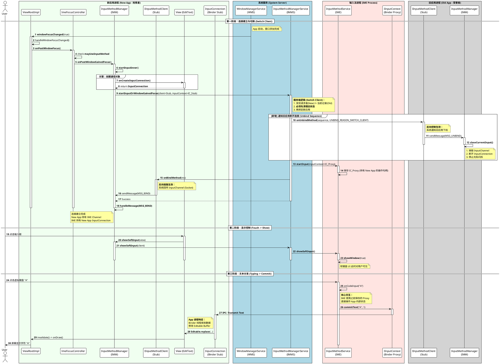
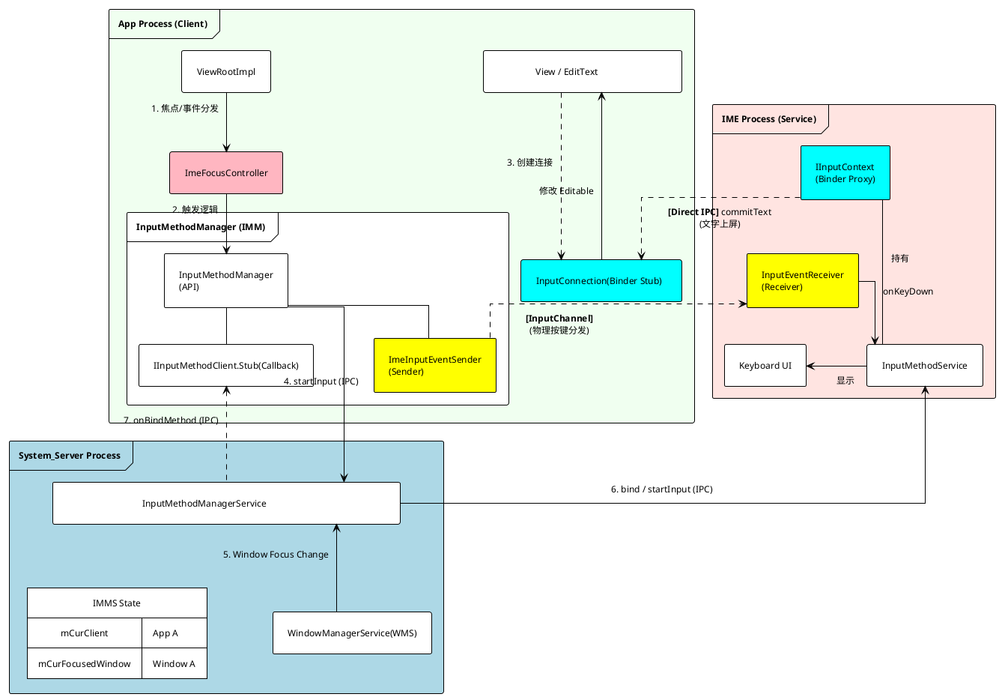

+++
date = '2025-09-29T10:22:54+08:00'
draft = false
title = ' Android InputMethod 交互流程技术说明文档'
+++

### 1. 流程详细解析

本节对应时序图中的三个核心阶段，描述代码层面的执行逻辑。

#### 第一阶段：连接建立与切换 (Connection Establishment & Switching)

此阶段描述应用获焦后，如何通过系统服务（IMMS）建立与输入法（IME）的通信链路，以及旧应用如何被断开。

1. **窗口获焦通知 (Steps 1-3)**
* **触发**：WMS 通过 Binder 调用应用进程的 `IWindow.windowFocusChanged`。
* **应用侧响应**：`ViewRootImpl.W` 接收调用，通过 `ViewRootHandler` 发送消息，最终执行 `ViewRootImpl.handleWindowFocusChanged()`。
* **控制权转移**：`ViewRootImpl` 调用 `mImeFocusController.onPostWindowFocus()`。

2. **连接发起 (Steps 4-6)**
* **逻辑判定**：`ImeFocusController` 检查 `windowAttribute.flags` (是否包含 `FLAG_NOT_FOCUSABLE`) 以确定 `mHasImeFocus`。
* **委托调用**：若满足条件，调用 `InputMethodManager.DelegateImpl.onPostWindowGainedFocus()`。
* **内部启动**：`InputMethodManager` (IMM) 执行 `startInputInner` (Line 2073)，这是建立连接的核心入口。

3. **创建通信对象 (Steps 7-9)**
* **IMM** 调用 `View.onCreateInputConnection` (Line 3072)。
* **EditText** 返回一个 `InputConnection` 实例（通常是 `EditableInputConnection`），它封装了对 `Editable` 缓冲区的修改操作。

4. **IPC 请求与服务端仲裁 (Step 10)**
* **IMM** 调用 `startInputOrWindowGainedFocus` (Line 2235) 向 `InputMethodManagerService` (IMMS) 发起 Binder IPC 请求。
* 请求参数包含：`mClient` (应用进程的 `IInputMethodClient.Stub`) 和 `inputContext` (`InputConnection` 的 Binder 存根)。

5. **旧应用断开连接 (Steps 11-16, Unbind Sequence)**
* **服务端逻辑**：IMMS 检测到 Client 变更，向旧应用发起 `onUnbindMethod` 调用。
* **旧应用响应**：
* 旧应用的 `IInputMethodClient.Stub` (Line 1326) 接收调用，发送 `MSG_UNBIND` 到主线程。
* **资源销毁**：主线程处理 `MSG_UNBIND` (Line 1129)，调用 **`clearBindingLocked()`** (Line 1557)。
* **物理断开**：`clearBindingLocked` 调用 `updateInputChannelLocked(null)`，进而调用 **`mCurChannel.dispose()`** 和 **`mCurSender.dispose()`**，彻底关闭 Socket 通道。同时置空 `mCurMethod` (Binder 代理)。

6. **新应用绑定 (Steps 17-20)**
* **IMMS** 将新应用的 `inputContext` 传递给 **IME** (`startInput`)。
* **IMMS** 调用新应用的 `onBindMethod` (Line 1303)，回传 `InputBindResult`（包含 `InputChannel`）。
* **新应用响应**：IMM 处理 `MSG_BIND` (Line 1073)，调用 `updateInputChannelLocked` (Line 1582) 保存 `mCurChannel` 并实例化 `mCurSender` (`ImeInputEventSender`)。

#### 第二阶段：显示控制 (Visibility Control)

此阶段描述用户点击输入框唤起软键盘的过程。

1. **触发显示 (Step 21-23)**
* 用户点击 `EditText`，触发点击事件处理。
* `EditText` 调用 `IMM.showSoftInput` (Line 1640)。
* **状态检查**：IMM 检查 `hasServedByInputMethodLocked(view)` 确保当前 View 是连接的持有者。

2. **IPC 请求 (Steps 24-25)**
* IMM 调用 `IInputMethodManagerGlobalInvoker.showSoftInput`。
* IMMS 接收请求后，通知 IME 进程显示窗口 (`showWindow`)。

#### 第三阶段：文本分发 (Text Delivery)

此阶段描述用户输入字符如何从 IME 传输到应用，展示了 Binder 直连机制。

1. **IME 内部处理 (Step 26)**
* IME 进程接收屏幕触摸事件，内部逻辑判定为字符输入（如 "A"）。

2. **跨进程数据传输 (Step 27-28)**
* **关键路径**：IME 获取在第一阶段 `startInput` 中保存的 `IInputContext` (即 App 端 `InputConnection` 的 Binder 代理)。
* IME 直接调用 `commitText("A", 1)`。此调用通过 Binder 驱动直接到达 App 进程，**不经过 System Server**。

3. **应用端上屏 (Step 29-32)**
* App 进程的 Binder 线程池收到 `IInputContext` 调用。
* `InputConnection` 执行 `Editable.replace()` 修改内存中的文本数据。
* `View` 触发 `invalidate()`，重绘 UI，字符 "A" 显示在屏幕上。

---

### 2. `windowFocusChanged` 的调用时机

基于 `ViewRootImpl.java` 和 `ImeFocusController.java` 的逻辑，应用进程感知窗口焦点变化主要有以下两种路径：

1. **WMS 主动通知 (Binder Callback)**
* **时机**：当 Activity 启动、Resume、Pause、被 Dialog 覆盖、或者在多窗口模式下用户点击其他窗口导致 Z-Order 变化时。
* **路径**：SystemServer -> Binder -> `ViewRootImpl.W.windowFocusChanged` -> `MSG_WINDOW_FOCUS_CHANGED` -> `handleWindowFocusChanged`。
* **作用**：这是最主要的焦点更新机制，决定了应用是否处于 "Active" 状态。

2. **输入事件分发前的延迟同步 (Lazy Synchronization)**
* **时机**：当 `ViewRootImpl` 接收到底层 InputDispatcher 分发的输入事件（Key 或 Touch），准备进入 `InputStage` 流水线之前。
* **路径**：`ViewRootImpl.deliverInputEvent` -> `handleWindowFocusChanged`。
* **作用**：作为防御性机制。如果在处理输入事件的瞬间，WMS 的焦点变更通过 Binder 刚刚到达但尚未处理，该机制强制先处理焦点变更，确保事件分发时 `ImeFocusController` 的状态（如 `mHasImeFocus`）是最新的。

---

### 3. InputChannel 的技术作用

在 `InputMethodManager` (IMM) 的设计中，`InputChannel` 是独立于 `InputConnection` (Binder) 之外的第二条通信链路。

基于源码 `InputMethodManager.java` (Line 1582 `updateInputChannelLocked` 和 Line 2375 `ImeInputEventSender`)，其作用如下：

1. **物理载体**：
它持有一个 Linux Socket 文件描述符 (File Descriptor)，构成了 App 进程与 IME 进程之间的高速、全双工数据通道。
2. **发送端角色 (App -> IME)**：
* IMM 内部维护了 `mCurSender` (类型为 `ImeInputEventSender`)。
* **作用**：当应用接收到 **Key Events (物理按键)** 或部分 **Touch Events** 时，如果需要分发给 IME 处理（例如物理键盘按 "A" 需要 IME 转为 "阿"），App 会调用 `sendInputEventOnMainLooperLocked` (Line 1930) 将事件写入此 Channel。

3. **区别于 Binder**：
* `InputConnection` (Binder) 用于 **高层语义交互**（如 `commitText`, `deleteSurroundingText`）。
* `InputChannel` (Socket) 用于 **底层原始事件传输**（如 `KeyEvent`, `MotionEvent`）。它支持异步处理和时序控制，适合高频、低延迟的输入流。

**总结**：`InputChannel` 是 App 主动向 IME 推送原始输入事件的专用管道，确保了物理键盘和非文本编辑操作能被输入法正确拦截和处理。

## 架构一览

这张图将更清晰地展现 App、System Server 和 IME 三大进程中对象的直接交互关系。

### InputMethod 逻辑架构图

### 架构图核心逻辑说明

这张图凸显了三个关键的“逻辑通道”：

#### 1. 控制通道 (Control Channel)

* **路径**：`App` <-> `IMMS` <-> `IME`
* **核心类**：`InputMethodManager`, `InputMethodManagerService`, `InputMethodService`。
* **作用**：这是唯一的“官方沟通渠道”。
* App 告诉 IMMS：“我获焦了，我要连输入法”。
* IMMS 告诉 IME：“有新客户了，这是他的地址（Binder句柄），请准备服务”。
* IMMS 告诉 App：“连接好了，这是你的专用通道（InputChannel），拿好”。

#### 2. 文本通道 (Text Channel)

* **路径**：`IME (IInputContext Proxy)` -> `App (InputConnection Stub)`
* **核心类**：`IInputContext`, `InputConnection`。
* **作用**：**这是输入法最高频使用的数据通道。**
* 当用户在软键盘打字时，IME 直接通过这个通道“遥控”App 中的 `EditText`。
* **注意**：虽然物理上经过 Binder 驱动，但在逻辑架构上，它是 **绕过 System Server** 直接连接两个应用的。

#### 3. 事件通道 (Event Channel)

* **路径**：`App (Sender)` -> `IME (Receiver)`
* **核心类**：`ImeInputEventSender`, `InputEventReceiver`。
* **作用**：**这是 App 反向推数据给 IME 的通道。**
* 当 App 收到物理按键（如回车、蓝牙键盘按键）时，它通过这个通道把“生肉”（Raw Event）扔给 IME 处理。
* 这个通道基于 Socket，也是点对点直连，**不经过 System Server**。