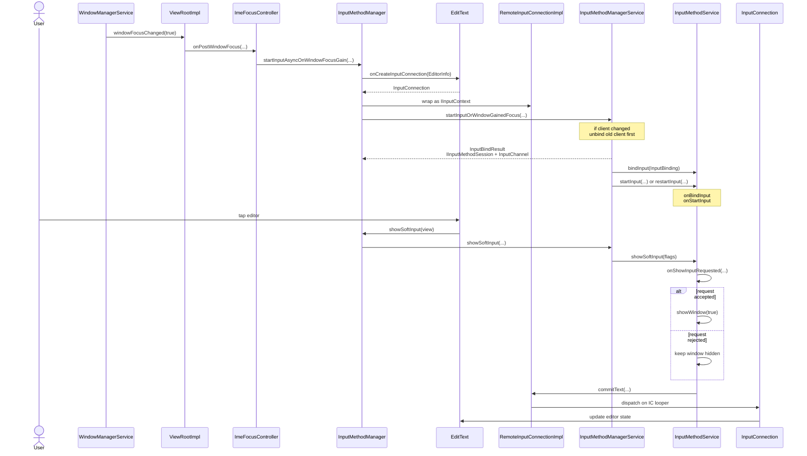
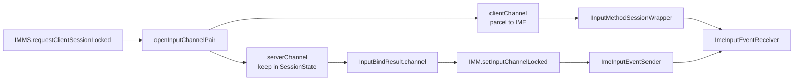

+++
date = '2025-09-29T10:22:54+08:00'
draft = false
title = 'Android InputMethodService 交互流程技术说明文档'
+++

本文以当前代码树中的 `ViewRootImpl`、`ImeFocusController`、`InputMethodManager`、`InputMethodManagerService`、`InputMethodService` 实现为准。重点说明 3 条链路：

- 控制链路：App -> IMMS -> IME
- 文本链路：IME -> `IInputContext` -> App `InputConnection`
- 事件链路：App -> `InputChannel` -> IME `InputMethodSession`

### 1. 流程详细解析

```mermaid
sequenceDiagram
    actor User
    participant WMS as WindowManagerService
    participant VRI as ViewRootImpl
    participant IFC as ImeFocusController
    participant IMM as InputMethodManager
    participant View as EditText
    participant RIC as RemoteInputConnectionImpl
    participant IMMS as InputMethodManagerService
    participant IMS as InputMethodService
    participant IC as InputConnection

    WMS->>VRI: windowFocusChanged(true)
    VRI->>IFC: onPostWindowFocus(...)
    IFC->>IMM: startInputAsyncOnWindowFocusGain(...)
    IMM->>View: onCreateInputConnection(EditorInfo)
    View-->>IMM: InputConnection
    IMM->>RIC: wrap as IInputContext
    IMM->>IMMS: startInputOrWindowGainedFocus(...)
    Note over IMMS: if client changed<br>unbind old client first
    IMMS-->>IMM: InputBindResult<br>IInputMethodSession + InputChannel
    IMMS->>IMS: bindInput(InputBinding)
    IMMS->>IMS: startInput(...) or restartInput(...)
    Note over IMS: onBindInput<br>onStartInput

    User->>View: tap editor
    View->>IMM: showSoftInput(view)
    IMM->>IMMS: showSoftInput(...)
    IMMS->>IMS: showSoftInput(flags)
    IMS->>IMS: onShowInputRequested(...)
    alt request accepted
        IMS->>IMS: showWindow(true)
    else request rejected
        IMS->>IMS: keep window hidden
    end

    IMS->>RIC: commitText(...)
    RIC->>IC: dispatch on IC looper
    IC->>View: update editor state
```

#### 1.1 连接建立与切换

1. `WindowManagerService` 把窗口焦点变化通知给 App 进程的 `ViewRootImpl`。
2. `ViewRootImpl` 把 IME 焦点相关逻辑交给 `ImeFocusController`。
3. `ImeFocusController` 先判断当前窗口是否 `mayUseInputMethod(...)`，再通过 `onViewFocusChanged()` 和 `checkFocus()` 确认新的 `served view`。
4. `InputMethodManager.startInputInner()` 调用 `View.onCreateInputConnection(EditorInfo)` 创建真实的 `InputConnection`。
5. App 并不是把 `InputConnection` 自身直接跨进程传给 IME，而是把它包装成 `RemoteInputConnectionImpl`，由后者实现 `IInputContext.Stub`，再交给 `InputMethodManagerService`。
6. `InputMethodManagerService` 如果发现客户端切换，会先向旧客户端发送 `onUnbindMethod()`。旧客户端收到 `MSG_UNBIND` 后走的是 `clearBindingLocked()` 清理绑定状态，而不是 `closeCurrentInput()`。
7. `InputMethodManagerService` 给新客户端返回 `InputBindResult`。这个结果里同时包含：
   - `IInputMethodSession`
   - `InputChannel`
8. IME 侧真正进入 `InputMethodService` 生命周期时，顺序是：
   - `bindInput()`
   - `onBindInput()`
   - `startInput()` 或 `restartInput()`
   - `doStartInput()`
   - `onStartInput()`

#### 1.2 显示控制

1. App 侧调用 `InputMethodManager.showSoftInput(view)` 时，前提是这个 `view` 已经是当前 `served view`。如果不是，IMM 会直接忽略这次请求。
2. `InputMethodManagerService` 收到显示请求后，会转发给当前 IME 的 `showSoftInput()`。
3. IME 侧并不是“收到请求就一定显示”。`InputMethodService.InputMethodImpl.showSoftInput()` 会先执行 `dispatchOnShowInputRequested()`。
4. 只有 `dispatchOnShowInputRequested()` 返回 `true`，IME 才会继续 `showWindow(true)`。
5. `onShowInputRequested()` 可能因为全屏模式、硬键盘策略等条件拒绝隐式显示，所以“App 发起 show 请求”和“IME 窗口已经可见”不是同一个语义。

#### 1.3 文本提交

1. 用户在软键盘上输入字符后，IME 通过 `IInputContext` 调用 App 侧的编辑接口，例如 `commitText()`。
2. 这条文本链路在逻辑上绕过 `system_server`，不经过 `InputMethodManagerService` 的热路径。
3. App 侧真正接收 Binder 调用的是 `RemoteInputConnectionImpl`。
4. `RemoteInputConnectionImpl` 不会直接在 Binder 线程里修改文本，而是优先切到 `InputConnection.getHandler().getLooper()`；如果取不到，再回退到 View 所在线程的 Looper。
5. 真实的文本修改由 `InputConnection` 实现完成，例如 `EditableInputConnection` 或 `BaseInputConnection` 的子类，随后再触发视图刷新。

### 2. `windowFocusChanged` 的调用时机

基于当前代码实现，App 侧至少有 3 条会影响 IME 焦点同步的路径。

1. `WMS` 主动回调
   - 路径：`ViewRootImpl.W.windowFocusChanged()` -> `MSG_WINDOW_FOCUS_CHANGED` -> `handleWindowFocusChanged()`
   - 这是最标准的窗口焦点通知路径。

2. Traversal 阶段补偿
   - 路径：`ViewRootImpl.performTraversals()` -> `ImeFocusController.onTraversal(...)`
   - 作用：在布局和窗口属性变化过程中，如果 `mayUseInputMethod(...)` 的结果发生变化，当前实现会直接补做 IME 焦点同步，而不完全依赖外部回调。

3. 输入事件分发前的同步
   - 路径：`ViewRootImpl.deliverInputEvent()` -> `handleWindowFocusChanged()` -> `InputStage.deliver(...)`
   - 作用：当前代码在真正把事件送入 InputStage 之前，又做了一次窗口焦点同步，避免事件到达时 IME 焦点状态仍然滞后。

### 3. `InputChannel` 的技术作用

`InputChannel` 不是文本编辑通道，它负责的是原始输入事件通道。

```mermaid
flowchart LR
    A[IMMS.requestClientSessionLocked] --> B[openInputChannelPair]
    B --> C[clientChannel<br>parcel to IME]
    B --> D[serverChannel<br>keep in SessionState]
    C --> E[IInputMethodSessionWrapper]
    E --> F[ImeInputEventReceiver]
    D --> G[InputBindResult.channel]
    G --> H[IMM.setInputChannelLocked]
    H --> I[ImeInputEventSender]
    I --> F
```

#### 3.1 建立方式

1. `InputMethodManagerService.requestClientSessionLocked()` 创建一对 `InputChannel`。
2. `clientChannel` 传给 IME 侧 `createSession(...)`。
3. IME 侧 `IInputMethodSessionWrapper` 用这个 channel 创建 `ImeInputEventReceiver`。
4. `serverChannel` 记录在 `SessionState` 中，最终经 `InputBindResult.channel` 回到 App 侧 `InputMethodManager`。
5. App 侧 `InputMethodManager` 保存它，并在需要时创建 `ImeInputEventSender`。

#### 3.2 承载内容

1. App -> IME
   - 通过 `InputMethodManager.dispatchInputEvent(...)` 和 `ImeInputEventSender`
   - 承载原始 `KeyEvent`、`MotionEvent` 等输入事件
2. IME 侧接收
   - `ImeInputEventReceiver.onInputEvent(...)`
   - 再分发到 `InputMethodSession.dispatchKeyEvent()`、`dispatchGenericMotionEvent()` 等

#### 3.3 与 `IInputMethodSession` 的边界

1. `InputChannel` 负责“原始事件”。
2. `IInputMethodSession` 负责“会话回调”。
3. `IInputMethodSession` 里的典型方法包括：
   - `updateSelection()`
   - `updateExtractedText()`
   - `finishInput()`
   - `invalidateInput()`
4. 因此不能把 `IInputMethodSession` 和 `InputChannel` 混成同一条链路。

### 4. 架构一览

#### 4.1 三条核心通道

1. 控制通道
   - 路径：App `InputMethodManager` <-> `InputMethodManagerService` <-> IME `InputMethodService`
   - 作用：建立连接、切换客户端、控制显示隐藏、同步窗口和会话状态

2. 文本通道
   - 路径：IME `RemoteInputConnection` -> App `RemoteInputConnectionImpl` -> `InputConnection`
   - 作用：提交文本、删除文本、查询上下文、更新编辑状态

3. 事件通道
   - 路径：App `ImeInputEventSender` -> `InputChannel` -> IME `ImeInputEventReceiver`
   - 作用：把原始按键和运动事件交给 IME 处理

#### 4.2 `InputMethodService` 视角的生命周期

1. 绑定阶段
   - `attachToken()`
   - `bindInput()`
   - `onBindInput()`

2. 编辑阶段
   - `startInput()` 或 `restartInput()`
   - `doStartInput()`
   - `onStartInput()`

3. 视图阶段
   - 当 IME 窗口需要显示且输入视图应当显示时，才会进入 `onStartInputView()`
   - `onStartInput()` 与 `onStartInputView()` 不是同一层生命周期，前者面向编辑会话，后者面向 UI 视图

4. 结束阶段
   - `hideWindow()` 负责结束输入视图或候选视图的显示
   - `doFinishInput()` 负责结束当前编辑会话，并回调 `onFinishInput()`
   - `unbindInput()` 最后回调 `onUnbindInput()`

### 5. 结论

对当前实现来说，最容易混淆的点有 4 个：

1. `InputConnection` 不等于跨进程 Binder Stub，真正跨进程的是 `RemoteInputConnectionImpl`
2. `InputChannel` 不负责 `commitText()`，它负责原始输入事件
3. `IInputMethodSession` 不等于 `InputChannel`，它更接近“会话控制回调”
4. `showSoftInput()` 不是“必然显示”，IME 仍然可以在 `onShowInputRequested()` 阶段拒绝显示
