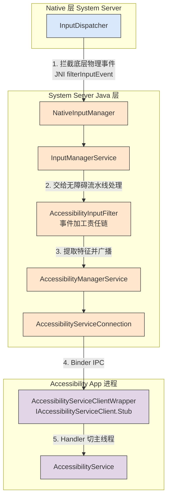
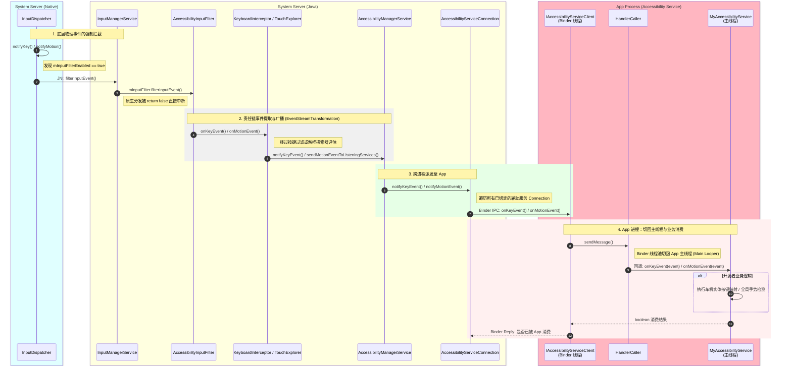
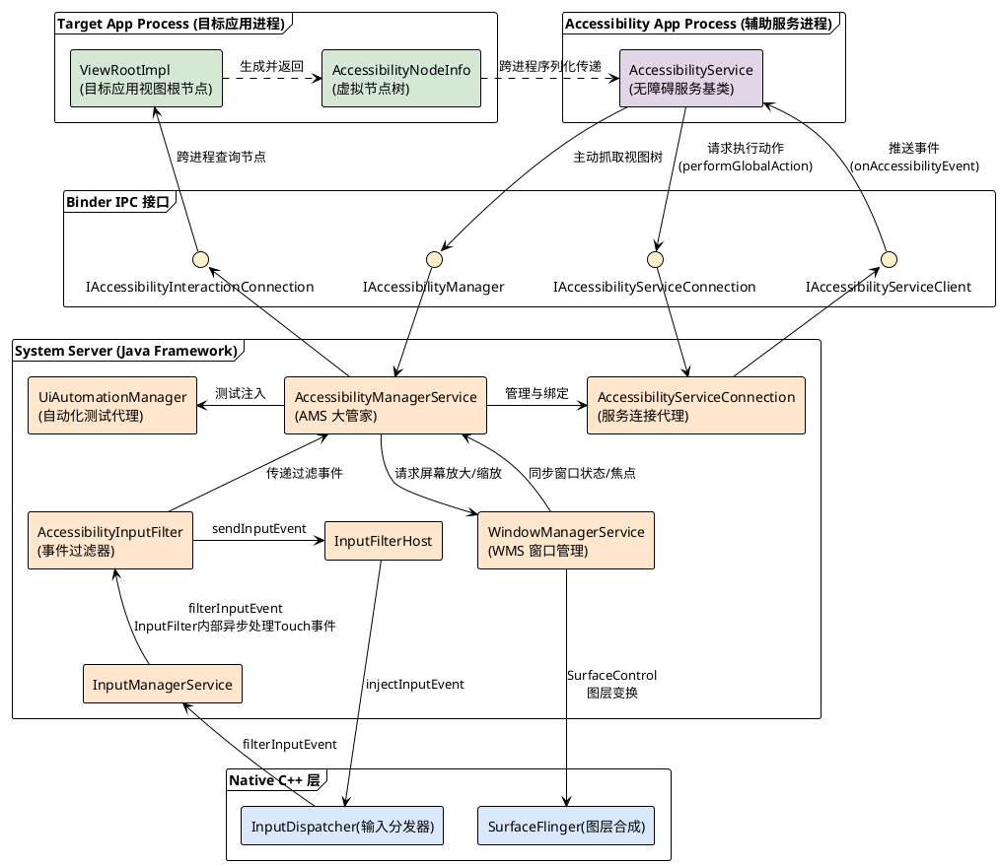
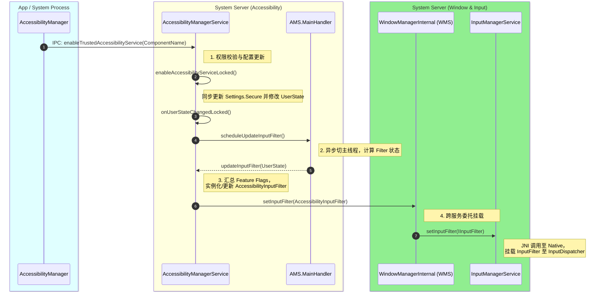
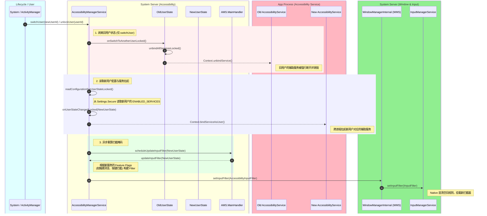

+++
date = '2025-05-15T10:00:00+08:00'
draft = false
title = 'Android AccessibilityService 架构与原理深度剖析'
+++

# Android AccessibilityService 架构与原理深度剖析

`AccessibilityService`（无障碍服务）是 Android 系统中权限最高、能力最强的系统级后门之一。它原本是为视障、听障或肢体障碍用户设计的辅助功能框架（例如 TalkBack），但在实际的系统级开发（尤其是智能座舱 AAOS、自动化测试、按键精灵类 App）中，它常被用来实现全局手势监听、实体按键重映射以及“可见即可说”等高频商业功能。

本文将深入 Android Framework 底层，解析 `AccessibilityService` 的架构拓扑，并重点推演它截获全局 `onMotionEvent` 与 `onKeyEvent` 的完整调用时序。

## 1. 系统级架构拓扑 (Architecture)

无障碍服务的核心架构横跨了 **App 进程**、**System Server (Java 层)** 以及 **InputFlinger (Native C++ 层)**。

### 核心组件职责：
1. **`AccessibilityManagerService` (AMS)：** 系统中所有无障碍服务的中央大管家。它负责解析应用的 `AndroidManifest.xml` 中声明的 `<accessibility-flags>`，并在条件满足时，强行切断底层 `InputDispatcher` 的原生分发流，挂载全局的 `InputFilter`。
2. **`AccessibilityInputFilter`：** 挂载在系统底层的事件加工流水线（`EventStreamTransformation`）。它负责实时监听和过滤用户的屏幕触摸轨迹与物理按键。
3. **`AccessibilityServiceConnection`：** System Server 中用于维护与具体第三方 App (无障碍服务) Binder 连接的代理对象。
4. **`IAccessibilityServiceClient`：** 跨进程通信的 Binder 接口，供 System Server 将事件推送到 App 进程。

---

## 2. 关键时序：全局按键与触摸事件的监听闭环

许多车机应用会在继承 `AccessibilityService` 的类中重写 `onKeyEvent`，或是通过配置 `FLAG_REQUEST_TOUCH_EXPLORATION_MODE` 来重写 `onMotionEvent`（或 `onGesture`）。

下面这幅时序图，精准还原了当用户按下音量键或在屏幕上滑动时，事件是如何穿透重重系统屏障，最终回调到你的 App 中的：

### 源码级深度剖析

#### 1. 为什么你的 App 能收到事件？
并不是所有的 `AccessibilityService` 都能收到底层的键盘或滑动事件。在 `AccessibilityManagerService.java` 的派发逻辑中（即图中的第 2 步到第 3 步）：
*   **按键事件 (`onKeyEvent`)：** 只有当你的服务在 `accessibility-service` 配置文件中声明了 `android:canRequestFilterKeyEvents="true"`，并且激活了 `FLAG_REQUEST_FILTER_KEY_EVENTS` 标志位时，`KeyboardInterceptor` 才会将按键跨进程发给你。
*   **触摸事件 (`onMotionEvent`)：** 对于触摸事件，原生的 `AccessibilityService` 并没有直接暴露出公共的 `onMotionEvent` 回调给开发者（官方更希望你通过 `AccessibilityNodeInfo` 节点操作）。但系统内部的服务（或者通过特殊反射/定制源码的服务）是通过 `TouchExplorer` 责任链节点，调用 `sendMotionEventToListeningServices`，经由 `IAccessibilityServiceClient` 接口的 `onMotionEvent` 方法接收原始物理坐标的。

#### 2. App 的布尔返回值去哪了？(同步阻塞与超时)
注意到时序图的最后一步，当你的 App 在 `onKeyEvent` 中 `return true;` 时，这个布尔值是通过 Binder 同步返回给 System Server 的 `AccessibilityServiceConnection` 的。

如果你的 App 返回了 `true`，系统就会认为这个按键动作**已经被你的无障碍服务接管（消费）了**，底层的 `KeyboardInterceptor` 就会将这个按键抛弃，不再将其发送给前台拥有焦点的 App。这就是车机厂商实现“方向盘按键强制重映射”的底层闭环原理。

> **⚠️ 性能警告：** 
> 正是因为需要等待第三方 App 的布尔返回值来决定事件生死，无障碍服务的 Binder 调用往往是**同步阻塞的 (Synchronous)**。如果你的 `onKeyEvent` 中执行了耗时操作（例如读写数据库、发起网络请求），它将直接堵死系统 `System Server` 的分发线程池，导致严重的系统级卡顿。
> 因此，在无障碍服务中处理物理事件时，务必保持极致的轻量化，或者在极短时间内直接返回结果，将繁重的业务交由子线程异步处理。

## 3. 核心组件交互图 (Component Diagram)

为了更宏观地理解 `AccessibilityService` 体系内各个模块的静态依赖与动态交互关系，并且为了保证**从上到下 (App -> Binder -> System Server -> Native)** 的严谨层级排版，我们使用了 PlantUML 绘制了如下的组件图：

### 组件交互深度解析：

1. **`AccessibilityManagerService` (AMS)：** 作为核心控制中枢，它不仅要接收 `AccessibilityInputFilter` 传来的物理按键和触摸手势，还要接收 `WindowManagerService` 传来的窗口焦点变化、屏幕旋转等全局状态，甚至控制 `SurfaceFlinger` 实现屏幕放大镜效果。
2. **三组关键的 Binder 接口：**
   *   **`IAccessibilityServiceClient`：** System Server **主动呼叫** App 的通道。用于推送 `onAccessibilityEvent`（如窗口变化、按钮点击）和 `onKeyEvent`。
   *   **`IAccessibilityServiceConnection`：** App **主动呼叫** System Server 的通道。无障碍服务通过它执行全局动作（如 `performGlobalAction` 模拟返回键、回到桌面），或者请求注入手势（`dispatchGesture`）。
   *   **`IAccessibilityInteractionConnection`：** 这是实现“可见”的核心。当无障碍服务请求获取当前屏幕文字时，AMS 会通过这个接口跨进程调用目标应用（如微信、车机 Launcher）的 `ViewRootImpl`，由目标应用在自己的主线程遍历 View 树，打包成 `AccessibilityNodeInfo` 节点发回给无障碍服务。
3. **`UiAutomationManager` 的特殊角色：** Android 的 UI 自动化测试框架（如 UiAutomator, Espresso）在底层完全复用了无障碍架构。它通过实例化一个特殊的虚拟无障碍服务来获取屏幕节点并注入点击事件，其在 AMS 内部的地位与第三方车机辅助应用几乎等同。

## 4. InputFilter 的挂载与状态同步机制 (动态下发)

前文剖析了底层物理事件是如何自下而上回传至 AccessibilityService 的。本节将自上而下地推演：当系统或应用层启用某个无障碍服务（以调用
AccessibilityManager.enableTrustedAccessibilityService API 为例）时，系统是如何重新评估事件拦截状态，并将 AccessibilityInputFilter 最终挂载至 InputManagerService 的。

核心源码执行流解析

1. 触发与鉴权 (IPC & Validation)
当系统或持有特权的组件调用 AccessibilityManager.enableTrustedAccessibilityService(ComponentName) 时，请求会通过 Binder IPC 陷入 System Server 的 AccessibilityManagerService
(AMS)。AMS 接收后，首先严格校验 android.view.accessibility.Flags.enableTrustedAccessibilityServiceApi() 标志位及调用方的 UID 权限。鉴权通过后，进入
enableAccessibilityServiceLocked，该方法不仅将目标组件持久化至 Settings.Secure.ENABLED_ACCESSIBILITY_SERVICES，且会更新内存中的用户无障碍状态树 AccessibilityUserState。

2. 状态更新与异步调度 (State Update & Async Scheduling)
服务状态的实质性变更随即触发 onUserStateChangedLocked。由于无障碍特性的更新牵涉触控探索、放大镜、按键过滤等多个子系统的联动，AMS
出于性能与并发安全考量，不会在当前持锁状态下同步执行底层更新。相反，它调用 scheduleUpdateInputFilter，向系统主线程的 mMainHandler 投递一个异步
Message，切换至主线程继续执行，从而有效避免因跨模块调用引发的系统锁竞争。

3. 过滤器特征评估 (Filter Feature Evaluation)
主线程 Handler 调度执行 updateInputFilter(AccessibilityUserState)。在此阶段，AMS 将基于当前 AccessibilityUserState，系统性地评估所有需要开启的拦截特性（例如
FLAG_FEATURE_TOUCH_EXPLORATION、FLAG_FEATURE_FILTER_KEY_EVENTS 或多指手势等），并将这些标志位通过按位或 (|) 操作汇总为一个全局的 flags 掩码。只要存在需要过滤的特性，AMS
便会实例化或更新 AccessibilityInputFilter 对象，将最新的特性掩码下发至该拦截器实例。

4. 服务委托与底层挂载 (Service Delegation & Native Attachment)
因 AMS 侧重于无障碍上层业务逻辑，并不直接持有底层的输入子系统引用，它通过向 WindowManagerInternal 接口层调用 mWindowManagerService.setInputFilter(inputFilter)
实现跨服务通信。该调用被 WindowManagerService.LocalService 捕获后，原封不动地透传给内部持有的 mInputManager.setInputFilter(IInputFilter)。至此，由无障碍体系驱动的 Filter
对象成功传递至 InputManagerService，并最终通过 JNI 挂载到 Native C++ 层的 InputDispatcher，正式确立物理事件的拦截闭环。

## 5. 多用户切换与解锁场景下的 InputFilter 重构时序

在智能座舱（AAOS）或支持多用户的 Android 设备中，无障碍服务的生命周期严格绑定于当前的前台用户 (User Handle)。当系统发生**用户切换 (`switchUser`)** 或**用户解锁 (`unlockUser`)** 时，底层 `InputDispatcher` 中的拦截规则必须发生“热切换”。

以下时序图和原理解析，详细展示了在这两类系统级生命周期事件中，`AccessibilityManagerService` (AMS)、`AccessibilityService` 与 `InputManagerService` (IMS) 之间的拉扯与重建过程。

### 核心源码与交互机理深度剖析

在这段时序中，**`AccessibilityManagerService` 扮演了“破与立”的架构枢纽**，它必须妥善处理与应用层 `AccessibilityService` 之间的进程绑定关系，才能推导出正确的底层拦截规则：

#### 1. 破：旧服务的强制退场 (`onSwitchToAnotherUserLocked`)
在多用户架构下，Android 严格禁止后台用户的辅助服务继续窃听物理事件。当 `switchUser` 被触发时，AMS 会首先拿出旧用户的状态树 `OldUserState`，调用其 `onSwitchToAnotherUserLocked()`。
* **与 Service 的交互：** 该方法内部会暴烈地调用 `unbindAllServicesLocked()`，直接对旧用户下所有已绑定的 `AccessibilityServiceConnection` 执行 `Context.unbindService()`。旧用户的 `AccessibilityService` 会随之收到 `onUnbind` 与 `onDestroy` 回调，彻底失去与 System Server 的 IPC 连接。

#### 2. 立：新服务的配置读取与拉起 (`readConfigurationForUserStateLocked`)
用户切换完毕或用户刚解锁 (`unlockUser`) 时，存储在凭据加密存储 (CE) 中的数据方可被正常访问（注意：部分辅助服务可能不支持 Direct Boot，只有在 `unlockUser` 后才能启动）。
* **与 Service 的交互：** AMS 会根据 `Settings.Secure` 中记录的启用列表，为当前活动用户重新执行 `bindServiceAsUser`。一旦新用户的辅助服务进程被唤起并返回 Binder 代理 (`onServiceConnected`)，AMS 就完成了新环境的重建。

#### 3. 融：InputFilter 的重新挂载 (`updateInputFilter`)
无论是 `switchUser` 还是 `unlockUser`，最终都会汇流到 `onUserStateChangedLocked(userState)` 方法。
如前文所述，AMS 不会同步阻塞地去修改底层，而是通过 `scheduleUpdateInputFilter` 切到主线程。主线程的 `updateInputFilter` 会重新巡检当前用户下**所有已绑定且活着的 `AccessibilityService`**。
* 如果新用户**没有**开启任何需要拦截底层事件的辅助服务（例如只开启了屏幕文字读取，没开启按键精灵或 TalkBack），`flags` 掩码计算结果为 0，AMS 会向下传递一个 `null` 或者置空的 Filter，从而**释放** `InputDispatcher` 的拦截屏障。
* 如果新用户开启了特定的拦截特性，AMS 就会生成全新的 `AccessibilityInputFilter` 透传给 `InputManagerService.setInputFilter`。

**一句话总结：** `switchUser` 和 `unlockUser` 是一次系统级大换血。AMS 会先斩断与旧 `AccessibilityService` 的 Binder 连接，拉起新用户的 Service，再根据新 Service 的配置要求，重新合成一份 `InputFilter` 下发给 `InputManagerService`。这就是为什么切换用户时，车机方向盘重映射或全局手势可能会出现一两秒“失效”的根本原因。
