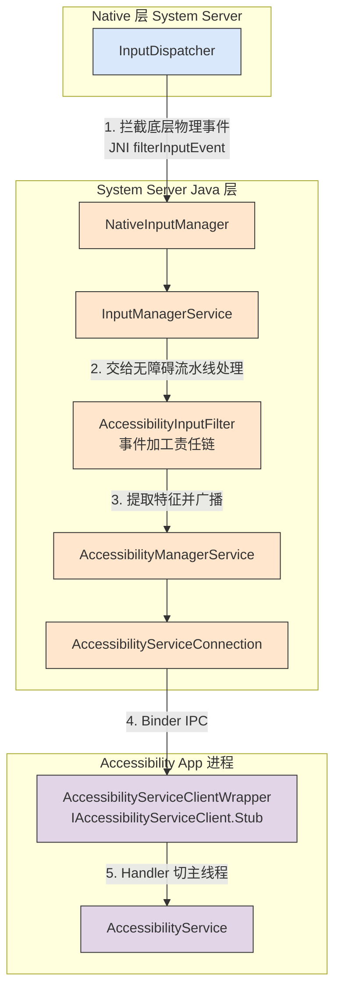
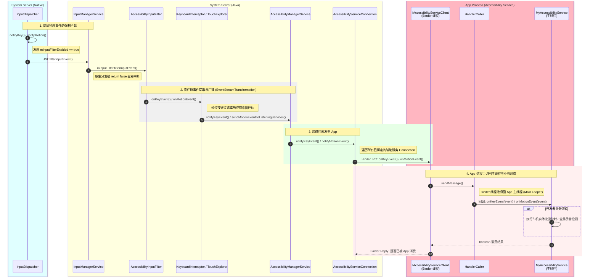
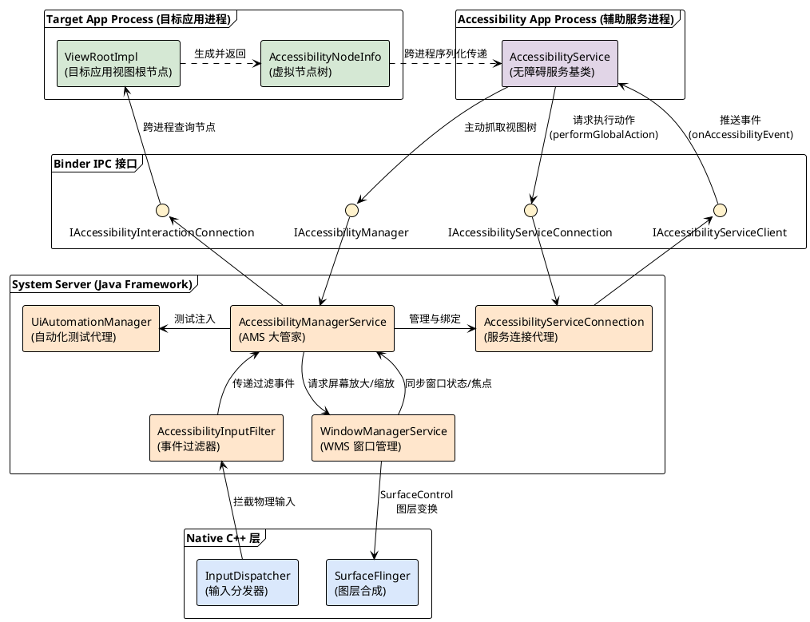

+++
date = '2025-05-15T10:00:00+08:00'
draft = false
title = 'Android AccessibilityService 架构与原理深度剖析'
+++

# Android AccessibilityService 架构与原理深度剖析

`AccessibilityService`（无障碍服务）是 Android 系统中权限最高、能力最强的系统级后门之一。它原本是为视障、听障或肢体障碍用户设计的辅助功能框架（例如 TalkBack），但在实际的系统级开发（尤其是智能座舱 AAOS、自动化测试、按键精灵类 App）中，它常被用来实现全局手势监听、实体按键重映射以及“可见即可说”等高频商业功能。

本文将深入 Android Framework 底层，解析 `AccessibilityService` 的架构拓扑，并重点推演它截获全局 `onMotionEvent` 与 `onKeyEvent` 的完整调用时序。

## 1. 系统级架构拓扑 (Architecture)

无障碍服务的核心架构横跨了 **App 进程**、**System Server (Java 层)** 以及 **InputFlinger (Native C++ 层)**。

### 核心组件职责：
1. **`AccessibilityManagerService` (AMS)：** 系统中所有无障碍服务的中央大管家。它负责解析应用的 `AndroidManifest.xml` 中声明的 `<accessibility-flags>`，并在条件满足时，强行切断底层 `InputDispatcher` 的原生分发流，挂载全局的 `InputFilter`。
2. **`AccessibilityInputFilter`：** 挂载在系统底层的事件加工流水线（`EventStreamTransformation`）。它负责实时监听和过滤用户的屏幕触摸轨迹与物理按键。
3. **`AccessibilityServiceConnection`：** System Server 中用于维护与具体第三方 App (无障碍服务) Binder 连接的代理对象。
4. **`IAccessibilityServiceClient`：** 跨进程通信的 Binder 接口，供 System Server 将事件推送到 App 进程。

---

## 2. 关键时序：全局按键与触摸事件的监听闭环

许多车机应用会在继承 `AccessibilityService` 的类中重写 `onKeyEvent`，或是通过配置 `FLAG_REQUEST_TOUCH_EXPLORATION_MODE` 来重写 `onMotionEvent`（或 `onGesture`）。

下面这幅时序图，精准还原了当用户按下音量键或在屏幕上滑动时，事件是如何穿透重重系统屏障，最终回调到你的 App 中的：

### 源码级深度剖析

#### 1. 为什么你的 App 能收到事件？
并不是所有的 `AccessibilityService` 都能收到底层的键盘或滑动事件。在 `AccessibilityManagerService.java` 的派发逻辑中（即图中的第 2 步到第 3 步）：
*   **按键事件 (`onKeyEvent`)：** 只有当你的服务在 `accessibility-service` 配置文件中声明了 `android:canRequestFilterKeyEvents="true"`，并且激活了 `FLAG_REQUEST_FILTER_KEY_EVENTS` 标志位时，`KeyboardInterceptor` 才会将按键跨进程发给你。
*   **触摸事件 (`onMotionEvent`)：** 对于触摸事件，原生的 `AccessibilityService` 并没有直接暴露出公共的 `onMotionEvent` 回调给开发者（官方更希望你通过 `AccessibilityNodeInfo` 节点操作）。但系统内部的服务（或者通过特殊反射/定制源码的服务）是通过 `TouchExplorer` 责任链节点，调用 `sendMotionEventToListeningServices`，经由 `IAccessibilityServiceClient` 接口的 `onMotionEvent` 方法接收原始物理坐标的。

#### 2. App 的布尔返回值去哪了？(同步阻塞与超时)
注意到时序图的最后一步，当你的 App 在 `onKeyEvent` 中 `return true;` 时，这个布尔值是通过 Binder 同步返回给 System Server 的 `AccessibilityServiceConnection` 的。

如果你的 App 返回了 `true`，系统就会认为这个按键动作**已经被你的无障碍服务接管（消费）了**，底层的 `KeyboardInterceptor` 就会将这个按键抛弃，不再将其发送给前台拥有焦点的 App。这就是车机厂商实现“方向盘按键强制重映射”的底层闭环原理。

> **⚠️ 性能警告：** 
> 正是因为需要等待第三方 App 的布尔返回值来决定事件生死，无障碍服务的 Binder 调用往往是**同步阻塞的 (Synchronous)**。如果你的 `onKeyEvent` 中执行了耗时操作（例如读写数据库、发起网络请求），它将直接堵死系统 `System Server` 的分发线程池，导致严重的系统级卡顿。
> 因此，在无障碍服务中处理物理事件时，务必保持极致的轻量化，或者在极短时间内直接返回结果，将繁重的业务交由子线程异步处理。

## 3. 核心组件交互图 (Component Diagram)

为了更宏观地理解 `AccessibilityService` 体系内各个模块的静态依赖与动态交互关系，并且为了保证**从上到下 (App -> Binder -> System Server -> Native)** 的严谨层级排版，我们使用了 PlantUML 绘制了如下的组件图：

### 组件交互深度解析：

1. **`AccessibilityManagerService` (AMS)：** 作为核心控制中枢，它不仅要接收 `AccessibilityInputFilter` 传来的物理按键和触摸手势，还要接收 `WindowManagerService` 传来的窗口焦点变化、屏幕旋转等全局状态，甚至控制 `SurfaceFlinger` 实现屏幕放大镜效果。
2. **三组关键的 Binder 接口：**
   *   **`IAccessibilityServiceClient`：** System Server **主动呼叫** App 的通道。用于推送 `onAccessibilityEvent`（如窗口变化、按钮点击）和 `onKeyEvent`。
   *   **`IAccessibilityServiceConnection`：** App **主动呼叫** System Server 的通道。无障碍服务通过它执行全局动作（如 `performGlobalAction` 模拟返回键、回到桌面），或者请求注入手势（`dispatchGesture`）。
   *   **`IAccessibilityInteractionConnection`：** 这是实现“可见”的核心。当无障碍服务请求获取当前屏幕文字时，AMS 会通过这个接口跨进程调用目标应用（如微信、车机 Launcher）的 `ViewRootImpl`，由目标应用在自己的主线程遍历 View 树，打包成 `AccessibilityNodeInfo` 节点发回给无障碍服务。
3. **`UiAutomationManager` 的特殊角色：** Android 的 UI 自动化测试框架（如 UiAutomator, Espresso）在底层完全复用了无障碍架构。它通过实例化一个特殊的虚拟无障碍服务来获取屏幕节点并注入点击事件，其在 AMS 内部的地位与第三方车机辅助应用几乎等同。
