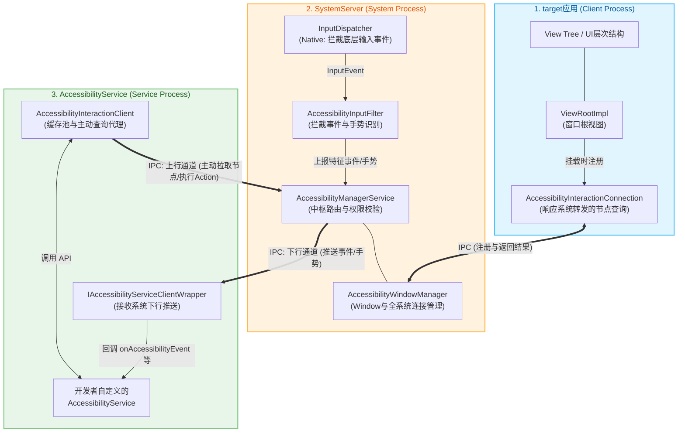
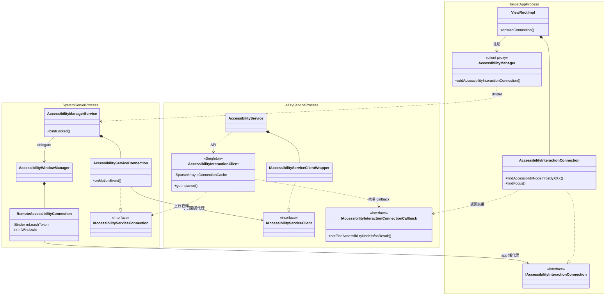
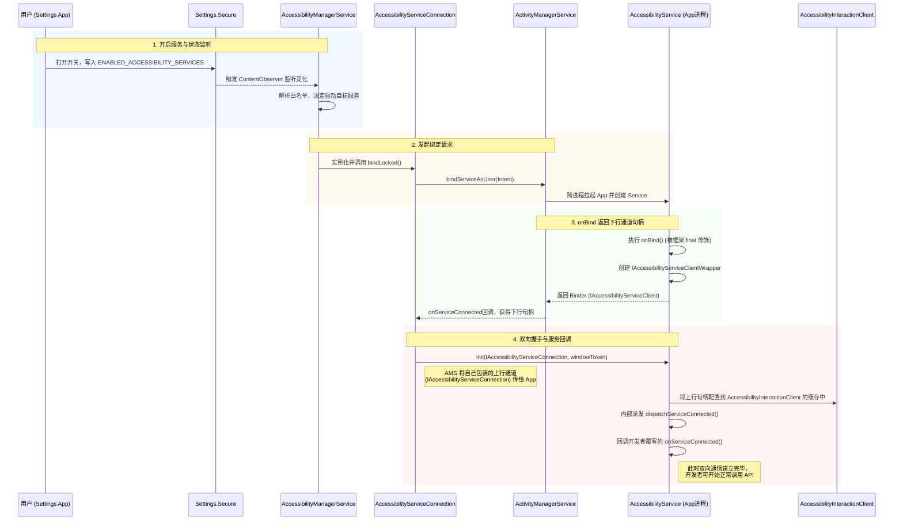
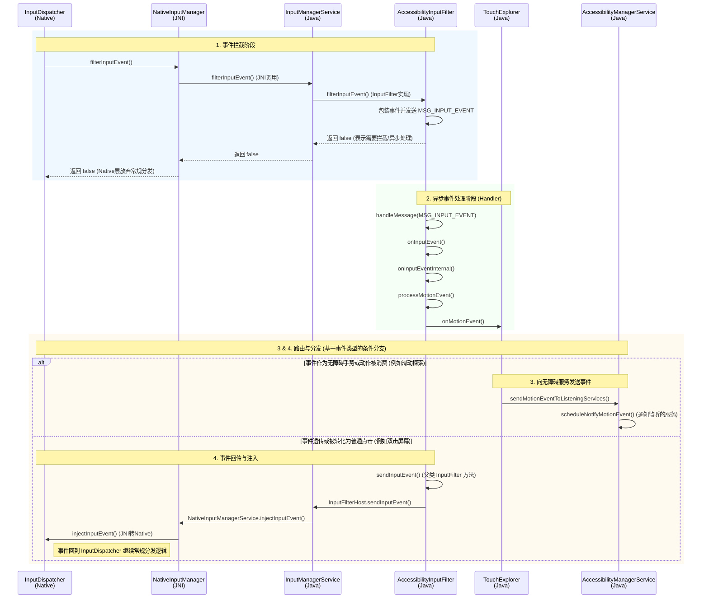
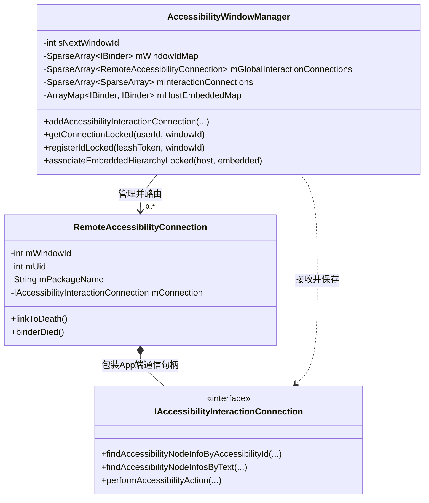
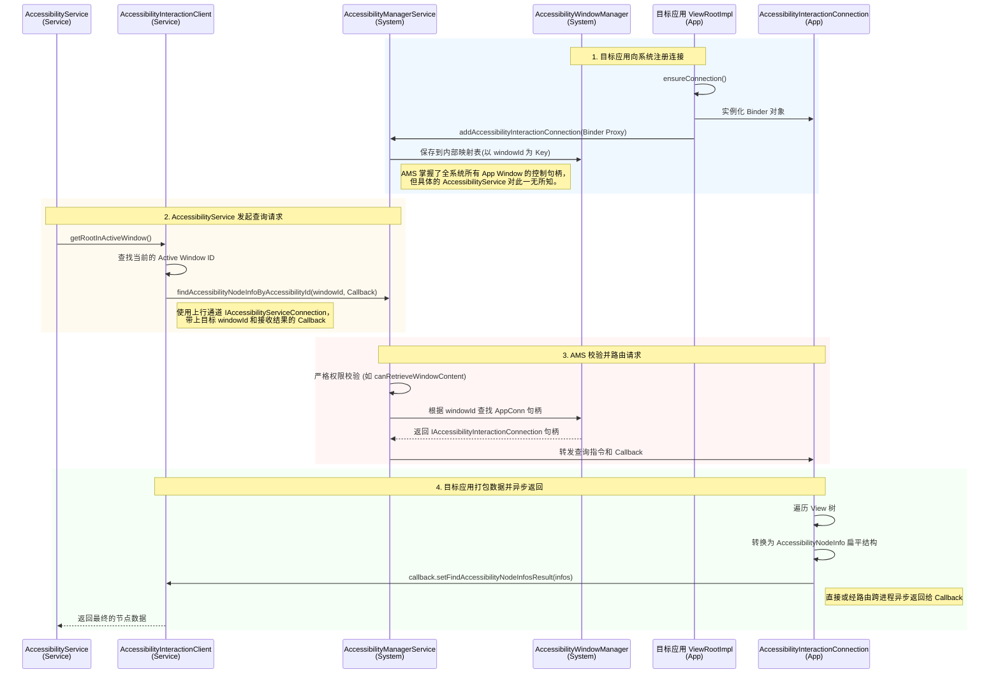

+++
date = '2025-05-15T10:00:00+08:00'
draft = false
title = 'Android AccessibilityService 架构与原理深度剖析-2'
+++

## 架构

Android 无障碍系统的整体架构采用了典型的 **Hub-and-Spoke (星型/中介)** 拓扑结构。在这个架构中，无论是目标应用还是无障碍服务，都不会进行点对点的直接通信，所有的跨进程交互（IPC）必须经过 SystemServer 进程中的系统服务进行安全校验和路由转发。

整个架构可以清晰地划分为三个核心域（Block）：**target应用**、**SystemServer** 和 **AccessibilityService**。

### 核心组件关系图



### 架构域功能解析

1. **target应用 (被操作的目标 App)**
   - 目标应用在它的 UI 挂载（`ViewRootImpl` 创建）时，会主动向系统注册一个 `AccessibilityInteractionConnection`（AIDL 的 Binder 对象）。
   - 它的职责是被动的：只有当收到系统转发来的查询指令时，它才会在自己的主线程或专用线程中遍历 `View Tree`，将真实的 View 转换为跨进程安全的扁平结构 `AccessibilityNodeInfo`，然后打包返回。

2. **SystemServer (安全与路由中枢)**
   - **底层的事件拦截**：`InputDispatcher` 将硬件事件拦截，并交给 `AccessibilityInputFilter` 进行分析（例如区分普通点击和双指滑动探索手势）。
   - **`AccessibilityManagerService` (AMS)**：它是整个架构的大脑。它负责启动和绑定无障碍服务、校验所有请求的权限。
   - **`AccessibilityWindowManager` (AWM)**：掌管着全系统所有目标应用的 Window 映射表。它是实现“隔山打牛”的关键，能够精确地将 `AccessibilityService` 发出的请求路由到具体的 `target应用`。

3. **AccessibilityService (无障碍服务提供方)**
   - **下行通道接受者 (`IAccessibilityServiceClientWrapper`)**：它是一个被动接收器，用于接收 AMS 推送过来的屏幕焦点变化、窗口状态改变或用户手势等事件。
   - **上行查询代理 (`AccessibilityInteractionClient`)**：当开发者在代码中调用 `getRootInActiveWindow()` 时，实际上是通过这个类代理发起跨进程的 IPC 请求。它内部自带了节点缓存池（Node Cache），并在缓存未命中时向 AMS 发出查询指令。

## AccessibilityService实现详解

### 类关系图

下图按 **三个进程域**（目标 App 进程、SystemServer 进程、无障碍服务进程）梳理无障碍体系中关键类的所属、持有关系与跨进程调用闭环。线条形状对应语义：`..|>` 表示 Stub 实现、`*--` 表示组合/持有、`-->` 表示进程内强引用、`..>` 表示弱依赖或跨进程 IPC 调用。



读图要点：

- **目标 App 进程**：`ViewRootImpl` 在无障碍开关开启时通过本进程的 `AccessibilityManager` 代理向 AMS 注册 `AccessibilityInteractionConnection`（实现 `IAccessibilityInteractionConnection.Stub`），作为该窗口被远端查询的入口。
- **SystemServer 进程**：`AccessibilityManagerService` 是中枢，把窗口注册委托给 `AccessibilityWindowManager`，由后者用 `RemoteAccessibilityConnection` 包装 App 端代理并分配 `windowId`；同时为每个绑定的无障碍服务持有一个 `AccessibilityServiceConnection`（实现 `IAccessibilityServiceConnection.Stub`），既向下持有指向服务进程的 `IAccessibilityServiceClient` 代理，也向上承接服务发来的查询请求。
- **无障碍服务进程**：`AccessibilityService` 在 `onBind` 时返回 `IAccessibilityServiceClientWrapper`（实现 `IAccessibilityServiceClient.Stub`），承接系统下行的事件/手势推送；开发者侧的查询 API 走单例 `AccessibilityInteractionClient`，从 `sConnectionCache` 取出 `IAccessibilityServiceConnection` 代理发起上行查询，并携带 `IAccessibilityInteractionConnectionCallback`，由 App 端遍历完节点后异步回调，构成查询闭环。

## 关键流程

### AccessibilityService的启动与连接建立

无障碍服务（AccessibilityService）本质上是一个标准的 Android `Service`。它的生命周期由系统严格控制，主要经过“状态监听 -> 绑定服务 -> 双向握手 -> 连接回调”四个阶段。

#### 1. 启动时序图

以下是用户从“设置”中手动开启无障碍服务时，系统拉起该服务并建立双向通信通道的时序图：



#### 2. 启动流程核心解析

**触发时机**
除了用户在“设置”中手动开启外，以下场景也会触发 `AccessibilityManagerService` (AMS) 对服务的 `bindService`：
- 设备开机或用户解锁（User Unlocked）后，AMS 会重新拉起记录在设置白名单中的服务。
- 已经开启的无障碍应用被覆盖安装（更新）或崩溃后，AMS 会尝试重新绑定（Rebind）。

**强管控的 `onBind` 与双向通信架构**
在 `AccessibilityService` 源码中，`onBind(Intent)` 方法是被标记为 `final` 的，开发者**无法重写它**。这是因为 Android 框架需要在这个阶段插入极其关键的双向 IPC（跨进程通信）逻辑：
1. **下行通道（System -> App）**：框架在 `onBind` 中实例化一个内部类 `IAccessibilityServiceClientWrapper` 并将其 Binder 句柄返回给 AMS。这是系统将屏幕事件（如焦点变化、手势）**推送（Push）**给 App 的通道。
2. **上行通道（App -> System）**：AMS 在拿到下行句柄后，会立刻调用它的 `init()` 方法，并将 AMS 侧生成的 `IAccessibilityServiceConnection` 作为参数传回给 App。
3. **中央路由管理**：App 收到上行通道句柄后，会将其保存在 `AccessibilityInteractionClient` 中（`sConnectionCache`）。之后当 App 想要主动请求节点数据（如 `getRootInActiveWindow()`）或下发点击指令时，就会使用这个上行通道。

当这套双向“握手”流程在框架层暗中全部执行完毕后，系统才会通过内部的 Handler 回调通知开发者重写的 `onServiceConnected()` 方法。因此，开发者执行服务初始化的正确入口点永远是 `onServiceConnected()`。

### InputEvent事件的处理

当系统开启无障碍服务（尤其是触摸浏览 Touch Exploration 或屏幕阅读器功能）时，`InputEvent` 会被 `AccessibilityInputFilter` 拦截并处理，以决定事件是应该被消费、修改还是放行。整体流程跨越了 Native 层（InputDispatcher）、JNI 层以及 Java 层的多项服务。

#### 1. 核心流程概述

事件处理主要分为四个关键阶段：
1. **事件拦截 (Interception)**：底层硬件产生的输入事件在 `InputDispatcher` 分发前，会通过策略方法层层上调，最终到达 `AccessibilityInputFilter`。
2. **异步分发 (Asynchronous Dispatch)**：为了不阻塞 Native 的输入管线，`AccessibilityInputFilter` 会将事件通过 Handler ( `MSG_INPUT_EVENT` ) 放入消息队列异步处理。
3. **特征处理 (Feature Processing)**：诸如 `TouchExplorer` 等模块接收并解析手势，根据用户的操作将相应的事件报告给 `AccessibilityManagerService`。
4. **事件回传与注入 (Injection/Dispatching)**：对于需要传递给应用层消费的事件（例如经过无障碍系统确认的正常点击或修改后的事件），会被重新注入到底层 `InputDispatcher` 中进行常规分发。

#### 2. 事件处理时序图

以下是完整的系统调用时序，展现了从事件拦截到无障碍系统处理，最终回传注入的代码执行路径：



#### 3. 核心源码逻辑解析

- **Native层的拦截钩子**：
  在 `InputDispatcher` 的派发流程中，会调用 `mPolicy.filterInputEvent`（实际指向 `NativeInputManager`）。`NativeInputManager` 通过 JNI 获取 Java 层 `InputManagerService` 对象的 `filterInputEvent` 方法，从而将判断逻辑转移到 Java 层。

- **AccessibilityInputFilter 的异步化**：
  Java 层 `InputManagerService.filterInputEvent` 会调用注册在其中的 `InputFilter` (即 `AccessibilityInputFilter`)。
  当 `AccessibilityInputFilter.filterInputEvent` 被调用时，为了避免 JNI 调用阻塞底层的输入事件处理循环，它会将当前的 `InputEvent` 复制并封装进一个 `Message` (标识为 `MSG_INPUT_EVENT`)，发送给自带的 `Handler`，然后直接向底层返回 `false`。
  底层收到 `false` 后会丢弃此次常规派发，将控制权完全交给无障碍系统处理。

- **条件分支：处理与消费 vs 回传与注入**：
  在 Handler 触发 `processMotionEvent` 并进入 `TouchExplorer` 等模块后，针对单一事件，处理逻辑在第3步和第4步之间呈现 **条件分支 (alt)** 的关系：
  - **路径 A (对应步骤 3)**：如果事件属于无障碍手势的一部分（如单指触摸探索、多指滑动），它会被无障碍系统**消费**。系统会调用 `AccessibilityManagerService.sendMotionEventToListeningServices`，将事件转化为反馈信息（如让 TalkBack 播报焦点）发送给监听的无障碍服务。此时，这个事件**不会**被注入回 View 树。
  - **路径 B (对应步骤 4)**：如果事件判定为无关手势的纯透传事件（如悬停外围），或者是由无障碍手势转化而来的普通操作（例如，连续双击被识别为一次普通的 Click），那么无障碍系统会放行（或重新构造）该事件。调用链路会走向 `super.onInputEvent`，通过 JNI 的 `injectInputEvent` 将事件重新注入 `InputDispatcher`。此时，事件重新进入正常的 View 树分发流程。

### AccessibilityInteractionConnection的注册流程

为了让无障碍系统（Accessibility System）能够查询和操作应用的 UI 节点，应用在创建 Window 时需要主动向系统注册其 `AccessibilityInteractionConnection`。这个注册过程紧随 Activity 的生命周期，并在 View 树挂载到 Window 时触发，同时也受到全局无障碍状态的动态控制。

#### 1. 注册的触发时机与动态管理

注册的发起点在应用进程的 `ViewRootImpl` 中。为了避免在未开启无障碍服务时产生额外的跨进程通信开销，Android 采用了**懒加载与动态监听**的机制。

其核心类是 `ViewRootImpl` 的内部类 `AccessibilityInteractionConnectionManager`，它实现了 `AccessibilityStateChangeListener` 接口。注册的触发通常有两个入口：

1. **Window 首次挂载时触发**：
   在 `ActivityThread.handleResumeActivity` 阶段，Activity 即将变为可见状态。系统通过 `WindowManagerGlobal.addView` 将 `DecorView` 添加到 Window 中，此时会创建并初始化 `ViewRootImpl`。在 `ViewRootImpl.setView()` 方法内部，系统会检查当前的全局无障碍状态，若已开启则直接注册：
   ```java
   if (mAccessibilityManager.isEnabled()) {
       mAccessibilityInteractionConnectionManager.ensureConnection();
   }
   ```

2. **全局无障碍状态动态变更时触发**：
   如果应用启动时并未开启无障碍服务，之后用户在系统设置中打开了服务。由于 `AccessibilityInteractionConnectionManager` 监听了状态变化，它的 `onAccessibilityStateChanged(boolean enabled)` 会被回调：
   ```java
   public void onAccessibilityStateChanged(boolean enabled) {
       if (enabled) {
           ensureConnection();
           // ...
       } else {
           ensureNoConnection(); // 动态解绑，防止资源泄漏
       }
   }
   ```

#### 2. 跨进程注册与 mLeashToken 的缝合机制

当 `ensureConnection()` 被调用时，应用内部会实例化一个 `AccessibilityInteractionConnection`（这是一个实现了 AIDL 接口的 Binder 本地对象，专门负责处理系统下发的无障碍查询指令）。

接着，它会通过 `AccessibilityManager.addAccessibilityInteractionConnection()` 跨进程调用 System Server 端的 `AccessibilityManagerService`。在这个跨进程调用中，传递了几个极其关键的参数：
- `mWindow`: 当前 Window 的跨进程 Token (`IWindow`)。
- `connection`: 刚刚实例化的用来接收查询指令的 Binder 句柄。
- `mLeashToken`: `ViewRootImpl` 的匿名身份凭证。

**重点解析 `mLeashToken` 的作用：**
`mLeashToken` 是在 `ViewRootImpl` 创建时初始化的一个匿名 `Binder` 对象。它的核心作用是**标识并缝合跨 Window 的嵌入式视图层级（Embedded View Hierarchy）**。
- 从 Android 11 开始，应用可以使用 `SurfaceControlViewHost` 将一个 View 树渲染到独立的 `SurfaceControl` 上，并将其嵌入到其他宿主（Host）Window 中。
- 在底层的图形渲染层，它们是拼接在一起的，但在无障碍系统的逻辑视角里，宿主和嵌入视图属于两个断裂的 Window。
- **缝合机制**：宿主会将自己的 Token 传递给嵌入方的 `ViewRootImpl`。嵌入方收到后，会调用 AMS，将其 `mLeashToken`（作为身份凭证）与宿主的 Token 进行绑定（`associateEmbeddedHierarchy`）。当读屏软件（如 TalkBack）遍历宿主节点并请求其子节点时，底层通过这个映射关系，利用 `mLeashToken` 找到嵌入层 `ViewRootImpl`，从而将两棵断裂的节点树“无缝缝合”成一棵完整的树。

#### 3. System Server 端的集中管理：AccessibilityWindowManager

注册请求最终会交由 System Server 端的 `AccessibilityWindowManager` 集中管理。它是全局所有跨进程无障碍交互连接的“大管家”。

**核心机制：**
- **连接包装与死亡监听**：它收到 App 传来的 `IAccessibilityInteractionConnection` Binder 句柄后，会将其包装成一个 `RemoteAccessibilityConnection` 对象，并向该 Binder 注册死亡监听（DeathRecipient）。如果目标 App 进程崩溃，系统能立即感知并清理失效的连接，防止内存泄漏或产生无效的查询路由。
- **WindowId 的分配与路由**：每次注册成功，`AccessibilityWindowManager` 都会为这个连接分配一个全局递增的 `windowId`。之后无障碍服务（如 TalkBack）只需提供这个 `windowId`，AMS 就能精确路由到对应的 App Window 并发起节点查询。
- **多用户与全局状态隔离**：它内部维护了多套映射表。跨用户的系统 Window（如 SystemUI）被分配在全局映射表（`mGlobalInteractionConnections`）中，而普通 App Window 则是按 userId 隔离，存放于各自的映射表（`mInteractionConnections`）中。

**AccessibilityWindowManager 机制类图：**



#### 4. 跨进程获取 View 树的 Hub-and-Spoke 模型

目标应用（App）与无障碍服务（AccessibilityService）之间**不会进行点对点（P2P）直连**。所有的跨进程节点查询通信必须经过 System Server 进程中的 `AccessibilityManagerService` (AMS) 作为安全中介进行路由。

整个交互过程通过回调和事件转发实现，时序图及详细步骤如下：



1. **目标应用向系统“注册”连接 (App -> AMS)**
   当系统开启了无障碍服务后，目标应用在创建 Window（即 `ViewRootImpl` 实例化）时，会执行 `ensureConnection()`：
   - 目标应用内部实例化一个 `AccessibilityInteractionConnection`（这是一个实现了 AIDL 接口的 Binder 本地对象）。
   - 目标应用调用 `mAccessibilityManager.addAccessibilityInteractionConnection(...)` 将这个 Binder 的跨进程句柄（Proxy）发送给了 AMS。
   - AMS 收到后，会将其保存在 `AccessibilityWindowManager` 的内部映射表中（以 `windowId` 为 Key）。
   > **此时：** AMS 掌握了全系统所有 App Window 的控制句柄，但具体的 `AccessibilityService` 对此一无所知。

2. **AccessibilityService 发起查询请求 (Service -> AMS)**
   当你的 `AccessibilityService` 想要获取当前屏幕的 View 树（例如调用了 `getRootInActiveWindow()`）：
   - `AccessibilityInteractionClient` 会查找到当前的 Active Window ID。
   - 它通过自己持有的 `IAccessibilityServiceConnection`（上行通道），向 AMS 发起一个查询请求，比如 `findAccessibilityNodeInfoByAccessibilityId`。
   - 在这个请求中，它会带上目标窗口的 `windowId`，并传入一个用于接收结果的回调接口（`IAccessibilityInteractionConnectionCallback`）。

3. **AMS 校验并路由请求 (AMS -> App)**
   - AMS 收到查询请求后，首先进行严格的权限校验（比如该 Service 是否声明了获取窗口内容的权限 `canRetrieveWindowContent`）。
   - 校验通过后，AMS 根据请求里的 `windowId`，从自己的映射表中找出第一步里目标应用注册的那个 `IAccessibilityInteractionConnection` 句柄。
   - AMS 将查询指令以及接收结果的 Callback，通过这个句柄转发（Forward）给目标应用。

4. **目标应用打包数据并异步返回 (App -> Service)**
   - 目标应用的 `AccessibilityInteractionConnection` 收到了来自 AMS 转发的指令。
   - 它会在自己的 UI 线程（或者专门的无障碍处理线程）中遍历自己的 View 树，将真实的 View 对象转换、拷贝成一个个扁平的、跨进程安全的数据结构：`AccessibilityNodeInfo`。
   - 打包完成后，目标应用利用第 2 步中一路传过来的 Callback 句柄，调用 `callback.setFindAccessibilityNodeInfosResult(infos)`。
   - 由于这个 Callback Binder 是在 `AccessibilityService` 进程中创建的，这一步的数据会跨进程直接或经 AMS 路由返回给 `AccessibilityService` 的 `AccessibilityInteractionClient`。


