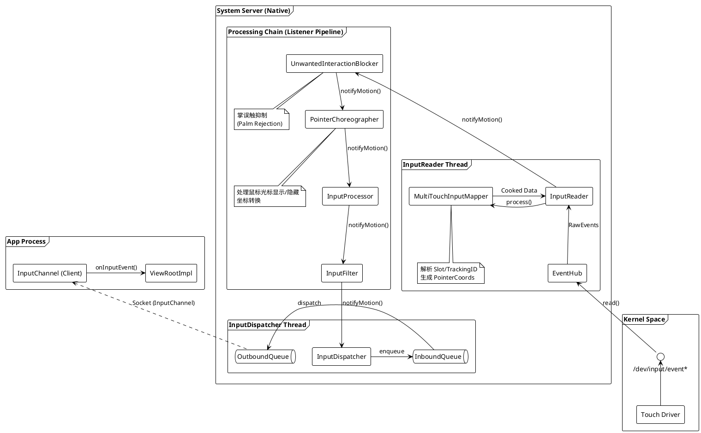
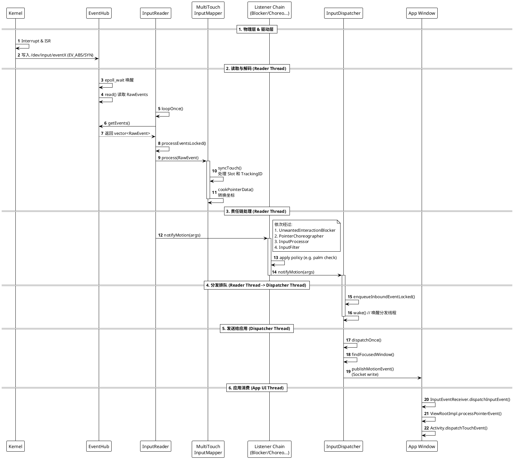

+++
date = '2025-09-29T10:22:54+08:00'
draft = true
title = 'Android16 InputFlinger技术详解'
+++
# Android16 InputFlinger技术详解

## 简介

## 架构

### 核心组件描述

## 机制实现

### InputDevice设备的发现与管理

### Multi-touch事件的加工

### 事件的派发
基于我们之前的讨论（特别是 `InputManager` 的构造函数链条），现在的 Android InputFlinger 在 InputReader 和 InputDispatcher 之间引入了多个处理阶段（Processing Stages）。

下面为你整理了最新的 **Multi-touch 事件派发流程**，包含**软件架构图**和**时序图**。

### 1. 软件架构图 (Software Block Diagram)

这张图展示了多点触控事件在内存中是如何流转的。重点在于体现 `InputReader` 产生事件后，并不是直接扔给 `InputDispatcher`，而是经过了一个**责任链（Chain of Responsibility）**。




**关键组件说明：**

* **MultiTouchInputMapper**: 负责将 Linux 的 Slot 协议转换为 Android 的 Pointer ID，处理坐标校准和旋转。
* **UnwantedInteractionBlocker**: （Android 13/14+ 引入）在事件到达分发器前，提前拦截误触（如手掌压在屏幕边缘）。
* **PointerChoreographer**: 负责“编排”指针。如果是鼠标，它负责画光标；如果是触摸，它可能负责隐藏光标或处理多屏坐标映射。
* **InputDispatcher**: 最终的守门员，负责寻找焦点窗口（Focused Window）并通过 Socket 发送。

---

### 2. 时序图 (Sequence Diagram)

这张图展示了手指按下（ACTION_DOWN）那一刻，函数调用的详细时序。



### 流程总结

1. **唤醒**: 你的手指触摸屏幕，Kernel 产生中断，EventHub 通过 `epoll` 被唤醒。
2. **加工 (Cook)**: `InputReader` 将 `EventHub` 拿来的原始 Linux 数据（Slot, Axis）交给 `MultiTouchInputMapper`。Mapper 把它“烹饪”成 Android 能理解的 `NotifyMotionArgs`（包含 Pointer ID, X, Y 等）。
3. **过安检 (Pipeline)**: 这是你之前代码里 `mTracingStages` 的体现。事件像流水线一样流过 `UnwantedInteractionBlocker`（查掌误触）、`PointerChoreographer`（查光标逻辑）。如果被拦截（比如判定为误触），流程直接在这里终止，不会发给 Dispatcher。
4. **入队**: 如果“安检”通过，事件最终进入 `InputDispatcher` 的 `InboundQueue`。
5. **派发**: Dispatcher 线程醒来，找到当前谁是前台窗口，通过 `InputChannel` (Socket) 把数据发给 App。

## 案例分析
这份 Log 展示了一个非常标准的 **点击（Press） -> 持有（Hold） -> 抬起（Release）** 的完整过程。
整个过程划分为三个阶段（按下、更新、抬起），我们使用表格详细解读每个事件的含义以及 **Android 系统是如何理解它的**。

```txt
/dev/input/event2: EV_KEY       BTN_TOUCH            DOWN                
/dev/input/event2: EV_ABS       ABS_MT_TRACKING_ID   00000005            
/dev/input/event2: EV_ABS       ABS_MT_POSITION_X    000002b3            
/dev/input/event2: EV_ABS       ABS_MT_POSITION_Y    00000373            
/dev/input/event2: EV_ABS       ABS_MT_TOUCH_MAJOR   00000004            
/dev/input/event2: EV_ABS       ABS_MT_TOUCH_MINOR   00000003            
/dev/input/event2: EV_ABS       ABS_MT_PRESSURE      00000015            
/dev/input/event2: EV_SYN       SYN_REPORT           00000000            
/dev/input/event2: EV_ABS       ABS_MT_PRESSURE      00000016            
/dev/input/event2: EV_SYN       SYN_REPORT           00000000            
/dev/input/event2: EV_ABS       ABS_MT_PRESSURE      00000015            
/dev/input/event2: EV_SYN       SYN_REPORT           00000000            
/dev/input/event2: EV_ABS       ABS_MT_TOUCH_MAJOR   00000002            
/dev/input/event2: EV_ABS       ABS_MT_TOUCH_MINOR   00000002            
/dev/input/event2: EV_ABS       ABS_MT_PRESSURE      00000013            
/dev/input/event2: EV_SYN       SYN_REPORT           00000000            
/dev/input/event2: EV_ABS       ABS_MT_TOUCH_MINOR   00000000            
/dev/input/event2: EV_ABS       ABS_MT_PRESSURE      0000000d            
/dev/input/event2: EV_SYN       SYN_REPORT           00000000            
/dev/input/event2: EV_ABS       ABS_MT_PRESSURE      00000000            
/dev/input/event2: EV_ABS       ABS_MT_TRACKING_ID   ffffffff            
/dev/input/event2: EV_KEY       BTN_TOUCH            UP                  
/dev/input/event2: EV_SYN       SYN_REPORT           00000000
```

### 阶段一：手指按下 (Touch Down)

这是触摸动作的开始。

| 事件代码 (Code) | 值 (Value) | 含义解读 (Interpretation) | Android 系统的反应 |
| --- | --- | --- | --- |
| **`BTN_TOUCH`** | **`DOWN`** | **【关键】物理接触开始**。<br>告诉系统：这不是悬停，是真的按下去了。 | 状态机判定：`Touching`。(非 Hover ) |
| `ABS_MT_TRACKING_ID` | `00000005` | **分配身份证**。<br>ID 为 5 的手指进入了 Slot 0。 | 识别为一个新的触点。 |
| `ABS_MT_POSITION_X` | `000002b3` (691) | X 坐标。 | 记录触点 X 位置。 |
| `ABS_MT_POSITION_Y` | `00000373` (883) | Y 坐标。 | 记录触点 Y 位置。 |
| `ABS_MT_TOUCH_MAJOR` | `00000004` | 接触面积（长轴）。 | 用于计算接触范围。 |
| `ABS_MT_TOUCH_MINOR` | `00000003` | 接触面积（短轴）。 | 用于计算接触范围。 |
| `ABS_MT_PRESSURE` | `00000015` (21) | 压力值。 | 压力大于 0。 |
| **`SYN_REPORT`** | `00000000` | **提交一帧**。 | **生成 `ACTION_DOWN` 事件发给 App。** |


### 阶段二：状态更新 (Updates)

这里有连续 3 个 `SYN_REPORT` 块。你会发现**没有坐标变化**（X/Y 没发），说明手指按在原地没动，只是力度和接触面在微调。

| 事件代码 (Code) | 值 (Value) | 含义解读 (Interpretation) | Android 系统的反应 |
| --- | --- | --- | --- |
| `ABS_MT_PRESSURE` | `00000016` (22) | 压力变大了 (21 -> 22)。 | 更新 PointerCoords 中的压力值。 |
| **`SYN_REPORT`** | `00000000` | **提交一帧**。 | 生成 `ACTION_MOVE` (尽管坐标没变，但在某些场景下压力变化也会触发)。 |
| `ABS_MT_PRESSURE` | `00000015` (21) | 压力变回去了。 | 更新压力值。 |
| **`SYN_REPORT`** | `00000000` | **提交一帧**。 | 生成 `ACTION_MOVE`。 |
| `ABS_MT_TOUCH_MAJOR` | `00000002` | 接触面变小了 (4 -> 2)。 | 手指可能在抬起前变轻了。 |
| `ABS_MT_TOUCH_MINOR` | `00000002` | 接触面变小了 (3 -> 2)。 | 同上。 |
| `ABS_MT_PRESSURE` | `00000013` (19) | 压力变小了。 | 手指正在准备离开。 |
| **`SYN_REPORT`** | `00000000` | **提交一帧**。 | 生成 `ACTION_MOVE`。 |

> **注意**：在这个阶段，因为 `BTN_TOUCH` 的状态没有改变（一直保持为 1），所以驱动**不需要**重复发送它。同理，`TRACKING_ID` 也没变，也不需要发。这就是 Type B 协议的“有状态”特性。


### 阶段三：手指抬起 (Touch Up)

这是动作的结束。

| 事件代码 (Code) | 值 (Value) | 含义解读 (Interpretation) | Android 系统的反应 |
| --- | --- | --- | --- |
| `ABS_MT_TOUCH_MINOR` | `00000000` | 接触面归零。 | 物理接触面消失。 |
| `ABS_MT_PRESSURE` | `0000000d` (13) | 压力进一步减小。 | (过渡状态) |
| **`SYN_REPORT`** | `00000000` | **提交一帧**。 | 生成 `ACTION_MOVE`。 |
| `ABS_MT_PRESSURE` | `00000000` | 压力归零。 | 完全没压力了。 |
| **`ABS_MT_TRACKING_ID`** | **`ffffffff` (-1)** | **【关键】销毁手指**。<br>告诉系统 ID 为 5 的手指离开了。 | 移除 Pointer。如果这是最后一个点，准备触发 Up。 |
| **`BTN_TOUCH`** | **`UP`** | **【关键】物理接触结束**。<br>全局按键抬起。 | 确认屏幕上没有手指了。 |
| **`SYN_REPORT`** | `00000000` | **提交一帧**。 | **生成 `ACTION_UP` 事件发给 App。** |

### 总结：为什么这份 Log 是“标准答案”？

1. 也就是之前缺失的 `BTN_TOUCH`：
   * 第一行明确发了 `DOWN`，所以系统知道是 **Touching**。
   * 最后一行明确发了 `UP`，所以系统知道操作结束，不会卡在 Hover。

2. 也就是之前可能没处理好的 `TRACKING_ID`：
   * 结束时明确发了 `ffffffff` (-1)，所以手指不会变成卡在屏幕上。

3. 没有任何 `ABS_X` / `ABS_Y`：
   * 只用了 `ABS_MT_POSITION_X/Y`。
   * 这保证了 Android 把它识别为 **Multi-Touch Screen**，而不是 Pointer (鼠标/触控板)。

### dumpsys input的 RecentQueue 分析

#### RecentQueue 的输出顺序
**RecentQueue 的输出顺序是：从上到下 = 从旧到新（时间正序）。**
下面是上面事件对应的dumpsys input中 RecentQueue 的信息：
```txt
  RecentQueue: length=10
    MotionEvent(deviceId=4, eventTime=511199443000, source=TOUCHSCREEN, displayId=0, action=MOVE, actionButton=0x00000000, flags=0x00000000, metaState=0x00000000, buttonState=0x00000000, classification=NONE, edgeFlags=0x00000000, xPrecision=1.0, yPrecision=1.0, xCursorPosition=nan, yCursorPosition=nan, pointers=[0: (710.0, 998.0)]), policyFlags=0x62000000, age=793541ms
    MotionEvent(deviceId=4, eventTime=511204891000, source=TOUCHSCREEN, displayId=0, action=MOVE, actionButton=0x00000000, flags=0x00000000, metaState=0x00000000, buttonState=0x00000000, classification=NONE, edgeFlags=0x00000000, xPrecision=1.0, yPrecision=1.0, xCursorPosition=nan, yCursorPosition=nan, pointers=[0: (710.0, 998.0)]), policyFlags=0x62000000, age=793535ms
    MotionEvent(deviceId=4, eventTime=511210593000, source=TOUCHSCREEN, displayId=0, action=MOVE, actionButton=0x00000000, flags=0x00000000, metaState=0x00000000, buttonState=0x00000000, classification=NONE, edgeFlags=0x00000000, xPrecision=1.0, yPrecision=1.0, xCursorPosition=nan, yCursorPosition=nan, pointers=[0: (710.0, 998.0)]), policyFlags=0x62000000, age=793529ms
    MotionEvent(deviceId=4, eventTime=511215073000, source=TOUCHSCREEN, displayId=0, action=UP, actionButton=0x00000000, flags=0x00000000, metaState=0x00000000, buttonState=0x00000000, classification=NONE, edgeFlags=0x00000000, xPrecision=1.0, yPrecision=1.0, xCursorPosition=nan, yCursorPosition=nan, pointers=[0: (710.0, 998.0)]), policyFlags=0x62000000, age=793525ms
    MotionEvent(deviceId=4, eventTime=546310213000, source=TOUCHSCREEN, displayId=0, action=DOWN, actionButton=0x00000000, flags=0x00000000, metaState=0x00000000, buttonState=0x00000000, classification=NONE, edgeFlags=0x00000000, xPrecision=1.0, yPrecision=1.0, xCursorPosition=nan, yCursorPosition=nan, pointers=[0: (691.0, 883.0)]), policyFlags=0x62000000, age=758430ms
    MotionEvent(deviceId=4, eventTime=546319808000, source=TOUCHSCREEN, displayId=0, action=MOVE, actionButton=0x00000000, flags=0x00000000, metaState=0x00000000, buttonState=0x00000000, classification=NONE, edgeFlags=0x00000000, xPrecision=1.0, yPrecision=1.0, xCursorPosition=nan, yCursorPosition=nan, pointers=[0: (691.0, 883.0)]), policyFlags=0x62000000, age=758420ms
    MotionEvent(deviceId=4, eventTime=546331212000, source=TOUCHSCREEN, displayId=0, action=MOVE, actionButton=0x00000000, flags=0x00000000, metaState=0x00000000, buttonState=0x00000000, classification=NONE, edgeFlags=0x00000000, xPrecision=1.0, yPrecision=1.0, xCursorPosition=nan, yCursorPosition=nan, pointers=[0: (691.0, 883.0)]), policyFlags=0x62000000, age=758409ms
    MotionEvent(deviceId=4, eventTime=546336524000, source=TOUCHSCREEN, displayId=0, action=MOVE, actionButton=0x00000000, flags=0x00000000, metaState=0x00000000, buttonState=0x00000000, classification=NONE, edgeFlags=0x00000000, xPrecision=1.0, yPrecision=1.0, xCursorPosition=nan, yCursorPosition=nan, pointers=[0: (691.0, 883.0)]), policyFlags=0x62000000, age=758404ms
    MotionEvent(deviceId=4, eventTime=546342191000, source=TOUCHSCREEN, displayId=0, action=MOVE, actionButton=0x00000000, flags=0x00000000, metaState=0x00000000, buttonState=0x00000000, classification=NONE, edgeFlags=0x00000000, xPrecision=1.0, yPrecision=1.0, xCursorPosition=nan, yCursorPosition=nan, pointers=[0: (691.0, 883.0)]), policyFlags=0x62000000, age=758398ms
    MotionEvent(deviceId=4, eventTime=546346496000, source=TOUCHSCREEN, displayId=0, action=UP, actionButton=0x00000000, flags=0x00000000, metaState=0x00000000, buttonState=0x00000000, classification=NONE, edgeFlags=0x00000000, xPrecision=1.0, yPrecision=1.0, xCursorPosition=nan, yCursorPosition=nan, pointers=[0: (691.0, 883.0)]), policyFlags=0x62000000, age=758394ms

```
可以通过 Log 中的两个关键指标来验证这一点：

1. 看 `eventTime`（事件发生时间戳）

时间戳是单调递增的，数值越大代表时间越晚。

* **第一行（最旧）**：`eventTime=511199443000` (数值最小)
* **最后一行（最新）**：`eventTime=546346496000` (数值最大)

2. 看 `age`（事件“年龄”）

`age` 代表“该事件发生到现在过了多久”。**Age 越小，代表事件越“新鲜”。**

* **第一行（最旧）**：`age=793541ms` (约 793 秒前发生的)
* **最后一行（最新）**：`age=758394ms` (约 758 秒前发生的)

在分析 `dumpsys input` 的 `RecentQueue` 时：

* **列表的最顶部**：是该队列缓存范围内**最早**发生的事件。
* **列表的最底部**：是该队列**最近一次**处理的事件（刚刚发生的）。

#### Kernel 事件 和上层 Framework 的 `dumpsys` 对应关系分析

`RecentQueue` 实际上记录了**两次**点击操作。

* **前 4 行**：一次较早的点击（时间戳 `511...`，坐标 `710, 998`）。
* **后 6 行**：与刚才提供的 Raw Log **完全对应**的那次点击（时间戳 `546...`，坐标 `691, 883`）。

我们来详细解剖**后 6 行**（即 `RecentQueue` 的第 5 到第 10 个事件），看看它们是如何从刚才那个“完美的 Raw Log”变身而来的。

##### 核心对应关系表

我们先进行数学验证：

* Raw Log X: `0x2b3` (16进制) = **691** (10进制)
* Raw Log Y: `0x373` (16进制) = **883** (10进制)
* RecentQueue Pointers: `(691.0, 883.0)`

**完全吻合！** 以下是逐帧对应分析：

| 阶段 |  Raw Log (输入) | InputReader 处理逻辑 | dumpsys RecentQueue (输出) |
| --- | --- | --- | --- |
| **按下** | **`BTN_TOUCH DOWN`**<br>`ABS_MT_TRACKING_ID 5`<br>`X=0x2b3 (691)`<br>`Y=0x373 (883)`<br>`SYN_REPORT` | 检测到新 ID 且按键按下。<br>生成 `ACTION_DOWN`。<br>应用校准和坐标转换。 | **第 5 行：**<br>`action=DOWN`<br>`eventTime=546310213000`<br>`pointers=[0: (691.0, 883.0)]` |
| **变化1** | `ABS_MT_PRESSURE 0x16`<br>`SYN_REPORT` | 检测到属性变化（压力）。<br>虽然坐标没变，但仍生成事件。<br>类型为 `ACTION_MOVE`。 | **第 6 行：**<br>`action=MOVE`<br>`eventTime=546319808000`<br>`pointers=[0: (691.0, 883.0)]` |
| **变化2** | `ABS_MT_PRESSURE 0x15`<br>`SYN_REPORT` | 压力再次变化。<br>生成 `ACTION_MOVE`。 | **第 7 行：**<br>`action=MOVE`<br>`eventTime=546331212000` |
| **变化3** | `ABS_MT_TOUCH_MAJOR 2`<br>`ABS_MT_MINOR 2`<br>`PRESSURE 0x13`<br>`SYN_REPORT` | 接触面积和压力变化。<br>生成 `ACTION_MOVE`。 | **第 8 行：**<br>`action=MOVE`<br>`eventTime=546336524000` |
| **变化4** | `ABS_MT_MINOR 0`<br>`PRESSURE 0x0d`<br>`SYN_REPORT` | 接触面积和压力变化。<br>生成 `ACTION_MOVE`。 | **第 9 行：**<br>`action=MOVE`<br>`eventTime=546342191000` |
| **抬起** | `PRESSURE 0`<br>**`TRACKING_ID -1`**<br>**`BTN_TOUCH UP`**<br>`SYN_REPORT` | 检测到 Tracking ID 销毁或<br>BTN_TOUCH 抬起。<br>生成 `ACTION_UP`。 | **第 10 行：**<br>`action=UP`<br>`eventTime=546346496000`<br>`pointers=[0: (691.0, 883.0)]` |

##### 深度解读 `RecentQueue` 的字段

这一行 Log 包含了很多关键信息：

```text
MotionEvent(deviceId=4, ..., action=DOWN, ..., pointers=[0: (691.0, 883.0)]), policyFlags=0x62000000
```
1. `action=DOWN` / `MOVE` / `UP`

* **含义**：这是上层 App 最终收到的事件类型。
* **诊断**：
  * 如果看到 `HOVER_ENTER`，说明 `BTN_TOUCH` 没处理好。
  * 如果看到 `DOWN` -> `MOVE` -> `UP` 这样清晰的序列，说明 **状态机完美闭环**。

2. `pointers=[0: (691.0, 883.0)]`
* **`0:`**：这是 `PointerId`。
  * 注意：它不一定等于 Kernel 的 `Tracking ID` (你的是 5)。Android 会把 Kernel 的任意 ID (如 5) 映射到更小的连续索引 (如 0)。
* **`(691.0, 883.0)`**：这是转换后的坐标。
  * 因为Raw Log 是 `0x2b3 (691)`，且输出也是 `691.0`，说明 InputReader **没有对这个设备应用任何 DisplayViewport 的缩放或旋转**（或者缩放比例正好是 1:1）。这通常意味着这是一个 `touch_init` 中设置了 `max_x/max_y` 与屏幕分辨率一致的设备，或者是一个外接设备模式。

3. `policyFlags=0x62000000`
这是一个非常有用的调试标志。`0x62000000` 拆解如下：
* `0x40000000` (`POLICY_FLAG_TRUSTED`): **受信任的**。说明这个事件来自系统信任的输入设备。
* `0x20000000` (`POLICY_FLAG_FILTERED`): **经过过滤的**。说明事件经过了 InputDispatcher 的过滤管道（正常的）。
* `0x02000000` (`POLICY_FLAG_PASS_TO_USER`): **传递给用户**。说明这个事件**没有被系统拦截**（例如没有被由于发热、误触等机制拦截），最终发给了 App。

4. `deviceId=4`
* Raw Log 里是 `eventHubDevice=2`。
* RecentQueue 里是 `deviceId=4`。
  * **原因**：EventHub 的 ID 是底层的扫描顺序 ID，而 MotionEvent 的 `deviceId` 是 Android 系统重新分配的虚拟设备 ID。它们不一定相等，但一一对应。
  
为什么有那么多 `action=MOVE`？你可能会问：“我的手指明明按在 `(691, 883)` 一动没动，为什么会有 4 个 `action=MOVE`？”
* **Linux 原理**：只要 Kernel 上报了 `SYN_REPORT`，就代表一帧数据结束。
* **Android 判定**：InputReader 在收到 `SYN_REPORT` 后，会对比当前帧和上一帧的数据。
* **结论**：即使 X/Y 坐标没变，**只要 `Pressure`（压力）或 `Size`（接触面）发生了变化**，Android 依然认为这是一个“有效的动作”，并生成一个 `ACTION_MOVE` 事件分发给 App。
* **好处**：这对于绘图应用（根据压力画粗细线条）或游戏（3D Touch）至关重要。
