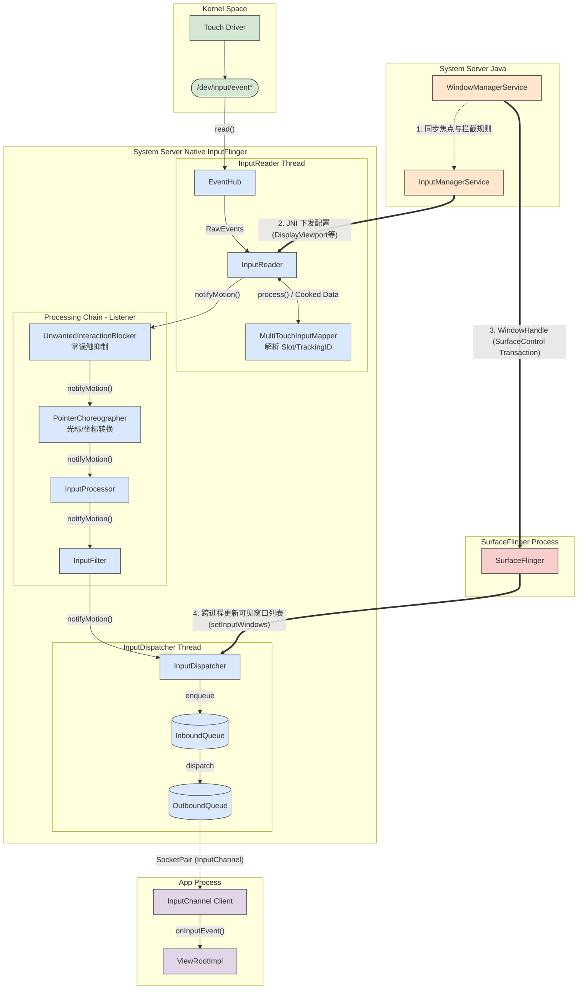
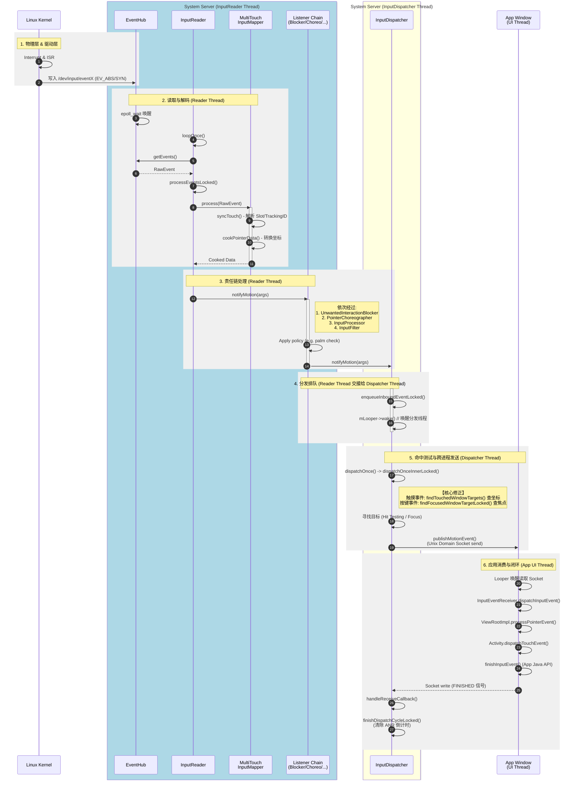
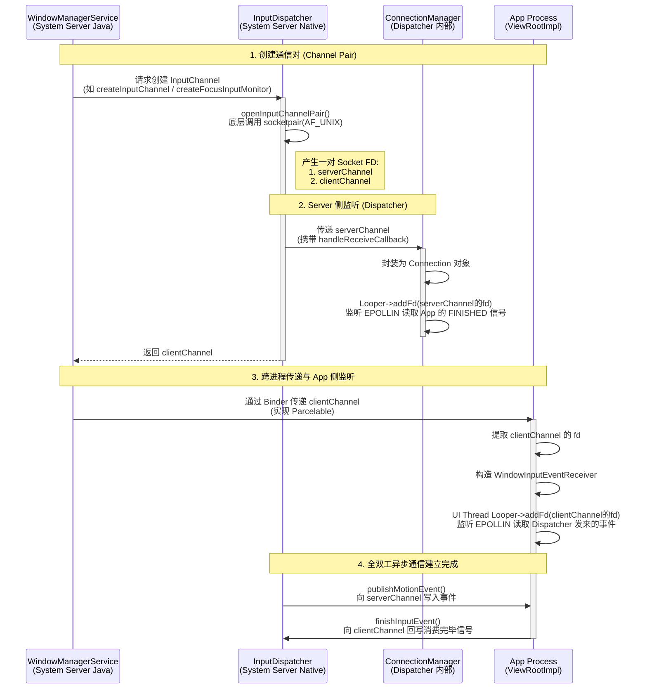
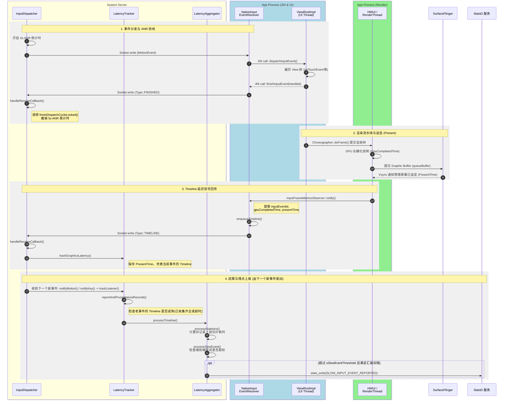

+++
date = '2025-09-29T10:22:54+08:00'
draft = false
title = 'Android InputFlinger'
+++

# Android InputFlinger

## 架构图




## 关键逻辑的实现与作用

在上述架构图中，Android Input 框架通过职责分离，将复杂的输入事件处理拆解为多个核心阶段。为了确保事件准确、安全、低延迟地送达 App，系统服务（WMS、IMS、SurfaceFlinger）与 Native Input 进行了深度的协同。以下是关键逻辑的实现细节与作用：

### 1. 事件读取与初步加工 (InputReader & Mapper)
*   **作用：** 负责监听底层 Linux 驱动（`/dev/input/event*`），将原始的、基于时间的散乱硬件中断信号（如 `EV_ABS`, `EV_SYN`），聚合为一个具有完整逻辑意义的 Android 输入事件（如一次完整的触摸滑动）。
*   **实现：** 
    *   **`EventHub`** 使用 `epoll` 机制死循环监听所有输入设备节点。
    *   **`MultiTouchInputMapper`** 是处理触摸屏的核心。它负责解析 Linux 驱动上报的多点触控协议（Protocol B），通过 `TrackingID` 和 `Slot` 追踪多根手指的按下、移动、抬起状态，最终将这些状态打包为统一的 `NotifyMotionArgs` 结构体。
    *   **IMS 交互：** InputManagerService 会通过 JNI 将设备的配置参数（如 `DisplayViewport`，即屏幕物理映射关系、旋转角度）传递给 Reader，用于基础的坐标边界转换。

### 2. 事件加工责任链 (Listener Pipeline)
*   **作用：** 在事件送达分发器之前，进行一系列拦截、过滤和坐标变换。由于采用了反向注入的责任链模式（Listener Pipeline），使得 InputFlinger 能够灵活插拔新的过滤规则。
*   **实现：** 
    *   **`UnwantedInteractionBlocker` (掌误触抑制)：** 调用 `PalmFilterImplementation` 评估触摸面积和轨迹，如果判定为手掌大面积误触（Palm Rejection），则会中途阻断该事件或发送 `ACTION_CANCEL`。
    *   **`PointerChoreographer` (指针编排器)：** 统一处理鼠标、触控板、手写笔的指针逻辑。它负责光标图标的绘制状态控制，并将鼠标的**相对移动坐标**转换为屏幕上的**绝对坐标**。
    *   **`InputFilter` (输入过滤)：** 将事件回调给 Java 层的 IMS，供无障碍服务（Accessibility）消费。如果开启了辅助功能，事件会在这里被拦截处理后再决定是否放行。

### 3. 跨进程窗口状态同步 (SurfaceFlinger -> InputDispatcher)
*   **作用：** 解决经典的“幽灵点击”和“焦点穿透”问题（Tapjacking）。这是现代 Android Input 架构中最重要的一次重构，确保了 InputDispatcher 决策时的窗口层级（Z-Order）和可见性，与用户在屏幕上真实看到的渲染画面绝对一致。
*   **实现：** 
    *   **WMS 赋权：** WindowManagerService 在管理窗口时，不再直接把窗口坐标传递给 Input。而是通过 `SurfaceControl.Transaction` 将包含了 `InputWindowHandle` 信息的属性附着在渲染图层上，提交给 **SurfaceFlinger**。
    *   **SF 裁决：** SurfaceFlinger 在完成所有图层的混合计算后，精准知道哪些图层在最顶端、哪些被完全遮挡（Occlusion）。
    *   **Binder 同步：** SurfaceFlinger 计算出最终真实的“屏幕可见窗口列表”，跨进程调用 `InputDispatcher::setInputWindows()`，将这份拥有绝对真实坐标和层级的列表交给 Input，Dispatcher 将其缓存为决策依据。

### 4. 坐标匹配与跨进程分发 (InputDispatcher & InputChannel)
*   **作用：** 根据触摸坐标或当前系统的焦点（由 WMS 指定），找到应该接收该事件的 App 窗口，并将其安全、无阻塞地跨进程发送过去。
*   **实现：**
    *   **目标寻找：** Dispatcher 遍历 SF 传来的可见窗口列表（从 Z 轴由高到低）。通过检查 `InputWindowInfo` 的 `TouchableRegion`（可触摸区域），找到第一个包含该坐标且状态为 `Touchable` 的窗口。
    *   **异步发送：** 找到目标后，将事件包装送入该连接的 `OutboundQueue`。Dispatcher 使用非阻塞的 Unix Domain Socket (`socketpair`) 通过 `InputPublisher` 将事件跨进程 `send()` 写入底层的 Socket 缓冲区。
    *   **App 消费与 ANR 机制：** App 进程的主线程 `ViewRootImpl` 监听到 Socket 的可读事件，解析出事件并沿 View 树（ViewGroup -> View）分发。**重点在于闭环：** App 消费完成后，必须调用 Java 层的 `finishInputEvent()`，进而向 Socket 回写一个 `FINISHED` 信号，Dispatcher 侧由 `handleReceiveCallback()` 接收并调用 `finishDispatchCycleLocked()` 清除追踪记录。如果 Dispatcher 将事件发出后，在预设时间（通常是 5 秒）内没有收到 App 的 finish 响应，就会触发 **ANR (Application Not Responding)**。

## 关键时序



### 时序流程深度源码解析

上面的时序图详细描绘了从手指触摸屏幕到应用处理完毕的完整生命周期，以下是结合 AOSP 源码对各个关键阶段的深度解析：

#### 1. 物理层与驱动层 (Kernel)
触摸屏硬件产生中断后，Linux 内核的 Input 子系统响应该中断，并将触控 IC 传来的坐标和压力等信息转化为标准的 Linux Input 协议（如 `EV_ABS`, `EV_SYN`），写入到对应的设备节点（如 `/dev/input/event2`）中。

#### 2. 读取与解码 (InputReader Thread)
*   **驱动轮询：** `InputReader` 线程的核心是一个名为 `loopOnce()` 的死循环。它首先调用 `EventHub::getEvents()`，该方法底层通过 `epoll_wait` 阻塞监听所有的 `/dev/input/event*` 节点。一旦有数据可读，内核唤醒该线程，并返回原始的 `RawEvent` 数组。
*   **解析组装：** Reader 调用 `processEventsLocked()` 将事件分发给对应的设备 Mapper。对于触摸屏，起作用的是 `MultiTouchInputMapper`。Mapper 的 `syncTouch()` 方法负责解析 Linux 的 Slot 协议和 Tracking ID，随后 `cookPointerData()` 将驱动的原始数据（Raw Data）转换为带有 Android 绝对坐标和逻辑的 `NotifyMotionArgs` 结构体。

#### 3. 责任链处理 (Listener Pipeline)
当 Mapper 将数据“煮熟 (cooked)”后，`InputReader` 会调用 `notifyMotion(args)` 启动责任链。正如架构图所示，事件在到达 Dispatcher 之前，会依次穿过一系列的 Listener：
1.  **UnwantedInteractionBlocker**：执行防误触策略（如掌托过滤 Palm Rejection）。
2.  **PointerChoreographer**：处理鼠标等指针设备的坐标和光标转换。
3.  **InputProcessor**：进行坐标的仿射变换（如处理屏幕旋转、折叠屏坐标映射）。
4.  **InputFilter**：拦截供无障碍服务 (Accessibility) 使用的事件。
最终，过滤后的纯净事件通过 `InputDispatcher::notifyMotion(args)` 交接给分发器。

#### 4. 线程交接与分发排队 (Reader -> Dispatcher)
*   **入队：** `InputDispatcher` 在自己的线程中运行。当它被 Reader 线程调用 `notifyMotion()` 时，会将事件包装为 `EventEntry`，并放入自己的 `InboundQueue` 中。
*   **唤醒：** 为了不阻塞 Reader 线程继续读取下一个硬件中断，入队后会立刻调用 `mLooper->wake()` 唤醒处于休眠状态的 Dispatcher 线程，Reader 线程随即返回。

#### 5. 命中测试与跨进程发送 (InputDispatcher Thread)
*   **目标寻找 (Hit Testing)：** Dispatcher 线程被唤醒后执行 `dispatchOnceInnerLocked()`。对于触摸事件（Touch），它调用 `findTouchedWindowTargets()`，利用 SurfaceFlinger 传来的可见窗口树，根据触控点的 X/Y 坐标进行从上到下的 Z 轴命中测试；而对于按键事件（Key），则调用 `findFocusedWindowTargetLocked()` 直接寻找拥有焦点的窗口。
*   **异步发送：** 找到目标后，Dispatcher 调用 `InputPublisher::publishMotionEvent()`。底层通过非阻塞的 Unix Domain Socket (`send` / `write`) 将事件序列化后发送给目标 App 进程。同时，Dispatcher 开始为该事件倒数 5 秒的 ANR 计时器。

#### 6. 应用消费与闭环 (App -> Dispatcher)
*   **应用处理：** App 进程的主线程 `Looper` 监听到 Socket 有数据可读，被唤醒后通过 `InputEventReceiver` 读取事件，随后一路向下分发至 `ViewRootImpl` 和 `Activity` 的 `onTouchEvent`。
*   **ANR 闭环 (核心)：** App 消费完事件后，无论结果如何，框架都会自动调用 Java 层的 `finishInputEvent()`。该方法会通过 JNI 和 Socket 向 Dispatcher 回写一个 `FINISHED` 信号。Dispatcher 线程在 `handleReceiveCallback()` 中监听到该信号，调用 `finishDispatchCycleLocked()`，将这笔交易的追踪记录删除，并**撤销该事件的 5 秒 ANR 倒计时**。至此，整个输入分发生命周期安全结束。


## 案例分析：Linux Raw 事件到 Android MotionEvent 的演化

为了深入理解 `InputReader` 和 `MultiTouchInputMapper` 的工作原理，我们通过抓取 `/dev/input/event2` 节点的真实驱动日志，分析一次“单指按下、轻微滑动、抬起”的完整生命周期。同时，我们将引入现代 Android 多点触控最核心的 **`Tracking_ID` 与 `Slot` 机制**。

### 核心概念：Tracking_ID 与 Slot 机制
在现代 Android 采用的 **Linux Multi-Touch Protocol B (Slot 协议)** 中，屏幕上的每一根独立手指都会被分配一个独一无二的 **`Tracking_ID`**。
* **Slot (槽位)**：驱动维护的容器，表示当前硬件支持的并发触控点（例如 10 指触控就有 10 个 Slot）。
* **Tracking_ID (生命周期ID)**：一旦手指接触屏幕，硬件就会在某个空闲的 Slot 中为其生成一个大于 0 的唯一 `Tracking_ID`。这个 ID 会伴随手指从按下、移动，一直到抬起（抬起时发送特殊的 `Tracking_ID = -1` 宣告死亡）。这是解决多指滑动轨迹混淆（鬼影问题）的物理基石。

### 手指按下 (ACTION_DOWN)
```txt
/dev/input/event2: EV_KEY       BTN_TOUCH            DOWN                
/dev/input/event2: EV_ABS       ABS_MT_TRACKING_ID   00000005            
/dev/input/event2: EV_ABS       ABS_MT_POSITION_X    000002b3            
/dev/input/event2: EV_ABS       ABS_MT_POSITION_Y    00000373            
/dev/input/event2: EV_ABS       ABS_MT_TOUCH_MAJOR   00000004            
/dev/input/event2: EV_ABS       ABS_MT_TOUCH_MINOR   00000003            
/dev/input/event2: EV_ABS       ABS_MT_PRESSURE      00000015            
/dev/input/event2: EV_SYN       SYN_REPORT           00000000            
```
*   **驱动上报**：Linux 内核采用 **“状态差分 (State Delta)”** 的方式上报数据。当手指刚接触屏幕时，驱动发送了接触状态 (`BTN_TOUCH DOWN`)、新分配的手指生命周期 ID (`ABS_MT_TRACKING_ID: 5`)、X/Y 坐标、接触面积 (`TOUCH_MAJOR/MINOR`) 以及压力值 (`PRESSURE`)。
*   **同步界限**：极度关键的 `EV_SYN / SYN_REPORT` 标志着**一帧数据组合的结束**。
*   **Mapper 处理**：`MultiTouchInputMapper` 的累加器收到 `SYN_REPORT` 后，会和上一帧（空状态）进行比对。发现新增了一个 `Tracking_ID` (5)，于是为这根手指分配一个 Android 框架层级的 `PointerId`（通常为 0），生成一个 **`ACTION_DOWN`** 发送给责任链。

### 手指微动/压力变化 (ACTION_MOVE)
```txt
/dev/input/event2: EV_ABS       ABS_MT_PRESSURE      00000016            
/dev/input/event2: EV_SYN       SYN_REPORT           00000000            
... 
/dev/input/event2: EV_ABS       ABS_MT_TOUCH_MAJOR   00000002            
/dev/input/event2: EV_ABS       ABS_MT_TOUCH_MINOR   00000002            
/dev/input/event2: EV_ABS       ABS_MT_PRESSURE      00000013            
/dev/input/event2: EV_SYN       SYN_REPORT           00000000            
```
*   **驱动上报**：在手指滑动和按压的过程中，内核**只发送改变的值**。比如紧接着的一帧只发了 `PRESSURE`，没发 `POSITION_X/Y`，说明坐标没动但压力变了。随后的帧中 `TOUCH_MAJOR` 和 `PRESSURE` 都在微调。
*   **Mapper 处理**：`InputReader` 将这些差分数据叠加更新到对应 `Slot` 的状态机上。每次遇到 `SYN_REPORT`，只要发现当前激活手指的属性（坐标、压力、面积等）发生了改变，就会生成一个 **`ACTION_MOVE`** 事件。为了性能，高频的微小 MOVE 事件后续可能会被 `InputDispatcher` 自动合并 (Batching)。

### 手指抬起 (ACTION_UP)
```txt
/dev/input/event2: EV_ABS       ABS_MT_PRESSURE      00000000            
/dev/input/event2: EV_ABS       ABS_MT_TRACKING_ID   ffffffff            
/dev/input/event2: EV_KEY       BTN_TOUCH            UP                  
/dev/input/event2: EV_SYN       SYN_REPORT           00000000
```
*   **特殊销毁信号**：驱动发送了 `PRESSURE = 0`，最关键的是发送了 **`ABS_MT_TRACKING_ID = ffffffff (-1)`**。在 Slot 协议中，`-1` 意味着这个槽位中手指的生命周期彻底结束。
*   **Mapper 处理**：`MultiTouchInputMapper` 读到 `Tracking_ID` 变为 `-1` 且收到 `SYN_REPORT` 时进行状态比对，确认屏幕上的触控点从 1 个变成了 0 个。此时：
    1. 生成 **`ACTION_UP`** 事件分发至 App。
    2. 释放内部绑定的 `PointerId` (归还 0)，重置该 Slot 槽位。
    3. 至此，完成了一次单指触摸手势的完整状态机闭环。


## 智能座舱多屏架构支持 (Multi-Display Input)

在智能座舱（Android Automotive OS, AAOS）或多屏互联场景中，车机通常包含中控屏 (Center Information Display, CID)、副驾屏 (Passenger Display)、甚至后排娱乐屏 (Rear Seat Entertainment, RSE)。`InputFlinger` 必须能够准确识别多个物理触摸设备，并将其产生的事件精准派发到对应屏幕的独立应用窗口中。

Android 的输入子系统通过一套严密的 **“设备绑定”** 与 **“分区路由”** 机制实现了多屏触控支持。

### 1. 设备的发现与物理屏幕绑定 (InputReader 层)
当一个新的触摸屏硬件（如通过 USB、I2C 或 GMSL 桥接的 I2C）接入时，内核会在 `/dev/input/` 下生成一个新的 `eventX` 节点。`InputReader` 的 `EventHub` 发现设备后，面临的核心问题是：**“这个触摸屏对应的是车里的哪一块屏幕？”**

*   **IDC 配置文件 (Input Device Configuration)：** 系统集成商通常会为每个触摸屏硬件提供一个 `.idc` 配置文件（通过 Vendor ID 和 Product ID 匹配）。在文件中可以声明：
    *   `touch.deviceType = touchScreen`（表明这是直接贴合在屏幕上的触摸层，而非远端触控板 `pointer`）。
*   **物理端口映射 (sysfs / Location)：** 车机系统可以通过读取设备的硬件连接拓扑（例如固定的 I2C 总线地址或 USB 端口物理路径 `location`）来区分中控触摸框和副驾触摸框。
*   **Viewport 注入与匹配：** WindowManager / DisplayManager 获知系统中点亮了多个屏幕后，会将所有屏幕的 `DisplayViewport`（包含逻辑显示器 ID、物理尺寸、对应的物理端口 `uniqueId`）下发给 Native 层的 `InputReader`。`InputReader` 会将物理触摸设备的 `location` 与 `DisplayViewport` 的 `uniqueId` 进行字符串匹配。
*   **打上标签 (Stamping)：** 匹配成功后，该 InputDevice 就会和具体的 `displayId`（如中控是 0，副驾是 2）绑定。当这块屏幕被触摸时，`MultiTouchInputMapper` 产出的每一个 `NotifyMotionArgs` 都会被**强制打上 `displayId` 标签**。

### 2. 多屏独立的可见窗口树 (SurfaceFlinger 层)
如前文架构图所述，SurfaceFlinger 负责向 `InputDispatcher` 同步真实的可见窗口列表。
在多屏环境下，SurfaceFlinger 会为**每一个物理显示器 (DisplayId)** 构建并混合一棵独立的 Layer 渲染树。当它通过 `setInputWindows()` 跨进程调用将窗口列表传递给 Input 层时，每一个 `InputWindowInfo` 数据结构中都严格包含着它所渲染在的 `displayId`。

### 3. 精准的跨屏派发隔离 (InputDispatcher 层)
当 `InputDispatcher` 收到一个带有屏幕标签（例如 `displayId = 2`，副驾屏）的 `MotionEvent` 时：
*   **分区命中测试 (Hit Testing)：** Dispatcher 在执行 `findTouchedWindowTargets()` 时，**只会遍历那些属于 `displayId == 2` 的可见窗口列表**，从 Z 轴顶层开始寻找可触摸区域 (`TouchableRegion`) 包含落点的窗口。
*   **绝对坐标隔离：** 即使中控屏（`displayId = 0`）上有一个设置了 `FLAG_SYSTEM_ERROR` 极高层级的全屏遮罩弹窗，只要触摸事件是副驾硬件产生的（携带 `displayId=2`），InputDispatcher 也绝对不会将事件误派发给中控屏的弹窗。坐标系（0,0）永远是相对于当前 `displayId` 对应屏幕的左上角。
*   **多屏多焦点管理 (Per-Display Focus)：** Android 10 之后引入了多屏独立焦点支持。`InputDispatcher` 内部不再维护唯一的全局焦点，而是维护一个映射表（针对不同的显示器维护各自的 Focused Window）。这意味着：驾驶员可以通过方向盘的实体按键控制中控屏的焦点并确认，而此时副驾乘客在副驾屏幕上输入文本（拥有副驾屏的输入焦点），两者在底层的事件路由管道上是完全平行、互不干扰的。

## 核心纽带：InputChannel 的跨进程通信机制

在 Android 窗口管理与输入系统中，`InputChannel` 是连接 System Server (InputDispatcher) 和 App 进程的核心桥梁。不管是常规的触摸窗口，还是用于焦点监控的 `FocusInputMonitor`，底层都是通过 `InputChannel::openInputChannelPair` 创建的一对 **Unix Domain Socket (socketpair)** 来实现全双工的跨进程通信。

下面通过 Mermaid 序列图结合 `createFocusInputMonitor` 等源码流程，详细展示 WMS、InputDispatcher 与 App 之间如何通过 `InputChannel` 建立通信纽带：



### 核心机制解析：

1. **`socketpair` 机制：** `InputChannel` 的底层不是 Binder，而是 `socketpair`。这是因为 Input 事件具有极高的实时性和高频性（如 120Hz 屏幕每秒产生 120 个 Move 事件），传统的 Binder 通信会因频繁的序列化和内存拷贝带来极高延迟，而 Unix Domain Socket 提供了基于内核内存直接映射的高效双向字节流通道。
2. **分离与交接：** 
    * **Dispatcher 侧：** 永远持有 `serverChannel`。在 `createFocusInputMonitor` 或常规窗口注册时，Dispatcher 会将 `serverChannel` 的文件描述符 (FD) 注册到自己的 `Looper` 中，设置回调函数为 `handleReceiveCallback`。这主要是为了监听 App 回写的 `FINISHED` 信号，从而终止 5 秒的 ANR 倒计时。
    * **WMS 侧：** 充当“媒人”。它向 InputManager 请求创建 Channel，拿到 `clientChannel` 后，不作保留，直接通过跨进程的 Binder（如 `IWindowSession.add()` 或焦点监听的回调）将其塞给 App 进程。
    * **App 侧：** 接手 `clientChannel` 后，将其绑定到 UI 线程（Main Thread）的 `MessageQueue/Looper` 中。底层对应的 C++ 类是 `NativeInputEventReceiver`。一旦 Dispatcher 通过 Socket 写入了触摸事件，App 的 `epoll_wait` 就会被唤醒，随即通过 Java 层的回调分发给视图树。
3. **安全与隔离：** 由于每一个窗口（或 Monitor）都拥有自己独立的 `InputChannel` pair，这就保证了极高的隔离性。Dispatcher 只会把事件精确 `send()` 给命中测试目标窗口所在的那个 Socket，其他进程绝不可能通过抓包或监听窃取到该窗口的触摸事件流。

## Input 性能监控与端到端延迟追踪 (Latency Tracking)

在现代 Android 系统（特别是高刷屏和车机等对流畅度要求极高的场景）中，单纯将事件派发给 App 并且不发生 ANR 是远远不够的。系统需要精确度量 **“跟手性”** ——即从用户手指接触屏幕（硬件中断），到最终画面在物理屏幕上产生相应变化（光子级响应）的 **端到端延迟 (End-to-End Latency)** 。

`InputDispatcher` 通过复用 `InputChannel` (Socket) 建立了一套严密的性能监控闭环。

### 1. 双重回调机制：Finished 与 Timeline
当 `InputDispatcher` 监听 App 端的 Socket 返回数据时，`handleReceiveCallback` 核心处理逻辑会解析两种完全不同的信号结构体：

```cpp
if (std::holds_alternative<InputPublisher::Finished>(*result)) {
    // 【分支 1：生命周期闭环】
    const InputPublisher::Finished& finish = std::get<InputPublisher::Finished>(*result);
    finishDispatchCycleLocked(currentTime, connection, finish.seq, finish.handled,
                              finish.consumeTime);
} else if (std::holds_alternative<InputPublisher::Timeline>(*result)) {
    // 【分支 2：渲染时间线追踪】
    if (shouldReportMetricsForConnection(*connection)) {
        const InputPublisher::Timeline& timeline = std::get<InputPublisher::Timeline>(*result);
        mLatencyTracker.trackGraphicsLatency(timeline.inputEventId,
                                             connection->getToken(),
                                             std::move(timeline.graphicsTimeline));
    }
}
```

#### 分支 1：`Finished` 信号 (ANR 防线)
*   **触发时机：** App 进程主线程执行完 `onTouchEvent` 等逻辑后，立即向 Socket 写入 `Finished` 结构体。
*   **作用：** `Dispatcher` 收到后，调用 `finishDispatchCycleLocked()`，携带序列号 (`seq`) 找到对应的分发记录并将其移除，**最重要的是撤销该事件的 5 秒 ANR 倒计时**。它只代表“代码执行完了”，并不代表“画面画出来了”。

#### 分支 2：`Timeline` 信号 (跟手性监控核心)
*   **触发时机：** App 消费完输入事件后，通常会触发 UI 树重绘（`Choreographer::doFrame`）。当 App 的渲染线程（RenderThread）将包含此次 UI 变更的图形缓冲区（Graphic Buffer）提交给 SurfaceFlinger，并且 SurfaceFlinger 最终将其**送显到物理屏幕 (Present)** 后，图形管道会向底层的 `InputChannel` 补发一条 `Timeline` 类型的消息。
*   **作用：** `Dispatcher` 将这条包含精准时间戳的消息交给 `mLatencyTracker`（延迟追踪器）。

### 2. LatencyTracker：拼接端到端时间线
`LatencyTracker` 负责将散落在系统各个角落的时间戳通过唯一的 `inputEventId` 拼接成一条完整的故事线：

1.  **内核读取时间 (ReadTime)：** `EventHub` 从 `/dev/input` 读到硬件中断的时间。
2.  **派发时间 (DispatchTime)：** `InputDispatcher` 将事件写入 Socket 的时间。
3.  **App 消费时间 (ConsumeTime)：** App 主线程开始处理该事件的时间。
4.  **送显时间 (GraphicsTimeline / PresentTime)：** GPU 完成渲染并由 Display Controller 点亮屏幕的时间（由 `Timeline` 信号带回）。

通过计算 **`PresentTime - ReadTime`**，系统就能得出精确到纳秒级的端到端触控延迟。如果该延迟频繁超过阈值（如 30ms-50ms，导致用户感觉“不跟手”或“掉帧”），系统底层（如 Perfetto/Systrace 埋点）就会将其记录为 Jank（卡顿）指标，供系统开发者进行图形栈或输入栈的性能调优。

### 3. Finished 与 Timeline 信号双轨时序图及埋点上报

为了更直观地展现从事件分发到“取消 ANR”，再到“计算端到端延迟”乃至“触发底层埋点上报”的全过程，我们绘制了如下的时序图。图中明确区分了 App 的 **UI 主线程**和 **RenderThread 渲染线程**，同时揭示了一个极其精妙的设计：**当前事件的最终耗时清算，往往是由下一个新事件的到来（作为时钟驱动）触发的**。



### 4. 关键疑问：是不是所有的 Touch 事件都会触发 TIMELINE？
**答案是：绝对不会。** 

`Timeline` 信号的本质是 **“UI 渲染流水线的反馈”**，只有当这个 Input 事件真实地导致了屏幕画面的改变**时，才会产生 `Timeline`。以下几种情况，App 只会回写 `Finished`，但**永远不会回写 `Timeline`：

1.  **没有触发 UI 重绘 (No Invalidation)：** 比如你在一个已经滑到底部的列表继续往下划，或者点击了一个没有任何点击效果的空白区域。App 的 `onTouchEvent` 会正常消费事件并返回 `Finished`，但由于没有调用 `invalidate()` 或 `requestLayout()`，`Choreographer` 不会安排新一帧的绘制，RenderThread 也就不会向 SurfaceFlinger 提交 Graphic Buffer，自然就没有 `Timeline` 回调。
2.  **事件被积攒合并 (Batching)：** 屏幕的报点率（如 120Hz）往往高于屏幕的刷新率（如 60Hz）。在两次 Vsync 信号之间，App 可能会收到多个 `ACTION_MOVE`。出于性能考虑，系统会将这些微小的 Move 事件合并。只有在这批合并事件的最后，UI 决定重绘时，才会对应产生一次 `Timeline`。
3.  **事件未被消费 (Unhandled)：** 如果所有的 View 都不拦截处理这个事件，它最终被抛弃或交由系统的 Fallback 逻辑处理，当前 App 的渲染管道根本不会介入，因此也不会有 `Timeline`。

这也是为什么在 Systrace/Perfetto 性能抓取分析中，我们只关心那些 **“有效触发了重绘的 Input 事件”** 的端到端延迟。`LatencyTracker` 在底层也会维护一个清理机制（如通过队列长度或时间过期淘汰），防止那些永远等不到 `Timeline` 的孤儿事件造成内存泄漏。

### 3. 延迟切片计算与埋点输出 (LatencyAggregator)
`LatencyTracker` 收集齐一帧完整的时间线后，会交由 `LatencyAggregator`（或 Android 14 引入的带有直方图的 `LatencyAggregatorWithHistograms`）进行处理。这是系统真正进行“耗时算账”的核心现场。在 `processStatistics` 方法中，系统会对整个链路进行**剥洋葱式的切片计算**，精准查出到底是哪一层导致了不跟手：

*   **硬件层耗时 (`eventToRead`)：** 内核读到驱动中断，距离事件实际发生的时间。
*   **系统输入框架耗时 (`readToDeliver`)：** Dispatcher 把事件发给 App，距离读到中断的时间。
*   **App 调度耗时 (`deliverToConsume`)：** App 主线程开始处理事件，距离 Dispatcher 发给它的时间。
*   **App 主线程逻辑耗时 (`consumeToFinish`)：** App 执行 `onTouchEvent` 等逻辑耗费的时间。
*   **App 渲染引擎耗时 (`consumeToGpuComplete`)：** HWUI/RenderThread 绘制完一帧画面提交给 GPU 的耗时。
*   **系统显示框架耗时 (`gpuCompleteToPresent`)：** SurfaceFlinger 图层合成并最终点亮物理屏幕 (Present) 的耗时。
*   **端到端延迟 (`endToEnd`)：** 屏幕真正点亮，距离用户最初按下的总耗时。

计算完成后，为了不影响性能，这些切片数据会被聚合进统计草图 (Sketches) 或直方图 (Histograms) 中，并通过 **StatsD** 服务批量上报为 `INPUT_EVENT_LATENCY_SKETCH` 原子指标。
同时，如果计算出的端到端延迟 (`endToEndLatency`) 超过了系统规定的阈值，`processSlowEvent` 方法会单独触发一次名为 `SLOW_INPUT_EVENT_REPORTED` 的高优埋点记录。

### 4. 如何查看 Input 延迟监控指标？

这些底层的性能埋点数据，是供开发者分析卡顿 (Jank) 和跟手性的核心资产。获取它们的方法主要分为命令行排查和代码级订阅两种：

#### 方式一：使用 dumpsys statsd 或 Perfetto (排查与分析)
系统会将收集到的原子指标 (Atoms) 存储在底层 statsd 服务中。你可以通过命令行快速查看：

```bash
# 查看所有被 statsd 记录的缓慢输入事件 (SLOW_INPUT_EVENT_REPORTED)
adb shell cmd stats print-stats | grep -i SLOW_INPUT_EVENT_REPORTED

# 获取 statsd 服务的详细状态和配置
adb shell dumpsys statsd
```

> **专家建议：** 纯文本的 StatsD 数据难以直观分析。Google 官方强推使用 **Perfetto (ui.perfetto.dev)** 抓取系统 Trace。当你在 Perfetto 中勾选了 `Input` 和 `Graphics` 数据源后，Perfetto 会在后台自动提取上述埋点，并在时间轴的 Input 轨道上直接将这些“延迟切片”以可视化的红绿块展示出来，让你一眼看出是哪一层的耗时导致了掉帧。

#### 方式二：通过代码编程订阅 (StatsManager API)
如果你正在开发性能监控 SDK、车机诊断工具或自动化压测框架，可以通过 Android 提供的 `StatsManager` API 编程订阅这些底层的 C++ 指标：

1. **Pull 方式拉取聚合草图 (`INPUT_EVENT_LATENCY_SKETCH`)：**
   由于聚合数据是积攒的，可以在系统级应用中注册 `OnPullAtomCallback` 定期拉取：
   ```java
   StatsManager statsManager = context.getSystemService(StatsManager.class);
   statsManager.setPullAtomCallback(
       FrameworkStatsLog.INPUT_EVENT_LATENCY_SKETCH,
       null, // metadata
       Executors.newSingleThreadExecutor(),
       (atomTag, data) -> {
           // data 列表中包含拉取到的序列化直方图/草图字节流
           // 解析返回的聚合草图数据，评估过去一段时间的整体跟手性
           return StatsManager.PULL_SUCCESS;
       }
   );
   ```

2. **Push 方式监听慢事件 (`SLOW_INPUT_EVENT_REPORTED`)：**
   慢事件属于即时触发的 Push 型指标。你需要通过 `StatsManager.addConfig()` 向 statsd 下发一个包含了匹配规则（Matcher）的 `StatsdConfig`（通常是 protobuf 格式），并注册一个 `PendingIntent`。
   当底层 `LatencyAggregator` 抛出 `SLOW_INPUT_EVENT_REPORTED` 时，statsd 会匹配规则，并通过 Broadcast 或 Service 唤醒你的 `PendingIntent`，你就能在代码里实时捕获到这次慢事件在“分发、消费、渲染、上屏”各个阶段的具体耗时数值了。


> **补充说明：按键事件的延迟追踪**
> 值得注意的是，除了触摸事件 (`notifyMotion`) 之外，`InputDispatcher::notifyKey()` 同样接入了这套延迟追踪体系。在源码中，如果开启了单设备输入延迟指标特性（`mPerDeviceInputLatencyMetricsFlag`），从实体按键（如音量键、电源键或外接键盘）产生的 `KeyEvent` 也会经过 `trackListener(args)`，参与端到端延迟的计算与打点。这对于车机方向盘按键或游戏手柄的响应调优同样至关重要。

### 5. 影响 Latency Tracking 的关键配置开关

在 `InputDispatcher` 的核心埋点代码中，有两个极其关键的变量会直接决定一个输入事件是否会被纳入端到端延迟的计算体系：`mInputFilterEnabled` 和 `mPerDeviceInputLatencyMetricsFlag`。

#### `mInputFilterEnabled` (全局输入过滤器开关)
*   **作用：** 决定是否因为“无障碍服务”而**放弃**延迟追踪。当 Android 系统中开启了某些无障碍服务（Accessibility Service，如 TalkBack）时，所有的触摸和按键事件都会先被拦截，发送到 Java 层的无障碍服务中处理，然后再由其决定是否重新注入系统。这种拦截会极大地拉长事件的物理生命周期。如果此时系统还去统计“端到端延迟”，得出的数据（动辄几百毫秒）是完全失真的。因此，出于严谨性考虑，只要该过滤器开启，系统就会主动放弃对这些事件的 Latency Tracking 埋点追踪。
*   **默认值与触发：** 默认为 `false`。只有当用户在系统设置中手动开启了需要接管全局事件的无障碍功能时，Java 层的 `InputManagerService` 才会向下跨进程将其置为 `true`。

#### `mPerDeviceInputLatencyMetricsFlag` (精细化外设延迟监控开关)
*   **作用：** 这是 Android 14/15 引入的一个极具价值的性能诊断特性。在过去的版本中，系统的输入延迟埋点是“一锅炖”的（屏幕滑动的延迟和外接蓝牙手柄的延迟被混在一起算平均值，导致难以排查）。而当这个 Flag 开启后，系统底层会执行两项重大改变：
    1.  **全面纳入按键事件：** 不仅追踪屏幕触摸事件（`notifyMotion`），还会额外把所有实体按键事件（`notifyKey`，如音量键、车机旋钮、游戏手柄按键）也一并纳入延迟追踪的生命周期。
    2.  **启用直方图与设备隔离：** 处理器会从旧版的普通聚合器切换为带有直方图且按厂商 ID (Vendor ID) / 产品 ID (Product ID) 区分的高精度统计类（`LatencyAggregatorWithHistograms`）。这对于智能座舱中多外设并发的精准调优极其关键。
*   **默认值与设置方法：** 
    该变量由 AOSP 的 `aconfig` 特性框架控制（定义在 `input_flags.aconfig` 的 `enable_per_device_input_latency_metrics` 标志中）。在 AOSP 开源主干上，它的默认值通常为 `false` 以节省内存开销。
    **如何在工程机上强行开启：** 测试人员或开发者可以通过 ADB 动态修改 `device_config` 命名空间来开启这个特性，以便在压测时抓取精细化数据：
    ```bash
    # 开启精细化按设备区分的输入延迟监控
    adb shell device_config put input_native_boot enable_per_device_input_latency_metrics true
    # 重启 Android Framework 服务生效
    adb shell stop && adb shell start
    ```

### 6. 专家级调试技巧：动态调整 SLOW_EVENT 判定阈值

在上文提到的 `SLOW_INPUT_EVENT_REPORTED` 慢事件埋点中，系统底层默认有两个硬编码的限制：

1. **触发阈值 (Threshold)：默认 200ms**
   只有当一个触摸事件的端到端总延迟 (`endToEndLatency`) 大于 200 毫秒时，系统才认为这是一次“严重卡顿 (Jank)”并触发埋点。
2. **上报冷却时间 (Reporting Interval)：默认 60000ms (1 分钟)**
   为了防止某个 App 突然抽风导致底层疯狂打埋点拖垮性能，系统做了一个“1分钟漏斗”。如果距离上一次上报还不到 1 分钟，后续即使再出现超过 200ms 的慢事件，系统也会静默跳过。

**如何在压测时打破这些限制？**

这两个硬编码的默认值其实是由 Android 的 `Device Config` (server_configurable_flags) 机制包裹的。这意味着我们可以**不修改 C++ 源码、不重新编译系统**，直接通过 ADB 动态调整这些底层参数！

如果你正在进行极其严格的跟手性压测（例如想把所有超过 50ms 的轻微掉帧事件全抓出来），并且希望每次卡顿必定上报（关闭 1 分钟冷却期），你只需要在终端执行以下命令：

```bash
# 1. 把阈值从默认的 200ms 降为 50ms（极其严格的跟手性测试！）
adb shell device_config put input_native_boot slow_event_min_reporting_latency_millis 50

# 2. 把上报冷却时间从 1分钟 (60000) 降为 0（关掉冷却，有卡必报）
adb shell device_config put input_native_boot slow_event_min_reporting_interval_millis 0

# 3. 强制重启 Android Framework 让参数立即生效
adb shell stop && adb shell start
```

结合我们在底层源码（`LatencyAggregator.cpp`）中自行添加的 `ALOGW` 蜗牛报警日志，修改这两个参数后，你就能在 `logcat` 中极其敏锐、无遗漏地抓出所有掉帧窗口和耗时明细，是智能座舱与高刷手机性能调优的终极利器！
