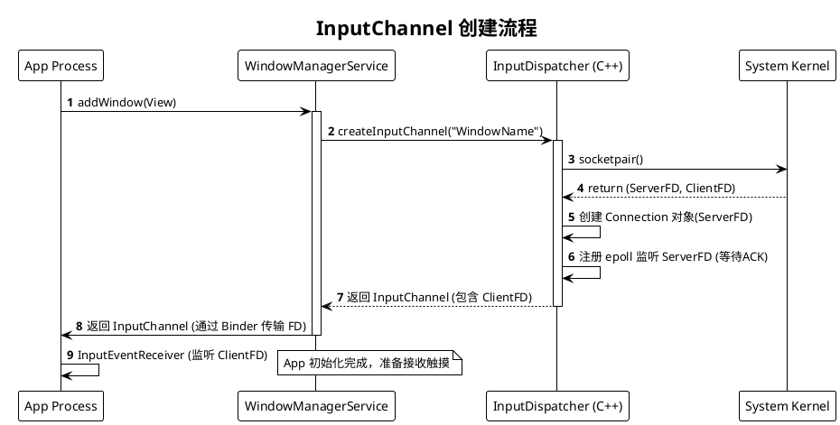
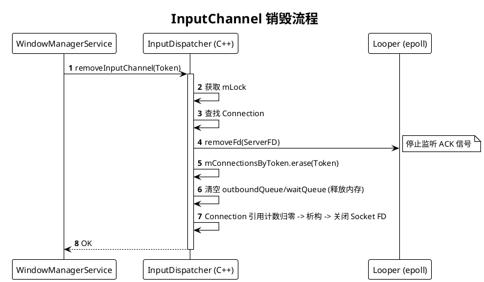

# Android InputChannel 原理与生命周期详解

## 1. 什么是 InputChannel？

**InputChannel** 是 Android 输入系统（Input System）中用于跨进程传输输入事件（如触摸、按键）的核心通信机制。

简单来说，它是连接 **SystemServer (InputDispatcher)** 和 **应用程序 (App Window)** 之间的一条**全双工管道**。

### 核心特性

* **基于 Socket Pair**：底层通过 Linux 的 `socketpair` (AF_UNIX, SOCK_SEQPACKET) 实现。这意味着它不仅仅是单向通知，还支持双向通信（事件发送 -> 处理完成 ACK）。
* **跨进程传输**：通过 Binder 将 Client 端的文件描述符（FD）传递给应用进程。
* **无锁/高性能**：利用 Socket 缓冲区传输数据，结合 `epoll` 机制，不需要复杂的 Binder 调用即可完成高频的 MotionEvent 传输。


## 2. InputChannel 的架构模型

每个能够接收触摸事件的窗口（Window），在 SystemServer 端都对应一个 `Connection` 对象，该对象持有一个 Server 端的 `InputChannel`。

* **Server 端 (InputDispatcher)**: 持有 Socket 的一端（写端），负责写入 InputEvent。
* **Client 端 (App Window)**: 持有 Socket 的另一端（读端），负责读取 InputEvent，并回复 Finished 信号。


## 3. 生命周期：创建 (Creation)

InputChannel 的创建伴随着窗口（Window）的添加过程。

### 触发时机

当应用请求 `WindowManagerService` (WMS) 添加窗口时（调用 `addWindow`），WMS 会请求 `InputManagerService` 创建通道。

### 核心流程 (基于源码)

1. **Java 层发起**: `WindowManagerService` 调用 `InputManagerService.createInputChannel()`.
2. **JNI 层**: `nativeCreateInputChannel` 调用 Native 层的 `NativeInputManager`.
3. **Dispatcher 层**: 进入 `InputDispatcher::createInputChannel(name)`.

### 源码解析 (`InputDispatcher.cpp`)

在 `createInputChannel` 方法中，发生了以下关键步骤：

```cpp
Result<std::unique_ptr<InputChannel>> InputDispatcher::createInputChannel(const std::string& name) {
    // 1. 创建 Socket Pair (一对文件描述符)
    // 这是一个系统调用，生成 serverChannel 和 clientChannel
    status_t result = InputChannel::openInputChannelPair(name, serverChannel, clientChannel);

    { // acquire lock
        // 2. 获取全局锁 mLock (这就是我们之前讨论的竞争点)
        std::scoped_lock _l(mLock);
        
        const sp<IBinder>& token = serverChannel->getConnectionToken();
        int fd = serverChannel->getFd();
        
        // 3. 创建 Connection 对象
        // Connection 包装了 serverChannel，用于跟踪窗口的输入状态（如是否无响应、队列积压等）
        sp<Connection> connection =
                new Connection(std::move(serverChannel), false /*monitor*/, mIdGenerator);

        // 4. 存入 Map 管理
        // mConnectionsByToken 用于根据 WindowToken 快速找到对应的连接
        mConnectionsByToken.emplace(token, connection);

        // 5. 注册到 Looper (epoll)
        // 监听 Server 端 FD 的 ALOOPER_EVENT_INPUT 事件。
        // 主要目的是接收 App 端处理完事件后发回来的 "Finished" (ACK) 信号。
        mLooper->addFd(fd, 0, ALOOPER_EVENT_INPUT, new LooperEventCallback(callback), nullptr);
    } 

    // 6. 返回 clientChannel 给应用进程
    return clientChannel;
}

```

### 创建流程时序图




## 4. 作用与通信机制 (Dispatching)

InputChannel 建立后，它的核心作用就是**传输事件**和**同步状态**。

### 发送事件 (System -> App)

当 `InputDispatcher` 决定将事件分发给某个窗口时，它会查找对应的 `Connection`，将事件写入 Socket。

* **函数**: `InputPublisher::publishMotionEvent`
* **行为**: 序列化 `MotionEvent` 并 `write` 到 Server 端 FD。

### 接收反馈 (App -> System)

App 处理完事件后，**必须**通知 System Server，否则会导致 ANR。

1. App 处理完事件，调用 `finishInputEvent()`。
2. App 向 Client 端 FD 写入一个信号。
3. `InputDispatcher` 的 Looper (epoll) 收到 `ALOOPER_EVENT_INPUT`。
4. 回调 `handleReceiveCallback` -> `finishDispatchCycleLocked`。
5. 系统将其从 `waitQueue` 移除，继续分发下一个事件。


## 5. 生命周期：移除 (Removal)

当窗口销毁、应用崩溃或主动移除时，InputChannel 需要被销毁。

### 触发时机

`WindowManagerService.removeWindow` 或 Binder 死亡代理（Death Recipient）触发。

### 源码解析 (`InputDispatcher.cpp`)

```cpp
status_t InputDispatcher::removeInputChannelLocked(const sp<IBinder>& connectionToken, bool notify) {
    // 1. 查找连接
    sp<Connection> connection = getConnectionLocked(connectionToken);
    
    // 2. 从 mConnectionsByToken 中移除
    removeConnectionLocked(connection);

    // 3. 从 Looper 中移除监听
    // 不再接收该 FD 的消息
    mLooper->removeFd(connection->inputChannel->getFd());

    // 4. 清理积压的事件
    // 如果队列里还有没发出去的事件，释放它们
    abortBrokenDispatchCycleLocked(currentTime, connection, notify);

    // 5. 标记为僵尸状态
    connection->status = Connection::Status::ZOMBIE;
    return OK;
}

```

### 移除流程时序图




## 6. 总结：关键设计点

1. **为什么需要 Connection 对象？**
`InputChannel` 只是一个管道。`Connection` 是 `InputDispatcher` 用来管理这个管道的“控制块”。它记录了：
* `outboundQueue`: 准备发送给 App 的事件。
* `waitQueue`: 已经发送但 App 还没回复 ACK 的事件（用于检测 ANR）。
* `responsive`: 窗口是否未响应。


2. **锁的作用 (`mLock`)**:
在 `createInputChannel` 和 `removeInputChannel` 中，**必须持有 `mLock**`。
* 这是为了保护 `mConnectionsByToken` 哈希表和 `mLooper` 的注册状态。
* **风险点**: 如我们之前调查的 Bug 所示，如果 App 启动/销毁过于频繁，WMS 会疯狂调用这两个方法，导致 `mLock` 被频繁持有，从而阻塞负责分发事件的 Binder 线程（`setInputWindows` 也需要这个锁）。


3. **双向通信的重要性**:
InputChannel 不仅仅是“投递”事件。App 处理完必须“回复”。这种机制让系统知道 App 是否卡死（ANR）。如果 `waitQueue` 里的事件超时未收到 ACK，系统就会判定 ANR。