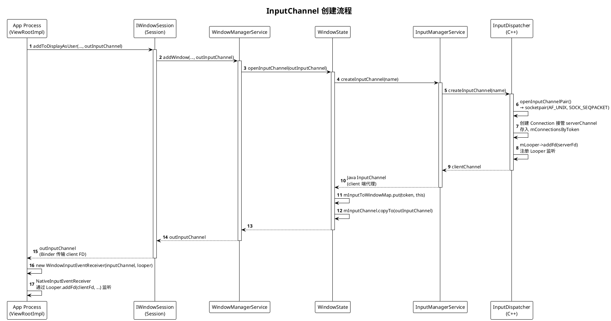
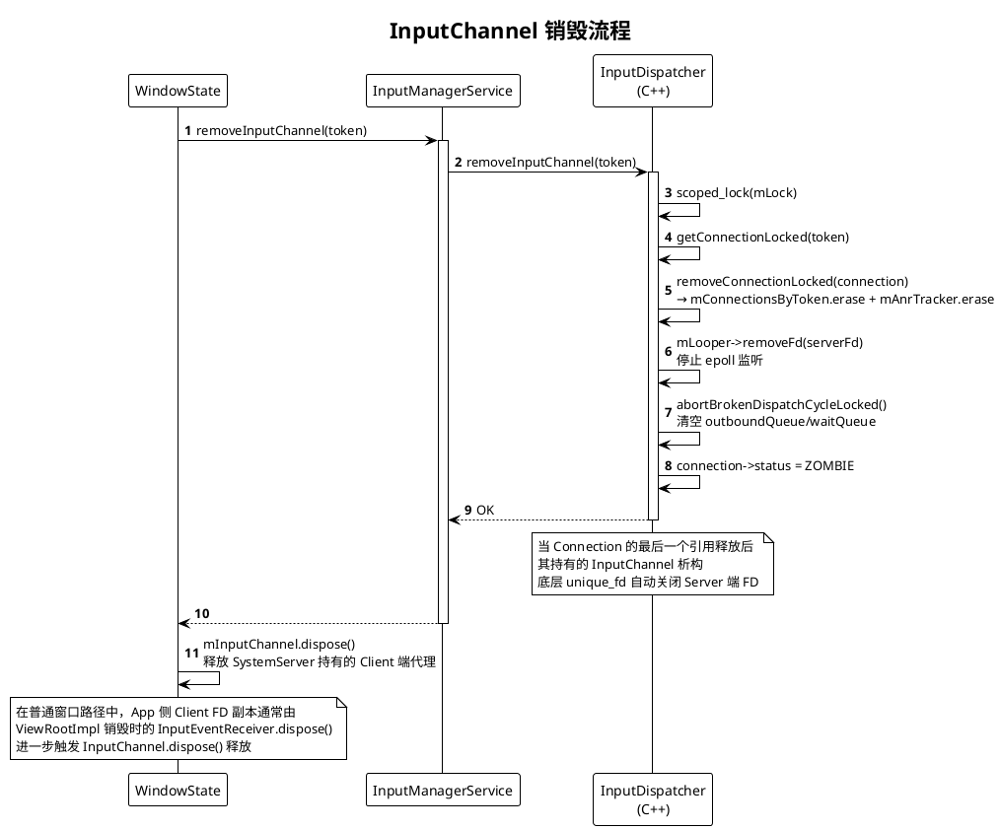

+++
date = '2025-09-29T10:22:54+08:00'
draft = false
title = 'Android InputChannel 原理与生命周期详解'
+++

## 概述

`InputChannel` 是 Android 输入系统中用于跨进程传输输入事件的核心通信机制。它连接 `InputDispatcher`（运行在 `system_server`）和应用窗口（运行在 App 进程），承载所有类型的输入事件，包括触摸、按键、拖拽等。

### 核心特性

- **基于 Socket Pair**：底层通过 `socketpair(AF_UNIX, SOCK_SEQPACKET, 0, sockets)` 创建，两端共享同一个 `BBinder` token 用于标识关联关系。
- **双向通信**：Server 端写入事件、读取完成确认；Client 端读取事件、写回完成确认。不是单向投递，而是带有 ACK 机制的请求-响应模型。
- **高性能**：通过 `::send()` 系统调用直接写入 Socket 缓冲区，结合 `epoll` 监听，绕过 Binder 调用开销，适合高频 `MotionEvent` 场景。
- **跨进程传输**：Client 端 `InputChannel` 通过 Binder 的 `writeUniqueFileDescriptor` / `readUniqueFileDescriptor` 将文件描述符传递给应用进程。

## 核心数据结构

### InputChannel

定义在 `frameworks/native/libs/input/InputTransport.cpp`。

每个 `InputChannel` 实例持有三个关键成员：

- `mFd`：底层 Socket 文件描述符
- `mToken`：`sp<IBinder>` 类型，Server 和 Client 两端共享同一个 token，系统通过它将窗口映射到对应的连接
- `mName`：通道名称，用于调试，格式为 `"窗口名 (server)"` / `"窗口名 (client)"`

`openInputChannelPair` 创建一对通道时，会为两端的 Socket 设置 `SO_SNDBUF` / `SO_RCVBUF` 缓冲区大小（`SOCKET_BUFFER_SIZE`）：

```cpp
// InputTransport.cpp
sp<IBinder> token = new BBinder();

std::string serverChannelName = name + " (server)";
android::base::unique_fd serverFd(sockets[0]);
outServerChannel = InputChannel::create(serverChannelName, std::move(serverFd), token);

std::string clientChannelName = name + " (client)";
android::base::unique_fd clientFd(sockets[1]);
outClientChannel = InputChannel::create(clientChannelName, std::move(clientFd), token);
```

### Connection

定义在 `frameworks/native/services/inputflinger/dispatcher/Connection.h`。

`Connection` 是 `InputDispatcher` 管理每条通道的控制块，包装 Server 端 `InputChannel` 并跟踪分发状态：

```cpp
class Connection : public RefBase {
public:
    enum class Status {
        NORMAL,   // 正常工作
        BROKEN,   // 不可恢复的通信错误
        ZOMBIE,   // 通道已注销，等待引用释放
    };

    Status status;
    std::shared_ptr<InputChannel> inputChannel; // Server 端通道，不为 null
    bool monitor;                               // 是否为全局监控通道
    InputPublisher inputPublisher;              // 负责序列化并写入事件
    InputState inputState;                      // 追踪输入状态（按键/触摸的 down/up 配对等）
    bool responsive = true;                    // 窗口是否仍在响应

    std::deque<DispatchEntry*> outboundQueue;  // 待发送给 App 的事件
    std::deque<DispatchEntry*> waitQueue;      // 已发送但未收到 ACK 的事件
};
```

`outboundQueue` 和 `waitQueue` 的配合是 ANR 检测的基础：事件从 `outboundQueue` 取出、通过 `InputPublisher` 写入 Socket 后，转移到 `waitQueue`；收到 App 的完成确认后，从 `waitQueue` 移除。如果 `waitQueue` 中的事件超时未收到确认，系统判定 ANR。

## 生命周期

### 创建

InputChannel 的创建伴随窗口添加过程。按当前实现，窗口侧的完整调用链是：

```text
ViewRootImpl.setView()
  → IWindowSession.addToDisplayAsUser(..., outInputChannel, ...)
    → Session.addToDisplayAsUser(...)
      → WMS.addWindow(...)
        → WindowState.openInputChannel(outInputChannel)
          → InputManagerService.createInputChannel(name)
            → [JNI] NativeInputManagerService.createInputChannel(name)
              → InputDispatcher::createInputChannel(name)
```

`WindowState.openInputChannel()` 是 Java 层的入口：

```java
// WindowState.java
void openInputChannel(InputChannel outInputChannel) {
    String name = getName();
    mInputChannel = mWmService.mInputManager.createInputChannel(name);
    mInputChannelToken = mInputChannel.getToken();
    mInputWindowHandle.setToken(mInputChannelToken);
    mWmService.mInputToWindowMap.put(mInputChannelToken, this);
    if (outInputChannel != null) {
        mInputChannel.copyTo(outInputChannel);
    }
}
```

最终在 `InputDispatcher::createInputChannel` 中完成核心工作：

```cpp
// InputDispatcher.cpp
Result<std::unique_ptr<InputChannel>> InputDispatcher::createInputChannel(const std::string& name) {
    std::unique_ptr<InputChannel> serverChannel;
    std::unique_ptr<InputChannel> clientChannel;
    status_t result = InputChannel::openInputChannelPair(name, serverChannel, clientChannel);
    // ... error check ...

    { // acquire lock
        std::scoped_lock _l(mLock);
        const sp<IBinder>& token = serverChannel->getConnectionToken();
        int fd = serverChannel->getFd();
        sp<Connection> connection =
                new Connection(std::move(serverChannel), false /*monitor*/, mIdGenerator);

        mConnectionsByToken.emplace(token, connection);

        std::function<int(int events)> callback = std::bind(
                &InputDispatcher::handleReceiveCallback, this, std::placeholders::_1, token);
        mLooper->addFd(fd, 0, ALOOPER_EVENT_INPUT, new LooperEventCallback(callback), nullptr);
    } // release lock

    mLooper->wake();
    return clientChannel;
}
```

关键步骤：

1. `openInputChannelPair` 创建 Socket Pair，生成共享同一 token 的 server/client 两个 `InputChannel`
2. 用 server 端创建 `Connection` 对象，存入 `mConnectionsByToken`
3. 将 server 端 FD 注册到 Looper（epoll），监听 `ALOOPER_EVENT_INPUT`，回调函数为 `handleReceiveCallback`
4. 唤醒 Looper，返回 client 端给调用方

这里最容易混淆的一点是：`InputDispatcher::createInputChannel()` 返回给 Java 的是 `clientChannel`；`serverChannel` 已经在 native 层被 `Connection` 接管并加入 `mConnectionsByToken`。因此，`WindowState.mInputChannel` 持有的是 SystemServer 进程中的 client 端代理，而不是 `InputDispatcher` 中用于分发事件的 server 端连接。

返回的 `clientChannel` 经 JNI 包装为 Java `InputChannel` 对象，再通过 `copyTo` 写入 `outInputChannel`（Parcelable），最终由 Binder 传输 FD 到 App 进程。

App 进程收到后，在 `ViewRootImpl` 中创建 `WindowInputEventReceiver`（继承自 `InputEventReceiver`）。其底层 native `InputEventReceiver` 会把 client 端 FD 注册到 `MessageQueue` 绑定的 `Looper` 上，开始监听输入事件：

```java
// ViewRootImpl.java
mInputEventReceiver = new WindowInputEventReceiver(inputChannel, Looper.myLooper());
```

#### 创建流程时序图


```plantuml
@startuml
!theme plain
title InputChannel 创建流程

participant "App Process\n(ViewRootImpl)" as App
participant "IWindowSession\n(Session)" as IWS
participant "WindowManagerService" as WMS
participant "WindowState" as WS
participant "InputManagerService" as IMS
participant "InputDispatcher\n(C++)" as ID

autonumber

App -> IWS: addToDisplayAsUser(..., outInputChannel)
activate IWS

IWS -> WMS: addWindow(..., outInputChannel)
activate WMS

WMS -> WS: openInputChannel(outInputChannel)
activate WS

WS -> IMS: createInputChannel(name)
activate IMS

IMS -> ID: createInputChannel(name)
activate ID

ID -> ID: openInputChannelPair()\n→ socketpair(AF_UNIX, SOCK_SEQPACKET)
ID -> ID: 创建 Connection 接管 serverChannel\n存入 mConnectionsByToken
ID -> ID: mLooper->addFd(serverFd)\n注册 Looper 监听

ID --> IMS: clientChannel
deactivate ID

IMS --> WS: Java InputChannel\n(client 端代理)
deactivate IMS

WS -> WS: mInputToWindowMap.put(token, this)
WS -> WS: mInputChannel.copyTo(outInputChannel)

WS --> WMS
deactivate WS

WMS --> IWS: outInputChannel
deactivate WMS

IWS --> App: outInputChannel\n(Binder 传输 client FD)
deactivate IWS

App -> App: new WindowInputEventReceiver(inputChannel, looper)
App -> App: NativeInputEventReceiver\n通过 Looper.addFd(clientFd, ...) 监听

@enduml
```

### 事件分发

InputChannel 建立后，承担事件传输和状态同步两个职责。

#### System -> App：写入事件

`InputDispatcher` 决定将事件分发给某个窗口时，找到对应的 `Connection`，通过 `InputPublisher` 写入 Socket：

```cpp
// InputDispatcher.cpp — startDispatchCycleLocked
while (connection->status == Connection::Status::NORMAL && !connection->outboundQueue.empty()) {
    DispatchEntry* dispatchEntry = connection->outboundQueue.front();
    // ...
    switch (eventEntry.type) {
        case EventEntry::Type::KEY:
            status = connection->inputPublisher.publishKeyEvent(/* ... */);
            break;
        case EventEntry::Type::MOTION:
            status = connection->inputPublisher.publishMotionEvent(/* ... */);
            break;
        case EventEntry::Type::DRAG:
            status = connection->inputPublisher.publishDragEvent(/* ... */);
            break;
        // ...
    }

    // 发送成功后，从 outboundQueue 移到 waitQueue
    connection->outboundQueue.erase(/* dispatchEntry */);
    connection->waitQueue.push_back(dispatchEntry);
    if (connection->responsive) {
        mAnrTracker.insert(dispatchEntry->timeoutTime,
                           connection->inputChannel->getConnectionToken());
    }
}
```

如果 Socket 缓冲区满（`WOULD_BLOCK`），`InputDispatcher` 不会丢弃事件，而是停止当前分发循环，等待 App 消费已有事件后腾出缓冲区空间再继续。

底层写入通过 `InputChannel::sendMessage` 完成，调用 `::send()` 系统调用，使用 `MSG_DONTWAIT | MSG_NOSIGNAL` 标志。

#### App -> System：完成确认

App 处理完事件后，必须回复完成确认，否则 `waitQueue` 中事件超时将触发 ANR。

流程如下：

1. App 侧 `InputEventReceiver.finishInputEvent(event, handled)` 通过 JNI 调用 `nativeFinishInputEvent`，向 Client 端 FD 写入 `Finished` 响应
2. `InputDispatcher` 的 Looper 收到 Server 端 FD 上的 `ALOOPER_EVENT_INPUT` 事件
3. 触发 `handleReceiveCallback`，调用 `inputPublisher.receiveConsumerResponse()`
4. 响应类型为 `std::variant<Finished, Timeline>`：
   - `Finished`：携带 `seq`（序列号）、`handled`（是否消费）、`consumeTime`（消费时间），进入 `finishDispatchCycleLocked`
   - `Timeline`：携带图形延迟数据，交给 `mLatencyTracker` 处理
5. `finishDispatchCycleLocked` 投递命令到 `doDispatchCycleFinishedCommand`，在其中完成 `waitQueue` 清理和后续分发

```cpp
// InputDispatcher.cpp — handleReceiveCallback (核心循环)
for (;;) {
    Result<InputPublisher::ConsumerResponse> result =
            connection->inputPublisher.receiveConsumerResponse();
    if (!result.ok()) break;

    if (std::holds_alternative<InputPublisher::Finished>(*result)) {
        const InputPublisher::Finished& finish = std::get<InputPublisher::Finished>(*result);
        finishDispatchCycleLocked(currentTime, connection, finish.seq,
                                  finish.handled, finish.consumeTime);
    } else if (std::holds_alternative<InputPublisher::Timeline>(*result)) {
        // 图形延迟追踪
        mLatencyTracker.trackGraphicsLatency(/* ... */);
    }
}
```

### 销毁

InputChannel 的销毁有两条路径：

- **主动移除**：窗口销毁时，`WindowState.disposeInputChannel()` 主动调用 `InputManagerService.removeInputChannel(token)`
- **被动检测**：`handleReceiveCallback` 检测到 Socket 挂断（`ALOOPER_EVENT_HANGUP`）或错误（`ALOOPER_EVENT_ERROR`），直接调用 `removeInputChannelLocked`

`WindowState.disposeInputChannel()` 的 Java 层实现：

```java
// WindowState.java
void disposeInputChannel() {
    if (mInputChannelToken != null) {
        mWmService.mInputManager.removeInputChannel(mInputChannelToken);
        mWmService.mKeyInterceptionInfoForToken.remove(mInputChannelToken);
        mWmService.mInputToWindowMap.remove(mInputChannelToken);
        mInputChannelToken = null;
    }
    if (mInputChannel != null) {
        mInputChannel.dispose();
        mInputChannel = null;
    }
}
```

Native 层 `removeInputChannelLocked` 的完整实现：

```cpp
// InputDispatcher.cpp
status_t InputDispatcher::removeInputChannelLocked(const sp<IBinder>& connectionToken,
                                                   bool notify) {
    sp<Connection> connection = getConnectionLocked(connectionToken);
    if (connection == nullptr) {
        return BAD_VALUE;
    }

    removeConnectionLocked(connection);          // 从 mConnectionsByToken 移除，清理 AnrTracker

    if (connection->monitor) {
        removeMonitorChannelLocked(connectionToken);  // 如果是监控通道，额外清理
    }

    mLooper->removeFd(connection->inputChannel->getFd());  // 取消 epoll 监听

    nsecs_t currentTime = now();
    abortBrokenDispatchCycleLocked(currentTime, connection, notify);  // 清空 outboundQueue/waitQueue

    connection->status = Connection::Status::ZOMBIE;  // 标记为僵尸，等待引用释放后析构
    return OK;
}
```

`abortBrokenDispatchCycleLocked` 负责清空两个队列并释放其中的 `DispatchEntry`。如果连接原本处于 `NORMAL` 状态，会将其标记为 `BROKEN` 并通知系统策略层。

外层 `removeInputChannel` 在调用 `removeInputChannelLocked` 后，还会调用 `mLooper->wake()` 唤醒 Looper，因为连接变化可能影响当前的同步状态。

这里也需要和创建流程对应起来理解：`removeInputChannelLocked()` 处理的是 `InputDispatcher` 内部 `Connection` 持有的 server 端连接；`WindowState.mInputChannel.dispose()` 释放的则是 SystemServer 进程中持有的 client 端 Java 代理。两者不是同一个对象。

#### 销毁流程时序图


```plantuml
@startuml
!theme plain
title InputChannel 销毁流程

participant "WindowState" as WS
participant "InputManagerService" as IMS
participant "InputDispatcher\n(C++)" as ID

autonumber

WS -> IMS: removeInputChannel(token)
activate IMS

IMS -> ID: removeInputChannel(token)
activate ID

ID -> ID: scoped_lock(mLock)
ID -> ID: getConnectionLocked(token)
ID -> ID: removeConnectionLocked(connection)\n→ mConnectionsByToken.erase + mAnrTracker.erase
ID -> ID: mLooper->removeFd(serverFd)\n停止 epoll 监听
ID -> ID: abortBrokenDispatchCycleLocked()\n清空 outboundQueue/waitQueue
ID -> ID: connection->status = ZOMBIE

ID --> IMS: OK
deactivate ID

note over ID: 当 Connection 的最后一个引用释放后\n其持有的 InputChannel 析构\n底层 unique_fd 自动关闭 Server 端 FD

IMS --> WS
deactivate IMS

WS -> WS: mInputChannel.dispose()\n释放 SystemServer 持有的 Client 端代理

note over WS: 在普通窗口路径中，App 侧 Client FD 副本通常由\nViewRootImpl 销毁时的 InputEventReceiver.dispose()\n进一步触发 InputChannel.dispose() 释放

@enduml
```

## 关键设计考量

### 为什么不用 Binder 传输事件

Binder 调用涉及用户态-内核态切换和线程池调度，延迟在微秒到毫秒级。触摸事件的分发频率通常为 60-240Hz，使用 Socket + epoll 方案可以在纳秒级完成缓冲区读写，并且避免了 Binder 线程池的竞争。

### Connection 作为控制块的必要性

`InputChannel` 只是传输管道。`Connection` 在其之上维护分发状态：
- `outboundQueue` / `waitQueue` 实现了流控和超时检测
- `responsive` 标记避免向无响应窗口继续发送事件
- `InputPublisher` 封装了序列化和序列号管理
- `InputState` 追踪按键/触摸的 down/up 配对，确保窗口切换时状态一致

### mLock 的竞争风险

`createInputChannel` 和 `removeInputChannelLocked` 都需要持有 `InputDispatcher` 的全局锁 `mLock`。这个锁同时保护 `mConnectionsByToken`、`mLooper` 注册状态和事件分发路径（`setInputWindows` 也需要它）。如果窗口高频创建/销毁，会导致 `mLock` 被频繁竞争，从而阻塞负责分发事件的线程。

### Monitor Channel

除了普通窗口通道，`InputDispatcher` 还支持 Monitor Channel（通过 `createInputMonitor`），用于系统级的全局事件监控。Monitor Channel 的创建流程与普通通道类似，但会额外注册到 `mGlobalMonitorsByDisplay`，并且在 Socket 挂断时不会产生告警（因为 Monitor 不会被显式注销）。
