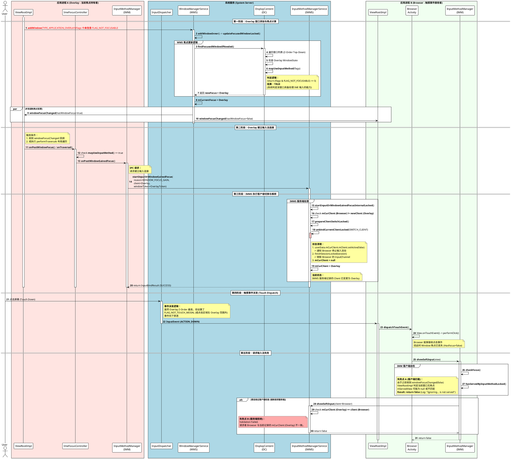
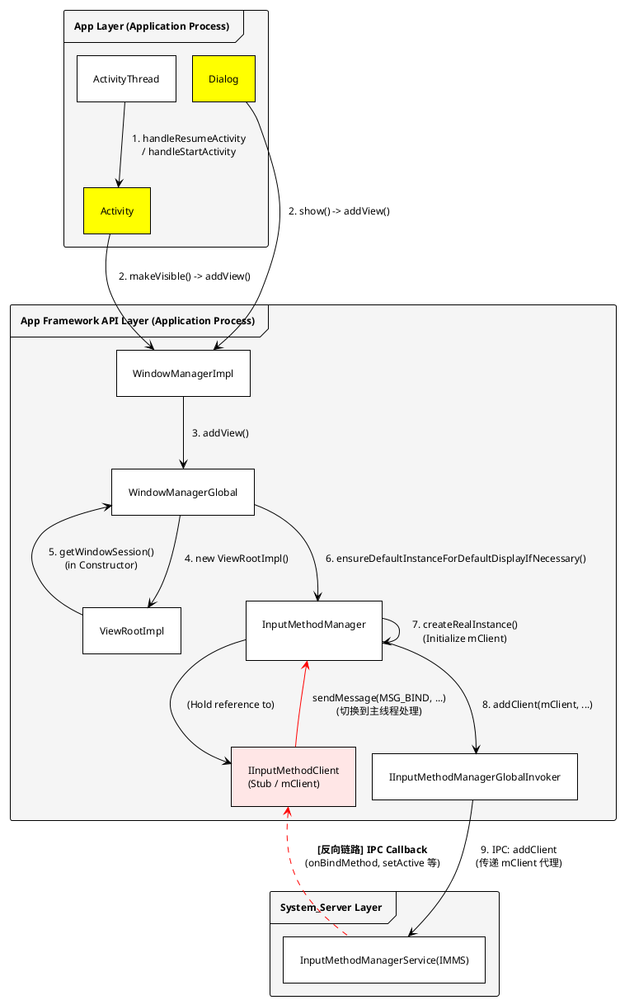

+++
date = '2025-09-29T10:22:54+08:00'
draft = false
title = ' Android 窗口焦点抢占与输入法连接断开技术时序分析'
+++

### 1. 概述

本时序图展示了一个配置为 `TYPE_APPLICATION_OVERLAY` 但缺失 `FLAG_NOT_FOCUSABLE` 属性的悬浮窗口（Overlay），如何在系统层（WMS）和输入法服务层（IMMS）通过标准生命周期回调，强制剥夺底层应用（Browser）的输入法连接权（Input Connection），导致底层应用虽然能响应点击但无法弹出软键盘的异常流程。

### 2. 详细流程阶段解析

#### 第一阶段：WMS 焦点仲裁（Focus Arbitration）

此阶段发生在 Overlay 窗口被添加到系统窗口管理器（WMS）的时刻。

* **触发动作**：Overlay 应用调用 `WindowManager.addView`，参数中未包含 `FLAG_NOT_FOCUSABLE`。
* **WMS 内部逻辑**：
  * `addWindowInner` 触发层级更新，Overlay 被置于 Z-Order 顶层。
  * 随后调用 `updateFocusedWindowLocked` -> `findFocusedWindowIfNeeded` 重新计算全局焦点。
  * **关键判定**：`DisplayContent` 从顶层向下遍历窗口。对于 Overlay 窗口，系统调用 `mayUseInputMethod(flags)` 进行判定。由于 **Missing Flag**，该方法返回 `true`。
* **结果**：WMS 将全局焦点变量 `mCurrentFocus` 锁定为 Overlay，并向各应用进程分发 `windowFocusChanged` 回调（Overlay 为 true，Browser 为 false）。

#### 第二阶段：Overlay 建立连接（Active Connection Establishment）

此阶段发生在 Overlay 应用的主线程（UI Thread）中。

* **触发动作**：Overlay 的 `ViewRootImpl` 收到获焦通知或执行布局遍历（`performTraversals`）。
* **客户端自检**：
  * `ImeFocusController` 执行 `onTraversal` 或 `onPostWindowFocus`。
  * 再次执行本地检查 `WindowManager.LayoutParams.mayUseInputMethod`，结果为 `true`。

* **发起请求**：Overlay 进程通过 `InputMethodManager` 向系统服务发起 IPC 调用 `startInputOrWindowGainedFocus`，理由为 `WINDOW_FOCUS_GAIN`。**这标志着 Overlay 主动向系统宣誓了输入法的主权。**

#### 第三阶段：IMMS 服务端会话切换（Session Switch）

此阶段发生在系统服务进程（System_Server）的 `InputMethodManagerService` 中。

* **状态校验**：IMMS 接收到 Overlay 的请求，对比当前绑定的客户端 `mCurClient`（此时仍指向 Browser）与请求者（Overlay）。
* **强制解绑（Critical Step）**：
  * 发现客户端不一致，IMMS 调用 `prepareClientSwitchLocked`。
  * 执行 `unbindCurrentClientLocked(SWITCH_CLIENT)`。
* **后果**：系统销毁了 Browser 的 `InputMethodSession`，并将 Browser 对应的 `ClientState` 标记为非激活。
* **新绑定**：`mCurClient` 更新为 Overlay。至此，输入法的数据通道已物理切换至 Overlay，Browser 与输入法的连接被彻底切断。

#### 第四阶段：触摸事件与输入焦点的逻辑分离（Touch vs Focus Discrepancy）

此阶段揭示了问题的隐蔽性：用户感知与系统状态的割裂。

* **触摸派发（Touch Dispatch）**：用户点击屏幕。`InputDispatcher` 进行命中测试。由于 Overlay 设置了 `FLAG_NOT_TOUCH_MODAL`（或点击区域位于 Overlay 之外），点击事件（ACTION_DOWN/UP）穿透 Overlay，正常派发给了底层的 Browser。
* **逻辑冲突**：Browser 能够响应 `onClick`，产生一种“我还在前台”的错觉。但根据 WMS 的状态（第一阶段），它实际上处于“可见但无焦点”的状态。

#### 第五阶段：请求被拒（Request Rejection）

此阶段是用户看到的最终故障现象。

* **Browser 发起请求**：Browser 的 EditText 响应点击，调用 `showSoftInput`。
* **拦截点 A（客户端本地拦截）**：`InputMethodManager` 检查本地状态 `checkFocus()`。由于之前收到了 `windowFocusChanged(false)`，`hasServedByInputMethodLocked()` 返回 `false`，请求可能直接在应用进程内被丢弃。
* **拦截点 B（服务端拦截）**：即使请求通过某种方式发出，到达 IMMS 后，服务端的鉴权逻辑会发现 `mCurClient` (Overlay) 与请求者 (Browser) 不匹配，直接返回 `false`。

### 3. 根本原因总结

问题的根源在于 Android 窗口系统中 **Z-Order（显示层级）** 与 **Input Focus（输入焦点）** 的默认关联机制。

* **机制**：默认情况下，可获焦（Focusable）的最高层级窗口自动获得输入焦点。
* **缺陷**：Overlay 窗口作为高层级窗口，若不显式声明放弃焦点（`FLAG_NOT_FOCUSABLE`），系统会依据标准流程将其认定为输入法目标，从而切断其他应用的输入连接。

### 4. 解决方案技术原理

在 Overlay 窗口的 LayoutParams 中添加 `FLAG_NOT_FOCUSABLE`：

1. **阻断第一阶段**：WMS 的 `mayUseInputMethod` 返回 `false`，焦点计算跳过 Overlay，保留在 Browser。
2. **阻断第二阶段**：Overlay 应用内的 `ImeFocusController` 判定不需要输入法，不再发送 `startInputOrWindowGainedFocus` IPC 请求。
3. **保护第三阶段**：IMMS 不会收到切换请求，Browser 的 Session 保持活跃。

---

## 3. 架构分析

### 3.1. 概述

本架构图展示了从应用主线程启动 Activity 或显示 Dialog 开始，到系统底层完成窗口添加，并最终建立应用进程（Client）与系统服务进程（System Server）之间输入法控制通道的完整控制流。

核心逻辑分为两个方向：

1. **前向初始化链路（黑色实线 1-9）**：应用主动向系统注册，申请窗口令牌与输入法客户端身份。
2. **反向控制链路（红色虚线）**：系统服务（IMMS）通过 Binder 回调应用，实现对输入连接生命周期的管理。

### 3.2. 详细工作流程解析

#### 第一阶段：UI 呈现的触发 (UI Presentation Trigger)

此阶段发生在应用的主线程中，由生命周期事件驱动。

* **步骤 1 (Activity 启动)**：`ActivityThread` 作为应用进程的入口，在处理 `handleResumeActivity` 或 `handleStartActivity` 时，驱动 Activity 生命周期流转。
* **步骤 2 (视图添加)**：
* 对于 **Activity**：调用 `makeVisible()`，进而调用 `WindowManager.addView()`。
* 对于 **Dialog**：调用 `show()`，内部同样调用 `WindowManager.addView()`。
* **本质**：无论是 Activity 还是 Dialog，最终都汇聚于 `WindowManagerImpl` 这一接口实现层。

#### 第二阶段：窗口管理与核心组件实例化 (Window & Component Instantiation)

此阶段完成应用侧核心管理对象的创建。

* **步骤 3 (全局代理)**：`WindowManagerImpl` 将请求转发给单例对象 `WindowManagerGlobal`。这是应用进程内所有窗口的统一管理者。
* **步骤 4 (ViewRootImpl 创建)**：`WindowManagerGlobal` 实例化 `ViewRootImpl`。`ViewRootImpl` 是连接 `WindowManagerService` (WMS) 和应用 View 层次结构的桥梁。
* **步骤 5 (会话建立与副作用)**：在 `ViewRootImpl` 构造过程中（或获取 `WindowSession` 时），为了兼容性与初始化需求，会触发 `getWindowSession()`。
* **步骤 6 (IMM 懒加载)**：`getWindowSession()` 方法内部包含防御性逻辑，调用 `InputMethodManager.ensureDefaultInstanceForDefaultDisplayIfNecessary()`，确保输入法管理器（IMM）在窗口会话建立前已准备就绪。

#### 第三阶段：输入法客户端构建与注册 (IMM Client Construction & Registration)

此阶段是建立跨进程通信的关键。

* **步骤 7 (实例创建)**：`InputMethodManager` 执行 `createRealInstance()`。
* **关键动作**：在此过程中，实例化了 **`IInputMethodClient.Stub`**（即图中的 `mClient`）。这是一个 Binder 服务端对象，它将在后续作为应用进程的“代理人”被传递给系统。

* **步骤 8 (IPC 准备)**：IMM 通过 `IInputMethodManagerGlobalInvoker` 封装调用请求。
* **步骤 9 (IPC 调用)**：通过 `addClient(mClient, ...)` 方法，应用进程发起 Binder 跨进程调用，将自身的 `mClient` 存根（Stub）传递给运行在 System Server 中的 `InputMethodManagerService` (IMMS)。

**至此，IMMS 持有了应用的 IInputMethodClient 代理，建立了逻辑上的“握手”。**

---

### 3.3. IInputMethodClient 的核心作用与反向链路

在架构图中，**`IInputMethodClient (Stub / mClient)`**（粉色区域）扮演着至关重要的角色。它是 Android 输入架构中实现 **控制反转（Inversion of Control）** 的关键组件。

#### A. 角色定义

它是定义在应用进程（App Process）中的 Binder 服务端（Stub）。尽管它由 Framework 代码实现，但它运行在应用的 Binder 线程池中。它充当了系统服务（IMMS）对应用进行远程控制的**回调接口（Callback Interface）**。

#### B. 工作机制（反向通信链路 - 红色虚线）

当系统侧的状态发生变化（例如：WMS 判定窗口焦点变更、屏幕息屏、用户切换输入法），IMMS 需要通知应用进行相应的状态同步或资源释放。

1. **系统发起调用**：IMMS 通过持有的 `IInputMethodClient` 代理发起调用（如 `onBindMethod`、`onUnbindMethod`、`setActive`）。
2. **跨进程传输**：Binder 驱动将请求传输至应用进程。
3. **Binder 线程响应**：应用进程的 Binder 线程池接收请求，执行 `IInputMethodClient.Stub` 中的方法。
4. **线程切换**：
* 由于 Android UI 工具包不是线程安全的，Binder 线程不能直接操作 View 或 IMM 的内部状态。
* 因此，Stub 方法（如图示红线）通常通过 `sendMessage(MSG_BIND, ...)` 将操作封装为消息，发送给主线程的 `Handler`。

5. **主线程执行**：主线程处理消息，完成最终的逻辑（如建立 `InputConnection`、销毁资源、重置状态）。

#### C. 核心价值

`IInputMethodClient` 的存在使得系统服务能够：

* **异步管理生命周期**：在不阻塞系统服务的前提下，通知应用建立或断开输入连接。
* **强制状态同步**：当系统判定应用失去焦点时（如 Overlay 案例），可以通过此接口强制应用断开连接，确保系统状态的一致性。

总结而言，`IInputMethodClient` 是应用主动暴露给系统的“控制句柄”，它是输入法服务能够通过标准 IPC 机制调度应用行为的基础。
